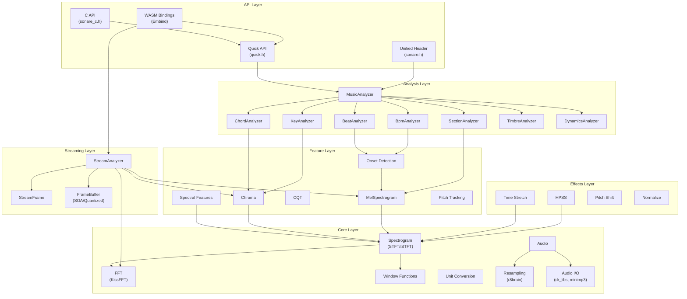
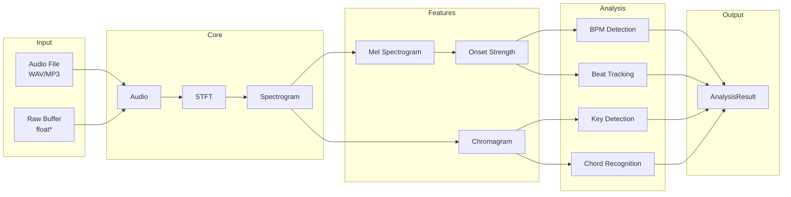
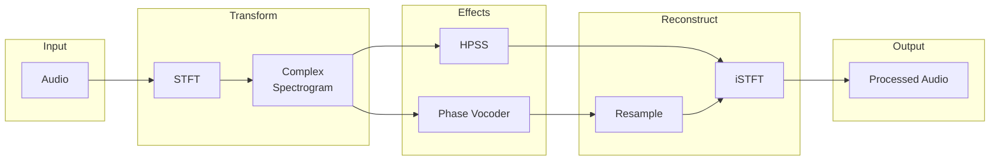
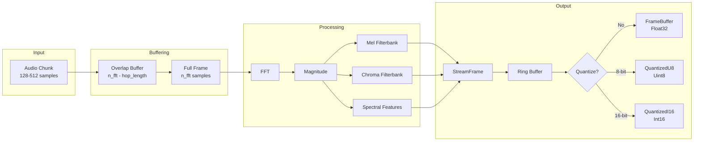

# Architecture

This document describes the internal architecture of libsonare.

## Module Overview



## Directory Structure

```
src/
├── util/               # Level 0: Basic utilities
│   ├── types.h         # MatrixView, ErrorCode, enums
│   ├── exception.h     # SonareException
│   └── math_utils.h    # mean, variance, argmax, etc.
│
├── core/               # Level 1-3: Core DSP
│   ├── convert.h       # Hz/Mel/MIDI conversion
│   ├── window.h        # Hann, Hamming, Blackman
│   ├── fft.h           # KissFFT wrapper
│   ├── spectrum.h      # STFT/iSTFT
│   ├── audio.h         # Audio buffer
│   ├── audio_io.h      # WAV/MP3 loading
│   └── resample.h      # r8brain resampling
│
├── filters/            # Level 4: Filterbanks
│   ├── mel.h           # Mel filterbank
│   ├── chroma.h        # Chroma filterbank
│   ├── dct.h           # DCT for MFCC
│   └── iir.h           # IIR filters
│
├── feature/            # Level 4: Feature extraction
│   ├── mel_spectrogram.h
│   ├── chroma.h
│   ├── spectral.h
│   ├── onset.h
│   └── pitch.h
│
├── effects/            # Level 5: Audio effects
│   ├── hpss.h
│   ├── time_stretch.h
│   ├── pitch_shift.h
│   └── normalize.h
│
├── analysis/           # Level 6: Music analysis
│   ├── music_analyzer.h
│   ├── bpm_analyzer.h
│   ├── key_analyzer.h
│   ├── beat_analyzer.h
│   ├── chord_analyzer.h
│   ├── section_analyzer.h
│   └── ...
│
├── streaming/          # Level 6: Real-time streaming
│   ├── stream_analyzer.h   # Main streaming analyzer
│   ├── stream_config.h     # Configuration options
│   └── stream_frame.h      # Frame and buffer types
│
├── quick.h             # Simple function API
├── sonare.h            # Unified include header
├── sonare_c.h          # C API header
└── wasm/
    └── bindings.cpp    # Embind bindings
```

## Data Flow

### Audio Analysis Pipeline



### Audio Effects Pipeline



### Streaming Pipeline

The streaming pipeline processes audio in real-time, maintaining overlap state between chunks.



::: info Progressive Estimation
The streaming pipeline also accumulates chroma and onset data for progressive BPM/key estimation. Estimates are updated periodically (default: BPM every 10s, key every 5s) and improve in confidence over time.
:::

## Key Design Decisions

### Lazy Initialization

MusicAnalyzer uses lazy initialization for individual analyzers:

```cpp
// Only BPM is computed
float bpm = analyzer.bpm();

// Key detection triggers chroma computation
Key key = analyzer.key();

// Full analysis computes everything
AnalysisResult result = analyzer.analyze();
```

### Zero-Copy Audio Slicing

Audio uses `shared_ptr` with offset/size for zero-copy slicing:

```cpp
auto full = Audio::from_file("song.mp3");

// Both share same underlying buffer
auto intro = full.slice(0, 30);     // 0-30 sec
auto chorus = full.slice(60, 90);   // 60-90 sec
```

### WASM Compatibility

Core modules avoid:
- File I/O (handled by Audio I/O layer)
- Threading (single-threaded execution)
- Dynamic loading
- System-specific APIs

### librosa Compatibility

Default parameters match librosa:

| Parameter | Default |
|-----------|---------|
| sample_rate | 22050 |
| n_fft | 2048 |
| hop_length | 512 |
| n_mels | 128 |
| fmin | 0 |
| fmax | sr/2 |

## Third-Party Libraries

| Library | Purpose | License |
|---------|---------|---------|
| KissFFT | FFT | BSD-3-Clause |
| Eigen3 | Matrix ops | MPL-2.0 |
| dr_libs | WAV decode | Public Domain |
| minimp3 | MP3 decode | CC0-1.0 |
| r8brain | Resampling | MIT |

## WASM Compilation

```
Output: ~228KB WASM + ~34KB JS
Build: Emscripten with Embind
Flags: -sWASM=1 -sMODULARIZE=1 -sEXPORT_ES6=1
```
