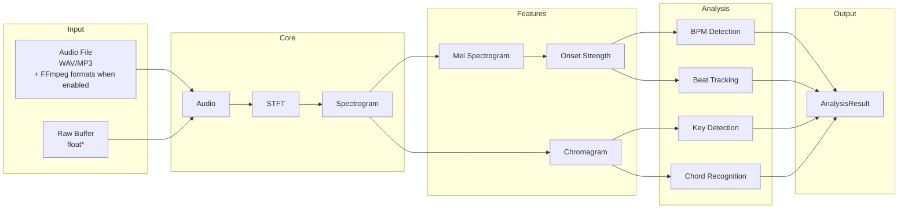
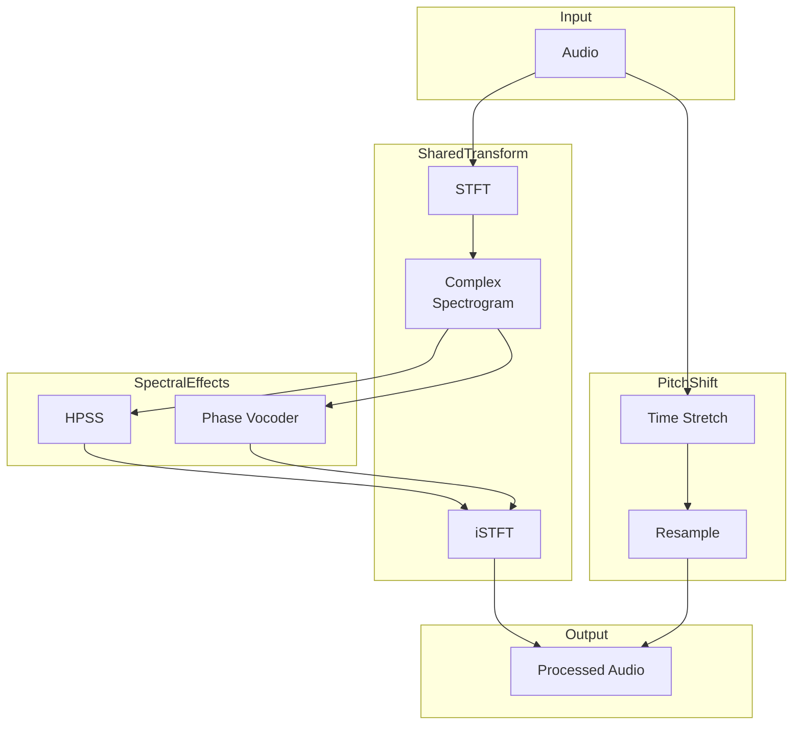
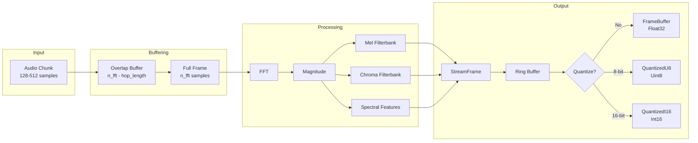

# Architecture

This document describes the internal architecture of libsonare.

Use this page after the task and runtime guides. It is an internal map for contributors and integrators who need to understand how public APIs connect to the C++ core.

::: info How to read the layers
The outer API layers are what apps call. The core and feature layers are where reusable signal-processing work happens. Bindings should stay thin: they translate language shapes into the same C++ behavior rather than reimplementing DSP.
:::

## What You Will Learn

By the end of this page you should be able to:

- trace a public call from WASM, C, quick API, or `sonare.h` into analysis, streaming, effects, mastering, mixing, and engine modules;
- identify which source directories own each subsystem;
- understand where shared DSP, feature extraction, realtime processing, and language bindings meet;
- decide whether a change belongs in a core module, a binding wrapper, a demo component, or documentation.

## Module Overview


```mermaid
graph TB
    subgraph "API Layer"
        WASM["WASM Bindings<br/>(Embind)"]
        CAPI["C API<br/>(sonare_c*.h)"]
        QUICK["Quick API<br/>(quick.h)"]
        UNIFIED["Unified Header<br/>(sonare.h)"]
    end

    subgraph "Streaming Layer"
        STREAM["StreamAnalyzer"]
        FRAME["StreamFrame"]
        BUFFER["FrameBuffer<br/>(SOA/Quantized)"]
    end

    subgraph "Analysis Layer"
        MUSIC["MusicAnalyzer"]
        BPM["BpmAnalyzer"]
        KEY["KeyAnalyzer"]
        BEAT["BeatAnalyzer"]
        CHORD["ChordAnalyzer"]
        SECTION["SectionAnalyzer"]
        BOUNDARY["BoundaryDetector"]
        TIMBRE["TimbreAnalyzer"]
        DYNAMICS["DynamicsAnalyzer"]
        RHYTHM["RhythmAnalyzer"]
        MELODY["MelodyAnalyzer"]
        ACOUSTIC["AcousticAnalyzer"]
        ROOMEST["RoomEstimator"]
    end

    subgraph "Effects Layer"
        HPSS["HPSS"]
        TIMESTRETCH["Time Stretch"]
        PITCHSHIFT["Pitch Shift"]
        NORMALIZE["Normalize"]
        SILENCE["Silence Trim/Split"]
        PREEMPH["Pre/De-emphasis"]
        DECOMPOSE["Decompose<br/>(NMF)"]
        REVERB["Reverbs<br/>(convolution/plate/FDN/<br/>velvet/room)"]
        CREATIVE["Creative FX<br/>(delay/chorus/flanger/phaser)"]
        ROOMMORPH["Room Morph"]
        VOICE["Voice Change<br/>& pitch editing"]
    end

    subgraph "Mastering & Mixing Layer"
        MASTERCHAIN["MasteringChain<br/>(eq/dynamics/spectral/<br/>stereo/maximizer/loudness)"]
        STREAMMASTER["StreamingMasteringChain"]
        STREAMEQ["StreamingEqualizer"]
        MIXER["Mixer<br/>(channel strips/buses/sends)"]
        ENGINE["RealtimeEngine<br/>(transport/clips/automation)"]
        METER["Metering<br/>(LUFS/true-peak/goniometer)"]
    end

    subgraph "Feature Layer"
        MEL["MelSpectrogram"]
        CHROMA["Chroma"]
        CQT["CQT"]
        VQT["VQT"]
        SPECTRAL["Spectral Features"]
        ONSET["Onset Detection"]
        PITCH["Pitch Tracking"]
        INVERSE["Inverse Features<br/>(Mel/MFCC reconstruction)"]
    end

    subgraph "Core Layer"
        AUDIO["Audio"]
        SPECTRUM["Spectrogram<br/>(STFT/iSTFT)"]
        FFT["FFT<br/>(KissFFT)"]
        WINDOW["Window Functions"]
        CONVERT["Unit Conversion"]
        RESAMPLE["Resampling<br/>(r8brain)"]
        AUDIO_IO["Audio I/O<br/>(dr_libs, minimp3)"]
    end

    subgraph "Acoustic Simulation Layer"
        ROOMMODEL["Room Model<br/>(shoebox/materials)"]
        RIR["RIR Synthesizer<br/>(image source + late tail)"]
        MATERIAL["Material Presets"]
    end

    WASM --> QUICK
    WASM --> STREAM
    WASM --> CAPI
    CAPI --> QUICK
    CAPI --> STREAM
    CAPI --> MASTERCHAIN
    CAPI --> MIXER
    CAPI --> ENGINE
    UNIFIED --> MUSIC
    QUICK --> MUSIC

    STREAM --> FRAME
    STREAM --> BUFFER
    STREAM --> FFT
    STREAM --> MEL
    STREAM --> CHROMA

    MUSIC --> BPM
    MUSIC --> KEY
    MUSIC --> BEAT
    MUSIC --> CHORD
    MUSIC --> SECTION
    MUSIC --> BOUNDARY
    MUSIC --> TIMBRE
    MUSIC --> DYNAMICS
    MUSIC --> RHYTHM
    MUSIC --> MELODY
    QUICK --> ACOUSTIC
    QUICK --> ROOMEST

    BPM --> ONSET
    KEY --> CHROMA
    BEAT --> ONSET
    CHORD --> CHROMA
    SECTION --> MEL
    BOUNDARY --> MEL
    MELODY --> PITCH
    ACOUSTIC --> SPECTRUM
    ROOMEST --> ACOUSTIC
    ROOMEST --> RIR

    HPSS --> SPECTRUM
    TIMESTRETCH --> SPECTRUM
    PITCHSHIFT --> TIMESTRETCH
    PITCHSHIFT --> RESAMPLE
    REVERB --> RIR
    ROOMMORPH --> RIR
    VOICE --> TIMESTRETCH

    WASM --> MASTERCHAIN
    WASM --> STREAMMASTER
    WASM --> STREAMEQ
    WASM --> MIXER
    WASM --> ENGINE
    MASTERCHAIN --> SPECTRUM
    MIXER --> METER
    ENGINE --> MIXER

    MEL --> SPECTRUM
    CHROMA --> SPECTRUM
    CQT --> FFT
    VQT --> CQT
    SPECTRAL --> SPECTRUM
    ONSET --> MEL
    INVERSE --> MEL
    INVERSE --> SPECTRUM

    SPECTRUM --> FFT
    SPECTRUM --> WINDOW
    AUDIO --> AUDIO_IO
    AUDIO --> RESAMPLE
    RIR --> ROOMMODEL
    ROOMMODEL --> MATERIAL
```

## Page Map

| If you are looking at... | Read... |
|--------------------------|---------|
| `analysis/` and `feature/` | [JavaScript API](./js-api.md), [Python API](./python-api.md), [librosa Compatibility](./librosa-compatibility.md) |
| `analysis/acoustic_analyzer.*`, `analysis/room_estimator.*`, `src/acoustic/`, or `effects/acoustic/` | [Room Acoustics](./acoustic-analysis.md), [Algorithm References](./algorithm-references.md#scope-boundaries) |
| `streaming/` | [Realtime and Streaming](./realtime-streaming.md) |
| `mastering/` | [Mastering Processors](./mastering-processors.md), [DSP Implementation Notes](./dsp-implementation.md), [Mastering Assistant](./mastering-assistant.md) |
| `mixing/` | [Mixing Engine](./mixing.md), [Mixing Scene JSON](./mixing-scene-json.md) |
| `engine/`, `transport/`, `automation/`, `graph/`, `rt/` | [Realtime and Streaming](./realtime-streaming.md), especially `RealtimeEngine` |
| `editing/` and `effects/` | [Editing DSP](./editing-dsp.md), [DSP Implementation Notes](./dsp-implementation.md#effects-and-editing-dsp) |
| `sonare_c*.h` and binding folders | [Binding Parity](./binding-parity.md), [Native Bindings](./native-bindings.md), [C++ API](./cpp-api.md) |

## Directory Structure

```
src/
├── util/               # Level 0: Basic utilities
│   ├── types.h         # MatrixView, ErrorCode, enums
│   ├── exception.h     # SonareException
│   └── math_utils.h    # mean, variance, argmax, etc.
│
├── core/               # Level 1-3: Core DSP
│   ├── convert.h       # Hz/Mel/MIDI conversion
│   ├── window.h        # Hann, Hamming, Blackman
│   ├── fft.h           # KissFFT wrapper
│   ├── spectrum.h      # STFT/iSTFT
│   ├── audio.h         # Audio buffer
│   ├── audio_io.h      # WAV/MP3 loading, optional FFmpeg-backed formats
│   └── resample.h      # r8brain resampling
│
├── filters/            # Level 4: Filterbanks
│   ├── mel.h           # Mel filterbank
│   ├── chroma.h        # Chroma filterbank
│   ├── dct.h           # DCT for MFCC
│   └── iir.h           # IIR filters
│
├── feature/            # Level 4: Feature extraction
│   ├── mel_spectrogram.h
│   ├── chroma.h
│   ├── cqt.h
│   ├── vqt.h
│   ├── inverse.h
│   ├── spectral.h
│   ├── onset.h
│   └── pitch.h
│
├── effects/            # Level 5: Audio effects
│   ├── hpss.h
│   ├── phase_vocoder.h
│   ├── time_stretch.h
│   ├── pitch_shift.h
│   ├── normalize.h
│   ├── preemphasis.h
│   ├── silence.h
│   ├── decompose.h
│   ├── remix.h
│   ├── delay/ modulation/ reverb/
│   ├── acoustic/       # room_morph
│   └── common/
│
├── acoustic/           # Geometric room acoustics
│   ├── room_model.* room_types.* material.*
│   ├── image_source.*  # early reflections
│   ├── late_reverb.*   # deterministic late tail
│   └── rir_synthesizer.*
│
├── analysis/           # Level 6: Music analysis
│   ├── music_analyzer.h
│   ├── bpm_analyzer.h
│   ├── key_analyzer.h
│   ├── beat_analyzer.h
│   ├── downbeat_analyzer.h
│   ├── meter_analyzer.h
│   ├── chord_analyzer.h
│   ├── section_analyzer.h
│   ├── boundary_detector.h
│   ├── melody_analyzer.h
│   ├── rhythm_analyzer.h
│   ├── timbre_analyzer.h
│   ├── dynamics_analyzer.h
│   ├── acoustic_analyzer.h
│   ├── room_estimator.h
│   └── ...
│
├── streaming/          # Level 6: Real-time streaming
│   ├── stream_analyzer.h   # Main streaming analyzer
│   ├── stream_config.h     # Configuration options
│   └── stream_frame.h      # Frame and buffer types
│
├── mastering/          # Mastering engine
│   ├── api/            # Chain, registry, 25 presets, 57 solo processors + pair/stereo registries
│   ├── eq/ dynamics/ spectral/ stereo/ final/
│   ├── maximizer/ multiband/ saturation/ repair/
│   ├── match/ assistant/                 # Reference match + assistant/profile
│   └── common/        # Shared biquad/loudness helpers
│
├── mixing/             # Mixing engine
│   ├── channel_strip.* # Strip: trim/insert/pan/width/sends
│   ├── bus.* sends.* vca_group.* panner.*
│   └── api/            # Scene JSON + scene presets
│
├── engine/             # Realtime engine (transport/clips/graph)
├── automation/         # Automation lanes + curve shapes
├── metering/           # LUFS, true-peak, phase scope/goniometer
├── graph/  rt/  transport/   # DSP graph, RT-safe primitives, transport
├── editing/            # Pitch editor, voice changer, note stretch
│
├── quick.h             # Simple function API
├── sonare.h            # Unified include header
├── sonare_c*.h         # C API aggregate and module headers
└── wasm/
    └── bindings.cpp    # Embind bindings
```

## Data Flow

### Audio Analysis Pipeline


```mermaid
flowchart LR
    subgraph Input
        FILE[Audio File<br/>WAV/MP3<br/>+ FFmpeg formats when enabled]
        BUFFER[Raw Buffer<br/>float*]
    end

    subgraph Core
        AUDIO[Audio]
        STFT[STFT]
        SPEC[Spectrogram]
    end

    subgraph Features
        MEL[Mel Spectrogram]
        CHROMA[Chromagram]
        ONSET[Onset Strength]
    end

    subgraph Analysis
        BPM[BPM Detection]
        KEY[Key Detection]
        BEAT[Beat Tracking]
        CHORD[Chord Recognition]
    end

    subgraph Output
        RESULT[AnalysisResult]
    end

    FILE --> AUDIO
    BUFFER --> AUDIO
    AUDIO --> STFT
    STFT --> SPEC
    SPEC --> MEL
    SPEC --> CHROMA
    MEL --> ONSET
    ONSET --> BPM
    ONSET --> BEAT
    CHROMA --> KEY
    CHROMA --> CHORD
    BPM --> RESULT
    KEY --> RESULT
    BEAT --> RESULT
    CHORD --> RESULT
```

### Audio Effects Pipeline


```mermaid
flowchart TB
    subgraph Input
        AUDIO[Audio]
    end

    subgraph SharedTransform
        STFT[STFT]
        SPEC[Complex<br/>Spectrogram]
        ISTFT[iSTFT]
    end

    subgraph SpectralEffects
        HPSS[HPSS]
        PV[Phase Vocoder]
    end

    subgraph PitchShift
        TS[Time Stretch]
        RESAMPLE[Resample]
    end

    subgraph Output
        OUT[Processed Audio]
    end

    AUDIO --> STFT
    STFT --> SPEC
    SPEC --> HPSS
    SPEC --> PV
    HPSS --> ISTFT
    PV --> ISTFT
    AUDIO --> TS
    TS --> RESAMPLE
    ISTFT --> OUT
    RESAMPLE --> OUT
```

::: details What is a phase vocoder?
A phase vocoder is the standard way to time-stretch audio (or, combined with resampling, pitch-shift it) without obvious artifacts. It takes the STFT and *advances the phase* of each frequency bin to fit the new timeline before reconstructing, so a sound can be made longer or shorter while its pitch and spectral character stay intact. libsonare uses it for `timeStretch` / `pitchShift` and the editing-DSP voice tools.
:::

### Streaming Pipeline

The streaming pipeline processes audio in real time, maintaining overlap state between chunks.


```mermaid
flowchart LR
    subgraph Input
        CHUNK[Audio Chunk<br/>128-512 samples]
    end

    subgraph Buffering
        OVERLAP[Overlap Buffer<br/>n_fft - hop_length]
        FRAME[Full Frame<br/>n_fft samples]
    end

    subgraph Processing
        FFT[FFT]
        MAG[Magnitude]
        MEL[Mel Filterbank]
        CHROMA[Chroma Filterbank]
        SPECTRAL[Spectral Features]
    end

    subgraph Output
        STREAMFRAME[StreamFrame]
        RING[Ring Buffer]
        QUANT{Quantize?}
        SOA[FrameBuffer<br/>Float32]
        U8[QuantizedU8<br/>Uint8]
        I16[QuantizedI16<br/>Int16]
    end

    CHUNK --> OVERLAP
    OVERLAP --> FRAME
    FRAME --> FFT
    FFT --> MAG
    MAG --> MEL
    MAG --> CHROMA
    MAG --> SPECTRAL
    MEL --> STREAMFRAME
    CHROMA --> STREAMFRAME
    SPECTRAL --> STREAMFRAME
    STREAMFRAME --> RING
    RING --> QUANT
    QUANT -->|No| SOA
    QUANT -->|8-bit| U8
    QUANT -->|16-bit| I16
```

::: info Progressive Estimation
The streaming pipeline also accumulates chroma and onset data for progressive BPM/key estimation. Estimates are updated periodically (default: BPM every 10s, key every 5s) and improve in confidence over time.
:::

## Key Design Decisions

### Lazy Initialization

MusicAnalyzer initializes sub-analyzers on demand. Each intermediate (STFT, chroma, onset envelope, etc.) is computed the first time it's needed and reused afterwards.

```cpp
// BPM only (computes onset envelope)
float bpm = analyzer.bpm();

// Key detection triggers chroma computation
Key key = analyzer.key();

// Full analysis fills in what's left
AnalysisResult result = analyzer.analyze();
```

::: tip Why this matters
Asking just for the key does **not** force chord recognition or section detection to run. Conversely, calling `analyze()` once reuses any intermediates already computed — no redundant FFTs.
:::

### Zero-Copy Audio Slicing

Audio uses `shared_ptr` with offset/size for zero-copy slicing:

```cpp
auto full = Audio::from_file("song.mp3");

// Both share same underlying buffer
auto intro = full.slice(0, 30);     // 0-30 sec
auto chorus = full.slice(60, 90);   // 60-90 sec
```

### WASM Compatibility

The npm/WebAssembly package exposes sample-based APIs. It expects decoded mono
`Float32Array` samples and does not bundle file decoding. Browser applications
typically decode files with the Web Audio API or another JavaScript decoder
before calling libsonare.

WASM builds avoid native file I/O and FFmpeg-backed decoding. Runtime behavior is
single-threaded unless a future build explicitly enables browser threading.

### librosa Compatibility

Many DSP defaults intentionally mirror common librosa values, but libsonare is
not a drop-in replacement. In particular, libsonare usually requires the caller
to provide the sample rate; it does not implicitly resample to 22050 Hz the way
`librosa.load()` does by default.

| Parameter | Default |
|-----------|---------|
| sample_rate | User-provided |
| n_fft | 2048 |
| hop_length | 512 |
| n_mels | 128 |
| fmin | 0 |
| fmax | sr/2 |

## Third-Party Libraries

| Library | Purpose | License |
|---------|---------|---------|
| KissFFT | FFT | BSD-3-Clause |
| Eigen3 | Matrix ops | MPL-2.0 |
| dr_libs | WAV decode | Public Domain |
| minimp3 | MP3 decode | CC0-1.0 |
| FFmpeg | Optional extended file decoding | LGPL/GPL depending on linked build |
| r8brain | Resampling | MIT |

## WASM Compilation

```
Output: ~{{ wasmMeta.wasm.sizeKB }} KB WASM (~{{ wasmMeta.wasm.gzipKB }} KB gzipped) plus the JS glue;
        ~{{ wasmMeta.total.sizeKB }} KB total (~{{ wasmMeta.total.gzipKB }} KB gzipped) — see src/wasm/meta.json
Build:  Emscripten with Embind
Flags:  -sWASM=1 -sMODULARIZE=1 -sEXPORT_ES6=1
```

The full mastering + mixing + analysis surface accounts for the bundle size; an analysis-only build would be smaller.
