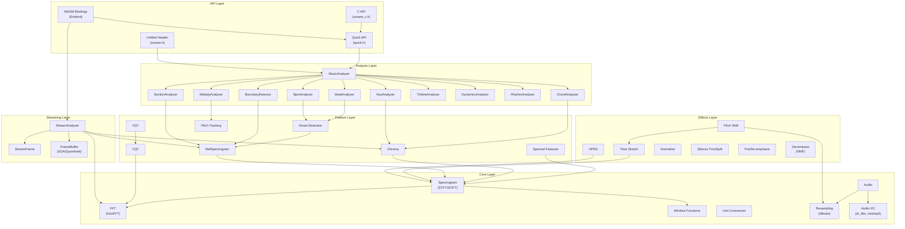
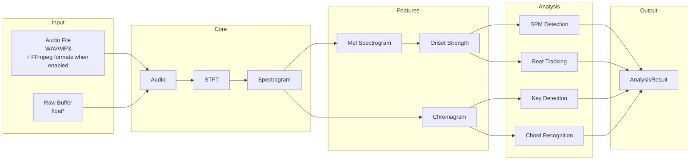
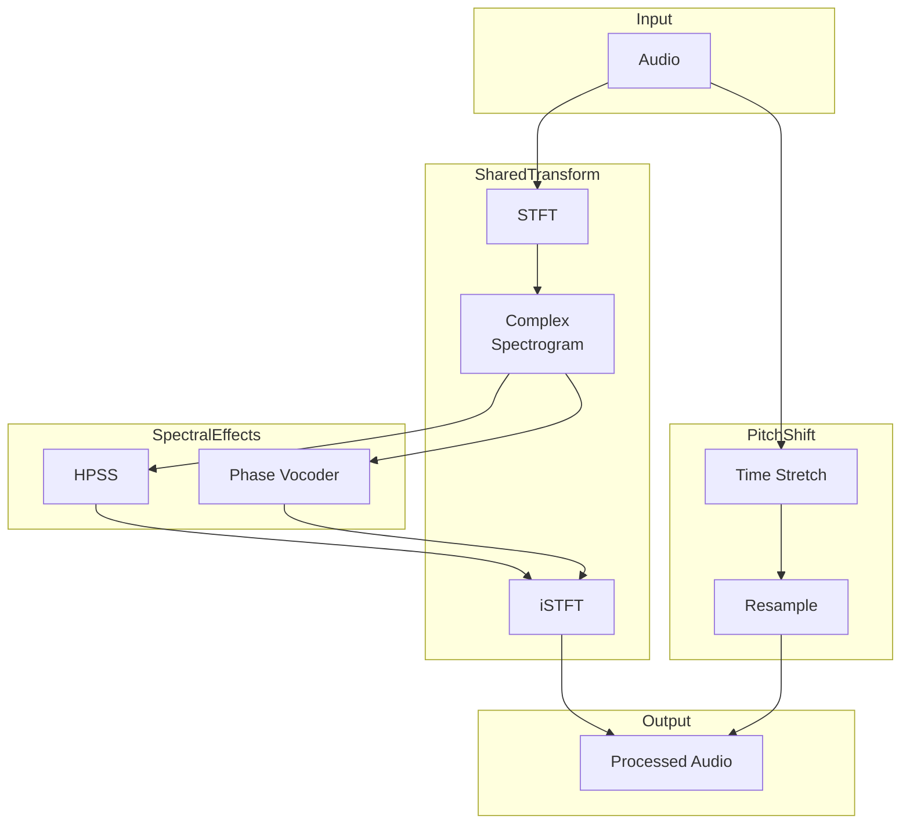
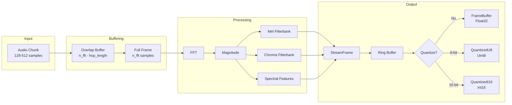

# Architecture

This document describes the internal architecture of libsonare.

## Module Overview


```mermaid
graph TB
    subgraph "API Layer"
        WASM["WASM Bindings<br/>(Embind)"]
        CAPI["C API<br/>(sonare_c.h)"]
        QUICK["Quick API<br/>(quick.h)"]
        UNIFIED["Unified Header<br/>(sonare.h)"]
    end

    subgraph "Streaming Layer"
        STREAM["StreamAnalyzer"]
        FRAME["StreamFrame"]
        BUFFER["FrameBuffer<br/>(SOA/Quantized)"]
    end

    subgraph "Analysis Layer"
        MUSIC["MusicAnalyzer"]
        BPM["BpmAnalyzer"]
        KEY["KeyAnalyzer"]
        BEAT["BeatAnalyzer"]
        CHORD["ChordAnalyzer"]
        SECTION["SectionAnalyzer"]
        BOUNDARY["BoundaryDetector"]
        TIMBRE["TimbreAnalyzer"]
        DYNAMICS["DynamicsAnalyzer"]
        RHYTHM["RhythmAnalyzer"]
        MELODY["MelodyAnalyzer"]
    end

    subgraph "Effects Layer"
        HPSS["HPSS"]
        TIMESTRETCH["Time Stretch"]
        PITCHSHIFT["Pitch Shift"]
        NORMALIZE["Normalize"]
        SILENCE["Silence Trim/Split"]
        PREEMPH["Pre/De-emphasis"]
        DECOMPOSE["Decompose<br/>(NMF)"]
    end

    subgraph "Feature Layer"
        MEL["MelSpectrogram"]
        CHROMA["Chroma"]
        CQT["CQT"]
        VQT["VQT"]
        SPECTRAL["Spectral Features"]
        ONSET["Onset Detection"]
        PITCH["Pitch Tracking"]
    end

    subgraph "Core Layer"
        AUDIO["Audio"]
        SPECTRUM["Spectrogram<br/>(STFT/iSTFT)"]
        FFT["FFT<br/>(KissFFT)"]
        WINDOW["Window Functions"]
        CONVERT["Unit Conversion"]
        RESAMPLE["Resampling<br/>(r8brain)"]
        AUDIO_IO["Audio I/O<br/>(dr_libs, minimp3)"]
    end

    WASM --> QUICK
    WASM --> STREAM
    CAPI --> QUICK
    UNIFIED --> MUSIC
    QUICK --> MUSIC

    STREAM --> FRAME
    STREAM --> BUFFER
    STREAM --> FFT
    STREAM --> MEL
    STREAM --> CHROMA

    MUSIC --> BPM
    MUSIC --> KEY
    MUSIC --> BEAT
    MUSIC --> CHORD
    MUSIC --> SECTION
    MUSIC --> BOUNDARY
    MUSIC --> TIMBRE
    MUSIC --> DYNAMICS
    MUSIC --> RHYTHM
    MUSIC --> MELODY

    BPM --> ONSET
    KEY --> CHROMA
    BEAT --> ONSET
    CHORD --> CHROMA
    SECTION --> MEL
    BOUNDARY --> MEL
    MELODY --> PITCH

    HPSS --> SPECTRUM
    TIMESTRETCH --> SPECTRUM
    PITCHSHIFT --> TIMESTRETCH
    PITCHSHIFT --> RESAMPLE

    MEL --> SPECTRUM
    CHROMA --> SPECTRUM
    CQT --> FFT
    VQT --> CQT
    SPECTRAL --> SPECTRUM
    ONSET --> MEL

    SPECTRUM --> FFT
    SPECTRUM --> WINDOW
    AUDIO --> AUDIO_IO
    AUDIO --> RESAMPLE
```

## Directory Structure

```
src/
├── util/               # Level 0: Basic utilities
│   ├── types.h         # MatrixView, ErrorCode, enums
│   ├── exception.h     # SonareException
│   └── math_utils.h    # mean, variance, argmax, etc.
│
├── core/               # Level 1-3: Core DSP
│   ├── convert.h       # Hz/Mel/MIDI conversion
│   ├── window.h        # Hann, Hamming, Blackman
│   ├── fft.h           # KissFFT wrapper
│   ├── spectrum.h      # STFT/iSTFT
│   ├── audio.h         # Audio buffer
│   ├── audio_io.h      # WAV/MP3 loading, optional FFmpeg-backed formats
│   └── resample.h      # r8brain resampling
│
├── filters/            # Level 4: Filterbanks
│   ├── mel.h           # Mel filterbank
│   ├── chroma.h        # Chroma filterbank
│   ├── dct.h           # DCT for MFCC
│   └── iir.h           # IIR filters
│
├── feature/            # Level 4: Feature extraction
│   ├── mel_spectrogram.h
│   ├── chroma.h
│   ├── cqt.h
│   ├── vqt.h
│   ├── spectral.h
│   ├── onset.h
│   └── pitch.h
│
├── effects/            # Level 5: Audio effects
│   ├── hpss.h
│   ├── phase_vocoder.h
│   ├── time_stretch.h
│   ├── pitch_shift.h
│   ├── normalize.h
│   ├── preemphasis.h
│   ├── silence.h
│   ├── decompose.h
│   └── remix.h
│
├── analysis/           # Level 6: Music analysis
│   ├── music_analyzer.h
│   ├── bpm_analyzer.h
│   ├── key_analyzer.h
│   ├── beat_analyzer.h
│   ├── chord_analyzer.h
│   ├── section_analyzer.h
│   ├── boundary_detector.h
│   ├── melody_analyzer.h
│   ├── rhythm_analyzer.h
│   ├── timbre_analyzer.h
│   ├── dynamics_analyzer.h
│   └── ...
│
├── streaming/          # Level 6: Real-time streaming
│   ├── stream_analyzer.h   # Main streaming analyzer
│   ├── stream_config.h     # Configuration options
│   └── stream_frame.h      # Frame and buffer types
│
├── quick.h             # Simple function API
├── sonare.h            # Unified include header
├── sonare_c.h          # C API header
└── wasm/
    └── bindings.cpp    # Embind bindings
```

## Data Flow

### Audio Analysis Pipeline


```mermaid
flowchart LR
    subgraph Input
        FILE[Audio File<br/>WAV/MP3<br/>+ FFmpeg formats when enabled]
        BUFFER[Raw Buffer<br/>float*]
    end

    subgraph Core
        AUDIO[Audio]
        STFT[STFT]
        SPEC[Spectrogram]
    end

    subgraph Features
        MEL[Mel Spectrogram]
        CHROMA[Chromagram]
        ONSET[Onset Strength]
    end

    subgraph Analysis
        BPM[BPM Detection]
        KEY[Key Detection]
        BEAT[Beat Tracking]
        CHORD[Chord Recognition]
    end

    subgraph Output
        RESULT[AnalysisResult]
    end

    FILE --> AUDIO
    BUFFER --> AUDIO
    AUDIO --> STFT
    STFT --> SPEC
    SPEC --> MEL
    SPEC --> CHROMA
    MEL --> ONSET
    ONSET --> BPM
    ONSET --> BEAT
    CHROMA --> KEY
    CHROMA --> CHORD
    BPM --> RESULT
    KEY --> RESULT
    BEAT --> RESULT
    CHORD --> RESULT
```

### Audio Effects Pipeline


```mermaid
flowchart TB
    subgraph Input
        AUDIO[Audio]
    end

    subgraph SharedTransform
        STFT[STFT]
        SPEC[Complex<br/>Spectrogram]
        ISTFT[iSTFT]
    end

    subgraph SpectralEffects
        HPSS[HPSS]
        PV[Phase Vocoder]
    end

    subgraph PitchShift
        TS[Time Stretch]
        RESAMPLE[Resample]
    end

    subgraph Output
        OUT[Processed Audio]
    end

    AUDIO --> STFT
    STFT --> SPEC
    SPEC --> HPSS
    SPEC --> PV
    HPSS --> ISTFT
    PV --> ISTFT
    AUDIO --> TS
    TS --> RESAMPLE
    ISTFT --> OUT
    RESAMPLE --> OUT
```

### Streaming Pipeline

The streaming pipeline processes audio in real-time, maintaining overlap state between chunks.


```mermaid
flowchart LR
    subgraph Input
        CHUNK[Audio Chunk<br/>128-512 samples]
    end

    subgraph Buffering
        OVERLAP[Overlap Buffer<br/>n_fft - hop_length]
        FRAME[Full Frame<br/>n_fft samples]
    end

    subgraph Processing
        FFT[FFT]
        MAG[Magnitude]
        MEL[Mel Filterbank]
        CHROMA[Chroma Filterbank]
        SPECTRAL[Spectral Features]
    end

    subgraph Output
        STREAMFRAME[StreamFrame]
        RING[Ring Buffer]
        QUANT{Quantize?}
        SOA[FrameBuffer<br/>Float32]
        U8[QuantizedU8<br/>Uint8]
        I16[QuantizedI16<br/>Int16]
    end

    CHUNK --> OVERLAP
    OVERLAP --> FRAME
    FRAME --> FFT
    FFT --> MAG
    MAG --> MEL
    MAG --> CHROMA
    MAG --> SPECTRAL
    MEL --> STREAMFRAME
    CHROMA --> STREAMFRAME
    SPECTRAL --> STREAMFRAME
    STREAMFRAME --> RING
    RING --> QUANT
    QUANT -->|No| SOA
    QUANT -->|8-bit| U8
    QUANT -->|16-bit| I16
```

::: info Progressive Estimation
The streaming pipeline also accumulates chroma and onset data for progressive BPM/key estimation. Estimates are updated periodically (default: BPM every 10s, key every 5s) and improve in confidence over time.
:::

## Key Design Decisions

### Lazy Initialization

MusicAnalyzer initialises sub-analyzers on demand. Each intermediate (STFT, chroma, onset envelope, etc.) is computed the first time it's needed and reused afterwards.

```cpp
// BPM only (computes onset envelope)
float bpm = analyzer.bpm();

// Key detection triggers chroma computation
Key key = analyzer.key();

// Full analysis fills in what's left
AnalysisResult result = analyzer.analyze();
```

::: tip Why this matters
Asking just for the key does **not** force chord recognition or section detection to run. Conversely, calling `analyze()` once reuses any intermediates already computed — no redundant FFTs.
:::

### Zero-Copy Audio Slicing

Audio uses `shared_ptr` with offset/size for zero-copy slicing:

```cpp
auto full = Audio::from_file("song.mp3");

// Both share same underlying buffer
auto intro = full.slice(0, 30);     // 0-30 sec
auto chorus = full.slice(60, 90);   // 60-90 sec
```

### WASM Compatibility

The npm/WebAssembly package exposes sample-based APIs. It expects decoded mono
`Float32Array` samples and does not bundle file decoding. Browser applications
typically decode files with the Web Audio API or another JavaScript decoder
before calling libsonare.

WASM builds avoid native file I/O and FFmpeg-backed decoding. Runtime behavior is
single-threaded unless a future build explicitly enables browser threading.

### librosa Compatibility

Many DSP defaults intentionally mirror common librosa values, but libsonare is
not a drop-in replacement. In particular, libsonare usually requires the caller
to provide the sample rate; it does not implicitly resample to 22050 Hz the way
`librosa.load()` does by default.

| Parameter | Default |
|-----------|---------|
| sample_rate | User-provided |
| n_fft | 2048 |
| hop_length | 512 |
| n_mels | 128 |
| fmin | 0 |
| fmax | sr/2 |

## Third-Party Libraries

| Library | Purpose | License |
|---------|---------|---------|
| KissFFT | FFT | BSD-3-Clause |
| Eigen3 | Matrix ops | MPL-2.0 |
| dr_libs | WAV decode | Public Domain |
| minimp3 | MP3 decode | CC0-1.0 |
| FFmpeg | Optional extended file decoding | LGPL/GPL depending on linked build |
| r8brain | Resampling | MIT |

## WASM Compilation

```
Output: ~457KB WASM + ~50KB JS in the current site bundle
Build: Emscripten with Embind
Flags: -sWASM=1 -sMODULARIZE=1 -sEXPORT_ES6=1
```
