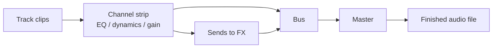

# Bounce and Rendering

You have arranged your clips, comped your takes, and warped your loops to the grid. The last step is turning that living arrangement into a single finished audio file you can share. That step is called **bouncing** (or **rendering**).

::: info One-line definition
**Bounce / render** = compute the whole arrangement into a finished audio buffer, offline and deterministically.
:::

## Offline and deterministic

Bouncing is **offline**: it does not have to run in real time. It can run faster than real time on a quick project, or slower than real time on a heavy one — the goal is correctness, not keeping up with the clock.

Because it is offline, it is also **deterministic**: the same project plus the same options plus the same instrument always produce the same audio, sample for sample. There is no live timing jitter, no dropped buffers. This is exactly why you bounce a final master from the offline path rather than recording your speakers.

::: tip Bounce is not "record the output"
A bounce reconstructs the arrangement from its edit model and renders it cleanly. You are not capturing a live performance of the project — you are computing it, which is why it is repeatable and artifact-free.
:::

## The mix is rendered through the mixer scene

A common beginner assumption is that a bounce just adds all the tracks together. It does not. The arrangement is rendered **through the mixer scene**, so the finished file reflects your full mix.

That means each track passes through its **channel strip** (its EQ, dynamics, gain, pan), its **sends** feed shared effects, and everything sums through the **buses** on the way to the master — exactly as it would when you mix. The bounce is the mix, not a raw sum of clips. See [Mixing](../../mixing.md) for what lives on a channel strip.

## MIDI tracks need an instrument at bounce

Recall from [Clips and Tracks](./clips-and-tracks.md) that a MIDI track holds notes, not sound. So at bounce time you must tell the renderer *which instrument* performs those notes. libsonare gives you several entry points:

| You want… | Use |
|-----------|-----|
| The full patch-driven synth | bounce with the **NativeSynth** instrument |
| A General-MIDI SoundFont | bounce with the **SoundFont** instrument |
| A quick built-in oscillator | bounce with the built-in instrument |
| Your own external instrument (Python) | bounce with host-provided instruments |

If you bounce *without* binding an instrument, MIDI tracks render silently — the notes are there, but nothing is performing them. Audio tracks always render their sound regardless. See [NativeSynth](../../native-synth.md) for the synth side.

## Length is auto-derived (unless you set it)

You usually do not need to specify how long the bounce should be. If you omit the length, it is **auto-derived from the timeline** — the renderer finds the end of the last clip — **plus the release tail**, the extra time a note needs to ring out and fade after it ends. This stops a final reverb or a long synth release from being cut off mid-decay. You only set an explicit length when you want to force a specific duration.

## Latency compensation (PDC)

Some instruments and effects introduce **latency**: they need a few samples of lookahead before they can produce output, so their sound comes out slightly late. If nothing corrected for this, a latent instrument would drift behind the rest of the mix.

The fix is **latency compensation**, also called **PDC** (plugin delay compensation). You tell the bounce how many samples of latency the instrument adds, and the compiler shifts the timeline so that instrument lines back up with everything else. The result stays perfectly in time.

::: warning Match the number to the real latency
PDC only works when the latency figure you provide matches what the instrument actually introduces. Too small and it still drags; too large and it leads. When in doubt, query the instrument's reported latency rather than guessing.
:::

::: details How libsonare implements this
Bouncing is driven from the `Project` class. The plain `bounce(options?)` renders audio tracks and leaves MIDI tracks silent. To make MIDI audible you bind an instrument: `bounceWithSynthInstrument` (the patch-driven NativeSynth, accepting a `SynthPatch`, a preset name, or an array), `bounceWithSf2Instrument` (a GS-compatible SoundFont player fed by `loadSoundFont`), and `bounceWithBuiltinInstrument` (the simple oscillator synth); in Python, `bounce_with_instruments` lets you host your own external instrument. When `totalFrames` is omitted (or `<= 0`) in `ProjectBounceOptions`, the render length is auto-derived from the arrangement plus the instrument's release tail. Every bounce renders through the mixer scene — per-track channel strip, sends, and buses — rather than summing clips. Latency compensation is supplied via `instrumentLatencySamples` in the bounce options, which is fed to the compiler so a latent instrument stays in time. The whole render is deterministic for a fixed project + options + instrument.
:::

Related: [Project Bounce](../../project-bounce.md), [NativeSynth](../../native-synth.md), [Warp and Tempo Sync](./warp-and-tempo.md)
