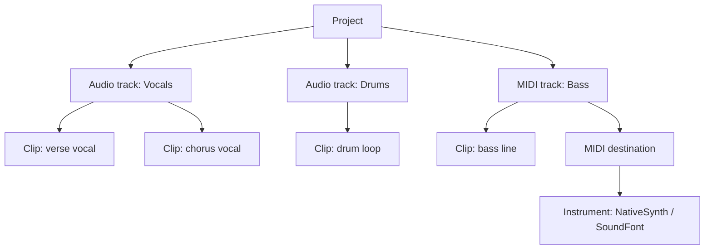

# Clips and Tracks

When you arrange music in a DAW, you are really filling in a small, predictable structure. Learn that structure once and every arrangement feature makes sense. This page describes the **project model** libsonare uses, in plain language, before you read the [Project Editing](../../project-editing.md) guide.

::: info The one-sentence summary
A **project** holds **tracks**, each track holds **clips**, and every clip sits at a position on a shared **timeline** measured in musical time (bars and beats).
:::

## The project model, top to bottom

A **project** is the whole song. It is the container that everything else lives inside, and it is the thing you save, load, and eventually [bounce](./takes-and-comping.md) to a finished file.

Inside the project are **tracks**. A track is a single lane of content — think of one horizontal row in the arrangement view. Each track is one of two kinds:

- An **audio track** holds recorded or imported sound (a vocal take, a guitar, a drum loop).
- A **MIDI track** holds *notes*, not sound. The notes are instructions — "play C4 now, hold it for one beat" — that only become audible when an instrument turns them into sound.

Inside each track are **clips**. A clip is one block of content placed at a specific spot on the timeline. An audio clip points at a piece of audio; a MIDI clip contains a list of note events. You can have many clips on one track, side by side or with gaps between them.

<SonareDemo id="engine-lane-mixer" />

## Musical time, not seconds

Here is the idea that trips up most beginners: clip positions are stored in **musical time**, not in seconds.

A clip does not start "at 4.27 seconds". It starts "at bar 3, beat 1". The unit underneath is the **tick**, and the resolution is **PPQ** — *pulses per quarter note*. If there are 960 ticks per quarter note, then one bar of 4/4 is 4 × 960 = 3840 ticks. Every clip start and length you set is a tick count.

::: tip Why musical time matters
Because positions are musical, the arrangement stays correct when you change the tempo. Move the song from 120 BPM to 100 BPM and "bar 3, beat 1" simply happens later in seconds — but it is still bar 3, beat 1. The notes never drift off the grid. The conversion from musical time to actual sample positions happens later, when the project is compiled and rendered. See [Warp and Tempo Sync](./warp-and-tempo.md) for how tempo and the grid interact.
:::

## How a MIDI track makes sound

An audio track is self-contained: it already holds sound, so it just plays. A MIDI track is different. Its clips only hold note events, so something has to *perform* those notes.

That something is reached through the track's **MIDI destination**. A destination is a numbered routing slot. When you bind an instrument — such as **NativeSynth** or the **SoundFont** player — to a destination and route the track to it, the track's notes are dispatched to that instrument, which synthesizes the actual audio.

| Step | What you do | Result |
|------|-------------|--------|
| 1 | Add a MIDI track and a clip | A lane with notes, but silent |
| 2 | Put note events in the clip | The performance is written down |
| 3 | Route the track to a destination | Notes have somewhere to go |
| 4 | Bind an instrument to that destination | Notes become sound at render time |

This separation is powerful: the same MIDI clip can be played by a synth today and a sampled instrument tomorrow, just by changing the destination's instrument.

## What you can do to clips and tracks

Once the structure exists, arranging is mostly a handful of operations.

**Clip operations** — the everyday moves:

- **Move** a clip to a new position (and optionally to another track).
- **Set gain** to make one clip louder or quieter than its neighbors.
- **Fade in / fade out** so a clip enters and leaves smoothly instead of clicking.
- **Loop** a clip so a short block repeats across a longer region.
- **Duplicate** a clip to copy a part somewhere else.
- **Re-source** a clip to point it at different underlying material.
- **Remove** a clip you no longer want.

**Track operations** — managing the lanes themselves: add a track, remove one, rename it, route it (bind it to a mixer strip / output, or set its MIDI destination), and change its kind between audio and MIDI.

::: warning Clips reference, they do not copy
Several clips can point at the *same* source material. Duplicating a clip usually shares the source rather than cloning the audio, which keeps projects small but means re-sourcing one clip can be independent of another. Keep this in mind when you copy parts around.
:::

::: details How libsonare implements this
The model lives on the `Project` class in the editing engine. `addTrack` creates a track (audio or MIDI), and `addMidiClip(startPpq, lengthPpq)` returns `{ trackId, clipId }` for a fresh MIDI track + clip; `addClip` adds an audio or MIDI clip to an existing track. All positions are PPQ ticks, so `moveClip(clipId, newStartPpq, newTrackId?)`, `setClipGain(clipId, gain)`, `setClipFade(clipId, fadeIn, fadeOut)`, `setClipLoop`, `duplicateClip`, `setClipSource`, and `removeClip` work in musical time. Track lifecycle is `removeTrack`, `renameTrack`, `setTrackKind`, and `setTrackRoute`. A MIDI track reaches its instrument through `setTrackMidiDestination(trackId, destinationId)`: the compiler stamps each MIDI clip with that id so the engine dispatches its events to the instrument bound at that destination. The whole project round-trips through JSON via `toJson()` / `Project.fromJson(json)`, and musical time is converted to samples only at `compile()` / `bounce()`.
:::

Related: [Project Editing](../../project-editing.md), [Takes and Comping](./takes-and-comping.md), [Mixing Basics](../concepts/mixing-basics.md)
