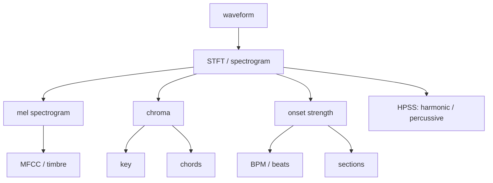

# MIR Overview

MIR means **Music Information Retrieval**: the part of audio analysis that turns sound into *musical* answers — tempo, beat positions, key, chords, pitch, timbre, and structure. This page is a map. It groups the terms you will meet across the docs and shows how they build on one another, so you know which feature to reach for and where it is computed.

These terms are grouped on purpose. They are not isolated functions — almost every MIR task is built on the same **time–frequency foundation**. Understanding that shared foundation once means the individual features stop looking like a long, unrelated list.

::: tip New here? Read this as orientation, not reference
This page explains *how the pieces relate*. For call signatures, go to the [JavaScript API](../../js-api.md#feature-extraction) or [Python API](../../python-api.md#feature-extraction); for *how each one is computed*, see [DSP Implementation Notes](../../dsp-implementation.md).
:::

## The shared pipeline

Most MIR features are derived from a small set of intermediate representations. You rarely build these by hand — libsonare computes them internally — but seeing the flow explains why so many features share parameters like `nFft` and `hopLength`.

Because these intermediates are shared, asking for BPM, key, chord, and section results back-to-back on the same source does **not** repeat the heavy work — the STFT and friends are computed once and reused.

## Which question, which feature

| You want to answer… | Reach for | Built on |
|---------------------|-----------|----------|
| How fast is it? Where are the beats? | BPM / beat tracking | onset strength |
| What key is it in? | key detection | chroma |
| What chord is playing? | chord recognition | chroma |
| Where does the chorus start? | section analysis | rhythm + harmony + timbre |
| What note is the melody? | pitch / melody tracking | (V)QT, autocorrelation |
| What does it *sound* like (timbre)? | MFCC | mel spectrogram |
| Can I separate drums from the rest? | HPSS | spectrogram structure |
| What is the raw frequency content over time? | STFT / spectrogram | the waveform |
| What does the recording space sound like? | room-acoustic analysis | impulse-response decay or blind free-decay estimates |

## Timing: BPM, beat, onset, section

The timing family builds up in layers:

| Feature | What it answers |
|---------|-----------------|
| **Onset detection** | Where notes, drums, or consonants begin: the spikes in an onset-strength envelope. |
| **BPM** | How periodic those onsets are. |
| **Beat tracking** | Where pulses land on the timeline. |
| **Section analysis** | Where longer spans such as intros, verse-like sections, chorus-like sections, and breaks begin and end. |

::: info Onset is the root of the rhythm family
BPM, beats, and tempograms all start from the same onset-strength envelope. If you want the time × tempo picture behind a BPM estimate, see the tempogram family in [Realtime and Streaming](../../realtime-streaming.md#tempograms-from-an-onset-envelope).
:::

## Harmony: key, chord, chroma

**Chroma** compresses frequency content into 12 pitch-class bins (C, C♯, … B), folding every octave of the same note together. That makes it the natural substrate for harmony: **key detection** estimates the tonal center from the overall chroma distribution, and **chord recognition** estimates local harmony frame by frame.

::: warning Chroma trades octave and timbre detail for harmonic clarity
Folding octaves together is exactly what makes chroma good for key/chord work — and exactly what makes it the wrong tool for melody or timbre, where octave and spectral shape matter. Match the representation to the question.
:::

## Spectrum: FFT, STFT, spectrogram

The **FFT** is an efficient algorithm for the DFT (Discrete Fourier Transform), which converts a block of samples into frequency content.

The **STFT** repeats that over many short, overlapping windows so frequency content can be tracked *over time*.

A **spectrogram** is the visual result: time on one axis, frequency on another, intensity as brightness.

Two parameters recur everywhere: `nFft` (window size — bigger means finer frequency resolution but blurrier timing) and `hopLength` (step between windows — smaller means more frames and smoother motion). The trade-off between frequency and time resolution is fundamental, not a libsonare quirk.

## Perceptual features: mel, MFCC, CQT, VQT

These perceptual features answer different questions:

| Feature | What it emphasizes |
|---------|--------------------|
| **Mel spectrogram** | Frequency resolution shaped toward human hearing: fine detail low, coarser detail high. |
| **MFCCs** | A compact "timbre fingerprint" from the DCT of the log-mel power spectrum. |
| **CQT** / **VQT** | Musically spaced bins, useful when pitch relationships matter more than equal-Hz spacing. |

You can also run these transforms backwards for previews and debugging — see [Inverse Features](../../inverse-features.md).

## Separation and pitch: HPSS and pitch

**HPSS** means Harmonic/Percussive Source Separation. It splits sustained pitched material from transient hits by using their spectrogram shapes.

| Component | Spectrogram shape |
|-----------|-------------------|
| Harmonic content | Mostly **horizontal** lines. |
| Percussive content | Mostly **vertical** lines. |

Separating them first often improves downstream tasks because drums and pitched instruments otherwise confuse each other.

**Pitch estimation** tracks the fundamental frequency — useful for melody, vocals, monophonic instruments, tuning checks, and transcription-style workflows.

## Adjacent: room acoustics

Room-acoustic analysis is adjacent to MIR. It describes the space captured by the recording rather than the notes, rhythm, or form of the music.

Use direct IR analysis when you have a clean impulse response. That path measures RT60, EDT, C50, C80, D50, and band decay.

Use blind acoustic estimation when you only have a normal recording. That path reports room-decay cues with a confidence value because the free-decay evidence may be weak or missing. See [Room Acoustics](../../acoustic-analysis.md).

:::: details Implementation notes

libsonare exposes MIR functions across browser/WASM, JavaScript, Python, native bindings, CLI, and C++ APIs.

Many features share intermediate representations such as STFT, chroma, and spectral energy curves. Asking for BPM, key, chord, and section results back-to-back on the same source does not repeat the heavy work; the intermediates are computed once and reused.

The browser demos are built for interactive use, but each one emphasizes a different part of the library:

| Demo | Main role |
|------|-----------|
| [Music Analysis Studio](/music-analysis) | Full-file MIR: BPM, key, chords, sections, and related analysis. |
| Realtime views | Progressive BPM, key, and chord estimates through `StreamAnalyzer`. |
| [Mastering Studio](/mastering) | Measurement-style APIs such as loudness measurement, reference comparison, and report export. |

Seeing those demos side by side shows which pieces are reusable across analysis work and finishing work.

::::

Related: [Introduction](../../introduction.md), [Audio Basics](./audio-basics.md), [JavaScript API](../../js-api.md#feature-extraction), [Room Acoustics](../../acoustic-analysis.md), [DSP Implementation Notes](../../dsp-implementation.md), [librosa Compatibility](../../librosa-compatibility.md)
