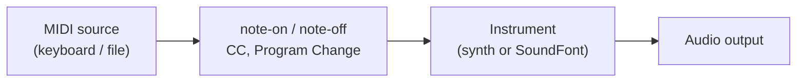

# MIDI Basics

**MIDI** (Musical Instrument Digital Interface) is a language for describing a *performance*, not the sound itself. A MIDI message says "play note 60 fairly hard now" or "let go of note 60" — it never carries audio. Something downstream (a synthesizer, a [SoundFont player](./soundfont.md), or a piece of hardware) reads those instructions and *produces* the sound.

<SonareDemo id="synth-note" />

That separation is powerful: the same MIDI performance can be played back through a piano sound, a guitar sound, or an orchestra, just by pointing it at a different instrument. This page explains the vocabulary you need to read or write MIDI. It is concepts only — no code.

::: info Performance, not audio
A MIDI file is tiny — kilobytes — because it stores instructions, not waveforms. The trade-off is that it sounds different depending on which instrument renders it. An audio file always sounds the same but cannot be re-voiced or transposed for free.
:::

## Notes: note-on, note-off, number, velocity

The two core messages are **note-on** (a key went down) and **note-off** (the key was released). Each carries:

- A **note number** from 0 to 127, where each step is one semitone. **Middle C = 60**, and A4 (the 440 Hz tuning reference) = 69. Add 12 to go up an octave.
- A **velocity** from 0 to 127 — how *hard* the key was struck. An instrument typically maps velocity to loudness and brightness, so a high velocity is louder and punchier. (By convention, a note-on with velocity 0 is treated as a note-off.)

## Channels

A single MIDI stream is split into **16 channels**, like 16 separate players sharing one cable. Each channel can host its own instrument, so channel 1 might be a piano and channel 2 a bass. One channel is special by convention: in General MIDI (below), **channel 10 is the drum channel**, where each note number triggers a different percussion sound instead of a pitch.

## Control Change (CC)

::: info CC
A **Control Change** message turns a numbered knob (0-127) to a value (0-127). It is how expression, pedals, and continuous controllers are sent.
:::

The most common controllers:

| CC | Name | What it does |
|----|------|--------------|
| **CC1** | Mod wheel | General-purpose modulation (often vibrato depth) |
| **CC11** | Expression | A volume-like swell *within* a phrase, on top of the main level |
| **CC64** | Sustain pedal | 0-63 = up, 64-127 = down; holds notes after the keys are released |

## Choosing a sound: Program Change and bank select

A **Program Change** message picks *which* instrument a channel plays, by program number 0-127. Because 128 sounds is often not enough, **bank select** widens the address: **CC0** is the bank MSB and **CC32** is the bank LSB, sent just before the Program Change to choose a different bank of 128 programs.

::: info GM (General MIDI)
**General MIDI** is a standard that fixes what each program number means: program 0 is always an acoustic grand piano, 24 a nylon guitar, and so on across a 128-instrument map, plus a standard drum map on channel 10. GM is why a MIDI file made on one device plays the *right kinds* of instruments on another.
:::

## Pitch bend, RPN, and NRPN

**Pitch bend** is its own high-resolution message (not a CC) that slides a note's pitch up or down continuously — for guitar bends, vibrato, or a whammy effect. How far the maximum bend reaches is set separately:

::: info RPN / NRPN
A **Registered Parameter Number (RPN)** is a standardized setting addressed through CC messages. **RPN 0** is the **pitch-bend range** — how many semitones a full bend covers. A **Non-Registered Parameter Number (NRPN)** uses the same mechanism for *device-specific* parameters that are not part of the standard.
:::

## MIDI files and MIDI 2.0

::: info UMP
**MIDI 2.0** is the modern revision of the protocol. It uses the **Universal MIDI Packet (UMP)** format and adds much higher resolution (16-bit velocity, finer controllers) and two-way communication, while staying compatible with the MIDI 1.0 ideas above.
:::

A **Standard MIDI File (SMF, the `.mid` extension)** stores a whole performance — every note-on/off, CC, and Program Change with its timing — so it can be saved, shared, and replayed through any instrument.

## How it fits together

::: details How libsonare implements this
libsonare's realtime engine accepts live MIDI through `pushMidiNoteOn(destinationId, group, channel, note, velocity)` and `pushMidiNoteOff(...)` for notes, and `pushMidiCc(destinationId, group, channel, controller, value)` for Control Change messages — the `destinationId` selects which loaded instrument receives the event, and `channel` is the 0-15 MIDI channel. In the browser, a Web MIDI bridge (`bindWebMidi`) connects a physical MIDI keyboard's events straight into those engine inputs, so a hardware controller can play NativeSynth or a loaded SoundFont live. The same note/CC vocabulary drives both the live engine and offline arrangement bounces.
:::

Related: [MIDI Input](../../midi-input.md), [SoundFont and Sampled Instruments](./soundfont.md), [Editing Basics](../concepts/editing-basics.md)
