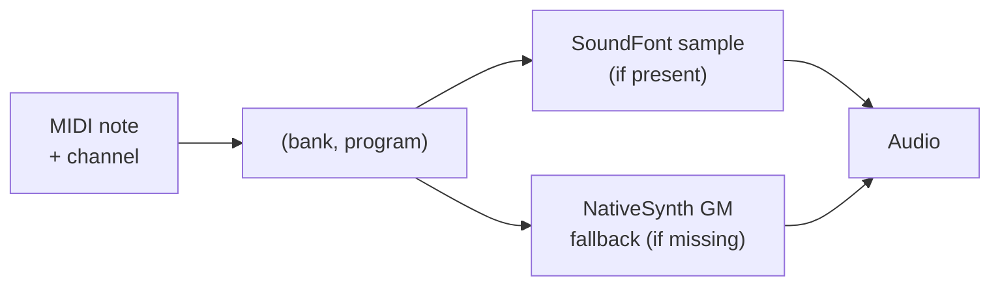

# SoundFont and Sampled Instruments

A **sampled instrument** makes sound the opposite way from a [synthesizer](./synthesis-basics.md): instead of generating a waveform, it plays back short *recordings* of a real instrument. Record a piano playing several notes at several volumes, store those clips, and play the closest one back at the right pitch when a key is pressed — that is sampling in a nutshell. The result can be extremely realistic, because it *is* a real recording.

This page explains what a SoundFont is, how it is addressed, and how libsonare guarantees that a MIDI arrangement always produces sound. It is concepts only — no code.

::: info Sampled vs synthesized
A **synthesized** instrument computes its sound and can be any pitch or tone, but has to be designed. A **sampled** instrument replays recordings and sounds true to life, but is fixed to what was recorded and takes far more storage. Many setups use both — samples for realistic instruments, synths for sounds that do not exist acoustically.
:::

## What a SoundFont is

A **SoundFont** (the `.sf2` file format) is a single file that bundles a whole library of recorded instrument samples, together with the rules for how to play them back (which sample covers which key range, how loops work, basic envelopes). One `.sf2` can hold an entire General MIDI instrument set in a few megabytes.

Inside the file the sounds are organized into **banks** and **programs**, and any one instrument is addressed by a `(bank, program)` pair:

- A **program** is one playable instrument — "acoustic grand piano", "fingered bass".
- A **bank** is a numbered shelf of up to 128 programs. Bank 0 holds the main set; higher banks hold variations.

This is exactly the addressing scheme [MIDI](./midi-basics.md) uses for Program Change and bank select, which is why MIDI and SoundFonts fit together so naturally.

## General MIDI program numbers and the drum bank

Because a SoundFont is addressed by `(bank, program)`, a **General MIDI**-compliant `.sf2` lines its programs up with the GM map: program 0 is an acoustic grand piano, 24 a nylon-string guitar, 40 a violin, and so on across all 128 GM instruments. Percussion lives in a separate **drum bank**, where each *note number* selects a different drum or cymbal rather than a pitch — matching MIDI's channel-10 drum convention.

The principle underneath is simple: a note list is instrument-agnostic, and the address decides which instrument performs it. The piano roll below makes that tangible — the notes never change; switching the instrument points the same MIDI at a different sound.

<SonareDemo id="midi-piano-roll" />

## How libsonare resolves a note

libsonare can load a SoundFont and play MIDI through it, but it adds one important guarantee. After you supply a `.sf2` file, every MIDI program is resolved to a backend:

| Situation | Backend | What you hear |
|-----------|---------|---------------|
| The loaded SoundFont covers the `(bank, program)` | `'sf2'` | The recorded SF2 sample |
| The program is missing, or no SoundFont is loaded | `'synth'` | The NativeSynth General MIDI **fallback** bank |

The key consequence: **MIDI never renders silent.** If a SoundFont is missing a sound — or you have not loaded one at all — libsonare falls back to its built-in NativeSynth GM bank for that program instead of dropping the note. You always get a usable instrument for every program in the arrangement.

::: tip Why the fallback matters
Different SoundFonts cover different instruments, and a small `.sf2` might only include a handful of programs. The fallback means you can hand libsonare any arrangement and any SoundFont (or none) and still hear the complete piece — then swap in a richer SoundFont later to upgrade the sounds, with no change to the MIDI.
:::

You can inspect exactly what resolved where: a per-program report tells you, for each `(channel, bank, program)` the arrangement plays, whether it ended up on the `'sf2'` or `'synth'` backend and which preset name it matched.

::: details How libsonare implements this
On a `Project`, `loadSoundFont(bytes)` registers an `.sf2` file from a byte buffer. `soundFontManifest()` then returns one `Sf2ProgramStatus` per `(channel, bank, program)` combination the arrangement uses, each with a `backend` of `'sf2'` or `'synth'` and the resolved `presetName` — so you can see at a glance which programs are covered by your SoundFont and which fell back to the NativeSynth GM bank (drum channels report bank `128`). `bounceWithSf2Instrument(...)` renders the arrangement through the SoundFont player, applying the same GM fallback per note so the output is never silent for an uncovered program. The fallback bank is the data-free floor: even with no SoundFont loaded at all, every program still resolves to a NativeSynth voice.
:::

Related: [SoundFont Player](../../soundfont-player.md), [Built-in Synthesizer (NativeSynth)](../../native-synth.md), [MIDI Basics](./midi-basics.md)
