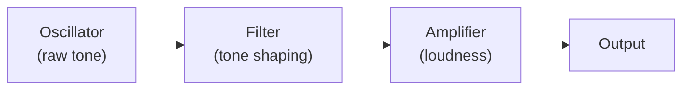

# Synthesis Basics

A **synthesizer** is an instrument that *generates* sound from scratch instead of playing back a recording. There is no microphone and no audio file behind a synth note: the computer calculates the waveform sample by sample, in real time. That is the single idea that separates a synthesizer from a [sampled instrument](./soundfont.md), which plays back recorded audio.

This page explains the building blocks every synth shares, then introduces the twelve synthesis *families* (engines) you can choose from. It is concepts only — no code.

::: info Why generate instead of record?
A generated note can be any pitch, any length, and any tone, with no storage cost and no "stretching a recording" artifacts. The trade-off is that the sound has to be *designed*: someone picks a waveform, shapes it, and decides how it evolves. That design is called a **patch**.
:::

## The three classic blocks

Most synth sounds, however complex, come from a chain of three stages. Signal flows left to right:

### 1. Oscillator — the raw tone

The **oscillator** produces a continuous, repeating wave at the pitch of the note. Its **waveform** decides the raw color of the sound, because each shape contains a different mix of [harmonics](../concepts/audio-basics.md) (the overtones stacked above the fundamental pitch):

| Waveform | Sounds like | Why |
|----------|-------------|-----|
| **Sine** | Pure, hollow, flute-ish | Only the fundamental, no overtones |
| **Sawtooth** | Bright, buzzy, full | All harmonics — the classic synth lead/bass tone |
| **Square** | Hollow, woody, "reedy" | Only odd harmonics |
| **Triangle** | Soft, mellow | Odd harmonics, but much weaker — close to a sine |
| **Noise** | A hiss, no pitch | All frequencies at once — used for percussion, wind, breath |

<SonareDemo id="waveform-harmonics" />

### 2. Filter — shaping the tone

A **filter** removes or boosts part of the frequency content. The most common is a **lowpass filter**, which keeps the low frequencies and rolls off the highs. Two controls matter:

- **Cutoff** — the frequency where the filter starts removing energy. Lower the cutoff and the sound gets darker and muffled; raise it and it brightens.
- **Resonance** — a boost right at the cutoff frequency. A little adds a vocal "wah" emphasis; a lot makes the filter ring and whistle.

Sweeping the cutoff over time is the single most recognizable synth gesture — see [Envelopes and Modulation](./envelopes-modulation.md) for how to create that movement.

<SonareDemo id="synth-filter" />

### 3. Amplifier — the loudness over time

The **amplifier** controls the volume of the note from the instant a key is pressed until it fully fades. A raw oscillator just drones forever; the amplifier, controlled by an envelope, gives the note a beginning, a body, and an end — a plucked attack, a slow swell, a long tail.

<SonareDemo id="synth-adsr" />

## The twelve synthesis families

The blocks above describe *subtractive* synthesis, but it is only one way to make sound. **NativeSynth**, libsonare's built-in instrument engine, offers twelve engines, each suited to different instruments:

| Engine | How it makes sound | Good for |
|--------|--------------------|----------|
| **Subtractive / virtual-analog** | Oscillator → filter → amplifier (the classic chain above) | Leads, basses, pads |
| **FM** | One oscillator modulates another oscillator's *pitch* | Metallic tones, bells, electric pianos, clavinet |
| **Karplus-Strong** | A short feedback delay loop models a vibrating string | Plucked strings, guitars, harp, harpsichord |
| **Modal** | A bank of tuned resonators models a struck object | Marimba, glockenspiel, struck bars and bells |
| **Additive / drawbar** | Sums many harmonic sine partials, like organ drawbars | Hammond-style organs, harmonic pads |
| **Membrane percussion** | Models the vibration modes of a drumhead | Drums, toms, percussion |
| **Extended-waveguide piano** | A physical model of struck piano strings | Acoustic piano |
| **Pipe organ** | Sustained flue-pipe waveguides with wind and rank behavior | Church organ stops |
| **Bowed string** | A friction-excited string waveguide | Violin, viola, cello, contrabass |
| **Reed woodwind** | A reed and bore waveguide | Clarinet, saxophones, oboe, bassoon |
| **Brass** | A lip-reed brass waveguide | Trumpet, trombone, tuba, horns |
| **Flute** | An air jet exciting an open-pipe waveguide | Flute, recorder, pan flute, whistles |

::: tip FM in one sentence
In **FM (frequency modulation)** synthesis, instead of filtering a rich waveform, you take two simple sine oscillators and let one wobble the other's pitch very fast. The result is a complex, often metallic or bell-like tone that subtractive synthesis cannot easily make.
:::

Several of these — Karplus-Strong, modal, piano, pipe organ, bowed string, reed, brass, and flute — are **physical modeling**: instead of stacking waveforms, they approximate the behavior of a vibrating object (a string, a metal bar, a pipe, a reed, lips, or an air jet). In libsonare's current NativeSynth these acoustic-style models are still provisional and being calibrated, so treat them as data-free preview/fallback voices rather than finished instrument simulations.

## Filter character

The character of the filter itself can be changed. NativeSynth provides four filter models, each with a different flavor of resonance and saturation:

- **svf** — a clean, flexible state-variable filter (the neutral default).
- **moog-ladder** — the warm, fat ladder filter character of classic analog mono-synths.
- **diode-ladder** — a grittier ladder variant with a more aggressive bite.
- **sallen-key** — a smooth, musical filter associated with another lineage of classic synths.

::: details How libsonare implements this
NativeSynth is configured with a `SynthPatch`. Its `engineMode` field selects one of the twelve engines (`'subtractive'`, `'fm'`, `'karplus-strong'`, `'modal'`, `'additive'`, `'percussion'`, `'piano'`, `'pipe-organ'`, `'bowed-string'`, `'reed'`, `'brass'`, `'flute'`), `waveform` picks the oscillator shape (`'sine'`, `'saw'`, `'square'`, `'triangle'`, `'noise'`), and `filterModel` selects the filter character (`'svf'`, `'moog-ladder'`, `'diode-ladder'`, `'sallen-key'`) together with `cutoffHz` and `resonanceQ`. Rather than build a patch by hand, you can list the ready-made catalog with `synthPresetNames()` and load one with `synthPresetPatch(name)`. The built-in presets are arranged over these same engines, so every preset is really one of the families above with its parameters filled in for you. Deep mode-specific data (FM operator stacks, modal mode tables, drawbar registrations, kit pieces, piano strings, pipe ranks, bowed-string friction, reed/brass bores, and flute jet geometry) lives inside the named presets, while the patch exposes the shared controls every engine has in common.
:::

Related: [Built-in Synthesizer (NativeSynth)](../../native-synth.md), [Envelopes and Modulation](./envelopes-modulation.md), [Audio Basics](../concepts/audio-basics.md), [SoundFont and Sampled Instruments](./soundfont.md)
