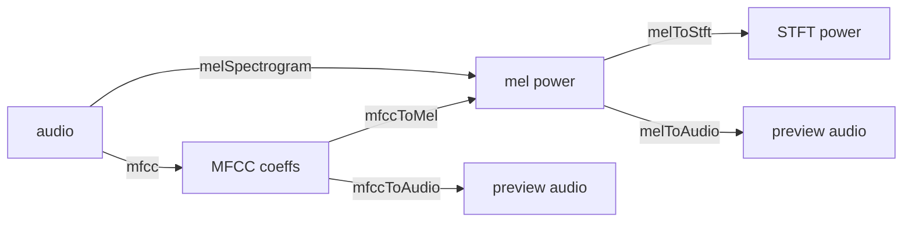

# Inverse Features

Most of libsonare turns audio into features: a mel spectrogram, MFCCs, a chromagram.

The **inverse** helpers go the other way. They take those features and reconstruct an *approximate* spectrum or preview audio.

These helpers are useful when you need to debug a feature pipeline, build an audible preview of what a model "hears", test round trips, or port librosa-style notebooks to native or browser code.

::: tip New to analysis? This is not the first page
These helpers assume you already produce mel spectrograms or MFCCs. If you are just getting started, read [Getting Started](./getting-started.md) and the feature-extraction sections of the [JavaScript API](./js-api.md#feature-extraction) or [Python API](./python-api.md#feature-extraction) first, then come back when you need to invert what you computed.
:::

## What You Will Learn

By the end of this page you should be able to:

- explain why mel/MFCC inversion is approximate and why phase cannot be recovered from the feature alone;
- keep the `sampleRate`, `nFft`, `hopLength`, `nMels`, `nMfcc`, `fmin`, `fmax`, and `htk` values needed for a correct round trip;
- choose `melToStft`, `melToAudio`, `mfccToMel`, or `mfccToAudio` based on whether you need a matrix or preview audio;
- compare JavaScript and Python return shapes without confusing row counts, frame counts, and flattened data.

## What "inverse" means here

A forward feature transform is **lossy on purpose**. Two kinds of information are thrown away, and no inverse can invent them back:

- **The mel filterbank is not square.** A mel spectrogram folds ~1025 STFT bins (for `nFft = 2048`) down to, say, 128 mel bands. Inverting it spreads each mel band's energy back across the bins it came from — a least-squares best guess, not the original detail.
- **Phase is discarded entirely.** A magnitude or power spectrogram keeps *how much* energy sits at each frequency, but not *where in the waveform cycle* it sits. Audio reconstruction has to **invent a plausible phase**, which is what Griffin-Lim does.

MFCCs add a third loss on top: they keep only the first `nMfcc` cepstral coefficients (often 13–20), discarding the fine spectral envelope. Inverting MFCCs therefore reconstructs a *smoothed* mel spectrogram before any audio is recovered.

::: details What is a cepstral coefficient?
A cepstrum is the result of taking a transform (a DCT) of the log spectrum. It separates the broad shape of the spectrum (timbre) from its fine detail. MFCCs keep only the first several of these coefficients, which is why they describe overall tonal color compactly but cannot reconstruct fine spectral detail.
:::

::: warning Reconstruction is an approximation, never a restoration
The output is meant for inspection and preview, not for getting your original recording back. Expect a recognizable but "phasey" or smeared result, especially from MFCCs or with few Griffin-Lim iterations. If you need the real audio, keep the real audio.
:::

## The four helpers



| Intent | JavaScript | Python |
|--------|------------|--------|
| Mel power → STFT power | `melToStft(...)` returns `{ nBins, nFrames, power }` | `mel_to_stft(...)` returns `InverseResult(rows, n_frames, data)` |
| Mel power → audio | `melToAudio(...)` returns `Float32Array` | `mel_to_audio(...)` returns `list[float]` |
| MFCCs → mel power | `mfccToMel(...)` returns `{ nMels, nFrames, power }` | `mfcc_to_mel(...)` returns `InverseResult(rows, n_frames, data)` |
| MFCCs → audio | `mfccToAudio(...)` returns `Float32Array` | `mfcc_to_audio(...)` returns `list[float]` |

The two `*ToStft` / `*ToMel` helpers stay in the **spectral** domain and return a result object you can inspect or feed onward. The two `*ToAudio` helpers go all the way back to a waveform and run **Griffin-Lim** internally to supply the missing phase.

## Reconstruct a spectrum

`melToStft` undoes the mel filterbank: it maps a mel **power** spectrogram back to a linear-frequency STFT **power** spectrogram. `mfccToMel` undoes the cepstral compression: it maps MFCCs back to a (smoothed) mel **power** spectrogram.

::: code-group

```typescript [Browser]
import { init, melSpectrogram, melToStft, mfcc, mfccToMel } from '@libraz/libsonare';

await init();

// Mel power -> STFT power
const mel = melSpectrogram(samples, sampleRate, 2048, 512, 128);
const stft = melToStft(mel.power, mel.nMels, mel.nFrames, sampleRate, 2048, 512);
// stft: { nBins, nFrames, power }   nBins = nFft/2 + 1 = 1025

// MFCCs -> mel power
const coeffs = mfcc(samples, sampleRate, 2048, 512, 128, 20);
const reMel = mfccToMel(coeffs.coefficients, coeffs.nMfcc, coeffs.nFrames, 128);
// reMel: { nMels, nFrames, power }
```

```python [Python]
import libsonare as sonare

# Mel power -> STFT power
mel = sonare.mel_spectrogram(samples, sample_rate, n_fft=2048, hop_length=512, n_mels=128)
stft = sonare.mel_to_stft(mel.power, mel.n_mels, mel.n_frames, sample_rate=sample_rate, n_fft=2048)
# stft.rows = n_fft/2 + 1 = 1025; stft.data is row-major [rows x n_frames]

# MFCCs -> mel power
coeffs = sonare.mfcc(samples, sample_rate, n_fft=2048, hop_length=512, n_mels=128, n_mfcc=20)
re_mel = sonare.mfcc_to_mel(coeffs.coefficients, coeffs.n_mfcc, coeffs.n_frames, n_mels=128)
# re_mel.rows = n_mels; re_mel.data is row-major [rows x n_frames]
```

```bash [C++ CLI]
# Source-built C++ CLI audio-preview path for these same forward/inverse settings:
sonare mel-to-audio song.wav --n-fft 2048 --hop-length 512 --n-mels 128 -o mel-preview.wav
```

:::

Both inputs are **row-major** matrices: `melPower` is `[nMels x nFrames]`, MFCC coefficients are `[nMfcc x nFrames]`. The `nMels`/`nMfcc`/`nFrames` arguments tell the helper how to read that flat array, so they must match the matrix you pass.

## Reconstruct audio

`melToAudio` and `mfccToAudio` produce a mono `Float32Array` you can play or write to a file. Because the features carry no phase, both run **Griffin-Lim**: start from the magnitude with random (or zero) phase, repeatedly STFT → keep the new phase → impose the known magnitude → inverse-STFT, until the phase settles into something self-consistent.

::: code-group

```typescript [Browser]
import { init, melSpectrogram, melToAudio, mfcc, mfccToAudio } from '@libraz/libsonare';

await init();

const mel = melSpectrogram(samples, sampleRate, 2048, 512, 128);
const preview = melToAudio(mel.power, mel.nMels, mel.nFrames, sampleRate, 2048, 512, 0, 0, 32);
// nFft=2048, hopLength=512, nIter=32 (fmin/fmax left at default 0; nIter is the Griffin-Lim iteration count)

const coeffs = mfcc(samples, sampleRate, 2048, 512, 128, 20);
const fromMfcc = mfccToAudio(coeffs.coefficients, coeffs.nMfcc, coeffs.nFrames, 128, sampleRate, 2048, 512, 0, 0, 32);
// note the extra nMels (128) before sampleRate; nFft=2048, hopLength=512, nIter=32 (fmin/fmax default 0)
```

```python [Python]
import libsonare as sonare

mel = sonare.mel_spectrogram(samples, sample_rate, n_fft=2048, hop_length=512, n_mels=128)
preview = sonare.mel_to_audio(mel.power, mel.n_mels, mel.n_frames, sample_rate=sample_rate, n_iter=32)
# n_iter=32 (Griffin-Lim iterations)

coeffs = sonare.mfcc(samples, sample_rate, n_fft=2048, hop_length=512, n_mels=128, n_mfcc=20)
from_mfcc = sonare.mfcc_to_audio(coeffs.coefficients, coeffs.n_mfcc, coeffs.n_frames, n_mels=128, sample_rate=sample_rate, n_iter=32)
# note the n_mels (128) argument before sample_rate
```

```bash [C++ CLI]
# Source-built C++ CLI equivalents for quick file previews:
sonare mel-to-audio song.wav -o mel-preview.wav
sonare mfcc-to-audio song.wav -o mfcc-preview.wav
```

:::

::: details How Griffin-Lim fills in the missing phase
Griffin-Lim is an iterative magnitude-only reconstruction. Given a target magnitude spectrogram `|S|` and an initial guess for phase `φ`:

1. Inverse-STFT `|S|·e^{iφ}` to a time-domain signal.
2. Forward-STFT that signal — its magnitude will drift away from `|S|`, but its **phase** is now more consistent with a real waveform.
3. Keep the new phase, force the magnitude back to `|S|`, and repeat.

Each pass nudges the phase toward something that an actual signal could have produced. `nIter` controls how many passes run. More iterations converge closer (smoother, fewer artifacts) at linear cost; fewer iterations are faster but "phasier". 32 is a reasonable default; drop to 8–16 for fast UI previews, raise to 60+ when preview quality matters.
:::

`nIter` is the main quality/latency dial. Everything else (`nFft`, `hopLength`, `fmin`, `fmax`, `htk`) must match the **forward** transform — see below. The helper signatures default `fmin`/`fmax` to `0` (full range) and `htk` to `false` (Slaney); pass the same values you gave the forward transform, in the same positional slots.

::: info Slaney vs HTK Mel scale
There are two common conventions for spacing the Mel bands: the **Slaney** formula (librosa's and libsonare's default) and the **HTK** formula. They place the band edges differently, so the forward and inverse transforms must use the *same* convention — pass `htk: true` (or `htk=True`) to the inverse only if the forward transform used it.
:::

## A round-trip sanity check

A common use is to confirm a feature pipeline is wired correctly: extract features, invert them, and listen to (or measure) the gap. The result will never be identical, but it should be *recognizable* — if it is silence or noise, a parameter or a matrix shape is wrong.

::: code-group

```typescript [Browser]
const mel = melSpectrogram(samples, sampleRate, 2048, 512, 128);
const preview = melToAudio(mel.power, mel.nMels, mel.nFrames, sampleRate, 2048, 512, 0, 0, 32);

// Same length? Recognizable envelope? Play it back or compare loudness.
console.log(samples.length, preview.length);
```

```python [Python]
mel = sonare.mel_spectrogram(samples, sample_rate, n_fft=2048, hop_length=512, n_mels=128)
preview = sonare.mel_to_audio(mel.power, mel.n_mels, mel.n_frames, sample_rate=sample_rate, n_iter=32)

# Same length? Recognizable envelope? Play it back or compare loudness.
print(len(samples), len(preview))
```

```bash [C++ CLI]
# Listen to the reconstructed preview and compare it with the source.
sonare mel-to-audio song.wav -o mel-preview.wav
```

:::

::: warning Keep the same parameters on both sides
Inverse helpers are only meaningful with the **same** `sampleRate`, `nFft`, `hopLength`, `nMels`, `fmin`, `fmax`, and `htk` used for the forward transform. A mismatch silently produces a wrong-but-plausible spectrum, which is the hardest kind of bug to spot. In particular, if the forward transform used `htk: true` or a custom `fmin`/`fmax`, the inverse **must** pass the same `htk`/`fmin`/`fmax` — otherwise the Mel filterbank is built differently and the reconstruction is silently wrong. Store these values alongside your features so the inverse call cannot drift. `mel_to_stft(...)` does not need `hop_length` because it stays in the frequency domain; the audio-producing helpers do.
:::

## Related

- [librosa Compatibility](./librosa-compatibility.md) — how these map to `librosa.feature.inverse.*`
- [JavaScript API](./js-api.md#feature-extraction) · [Python API](./python-api.md#feature-extraction) — the forward transforms
- [DSP Implementation Notes](./dsp-implementation.md) — how the mel filterbank and STFT are built
