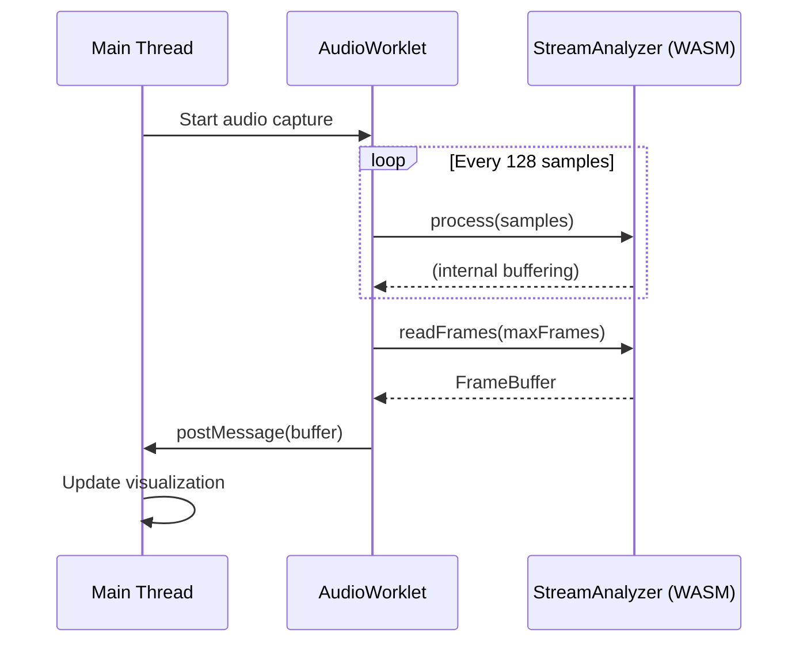
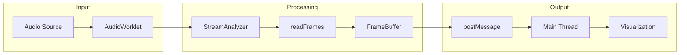

# JavaScript/TypeScript API Reference

Complete API reference for libsonare JavaScript/TypeScript interface.

::: warning Package Not Published
The npm package `@libraz/sonare` is not yet publicly available. For now, use the WASM files directly from the repository or build from source.
:::

## Overview

libsonare provides audio analysis capabilities for web applications:

| Category | Functions | Use Cases |
|----------|-----------|-----------|
| **Quick Analysis** | `detectBpm`, `detectKey`, `detectBeats` | DJ apps, music players, beat sync |
| **Full Analysis** | `analyze`, `analyzeWithProgress` | Music production, song metadata |
| **Audio Effects** | `hpss`, `timeStretch`, `pitchShift` | Remixing, practice tools |
| **Features** | `melSpectrogram`, `chroma`, `mfcc` | ML input, visualization |

::: tip Terminology
New to audio analysis? See the [Glossary](/docs/glossary) for explanations of terms like BPM, STFT, Chroma, and more.
:::

## Installation

```bash
# Not yet available - coming soon
npm install @libraz/sonare
```

## Import

```typescript
import {
  init,
  detectBpm,
  detectKey,
  detectBeats,
  detectOnsets,
  analyze,
  analyzeWithProgress,
  version
} from '@libraz/sonare';
```

## Initialization

### `init(options?)`

Initialize the WASM module. Must be called before any analysis functions.

```typescript
async function init(options?: {
  locateFile?: (path: string, prefix: string) => string;
}): Promise<void>
```

**Example:**

```typescript
import { init, detectBpm } from '@libraz/sonare';

// Basic initialization
await init();

// With custom file location
await init({
  locateFile: (path, prefix) => `/custom/wasm/path/${path}`
});
```

### `isInitialized()`

Check if the module is initialized.

```typescript
function isInitialized(): boolean
```

### `version()`

Get the library version.

```typescript
function version(): string  // e.g., "1.0.0"
```

## Analysis Functions

### `detectBpm(samples, sampleRate)`

Detect BPM (tempo) from audio samples.

::: info Use Cases
- **DJ Software**: Match tempos between tracks for seamless mixing
- **Music Players**: Display tempo information, auto-generate playlists by tempo
- **Fitness Apps**: Match music to workout intensity
- **Beat Sync**: Synchronize visualizations or animations to music
:::

```typescript
function detectBpm(samples: Float32Array, sampleRate: number): number
```

| Parameter | Type | Description |
|-----------|------|-------------|
| `samples` | `Float32Array` | Mono audio samples (range -1.0 to 1.0) |
| `sampleRate` | `number` | Sample rate in Hz (e.g., 44100) |

**Returns:** Detected BPM (typically 60-200), accuracy ±2 BPM

```typescript
const bpm = detectBpm(samples, sampleRate);
console.log(`BPM: ${bpm}`);  // "BPM: 120"
```

### `detectKey(samples, sampleRate)`

Detect musical key from audio samples. Returns the root note (C, D, E...) and mode (major/minor).

::: info Use Cases
- **Harmonic Mixing**: DJs match keys for smooth transitions (Camelot wheel)
- **Transposition**: Suggest key changes to match vocal range
- **Music Recommendation**: Find songs in compatible keys
- **Practice Tools**: Display key for musicians to play along
:::

```typescript
function detectKey(samples: Float32Array, sampleRate: number): Key
```

**Returns:** `Key` object

```typescript
interface Key {
  root: PitchClass;      // 0-11 (C=0, B=11)
  mode: Mode;            // 0=Major, 1=Minor
  confidence: number;    // 0.0 to 1.0
  name: string;          // "C major", "A minor"
  shortName: string;     // "C", "Am"
}
```

```typescript
const key = detectKey(samples, sampleRate);
console.log(`Key: ${key.name}`);        // "C major"
console.log(`Confidence: ${(key.confidence * 100).toFixed(1)}%`);
```

### `detectBeats(samples, sampleRate)`

Detect beat times from audio samples. Returns exact timestamps of each beat.

::: info Use Cases
- **Music Visualization**: Trigger effects on each beat
- **Rhythm Games**: Generate note charts from audio
- **Video Editing**: Auto-cut to the beat
- **Loop Creation**: Find perfect loop points
:::

```typescript
function detectBeats(samples: Float32Array, sampleRate: number): Float32Array
```

**Returns:** Float32Array of beat times in seconds

```typescript
const beats = detectBeats(samples, sampleRate);
console.log(`Found ${beats.length} beats`);
for (let i = 0; i < beats.length; i++) {
  console.log(`Beat ${i + 1}: ${beats[i].toFixed(3)}s`);
}
```

### `detectOnsets(samples, sampleRate)`

Detect onset times (note attacks) from audio samples. More granular than beats - captures every note/hit.

::: info Use Cases
- **Drum Transcription**: Detect individual drum hits
- **Audio-to-MIDI**: Convert audio to note events
- **Sample Slicing**: Automatically segment audio at transients
:::

```typescript
function detectOnsets(samples: Float32Array, sampleRate: number): Float32Array
```

**Returns:** Float32Array of onset times in seconds

### `analyze(samples, sampleRate)` <Badge type="warning" text="Heavy" />

Perform complete music analysis. Returns BPM, key, beats, chords, sections, timbre, and more.

::: info Use Cases
- **Music Library Management**: Auto-tag songs with metadata
- **Music Production**: Analyze reference tracks
- **DJ Preparation**: Get all track info at once
- **Music Education**: Study song structure
:::

::: tip Performance
This is the heaviest API. For long audio files (>3 minutes), consider using `analyzeWithProgress` to show progress, or analyze only relevant segments.
:::

```typescript
function analyze(samples: Float32Array, sampleRate: number): AnalysisResult
```

**Returns:** Complete `AnalysisResult` with BPM, key, beats, chords, sections, timbre, dynamics, and rhythm.

```typescript
const result = analyze(samples, sampleRate);
console.log(`BPM: ${result.bpm}`);
console.log(`Key: ${result.key.name}`);
console.log(`Chords: ${result.chords.length}`);
console.log(`Form: ${result.form}`);  // e.g., "IABABCO"
```

### `analyzeWithProgress(samples, sampleRate, onProgress)` <Badge type="warning" text="Heavy" />

Perform complete music analysis with progress reporting.

```typescript
function analyzeWithProgress(
  samples: Float32Array,
  sampleRate: number,
  onProgress: (progress: number, stage: string) => void
): AnalysisResult
```

**Progress Stages:**

| Stage | Description | Progress Range |
|-------|-------------|----------------|
| `"bpm"` | BPM detection | 0.0 - 0.15 |
| `"key"` | Key detection | 0.15 - 0.25 |
| `"beats"` | Beat tracking | 0.25 - 0.45 |
| `"chords"` | Chord recognition | 0.45 - 0.65 |
| `"sections"` | Section detection | 0.65 - 0.85 |
| `"timbre"` | Timbre analysis | 0.85 - 0.95 |
| `"dynamics"` | Dynamics analysis | 0.95 - 1.0 |

```typescript
const result = analyzeWithProgress(samples, sampleRate, (progress, stage) => {
  console.log(`${stage}: ${Math.round(progress * 100)}%`);
});
```

## Audio Effects

### `hpss(samples, sampleRate, kernelHarmonic?, kernelPercussive?)` <Badge type="warning" text="Heavy" />

Harmonic-Percussive Source Separation. Splits audio into tonal (vocals, synths) and transient (drums) components.

::: info Use Cases
- **Remixing**: Isolate drums or remove them
- **Karaoke**: Extract instrumental by removing vocals (use harmonic)
- **Better Analysis**: Use harmonic-only for cleaner chord detection
- **Drum Extraction**: Get just the percussion for sampling
:::

::: tip Performance
HPSS requires STFT computation and median filtering. Processing time scales with audio duration.
:::

```typescript
function hpss(
  samples: Float32Array,
  sampleRate: number,
  kernelHarmonic?: number,    // default: 31
  kernelPercussive?: number   // default: 31
): HpssResult

interface HpssResult {
  harmonic: Float32Array;
  percussive: Float32Array;
  sampleRate: number;
}
```

### `harmonic(samples, sampleRate)` <Badge type="warning" text="Heavy" />

Extract harmonic component from audio.

```typescript
function harmonic(samples: Float32Array, sampleRate: number): Float32Array
```

### `percussive(samples, sampleRate)` <Badge type="warning" text="Heavy" />

Extract percussive component from audio.

```typescript
function percussive(samples: Float32Array, sampleRate: number): Float32Array
```

### `timeStretch(samples, sampleRate, rate)` <Badge type="warning" text="Heavy" />

Time-stretch audio without changing pitch. Rate < 1.0 = slower, > 1.0 = faster.

::: info Use Cases
- **Practice Tools**: Slow down music to learn difficult passages
- **DJ Mixing**: Match tempos between tracks
- **Podcast Editing**: Speed up/slow down speech
- **Music Production**: Fit samples to project tempo
:::

::: tip Performance
Uses phase vocoder algorithm. Processing time increases with audio duration.
:::

```typescript
function timeStretch(
  samples: Float32Array,
  sampleRate: number,
  rate: number   // 0.5 = half speed, 2.0 = double speed
): Float32Array
```

### `pitchShift(samples, sampleRate, semitones)` <Badge type="warning" text="Heavy" />

Pitch-shift audio without changing duration. Measured in semitones (+12 = one octave up).

::: info Use Cases
- **Key Matching**: Transpose songs to match for mixing
- **Vocal Tuning**: Correct or adjust vocal pitch
- **Creative Effects**: Create harmonies, chipmunk/deep voice effects
- **Instrument Practice**: Transpose to comfortable key
:::

::: tip Performance
Combines time stretching and resampling. Processing time increases with audio duration.
:::

```typescript
function pitchShift(
  samples: Float32Array,
  sampleRate: number,
  semitones: number   // +12 = one octave up
): Float32Array
```

### `normalize(samples, sampleRate, targetDb?)`

Normalize audio to target peak level.

```typescript
function normalize(
  samples: Float32Array,
  sampleRate: number,
  targetDb?: number   // default: 0.0 (full scale)
): Float32Array
```

### `trim(samples, sampleRate, thresholdDb?)`

Trim silence from beginning and end of audio.

```typescript
function trim(
  samples: Float32Array,
  sampleRate: number,
  thresholdDb?: number   // default: -60.0
): Float32Array
```

## Feature Extraction

### `stft(samples, sampleRate, nFft?, hopLength?)` <Badge type="info" text="Medium" />

Compute Short-Time Fourier Transform.

```typescript
function stft(
  samples: Float32Array,
  sampleRate: number,
  nFft?: number,      // default: 2048
  hopLength?: number  // default: 512
): StftResult

interface StftResult {
  nBins: number;
  nFrames: number;
  nFft: number;
  hopLength: number;
  sampleRate: number;
  magnitude: Float32Array;
  power: Float32Array;
}
```

### `stftDb(samples, sampleRate, nFft?, hopLength?)` <Badge type="info" text="Medium" />

Compute STFT and return in dB scale.

```typescript
function stftDb(
  samples: Float32Array,
  sampleRate: number,
  nFft?: number,      // default: 2048
  hopLength?: number  // default: 512
): { nBins: number; nFrames: number; db: Float32Array }
```

### `melSpectrogram(samples, sampleRate, nFft?, hopLength?, nMels?)` <Badge type="info" text="Medium" />

Compute Mel spectrogram. Frequency representation that matches human pitch perception.

::: info Use Cases
- **Machine Learning**: Input for genre classification, mood detection
- **Visualization**: Create frequency spectrograms for audio players
- **Similarity Search**: Compare songs by their spectral content
- **Voice Analysis**: Analyze speech patterns and characteristics
:::

```typescript
function melSpectrogram(
  samples: Float32Array,
  sampleRate: number,
  nFft?: number,      // default: 2048
  hopLength?: number, // default: 512
  nMels?: number      // default: 128
): MelSpectrogramResult

interface MelSpectrogramResult {
  nMels: number;
  nFrames: number;
  sampleRate: number;
  hopLength: number;
  power: Float32Array;
  db: Float32Array;
}
```

### `mfcc(samples, sampleRate, nFft?, hopLength?, nMels?, nMfcc?)` <Badge type="info" text="Medium" />

Compute MFCC (Mel-Frequency Cepstral Coefficients). Compact representation of spectral envelope.

::: info Use Cases
- **Speech Recognition**: Standard input for speech-to-text systems
- **Speaker Identification**: Identify who is speaking
- **Timbre Analysis**: Characterize instrument/voice quality
- **Audio Fingerprinting**: Create compact song signatures
:::

```typescript
function mfcc(
  samples: Float32Array,
  sampleRate: number,
  nFft?: number,      // default: 2048
  hopLength?: number, // default: 512
  nMels?: number,     // default: 128
  nMfcc?: number      // default: 13
): MfccResult

interface MfccResult {
  nMfcc: number;
  nFrames: number;
  coefficients: Float32Array;
}
```

### `chroma(samples, sampleRate, nFft?, hopLength?)` <Badge type="info" text="Medium" />

Compute chromagram (pitch class distribution). Maps all frequencies to 12 pitch classes (C, C#, D, ..., B).

::: info Use Cases
- **Chord Detection**: Identify chords being played
- **Key Detection**: Determine song key from pitch distribution
- **Cover Song Detection**: Match songs regardless of tempo/key
- **Music Similarity**: Compare harmonic content between tracks
:::

```typescript
function chroma(
  samples: Float32Array,
  sampleRate: number,
  nFft?: number,      // default: 2048
  hopLength?: number  // default: 512
): ChromaResult

interface ChromaResult {
  nChroma: number;        // 12
  nFrames: number;
  sampleRate: number;
  hopLength: number;
  features: Float32Array;
  meanEnergy: number[];   // [12] per pitch class
}
```

### Spectral Features

```typescript
// Spectral centroid (center of mass) in Hz
function spectralCentroid(
  samples: Float32Array,
  sampleRate: number,
  nFft?: number,
  hopLength?: number
): Float32Array

// Spectral bandwidth in Hz
function spectralBandwidth(
  samples: Float32Array,
  sampleRate: number,
  nFft?: number,
  hopLength?: number
): Float32Array

// Spectral rolloff frequency in Hz
function spectralRolloff(
  samples: Float32Array,
  sampleRate: number,
  nFft?: number,
  hopLength?: number,
  rollPercent?: number  // default: 0.85
): Float32Array

// Spectral flatness (0 = tonal, 1 = noise-like)
function spectralFlatness(
  samples: Float32Array,
  sampleRate: number,
  nFft?: number,
  hopLength?: number
): Float32Array

// Zero crossing rate
function zeroCrossingRate(
  samples: Float32Array,
  sampleRate: number,
  frameLength?: number,
  hopLength?: number
): Float32Array

// RMS energy
function rmsEnergy(
  samples: Float32Array,
  sampleRate: number,
  frameLength?: number,
  hopLength?: number
): Float32Array
```

### Pitch Detection <Badge type="info" text="Medium" />

```typescript
// YIN algorithm
function pitchYin(
  samples: Float32Array,
  sampleRate: number,
  frameLength?: number,  // default: 2048
  hopLength?: number,    // default: 512
  fmin?: number,         // default: 65 Hz
  fmax?: number,         // default: 2093 Hz
  threshold?: number     // default: 0.3
): PitchResult

// pYIN algorithm (probabilistic YIN with HMM smoothing)
function pitchPyin(
  samples: Float32Array,
  sampleRate: number,
  frameLength?: number,
  hopLength?: number,
  fmin?: number,
  fmax?: number,
  threshold?: number
): PitchResult

interface PitchResult {
  f0: Float32Array;
  voicedProb: Float32Array;
  voicedFlag: boolean[];
  nFrames: number;
  medianF0: number;
  meanF0: number;
}
```

## Unit Conversion

These functions are lightweight and fast.

```typescript
// Hz <-> Mel (Slaney formula)
function hzToMel(hz: number): number
function melToHz(mel: number): number

// Hz <-> MIDI note number (A4 = 440 Hz = 69)
function hzToMidi(hz: number): number
function midiToHz(midi: number): number

// Hz <-> Note name
function hzToNote(hz: number): string      // "A4", "C#5"
function noteToHz(note: string): number

// Time <-> Frames
function framesToTime(frames: number, sr: number, hopLength: number): number
function timeToFrames(time: number, sr: number, hopLength: number): number
```

## Resampling

### `resample(samples, srcSr, targetSr)` <Badge type="info" text="Medium" />

High-quality resampling using r8brain algorithm.

```typescript
function resample(
  samples: Float32Array,
  srcSr: number,
  targetSr: number
): Float32Array
```

## Streaming API

The Streaming API enables real-time audio analysis for visualizations and live monitoring. Unlike batch analysis, streaming processes audio chunk by chunk with minimal latency.

::: tip When to Use
- **Batch API**: Pre-recorded files, full analysis (BPM, key, chords, sections)
- **Streaming API**: Live audio, visualizations, real-time feedback
:::

### StreamConfig

Configuration options for StreamAnalyzer.

```typescript
interface StreamConfig {
  sampleRate: number;          // e.g., 44100
  nFft?: number;               // default: 2048
  hopLength?: number;          // default: 512
  nMels?: number;              // default: 128
  computeMel?: boolean;        // default: true
  computeChroma?: boolean;     // default: true
  computeOnset?: boolean;      // default: true
  emitEveryNFrames?: number;   // default: 1 (no throttling)
}
```

### StreamAnalyzer Class

```typescript
class StreamAnalyzer {
  constructor(config: StreamConfig);

  // Process audio chunk (internal offset tracking)
  process(samples: Float32Array): void;

  // Process with external synchronization
  processWithOffset(samples: Float32Array, sampleOffset: number): void;

  // Number of frames ready to read
  availableFrames(): number;

  // Read processed frames
  readFrames(maxFrames: number): FrameBuffer;

  // Reset state for new stream
  reset(baseSampleOffset?: number): void;

  // Get statistics and progressive estimates
  stats(): AnalyzerStats;

  // Total frames processed
  frameCount(): number;

  // Current time position (seconds)
  currentTime(): number;

  // Release resources (call when done)
  dispose(): void;
}
```

### FrameBuffer

Structure-of-Arrays format for efficient transfer via `postMessage`.

```typescript
interface FrameBuffer {
  nFrames: number;
  timestamps: Float32Array;      // [nFrames]
  mel: Float32Array;             // [nFrames * nMels]
  chroma: Float32Array;          // [nFrames * 12]
  onsetStrength: Float32Array;   // [nFrames]
  rmsEnergy: Float32Array;       // [nFrames]
  spectralCentroid: Float32Array;// [nFrames]
  spectralFlatness: Float32Array;// [nFrames]
  chordRoot: Int32Array;         // [nFrames] per-frame chord root
  chordQuality: Int32Array;      // [nFrames] per-frame chord quality
  chordConfidence: Float32Array; // [nFrames] per-frame chord confidence
}
```

### ChordChange

A detected chord change in the progression.

```typescript
interface ChordChange {
  root: PitchClass;
  quality: ChordQuality;
  startTime: number;
  confidence: number;
}
```

### BarChord

A chord detected at bar boundary (beat-synchronized).

```typescript
interface BarChord {
  barIndex: number;
  root: PitchClass;
  quality: ChordQuality;
  startTime: number;
  confidence: number;
}
```

### AnalyzerStats

```typescript
interface AnalyzerStats {
  totalFrames: number;
  totalSamples: number;
  durationSeconds: number;
  estimate: ProgressiveEstimate;
}
```

### ProgressiveEstimate

BPM, key, and chord estimates that improve over time as more audio is processed.

```typescript
interface ProgressiveEstimate {
  // BPM estimation
  bpm: number;              // 0 if not yet estimated
  bpmConfidence: number;    // 0-1, increases over time
  bpmCandidateCount: number;

  // Key estimation
  key: PitchClass;          // 0-11 (C-B)
  keyMinor: boolean;
  keyConfidence: number;    // 0-1, increases over time

  // Chord estimation (current)
  chordRoot: PitchClass;
  chordQuality: ChordQuality;
  chordConfidence: number;
  chordProgression: ChordChange[];     // detected chord changes
  barChordProgression: BarChord[];     // bar-synchronized chords
  currentBar: number;                  // current bar index
  barDuration: number;                 // bar duration in seconds

  // Statistics
  accumulatedSeconds: number;
  usedFrames: number;
  updated: boolean;         // true if estimate changed this frame
}
```

### Basic Streaming Example

```typescript
import { init, StreamAnalyzer } from '@libraz/sonare';

await init();

// Create analyzer with config object
const analyzer = new StreamAnalyzer({
  sampleRate: 44100,
  nFft: 2048,
  hopLength: 512,
  nMels: 128,
  computeMel: true,
  computeChroma: true,
  computeOnset: true,
  emitEveryNFrames: 1
});

// Process audio chunks (e.g., from AudioWorklet)
function processChunk(samples: Float32Array) {
  analyzer.process(samples);

  // Read available frames
  const available = analyzer.availableFrames();
  if (available > 0) {
    const frames = analyzer.readFrames(available);

    // Use for visualization
    updateVisualization(frames);

    // Check progressive estimates
    const stats = analyzer.stats();
    if (stats.estimate.bpm > 0) {
      console.log(`BPM: ${stats.estimate.bpm.toFixed(1)}`);
      console.log(`Key: ${stats.estimate.key} ${stats.estimate.keyMinor ? 'minor' : 'major'}`);
      console.log(`Current bar: ${stats.estimate.currentBar}`);
      console.log(`Chord progression:`, stats.estimate.chordProgression);
      console.log(`Bar chords:`, stats.estimate.barChordProgression);
    }
  }
}

// Clean up when done
analyzer.dispose();
```

### AudioWorklet Integration



**worklet-processor.ts:**

```typescript
import { StreamAnalyzer } from '@libraz/sonare';

class AnalyzerProcessor extends AudioWorkletProcessor {
  private analyzer: StreamAnalyzer;

  constructor() {
    super();
    this.analyzer = new StreamAnalyzer({
      sampleRate,
      nFft: 2048,
      hopLength: 512,
      nMels: 128,
      computeMel: true,
      computeChroma: true,
      computeOnset: true,
      emitEveryNFrames: 4
    });
  }

  process(inputs: Float32Array[][]): boolean {
    const input = inputs[0]?.[0];
    if (!input) return true;

    this.analyzer.process(input);

    const available = this.analyzer.availableFrames();
    if (available >= 4) {
      const frames = this.analyzer.readFrames(available);
      this.port.postMessage(frames, [
        frames.mel.buffer,
        frames.chroma.buffer
      ]);
    }

    return true;
  }
}

registerProcessor('analyzer-processor', AnalyzerProcessor);
```

### Data Flow Diagram



### Timestamp Synchronization

::: warning Stream Time vs AudioContext Time
`FrameBuffer.timestamps` represents **stream time** (cumulative input samples), not `AudioContext.currentTime`. For synchronization:

```typescript
// Track offset when starting
const startTime = audioContext.currentTime;
const startOffset = 0;

// In visualization, add offset
const audioTime = startTime + frame.timestamps[i];
```
:::

### Performance Tips

1. **Throttle with `emitEveryNFrames`**: Set to 4 for 60fps visualizations
2. **Process in AudioWorklet**: Avoid main thread blocking
3. **Batch reads**: Read multiple frames at once when available
4. **Call `dispose()`**: Release resources when done to prevent memory leaks

## Types

### AnalysisResult

```typescript
interface AnalysisResult {
  bpm: number;
  bpmConfidence: number;
  key: Key;
  timeSignature: TimeSignature;
  beats: Beat[];
  chords: Chord[];
  sections: Section[];
  timbre: Timbre;
  dynamics: Dynamics;
  rhythm: RhythmFeatures;
  form: string;  // e.g., "IABABCO"
}
```

### Beat

```typescript
interface Beat {
  time: number;      // seconds
  strength: number;  // 0.0 to 1.0
}
```

### Chord

```typescript
interface Chord {
  root: PitchClass;
  quality: ChordQuality;
  start: number;       // seconds
  end: number;         // seconds
  confidence: number;
  name: string;        // "C", "Am", "G7"
}
```

### Section

```typescript
interface Section {
  type: SectionType;
  start: number;
  end: number;
  energyLevel: number;
  confidence: number;
  name: string;  // "Intro", "Verse 1", "Chorus"
}
```

### TimeSignature

```typescript
interface TimeSignature {
  numerator: number;    // e.g., 4
  denominator: number;  // e.g., 4
  confidence: number;
}
```

### Timbre

```typescript
interface Timbre {
  brightness: number;   // 0.0 to 1.0
  warmth: number;
  density: number;
  roughness: number;
  complexity: number;
}
```

### Dynamics

```typescript
interface Dynamics {
  dynamicRangeDb: number;
  loudnessRangeDb: number;
  crestFactor: number;
  isCompressed: boolean;
}
```

### RhythmFeatures

```typescript
interface RhythmFeatures {
  syncopation: number;
  grooveType: string;  // "straight", "shuffle", "swing"
  patternRegularity: number;
}
```

## Enumerations

### PitchClass

```typescript
const PitchClass = {
  C: 0, Cs: 1, D: 2, Ds: 3, E: 4, F: 5,
  Fs: 6, G: 7, Gs: 8, A: 9, As: 10, B: 11
} as const;
```

### Mode

```typescript
const Mode = {
  Major: 0,
  Minor: 1
} as const;
```

### ChordQuality

```typescript
const ChordQuality = {
  Major: 0, Minor: 1, Diminished: 2, Augmented: 3,
  Dominant7: 4, Major7: 5, Minor7: 6, Sus2: 7, Sus4: 8
} as const;
```

### SectionType

```typescript
const SectionType = {
  Intro: 0, Verse: 1, PreChorus: 2, Chorus: 3,
  Bridge: 4, Instrumental: 5, Outro: 6
} as const;
```

## Error Handling

All functions throw if the module is not initialized.

```typescript
try {
  const bpm = detectBpm(samples, sampleRate);
} catch (error) {
  if (error.message.includes('not initialized')) {
    await init();
    // retry
  }
}
```

## Performance Summary

| API | Load | Notes |
|-----|------|-------|
| `StreamAnalyzer` | <Badge type="tip" text="Real-time" /> | Per-chunk processing, ~2ms/frame, progressive BPM/key/chord estimation |
| `analyze` / `analyzeWithProgress` | <Badge type="warning" text="Heavy" /> | Full analysis pipeline |
| `hpss` / `harmonic` / `percussive` | <Badge type="warning" text="Heavy" /> | STFT + median filtering |
| `timeStretch` | <Badge type="warning" text="Heavy" /> | Phase vocoder |
| `pitchShift` | <Badge type="warning" text="Heavy" /> | Time stretch + resample |
| `stft` / `stftDb` | <Badge type="info" text="Medium" /> | Multiple FFT operations |
| `melSpectrogram` / `mfcc` | <Badge type="info" text="Medium" /> | STFT + filterbank |
| `chroma` | <Badge type="info" text="Medium" /> | STFT + chroma filterbank |
| `pitchYin` / `pitchPyin` | <Badge type="info" text="Medium" /> | Per-frame pitch detection |
| `resample` | <Badge type="info" text="Medium" /> | High-quality resampling |
| `detectBpm` / `detectKey` | Light | Single result |
| `detectBeats` / `detectOnsets` | Light | Frame-based detection |
| Unit conversion functions | Light | Pure computation |
| `normalize` / `trim` | Light | Simple processing |

## Bundle Size

| File | Size | Gzipped |
|------|------|---------|
| `sonare.js` | ~34 KB | ~12 KB |
| `sonare.wasm` | ~228 KB | ~80 KB |
| **Total** | ~262 KB | ~92 KB |

## Browser Support

| Browser | Minimum Version |
|---------|-----------------|
| Chrome | 57+ |
| Firefox | 52+ |
| Safari | 11+ |
| Edge | 16+ |

Requirements: WebAssembly, ES2017+ (async/await), Web Audio API
