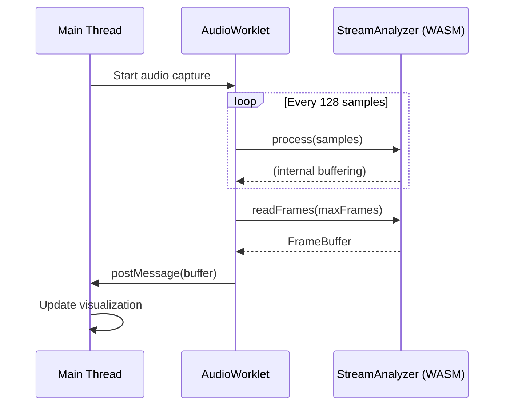
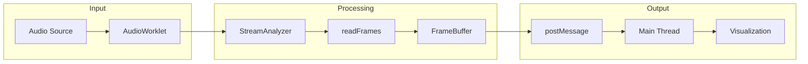

# JavaScript/TypeScript API Reference

Complete API reference for libsonare JavaScript/TypeScript interface.

## Overview

libsonare provides audio analysis, mastering, mixing, and editing DSP capabilities for web applications. The npm package is the WebAssembly build and works on decoded `Float32Array` samples; it does not include a file decoder.

| Category | Functions | Use Cases |
|----------|-----------|-----------|
| **Quick Analysis** | `detectBpm`, `detectKey`, `detectBeats` | DJ apps, music players, beat sync |
| **Full Analysis** | `analyze`, `analyzeWithProgress` | Music production, song metadata |
| **Audio Effects** | `hpss`, `timeStretch`, `pitchShift` | Remixing, practice tools |
| **Features** | `melSpectrogram`, `chroma`, `mfcc` | ML input, visualization |
| **Mastering** | `masterAudio`, `masteringChain`, `StreamingMasteringChain` | LUFS targets, true-peak limiting, presets, streaming chains |
| **Mixing** | `mixStereo`, `Mixer`, `mixingScenePresetNames` | Stem mixing, routing, automation, meters |
| **Editing DSP** | `pitchCorrectToMidi`, `noteStretch`, `voiceChange`, `StreamingRetune`, `RealtimeVoiceChanger` | Vocal tuning, note edits, pitch/formant changes |
| **Audio Class** | `Audio.fromBuffer` | OOP wrapper for all functions |

::: tip Terminology
New to audio analysis? See the [Glossary](/docs/glossary) for explanations of terms like BPM, STFT, Chroma, and more.
:::

::: info The JavaScript API is not a file loader
Most browser functions do not take an MP3 or WAV path. They take decoded PCM samples plus `sampleRate`. Bytes from `fetch` or `<input type="file">` must be decoded to an `AudioBuffer` or equivalent sample array before calling libsonare.
:::

For a cross-binding feature map, see [Feature Map](./api-surface.md). For the complete mastering processor registry and mixing scene format, see [Mastering Processors](./mastering-processors.md) and [Mixing Scene JSON](./mixing-scene-json.md).

## How To Read This Reference

Read this page in three passes:

1. Start with [Pick The Smallest API That Solves The Job](#pick-the-smallest-api-that-solves-the-job) and choose one function family.
2. Read only the section for that family, then run one recipe from [Examples](./examples.md).
3. Come back to the full type definitions when you need exact return shapes, optional parameters, or runtime parity.

For browser apps, keep the core rule in mind: initialize WASM with `await init()`, decode files to PCM first, then pass `Float32Array` samples plus the original `sampleRate`.

## Pick The Smallest API That Solves The Job

The package is broad, so start from the task rather than the function list:

| You need | Start with | Why |
|----------|------------|-----|
| One tempo/key/beat value for a track | `detectBpm`, `detectKey`, `detectBeats` | Fast, direct answers without building the full analysis object |
| Metadata for a whole song | `analyze` or the focused `analyze*` helpers | `analyze` gives the common summary; focused helpers expose more detail |
| A live visualizer or progressive BPM/key/chord UI | `StreamAnalyzer` | Processes blocks and drains frame buffers for UI rendering |
| Browser mastering or delivery preview | `masterAudio*`, `masteringChain*`, `StreamingMasteringChain` | Use presets first, then move to named processors when you need control |
| Stem balance, sends, buses, or meters | `mixStereo` or `Mixer` | One-shot mix first; persistent scene mixer when routing matters |
| Vocal/note edits | `pitchCorrectToMidi`, `noteStretch`, `voiceChange`, `StreamingRetune`, `RealtimeVoiceChanger` | Editing DSP changes the signal rather than analyzing it |
| Room decay, clarity, equivalent-room estimates, or generated room character | `analyzeImpulseResponse`, `detectAcoustic`, `estimateRoom`, `synthesizeRir`, `roomMorph` | These describe or apply the recording space, not the music |

## Installation

::: code-group

```bash [npm]
npm install @libraz/libsonare
```

```bash [yarn]
yarn add @libraz/libsonare
```

```bash [pnpm]
pnpm add @libraz/libsonare
```

:::

## Import

```typescript
import {
  init,
  Audio,
  detectBpm,
  detectKey,
  detectBeats,
  detectOnsets,
  analyze,
  analyzeWithProgress,
  version
} from '@libraz/libsonare';
```

## Initialization

### `init(options?)`

Initialize the WASM module. Must be called before any analysis functions.

```typescript
async function init(options?: {
  locateFile?: (path: string, prefix: string) => string;
}): Promise<void>
```

**Example:**

```typescript
import { init, detectBpm } from '@libraz/libsonare';

// Basic initialization
await init();

// With custom file location
await init({
  locateFile: (path, prefix) => `/custom/wasm/path/${path}`
});
```

### `isInitialized()`

Check if the module is initialized.

```typescript
function isInitialized(): boolean
```

### `version()`

Get the library version.

```typescript
function version(): string  // e.g., "{{ wasmMeta.version }}"
```

### `voiceChangerAbiVersion()`

ABI version of the realtime voice-changer POD config used by native and FFI APIs. This is separate from preset JSON `schemaVersion`, currently `1`. Check user-authored presets with `validateRealtimeVoiceChangerPresetJson(...)` before accepting them.

```typescript
function voiceChangerAbiVersion(): number
```

### Voice Preset Accessors

Use these when you need the canonical voice-character preset ID or the resolved flat POD config without parsing preset JSON.

```typescript
function voiceCharacterPresetId(preset: VoicePresetId | number): string | null
function realtimeVoiceChangerPresetConfig(preset: VoicePresetId | number): RealtimeVoiceChangerPodConfig | null
```

### Realtime environment helpers

These helpers describe the runtime capabilities used by [`RealtimeEngine`](./realtime-streaming.md#realtimeengine). Use them before wiring AudioWorklet/SharedArrayBuffer paths, especially when the page may run under different browser isolation policies.

```typescript
function engineAbiVersion(): number
function engineCapabilities(): {
  engineAbiVersion: number;
  expectedEngineAbiVersion: number;
  abiCompatible: boolean;
  sharedArrayBuffer: boolean;
  atomics: boolean;
  audioWorklet: boolean;
  mode: 'sab' | 'postMessage';
}
function hasFfmpegSupport(): boolean
```

`hasFfmpegSupport()` reports whether the loaded build can decode through FFmpeg. The browser/WASM npm package works on decoded PCM and normally returns `false`; Python/native builds are the intended place to decode files directly.

## Analysis Functions

### `detectBpm(samples, sampleRate)`

Detect BPM (tempo) from audio samples.

::: info Use Cases
- **DJ Software**: Match tempos between tracks for seamless mixing
- **Music Players**: Display tempo information, auto-generate playlists by tempo
- **Fitness Apps**: Match music to workout intensity
- **Beat Sync**: Synchronize visualizations or animations to music
:::

```typescript
function detectBpm(samples: Float32Array, sampleRate: number): number
```

| Parameter | Type | Description |
|-----------|------|-------------|
| `samples` | `Float32Array` | Mono audio samples (range -1.0 to 1.0) |
| `sampleRate` | `number` | Sample rate in Hz (e.g., 44100) |

**Returns:** Detected BPM as a number.

```typescript
const bpm = detectBpm(samples, sampleRate);
console.log(`BPM: ${bpm}`);  // "BPM: 120"
```

### `detectKey(samples, sampleRate)`

Detect musical key from audio samples. Returns the root note (C, D, E...) and mode (major/minor).

::: info Use Cases
- **Harmonic Mixing**: DJs match keys for smooth transitions (Camelot wheel)
- **Transposition**: Suggest key changes to match vocal range
- **Music Recommendation**: Find songs in compatible keys
- **Practice Tools**: Display key for musicians to play along
:::

```typescript
function detectKey(samples: Float32Array, sampleRate: number): Key
```

**Returns:** `Key` object

```typescript
interface Key {
  root: PitchClass;      // 0-11 (C=0, B=11)
  mode: Mode;            // Major, Minor, or modal value; see Mode enum
  confidence: number;    // 0.0 to 1.0
  name: string;          // "C major", "A minor"
  shortName: string;     // "C", "Am"
}

const KeyProfile = {
  KrumhanslSchmuckler: 0,
  Temperley: 1,
  Shaath: 2,
  FaraldoEDMT: 3,
  FaraldoEDMA: 4,
  FaraldoEDMM: 5,
  BellmanBudge: 6,
} as const;
```

```typescript
const key = detectKey(samples, sampleRate);
console.log(`Key: ${key.name}`);        // "C major"
console.log(`Confidence: ${(key.confidence * 100).toFixed(1)}%`);
```

### `detectBeats(samples, sampleRate)`

Detect beat times from audio samples. Returns exact timestamps of each beat.

::: info Use Cases
- **Music Visualization**: Trigger effects on each beat
- **Rhythm Games**: Generate note charts from audio
- **Video Editing**: Auto-cut to the beat
- **Loop Creation**: Find perfect loop points
:::

```typescript
function detectBeats(samples: Float32Array, sampleRate: number): Float32Array
```

**Returns:** Float32Array of beat times in seconds

```typescript
const beats = detectBeats(samples, sampleRate);
console.log(`Found ${beats.length} beats`);
for (let i = 0; i < beats.length; i++) {
  console.log(`Beat ${i + 1}: ${beats[i].toFixed(3)}s`);
}
```

### `detectOnsets(samples, sampleRate)`

Detect onset times (note attacks) from audio samples. More granular than beats - captures every note/hit.

::: info Use Cases
- **Drum Transcription**: Detect individual drum hits
- **Audio-to-MIDI**: Convert audio to note events
- **Sample Slicing**: Automatically segment audio at transients
:::

```typescript
function detectOnsets(samples: Float32Array, sampleRate: number): Float32Array
```

**Returns:** Float32Array of onset times in seconds

### `analyze(samples, sampleRate)` <Badge type="warning" text="Heavy" />

Perform complete music analysis. Returns BPM, key, beats, chords, sections, timbre, and more.

::: info Use Cases
- **Music Library Management**: Auto-tag songs with metadata
- **Music Production**: Analyze reference tracks
- **DJ Preparation**: Get all track info at once
- **Music Education**: Study song structure
:::

::: tip Performance
This is the heaviest API. For long audio files (>3 minutes), consider using `analyzeWithProgress` to show progress, or analyze only relevant segments.
:::

```typescript
function analyze(samples: Float32Array, sampleRate: number): AnalysisResult
```

**Returns:** Complete `AnalysisResult` with BPM, key, beats, chords, sections, timbre, dynamics, and rhythm.

```typescript
const result = analyze(samples, sampleRate);
console.log(`BPM: ${result.bpm}`);
console.log(`Key: ${result.key.name}`);
console.log(`Chords: ${result.chords.length}`);
console.log(`Form: ${result.form}`);  // e.g., "IABABCO"
```

### `analyzeWithProgress(samples, sampleRate, onProgress)` <Badge type="warning" text="Heavy" />

Perform complete music analysis with progress reporting.

```typescript
function analyzeWithProgress(
  samples: Float32Array,
  sampleRate: number,
  onProgress: (progress: number, stage: string) => void
): AnalysisResult
```

**Progress Stages:**

| Stage | Description | Progress |
|-------|-------------|----------|
| `"features"` | Feature precomputation | 0.0 |
| `"bpm"` | BPM detection | 0.15 |
| `"key"` | Key detection | 0.15 |
| `"beats"` | Beat tracking | 0.25 |
| `"chords"` | Chord recognition | 0.40 |
| `"sections"` | Section detection | 0.55 |
| `"timbre"` | Timbre analysis | 0.70 |
| `"dynamics"` | Dynamics analysis | 0.80 |
| `"rhythm"` | Rhythm analysis | 0.90 |
| `"complete"` | Finished | 1.0 |

```typescript
const result = analyzeWithProgress(samples, sampleRate, (progress, stage) => {
  console.log(`${stage}: ${Math.round(progress * 100)}%`);
});
```

### Focused analysis helpers

Use the focused helpers when the default `analyze(...)` result is either too broad or not detailed enough. They share the same mono `Float32Array` input model but expose options that are hidden by the high-level call.

| Task | Function | Notes |
|------|----------|-------|
| Downbeat/bar starts | `detectDownbeats(samples, sampleRate)` | Returns seconds for likely bar starts. Pair with `detectBeats` for grid displays. |
| Ranked key candidates | `detectKeyCandidates(samples, sampleRate, options?)` | Useful when the top key is ambiguous or when you want profile/mode filtering. |
| Detailed tempo candidates | `analyzeBpm(samples, sampleRate, ...)` | Returns the best BPM plus alternate candidates and tempo evidence. |
| Rhythm character | `analyzeRhythm(samples, sampleRate, ...)` | Reports groove, syncopation, and regularity style features. |
| Dynamics | `analyzeDynamics(samples, sampleRate, ...)` | Dynamic range, loudness range, crest factor, and compression flag. |
| Timbre | `analyzeTimbre(samples, sampleRate, ...)` | Brightness, warmth, density, roughness, and complexity. |
| Chords | `detectChords(samples, sampleRate, options?)` | Chord segments; options include HMM smoothing, key context, inversions, and `chromaMethod: 'stft' \| 'nnls'`. |
| Sections | `analyzeSections(samples, sampleRate, ...)` | Song-structure sections such as intro, verse, chorus, bridge, and outro. |
| Melody | `analyzeMelody(samples, sampleRate, ...)` | Monophonic melody contour based on pitch tracking. |

```typescript
const keys = detectKeyCandidates(samples, sampleRate, {
  modes: [Mode.Major, Mode.Minor],
  profile: 'krumhansl',
  genreHint: 'pop',
});

const chords = detectChords(samples, sampleRate, {
  useHmm: true,
  useKeyContext: true,
  keyRoot: keys[0].root,
  keyMode: keys[0].mode,
  chromaMethod: 'nnls',
});

const sections = analyzeSections(samples, sampleRate);
```

`detectKey(...)` and `detectKeyCandidates(...)` accept the same
`KeyDetectionOptions` includes:

| Option group | Values |
|--------------|--------|
| Controls | `modes`, `profile`, `genreHint`, `useHpss`, `loudnessWeighted`, `highPassHz` |
| Profile names | `ks`, `krumhansl`, `temperley`, `shaath`, `keyfinder`, `faraldo-edmt` / `edmt`, `faraldo-edma` / `edma`, `faraldo-edmm` / `edmm`, `bellman-budge` / `bellman` |
| Genre hints | `auto`, `edm`, `electronic`, `dance`, `pop`, `classical`, `jazz` |

## Room Acoustics

These functions describe or apply the recording space rather than the song itself.

| Goal | Use |
|------|-----|
| Measure a clean impulse response | `analyzeImpulseResponse(...)` |
| Estimate room decay from ordinary audio | `detectAcoustic(...)` |
| Fit a practical room model from audio | `estimateRoom(...)` |
| Create a mono room impulse response from dimensions | `synthesizeRir(...)` |
| Add a target-room character as an effect | `roomMorph(...)` |

::: info RIR and room morphing
**RIR** means room impulse response: samples that describe how a room reacts to a short sound. `roomMorph(...)` is a creative effect, not dereverberation.
:::

```typescript
const ir = analyzeImpulseResponse(impulseResponseSamples, sampleRate, 6);
console.log(ir.rt60, ir.edt, ir.c50, ir.c80, ir.confidence);

const blind = detectAcoustic(roomRecording, sampleRate, 6, 24, 30, 10);
console.log(blind.isBlind, blind.rt60Bands);

const estimate = estimateRoom(roomRecording, sampleRate, {
  referenceAbsorption: 0.15,
  nOctaveBands: 6,
});
console.log(estimate.volume, estimate.length, estimate.width, estimate.height);
console.log(estimate.drrDb, estimate.confidence, estimate.absorptionBands);

const rir = synthesizeRir({ lengthM: 7, widthM: 5, heightM: 3, absorption: 0.2 });
console.log(rir.sampleRate, rir.rir.length, rir.hasError);

const morphed = roomMorph(samples, sampleRate, { lengthM: 12, widthM: 9, heightM: 4, wet: 0.6 });
```

See [Room Acoustics](./acoustic-analysis.md) for how to interpret RT60, EDT, C50, C80, D50, band arrays, room estimates, generated RIRs, and confidence.

## Audio Effects

### `hpss(samples, sampleRate, kernelHarmonic?, kernelPercussive?)` <Badge type="warning" text="Heavy" />

Harmonic-Percussive Source Separation. Splits audio into tonal (vocals, synths) and transient (drums) components.

::: info Use Cases
- **Remixing**: Isolate drums or remove them
- **Karaoke**: Extract instrumental by removing vocals (use harmonic)
- **Better Analysis**: Use harmonic-only for cleaner chord detection
- **Drum Extraction**: Get just the percussion for sampling
:::

::: tip Performance
HPSS requires STFT computation and median filtering. Processing time scales with audio duration.
:::

```typescript
function hpss(
  samples: Float32Array,
  sampleRate: number,
  kernelHarmonic?: number,    // default: 31
  kernelPercussive?: number   // default: 31
): HpssResult

interface HpssResult {
  harmonic: Float32Array;
  percussive: Float32Array;
  sampleRate: number;
}
```

### `harmonic(samples, sampleRate)` <Badge type="warning" text="Heavy" />

Extract harmonic component from audio.

```typescript
function harmonic(samples: Float32Array, sampleRate: number): Float32Array
```

### `percussive(samples, sampleRate)` <Badge type="warning" text="Heavy" />

Extract percussive component from audio.

```typescript
function percussive(samples: Float32Array, sampleRate: number): Float32Array
```

### `timeStretch(samples, sampleRate, rate)` <Badge type="warning" text="Heavy" />

Time-stretch audio without changing pitch. Rate < 1.0 = slower, > 1.0 = faster.

::: info Use Cases
- **Practice Tools**: Slow down music to learn difficult passages
- **DJ Mixing**: Match tempos between tracks
- **Podcast Editing**: Speed up/slow down speech
- **Music Production**: Fit samples to project tempo
:::

::: tip Performance
Uses phase vocoder algorithm. Processing time increases with audio duration.
:::

```typescript
function timeStretch(
  samples: Float32Array,
  sampleRate: number,
  rate: number   // 0.5 = half speed, 2.0 = double speed
): Float32Array
```

### `pitchShift(samples, sampleRate, semitones)` <Badge type="warning" text="Heavy" />

Pitch-shift audio without changing duration. Measured in semitones (+12 = one octave up).

::: info Use Cases
- **Key Matching**: Transpose songs to match for mixing
- **Vocal Tuning**: Correct or adjust vocal pitch
- **Creative Effects**: Create harmonies, chipmunk/deep voice effects
- **Instrument Practice**: Transpose to comfortable key
:::

::: tip Performance
Combines time stretching and resampling. Processing time increases with audio duration.
:::

```typescript
function pitchShift(
  samples: Float32Array,
  sampleRate: number,
  semitones: number   // +12 = one octave up
): Float32Array
```

### Editing DSP

These functions change the signal itself rather than only analyzing it. They are
also available as `Audio` instance methods, where the stored `sampleRate` is
used automatically.

```typescript
function pitchCorrectToMidi(
  samples: Float32Array,
  sampleRate: number,
  currentMidi: number,
  targetMidi: number,
): Float32Array

function noteStretch(
  samples: Float32Array,
  sampleRate: number,
  onsetSample: number,
  offsetSample: number,
  stretchRatio: number,  // >1 lengthens the region, <1 shortens it
): Float32Array

function voiceChange(
  samples: Float32Array,
  sampleRate: number,
  pitchSemitones: number,
  formantFactor: number,  // 1.0 = unchanged
): Float32Array
```

CLI equivalents:

```bash
sonare pitch-correct vocal.wav --current-midi 68.7 --target-midi 69 -o corrected.wav
sonare note-stretch take.wav --onset 12000 --offset 24000 --ratio 1.25 -o held.wav
sonare voice-change vocal.wav --pitch-semitones 3 --formant-factor 1.05 -o voice.wav
```

### `normalize(samples, sampleRate, targetDb?)`

Normalize audio to target peak level.

```typescript
function normalize(
  samples: Float32Array,
  sampleRate: number,
  targetDb?: number   // default: 0.0 (full scale)
): Float32Array
```

### `trim(samples, sampleRate, thresholdDb?)`

Trim silence from beginning and end of audio.

```typescript
function trim(
  samples: Float32Array,
  sampleRate: number,
  thresholdDb?: number   // default: -60.0
): Float32Array
```

This is the simple `Audio`-level threshold trim. For librosa-compatible
frame/RMS silence detection that also returns the original start/end sample
range, use `trimSilence(...)` below.

## Feature Extraction

### `stft(samples, sampleRate, nFft?, hopLength?)` <Badge type="info" text="Medium" />

Compute Short-Time Fourier Transform.

```typescript
function stft(
  samples: Float32Array,
  sampleRate: number,
  nFft?: number,      // default: 2048
  hopLength?: number  // default: 512
): StftResult

interface StftResult {
  nBins: number;
  nFrames: number;
  nFft: number;
  hopLength: number;
  sampleRate: number;
  magnitude: Float32Array;
  power: Float32Array;
}
```

### `stftDb(samples, sampleRate, nFft?, hopLength?)` <Badge type="info" text="Medium" />

Compute STFT and return in dB scale.

```typescript
function stftDb(
  samples: Float32Array,
  sampleRate: number,
  nFft?: number,      // default: 2048
  hopLength?: number  // default: 512
): { nBins: number; nFrames: number; db: Float32Array }
```

### `melSpectrogram(samples, sampleRate, nFft?, hopLength?, nMels?)` <Badge type="info" text="Medium" />

Compute Mel spectrogram. Frequency representation that matches human pitch perception.

::: info Use Cases
- **Machine Learning**: Input for genre classification, mood detection
- **Visualization**: Create frequency spectrograms for audio players
- **Similarity Search**: Compare songs by their spectral content
- **Voice Analysis**: Analyze speech patterns and characteristics
:::

```typescript
function melSpectrogram(
  samples: Float32Array,
  sampleRate: number,
  nFft?: number,      // default: 2048
  hopLength?: number, // default: 512
  nMels?: number      // default: 128
): MelSpectrogramResult

interface MelSpectrogramResult {
  nMels: number;
  nFrames: number;
  sampleRate: number;
  hopLength: number;
  power: Float32Array;
  db: Float32Array;
}
```

### `mfcc(samples, sampleRate, nFft?, hopLength?, nMels?, nMfcc?)` <Badge type="info" text="Medium" />

Compute MFCC (Mel-Frequency Cepstral Coefficients). Compact representation of spectral envelope.

::: info Use Cases
- **Speech Recognition**: Standard input for speech-to-text systems
- **Speaker Identification**: Identify who is speaking
- **Timbre Analysis**: Characterize instrument/voice quality
- **Audio Fingerprinting**: Create compact song signatures
:::

```typescript
function mfcc(
  samples: Float32Array,
  sampleRate: number,
  nFft?: number,      // default: 2048
  hopLength?: number, // default: 512
  nMels?: number,     // default: 128
  nMfcc?: number      // default: 20
): MfccResult

interface MfccResult {
  nMfcc: number;
  nFrames: number;
  coefficients: Float32Array;
}
```

### `chroma(samples, sampleRate, nFft?, hopLength?)` <Badge type="info" text="Medium" />

Compute chromagram (pitch class distribution). Maps all frequencies to 12 pitch classes (C, C#, D, ..., B).

::: info Use Cases
- **Chord Detection**: Identify chords being played
- **Key Detection**: Determine song key from pitch distribution
- **Cover Song Detection**: Match songs regardless of tempo/key
- **Music Similarity**: Compare harmonic content between tracks
:::

```typescript
function chroma(
  samples: Float32Array,
  sampleRate: number,
  nFft?: number,      // default: 2048
  hopLength?: number  // default: 512
): ChromaResult

interface ChromaResult {
  nChroma: number;        // 12
  nFrames: number;
  sampleRate: number;
  hopLength: number;
  features: Float32Array;
  meanEnergy: number[];   // [12] per pitch class
}
```

### Spectral Features

```typescript
// Spectral centroid (center of mass) in Hz
function spectralCentroid(
  samples: Float32Array,
  sampleRate: number,
  nFft?: number,
  hopLength?: number
): Float32Array

// Spectral bandwidth in Hz
function spectralBandwidth(
  samples: Float32Array,
  sampleRate: number,
  nFft?: number,
  hopLength?: number
): Float32Array

// Spectral rolloff frequency in Hz
function spectralRolloff(
  samples: Float32Array,
  sampleRate: number,
  nFft?: number,
  hopLength?: number,
  rollPercent?: number  // default: 0.85
): Float32Array

// Spectral flatness (0 = tonal, 1 = noise-like)
function spectralFlatness(
  samples: Float32Array,
  sampleRate: number,
  nFft?: number,
  hopLength?: number
): Float32Array

// Spectral contrast matrix, shape (nBands + 1) x nFrames
function spectralContrast(
  samples: Float32Array,
  sampleRate?: number,
  nFft?: number,
  hopLength?: number,
  nBands?: number,
  fmin?: number,
  quantile?: number
): Matrix2dResult

// Per-frame polynomial spectral coefficients, shape (order + 1) x nFrames
function polyFeatures(
  samples: Float32Array,
  sampleRate?: number,
  nFft?: number,
  hopLength?: number,
  order?: number
): Matrix2dResult

// Zero crossing rate
function zeroCrossingRate(
  samples: Float32Array,
  sampleRate: number,
  frameLength?: number,
  hopLength?: number
): Float32Array

// Sample indices where the waveform crosses zero
function zeroCrossings(
  samples: Float32Array,
  threshold?: number,
  refMagnitude?: boolean,
  pad?: boolean,
  zeroPos?: boolean
): Int32Array

// RMS energy
function rmsEnergy(
  samples: Float32Array,
  sampleRate: number,
  frameLength?: number,
  hopLength?: number
): Float32Array
```

### CQT, VQT, NNLS chroma, inverse features, and loudness

These functions are not just "more features"; they solve different modeling problems:

| Need | Use | Why |
|------|-----|-----|
| Log-frequency pitch representation | `cqt(...)` | Constant-Q bins align well with musical pitch over octaves. |
| Variable bandwidth pitch representation | `vqt(...)` | Like CQT, but with a bandwidth offset for low-frequency stability. |
| Chord-friendly chroma | `nnlsChroma(...)` | NNLS note activations can be cleaner for chord work than STFT chroma. |
| Spectral shape detail | `spectralContrast(...)`, `polyFeatures(...)`, `zeroCrossings(...)` | Librosa-compatible contrast bands, polynomial coefficients, and zero-crossing indices. |
| Pitch/tuning offset | `pitchTuning(...)`, `estimateTuning(...)` | Estimate tuning in fractions of a bin from detected frequencies or directly from audio. |
| Decomposition and remixing | `decompose(...)`, `nnFilter(...)`, `remix(...)`, `phaseVocoder(...)`, `hpssWithResidual(...)` | NMF factorization, nearest-neighbour filtering, interval remixing, time scaling, and HPSS residual output. |
| Reconstruct approximate audio/features | `melToStft`, `melToAudio`, `mfccToMel`, `mfccToAudio` | Griffin-Lim based inverse paths for visualization, debugging, and feature round-trips. |
| Delivery loudness measurements | `lufs`, `lufsInterleaved`, `momentaryLufs`, `shortTermLufs`, `ebur128LoudnessRange` | ITU-R BS.1770 / EBU R128 style loudness values, including multichannel integrated loudness and LRA. |

```typescript
const cqtResult = cqt(samples, sampleRate, 512, 32.7, 84, 12);
const nnls = nnlsChroma(samples, sampleRate);
const loudness = lufs(samples, sampleRate);

const contrast = spectralContrast(samples, sampleRate);
const poly = polyFeatures(samples, sampleRate);
const crossings = zeroCrossings(samples);
const tuning = estimateTuning(samples, sampleRate);
const offset = pitchTuning(pitch.f0);
const { w, h } = decompose(spectrogram, nFeatures, nFrames, 8);
const filtered = nnFilter(spectrogram, nFeatures, nFrames);
const remixed = remix(samples, Int32Array.from([0, sampleRate, sampleRate, 2 * sampleRate]));
const stretched = phaseVocoder(samples, 1.5, sampleRate);
const hpssResidual = hpssWithResidual(samples, sampleRate);
const multichannel = lufsInterleaved(interleavedStereo, 2, sampleRate);
const lra = ebur128LoudnessRange(samples, sampleRate);
const reconstructed = melToAudio(mel.power, mel.nMels, mel.nFrames, sampleRate);
```

Closest CLI equivalents from the source-built C++ CLI:

```bash [C++ CLI]
sonare cqt song.wav
sonare vqt song.wav
sonare nnls-chroma song.wav
sonare lufs song.wav --json
sonare mel-to-audio song.wav -o mel-preview.wav
```

For reconstruction limits and parameter notes, see [Inverse Features](./inverse-features.md). For librosa-parity details, see [librosa Compatibility](./librosa-compatibility.md).

### Pitch Detection <Badge type="info" text="Medium" />

```typescript
// YIN algorithm
function pitchYin(
  samples: Float32Array,
  sampleRate: number,
  frameLength?: number,  // default: 2048
  hopLength?: number,    // default: 512
  fmin?: number,         // default: 65 Hz
  fmax?: number,         // default: 2093 Hz
  threshold?: number,    // default: 0.3
  fillNa?: boolean       // default: false; true writes 0 for unvoiced f0 frames
): PitchResult

// pYIN algorithm (probabilistic YIN with HMM smoothing)
function pitchPyin(
  samples: Float32Array,
  sampleRate: number,
  frameLength?: number,
  hopLength?: number,
  fmin?: number,
  fmax?: number,
  threshold?: number,
  fillNa?: boolean       // default: false; true writes 0 for unvoiced f0 frames
): PitchResult

interface PitchResult {
  f0: Float32Array;
  voicedProb: Float32Array;
  voicedFlag: boolean[];
  nFrames: number;
  medianF0: number;
  meanF0: number;
}
```

By default, unvoiced `f0` frames remain `NaN`. Set `fillNa: true` when a downstream numeric pipeline cannot carry `NaN` and should treat unvoiced frames as `0`.

## Unit Conversion

These functions are lightweight and fast.

```typescript
// Hz <-> Mel (Slaney formula)
function hzToMel(hz: number): number
function melToHz(mel: number): number

// Hz <-> MIDI note number (A4 = 440 Hz = 69)
function hzToMidi(hz: number): number
function midiToHz(midi: number): number

// Hz <-> Note name
function hzToNote(hz: number): string      // "A4", "C#5"
function noteToHz(note: string): number

// Time <-> Frames
function framesToTime(frames: number, sr: number, hopLength: number): number
function timeToFrames(time: number, sr: number, hopLength: number): number

// Frames <-> Samples (librosa.frames_to_samples / samples_to_frames)
function framesToSamples(frames: number, hopLength?: number, nFft?: number): number
function samplesToFrames(samples: number, hopLength?: number, nFft?: number): number

// dB conversions (vectorised)
function powerToDb(values: Float32Array, ref?: number, amin?: number, topDb?: number): Float32Array
function amplitudeToDb(values: Float32Array, ref?: number, amin?: number, topDb?: number): Float32Array
function dbToPower(values: Float32Array, ref?: number): Float32Array
function dbToAmplitude(values: Float32Array, ref?: number): Float32Array
```

## Metering

Standalone meters report level, dynamics, and stereo-image statistics from a decoded buffer. They are independent of the mastering chain and the streaming engine: pass a `Float32Array` or a left/right pair and get back a value or report. Every function accepts optional `options` with a `validate` flag (default `true`); set `validate: false` to skip NaN/Inf input checks on hot paths.

### Single-channel level meters

```typescript
// Sample peak, dBFS
function meteringPeakDb(samples: Float32Array, sampleRate?: number, options?: ValidateOptions): number
// RMS level, dBFS
function meteringRmsDb(samples: Float32Array, sampleRate?: number, options?: ValidateOptions): number
// Crest factor (peak − RMS), dB
function meteringCrestFactorDb(samples: Float32Array, sampleRate?: number, options?: ValidateOptions): number
// Mean (DC) offset, linear amplitude
function meteringDcOffset(samples: Float32Array, sampleRate?: number, options?: ValidateOptions): number
// Inter-sample (true) peak, dBFS. oversampleFactor is a power of two in 1..16 (0 / omit = 4)
function meteringTruePeakDb(samples: Float32Array, sampleRate?: number, oversampleFactor?: number, options?: ValidateOptions): number
```

### Clipping and dynamic range

```typescript
function meteringDetectClipping(
  samples: Float32Array,
  sampleRate?: number,
  threshold?: number,         // default: 0.999
  minRegionSamples?: number,  // default: 1
  options?: ValidateOptions
): ClippingReport

function meteringDynamicRange(
  samples: Float32Array,
  sampleRate?: number,
  windowSec?: number,      // 0 / omit = 3 s
  hopSec?: number,         // 0 / omit = 1 s
  lowPercentile?: number,  // 0 / omit = 0.10
  highPercentile?: number, // 0 / omit = 0.95
  options?: ValidateOptions
): DynamicRangeReport

interface ClippingReport {
  clippedSamples: number;
  clippingRatio: number;
  maxClippedPeak: number;
  regions: ClippingRegion[];
}
interface ClippingRegion {
  startSample: number;
  endSample: number;
  length: number;
  peak: number;
}
interface DynamicRangeReport {
  dynamicRangeDb: number;
  lowPercentileDb: number;
  highPercentileDb: number;
  windowRmsDb: Float32Array;
}
```

### Stereo image

```typescript
// Pearson correlation between channels, −1..1
function meteringStereoCorrelation(left: Float32Array, right: Float32Array, sampleRate?: number, options?: ValidateOptions): number
// Mid/side stereo width
function meteringStereoWidth(left: Float32Array, right: Float32Array, sampleRate?: number, options?: ValidateOptions): number
// Per-sample mid/side point series
function meteringVectorscope(left: Float32Array, right: Float32Array, sampleRate?: number, options?: ValidateOptions): VectorscopeReport
// Phase-scope point series plus summary stats
function meteringPhaseScope(left: Float32Array, right: Float32Array, sampleRate?: number, options?: ValidateOptions): PhaseScopeReport

interface VectorscopeReport {
  mid: Float32Array;
  side: Float32Array;
}
interface PhaseScopeReport {
  mid: Float32Array;
  side: Float32Array;
  radius: Float32Array;
  angleRad: Float32Array;
  correlation: number;
  averageAbsAngleRad: number;
  maxRadius: number;
}
```

`meteringStereoCorrelation`, `meteringStereoWidth`, `meteringVectorscope`, and `meteringPhaseScope` require `left` and `right` to be the same length.

### Spectrum snapshot

```typescript
function meteringSpectrum(
  samples: Float32Array,
  sampleRate?: number,
  options?: SpectrumOptions & ValidateOptions
): SpectrumReport

interface SpectrumOptions {
  nFft?: number;                 // 0 / omit = 2048
  applyOctaveSmoothing?: boolean;
  octaveFraction?: number;       // e.g. 3 = 1/3-octave; 0 / omit = 3
  dbRef?: number;                // 0 / omit = 1.0
  dbAmin?: number;               // 0 / omit = library floor
}
interface SpectrumReport {
  frequencies: Float32Array;
  magnitude: Float32Array;
  power: Float32Array;
  db: Float32Array;
  nFft: number;
  sampleRate: number;
}
```

## Scale Quantization

12-TET scale helpers for building pitch-correction targets. `modeMask` is a 12-bit mask where bit *i* enables the *i*-th pitch class relative to `root` (a `PitchClass`, C = 0); natural major is `0b101010110101`. `referenceMidi` is the tuning anchor (pass `0` for A4 = 69).

```typescript
// Snap a (possibly fractional) MIDI number to the nearest enabled pitch class
function scaleQuantizeMidi(root: number, modeMask: number, midi: number, referenceMidi?: number): number
// Correction (quantized − input), in semitones
function scaleCorrectionSemitones(root: number, modeMask: number, midi: number, referenceMidi?: number): number
// Is pitchClass (0..11) enabled by modeMask relative to root?
function scalePitchClassEnabled(root: number, modeMask: number, pitchClass: number): boolean
```

Pair `scaleQuantizeMidi(...)` with `pitchCorrectToMidi(...)` to retune a detected note to the nearest scale degree.

## librosa-Compatible Helpers

These librosa-parity helpers mirror the
behaviour of the corresponding `librosa` functions and are exposed across the
WASM, Node, and Python bindings. See [librosa Compatibility](/docs/librosa-compatibility)
for the librosa function each helper matches.

::: tip What each helper is for
- **Pre / De-emphasis** — Classic one-tap IIR pre-processing that boosts (or undoes) high frequencies before analysis.
- **Silence Trim / Split** — Practical helpers that cut leading/trailing silence or split a recording on silent gaps.
- **Frame / Pad / Length** — Utilities to slice a waveform into fixed-length frames, or align array sizes before feeding fixed-frame DSP.
- **Peak Picking / Vector Normalize** — Post-processing on 1-D signals (e.g. onset envelopes) to extract peak indices or normalise vectors under a chosen norm.
- **PCEN** — Dynamic range compression for mel spectrograms; produces features that are more robust to background noise and gain changes.
- **Tonnetz** — Projects a chromagram into a 6-D harmonic space — useful for chord-relation and modulation analysis.
- **Tempogram / PLP** — A time-varying tempo representation built from the onset envelope, and the predominant local pulse extracted from it.
:::

### Pre-emphasis / De-emphasis

```typescript
function preemphasis(samples: Float32Array, coef?: number, zi?: number): Float32Array
function deemphasis(samples: Float32Array, coef?: number, zi?: number): Float32Array
```

`coef` defaults to `0.97`. Pass `zi` to provide an initial condition (the value
from a previous frame's tail) when streaming.

### Silence Trim / Split

```typescript
function trimSilence(
  samples: Float32Array,
  topDb?: number,        // default 60
  frameLength?: number,  // default 2048
  hopLength?: number,    // default 512
): { audio: Float32Array; startSample: number; endSample: number }

function splitSilence(
  samples: Float32Array,
  topDb?: number,
  frameLength?: number,
  hopLength?: number,
): Int32Array  // flat [start0, end0, start1, end1, ...]
```

`trimSilence` matches `librosa.effects.trim`. It uses frame RMS and a `topDb`
distance below the peak RMS, then returns both the trimmed audio and the
original `[startSample, endSample)` range.

This is distinct from `trim(samples, sampleRate, thresholdDb)`, which is a
simpler threshold trim.

`splitSilence` matches `librosa.effects.split` and returns non-silent intervals
as sample-index pairs.

### Frame / Pad / Length Helpers

```typescript
function frameSignal(
  samples: Float32Array,
  frameLength: number,
  hopLength: number,
): { nFrames: number; frames: Float32Array }  // row-major

function padCenter(values: Float32Array, targetSize: number, padValue?: number): Float32Array
function fixLength(values: Float32Array, targetSize: number, padValue?: number): Float32Array
function fixFrames(frames: Int32Array, xMin?: number, xMax?: number, pad?: boolean): Int32Array
```

`frameSignal` is `librosa.util.frame`. `padCenter`, `fixLength`, and `fixFrames`
mirror the librosa.util helpers of the same names.

### Peak Picking / Vector Normalize

```typescript
function peakPick(
  values: Float32Array,
  preMax: number,
  postMax: number,
  preAvg: number,
  postAvg: number,
  delta: number,
  wait: number,
): Int32Array  // peak indices

function vectorNormalize(
  values: Float32Array,
  normType?: number,  // 0 = inf, 1 = L1, 2 = L2, 3 = power (default 0)
  threshold?: number, // default 1e-12
): Float32Array
```

`peakPick` is `librosa.util.peak_pick`. `vectorNormalize` is `librosa.util.normalize`.

::: details `peakPick` parameters
- `preMax` / `postMax` — local-maximum window (in samples) on each side of a candidate.
- `preAvg` / `postAvg` — averaging window on each side; a candidate must exceed the local mean + `delta`.
- `delta` — required prominence above the local mean. Increase to reject smaller peaks.
- `wait` — minimum spacing between successive peaks. Suppresses double-trigger.

Used as a post-processing step on 1-D signals such as onset envelopes.
:::

::: details `vectorNormalize` `normType`
- `0` (**inf**, default) — divide by max absolute value, mapping into `[-1, 1]` (peak-style normalisation).
- `1` (**L1**) — divide by sum of absolute values (probability-distribution style).
- `2` (**L2**) — divide by sqrt of sum of squares (common feature-vector pre-processing).
- `3` (**power**) — divide by sum of squares (energy normalisation).

`threshold` skips normalisation when the chosen norm is below it — guards against amplifying near-silent frames.
:::

### PCEN (Per-Channel Energy Normalization)

```typescript
function pcen(
  values: Float32Array,
  nBins: number,
  nFrames: number,
  options?: {
    sampleRate?: number;
    hopLength?: number;
    timeConstant?: number;  // default 0.4
    gain?: number;          // default 0.98
    bias?: number;          // default 2.0
    power?: number;         // default 0.5
    eps?: number;           // default 1e-6
  },
): Float32Array
```

`pcen` matches `librosa.pcen`. Input is a row-major `[nBins x nFrames]`
mel spectrogram; output uses the same layout.

### Tonnetz / Tempogram / PLP

```typescript
function tonnetz(
  chromagram: Float32Array,   // row-major [nChroma x nFrames]
  nChroma: number,
  nFrames: number,
): Float32Array               // [6 x nFrames]

function tempogram(
  onsetEnvelope: Float32Array,
  sampleRate: number,
  hopLength?: number,         // default 512
  winLength?: number,         // default 384
  mode?: 'autocorrelation' | 'auto' | 'ac' | 'cosine' | 0 | 1,  // default 'autocorrelation'
): { nFrames: number; winLength: number; data: Float32Array }

function fourierTempogram(
  onsetEnvelope: Float32Array,
  sampleRate?: number,
  hopLength?: number,
  winLength?: number,
): { nBins: number; nFrames: number; data: Float32Array }

function cyclicTempogram(
  onsetEnvelope: Float32Array,
  sampleRate: number,
  hopLength?: number,
  winLength?: number,
  bpmMin?: number,            // default 60
  nBins?: number,             // default 60
): { nFrames: number; nBins: number; data: Float32Array }

function tempogramRatio(
  tempogramData: Float32Array,
  winLength?: number,
  sampleRate?: number,
  hopLength?: number,
): Float32Array

function plp(
  onsetEnvelope: Float32Array,
  sampleRate: number,
  hopLength?: number,
  tempoMin?: number,          // default 30
  tempoMax?: number,          // default 300
  winLength?: number,
): Float32Array
```

These helpers mirror familiar librosa rhythm and harmony features:

| Helper | Meaning |
|--------|---------|
| `tonnetz` | Corresponds to `librosa.feature.tonnetz` |
| `tempogram` | Corresponds to `librosa.feature.tempogram`; autocorrelation by default |
| `fourierTempogram` | FFT-based tempogram |
| `cyclicTempogram` | Tempo classes folded by octave |
| `plp` | `librosa.beat.plp` (predominant local pulse) |

For `tempogram`, pass `mode: 'cosine'` to use the window-local cosine-similarity variant. The wrapper also accepts `'auto'`, `'ac'`, `0`, and `1` aliases for parity with lower-level bindings.

See [Realtime and Streaming](./realtime-streaming.md#tempograms-from-an-onset-envelope) for when to use each.

## Resampling

### `resample(samples, srcSr, targetSr)` <Badge type="info" text="Medium" />

High-quality resampling using r8brain algorithm.

```typescript
function resample(
  samples: Float32Array,
  srcSr: number,
  targetSr: number
): Float32Array
```

## Audio Class

The `Audio` class provides an object-oriented wrapper around the common one-shot functions. It stores the samples and sample rate internally, so you don't need to pass them to every call. Focused helpers such as section/melody/timbre/dynamics analysis and room-acoustic estimation remain standalone in the WASM wrapper.

### `Audio.fromBuffer(samples, sampleRate)`

Create an Audio instance from raw sample data.

```typescript
const audio = Audio.fromBuffer(samples, 44100);
```

### Properties

| Property | Type | Description |
|----------|------|-------------|
| `audio.data` | `Float32Array` | Raw audio samples |
| `audio.length` | `number` | Number of samples |
| `audio.sampleRate` | `number` | Sample rate (Hz) |
| `audio.duration` | `number` | Duration (seconds) |

### Instance Methods

Common one-shot helpers are available as instance methods — `samples` and `sampleRate` are provided automatically. Focused helpers such as `analyzeSections(...)`, `analyzeMelody(...)`, `analyzeDynamics(...)`, `analyzeTimbre(...)`, and the room-acoustic functions remain standalone calls in the WASM wrapper.

```typescript
import {
  init,
  Audio,
  analyzeSections,
  analyzeMelody,
  analyzeDynamics,
  analyzeTimbre,
  detectAcoustic,
} from '@libraz/libsonare';

await init();

const audio = Audio.fromBuffer(samples, 44100);

// Analysis
const bpm = audio.detectBpm();
const key = audio.detectKey();
const keyCandidates = audio.detectKeyCandidates();
const beats = audio.detectBeats();
const downbeats = audio.detectDownbeats();
const onsets = audio.detectOnsets();
const result = audio.analyze();
const chords = audio.detectChords({ useHmm: true });
const sections = analyzeSections(audio.data, audio.sampleRate);
const melody = analyzeMelody(audio.data, audio.sampleRate);
const dynamics = analyzeDynamics(audio.data, audio.sampleRate);
const timbre = analyzeTimbre(audio.data, audio.sampleRate);
const acoustic = detectAcoustic(audio.data, audio.sampleRate);

// Effects
const { harmonic, percussive } = audio.hpss();
const corrected = audio.pitchCorrectToMidi(68.7, 69);
const held = audio.noteStretch(12000, 24000, 1.25);
const voice = audio.voiceChange(3, 1.05);
const stretched = audio.timeStretch(1.5);
const shifted = audio.pitchShift(2);
const normalized = audio.normalize(-3.0);
const trimmed = audio.trim(-60.0);

// Feature extraction
const stftResult = audio.stft();
const mel = audio.melSpectrogram();
const mfcc = audio.mfcc();
const chroma = audio.chroma();
const nnls = audio.nnlsChroma();
const env = audio.onsetEnvelope();
const loudness = audio.lufs();
const centroid = audio.spectralCentroid();
const bandwidth = audio.spectralBandwidth();
const rolloff = audio.spectralRolloff();
const flatness = audio.spectralFlatness();
const zcr = audio.zeroCrossingRate();
const rms = audio.rmsEnergy();
const pitch = audio.pitchPyin();

// Resampling
const resampled = audio.resample(22050);
```

All parameters (e.g., `nFft`, `hopLength`, `nMels`) have the same defaults as the standalone functions.

## Streaming API

The Streaming API enables real-time audio analysis for visualizations and live monitoring. Unlike batch analysis, streaming processes audio chunk by chunk with minimal latency.

::: tip When to Use
- **Batch API**: Pre-recorded files, full analysis (BPM, key, chords, sections)
- **Streaming API**: Live audio, visualizations, real-time feedback
:::

### StreamConfig

Configuration options for StreamAnalyzer.

```typescript
interface StreamConfig {
  sampleRate: number;          // e.g., 44100 (stream default, not 22050)
  nFft?: number;               // default: 2048
  hopLength?: number;          // default: 512
  nMels?: number;              // default: 128
  fmin?: number;               // default: 0
  fmax?: number;               // default: 0 (= sr/2)
  tuningRefHz?: number;        // default: 440
  computeMagnitude?: boolean;  // default: true
  computeMel?: boolean;        // default: true
  computeChroma?: boolean;     // default: true
  computeOnset?: boolean;      // default: true
  computeSpectral?: boolean;   // default: true
  emitEveryNFrames?: number;   // default: 1 (no throttling)
  magnitudeDownsample?: number;// default: 1
  keyUpdateIntervalSec?: number;  // default: 5
  bpmUpdateIntervalSec?: number;  // default: 10
  window?: number;             // 0=Hann (default), 1=Hamming, 2=Blackman, 3=Rectangular
  outputFormat?: number;       // 0=Float32 (default), 1=Int16, 2=Uint8
}
```

`outputFormat` controls how `readFramesU8`/`readFramesI16` quantize on the way
out (the analysis itself always runs in float). See
[Realtime and Streaming](./realtime-streaming.md#reading-frames-and-output-format).

### StreamAnalyzer Class

```typescript
class StreamAnalyzer {
  constructor(config: StreamConfig);

  // Process audio chunk (internal offset tracking)
  process(samples: Float32Array): void;

  // Process with external synchronization
  processWithOffset(samples: Float32Array, sampleOffset: number): void;

  // Number of frames ready to read
  availableFrames(): number;

  // Read processed frames (full float precision)
  readFrames(maxFrames: number): FrameBuffer;

  // Quantized reads for bandwidth-reduced transfer / visualization
  readFramesU8(maxFrames: number): StreamFramesU8;   // Uint8 feature arrays
  readFramesI16(maxFrames: number): StreamFramesI16; // Int16 feature arrays

  // Reset state for new stream
  reset(baseSampleOffset?: number): void;

  // Get statistics and progressive estimates
  stats(): AnalyzerStats;

  // Total frames processed
  frameCount(): number;

  // Current time position (seconds)
  currentTime(): number;

  // Get the sample rate
  sampleRate(): number;

  // Set expected total duration for pattern lock timing
  setExpectedDuration(durationSeconds: number): void;

  // Set normalization gain for loud/compressed audio
  setNormalizationGain(gain: number): void;

  // Set tuning reference frequency (default: 440 Hz)
  setTuningRefHz(refHz: number): void;

  // Release resources (call when done)
  dispose(): void;
}
```

### FrameBuffer

Structure-of-Arrays format for efficient transfer via `postMessage`.

```typescript
interface FrameBuffer {
  nFrames: number;
  nMels: number;
  timestamps: Float32Array;      // [nFrames]
  mel: Float32Array;             // [nFrames * nMels]
  chroma: Float32Array;          // [nFrames * 12]
  onsetStrength: Float32Array;   // [nFrames]
  rmsEnergy: Float32Array;       // [nFrames]
  spectralCentroid: Float32Array;// [nFrames]
  spectralFlatness: Float32Array;// [nFrames]
  chordRoot: Int32Array;         // [nFrames] per-frame chord root
  chordQuality: Int32Array;      // [nFrames] per-frame chord quality
  chordConfidence: Float32Array; // [nFrames] per-frame chord confidence
}
```

### ChordChange

A detected chord change in the progression.

```typescript
interface ChordChange {
  root: PitchClass;
  quality: ChordQuality;
  startTime: number;
  confidence: number;
}
```

### BarChord

A chord detected at bar boundary (beat-synchronized).

```typescript
interface BarChord {
  barIndex: number;
  root: PitchClass;
  quality: ChordQuality;
  startTime: number;
  confidence: number;
}
```

### PatternScore

Match score for a known chord progression pattern.

```typescript
interface PatternScore {
  name: string;   // pattern name (e.g., "royalRoad", "pop")
  score: number;  // match score (0-1)
}
```

### AnalyzerStats

```typescript
interface AnalyzerStats {
  totalFrames: number;
  totalSamples: number;
  durationSeconds: number;
  estimate: ProgressiveEstimate;
}
```

### ProgressiveEstimate

BPM, key, and chord estimates that improve over time as more audio is processed.

```typescript
interface ProgressiveEstimate {
  // BPM estimation
  bpm: number;              // 0 if not yet estimated
  bpmConfidence: number;    // 0-1, increases over time
  bpmCandidateCount: number;

  // Key estimation
  key: PitchClass;          // 0-11 (C-B)
  keyMinor: boolean;
  keyConfidence: number;    // 0-1, increases over time

  // Chord estimation (current)
  chordRoot: PitchClass;
  chordQuality: ChordQuality;
  chordConfidence: number;
  chordStartTime: number;
  chordProgression: ChordChange[];     // detected chord changes
  barChordProgression: BarChord[];     // bar-synchronized chords
  currentBar: number;                  // current bar index
  barDuration: number;                 // bar duration in seconds

  // Pattern detection
  votedPattern: BarChord[];            // voted chord for each pattern position
  patternLength: number;              // length of repeating pattern (default: 4 bars)
  detectedPatternName: string;        // best matching pattern name (e.g., "royalRoad")
  detectedPatternScore: number;       // match score (0-1)
  allPatternScores: PatternScore[];   // all known pattern scores

  // Statistics
  accumulatedSeconds: number;
  usedFrames: number;
  updated: boolean;         // true if estimate changed this frame
}
```

### Basic Streaming Example

```typescript
import { init, StreamAnalyzer } from '@libraz/libsonare';

await init();

// Create analyzer with config object
const analyzer = new StreamAnalyzer({
  sampleRate: 44100,
  nFft: 2048,
  hopLength: 512,
  nMels: 128,
  computeMel: true,
  computeChroma: true,
  computeOnset: true,
  emitEveryNFrames: 1
});

// Process audio chunks (e.g., from AudioWorklet)
function processChunk(samples: Float32Array) {
  analyzer.process(samples);

  // Read available frames
  const available = analyzer.availableFrames();
  if (available > 0) {
    const frames = analyzer.readFrames(available);

    // Use for visualization
    updateVisualization(frames);

    // Check progressive estimates
    const stats = analyzer.stats();
    if (stats.estimate.bpm > 0) {
      console.log(`BPM: ${stats.estimate.bpm.toFixed(1)}`);
      console.log(`Key: ${stats.estimate.key} ${stats.estimate.keyMinor ? 'minor' : 'major'}`);
      console.log(`Current bar: ${stats.estimate.currentBar}`);
      console.log(`Chord progression:`, stats.estimate.chordProgression);
      console.log(`Bar chords:`, stats.estimate.barChordProgression);
    }
  }
}

// Clean up when done
analyzer.dispose();
```

::: details Why call `dispose()` / `delete()`? (embind handles)
Classes like `StreamAnalyzer`, `Mixer`, and `StreamingMasteringChain` are C++ objects exposed to JavaScript through **embind** (Emscripten's C++↔JS bridge).

Each object owns a block of WASM heap memory. The JavaScript garbage collector cannot see or reclaim that memory, so you must release the object yourself.

| Class | Cleanup method |
|-------|----------------|
| `StreamAnalyzer` | `dispose()` |
| `Mixer` | `delete()` |
| `StreamingMasteringChain` | `delete()` |

Some WASM classes also expose `destroy()` as an alias. Skipping cleanup slowly leaks WASM memory in long-running pages.

Plain functions like `analyze()` return ordinary JS values and need no cleanup. Node native cleanup differs; see [Native Bindings](./native-bindings.md).
:::

### AudioWorklet Integration


```mermaid
sequenceDiagram
    participant Main as Main Thread
    participant Worklet as AudioWorklet
    participant WASM as StreamAnalyzer (WASM)

    Main->>Worklet: Start audio capture
    loop Every 128 samples
        Worklet->>WASM: process(samples)
        WASM-->>Worklet: (internal buffering)
    end
    Worklet->>WASM: readFrames(maxFrames)
    WASM-->>Worklet: FrameBuffer
    Worklet->>Main: postMessage(buffer)
    Main->>Main: Update visualization
```

**worklet-processor.ts:**

```typescript
import { init, StreamAnalyzer } from '@libraz/libsonare';

class AnalyzerProcessor extends AudioWorkletProcessor {
  private analyzer?: StreamAnalyzer;

  constructor() {
    super();
    void init().then(() => {
      this.analyzer = new StreamAnalyzer({
        sampleRate,
        nFft: 2048,
        hopLength: 512,
        nMels: 128,
        computeMel: true,
        computeChroma: true,
        computeOnset: true,
        emitEveryNFrames: 4
      });
    });
  }

  process(inputs: Float32Array[][]): boolean {
    const input = inputs[0]?.[0];
    if (!input || !this.analyzer) return true;

    this.analyzer.process(input);

    const available = this.analyzer.availableFrames();
    if (available >= 4) {
      const frames = this.analyzer.readFrames(available);
      this.port.postMessage(frames, [
        frames.mel.buffer,
        frames.chroma.buffer
      ]);
    }

    return true;
  }
}

registerProcessor('analyzer-processor', AnalyzerProcessor);
```

### Data Flow Diagram


```mermaid
flowchart LR
    subgraph Input
        A[Audio Source] --> B[AudioWorklet]
    end

    subgraph Processing
        B --> C[StreamAnalyzer]
        C --> D[readFrames]
        D --> E[FrameBuffer]
    end

    subgraph Output
        E --> F[postMessage]
        F --> G[Main Thread]
        G --> H[Visualization]
    end
```

### Timestamp Synchronization

::: warning Stream Time vs AudioContext Time
`FrameBuffer.timestamps` represents **stream time** (cumulative input samples), not `AudioContext.currentTime`. For synchronization:

```typescript
// Track offset when starting
const startTime = audioContext.currentTime;
const startOffset = 0;

// In visualization, add offset
const audioTime = startTime + frame.timestamps[i];
```
:::

### Performance Tips

1. **Throttle with `emitEveryNFrames`**: Set to 4 for 60fps visualizations
2. **Process in AudioWorklet**: Avoid main thread blocking
3. **Batch reads**: Read multiple frames at once when available
4. **Call `dispose()`**: Release resources when done to prevent memory leaks

## Types

### AnalysisResult

```typescript
interface AnalysisResult {
  bpm: number;
  bpmConfidence: number;
  key: Key;
  timeSignature: TimeSignature;
  beatTimes: Float32Array;  // Convenience copy of beats[].time, useful for librosa-style code
  beats: Beat[];            // Beat objects with per-beat strength
  chords: Chord[];
  sections: Section[];
  timbre: Timbre;
  dynamics: Dynamics;
  rhythm: RhythmFeatures;
  form: string;  // e.g., "IABABCO"
}
```

### Beat

```typescript
interface Beat {
  time: number;      // seconds
  strength: number;  // 0.0 to 1.0
}
```

### Chord

```typescript
interface Chord {
  root: PitchClass;
  bass: PitchClass;     // bass note for inversions
  quality: ChordQuality;
  start: number;       // seconds
  end: number;         // seconds
  confidence: number;
  name: string;        // "C", "Am", "G7"
}
```

### Section

```typescript
interface Section {
  type: SectionType;
  start: number;
  end: number;
  energyLevel: number;
  confidence: number;
  name: string;  // "Intro", "Verse 1", "Chorus"
}
```

### TimeSignature

```typescript
interface TimeSignature {
  numerator: number;    // e.g., 4
  denominator: number;  // e.g., 4
  confidence: number;
}
```

### Timbre

```typescript
interface Timbre {
  brightness: number;   // 0.0 to 1.0
  warmth: number;
  density: number;
  roughness: number;
  complexity: number;
}

interface TimbreFrame {
  brightness: number;
  warmth: number;
  density: number;
  roughness: number;
  complexity: number;
}

interface TimbreAnalysisResult extends TimbreFrame {
  spectralCentroid: Float32Array;
  spectralFlatness: Float32Array;
  spectralRolloff: Float32Array;
  timbreOverTime: TimbreFrame[];
}
```

### Dynamics

```typescript
interface Dynamics {
  dynamicRangeDb: number;
  loudnessRangeDb: number;
  crestFactor: number;
  isCompressed: boolean;
}
```

### RhythmFeatures

```typescript
interface RhythmFeatures {
  syncopation: number;
  grooveType: string;  // "straight", "shuffle", "swing"
  patternRegularity: number;
}
```

## Enumerations

### PitchClass

```typescript
const PitchClass = {
  C: 0, Cs: 1, D: 2, Ds: 3, E: 4, F: 5,
  Fs: 6, G: 7, Gs: 8, A: 9, As: 10, B: 11
} as const;
```

### Mode

```typescript
const Mode = {
  Major: 0,
  Minor: 1,
  Dorian: 2,
  Phrygian: 3,
  Lydian: 4,
  Mixolydian: 5,
  Locrian: 6
} as const;
```

### ChordQuality

```typescript
const ChordQuality = {
  Major: 0, Minor: 1, Diminished: 2, Augmented: 3,
  Dominant7: 4, Major7: 5, Minor7: 6, Sus2: 7, Sus4: 8,
  Unknown: 9, Add9: 10, MinorAdd9: 11, Dim7: 12,
  HalfDim7: 13, Major9: 14, Dominant9: 15, Sus2Add4: 16
} as const;
```

### SectionType

```typescript
const SectionType = {
  Intro: 0, Verse: 1, PreChorus: 2, Chorus: 3,
  Bridge: 4, Instrumental: 5, Outro: 6, Unknown: 7
} as const;
```

## Error Handling

All functions throw if the module is not initialized.

```typescript
try {
  const bpm = detectBpm(samples, sampleRate);
} catch (error) {
  if (error.message.includes('not initialized')) {
    await init();
    // retry
  }
}
```

## Mastering API

The browser package includes the same named mastering processors used by the `/mastering` demo. Decode audio with Web Audio API, pass `Float32Array` channel buffers to libsonare, then export the returned samples as WAV in your application.

```typescript
import {
  init,
  masterAudioStereo,
  masteringChainStereo,
  masteringChainStereoWithProgress,
  masteringAssistantSuggest,
  masteringAudioProfile,
  masteringPresetNames,
  masteringProcessorNames,
  masteringProcess,
  masteringStreamingPreview,
  masteringStereoAnalyze,
} from '@libraz/libsonare'

await init()

console.log(masteringProcessorNames())
console.log(masteringPresetNames())

const result = masteringChainStereo(left, right, sampleRate, {
  spectral: {
    airBand: { amount: 0.35, shelfFrequencyHz: 14000 },
  },
  maximizer: {
    truePeakLimiter: {
      ceilingDb: -1,
      lookaheadMs: 5,
      oversampleFactor: 4,
    },
  },
  loudness: {
    targetLufs: -14,
    ceilingDb: -1,
    truePeakOversample: 4,
  },
})

console.log(result.outputLufs, result.appliedGainDb, result.stages)

const presetResult = masterAudioStereo(left, right, sampleRate, 'pop', {
  'loudness.targetLufs': -14,
})
console.log(presetResult.outputLufs, presetResult.stages)

const progressResult = masteringChainStereoWithProgress(left, right, sampleRate, {
  loudness: { targetLufs: -14, ceilingDb: -1, truePeakOversample: 4 },
}, (progress, stage) => {
  console.log(`mastering ${(progress * 100).toFixed(0)}%: ${stage}`)
})
console.log(progressResult.outputLufs)

const mono = masteringProcess('spectral.airBand', samples, sampleRate, {
  amount: 0.4,
  shelfFrequencyHz: 14000,
})

const stereoReport = masteringStereoAnalyze('stereo.monoCompatCheck', left, right, sampleRate)
console.log(JSON.parse(stereoReport))

const profile = JSON.parse(masteringAudioProfile(samples, sampleRate, {
  nFft: 2048,
  hopLength: 512,
  truePeakOversample: 4,
}))
const suggestions = JSON.parse(masteringAssistantSuggest(samples, sampleRate, {
  targetLufs: -14,
  ceilingDb: -1,
  preferStreamingSafe: true,
}))
const deliveryPreview = JSON.parse(masteringStreamingPreview(samples, sampleRate, [
  { name: 'YouTube', targetLufs: -14, ceilingDb: -1 },
  { name: 'Podcast', targetLufs: -16, ceilingDb: -1 },
]))
console.log(profile, suggestions, deliveryPreview)
```

`masteringAudioProfile()` accepts optional numeric profile settings: `nFft`, `hopLength`, and `truePeakOversample`. `masteringAssistantSuggest()` accepts `targetLufs`, `ceilingDb`, `enableRepair`, `preferStreamingSafe`, and `speechMonoAmount`; snake_case aliases are also accepted by the native bindings.

Use `masteringPairProcessorNames()` and `masteringPairAnalyze()` for reference-track workflows such as match analysis or A/B reporting. Pair inputs should use the same sample rate and comparable duration.

### StreamingEqualizer

`StreamingEqualizer` is the block-by-block EQ wrapper used for realtime-safe processing: up to 24 bands, zero-latency/natural/linear phase modes, dynamic EQ, mid/side processing, external sidechain input, spectrum snapshots, and offline reference matching. In the WASM wrapper, call `init()` first and `delete()` when done.

```typescript
import { init, StreamingEqualizer } from '@libraz/libsonare';
await init();

const eq = new StreamingEqualizer({ sampleRate: 48000, maxBlockSize: 512 });
try {
  eq.setBand(0, {
    type: 'HighShelf',
    frequencyHz: 8000,
    gainDb: 4,
    q: 0.7,
    enabled: true,
  });
  eq.setPhaseMode(1); // 1 = zero-latency, 2 = natural, 3 = linear
  eq.setAutoGain(true);

  const { left, right } = eq.processStereo(leftBlock, rightBlock);
  console.log(eq.spectrum(), eq.latencySamples(), left, right);
} finally {
  eq.delete();
}
```

Source-built C++ CLI equivalents for file-based EQ and filtering:

```bash [C++ CLI]
sonare eq track.wav --type 2 --frequency-hz 8000 --gain-db 4 --q 0.7 -o eq.wav
sonare filter track.wav --type hp --cutoff 80 -o filtered.wav
```

### StreamingRetune

`StreamingRetune` is the block-by-block mono pitch retune wrapper. It maintains grain and delay state across calls, so use `prepare()` before the first block and `delete()` when done.

```typescript
import { init, StreamingRetune } from '@libraz/libsonare';
await init();

const retune = new StreamingRetune({ semitones: 3, mix: 1, grainSize: 0 });
retune.prepare(48000, 512);

try {
  const out = retune.processMono(inputBlock);
  retune.setConfig({ semitones: -2, mix: 0.75 });
  console.log(out, retune.config(), retune.grainSize());
} finally {
  retune.delete();
}
```

Closest CLI equivalents for offline files from the source-built C++ CLI:

```bash [C++ CLI]
sonare pitch-shift vocal.wav --semitones 3 -o shifted.wav
sonare voice-change vocal.wav --pitch-semitones 3 --formant-factor 1.0 -o voice.wav
```

### RealtimeVoiceChanger

`RealtimeVoiceChanger` is the preset-driven live voice chain. It combines retune, formant, EQ, gate, compressor, de-esser, reverb, and limiter stages, and keeps state across audio blocks. Use it for monitoring, AudioWorklet-style processing, or chunked voice rendering where `voiceChange(...)` is too simple.

Factory preset IDs are available at runtime with `realtimeVoiceChangerPresetNames()`. Preset JSON can be fetched and validated with `realtimeVoiceChangerPresetJson(...)` and `validateRealtimeVoiceChangerPresetJson(...)`. The current schema version is `1`.

```typescript
import {
  init,
  RealtimeVoiceChanger,
  realtimeVoiceChangerPresetJson,
  realtimeVoiceChangerPresetConfig,
  realtimeVoiceChangerPresetNames,
  validateRealtimeVoiceChangerPresetJson,
  voiceCharacterPresetId,
} from '@libraz/libsonare';

await init();

const preset = realtimeVoiceChangerPresetNames()[1]; // e.g. "bright-idol"
const presetJson = realtimeVoiceChangerPresetJson(preset);
const presetConfig = realtimeVoiceChangerPresetConfig(preset);
console.log(voiceCharacterPresetId(1), validateRealtimeVoiceChangerPresetJson(presetJson).ok, presetConfig);

const changer = new RealtimeVoiceChanger(preset);
changer.prepare(48000, 128, 1);

try {
  const out = changer.processMono(inputBlock);
  const realtime = changer.createRealtimeMonoBuffer(128);
  realtime.input.set(inputBlock.subarray(0, 128));
  realtime.process();
  console.log(out, realtime.output, changer.latencySamples());
} finally {
  changer.delete();
}
```

The zero-copy buffer helpers (`createRealtimeMonoBuffer`, `createRealtimeInterleavedBuffer`, and `createRealtimePlanarBuffer`) return WASM heap views owned by the changer. Reuse them inside a realtime loop, and discard them after `delete()`.

### StreamingMasteringChain

For real-time or memory-constrained use cases, such as processing audio block-by-block from `AudioWorklet` or a stream, the WASM module exposes `StreamingMasteringChain`. It accepts the same nested config as `masteringChain()`, prepares processor state for a fixed block size, and applies the chain incrementally.

```typescript
import { init, StreamingMasteringChain } from '@libraz/libsonare';
await init();

const chain = new StreamingMasteringChain({
  eq: { tiltDb: 0.5 },
  dynamics: { compressor: { thresholdDb: -20 } },
  maximizer: { truePeakLimiter: { ceilingDb: -1, oversampleFactor: 4 } },
});

chain.prepare(48000, /*maxBlockSize=*/512, /*numChannels=*/2);

const monoOut = chain.processMono(monoBlock);                // 1ch
const { left, right } = chain.processStereo(leftBlock, rightBlock); // 2ch

console.log(chain.stageNames());      // ['eq.tilt', 'dynamics.compressor', ...]
console.log(chain.latencySamples());  // total latency reported by active stages

chain.reset();   // clear processor state without re-preparing
chain.delete();  // release the WASM handle (call when done)
```

Stereo-only stages are skipped when `numChannels === 1`.

Offline-only stages that need whole-file context are not accepted by the streaming constructor:

- `repair.declick`
- `repair.declip`
- `repair.decrackle`
- `repair.dehum`
- `repair.dereverb`
- `repair.denoise`
- `loudness`

Use `masteringChain*` or `masterAudio*` when you need those stages.

Use `reset()` between independent songs that share the same chain. Use `delete()` to free the underlying handle.


The named mastering API families are:

| Purpose | Function |
|---------|----------|
| Apply simple loudness mastering | `mastering()` |
| List built-in mastering presets | `masteringPresetNames()` |
| Apply a preset to mono audio | `masterAudio()` |
| Apply a preset to stereo audio | `masterAudioStereo()` |
| Apply a preset to mono audio with progress | `masterAudioWithProgress()` |
| Apply a preset to stereo audio with progress | `masterAudioStereoWithProgress()` |
| Run a full mono chain | `masteringChain()` |
| Run a full stereo chain | `masteringChainStereo()` |
| Run a full mono chain with progress | `masteringChainWithProgress()` |
| Run a full stereo chain with progress | `masteringChainStereoWithProgress()` |
| Run block-by-block EQ | `StreamingEqualizer` |
| Run a streaming chain (block-by-block) | `StreamingMasteringChain` |
| Summarize source audio for mastering decisions | `masteringAudioProfile()` |
| Suggest mastering moves from source analysis | `masteringAssistantSuggest()` |
| Preview loudness targets for delivery platforms | `masteringStreamingPreview()` |
| List mono/stereo processors | `masteringProcessorNames()` |
| Process mono audio | `masteringProcess()` |
| Process stereo audio | `masteringProcessStereo()` |
| List pair processors | `masteringPairProcessorNames()` |
| Process source/reference pair | `masteringPairProcess()` |
| List pair analyses | `masteringPairAnalysisNames()` |
| Analyze source/reference pair | `masteringPairAnalyze()` |
| List stereo analyses | `masteringStereoAnalysisNames()` |
| Analyze stereo channels | `masteringStereoAnalyze()` |

Related mastering guides: [Processing chain](./glossary/mastering.md), [Tone and air](./glossary/mastering/tone-air.md), [Dynamics](./glossary/mastering/dynamics.md), [Stereo, limiter, and loudness](./glossary/mastering/stereo-limiter-loudness.md), [Reference match](./glossary/mastering/reference-match.md).

### Standalone dynamics and repair processors

Every named stage is also a one-shot function, so you can run a single processor without assembling a chain. The dynamics processors return a `DynamicsResult` (processed samples plus gain-reduction telemetry); the repair processors return a `Float32Array`.

```typescript
// Offline dynamics
function masteringDynamicsCompressor(samples: Float32Array, sampleRate: number, options?: CompressorOptions): DynamicsResult
function masteringDynamicsGate(samples: Float32Array, sampleRate: number, options?: GateOptions): DynamicsResult
function masteringDynamicsTransientShaper(samples: Float32Array, sampleRate: number, options?: TransientShaperOptions): DynamicsResult

// Offline repair
function masteringRepairDeclick(samples: Float32Array, sampleRate: number, options?: DeclickOptions): Float32Array
function masteringRepairDeclip(samples: Float32Array, sampleRate: number, options?: DeclipOptions): Float32Array
function masteringRepairDecrackle(samples: Float32Array, sampleRate: number, options?: DecrackleOptions): Float32Array
function masteringRepairDehum(samples: Float32Array, sampleRate: number, options?: DehumOptions): Float32Array
function masteringRepairDenoiseClassical(samples: Float32Array, sampleRate: number, options?: DenoiseClassicalOptions): Float32Array
function masteringRepairDereverbClassical(samples: Float32Array, sampleRate: number, options?: DereverbClassicalOptions): Float32Array
function masteringRepairTrimSilence(samples: Float32Array, sampleRate: number, options?: TrimSilenceOptions): Float32Array
```

The repair stages are offline-only and are rejected by `StreamingMasteringChain` — run them with these one-shot helpers or inside `masteringChain*`/`masterAudio*`. See [Dynamics](./glossary/mastering/dynamics.md) and [Repair](./glossary/mastering/repair.md).

### MasteringChainConfig

`masteringChain*` and `StreamingMasteringChain` use the nested config schema below. Every key is optional. Only the stages you set are activated.

The chain runs in this order: **repair → eq → dynamics → saturation → spectral → stereo → maximizer → loudness**.

`masterAudio*` starts from a preset and accepts overrides using the same key names in flat dot-notation form, such as `"dynamics.compressor.thresholdDb"`.

::: details Full interface (click to expand)

```typescript
interface MasteringChainConfig {
  repair?: {
    denoise?: boolean;
    nFft?: number; hopLength?: number; ddAlpha?: number; gainFloor?: number;
    declick?: { threshold?: number; neighborRatio?: number; maxClickSamples?: number;
                lpcOrder?: number; residualRatio?: number; };
    dereverb?: { threshold?: number; attenuation?: number; nFft?: number;
                 hopLength?: number; t60Sec?: number; lateDelayMs?: number;
                 overSubtraction?: number; spectralFloor?: number;
                 wpeEnabled?: boolean; wpeIterations?: number; wpeTaps?: number;
                 wpeStrength?: number; };
  };
  eq?: { tiltDb?: number; pivotHz?: number };
  dynamics?: {
    compressor?: { thresholdDb?: number; ratio?: number; attackMs?: number;
                   releaseMs?: number; kneeDb?: number; makeupGainDb?: number;
                   autoMakeup?: boolean; };
    deesser?: { frequencyHz?: number; thresholdDb?: number; ratio?: number;
                attackMs?: number; releaseMs?: number; rangeDb?: number; };
    transientShaper?: { attackGainDb?: number; sustainGainDb?: number;
                        fastAttackMs?: number; fastReleaseMs?: number;
                        slowAttackMs?: number; slowReleaseMs?: number;
                        sensitivity?: number; maxGainDb?: number;
                        gainSmoothingMs?: number; lookaheadMs?: number; };
    multibandComp?: { lowCutoffHz?: number; highCutoffHz?: number;
                      lowThresholdDb?: number;  lowRatio?: number;
                      lowAttackMs?: number;     lowReleaseMs?: number;
                      midThresholdDb?: number;  midRatio?: number;
                      midAttackMs?: number;     midReleaseMs?: number;
                      highThresholdDb?: number; highRatio?: number;
                      highAttackMs?: number;    highReleaseMs?: number; };
  };
  saturation?: {
    tape?: { driveDb?: number; saturation?: number; hysteresis?: number;
             outputGainDb?: number; speedIps?: number; headBumpDb?: number;
             bias?: number; gapLoss?: number; };
    exciter?: { frequencyHz?: number; driveDb?: number; amount?: number;
                q?: number; evenOddMix?: number; };
  };
  spectral?: {
    airBand?: { amount?: number; shelfFrequencyHz?: number;
                dynamicThresholdDb?: number; dynamicRangeDb?: number; };
  };
  stereo?: {
    imager?: { width?: number; outputGainDb?: number;
               decorrelationAmount?: number; preserveEnergy?: boolean; };
    monoMaker?: { amount?: number };
  };
  maximizer?: {
    truePeakLimiter?: { ceilingDb?: number; lookaheadMs?: number;
                        releaseMs?: number; oversampleFactor?: number;
                        applyGainAtInputRate?: boolean; };
  };
  loudness?: { targetLufs?: number; ceilingDb?: number;
               truePeakOversample?: number; };
}

interface MasteringResult {
  samples: Float32Array;
  sampleRate: number;
  inputLufs: number;
  outputLufs: number;
  appliedGainDb: number;
  latencySamples?: number;
}
interface MasteringChainResult extends MasteringResult { stages: string[] }
interface MasteringStereoResult {
  left: Float32Array;
  right: Float32Array;
  sampleRate: number;
  inputLufs: number;
  outputLufs: number;
  appliedGainDb: number;
  latencySamples: number;
}
```

:::

The glossary mastering guides explain when to reach for each section:
[Repair](./glossary/mastering/repair.md), [Tone and Air](./glossary/mastering/tone-air.md),
[Dynamics](./glossary/mastering/dynamics.md),
[Stereo, Limiter, Loudness](./glossary/mastering/stereo-limiter-loudness.md).

## Mixing API

The WASM package exposes the libsonare mixing engine. `mixStereo(...)` is a compact one-shot renderer for stem arrays. `Mixer` is a persistent scene-based mixer with channel strips, buses, sends, VCA groups, automation, strip meters, and goniometer buffers.

```typescript
import {
  Mixer,
  mixStereo,
  mixingScenePresetJson,
  mixingScenePresetNames,
} from '@libraz/libsonare';

mixingScenePresetNames(); // ['vocalReverbSend', ...]

const offline = mixStereo([vocalL, musicL], [vocalR, musicR], sampleRate, {
  inputTrimDb: [3, 0],
  faderDb: [-3, -12],
  pan: [0, -0.2],
  width: [1, 0.9],
  muted: [false, false],
});

const mixer = Mixer.fromSceneJson(mixingScenePresetJson('vocalReverbSend'), sampleRate, 512);
const block = mixer.processStereo([vocalBlockL, musicBlockL], [vocalBlockR, musicBlockR]);
const meter = mixer.stripMeter(0, 'postFader');

mixer.scheduleFaderAutomation(0, sampleRate * 8, -6, 's-curve');
mixer.schedulePanAutomation(0, sampleRate * 8, -0.25, 'linear');
mixer.scheduleSendAutomation(0, 0, sampleRate * 12, -12, 'hold');

const goniometer = mixer.readGoniometerLatest(0, 256);
const sceneJson = mixer.toSceneJson();
mixer.delete();
```

`Mixer.createRealtimeBuffer()` and `processStereoInto(...)` are intended for AudioWorklet-style render loops where avoiding per-block allocation matters. See [Mixing Engine](./mixing.md) for scene and routing details.

## Type Export Index

The WASM package exports TypeScript helper types in addition to functions and classes. Use these when typing options, realtime buffers, and callback payloads.

| Area | Exported types/constants |
|------|--------------------------|
| Environment and engine | `EXPECTED_ENGINE_ABI_VERSION`, `EngineCapabilities`, `ProgressCallback` |
| Key/chord/rhythm/timbre analysis | `ChordDetectionOptions`, `KeyProfileName`, `RhythmAnalysisResult`, `TimbreAnalysisResult`, `TimbreFrame`, `DynamicsAnalysisResult` |
| Spectral and feature transforms | `MelPowerResult`, `StftPowerResult`, `TempogramMode` |
| Mastering | `MasteringProcessorParams`, `MasteringStereoChainResult` |
| Streaming retune | `StreamingRetuneConfig` |
| Streaming EQ | `StreamingEqualizerConfig`, `EqBandType`, `EqBandPhase`, `EqCoeffMode`, `EqMatchOptions`, `EqStereoPlacement` |
| Realtime voice | `VoicePresetId`, `RealtimeVoiceChangerConfigInput`, `RealtimeVoiceChangerPodConfig`, `RealtimeVoiceChangerMonoBuffer`, `RealtimeVoiceChangerInterleavedBuffer`, `RealtimeVoiceChangerPlanarBuffer` |
| Mixing realtime buffers | `MixerRealtimeBuffer` |

## Performance Summary

| API | Load | Notes |
|-----|------|-------|
| `StreamAnalyzer` | <Badge type="tip" text="Real-time" /> | Per-chunk processing, ~2ms/frame, progressive BPM/key/chord estimation |
| `Mixer` | <Badge type="tip" text="Real-time" /> | Scene-based block processing with automation and meters |
| `analyze` / `analyzeWithProgress` | <Badge type="warning" text="Heavy" /> | Full analysis pipeline |
| `hpss` / `harmonic` / `percussive` | <Badge type="warning" text="Heavy" /> | STFT + median filtering |
| `timeStretch` | <Badge type="warning" text="Heavy" /> | Phase vocoder |
| `pitchShift` | <Badge type="warning" text="Heavy" /> | Time stretch + resample |
| `stft` / `stftDb` | <Badge type="info" text="Medium" /> | Multiple FFT operations |
| `melSpectrogram` / `mfcc` | <Badge type="info" text="Medium" /> | STFT + filterbank |
| `chroma` | <Badge type="info" text="Medium" /> | STFT + chroma filterbank |
| `pitchYin` / `pitchPyin` | <Badge type="info" text="Medium" /> | Per-frame pitch detection |
| `resample` | <Badge type="info" text="Medium" /> | High-quality resampling |
| `detectBpm` / `detectKey` | Light | Single result |
| `detectBeats` / `detectOnsets` | Light | Frame-based detection |
| Unit conversion functions | Light | Pure computation |
| `normalize` / `trim` | Light | Simple processing |

## Bundle Size

| File | Size | Gzipped |
|------|------|---------|
| `sonare.js` | ~{{ wasmMeta.sonareJs.sizeKB }} KB | ~{{ wasmMeta.sonareJs.gzipKB }} KB |
| `index.js` | ~{{ wasmMeta.indexJs.sizeKB }} KB | ~{{ wasmMeta.indexJs.gzipKB }} KB |
| `sonare.wasm` | ~{{ wasmMeta.wasm.sizeKB }} KB | ~{{ wasmMeta.wasm.gzipKB }} KB |
| **Total** | ~{{ wasmMeta.total.sizeKB }} KB | ~{{ wasmMeta.total.gzipKB }} KB |

## Browser Support

| Browser | Minimum Version |
|---------|-----------------|
| Chrome | 57+ |
| Firefox | 52+ |
| Safari | 11+ |
| Edge | 16+ |

Requirements: WebAssembly, ES2017+ (async/await), Web Audio API
