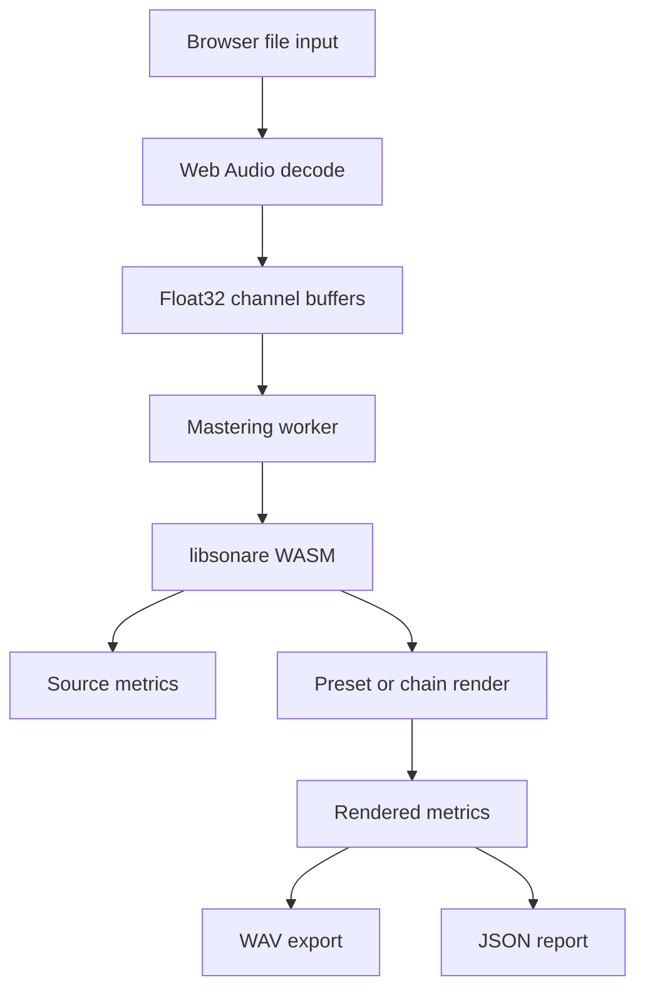

# Mastering Implementation

This page explains how the `/mastering` demo turns a small set of user decisions into a deterministic libsonare mastering render. It is not a generated parameter dump. Use it as the implementation map that connects the UI, worker, WASM exports, and the grouped glossary guides.

The browser demo keeps long-form explanation in VitePress docs. The application UI only shows short labels and links into these pages.

## Render Path

Decoding uses browser APIs. The mastering work runs in a worker so expensive DSP does not block the VitePress page. The worker passes mono or stereo `Float32Array` buffers into the WASM package, receives rendered samples and metrics, then creates local object URLs for playback, download, and reports.

## Data Ownership

Audio stays on the user's device. The source file, optional reference file, rendered WAV, JSON report, and exported settings are represented as local browser objects. They are not uploaded for rendering.

This matters for implementation because the UI cannot depend on server retries, remote queues, or account state. Errors must be recoverable locally: try another browser-supported format, reduce the source length, lower an aggressive setting, or re-render after a worker failure.

## UI To Chain Mapping

Quick Master exposes musical choices. Studio exposes grouped controls. Both routes feed the same underlying chain model.

| UI area | Chain area | Main docs |
|---------|------------|-----------|
| Input gain, denoise | Repair and input | [Repair and Input Controls](./glossary/mastering/repair.md) |
| Tone, exciter, air | Tone and air | [Tone and Air Controls](./glossary/mastering/tone-air.md) |
| Threshold, ratio, attack, release | Dynamics | [Dynamics Controls](./glossary/mastering/dynamics.md) |
| Width, ceiling, target LUFS | Final stage | [Stereo, Limiter, and Loudness Controls](./glossary/mastering/stereo-limiter-loudness.md) |
| Source/reference comparison | Pair analysis | [Reference Match](./glossary/mastering/reference-match.md) |
| LUFS, true peak, crest, correlation | Metering | [Reading Mastering Meters](./glossary/mastering/meter-reading.md) |

The grouped pages are intentionally broad. A compressor page can explain threshold, ratio, attack, release, knee, detector behavior, and gain-reduction reading together; splitting those into one page per parameter would hide the actual decision.

## Algorithm Boundaries

The demo does not reimplement the mastering algorithms in Vue. Vue owns interaction, validation, local playback state, and display. libsonare owns DSP.

:::: details Implementation notes
The worker boundary is the important architectural line. UI state is converted into a serializable chain object, then sent to the worker with transferable channel buffers where possible. The worker initializes the WASM module, calls the selected preset, chain, processor, or analysis API, and posts progress and completion messages back to the UI.

The final result is treated as immutable. A later A/B comparison may apply temporary playback gain for loudness-matched listening, but it does not rewrite the exported WAV. Reports should record rendered metrics, stage names, preset names, target values, and tuning values from the actual render rather than from UI defaults.
::::

## WASM API Surface

The docs track the public mastering API exported by `src/wasm/index.d.ts`. The verification script extracts current `mastering*` and `masterAudio*` functions from that declaration file and requires the JavaScript and native binding docs to mention them.

Use these entry points by intent:

| Intent | API family |
|--------|------------|
| Use a preset | `masterAudio()`, `masterAudioStereo()`, `masteringPresetNames()` |
| Run a full chain | `masteringChain()`, `masteringChainStereo()` |
| Show progress | `masteringChainWithProgress()`, `masteringChainStereoWithProgress()` |
| Render block-by-block | `StreamingMasteringChain` (`prepare` / `processMono` / `processStereo` / `reset` / `latencySamples` / `stageNames`) |
| Run one named processor | `masteringProcessorNames()`, `masteringProcess()`, `masteringProcessStereo()` |
| Compare source and reference | `masteringPairProcessorNames()`, `masteringPairProcess()`, `masteringPairAnalysisNames()`, `masteringPairAnalyze()` |
| Analyze stereo output | `masteringStereoAnalysisNames()`, `masteringStereoAnalyze()` |

## Verification

The release gate uses docs checks as part of `yarn verify`:

- `yarn check:glossary` ensures every published glossary page exists in English and Japanese, has frontmatter, related links, implementation notes, index links, and sidebar exposure.
- `yarn check:mastering-docs` rejects legacy route names, removed parameter-page directories, missing runtime docs, and mismatched WASM API docs.
- `yarn check:built-routes` confirms production output exposes `/mastering` and `/ja/mastering` without removed legacy route pages.

Related: [Browser Local Processing](./glossary/concepts/browser-local-processing.md), [Mastering](./glossary/mastering.md), [JavaScript API](./js-api.md), [WASM](./wasm.md)
