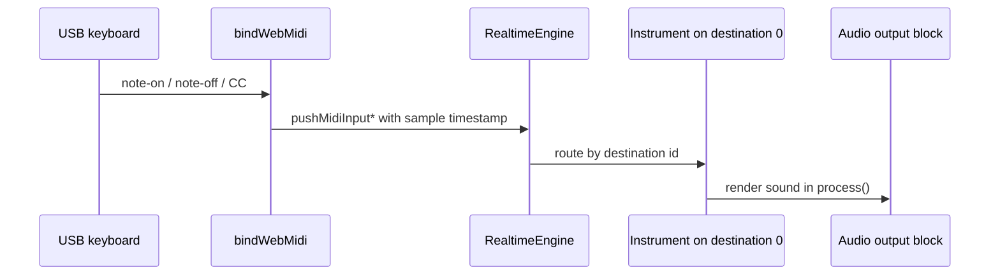

# Live MIDI Input & Web MIDI

**Live MIDI input** turns the realtime engine into an instrument you can play. A note pressed on a USB keyboard becomes a note-on event, the engine routes it to a bound synthesizer, and you hear it on the next audio block — no file, no offline render.

libsonare's `RealtimeEngine` accepts live MIDI on the same realtime-safe surface that drives transport, clips, and automation. In the browser, a small **Web MIDI bridge** (`bindWebMidi`) wires the platform's MIDI ports straight into that engine for you.

::: info MIDI 101
A **note-on** says "this pitch started, this hard"; a **note-off** says "let it go". A **control change (CC)** is a continuous knob/slider message — mod wheel (CC1), sustain (CC64), expression (CC11), and so on. libsonare speaks all three live.
:::

::: info MIDI destination
A **MIDI destination** is not a speaker output. It is an internal instrument slot. MIDI events go to a destination id such as `0`; the instrument bound to that id decides what sound is produced.
:::

::: tip Where this sits
This page is about *playing* the engine from a controller. To bind the instruments those notes reach, see [Native Synth](./native-synth.md) (patch-driven synthesizer) and [SoundFont Player](./soundfont-player.md) (GS/GM `.sf2` playback). To record what you play into a timeline, see [Recording and Takes](./recording-and-takes.md). Microphone audio input is a separate path — see the note at the end.
:::

## The live MIDI path

The browser receives MIDI bytes, `bindWebMidi` converts them into engine events, and the destination's instrument produces audio during `process(...)`.



If you hear silence, check the path in this order: browser permission, `bindWebMidi` input list, destination id, bound instrument, then the AudioWorklet/output wiring.

## What You Will Learn

By the end of this page you should be able to:

- bind a built-in, NativeSynth, or SoundFont instrument to a **MIDI destination** and route live events to it;
- queue live note-on / note-off / CC events with sample-accurate timing;
- map MIDI CCs to engine parameters with `bindMidiCc`;
- swap a per-destination MIDI-FX insert without leaving notes stuck;
- recover from stuck notes with a **MIDI panic**;
- connect a hardware keyboard in the browser with `bindWebMidi`, including hot-plug, permissions, CC bindings, and timestamp-to-sample mapping;
- know the current browser support picture before you ship.

## The MIDI destination model

The engine does not play notes directly — it routes them to **MIDI destinations**, and each destination has an instrument bound to it. A destination is identified by a small integer id (default `0`). You bind an instrument once, then every live event or scheduled clip aimed at that id renders through it.

Three instrument kinds can sit on a destination:

| Bind with | Instrument | See |
|-----------|-----------|-----|
| `setBuiltinInstrument(config, destinationId)` | The built-in waveform synth (the data-free floor) | — |
| `setSynthInstrument(patch, destinationId)` | The patch-driven NativeSynth | [Native Synth](./native-synth.md) |
| `setSf2Instrument(config, destinationId)` | A GS-compatible SoundFont player | [SoundFont Player](./soundfont-player.md) |

```typescript
import { init, RealtimeEngine } from '@libraz/libsonare';

await init();

const engine = new RealtimeEngine(48000, /* maxBlockSize */ 128);

// Destination 0 → a NativeSynth preset (see synthPresetNames()).
engine.setSynthInstrument('saw-lead', 0);

// You can run several destinations at once, each with its own instrument.
engine.setSf2Instrument({ destinationId: 1, gain: 1 }, 1);
```

Use `clearMidiInstrument(destinationId)` to unbind one, and `midiInstrumentCount()` to see how many are live. Multiple destinations let one engine host a layered rig — a lead synth on `0`, drums on `1`, and so on.

## Queueing live events

Live events are *queued*, not played synchronously. Each call hands the engine a sample position at which the event should fire; the next `process(...)` block consumes everything due in that block. That is what makes timing tight: the event lands at an exact frame, not "whenever the message arrived".

There are two queueing surfaces, and you should pick one per destination:

- **Immediate engine commands** — `pushMidiNoteOn` / `pushMidiNoteOff` / `pushMidiCc` / `pushMidiPanic`. Each takes a `destinationId` and a `renderFrame` (or `-1` for "as soon as possible").
- **The engine-owned live input source** — `setMidiInputSource(destinationId)` opens a dedicated input lane, then `pushMidiInputNoteOn` / `pushMidiInputNoteOff` / `pushMidiInputCc` feed it with a `portTimeSamples` timestamp. This is the lane the Web MIDI bridge drives for you.

```typescript
// Immediate path: fire a note at the start of the next block.
engine.pushMidiNoteOn(/* destinationId */ 0, /* group */ 0, /* channel */ 0, /* note */ 60, /* velocity */ 100, -1);
engine.pushMidiCc(0, 0, 0, /* controller */ 1, /* value */ 64, -1);
engine.pushMidiNoteOff(0, 0, 0, 60, 0, -1);

// Input-source path (what bindWebMidi uses under the hood):
engine.setMidiInputSource(0);
engine.pushMidiInputNoteOn(/* group */ 0, /* channel */ 0, 60, 100, /* portTimeSamples */ 0);
engine.pushMidiInputCc(0, 0, 1, 64, 0);
engine.pushMidiInputNoteOff(0, 0, 60, 0, 0);
// engine.midiInputPendingCount()  -> events waiting for the next process() block
```

`group` and `channel` are MIDI nibbles (0..15); `note`, `velocity`, `controller`, and `value` are 7-bit (0..127). A note-on with velocity `0` is treated as a note-off, exactly as the MIDI spec requires.

## Binding MIDI CCs to engine parameters

A CC can do double duty: reach the instrument *and* drive an engine automation parameter. `bindMidiCc(channel, controller, paramId, options)` maps a controller's 7-bit value into `[minValue, maxValue]` for a registered parameter, while the CC still flows to the destination instrument.

```typescript
// Register the parameter the engine should drive, then map mod wheel (CC1) to it.
engine.addParameter({ id: 42, name: 'cutoff', minValue: 0, maxValue: 1, defaultValue: 0.5 });
engine.bindMidiCc(/* channel */ 0, /* controller */ 1, /* paramId */ 42, { minValue: 0, maxValue: 1 });

// engine.midiCcBindingCount()  -> 1
// engine.clearMidiCcBindings() -> remove all mappings
```

::: tip CC "learn" workflows
For an offline "wiggle a knob, capture which CC moved" flow, the project API exposes `Project.midiCcLearn(events, paramId, options)` plus `midiCcToBreakpoint` / `midiParamToCc` for turning recorded CC streams into automation. Those operate on captured `ProjectMidiEvent` data rather than the live engine — see [Project Editing](./project-editing.md).
:::

## Swapping MIDI FX without hanging notes

Each destination can carry one **MIDI-FX insert** — a non-destructive transform on the event stream (transpose, channel filter, velocity curve, …) configured from JSON.

```typescript
engine.setMidiFx(/* destinationId */ 0, JSON.stringify({ /* MIDI-FX config */ }));
engine.clearMidiFx(0);   // omit the id to clear every destination
```

`setMidiFx` *replaces* the insert in place without resetting the instrument's voices, so the common case — swapping one transform for another between phrases — leaves sounding notes untouched. Two safety notes for changing FX while keys are held:

- If you are unsure of the current state, clear the FX first.
- If a transform changes how note-offs are routed and a note is left ringing, follow the swap with a panic (below).

## MIDI panic and stuck-note recovery

A **stuck note** is a note-on whose matching note-off never arrived — a yanked cable, a dropped Bluetooth packet, an FX swap that ate the off. The cure is a **MIDI panic**: an all-notes-off that releases every sounding voice.

```typescript
engine.pushMidiPanic(-1);   // -1 = immediate; or pass a renderFrame to schedule it
```

Panic is realtime-safe and cheap — wire it to a visible "panic" button in any instrument UI. The Web MIDI bridge does not auto-panic on disconnect, so if you handle hot-unplug yourself, send a panic when a port you were playing goes away.

## The browser Web MIDI bridge

::: info A few wire-format terms
**UMP** (Universal MIDI Packet) is the MIDI 2.0 message format; the bridge accepts it as well as classic MIDI 1.0 bytes. **SysEx** (System Exclusive) is a free-form, manufacturer-specific message — used for things like a GS Reset — and browsers gate it behind a separate permission. **RPN / NRPN** ((non-)registered parameter numbers) address extra parameters via CC, for example RPN 0 sets the pitch-bend range.
:::

In the browser, `bindWebMidi(engine, options)` does the plumbing: it requests MIDI access, enables the engine's live input source, attaches listeners to every matching input port, parses incoming bytes (including running status and UMP), and queues them onto the engine with sample timestamps.

```typescript
import { init, RealtimeEngine, isWebMidiAvailable, bindWebMidi } from '@libraz/libsonare';

await init();
if (!isWebMidiAvailable()) {
  // navigator.requestMIDIAccess is missing — fall back to an on-screen keyboard.
}

const engine = new RealtimeEngine(48000, 128);
engine.setSynthInstrument('saw-lead', 0);

const binding = await bindWebMidi(engine, {
  destinationId: 0,        // engine MIDI destination to play (default 0)
  group: 0,                // UMP group for MIDI 1.0 events (default 0)
  // inputIds: ['<port-id>'],  // restrict to specific ports; omit = all connected
  sysex: false,            // request SysEx-capable access (default false)
  software: true,          // request software ports where supported (default true)
  ccBindings: [
    { channel: 0, controller: 1, paramId: 42, options: { minValue: 0, maxValue: 1 } },
  ],
  timestampToSamples: (eventTimeMs) => Math.round((eventTimeMs / 1000) * 48000),
  onInputsChanged: (inputs) => {
    // Called on hot-plug after the helper rebinds matching ports.
    console.log('MIDI inputs:', inputs.map((i) => `${i.name} (${i.state})`));
  },
});

// binding.inputs()  -> WebMidiInputInfo[] { id, name, manufacturer, state }
// binding.access    -> the underlying MIDIAccess object, if you need raw control
```

What each option does:

- **`destinationId` / `group`** — which engine destination the live source feeds, and the UMP group stamped on MIDI 1.0 channel-voice events.
- **`inputIds`** — restrict binding to specific port ids (from `binding.inputs()`); omit or pass an empty array to bind every connected input.
- **`sysex` / `software`** — passed straight to `navigator.requestMIDIAccess`. SysEx access usually triggers a separate permission prompt; `software` requests software-synth ports where the platform offers them.
- **`ccBindings`** — `bindMidiCc` mappings applied *before* any port connects, so the very first knob move is already routed. Register the target parameters with `addParameter(...)` first.
- **`onInputsChanged`** — fires on hot-plug (`MIDIAccess` `statechange`) after the helper has rebound matching ports, with the fresh port list.

### Why timestamp → sample mapping matters

The two clocks don't match. Web MIDI tags each message with a time in milliseconds (the page clock, `DOMHighResTimeStamp`), but the engine schedules events by **sample frame**. `timestampToSamples(eventTimeMs)` is the bridge between them: it converts a message time into the `portTimeSamples` value the engine queues.

Why bother? Get the conversion right and tightly-timed passages — chords, fast runs — land on the exact frame you played them. Omit it, and every event is queued at sample `0` of the next block: fine for casual noodling, audibly loose for anything rhythmic.

A practical implementation tracks the offset between `performance.now()` (or `AudioContext.currentTime`) and the engine's frame clock, and applies that offset here.

### Lifecycle

`bindWebMidi` returns a `WebMidiBinding`. When you are done, call `binding.close()`: it removes the `statechange` listener, detaches every port listener, and calls `engine.clearMidiInputSource()`. It does **not** destroy the engine — release that separately with `engine.destroy()`.

```typescript
binding.close();   // detach MIDI ports + clear the engine input source
engine.destroy();  // release the engine's native handle
```

### Browser support

Web MIDI support is uneven, so check at runtime with `isWebMidiAvailable()` and degrade gracefully:

- **Chrome and Edge (desktop)** — full Web MIDI, including hot-plug and SysEx (behind a permission prompt). The primary target.
- **Firefox** — has shipped Web MIDI; SysEx and add-on requirements have varied over time, so feature-detect rather than assume.
- **Safari** — historically did not expose `navigator.requestMIDIAccess`; support has been changing, so do not assume it is present. Always gate on `isWebMidiAvailable()` and offer an on-screen-keyboard fallback.

Because the landscape shifts, treat the feature check as the source of truth in code and keep any prose claims conservative.

## Recipe: a USB keyboard plays a synth in the browser

A complete minimal path from "keyboard plugged in" to "sound out of the speakers". The engine setup and the MIDI bridge are plain JS; the audio-output wiring requires a browser `AudioContext` / `AudioWorklet`.

```typescript
import { init, RealtimeEngine, isWebMidiAvailable, bindWebMidi } from '@libraz/libsonare';

async function startKeyboardSynth() {
  await init();

  if (!isWebMidiAvailable()) {
    throw new Error('Web MIDI not available — use an on-screen keyboard fallback.');
  }

  // --- Engine + instrument (runs anywhere) ---
  const sampleRate = 48000;
  const engine = new RealtimeEngine(sampleRate, 128);
  engine.setSynthInstrument('saw-lead', 0);

  // --- Audio output (browser only) ---
  // Drive engine.process(...) from an AudioWorkletNode so its output reaches
  // the speakers. See "Realtime and Streaming" for the full worklet bridge;
  // the engine, instrument binding, and MIDI wiring below are the parts unique
  // to live MIDI input.
  const context = new AudioContext({ sampleRate });   // browser
  await context.resume();                             // browser (gesture-gated)

  // --- MIDI bridge (browser only) ---
  const binding = await bindWebMidi(engine, {
    destinationId: 0,
    timestampToSamples: (ms) => Math.round((ms / 1000) * sampleRate),
    onInputsChanged: (inputs) =>
      console.log('keyboards:', inputs.map((i) => i.name).join(', ')),
  });

  // Now pressing a key on the USB keyboard sounds the 'saw-lead' patch.

  return {
    stop() {
      binding.close();   // detach MIDI ports, clear the engine input source
      engine.destroy();  // release the native handle
      void context.close();
    },
  };
}
```

::: warning Browser gestures and cleanup
An `AudioContext` must be created/resumed from a user gesture (a click), and most browsers only prompt for MIDI access from a secure context. Always pair `bindWebMidi` with `binding.close()` and `engine.destroy()` so ports and native memory are released when the page tears down.
:::

## On other runtimes

The live-MIDI engine surface is not browser-only. The **Node native** and **Python** bindings expose the same `RealtimeEngine` input methods — only the Web MIDI bridge itself is browser-specific (it depends on `navigator.requestMIDIAccess`). In Python the names follow the snake_case convention:

```python
import libsonare as sonare

engine = sonare.RealtimeEngine(sample_rate=48000.0, max_block_size=128)
try:
    engine.set_synth_instrument("saw-lead", destination_id=0)
    engine.set_midi_input_source(0)
    engine.push_midi_input_note_on(0, 0, 60, 100, 0)   # group, channel, note, velocity, port_time_samples
    engine.push_midi_input_cc(0, 0, 1, 64, 0)
    engine.push_midi_input_note_off(0, 0, 60, 0, 0)
    out = engine.process([[0.0] * 128, [0.0] * 128])   # non-zero once the note sounds
finally:
    engine.close()
```

To feed those engines from real hardware, read MIDI with a platform library (for example a CoreMIDI/ALSA wrapper) and call the same `push_midi_input_*` methods — the timestamp-to-sample mapping is yours to supply, just as `timestampToSamples` is in the browser.

## A note on microphone input

Live MIDI is *control* input — it tells the engine what to play. **Audio** input (a microphone, an instrument through an interface) is a different path: `bindMicrophoneInput(context, engine, options)` routes captured audio into the engine for monitoring and recording. The two are independent and can run at once. See [Recording and Takes](./recording-and-takes.md).

## Related

- [Native Synth](./native-synth.md) — the patch-driven instrument you bind to a destination
- [SoundFont Player](./soundfont-player.md) — GS/GM `.sf2` playback on a destination
- [Recording and Takes](./recording-and-takes.md) — capture what you play (and microphone audio input)
- [Project Editing](./project-editing.md) — MIDI clips, CC-learn, and turning CC into automation
- [Project Bounce](./project-bounce.md) — render a MIDI performance offline
- [Realtime and Streaming](./realtime-streaming.md) — the AudioWorklet engine bridge that drives audio output
- [Realtime Engine](./glossary/realtime/realtime-engine.md) · [Realtime Safety](./glossary/realtime/realtime-safety.md)
