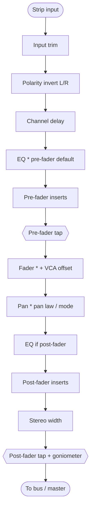

# Mixing Engine

**Mixing** is the step where many separate tracks are balanced and combined into one stereo result. Those tracks might be a vocal, a bass, a drum kit, and a music bed.

libsonare includes a real-time-safe mixing and routing engine on top of the same C++ DSP core that powers the [mastering processors](./mastering-processors.md). That means you can build a small mixer **inside your own app**; no DAW host is required.

If the words *strip*, *bus*, *send*, *fader*, *pan*, or *automation* are new to you, read [Mixing Basics](./glossary/concepts/mixing-basics.md) first — this page assumes you know what they mean and focuses on **how libsonare implements them** and **what to call to get a job done**.

::: tip Where mixing sits in the pipeline
**Analysis** tells you *what* a track is. **Editing** fixes timing and pitch of one track. **Mixing** balances *several* tracks into a stereo bus. **Mastering** polishes that finished stereo mix for delivery. Mixing is the stage that turns "a folder of stems" into "a song". You usually mix first, then master the result.
:::

## What You Will Learn

By the end of this page you should be able to:

- pick `mixStereo` for one-shot stem rendering or `Mixer.fromSceneJson` for persistent routing;
- follow the signal flow through trim, polarity, delay, EQ, inserts, fader, pan, width, sends, and meters;
- understand pre-fader vs post-fader sends well enough to avoid the common routing mistake;
- schedule automation and read meters without breaking realtime constraints;
- decide when to move from the guide to the field-by-field [Mixing Scene JSON](./mixing-scene-json.md) reference.

## Pick the right entry point

The engine is deliberately split into two levels. Start at the top row and only move down when you actually need the extra control.

| Your situation | Use | Why |
|----------------|-----|-----|
| You have a handful of stereo stems and want one rendered file | [`mixStereo(...)`](#one-shot-mixing-mixstereo) | One call, plain arrays, nothing to clean up |
| You need sends, buses, inserts, automation, meters, or a saved project | [`Mixer.fromSceneJson(...)`](#scene-based-mixing-mixer) | Persistent, serializable mixer state |
| You are inside a browser `AudioWorklet` or audio callback | WASM [`Mixer.createRealtimeBuffer()`](#realtime-and-the-audioworklet-bridge) | Reuses buffers, never allocates per block |

::: info One engine, every runtime
The same mixer engine is exposed through WASM/JS, Node native, Python, the C ABI, and the CLI. Names follow each language's convention (`mixStereo` ↔ `mix_stereo`; `fromSceneJson` ↔ `from_scene_json`), while the routing graph, scene JSON, and DSP are identical. The CLI renders scenes rather than exposing a persistent `Mixer` object. See [Binding Parity](./binding-parity.md) for the per-runtime table.
:::

## The channel strip, signal by signal

A **channel strip** is one track lane. Understanding the order in which a strip processes audio is the key to predicting what every control does — for example, *why* a post-fader send follows the fader but a pre-fader send does not.

libsonare processes each block of a strip in this exact order:



Reading the chain top to bottom:

1. **Input trim** — a clean gain stage *before* anything else, used to set a sensible working level (see [gain staging](./glossary/concepts/gain-staging.md)). This is not the fader; trim is for "get the level right going in", the fader is for "balance against other tracks".
2. **Polarity invert** — flips the sign of the left and/or right channel. Used to fix a track recorded out of phase with another.
3. **Channel delay** — a per-strip sample delay. It both time-aligns a track and contributes to the engine's [delay compensation](#latency-and-plugin-delay-compensation-pdc).
4. **EQ** — a built-in parametric EQ. It sits **pre-fader by default** (so the fader rides the EQ'd signal), but can be moved post-fader.
5. **Pre-fader inserts** — your named processors (compressor, de-esser, …) running *before* the fader.
6. **Pre-fader tap** — the point a *pre-fader* send and the pre-fader meter read from. Because it is before the fader, moving the fader does **not** change a pre-fader send level.
7. **Fader (+ VCA offset)** — the main level control. A [VCA group](#vca-groups) offset is summed in here, so one group fader can trim many strips at once.
8. **Pan** — places the signal in the stereo field using the strip's [pan mode and pan law](#pan-modes-and-pan-laws).
9. **Post-fader inserts** (and EQ, if you moved it post-fader) — processors that should react to the post-fader level.
10. **Stereo width** — narrows or widens the side signal (see [mono compatibility](./glossary/concepts/mono-compatibility.md)).
11. **Post-fader tap + goniometer** — feeds *post-fader* sends, the output meter, and the goniometer history buffer.

::: warning Pre-fader vs post-fader is not cosmetic
A **post-fader** send follows the fader: pull the fader down and the reverb sent from that track follows it down — the reverb stays proportional to the dry signal. A **pre-fader** send is independent of the fader, which is what you want for a headphone/cue mix or a fully wet effect return. Choosing the wrong one is the most common routing mistake.
:::

:::: details How this maps to the code
The order above is exactly `ChannelStrip::process_segment`: `input_trim → polarity → alignment_delay → eq(pre) → pre-inserts → [pre tap] → fader(+VCA) → panner → eq(post) → post-inserts → width → [goniometer + post tap]`. The pre/post taps are pre-allocated scratch buffers, so a send never allocates on the audio thread. Each scheduled automation event (fader, pan, width, send, insert) is applied at its sample position inside this same per-segment loop, which is what makes automation sample-accurate.
::::

## One-shot mixing: `mixStereo`

For "I have a few stems, give me one stereo file", `mixStereo` is the whole story. It takes per-track left/right channels plus parallel arrays of settings and returns the rendered master plus per-track meters.

::: code-group

```typescript [Browser]
import { init, mixStereo } from '@libraz/libsonare';

await init();

const mix = mixStereo([vocalL, musicL], [vocalR, musicR], sampleRate, {
  inputTrimDb: [3, 0],     // nudge the quiet vocal up before the fader
  faderDb: [-3, -12],      // balance: vocal forward, music back
  pan: [0, -0.2],          // music slightly left
  width: [1, 0.9],         // narrow the music a touch for mono safety
  // panMode / muted are optional and also accept per-track arrays
});

// mix.left, mix.right  -> Float32Array master
// mix.meters[i]         -> per-track MixMeterSnapshot (see "Metering")
```

```python [Python]
import libsonare as sonare

mix = sonare.mix_stereo(
    [(vocal_l, vocal_r), (music_l, music_r)],
    sample_rate=48000,
    input_trim_db=[3, 0],   # nudge the quiet vocal up before the fader
    fader_db=[-3, -12],     # balance: vocal forward, music back
    pan=[0, -0.2],          # music slightly left
    width=[1, 0.9],         # narrow the music a touch for mono safety
)

# mix.left, mix.right -> master samples
# mix.meters[i]        -> per-track MixMeterSnapshot (see "Metering")
```

```bash [CLI]
sonare mix \
  --preset vocalReverbSend \
  --input vocal.wav \
  --input music.wav \
  --sample-rate 48000 \
  -o master.wav
```

:::

::: tip Scalar or per-track
In JavaScript, `mixStereo` options accept either a single value (applied to all tracks) or an array (one entry per track). `faderDb: -3` lowers everything by 3 dB; `faderDb: [-3, -12]` sets each track independently.

In Python, `mix_stereo(...)` expects per-strip sequences for `fader_db`, `pan`, `width`, `muted`, and `input_trim_db`; `pan_mode` may be one value for all strips or a per-strip sequence.
:::

Use `mixStereo` for offline utilities, batch scripts, and the simplest path to a rendered file. When you outgrow it — the moment you need a reverb send, a subgroup, automation, or a saved project — move to the scene-based `Mixer`.

## Scene-based mixing: `Mixer`

A **scene** is a plain-JSON description of a whole mixer: its strips, their inserts and sends, the buses, VCA groups, and the connections between them. `Mixer.fromSceneJson(...)` compiles that description into a routing graph you can feed block by block.

::: code-group

```typescript [Browser]
import { init, Mixer, mixingScenePresetJson, mixingScenePresetNames } from '@libraz/libsonare';

await init();

mixingScenePresetNames();                                  // ['vocalReverbSend', 'drumBusSubgroup', 'commentaryDucking']
const sceneJson = mixingScenePresetJson('vocalReverbSend'); // an editable starting point

const mixer = Mixer.fromSceneJson(sceneJson, sampleRate, /* blockSize */ 512);
try {
  // Feed one block of per-strip stereo audio; get the routed stereo master back.
  const out = mixer.processStereo(
    [vocalBlockL, returnBlockL],
    [vocalBlockR, returnBlockR],
  );

  const vocalMeter = mixer.stripMeter(0, 'postFader');     // see "Metering"
} finally {
  mixer.delete();   // the WASM handle is NOT garbage-collected — always release it
}
```

```python [Python]
import libsonare as sonare

sonare.mixing_scene_preset_names()                          # ['vocalReverbSend', 'drumBusSubgroup', 'commentaryDucking']
scene_json = sonare.mixing_scene_preset_json("vocalReverbSend")

mixer = sonare.Mixer.from_scene_json(scene_json, sample_rate=48000, block_size=512)
block = mixer.process_stereo(
    [vocal_block_l, return_block_l],
    [vocal_block_r, return_block_r],
)
vocal_meter = mixer.strip_meter(0, tap="postFader")         # see "Metering"
mixer.close()                                               # release the native handle
```

```bash [CLI]
# Render per-strip WAV inputs through a built-in scene preset (one --input per strip)
sonare mix --preset vocalReverbSend \
  --input vocal.wav --input reverb-return.wav \
  --sample-rate 48000 -o master.wav

# Or load a scene JSON file you saved from toSceneJson()/to_scene_json()
sonare mix --scene my-scene.json --input vocal.wav --input reverb-return.wav -o master.wav
```

:::

::: danger Always release the mixer
`Mixer`, like every embind object, holds a WASM heap handle that JavaScript's garbage collector cannot reclaim. Call `mixer.delete()` (Node also accepts `destroy()`) in a `finally` block. Leaking handles will slowly exhaust WASM memory in long sessions.
:::

The full scene schema, every field, and annotated preset JSON live in [Mixing Scene JSON](./mixing-scene-json.md). The three built-in presets (`vocalReverbSend`, `drumBusSubgroup`, `commentaryDucking`) are not opaque — load one, edit it, and re-serialize it with `toSceneJson()` (or Python `to_scene_json()`) to learn the format by example.

### Inserts vs sends

These are the two ways a strip uses a processor, and they answer different questions:

| | Insert | Send |
|---|--------|------|
| Signal path | In series — the *whole* signal passes through | In parallel — a *copy* is routed to a bus |
| Typical use | Compressor, EQ, de-esser on the track itself | Shared reverb/delay several tracks feed |
| Wet/dry | The processor's own mix controls it | Dry stays on the strip; only the send copy is processed |
| Where it taps | After the relevant fader stage | Pre- or post-fader, your choice |

A reverb you want on one vocal can be an insert. A reverb you want *shared* across the vocal, the snare, and the guitar should be a **send** into an aux bus with a reverb on its return — one reverb instance, many sources, consistent space.

### Buses, roles, and the routing graph

A **bus** is a shared destination. Strips connect to buses, buses connect to other buses, and one bus is the `master`. Each bus carries a `role`:

| Role | Meaning |
|------|---------|
| `master` | The final stereo output. Every signal eventually reaches it. |
| `aux` | A parallel destination for sends, typically an effect return (reverb, delay). |
| `submix` | A group of strips processed together before the master (a "drum bus"). |

Connections form a graph. `Mixer.fromSceneJson` compiles that graph lazily on the first `processStereo` call.

Call `compile()` after a **topology** change, before the next timing-critical block. Topology changes include:

- adding or removing a bus
- adding or removing a send
- adding or removing a VCA group

Parameter changes and automation changes do **not** need a recompile.

Strip addressing differs by runtime:

| Runtime | How to address strips |
|---------|-----------------------|
| WASM | Mixer control methods use numeric strip indexes. Use `stripById(id)` first when you have a scene id. |
| Node native / Python | Most control methods accept either a numeric index or a strip id string. |

### VCA groups

A **VCA group** is a single fader that trims the level of several strips *without* re-routing their audio.

For example, pull the "drums" VCA down 2 dB and the kick, snare, and overheads all drop 2 dB while still flowing to their own buses.

The group's `gainDb` is summed into each member's fader stage (step 7 above). Add live offsets with `setVcaOffsetDb(...)`; persistent membership lives in the scene.

### Solo and mute logic

- `setMuted(strip, true)` silences a strip.
- `setSoloed(strip, true)` implies-mutes every other strip — except those you mark **solo-safe** with `setSoloSafe(...)`. Mark effect-return strips solo-safe so soloing a vocal still lets you hear its reverb return.

Solo, mute, and solo-safe take effect on the next block **without** a graph recompile.

### Pan modes and pan laws

**Pan mode** is *how* a position maps to left/right; **pan law** is *how loud* the center is relative to the sides.

- `balance` — for already-stereo material; turns one side down rather than moving the image.
- `stereoPan` — a true pan that moves a mono-ish source across the field.
- `dualPan` — independent left and right positions (set with `setDualPan(...)`), e.g. collapse a wide stereo track inward.

Pan law options are `const3dB`, `const4.5dB`, `const6dB`, and `linear0dB` in the JavaScript APIs.

Python accepts the same values as enums/ints, or normalized strings such as `const-3db` and `linear-0db`.

Constant-power laws, usually 3 dB or 4.5 dB, keep *perceived* loudness steady as you pan. `linear0dB` keeps the summed level steady instead.

## Automation

Every time-varying control is scheduled at an **absolute sample position** measured from the first `processStereo` call (recompiling resets the clock to 0). Available lanes:

```typescript
mixer.scheduleFaderAutomation(stripIndex, sampleRate * 8,  -6, 's-curve');   // ride the vocal down at 8 s
mixer.schedulePanAutomation(stripIndex, sampleRate * 12,  0.3, 'linear');
mixer.scheduleWidthAutomation(stripIndex, sampleRate * 12, 1.2, 'linear');
mixer.scheduleSendAutomation(stripIndex, sendIndex, sampleRate * 16, -12, 'hold');
mixer.scheduleInsertAutomation(stripIndex, insertIndex, paramId, sampleRate * 4, value, 'exponential');
```

The interpolation **curve** shapes the move between events:

| Curve | Shape | Use it for |
|-------|-------|-----------|
| `linear` | straight ramp | general level/pan moves |
| `exponential` | fast then slow | natural-sounding fades |
| `s-curve` | ease in *and* out | smooth, click-free transitions |
| `hold` | jump, no ramp | stepped/instant changes |

::: tip Insert parameter automation
`scheduleInsertAutomation` addresses inserts by their index in the *combined* sequence `[pre-inserts…, post-inserts…]`, and the `paramId` is processor-specific. Automating a compressor threshold to duck under a voice is a classic use — though for sidechain ducking the [`commentaryDucking`](./mixing-scene-json.md#built-in-presets) preset wires it for you.
:::

## Metering

Every strip (and the master) exposes a rich `MixMeterSnapshot`. Read it post-render from `mixStereo`'s `meters[]`, or live from `mixer.meterTap(strip, 'preFader' | 'postFader')`. `stripMeter(...)` is a convenience alias in WASM/Python and a post-fader convenience path in Node native.

| Field | Tells you |
|-------|-----------|
| `peakDbL` / `peakDbR` | Sample peak per channel |
| `truePeakDbL` / `truePeakDbR` / `maxTruePeakDb` | Inter-sample [true peak](./glossary/true-peak.md) — what a DAC actually reconstructs |
| `rmsDbL` / `rmsDbR` | Short-term average level |
| `momentaryLufs` / `shortTermLufs` / `integratedLufs` | [Loudness](./glossary/lufs.md) over 400 ms / 3 s / the whole signal |
| `correlation` | −1…+1 phase correlation; near +1 is mono-safe, negative warns of cancellation |
| `monoCompatWidth` / `monoCompatPeak` / `monoCompatSideRms` / `likelyMonoCompatible` | [Mono-compatibility](./glossary/concepts/mono-compatibility.md) summary |
| `gainReductionDb` | How hard dynamics on the strip are working |
| `seq` | Monotonic snapshot counter for change detection |

The **goniometer** is a separate, time-domain view: `readGoniometerLatest(strip, maxPoints)` returns the most recent left/right sample pairs (oldest → newest) for plotting a stereo vectorscope.

## Realtime and the AudioWorklet bridge

The mixer core is built for predictable audio callbacks: denormal guards, lock-free parameter changes, pre-allocated state, and graph-level [plugin-delay compensation](#latency-and-plugin-delay-compensation-pdc).

In the WASM wrapper, render loops where allocations are forbidden can avoid `processStereo` because it allocates a result. Use one of:

- **`processStereoInto(inL, inR, outL, outR)`** — writes into caller-owned arrays.
- **`createRealtimeBuffer()`** — returns reusable WASM-heap input/output views; fill the inputs, call `process()`, read `outLeft`/`outRight`, repeat. The views are owned by the mixer and become invalid after `delete()`.

::: details What are denormal guards?
Denormals are extremely small floating-point numbers (close to zero) that many CPUs process far more slowly than ordinary values. In an audio callback this bites when a reverb or delay tail fades out: as the samples shrink toward zero they slip into the denormal range and processing time can spike, causing dropouts. Denormal guards flush these tiny values to zero so each block takes a predictable amount of time.
:::

::: warning Topology changes are not realtime-safe
Adding buses, sends, or VCA groups marks the graph dirty and the next `processStereo` will recompile (which may allocate). Do structural changes during setup or a non-critical block, call `compile()`, *then* enter your tight render loop. Fader/pan/send/insert moves and automation are fine inside the loop.
:::

### Latency and plugin-delay compensation (PDC)

Lookahead processors, such as a limiter on a drum bus, add latency. If one path through the graph is delayed and another is not, the two arrive at the master misaligned.

Plugin-delay compensation (PDC) fixes that alignment problem:

1. The engine measures each path's latency.
2. It delays the shorter paths to match the longest path.
3. The paths line up again at the master.

Per-strip `channelDelaySamples` feeds into the same calculation. Recompile after changing it so PDC runs again.

## Recipes

:::: details Balance and bounce a few stems
The fastest possible mix. No buses, no automation — just trim, balance, and render.

```typescript
const mix = mixStereo(lefts, rights, sampleRate, {
  inputTrimDb: trims,   // get each stem to a sane working level
  faderDb: balances,    // then balance them against each other
  pan: positions,
});
exportWav(mix.left, mix.right, mix.sampleRate);
```
::::

:::: details Shared vocal reverb on an aux send
One reverb, fed by a post-fader send, returning on its own strip — the `vocalReverbSend` preset in miniature.

```typescript
const mixer = Mixer.fromSceneJson(mixingScenePresetJson('vocalReverbSend'), sampleRate, 512);
// strip 0 = "vocal" (EQ + compressor inserts, post-fader send to the "vocal-verb" aux)
// strip 1 = "vocal-verb-return" (plate reverb insert, returns to master)
mixer.setSendDb(0, 0, -10);          // more reverb
mixer.compile();                      // only needed after topology edits
```
Because the send is post-fader, automating the vocal fader down also pulls its reverb down with it.
::::

:::: details Drum subgroup with parallel compression
Route kick/snare/overheads into one `submix` bus, glue them with parallel compression and tape, and ride them all with a VCA — the `drumBusSubgroup` preset.

```typescript
const mixer = Mixer.fromSceneJson(mixingScenePresetJson('drumBusSubgroup'), sampleRate, 512);
mixer.setVcaOffsetDb(/* a drum member strip */ 0, -1.5);  // trim the whole kit live
```
::::

:::: details Podcast / commentary ducking
Duck a music bed under speech automatically using a sidechain. The `commentaryDucking` preset puts a `dynamics.sidechainRouter` on the bed keyed off the host strip.

```typescript
const mixer = Mixer.fromSceneJson(mixingScenePresetJson('commentaryDucking'), sampleRate, 512);
// host + guest are VCA-grouped as "voices"; the music-bed strip ducks whenever the host speaks
```
::::

## Related

- [Mixing Basics](./glossary/concepts/mixing-basics.md) — the vocabulary, for newcomers
- [Mixing Scene JSON](./mixing-scene-json.md) — the full scene schema and annotated presets
- [Mastering Processors](./mastering-processors.md) — the processors you load as strip/bus inserts
- [Binding Parity](./binding-parity.md) — per-runtime API differences
- [Mono Compatibility](./glossary/concepts/mono-compatibility.md) · [Gain Staging](./glossary/concepts/gain-staging.md) · [True Peak](./glossary/true-peak.md)
