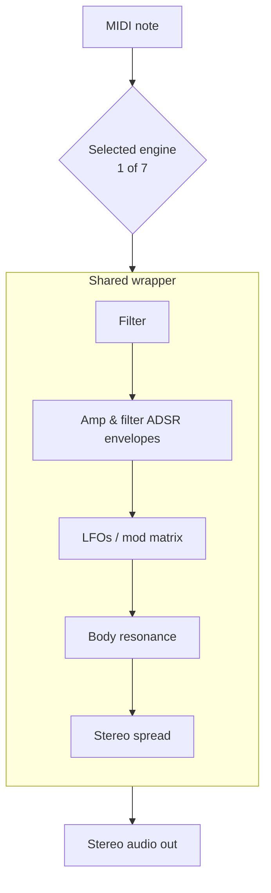

# Built-in Synthesizer (NativeSynth)

**NativeSynth turns MIDI into sound on its own** — no samples to download, no SoundFont to ship. It is built into libsonare, so a MIDI track always makes sound out of the box.

Under the hood, NativeSynth is one synthesizer with **seven swappable synthesis engines**, each a different way of making a tone:

- a virtual-analog subtractive voice (classic synth leads and pads),
- FM (electric pianos and bells),
- Karplus-Strong plucked string (guitars and harps),
- modal percussion (marimba, vibraphone),
- additive drawbar organ,
- membrane percussion (the drum kit),
- and an extended-waveguide acoustic piano.

All seven share one modulation/envelope/filter layer, so they behave consistently. To get a sound, pick a preset by name — or build one field-by-field with a `SynthPatch`. You never have to touch the engine internals to start.

::: info Synthesis terms in one place
The engine names below are different ways to *generate* a tone. You don't need them all to start — pick a preset and play — but here is the one-line version of each:

- **subtractive** — start with a bright waveform and carve it with a filter (the classic analog-synth recipe).
- **FM / phase modulation** — one oscillator's pitch modulates another, producing metallic and bell-like tones.
- **Karplus-Strong** — a short delay loop that models a plucked string.
- **modal** — a bank of tuned resonators modeling a struck bar or bell.
- **additive / drawbar** — sums harmonic sine partials, like the drawbars on a Hammond organ.
- **(extended) waveguide** — a delay-line model of a vibrating string or tube.

Two terms appear in every engine's wrapper: an **ADSR envelope** (attack/decay/sustain/release — how a level rises and falls over a note) and the **mod matrix** (routes modulation sources such as LFOs or envelopes to targets such as pitch or filter cutoff).
:::

::: info MIDI never renders silent
NativeSynth is also the **data-free floor** of the [SoundFont player](./soundfont-player.md). When you bounce a project through an SF2 and a program (or the whole SoundFont) is missing, those notes fall back to the NativeSynth **GM fallback bank** — all 128 General MIDI programs plus the drum map. You get audio either way.
:::

::: tip Where NativeSynth sits
A NativeSynth patch is an **instrument**: you bind it to a MIDI destination, and the MIDI on tracks routed to that destination plays through it. Offline you bind it in [`bounceWithSynthInstrument`](./project-bounce.md); live you bind it with `engine.setSynthInstrument` and feed [MIDI input](./midi-input.md). For sampled, multisampled instruments instead, use the [SoundFont player](./soundfont-player.md).
:::

A single signal path runs through NativeSynth on every note: a MIDI note picks one of the seven engines, and the engine's raw tone then flows through the shared wrapper before reaching the stereo output.



## What You Will Learn

By the end of this page you should be able to:

- pick the right synthesis engine for a sound, and the right named preset;
- start from a preset and override individual fields with a `SynthPatch`;
- list the **real** preset and enum names from the runtime instead of guessing;
- understand the `va:` routing prefix and the `drum-kit` GM drum map;
- render MIDI to audio offline with `bounceWithSynthInstrument` and live with `setSynthInstrument`;
- know when a note plays NativeSynth versus the loaded SoundFont.

## The seven synthesis engines

Every preset selects one `engineMode`. The wrapper sections (filter, envelopes, LFOs, mod matrix, body resonance, polyphony) apply on top of whichever engine is active. Mode-specific deep parameters — FM operator stacks, modal mode tables, drawbar registrations, kit pieces, piano strings — live **inside the named presets**, not in the patch.

### `subtractive` — virtual-analog

The classic oscillator → filter → amp voice. Detuned unison, drift, a pre-filter drive stage, and a choice of four filter models give it everything from fat saw leads to wide pads. Good for **leads, basses, pads, and plucks** — anything you'd reach for an analog synth to do. Presets: `sine`, `saw-lead`, `square-lead`, `sub-bass`, `warm-pad`.

The filter model is the heart of the "character". Four classic models are available via `filterModel`:

| Model | Voicing it emulates | Notes |
|-------|--------------------|-------|
| `svf` | TPT state-variable (SEM family) | Clean, the only model with a selectable `filterOutput` (lowpass / bandpass / highpass) |
| `moog-ladder` | 4-pole transistor ladder | Zero-delay-feedback, saturating loop, self-oscillates |
| `diode-ladder` | Diode ladder (VCS3 / TB-303 family) | Coupled-stage ZDF, self-oscillates |
| `sallen-key` | Korg35 Sallen-Key (MS-10 / early MS-20) | Self-oscillates |

All four stay stable and zipper-free under per-sample cutoff/resonance modulation, and self-oscillation is deterministic.

### `fm` — frequency modulation

A phase-modulation operator stack (one oscillator's pitch modulates another → metallic/bell tones) with a small algorithm table, exponential operator envelopes, a feedback operator, and velocity-to-index (brightness) scaling. Good for **electric pianos, bells, mallets, clav/harpsichord, and brass** — the metallic, bell-like, and inharmonic sounds subtractive struggles with. Presets: `e-piano`, `bell`, `brass`.

### `karplus-strong` — plucked string

A fractional-delay waveguide loop (a short delay loop that models a plucked string) with phase-exact tuning, plus pick-position comb, velocity-driven brightness, decay stretching, and note-off loop damping (finger/palm mute). Good for **plucked and strummed strings** — guitar, harp, and the plucked ethnic family. Presets: `pluck`, `electric-guitar`, `harp`.

### `modal` — mallet percussion

A modal resonator bank (a bank of tuned resonators modeling a struck bar or bell) tuned to physical mode ratios (uniform-bar glockenspiel, deep-arch marimba/vibraphone), with mallet-hardness velocity weighting and per-mode decay. Good for **tuned mallet instruments** — glockenspiel, vibraphone, marimba, xylophone. Presets: `marimba`, `glass`.

### `additive` — drawbar organ

The nine Hammond drawbar pitches (summing harmonic sine partials, one drawbar per partial) with stepped stop levels, free-running partial phases, and a key-click contact transient. Good for **organs** — sustained, harmonic-rich registrations. Preset: `organ`.

### `percussion` — membrane percussion

Rayleigh circular-membrane modes with a descending strike-pitch envelope under filtered noise. This engine backs the **GM drum kit** — kick, snare shell + wires, toms, hats, and cymbals with inharmonic ring modes, one-shot and deterministic. Preset: `drum-kit`.

### `piano` — extended-waveguide acoustic piano

A data-free grand-piano sketch with the four piano-defining elements: stiff-string dispersion (partials stretch sharp up the keyboard), a nonlinear felt hammer (hard strikes are shorter and brighter), 2-3 coupled micro-detuned unison strings, and a soundboard resonator bank. Good for **acoustic piano**. Preset: `acoustic-piano`.

## The named preset catalog

NativeSynth ships a small, named preset catalog. **Do not hardcode preset names** — list them from the runtime with `synthPresetNames()`, and inspect any one as a `SynthPatch` with `synthPresetPatch(name)`.

::: code-group

```typescript [Browser]
import { init, synthPresetNames, synthPresetPatch } from '@libraz/libsonare';

await init();

synthPresetNames();
// ['sine', 'saw-lead', 'square-lead', 'sub-bass', 'warm-pad', 'e-piano',
//  'bell', 'brass', 'pluck', 'electric-guitar', 'harp', 'marimba', 'glass',
//  'organ', 'drum-kit', 'acoustic-piano']

const pad = synthPresetPatch('warm-pad');
// { preset: 'warm-pad', engineMode: 'subtractive', waveform: 'saw',
//   unison: 7, detuneCents: 18, cutoffHz: 2800, ampAttackMs: 400, ... }
```

```python [Python]
import libsonare as sonare

sonare.synth_preset_names()
# ['sine', 'saw-lead', 'square-lead', 'sub-bass', 'warm-pad', 'e-piano',
#  'bell', 'brass', 'pluck', 'electric-guitar', 'harp', 'marimba', 'glass',
#  'organ', 'drum-kit', 'acoustic-piano']

pad = sonare.synth_preset_patch("warm-pad")
# SynthPatch(preset='warm-pad', engine_mode='subtractive', waveform='saw',
#            unison=7, detune_cents=18.0, cutoff_hz=2800.0, ...)
```

:::

The catalog maps to the engines like this (one preset per row is enough to feel each engine):

| Preset | Engine | Good for |
|--------|--------|----------|
| `sine` `saw-lead` `square-lead` `sub-bass` `warm-pad` | `subtractive` | leads, basses, pads |
| `e-piano` `bell` `brass` | `fm` | electric piano, bells, brass |
| `pluck` `electric-guitar` `harp` | `karplus-strong` | plucked strings |
| `marimba` `glass` | `modal` | tuned mallets |
| `organ` | `additive` | drawbar organ |
| `drum-kit` | `percussion` | GM drum map |
| `acoustic-piano` | `piano` | acoustic piano |

### The `va:` routing prefix

A preset name may carry a `va:` prefix (for example `va:saw-lead`, `va:e-piano`). The prefix is **accepted everywhere a preset name is** — `synthPresetPatch`, `bounceWithSynthInstrument`, and `setSynthInstrument` — and resolves to the same patch as the bare name. It is a routing convention some hosts use to mark "this destination plays the virtual-analog NativeSynth"; the synth strips it before lookup.

### The `drum-kit` preset and the GM drum map

`drum-kit` selects the `percussion` engine and maps incoming MIDI notes to the **General MIDI drum map** — note 36 is the kick, note 38 the acoustic snare, and so on — rather than treating note number as pitch. Route a drum pattern's notes to a destination bound to `drum-kit` and each note triggers its mapped piece.

## The `SynthPatch` object

Think of a `SynthPatch` as "a preset, plus your tweaks". It starts from a **base** — the named `preset` (omit it for the default subtractive init patch) — and every field you set overrides that base. Leave a field out and the base value stays.

::: warning Zero means "keep the base", not "set to zero"
Each numeric field follows one rule: **0 (or omitted) keeps the base value; any non-zero value overrides it** (clamped to its audible range). Enum fields use `'default'` for "keep".

The catch: you cannot force a field to literally zero. Writing `ampSustain: 0` does **not** silence the sustain — it just keeps the preset's sustain. (This is because the frozen C ABI has no per-field "is this set?" flag, so zero has to mean "untouched".)

One more rule: a non-empty `modRoutings` array **replaces** the base mod matrix entirely, rather than adding to it.
:::

The patch exposes the wrapper sections every engine shares:

::: info Cents, velocity, and key tracking
- **Cent** — 1/100 of a semitone; 100 cents = one piano key, 1200 = an octave. Pitch and detune amounts are in cents.
- **Velocity** — how hard a note was struck (0–127); presets use it to control brightness or loudness.
- **Key tracking** — making a parameter (like filter cutoff) follow the note's pitch up the keyboard.
:::

| Group | Fields |
|-------|--------|
| Oscillator | `engineMode`, `waveform`, `unison` (1-7), `detuneCents`, `driftCents`, `drive` (0-1) |
| Filter | `filterModel`, `filterOutput` (SVF only), `cutoffHz`, `resonanceQ`, `keyTrack` (0-1), `envToCutoffCents`, `velToCutoffCents` |
| Amp envelope | `ampAttackMs`, `ampDecayMs`, `ampSustain`, `ampReleaseMs` |
| Filter envelope | `filterAttackMs`, `filterDecayMs`, `filterSustain`, `filterReleaseMs` |
| LFOs & glide | `lfoRateHz`, `lfoToPitchCents`, `lfo2RateHz`, `glideMs` |
| Body resonance | `body` (`none` / `guitar` / `violin` / `wood-tube`), `bodyMix` (0-1) |
| Stereo & output | `stereoSpread` (0-1), `gain` (linear), `polyphony` (1-64), `busDrive` (0-1) |
| Mod matrix | `modRoutings` (up to 8) |

(*Polyphony* is how many notes can sound at once; a *voice* is one sounding note, and *voice stealing* cuts the oldest note when you run out.)

Each **mod routing** is `{ source, destination, depth }`. The mod matrix lets envelopes, LFOs, velocity, key tracking, the mod wheel, and a seeded per-voice random source modulate pitch, filter cutoff, amplitude, and pan. `depth` is in destination units at full source deflection.

The `body` field is NativeSynth's body/formant resonance layer — the resonant character of an instrument's physical shell. Acoustic guitars, harps, and wooden mallets carry a body; solid-body electrics intentionally do not, so leave `body` at `none` for those.

::: info Pitch bend and controller reset
NativeSynth responds to **pitch-bend** messages, and the bend range follows **RPN 0** (the standard pitch-bend-range parameter, set via Data Entry). A MIDI **Reset All Controllers** message restores the default — bend range included. You drive these with ordinary MIDI events: pitch-bend events (e.g. `Project.midiPitchBend(...)` offline) and the RPN 0 / data-entry / reset CCs in your stream.
:::

### Enum name tables

Every enum field accepts either a name string or its C ordinal. Read the authoritative tables from the runtime with `synthEnumTables()` so names and ordinals never drift:

```typescript
import { init, synthEnumTables } from '@libraz/libsonare';

await init();
synthEnumTables();
// {
//   engineModes:      ['default', 'subtractive', 'fm', 'karplus-strong',
//                      'modal', 'additive', 'percussion', 'piano'],
//   waveforms:        ['default', 'sine', 'saw', 'square', 'triangle', 'noise'],
//   filterModels:     ['default', 'svf', 'moog-ladder', 'diode-ladder', 'sallen-key'],
//   filterOutputs:    ['default', 'lowpass', 'bandpass', 'highpass'],
//   bodyTypes:        ['default', 'none', 'guitar', 'violin', 'wood-tube'],
//   modSources:       ['none', 'amp-env', 'filter-env', 'lfo1', 'lfo2',
//                      'velocity', 'key-track', 'mod-wheel', 'random'],
//   modDestinations:  ['none', 'pitch-cents', 'cutoff-cents', 'amp-gain', 'pan-units'],
// }
```

The same arrays are also exported as named constants (`SYNTH_ENGINE_MODES`, `SYNTH_OSC_WAVEFORMS`, `SYNTH_FILTER_MODELS`, `SYNTH_FILTER_OUTPUTS`, `SYNTH_BODY_TYPES`, `SYNTH_MOD_SOURCES`, `SYNTH_MOD_DESTINATIONS`). Note the index 0 in most tables is `'default'` (keep the base value); `modSources` / `modDestinations` use `'none'` instead.

## Render offline: `bounceWithSynthInstrument`

To turn a MIDI arrangement into audio, bind a NativeSynth instrument to your MIDI destination and bounce. Pass a preset-name string, a `SynthPatch`, or an array of either (one per destination). The render is deterministic for a fixed project, options, and patch.

::: code-group

```typescript [Browser]
import { init, Project } from '@libraz/libsonare';

await init();

const project = new Project();
project.setSampleRate(48000);

// One MIDI clip: a 2-beat C4 note routed to destination 0.
const { trackId, clipId } = project.addMidiClip(0, 4);
project.setTrackMidiDestination(trackId, 0);
project.setMidiEvents(clipId, [
  Project.midiNoteOn(0, 0, 0, 60, 100),
  Project.midiNoteOff(2, 0, 0, 60, 0),
]);

try {
  // Bind a named preset to destination 0 and render stereo.
  const audio = project.bounceWithSynthInstrument('va:saw-lead', {
    totalFrames: 48000,
    numChannels: 2,
  });
  // audio is interleaved Float32 (frames * channels); non-silent.
} finally {
  project.delete();   // the WASM handle is NOT garbage-collected — always release it
}
```

```python [Python]
import libsonare as sonare

project = sonare.Project()
project.set_sample_rate(48000)

track_id, clip_id = project.add_midi_clip(0, 4)
project.set_track_midi_destination(track_id, 0)
project.set_midi_events(clip_id, [
    sonare.Project.midi_note_on(0, 0, 0, 60, 100),
    sonare.Project.midi_note_off(2, 0, 0, 60, 0),
])

# Bind a named preset to destination 0 and render -> (frames, channels) float32.
audio = project.bounce_with_synth_instrument(
    "va:saw-lead", total_frames=48000, num_channels=2,
)
project.close()
```

```bash [CLI]
sonare project bounce --in song.json -o synth.wav --synth va:saw-lead
sonare project synth-presets            # list the NativeSynth preset catalog
```

:::

To customize, pass a `SynthPatch` instead of a name — start from a preset and override:

```typescript
const audio = project.bounceWithSynthInstrument(
  {
    preset: 'warm-pad',
    cutoffHz: 1200,                // darker than the preset's 2800 Hz
    resonanceQ: 3,
    modRoutings: [{ source: 'lfo1', destination: 'cutoff-cents', depth: 600 }],
  },
  { totalFrames: 48000, numChannels: 2 },
);
```

Leave `totalFrames` at 0 and the bounce auto-derives the length from the arrangement plus the patch's release tail. Unknown preset names throw. For everything `bounceWith*` shares — channels, sample rate, latency — see [Project Bounce](./project-bounce.md).

## Render live: `setSynthInstrument` + MIDI input

For interactive playback, bind the synth to a destination on a `RealtimeEngine` and feed it MIDI. The snippet below runs entirely on the control thread (no AudioWorklet needed) and produces non-zero samples.

```typescript
import { init, RealtimeEngine } from '@libraz/libsonare';

await init();

const engine = new RealtimeEngine(48000, 128);
try {
  engine.setSynthInstrument('va:saw-lead', 7);   // bind to destination 7
  engine.pushMidiNoteOn(7, 0, 0, 60, 100);       // destination, group, channel, note, velocity

  const out = engine.process([new Float32Array(128), new Float32Array(128)]);
  // out[0] / out[1] are the rendered stereo block; non-silent.

  engine.midiInstrumentCount();                   // 1
} finally {
  engine.destroy();   // release the native handle
}
```

In a real app you would drive `pushMidiNoteOn` / `pushMidiNoteOff` / `pushMidiCc` from a live keyboard, or enable the engine-owned MIDI input source and push events as they arrive — see [MIDI Input](./midi-input.md). `setSynthInstrument` resolves a preset name or `SynthPatch` exactly like `bounceWithSynthInstrument`, so a sound you dialed in offline plays identically live.

## NativeSynth and the SoundFont fallback

NativeSynth is the safety net under the [SoundFont player](./soundfont-player.md). When you render with `bounceWithSf2Instrument` (or bind an SF2 live), libsonare resolves each `(channel, bank, program)` the arrangement actually plays:

- if the loaded SoundFont covers the program, that note renders from the **SF2** (GS variation and drum fallbacks included);
- otherwise — including when no SoundFont is loaded at all — the note plays through the **NativeSynth GM fallback bank** (all 128 programs plus the drum map).

Inspect the per-program backend before rendering with `soundFontManifest()`, which reports `'sf2'` or `'synth'` for each program in first-use order:

```typescript
project.loadSoundFont(sf2Bytes);
const manifest = project.soundFontManifest();
// [{ channel, bank, program, backend: 'sf2' | 'synth', presetName }, ...]
```

Because the GM fallback bank is always present, MIDI never renders silent for lack of data. See [SoundFont Player](./soundfont-player.md) for loading SF2 data and per-channel/program resolution.

## Recipes

:::: details Audition every engine from one project
Bounce the same MIDI clip through one preset per engine to hear each voice.

```typescript
const project = new Project();
project.setSampleRate(48000);
const { trackId, clipId } = project.addMidiClip(0, 4);
project.setTrackMidiDestination(trackId, 0);
project.setMidiEvents(clipId, [
  Project.midiNoteOn(0, 0, 0, 60, 100),
  Project.midiNoteOff(2, 0, 0, 60, 0),
]);
try {
  for (const preset of ['saw-lead', 'e-piano', 'electric-guitar',
                         'marimba', 'organ', 'acoustic-piano']) {
    const audio = project.bounceWithSynthInstrument(preset, { totalFrames: 48000 });
    // render / inspect each preset's audio
  }
} finally {
  project.delete();
}
```
::::

:::: details Play a drum pattern through the GM drum map
Route drum notes (kick 36, snare 38, hat 42, ...) to a destination bound to `drum-kit`.

```typescript
project.setMidiEvents(clipId, [
  Project.midiNoteOn(0, 0, 9, 36, 110),   // kick
  Project.midiNoteOff(1, 0, 9, 36, 0),
  Project.midiNoteOn(0, 0, 9, 38, 100),   // snare
  Project.midiNoteOff(1, 0, 9, 38, 0),
]);
const audio = project.bounceWithSynthInstrument('drum-kit', { totalFrames: 24000 });
```
Each note triggers its mapped GM piece rather than playing the note as a pitch.
::::

:::: details A custom patch with an LFO wobble
Start from `warm-pad`, darken the filter, and wobble the cutoff with LFO 1.

```typescript
const audio = project.bounceWithSynthInstrument(
  {
    preset: 'warm-pad',
    cutoffHz: 1200,
    resonanceQ: 3,
    lfoRateHz: 6,
    modRoutings: [{ source: 'lfo1', destination: 'cutoff-cents', depth: 600 }],
  },
  { totalFrames: 48000, numChannels: 2 },
);
```
A non-empty `modRoutings` replaces the preset's mod matrix entirely.
::::

## Related

- [Project Bounce](./project-bounce.md) — offline rendering options shared by every `bounceWith*` instrument
- [SoundFont Player](./soundfont-player.md) — sampled instruments, with NativeSynth as the GM fallback floor
- [MIDI Input](./midi-input.md) — feeding live and scheduled MIDI to a bound instrument
- [Project Editing](./project-editing.md) — building the MIDI arrangement you render
- [Recording and Takes](./recording-and-takes.md) — capturing performances into the project
