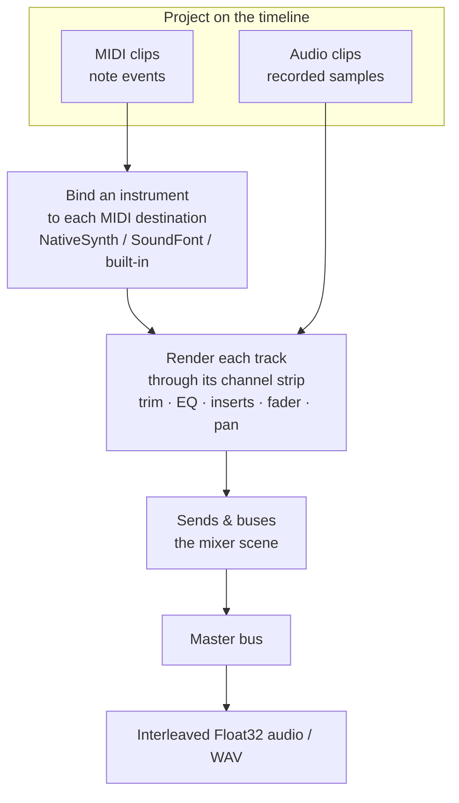

# Bouncing Projects to Audio

**Bouncing turns your whole arrangement into a single audio file you can save, play, or analyze.** If you have used a DAW, it is the "export" or "render" button; in libsonare it is the `Project.bounce*` family. The rendering happens **offline** (faster than real time, all at once — not by playing the song back live) and **deterministically**: the same project plus the same options always yields exactly the same samples, down to the bit.

A [Project](./project-editing.md) holds tracks and clips on a timeline. Audio clips already carry samples, so they render directly. MIDI clips carry *events* (note-on, note-off), not sound — they need an **instrument** to become audible, the same way sheet music needs a player. So the choice of bounce method is really one question: *which instrument plays your MIDI?*



Read the diagram top to bottom: audio clips flow straight in, MIDI clips must first have an instrument bound, and everything is summed through the mixer to the master. The whole pass is computed offline, so the result is reproducible every time.

::: info Positions are in quarter notes
Project positions and clip lengths are expressed in **PPQ — quarter notes as a float**. `ppq: 1` is one quarter note. At 120 BPM one quarter note lasts 0.5 s, so a 4-beat clip (`lengthPpq: 4`) is 2 s. Set the tempo explicitly with `setTempoSegments([{ startPpq: 0, bpm: 120 }])` so durations in your bounce are predictable.
:::

::: tip Bounce reflects the full mixer, not raw clips
Tracks do not sum naively. Each track renders through its channel strip — trim, EQ, inserts, fader, pan, sends, and buses — via the [scene mixer](./mixing.md). The bounce is the routed master, exactly what realtime playback would produce.

`setClipGain` (and clip fades) shape **audio clips** only; they have no effect on MIDI clips during bounce. To set the volume of a MIDI-driven instrument, use the track fader / channel strip (the [mixer scene](./mixing.md)) — see [Project Editing](./project-editing.md#editing-clips).
:::

## What You Will Learn

By the end of this page you should be able to:

- bounce a project of audio clips with plain `bounce`;
- make MIDI audible by routing it through the built-in synth, the [NativeSynth](./native-synth.md), or an [SF2 player](./soundfont-player.md);
- pass a NativeSynth patch by preset name, `va:` prefix, or patch object;
- host your own instrument from Python via the `ExternalInstrument` protocol;
- pre-flight a MIDI clip with `validateMidiNotes` and read the no-instrument compile warning;
- let the engine auto-derive the render length, and write the result to a WAV file.

## Pick the right bounce method

Start at the top and only move down when your MIDI needs a richer instrument.

| Your project | Use | Result |
|--------------|-----|--------|
| Only audio clips (no MIDI, or MIDI you want silent) | `bounce` | Routed audio; MIDI tracks are silent |
| MIDI you just need to *hear* | `bounceWithBuiltinInstrument` | Simple oscillator synth |
| MIDI that needs real instrument character | `bounceWithSynthInstrument` | Full [NativeSynth](./native-synth.md) (subtractive / FM / modal / piano …) |
| MIDI that should play a SoundFont | `bounceWithSf2Instrument` | GS-compatible [SF2 player](./soundfont-player.md) |
| MIDI played by your own (Python) synth | `bounce_with_instruments` — **Python only** | Host-supplied [`ExternalInstrument`](#python-host-your-own-instrument) |

::: info One Project, every runtime
The same `Project` model and core bounce behavior are exposed through WASM/JS, Node native, and Python. Names follow each language's convention (`bounceWithSynthInstrument` ↔ `bounce_with_synth_instrument`). The CLI exposes the project workflow as commands (`project bounce`, `project midi-render`, SMF/MIDI 2.0 import-export), but not every per-destination instrument binding option is wired there. The arrangement model, the compiler, and the DSP are identical across runtimes.
:::

## Plain bounce: audio clips

`bounce` compiles the project into a renderable timeline and renders it offline to **interleaved float audio**. Audio clips play through their channel strips; MIDI clips render silently because no instrument is bound.

```typescript [Browser]
import { init, Project } from '@libraz/libsonare';

await init();

const project = new Project();
try {
  project.setSampleRate(48000);
  project.setTempoSegments([{ startPpq: 0, bpm: 120 }]); // predictable durations

  const track = project.addTrack({ kind: 'audio', name: 'tone' });
  project.addClip({
    trackId: track,
    startPpq: 0,
    lengthPpq: 4,          // 4 quarter notes = 2 s at 120 BPM
    audio: monoSamples,    // Float32Array
    audioChannels: 1,
    audioSampleRate: 48000,
  });

  // Interleaved stereo: [L0, R0, L1, R1, ...]
  const audio = project.bounce({ numChannels: 2, sampleRate: 48000 });
} finally {
  project.delete();        // the WASM handle is NOT garbage-collected
}
```

::: danger Always release the Project
`Project`, like every embind object, holds a WASM heap handle the JavaScript garbage collector cannot reclaim. Call `project.delete()` in a `finally` block (Node also accepts `destroy()`; Python uses `project.close()`). Leaking handles slowly exhausts WASM memory in long sessions.
:::

::: info Interleaved audio
"Interleaved" means the channels are woven into one array, sample by sample: `[L0, R0, L1, R1, …]` — left sample, right sample, left, right. (The alternative, "planar", keeps each channel in its own array.) The WAV writer walks this single array straight through, so a 2-channel bounce of N frames is `2 × N` floats long.
:::

### Bounce options

Every field of the options object is optional:

| Option | Meaning | Default |
|--------|---------|---------|
| `totalFrames` | Render length in output frames | auto-derived (see below) |
| `blockSize` | Render block size | engine default (128) |
| `numChannels` | Output channel count | 2 |
| `sampleRate` | Output sample rate (Hz) | the project sample rate |
| `instrumentLatencySamples` | Host-instrument PDC (plugin delay compensation) fed to the compiler | 0 |

::: info What is PDC / latency compensation?
Some instruments and effects need a few samples of "lookahead" and so report their audio a little late. **PDC** (plugin delay compensation) tells the compiler how many samples late an instrument is, so the engine can shift it back into alignment and keep every track in time. If your instrument has no latency, leave this at `0`.
:::

::: tip Determinism is independent of live state
An offline bounce **settles** every smoothed gain and effect parameter to its target before rendering, so the result does not depend on where a fader or filter sweep happened to be when you started the render. Bouncing right after a live tweak produces the same samples as bouncing from a freshly loaded project.
:::

### Omitting the length

When `totalFrames` is omitted (or `<= 0`) the render length is **auto-derived from the compiled timeline** — the musical end of the arrangement plus the instrument's release tail. A project with content renders without you computing a frame count; an empty project yields an empty buffer. Pass `totalFrames` only when you need a fixed-length buffer.

## Bounce MIDI through the built-in synth

A MIDI-only project bounced with plain `bounce` is silent. Route it through the **built-in oscillator synth** to make it audible with one call. Pass a binding to choose the waveform and envelope, or `{}` for a default sine patch.

```typescript [Browser]
const project = new Project();
try {
  project.setSampleRate(48000);
  project.setTempoSegments([{ startPpq: 0, bpm: 120 }]);

  const { clipId } = project.addMidiClip(0, 4);   // MIDI track + clip, 4 beats long
  project.setMidiEvents(clipId, [
    Project.midiNoteOn(0, 0, 0, 60, 100),         // C4 at beat 0
    Project.midiNoteOff(3, 0, 0, 60, 0),          // release at beat 3
  ]);

  // MIDI-only project -> non-silent stereo audio.
  const audio = project.bounceWithBuiltinInstrument(
    { waveform: 'saw', gain: 0.5 },
    { numChannels: 2, sampleRate: 48000 },
  );
} finally {
  project.delete();
}
```

A `BuiltinSynthBinding` accepts `waveform` (`'sine'`, `'saw'`, `'square'`, `'triangle'`), `gain`, ADSR (`attackMs`, `decayMs`, `sustain`, `releaseMs`), `polyphony`, and a `destinationId` to target one MIDI destination. Every numeric field uses "0 / omit keeps the default", so `{}` is a usable default patch. Pass an **array** of bindings to render several MIDI destinations; an explicitly empty array `[]` (or `undefined` / `null`) binds nothing and renders silently.

## Bounce MIDI through the NativeSynth

For real instrument character, `bounceWithSynthInstrument` routes MIDI through the full [NativeSynth](./native-synth.md) — its subtractive, FM, Karplus-Strong, modal, additive, percussion, and piano engines plus the realism layer. There are three ways to specify the instrument:

```typescript [Browser]
import { init, Project, synthPresetNames } from '@libraz/libsonare';

await init();
synthPresetNames();   // ['sine', 'saw-lead', 'square-lead', 'sub-bass', 'warm-pad', 'e-piano', 'bell', 'brass', ...]

// 1. A preset name string
const a = project.bounceWithSynthInstrument('saw-lead', { numChannels: 2, sampleRate: 48000 });

// 2. The same preset with the "va:" routing prefix
const b = project.bounceWithSynthInstrument('va:saw-lead', { numChannels: 2, sampleRate: 48000 });

// 3. A patch object: a base preset plus shared-control overrides
const c = project.bounceWithSynthInstrument(
  { preset: 'warm-pad', filterCutoffHz: 1200, ampRelease: 0.6 },
  { numChannels: 2, sampleRate: 48000 },
);
```

Use [`synthPresetNames()`](./native-synth.md) to discover valid names instead of hardcoding magic strings; unknown names throw. A patch object starts from its `preset` base (or the default subtractive patch when `preset` is omitted) and overrides the shared controls — see [NativeSynth](./native-synth.md) for the field list. Pass an array to bind several destinations; an empty array binds nothing.

The piano roll below is exactly this call at work — one MIDI passage routed through `bounceWithSynthInstrument` and re-voiced live as you switch the preset; the playhead tracks the bounced audio.

<SonareDemo id="midi-piano-roll" />

::: info Deterministic by construction
For a fixed project, options, and patch, `bounceWithSynthInstrument` is bit-for-bit reproducible. The same is true of every bounce method — that is what makes a bounce safe to snapshot in a test or cache by hash.
:::

## Bounce MIDI through a SoundFont

`bounceWithSf2Instrument` plays MIDI through a GS-compatible [SoundFont player](./soundfont-player.md) fed by the project's loaded SoundFont. Load the `.sf2` bytes first, then bounce:

```typescript [Browser]
const sf2Bytes = new Uint8Array(await (await fetch('/piano.sf2')).arrayBuffer());
project.loadSoundFont(sf2Bytes);

// 16 MIDI channels per player; channel 10 drums via bank 128; GS NRPN + SysEx honored.
const audio = project.bounceWithSf2Instrument(
  { gain: 0.5 },
  { numChannels: 2, sampleRate: 48000 },
);
```

::: info General MIDI, banks, and drums
General MIDI (GM) is the standard 128-instrument set every SoundFont maps to, so program numbers pick the same kind of instrument across files. By convention channel 10 is reserved for drums, addressed as bank 128. NRPN and SysEx are extra MIDI messages for finer or vendor-specific tweaks; you rarely set them by hand.
:::

Programs the SoundFont does not cover — including bouncing with no SoundFont loaded at all — fall back to the built-in synth's GM bank. Call [`soundFontManifest()`](./soundfont-player.md) to see, per `(channel, bank, program)`, whether each note resolves to `'sf2'` or falls back to `'synth'`.

## Python: host your own instrument

The Python binding can host **any** instrument you write through the `ExternalInstrument` protocol, dispatched by `bounce_with_instruments`. Only `render` is required; `prepare`, `on_event`, and the `latency_samples` / `tail_samples` attributes are optional (duck-typed).

```python
import numpy as np
import libsonare as sonare


class SineInstrument:
    """A minimal external instrument: one sine voice per held note."""

    latency_samples = 0      # PDC (plugin delay compensation) you report to the compiler
    tail_samples = 4096      # release/effect tail for auto-length bounces

    def prepare(self, sample_rate: float, max_block_size: int) -> None:
        self.sample_rate = sample_rate

    def on_event(self, destination_id: int, ump_words: tuple[int, ...], render_frame: int) -> None:
        # Decode dispatched UMP words (note-on / note-off) and update your voices.
        ...

    def render(self, channels: np.ndarray, num_frames: int) -> None:
        # channels is a zero-filled (num_channels, num_frames) float32 array.
        # Sum your audio INTO it; never overwrite unrelated frames.
        channels += 0.0


with sonare.Project.from_json(project_json) as project:
    audio = project.bounce_with_instruments(
        SineInstrument(),
        total_frames=0,            # 0 => auto-derive length (+ tail_samples)
        num_channels=2,
        sample_rate=48000,
    )                              # -> np.ndarray, shape (frames, channels)
```

Every callback runs synchronously on the thread that calls the bounce, so there is no cross-thread state to guard. An exception raised inside a callback propagates to the caller — your `ValueError` surfaces as a `ValueError`, not a silent dropout. `tail_samples` extends an auto-length bounce so a reverb or release tail is not clipped off.

To play several instruments at once, pass `instruments=[(destination_id, instrument), ...]` instead of a single instrument — each tuple binds one instrument to one MIDI destination.

## Validate MIDI before bouncing

The compiler is forgiving — a MIDI clip with no instrument bound is a **non-fatal warning**, not an error. After `compile()` the result still has `hasTimeline: true`, and the diagnostics carry:

```
project contains MIDI clips; bounce is silent unless an instrument is bound
```

That message is your cue to switch from `bounce` to one of the instrument bounces. To catch a *real* problem — a stuck note — pre-flight each MIDI clip with `validateMidiNotes`, which checks that every note-on has a matching note-off:

```typescript
const report = project.validateMidiNotes(clipId);
// { ok: true, unmatchedNoteOns: 0, unmatchedNoteOffs: 0 }
if (!report.ok) {
  // A hanging note would sound until the render ends — fix the events first.
}
```

See [Project Editing](./project-editing.md) for inspecting and repairing clip events.

## Write the bounce to a WAV file

A bounce is a plain `Float32Array` (interleaved by channel). In the browser, wrap it in a 16-bit PCM WAV and offer it as a download:

```typescript
function exportWav(interleaved: Float32Array, sampleRate: number, numChannels: number): Blob {
  const bytesPerSample = 2;
  const dataBytes = interleaved.length * bytesPerSample;
  const buffer = new ArrayBuffer(44 + dataBytes);
  const view = new DataView(buffer);
  const writeStr = (offset: number, s: string) => {
    for (let i = 0; i < s.length; i++) view.setUint8(offset + i, s.charCodeAt(i));
  };

  writeStr(0, 'RIFF');
  view.setUint32(4, 36 + dataBytes, true);
  writeStr(8, 'WAVE');
  writeStr(12, 'fmt ');
  view.setUint32(16, 16, true);                                   // PCM chunk size
  view.setUint16(20, 1, true);                                    // PCM format
  view.setUint16(22, numChannels, true);
  view.setUint32(24, sampleRate, true);
  view.setUint32(28, sampleRate * numChannels * bytesPerSample, true);
  view.setUint16(32, numChannels * bytesPerSample, true);
  view.setUint16(34, 8 * bytesPerSample, true);
  writeStr(36, 'data');
  view.setUint32(40, dataBytes, true);

  let offset = 44;
  for (let i = 0; i < interleaved.length; i++) {
    const s = Math.max(-1, Math.min(1, interleaved[i]));          // clamp before quantizing
    view.setInt16(offset, s < 0 ? s * 0x8000 : s * 0x7fff, true);
    offset += bytesPerSample;
  }
  return new Blob([buffer], { type: 'audio/wav' });
}

const audio = project.bounceWithSynthInstrument('saw-lead', { numChannels: 2, sampleRate: 48000 });
const url = URL.createObjectURL(exportWav(audio, 48000, 2));
// assign url to an <a download> and click it
```

In Python, the CLI writes the WAV for you (next section); from the library, hand the `np.ndarray` to `soundfile` or your WAV writer of choice.

## Bounce from the Python CLI

The Python package ships a `project` subcommand that loads a project JSON and renders it to WAV without writing any code:

```bash
# Plain bounce (audio clips; MIDI tracks render silently)
sonare project bounce --in song.json -o master.wav --sample-rate 48000

# Route MIDI through the NativeSynth default patch
sonare project bounce --in song.json -o master.wav --synth

# Route MIDI through a named NativeSynth preset
sonare project bounce --in song.json -o master.wav --synth saw-lead

# Equivalent dedicated MIDI renderer
sonare midi-render --in song.json -o master.wav --synth saw-lead

# Inspect first: compile diagnostics (including the no-instrument warning)
sonare project compile --in song.json --json
sonare project synth-presets          # list valid NativeSynth preset names
```

The `--synth` flag takes an optional value: omit it for the default patch, or pass a preset name. SF2 and per-destination synth JSON are not wired through the CLI — use the Project API for SoundFont-backed bounces. Other useful subcommands are `project new`, `project validate`, and `project abi`.

## Recipes

:::: details MIDI-only project to a downloadable WAV
The whole MIDI-to-file path, instrument and export included.

```typescript
const project = new Project();
try {
  project.setSampleRate(48000);
  project.setTempoSegments([{ startPpq: 0, bpm: 120 }]);
  const { clipId } = project.addMidiClip(0, 4);
  project.setMidiEvents(clipId, [
    Project.midiNoteOn(0, 0, 0, 60, 100),
    Project.midiNoteOff(3, 0, 0, 60, 0),
  ]);
  const audio = project.bounceWithSynthInstrument('saw-lead', { numChannels: 2, sampleRate: 48000 });
  const url = URL.createObjectURL(exportWav(audio, 48000, 2));
} finally {
  project.delete();
}
```
::::

:::: details Catch a silent MIDI bounce before you ship it
Compile, read the warning, and only then choose an instrument.

```typescript
const result = project.compile();
const hasMidiWarning = result.diagnostics.some((d) =>
  d.severity === 1 && d.message.includes('bounce is silent'),
);
const audio = hasMidiWarning
  ? project.bounceWithSynthInstrument('saw-lead', { numChannels: 2 })
  : project.bounce({ numChannels: 2 });
```
::::

With a clean bounce in hand you have a finished mix. To shape what each track sounds like before it reaches the master, tune its channel strip in the [Mixing Engine](./mixing.md); to capture more material to arrange and bounce, see [Recording and Takes](./recording-and-takes.md).

## Related

- [Project Editing](./project-editing.md) — build the tracks, clips, and MIDI events you bounce
- [NativeSynth](./native-synth.md) — the synthesizer behind `bounceWithSynthInstrument`
- [SoundFont Player](./soundfont-player.md) — the SF2 backend behind `bounceWithSf2Instrument`
- [MIDI Input](./midi-input.md) — capture the MIDI you arrange and bounce
- [Recording and Takes](./recording-and-takes.md) — capture the audio clips you bounce
- [Mixing Engine](./mixing.md) — the channel strips, sends, and buses every track renders through
