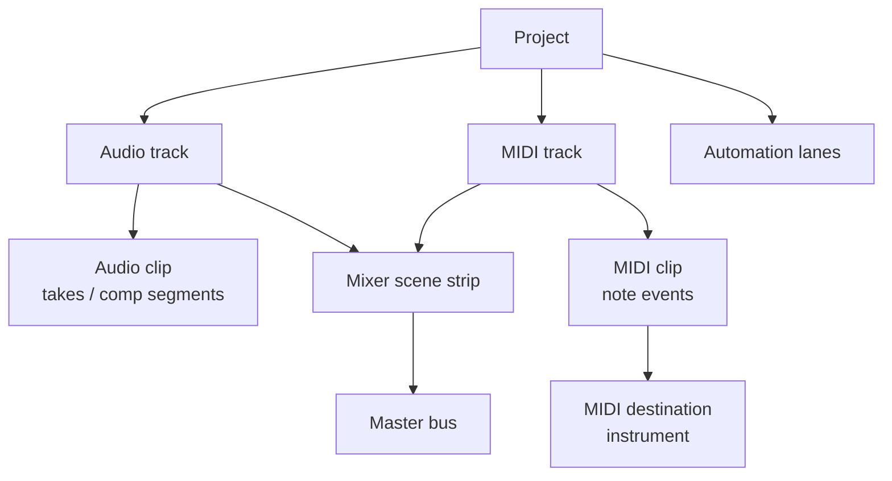
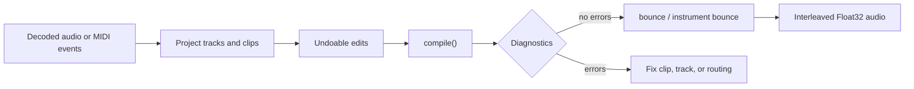

# Project & Arrangement Editing

**Want to build a song's arrangement in code — without opening a DAW?** That is what `Project` is for. A **project** is the timeline that holds everything a song is made of: audio tracks, MIDI tracks, the clips placed on them, the tempo map, time signatures, and markers. libsonare ships a `Project` model — a small, headless DAW edit surface — so you can build, edit, and serialize that timeline **inside your own app**, with no DAW host required.

The workflow is a short loop: you assemble an arrangement, edit it with undoable operations, [compile](#compiling-the-arrangement) it into a renderable timeline, save it to JSON, and finally [render audio](#rendering-audio). `Project` is an **offline, control-thread API** (it never runs on the audio thread), and it behaves identically in the browser (WASM), Node, and Python.

::: info Three words to know first
A **track** is one lane in the timeline (an audio lane or a MIDI lane). A **clip** is one block of content placed on a track — a slice of recorded audio or a region of MIDI notes. **PPQ** ("pulses per quarter note") is how libsonare measures musical time: every clip start, length, and event position is given in quarter-note units, so `lengthPpq: 4` is four quarter notes long regardless of tempo.
:::

::: info Headless DAW
A **headless DAW** is the editing and rendering core of a DAW without its own window, timeline UI, or plug-in host. libsonare gives you the data model and audio engine; your app supplies the buttons, waveform view, file picker, and project browser.
:::

::: tip Where editing sits in the pipeline
**Analysis** tells you *what* a track is. **Editing** arranges and trims clips on a timeline and fixes their timing. **Mixing** balances several tracks into a stereo bus. **Mastering** polishes that finished mix for delivery. This page is the editing stage: it is where "a folder of stems and MIDI" becomes "a structured arrangement" you can then mix and render. If terms like *clip*, *track*, *fade*, or *tempo map* are new, read [Editing Basics](./glossary/concepts/editing-basics.md) first.
:::

## The project model

A project nests a few simple parts, each one a container for the next:

- Each **track** holds **clips** (blocks of content placed on the timeline).
- An audio clip can carry alternate **takes** plus a **comp** that stitches the best parts of those takes into one performance.
- A track can have **automation lanes** — recorded curves that move a parameter (volume, a filter cutoff, …) over time, the way a fader moving on its own would.
- A MIDI track points at an instrument **destination** — the synth or sampler that will actually make its notes audible (defined just below).
- Every track routes through a strip in the **mixer scene** — its channel of EQ, fader, pan, and sends — on its way to the master.

::: info What is a MIDI "destination"?
MIDI notes are just instructions (play note 60 now), not sound. A **destination** is the instrument those instructions are sent to — the synth or sampler that turns them into audio. A MIDI track names a destination; you bind an actual instrument to it when you render. See [Project Bounce](./project-bounce.md).
:::



## The edit flow at a glance

Keep this mental model in mind before reading the API list. You edit a `Project`; compiling checks that the timeline makes sense; bouncing turns the compiled timeline into audio samples.



Two points prevent most beginner mistakes:

- `compile()` does not make sound; it validates and prepares the arrangement.
- Plain `bounce()` renders audio tracks only. MIDI tracks need an instrument-bound bounce such as `bounceWithSynthInstrument(...)` or `bounceWithSf2Instrument(...)`.

## What You Will Learn

By the end of this page you should be able to:

- create a `Project`, add audio and MIDI tracks, and place clips on them;
- edit clips (split, trim, move, gain, fade, loop, re-source, duplicate, remove) and tracks (add, rename, route, change kind, remove) through **undoable** operations;
- place musical time correctly using PPQ, a tempo map with tempo segments, time signatures, and markers;
- choose a clip overlap policy and a warp mode (`off` / `repitch` / `tempo-sync`) with warp anchors;
- write key/chord annotations and automation lanes onto the project;
- compile to a renderable timeline and read its structured diagnostics and non-fatal warnings;
- save and load with deterministic JSON, and exchange MIDI through SMF and the MIDI 2.0 Clip File format.

## Create a project and add content

Every project starts empty. Set a sample rate, add tracks, then add clips. `addTrack` and `addClip` return stable integer ids you reuse for every later edit. Positions and lengths are in **PPQ**.

::: code-group

```typescript [Browser / WASM]
import { init, Project } from '@libraz/libsonare';

await init();

const project = new Project();
try {
  project.setSampleRate(48000);

  // An audio track with one recorded clip (decoded interleaved float audio).
  const audioTrack = project.addTrack({ kind: 'audio', name: 'lead-gtr' });
  const clipId = project.addClip({
    trackId: audioTrack,
    startPpq: 0,          // place at the very start
    lengthPpq: 4,         // four quarter notes long
    audio: guitarMono,    // Float32Array of decoded samples
    audioChannels: 1,
    audioSampleRate: 48000,
  });

  // A MIDI track + clip in one call.
  const { trackId: midiTrack, clipId: midiClip } = project.addMidiClip(0, 8);
} finally {
  project.delete();       // the WASM handle is NOT garbage-collected — always release it
}
```

```python [Python]
import libsonare as sonare

with sonare.Project() as project:
    project.set_sample_rate(48000)

    audio_track = project.add_track("audio", name="lead-gtr")
    clip_id = project.add_clip(
        audio_track,
        start_ppq=0.0,        # place at the very start
        length_ppq=4.0,       # four quarter notes long
        audio=guitar_mono,    # interleaved float samples
        audio_channels=1,
        audio_sample_rate=48000,
    )

    midi_track, midi_clip = project.add_midi_clip(0.0, 8.0)
# leaving the `with` block releases the native handle
```

:::

::: danger Always release the project
`Project`, like every WASM-backed object, holds a heap handle that JavaScript's garbage collector cannot reclaim. In the WASM package, construct it with `new Project()` and call `project.delete()` in a `finally` block. In Node native, construct it with `Project.create()` and call `project.destroy()` or `project.delete()`. In Python use `Project` as a context manager (`with sonare.Project() as project:`) or call `project.close()`. Leaking handles slowly exhausts native or WASM memory in long sessions.
:::

## Editing clips

Every clip operation is a single undoable command and addresses the clip by its id.

| Operation | Method | What it does |
|-----------|--------|--------------|
| Split | `splitClip(clipId, splitPpq)` | Cuts the clip at an absolute PPQ; returns the new clip's id |
| Trim | `trimClip(clipId, newStartPpq, newLengthPpq)` | Resets start and length |
| Move | `moveClip(clipId, newStartPpq, newTrackId?)` | Slides the clip, optionally to another track |
| Gain | `setClipGain(clipId, gain)` | Linear per-clip playback gain (`>= 0`). Audio clips only — stored on MIDI clips but never applied at bounce |
| Fade | `setClipFade(clipId, fadeIn, fadeOut)` | Fade-in / fade-out regions with a curve |
| Loop | `setClipLoop(clipId, mode, loopLengthPpq?)` | `'off'` or `'loop'` with a loop length |
| Re-source | `setClipSource(clipId, sourceId)` | Rebinds the clip to a different registered source |
| Duplicate | `duplicateClip(clipId, newStartPpq)` | Copies the clip on the same track; returns the new id |
| Remove | `removeClip(clipId)` | Deletes the clip |

```typescript
project.setClipGain(clipId, 0.8);
project.setClipFade(
  clipId,
  { lengthPpq: 0.5, curve: 'equal-power' },  // fade in over half a beat
  { lengthPpq: 1.0, curve: 'linear' },       // fade out over one beat
);
const tailId = project.splitClip(clipId, 2); // cut at beat 2; tail becomes a new clip
project.setClipLoop(tailId, 'loop', 2);      // loop the tail every two beats
const copyId = project.duplicateClip(tailId, 8);
```

Fade curves are `'linear'`, `'equal-power'`, `'exponential'`, and `'logarithmic'`. Loop mode is `'off'` or `'loop'`; a positive `loopLengthPpq` is required when looping.

::: warning `setClipGain` / `setClipFade` apply to audio clips only
`setClipGain` and `setClipFade` operate on **audio clips only**. On a MIDI clip the values are stored (undoably, and they round-trip through `toJson()`) but never reach the rendered notes: the compiler copies a MIDI clip's events verbatim into the render schedule and gates the clip only by its track's mute / solo / gain, so per-clip gain and fades are silently dropped. To control the volume of a MIDI-driven instrument, set the **track gain** (`setTrackGain(trackId, gain)`, folded into the channel-strip fader in the [mixer scene](./mixing.md)); a track gain of `0` silences the track's MIDI notes entirely.
:::

In Python the same operations are snake_case, and fades take separate length/curve arguments:

```python
project.set_clip_gain(clip_id, 0.8)
project.set_clip_fade(
    clip_id,
    fade_in_length_ppq=0.5,
    fade_out_length_ppq=1.0,
    fade_in_curve="equal-power",
    fade_out_curve="linear",
)
tail_id = project.split_clip(clip_id, 2.0)
project.set_clip_loop(tail_id, "loop", 2.0)
copy_id = project.duplicate_clip(tail_id, 8.0)
```

## Editing tracks

Track operations are likewise undoable.

| Operation | Method | What it does |
|-----------|--------|--------------|
| Add | `addTrack({ kind, name })` | Adds an `'audio'`, `'midi'`, or `'aux'` track; returns its id |
| Remove | `removeTrack(trackId)` | Deletes the track and its clips |
| Rename | `renameTrack(trackId, name)` | Renames the track |
| Change kind | `setTrackKind(trackId, kind)` | Switches a track between `'audio'` / `'midi'` / `'aux'` |
| Route | `setTrackRoute(trackId, channelStripRef, outputTarget)` | Binds the track to a mixer strip and output bus |
| Gain | `setTrackGain(trackId, gain)` | Sets the track's linear output gain (negative or non-finite values are rejected) |
| Mute | `setTrackMute(trackId, mute)` | Mutes or unmutes the track |
| Solo | `setTrackSolo(trackId, solo)` | Solos the track, implies-muting the others |
| Pan | `setTrackPan(trackId, pan)` | Pans the track in `[-1, 1]` (non-finite values are rejected) |
| MIDI destination | `setTrackMidiDestination(trackId, destinationId)` | Routes the track's MIDI to an instrument destination id (see [Built-in Instruments](./native-synth.md)) |

```typescript
const drums = project.addTrack({ kind: 'audio', name: 'drums' });
project.renameTrack(drums, 'drum-bus');
project.setTrackRoute(drums, 'strip-drums', 'master'); // wire to a mixer scene strip
```

An **aux** track carries no clips of its own — it is a routing/return lane (for example an effect return or a submix) rather than a place to record content.

`setTrackRoute` links a project track to a strip in the project's [mixer scene](./mixing-scene-json.md) (set with `setMixerSceneJson`) so the bounced track flows through that channel strip's processing.

## Undo and redo

The project keeps an **edit history**. Every clip, track, automation, and annotation operation pushes a command you can reverse.

```typescript
project.setClipGain(clipId, 0.3);
project.undo();   // gain returns to its previous value
project.redo();   // re-applies the gain edit
```

Because the history is exact, calling `toJson()` before an edit, undoing, and calling `toJson()` again yields byte-identical JSON — a useful invariant for testing and for change detection in an editor UI.

## Musical time: PPQ, tempo, time signatures, markers

All positions are in **PPQ** (quarter notes as a floating-point value, so fractional beats are exact). Tempo and time signatures live in the project as ordered segment lists.

### Tempo map and tempo segments

The **tempo map** is a list of tempo segments. Each segment starts at a PPQ position and sets a BPM; an optional `endBpm` makes the segment ramp linearly to a new tempo.

```typescript
project.setTempoSegments([
  { startPpq: 0,  bpm: 120 },                 // constant 120 BPM from the top
  { startPpq: 16, bpm: 120, endBpm: 140 },    // ramp 120 -> 140 over this segment
  { startPpq: 32, bpm: 140 },
]);
project.tempoSegmentCount(); // 3
```

### Time signatures

Time signatures are a parallel list of segments, each with a numerator (beats per bar) and denominator (beat unit).

```typescript
project.setTimeSignatures([
  { startPpq: 0,  numerator: 4, denominator: 4 },
  { startPpq: 64, numerator: 3, denominator: 4 },  // switch to 3/4 later
]);
```

### Markers

Markers label positions on the timeline. Pass marker id `0` to allocate a new id; the call returns the stable id.

```typescript
const introId = project.setMarker(0, 0,  'intro');
project.setMarker(0, 16, 'verse');
project.setMarker(introId, 0, 'intro (edited)'); // update by reusing the id
```

For structured markers, use `setMarkerEx(...)` with a full `ProjectMarker`. `MarkerKind` covers plain markers, text, lyrics, cue points, and key signatures; key-signature markers use `keyFifths` (`-7`...`+7`, sharps positive) plus `keyMinor`.

::: code-group

```typescript [Browser / WASM]
import { MarkerKind } from '@libraz/libsonare';

project.setMarkerEx({
  id: 0,
  ppq: 32,
  name: 'drop cue',
  kind: MarkerKind.cuePoint,
  keyFifths: 0,
  keyMinor: false,
});

project.setMarkerEx({
  id: 0,
  ppq: 64,
  name: 'E minor',
  kind: MarkerKind.keySignature,
  keyFifths: 1,
  keyMinor: true,
});

for (let i = 0; i < project.markerCount(); i += 1) {
  console.log(project.markerByIndex(i));
}
```

```python [Python]
from libsonare import MarkerKind, ProjectMarker

project.set_marker_ex(ProjectMarker(0, 32.0, "drop cue", MarkerKind.CUE_POINT))
project.set_marker_ex(
    ProjectMarker(0, 64.0, "E minor", MarkerKind.KEY_SIGNATURE, key_fifths=1, key_minor=True)
)

for index in range(project.marker_count()):
    print(project.marker_by_index(index))
```

:::

In Python: `set_tempo_segments`, `set_time_signatures`, and `set_marker` accept the same fields (mappings or tuples for the segment lists).

## Overlap policy

The **overlap policy** decides whether two clips on the same track may occupy the same time span. It is project-wide.

```typescript
project.setOverlapPolicy(0); // disallow overlapping clips (default)
project.setOverlapPolicy(1); // allow overlap (e.g. crossfades, layered takes)
project.getOverlapPolicy();  // read it back
```

`0` disallows overlaps; `1` allows them. Allow overlaps when you intend layered clips or crossfades; disallow to keep a track strictly sequential. The policy is a plain integer because it mirrors the native enum directly: only `0` (disallow) and `1` (allow) are defined, and any other value is treated as disallow.

## Warp: stretching clips to the grid

**Warp** lets a recorded audio clip follow the project's tempo instead of playing back at its fixed original speed — think of nudging and stretching a recording so its beats land on the grid. Internally, the clip keeps its own recorded timeline; warp maps positions on that recorded timeline onto positions in project time, so changing the project tempo restretches the clip. Each clip has a warp **mode** and an optional **warp map** of anchors.

| Warp mode | Meaning |
|-----------|---------|
| `'off'` | Play the audio at its native rate; ignore tempo |
| `'repitch'` | Speed up / slow down with the tempo (pitch moves too, like a tape) |
| `'tempo-sync'` | Time-stretch to follow the tempo while preserving pitch |

::: info How tempo-sync keeps the pitch
`'tempo-sync'` time-stretches the audio with a **phase vocoder** — an STFT-based time-stretch that changes the timing without changing the pitch (unlike `'repitch'`, which moves both like a tape). The same algorithm runs in both realtime playback and offline [bounce](./project-bounce.md), so a warped clip sounds identical whichever way you render it. On stereo and multichannel clips, all channels are stretched by one peak-locked vocoder pass, so the stretch stays phase-coherent across channels and the stereo image does not drift.
:::

<SonareDemo id="time-stretch" />

A **warp map** is a list of anchors, and each anchor is a "this moment in the recording belongs here on the timeline" pin. Concretely, each `ProjectWarpAnchor` ties a `warpSample` (a position on the project/warped timeline) to a `sourceSample` (the matching position in the recorded audio); the engine stretches the audio smoothly between consecutive anchors.

```typescript
// Define a reusable warp map, then attach it to a clip.
project.setWarpMap({
  id: 1,
  name: 'groove',
  anchors: [
    { warpSample: 0,     sourceSample: 0 },
    { warpSample: 24000, sourceSample: 12000 }, // first half of the bar plays at 2x source
  ],
});
project.setClipWarpRef(clipId, 1);          // reference the map (0 clears it)
project.setClipWarpMode(clipId, 'tempo-sync');
// project.removeWarpMap(1);                 // remove the map by id when done
```

A warp map is a first-class, id-keyed object: `setWarpMap({ id, name, anchors })` adds or replaces one, `setClipWarpRef(clipId, id)` assigns it to a clip (`0` clears the reference), and `project.removeWarpMap(id)` deletes it by id. Removing a map that a clip still references leaves that clip with a dangling warp ref, so clear those clips first with `setClipWarpRef(clipId, 0)`.

## Takes and comp lanes

A clip can carry alternate **takes** and a **comp** (composite) that stitches the best parts of several takes into one performance. These are first-class on `Project` (`setClipTakes`, `setClipCompSegments`, `addLoopRecordingTakes`) and are covered in depth — including loop-recording capture — on the dedicated page. See [Recording & Takes](./recording-and-takes.md).

## Automation lanes

An **automation lane** drives one host-defined parameter over time with breakpoints. Each breakpoint has a PPQ position, a value, and a curve to the next point (`'linear'`, `'exponential'`, `'hold'`, `'scurve'`).

```typescript
const lane = project.addAutomationLane(trackId, {
  targetParamId: 1,                                   // host id of the parameter to drive
  points: [
    { ppq: 0, value: 0.0, curve: 'linear' },
    { ppq: 4, value: 1.0, curve: 'exponential' },
  ],
});
project.editAutomationLane(trackId, lane, { targetParamId: 1, points: [/* … */] });
project.removeAutomationLane(trackId, lane);
```

The lane's `targetParamId` is your own parameter id; the project stores the breakpoints verbatim and replays them through the compiled timeline.

## Key and chord annotation write-back

A project can carry musical annotations — the **key** regions and **chord** symbols that an analyzer produced — so they travel with the arrangement and survive save/load. Both streams are replace-in-full and undoable.

```typescript
project.annotateKeys([
  { startPpq: 0, endPpq: 16, tonicPc: 0, mode: 1 }, // C major (tonicPc 0, mode 1 = major)
]);
project.annotateChords([
  { startPpq: 0, endPpq: 4, rootPc: 0, quality: 1, romanNumeral: 'I' },
  { startPpq: 4, endPpq: 8, rootPc: 7, quality: 1, romanNumeral: 'V' },
]);
```

The numeric fields are small fixed encodings:

- **Pitch class** (`tonicPc`, `rootPc`): `0..11` with C = 0, C#/Db = 1, … B = 11; `255` means unknown.
- **Key mode** (`mode`): `1` = major, `2` = minor.
- **Chord quality** (`quality`): `1` = major, `2` = minor, `3` = diminished, `4` = augmented (see [Chord Recognition](./glossary/analysis/chord-recognition.md) for the full list).

So `{ tonicPc: 0, mode: 1 }` is C major and `{ rootPc: 7, quality: 1 }` is a G major chord.

## Assist sidecars

An **assist sidecar** is an opaque, undoable per-project metadata blob — a place to stash an AI-assist suggestion, a tooling payload, or any binary annotation that should travel with the arrangement. Each sidecar is keyed by a **module id** plus a **target scope** (a track id and a PPQ region), and the whole store serializes under the project JSON `assist_sidecars` key, so it survives `toJson()` / `fromJson()` round-trips.

```typescript
const payload = new TextEncoder().encode(JSON.stringify({ suggestion: 'tighten chorus' }));
project.setAssistSidecar(
  'my-assistant',  // moduleId (must be non-empty)
  1,               // schemaVersion
  0,               // targetTrackId (0 = project scope)
  0,               // regionStartPpq
  16,              // regionEndPpq
  payload,         // Uint8Array (copied)
);

for (let i = 0; i < project.assistSidecarCount(); i += 1) {
  const sc = project.getAssistSidecar(i);
  // { moduleId, schemaVersion, targetTrackId, regionStartPpq, regionEndPpq, payload }
}
```

A sidecar that shares the same `moduleId` + `targetTrackId` + region scope as an existing one **replaces** it; otherwise it is appended. `targetTrackId` `0` means project scope. Because the write is an undoable edit, `undo()` / `redo()` reverse it.

The binding surfaces differ (consistent with the snake_case Python note elsewhere on this page). The WASM call above is positional and exposes only the count plus an index accessor. **Node** takes an options object — `project.setAssistSidecar({ moduleId, schemaVersion?, targetTrackId?, regionStartPpq?, regionEndPpq?, payload? })` — and Node/Python additionally offer `assistSidecars()` / `assist_sidecars()` to read them all at once. **Python:** `project.set_assist_sidecar(module_id, payload, *, schema_version=0, target_track_id=0, region_start_ppq=0.0, region_end_ppq=0.0)`, `project.assist_sidecar_count()`, `project.get_assist_sidecar(index)`, `project.assist_sidecars()`.

## MIDI content

A MIDI clip holds a flat event list. Build events with the `Project.midi*` static packers (which produce the canonical MIDI 1.0 words) and replace the clip's list with `setMidiEvents`.

```typescript
project.setMidiEvents(midiClip, [
  Project.midiNoteOn(0, 0, 0, 60, 100),  // (ppq, group, channel, note, velocity)
  Project.midiNoteOff(2, 0, 0, 60),
  Project.midiNoteOn(2, 0, 0, 64, 100),
  Project.midiNoteOff(4, 0, 0, 64),
]);
project.setProgram(midiClip, 4);          // GM program (e.g. 4 = electric piano)
```

::: warning `ppq` is in quarter notes, not ticks
The `ppq` argument is a **position in quarter notes** (a float), *not* a MIDI tick count. `Project.midiNoteOn(1, …)` is one quarter note in; `Project.midiNoteOn(0.5, …)` is an eighth note in. Despite the name, it is **not** 480-ticks-per-quarter — `Project.midiNoteOn(480, …)` schedules the note 480 quarter notes (120 bars) away, almost always far past your render window, so it silently never sounds. If you are converting from a tick-based source (an SMF at 480 PPQ, say), divide by the source's ticks-per-quarter first. The same unit applies to `addMidiClip(startPpq, lengthPpq)` and every clip/automation position on this page.
:::

Every shipped static packer returns one or more MIDI 1.0 UMP words ready to drop into a `setMidiEvents` list:

| Packer | Signature | Event |
|--------|-----------|-------|
| Note on | `Project.midiNoteOn(ppq, group, channel, note, velocity)` | Note-on |
| Note off | `Project.midiNoteOff(ppq, group, channel, note, velocity?=0)` | Note-off |
| Control change | `Project.midiCc(ppq, group, channel, controller, value)` | CC |
| Program change | `Project.midiProgram(ppq, group, channel, program)` | Program-change |
| Bank + program | `Project.midiBankProgram(ppq, group, channel, bankMsb, bankLsb, program)` | Bank-select + program-change (returns multiple events) |
| Poly pressure | `Project.midiPolyPressure(ppq, group, channel, note, pressure)` | Per-note aftertouch |
| Channel pressure | `Project.midiChannelPressure(ppq, group, channel, pressure)` | Channel aftertouch |
| Pitch bend | `Project.midiPitchBend(ppq, group, channel, bend)` | Pitch-bend; `bend` is unsigned 14-bit (`0`..`16383`, center `8192`) — out-of-range throws `RangeError` |

The event-level `Project.midiProgram(...)` packer places a program-change word inside a clip's event list; it is distinct from the clip-level `project.setProgram(midiClip, program)` convenience shown above, which sets the clip's default program directly.

### `validateMidiNotes`

Before bouncing, check a MIDI clip for hanging notes — a note-on with no matching note-off (or vice versa) plays a stuck note. `validateMidiNotes` pairs note-ons and note-offs FIFO per channel + note and reports the result.

```typescript
const check = project.validateMidiNotes(midiClip);
// { ok: true, unmatchedNoteOns: 0, unmatchedNoteOffs: 0 }
if (!check.ok) {
  console.warn(`hanging notes: ${check.unmatchedNoteOns} on / ${check.unmatchedNoteOffs} off`);
}
```

To make a MIDI arrangement audible you bind an instrument at render time — see [Rendering audio](#rendering-audio), the [native synth](./native-synth.md), and the [SoundFont player](./soundfont-player.md). For driving a project live from a controller, see [MIDI input](./midi-input.md).

### Route a captured MIDI stream

`Project.midiRouteEvents(events, config?)` is a static helper that runs a captured `ProjectMidiEvent` stream through the native `MidiRouter` (filter / remap / channel-thru) — the same router the live runtime uses — and returns a `ProjectMidiRouteResult`. Use it to pre-filter or remap recorded input offline before building clips.

```typescript
const routed = Project.midiRouteEvents(capturedEvents, {
  filterGroup: 0,        // keep group 0 only (omit / null = any)
  filterChannel: 9,      // keep channel 9 (the drum channel)
  remapChannel: 0,       // rewrite surviving events onto channel 0
  thru: true,            // pass matching events through
});
// routed.events       -> ProjectMidiEvent[]
// routed.overflowed   -> true if the router buffer dropped events
// routed.overflowCount-> number of dropped events
project.setMidiEvents(midiClip, routed.events);
```

Config fields are all optional and camelCase in JS/WASM (`filterGroup`, `filterChannel`, `remapChannel`, `thru`); a `null` or omitted filter field means "any", and an omitted `remapChannel` leaves the channel unchanged. Python uses snake_case (`filter_group`, `filter_channel`, `remap_channel`, `thru`). The helper ships across WASM, Node, and Python. Pair it with the offline MIDI-learn flow (`Project.midiCcLearn`, covered in [MIDI input](./midi-input.md)).

### Bake a MIDI-FX chain into a clip

A MIDI-FX chain (transpose, velocity curve, humanize, and so on) normally sits as a **non-destructive** layer over a clip's events. `bakeMidiFx` does the opposite: it runs the chain once and **rewrites the clip's stored MIDI events** with the result, so the transformed notes become the clip's real content. Bake when you want to freeze an effect into the arrangement; keep it non-destructive when you still want to tweak it.

```typescript
const configJson = JSON.stringify({ transpose_semitones: 12 }); // up one octave
project.bakeMidiFx(midiClip, configJson);                        // events are now transposed in place
```

The config is a JSON object whose **stages are keyed by their parameters** — include a stage's keys to enable it, omit them to skip it. Unknown keys are ignored, so a typo silently does nothing:

| Stage | Keys |
|-------|------|
| Transpose | `transpose_semitones` |
| Velocity curve | `velocity_scale`, `velocity_offset`, `velocity_gamma` (>0) |
| Quantize | `quantize_ppq` (>0), `quantize_strength` (0–1, default 1) |
| Chord | `chord_intervals` (array of semitone offsets) |
| Arpeggiator | `arpeggiator_intervals` (array of semitone offsets), `arpeggiator_step_ppq` (>0), `arpeggiator_gate_ppq` (defaults to the step length, capped to it) |

```typescript
// Turn each held note into a three-step up-arpeggio, one sixteenth per step.
project.bakeMidiFx(midiClip, JSON.stringify({
  arpeggiator_intervals: [0, 4, 7],
  arpeggiator_step_ppq: 0.25,
  arpeggiator_gate_ppq: 0.2,
}));
```

In Python this is `project.bake_midi_fx(clip_id, config_json)`. Because the rewrite is destructive, it is an undoable edit like any other — `undo()` restores the original events.

## Auto-tempo and snap-to-grid

Two helpers align edits to the beat:

- **`autoTempo(audio, sampleRate)`** detects the tempo from a mono buffer, installs it as the tempo map, and returns the primary BPM.
- **`snapToGrid(ppq, strength)`** snaps a PPQ coordinate to the nearest beat of the project grid. `strength` is `0..1` (1 = snap fully).

```typescript
const bpm = project.autoTempo(monoMix, 48000); // detect + install tempo, returns ~120
const snapped = project.snapToGrid(1.2, 1.0);  // 1.2 -> 1 (nearest beat)
```

## Compiling the arrangement

`compile()` turns the edited project into a **renderable timeline** and reports structured **diagnostics**. Errors (severity `0`) mean the timeline could not be built; warnings (severity `1`) are non-fatal and the timeline is still renderable.

```typescript
const result = project.compile();
// result.hasTimeline     -> true when a renderable timeline was produced (no errors)
// result.diagnosticCount -> number of diagnostics
// result.diagnostics     -> [{ code, severity, targetId, message }, …]
// result.messages        -> newline-joined human-readable detail

if (!result.hasTimeline) {
  for (const d of result.diagnostics) {
    if (d.severity === 0) console.error(`compile error (clip/track ${d.targetId}): ${d.message}`);
  }
}
```

A common **non-fatal** warning: a project with MIDI clips but no bound instrument compiles fine, but bounces silently. After a bounce you can read the warnings that render produced with `lastBounceCompileResult()`:

```typescript
project.bounce({ numChannels: 2 });
const last = project.lastBounceCompileResult();
// last.diagnostics[0].message ->
//   "project contains MIDI clips; bounce is silent unless an instrument is bound"  (severity 1)
```

In Python, `project.compile()` returns the same shape (`has_timeline`, `diagnostic_count`, `diagnostics`, `messages`).

## Save and load: deterministic JSON

`toJson()` serializes the whole project — tracks, clips, MIDI content, tempo map, time signatures, markers, annotations, warp maps, and automation — to **deterministic JSON**: the same project always produces byte-identical text. `Project.fromJson(...)` restores it.

```typescript
const json = project.toJson();
// … persist `json` to disk, a database, or postMessage …

const restored = Project.fromJson(json);
try {
  // restored.toJson() === json
} finally {
  restored.delete();
}
```

Use `Project.fromJsonWithDiagnostics(json)` when you want to recover non-fatal load warnings (for example dangling source references preserved for repair):

```typescript
const { project: loaded, diagnostics } = Project.fromJsonWithDiagnostics(json);
try {
  if (diagnostics) console.warn(diagnostics);
} finally {
  loaded.delete();
}
```

Python mirrors this with `project.to_json()`, `Project.from_json(json)`, and `Project.from_json_with_diagnostics(json)`.

## MIDI interchange: SMF and MIDI 2.0 Clip File

The project's tempo map and MIDI clips round-trip through two formats.

### Standard MIDI File (SMF)

`exportSmf` always writes a format-1 (multi-track) file: track 0 carries the tempo + time-signature map, then one MTrk per clip, quantized to 480 ticks per quarter note.

```typescript
const smf = project.exportSmf();        // Uint8Array — SMF format-1, 480 PPQN
// … write `smf` to a .mid file …

const fresh = new Project();
try {
  const firstClip = fresh.importSmf(smf); // returns the first added clip id
} finally {
  fresh.delete();
}
```

What an SMF round-trips is a *performance* — and engraved, that same note list is a score. The grand staff below is the notation view of a MIDI clip; press play to hear the events it stores.

<SonareDemo id="midi-score" />

### MIDI 2.0 Clip File (`SMF2CLIP`)

SMF predates MIDI 2.0, so it cannot carry 16-bit velocity, 32-bit CC, per-note controllers, or bank-valid Program Change without loss. The **MIDI 2.0 Clip File** (`SMF2CLIP`) preserves all of that. Prefer it when MIDI 2.0 fidelity matters.

```typescript
const clipFile = project.exportClipFile();   // Uint8Array, "SMF2CLIP" header
const firstClip = otherProject.importClipFile(clipFile);
```

In Python these are `export_smf` / `import_smf` and `export_clip_file` / `import_clip_file`, returning and accepting `bytes`.

## Rendering audio

Editing produces a timeline; **rendering** turns it into samples. `Project` bounces offline through `bounce(...)` (audio tracks only) or one of the instrument-bound bounces (`bounceWithBuiltinInstrument`, `bounceWithSynthInstrument`, `bounceWithSf2Instrument`) that make MIDI tracks audible. The full set of render options, instrument binding, SoundFont loading, and the diagnostics a bounce surfaces are covered on [Project Bounce & Rendering](./project-bounce.md).

```typescript
// Audio-only quick render. MIDI tracks are silent here.
const audio = project.bounce({ numChannels: 2 });
```

Once your arrangement compiles cleanly, the natural next step is turning it into audio — including making MIDI tracks audible. Continue with [Project Bounce & Rendering](./project-bounce.md).

## Related

- [Editing Basics](./glossary/concepts/editing-basics.md) — the vocabulary, for newcomers
- [Project Bounce & Rendering](./project-bounce.md) — render the timeline to audio, with or without instruments
- [Recording & Takes](./recording-and-takes.md) — takes, comp lanes, and loop-recording capture
- [Native Synth](./native-synth.md) · [SoundFont Player](./soundfont-player.md) — make MIDI tracks audible
- [MIDI Input](./midi-input.md) — drive a project live from a controller
- [Mixing Scene JSON](./mixing-scene-json.md) — the scene a track routes into
- [Binding Parity](./binding-parity.md) — per-runtime API differences
