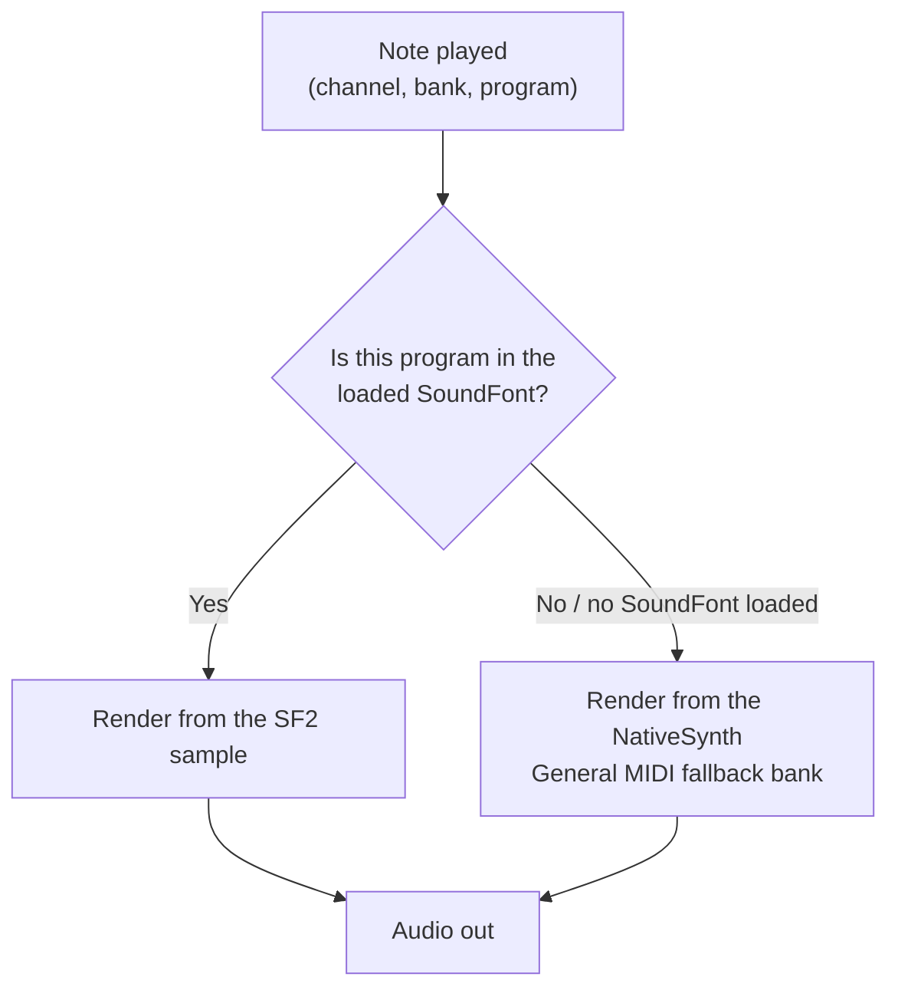

# SoundFont 2 Player

**The SoundFont player makes your MIDI play back with real recorded instruments** — a real piano, real drums — instead of synthesized tones. You give it a SoundFont file; it does the rest.

A **SoundFont (SF2)** is a single file that bundles those recorded instrument samples together with the rules for playing them: which sample to use at which pitch and velocity, how to loop it, and how envelopes, filters, and LFOs shape it. Think of it as a sample library in one file. libsonare ships a **GS-compatible SF2 player** that reads a SoundFont *you supply* and renders your MIDI tracks through it — offline via [project bounce](./project-bounce.md), or live through the [realtime engine](./midi-input.md) — with full 16-part multitimbral playback and Roland-GS extensions layered on top of the General MIDI baseline.

::: warning You must bring your own SF2 file
**No SoundFont ships with the library** — an SF2 is licensed instrument data, not code, and nothing is baked into the binaries. You fetch a `.sf2` and hand its bytes to the player. If you have no SF2 (or a program your SF2 does not cover), playback does **not** go silent: it falls through to the built-in [NativeSynth](./native-synth.md) GM bank, the data-free floor.
:::

::: info Three words to know first
A **preset** is one selectable sound (a "program") in the SoundFont. A **program change** picks a preset on a MIDI channel. A **bank** groups 128 programs; GS uses extra banks for tonal variations and reserves **bank 128** for drum kits. Channel 10 is the drum channel by GS convention.
:::

## How each note picks its sound

For every note, the player asks one question: *does the loaded SoundFont cover this sound?* If yes, the note plays from the SF2 sample. If not — or if you loaded no SoundFont at all — the note falls through to the built-in [NativeSynth](./native-synth.md) General MIDI bank. Either way, the note makes sound: **MIDI never renders silent here.**



The [program manifest](#know-what-resolves-the-program-manifest) below lets you see this decision ahead of time, per program.

## What You Will Learn

By the end of this page you should be able to:

- load a caller-supplied SF2 into a `Project` or the realtime engine, and release it;
- read the per-program manifest to see which notes resolve to `sf2` versus the `synth` fallback;
- bounce a MIDI arrangement through SF2 instruments deterministically;
- understand the SF2 modulator/envelope semantics and the GS architecture layer the player implements;
- bind an SF2 instrument for live MIDI input.

## Pick the right entry point

The player is exposed at two levels. Use the project level for offline rendering and the engine level for live playback.

| Your situation | Use | Why |
|----------------|-----|-----|
| Render a finished MIDI arrangement to audio | [`Project.bounceWithSf2Instrument(...)`](#bouncing-midi-through-sf2-instruments) | Deterministic offline render of the whole project |
| Inspect coverage before rendering | [`Project.soundFontManifest()`](#know-what-resolves-the-program-manifest) | Per-program `sf2` vs `synth` backend report |
| Play a keyboard or live MIDI stream | [`RealtimeEngine.setSf2Instrument(...)`](#live-engine-playback) | Binds the player to a realtime MIDI destination |

::: info One engine, every runtime
The same SF2 player is exposed through WASM/JS, Node native, and Python. Names follow each language's convention (`loadSoundFont` ↔ `load_soundfont`, `bounceWithSf2Instrument` ↔ `bounce_with_sf2_instrument`, `soundFontManifest` ↔ `soundfont_manifest`), while the parser, voice model, and GS behavior are identical. The CLI does not wire SF2 — use the Project API for SoundFont-backed bounces.
:::

## Load a caller-supplied SF2

Fetch the `.sf2` yourself and hand the player its raw bytes. The player makes its own copy during the call, so you can discard your buffer right after. A few things to know: loading a SoundFont **replaces** any previous one, and malformed bytes throw an error while leaving the previously loaded SoundFont intact.

::: code-group

```typescript [Browser]
import { init, Project } from '@libraz/libsonare';

await init();

// You provide the file — e.g. fetched from your own asset host or picked by the user.
const sf2Bytes = new Uint8Array(await (await fetch('/instruments/my-bank.sf2')).arrayBuffer());

const project = new Project();
try {
  project.loadSoundFont(sf2Bytes);          // throws on malformed input
  project.soundFontPresetCount();           // e.g. 3 — presets in the loaded bank
  // ... build/edit the arrangement, then bounce (see below) ...
  project.clearSoundFont();                 // optional: release the loaded bank
} finally {
  project.delete();                          // the WASM handle is NOT garbage-collected
}
```

```python [Python]
import libsonare as sonare

with open("instruments/my-bank.sf2", "rb") as f:
    sf2_bytes = f.read()

project = sonare.Project()
try:
    project.load_soundfont(sf2_bytes)        # raises SonareError on malformed input
    project.soundfont_preset_count()         # e.g. 3
    # ... build/edit the arrangement, then bounce (see below) ...
    project.clear_soundfont()                # optional: release the loaded bank
finally:
    project.close()                          # release the native handle
```

:::

::: danger Always release the project
`Project`, like every embind object, holds a WASM heap handle that JavaScript's garbage collector cannot reclaim. Call `project.delete()` in a `finally` block (Python uses `project.close()`). A loaded SoundFont's sample pool is freed with the project, or earlier with `clearSoundFont()` / `clear_soundfont()`.
:::

## Know what resolves: the program manifest

Before you render, ask the project **which programs your arrangement actually plays and where each one resolves**. `soundFontManifest()` enumerates every `(channel, bank, program)` a note plays through, in first-use order, and reports the backend:

- `'sf2'` — the loaded SoundFont covers the program (GS variation/drum fallbacks included), with the resolved `presetName`;
- `'synth'` — no preset covers it, so it plays through the NativeSynth GM fallback; `presetName` is empty.

Without a loaded SoundFont, every entry is a `synth` fallback. This is your honest coverage report: a `synth` row means "this part will sound, but from the data-free floor, not your samples".

::: code-group

```typescript [Browser]
project.loadSoundFont(sf2Bytes);
for (const p of project.soundFontManifest()) {
  // { channel, bank, program, backend: 'sf2' | 'synth', presetName }
  console.log(`ch${p.channel} bank${p.bank} prog${p.program} -> ${p.backend} ${p.presetName}`);
}
// e.g. ch0 bank0 prog0 -> sf2 Piano 1
```

```python [Python]
project.load_soundfont(sf2_bytes)
for p in project.soundfont_manifest():
    # Sf2ProgramStatus(channel, bank, program, backend, preset_name)
    print(f"ch{p.channel} bank{p.bank} prog{p.program} -> {p.backend} {p.preset_name}")
```

:::

::: tip Drum channels report bank 128
A manifest row for channel 9 (MIDI channel 10, 1-based) reports `bank: 128` — the GS drum-kit bank. A covered kit resolves to `sf2`; otherwise the GM drum map from the fallback plays.
:::

## Bouncing MIDI through SF2 instruments

`bounceWithSf2Instrument(...)` compiles and renders the whole project, driving each bound MIDI destination through a GS-compatible SF2 player fed by the loaded SoundFont. It mirrors [`bounceWithBuiltinInstrument`](./project-bounce.md) but with sampled sounds. The render is **deterministic**: the same project, options, SoundFont, and patch produce bit-identical audio.

You bind a player to a MIDI **destination id** (the value you set with `setTrackMidiDestination`). The patch is an [`Sf2InstrumentConfig`](#instrument-config-and-the-voice-model) — every field is optional, so `{}` is a usable default.

::: code-group

```typescript [Browser]
import { init, Project } from '@libraz/libsonare';

await init();

const project = new Project();
try {
  project.setSampleRate(48000);

  // A one-note MIDI clip routed to destination 0.
  const { trackId, clipId } = project.addMidiClip(0, 4);
  project.setTrackMidiDestination(trackId, 0);
  project.setMidiEvents(clipId, [
    Project.midiNoteOn(0, 0, 0, 60, 100),   // ppq, group, channel, note, velocity
    Project.midiNoteOff(2, 0, 0, 60, 0),
  ]);

  project.loadSoundFont(sf2Bytes);

  // Bind a default SF2 player to destination 0, render 4096 frames of stereo.
  const audio = project.bounceWithSf2Instrument(
    { destinationId: 0, gain: 1 },
    { totalFrames: 4096, numChannels: 2, sampleRate: 48000 },
  );
  // audio is interleaved Float32Array (frames * channels)
} finally {
  project.delete();
}
```

```python [Python]
import libsonare as sonare

project = sonare.Project()
try:
    project.set_sample_rate(48000.0)

    track, clip = project.add_midi_clip(0.0, 4.0)
    project.set_track_midi_destination(track, 0)
    project.set_midi_events(clip, [
        sonare.Project.midi_note_on(0.0, 0, 0, 60, 100),
        sonare.Project.midi_note_off(2.0, 0, 0, 60, 0),
    ])

    project.load_soundfont(sf2_bytes)

    audio = project.bounce_with_sf2_instrument(
        sonare.Sf2InstrumentConfig(destination_id=0, gain=1.0),
        total_frames=4096, num_channels=2, sample_rate=48000,
    )
    # audio is a (frames, channels) float32 ndarray
finally:
    project.close()
```

:::

::: warning Empty bindings render silence
Passing an explicitly empty array `[]` (rather than a patch or `undefined`) binds **zero** instruments, so MIDI tracks render silent. To bind multiple destinations, pass an array of patches each carrying its own `destinationId`.
:::

::: tip MIDI never renders silent for lack of data
You can bounce with **no SoundFont loaded at all** — bound destinations still sound, because uncovered programs play through the NativeSynth GM fallback. The manifest tells you exactly which parts will use samples and which will use the fallback. See [NativeSynth](./native-synth.md) for the fallback engine.
:::

### Instrument config and the voice model

`Sf2InstrumentConfig` is the per-player patch. Every field is optional; a non-positive or omitted numeric field takes the C-ABI default.

| Field (JS / Python) | Meaning | Default |
|---------------------|---------|---------|
| `destinationId` / `destination_id` | MIDI destination this player answers to | `0` |
| `gain` | Master output gain, linear | `0.5` |
| `polyphony` | Max simultaneous voices, clamped to `[1, 64]` | `48` |

When the player runs out of voices it uses **deterministic voice stealing**, so a dense passage degrades the same way on every render.

## What the player implements

The player is a faithful SF2 synthesis core with a Roland-GS architecture layer on top. You do not call these features directly — they are driven by the MIDI events, CCs, NRPNs, and SysEx in your arrangement — but knowing what is honored explains *why* a part sounds the way it does.

::: info SoundFont engine terms (you don't call these directly)
**TVF** (Time-Variant Filter) is the per-note filter and **TVA** (Time-Variant Amplifier) is its volume envelope. **NRPN** and **SysEx** are MIDI messages for extra or vendor-specific parameters. An **exclusive class** is the rule that one drum cuts off another — an open hi-hat is silenced the instant the closed hi-hat plays.
:::

### SF2 synthesis semantics

- **Preset / instrument zone layering** — a note resolves through the SF2 two-level zone structure (preset zones over instrument zones), so layered and split presets play correctly. Generators set sample selection, tuning, loop mode, and exclusive classes (e.g. a closed hi-hat cutting an open one).
- **DAHDSR envelopes** — separate volume and modulation envelopes with Delay/Attack/Hold/Decay/Sustain/Release stages.
- **LFOs** — a vibrato LFO and a modulation LFO drive pitch/filter/amplitude per the SF2 generators.
- **Low-pass filter with velocity tracking** — initial cutoff and resonance, with velocity influencing brightness.
- **The SF2 default modulator set** — velocity, **CC7** (channel volume), and **CC11** (expression) apply a square-law gain; **CC1** (modulation wheel) drives vibrato; **CC91** (reverb send) and **CC93** (chorus send) feed the effect sends. (A **CC** is one of MIDI's continuous "knob" control-change messages — see [MIDI Input](./midi-input.md).)
- **Pitch bend** — honored, with the bend range set by **RPN 0** (entered via Data Entry / RPN), so a part can request its own semitone range.

### The GS architecture layer

On top of GM, the player implements the Roland-GS extensions a GS-authored arrangement expects:

- **Variation-bank fallback** — a GS variation bank that the SoundFont does not cover falls back to the capital (bank-0) tone, so a missing variation still plays the right family instead of going silent.
- **Bank-128 drum kits on channel 10** — drum programs live in bank 128; channel 10 (index 9) is the drum part by convention.
- **NRPN part edits** — TVF cutoff/resonance, TVA envelope, and vibrato can be edited per part via NRPN, plus **per-note drum NRPNs** for individual drum sounds.
- **GS / GM SysEx** — **GS Reset**, **GM System On**, and "use for rhythm part" SysEx are recognized — both from the host and from SysEx events embedded inside an arrangement.
- **Send-return effects** — reverb, chorus, and delay send-return effects, plus a per-part **drive** insert.
- **MIDI 2.0 / GM2** — the player decodes MIDI 2.0 banked Program Change and resolves the **GM2 Bank Select LSB** to the variation bank, so GM2-authored material maps to the right tone.

::: tip Author GS banks with the MIDI helpers
`Project.midiBankProgram(ppq, group, channel, bankMsb, bankLsb, program)` expands a bank-select-plus-program-change into the MIDI events `setMidiEvents` accepts — the right way to select a GS variation or a drum kit. Static helpers like `Project.gmDrumName(note)`, `Project.gm2InstrumentName(bankLsb, program)`, and `Project.midiCcName(controller)` name the slots so your authoring code reads clearly.
:::

## Live engine playback

For a keyboard or a live MIDI stream, bind the SF2 player to a realtime MIDI destination with `setSf2Instrument(...)`. The engine routes live note/CC commands and scheduled MIDI clips for that destination through the player, with the same 16-channel, channel-10-drum, GS-NRPN, and GS/GM-SysEx behavior. Load the SoundFont into the **engine** first (a separate load from the project's).

```typescript
import { init, RealtimeEngine } from '@libraz/libsonare';

await init();

const engine = new RealtimeEngine(48000, 128);   // sampleRate, maxBlockSize
try {
  engine.loadSoundFont(sf2Bytes);                // engine-level load
  engine.setSf2Instrument({ gain: 1 }, 7);       // bind player to destination 7
  engine.midiInstrumentCount();                  // 1

  // Feed a live note, then render a block.
  engine.pushMidiNoteOn(7, 0, 0, 60, 100);       // destinationId, group, channel, note, velocity
  const [left, right] = engine.process([new Float32Array(128), new Float32Array(128)]);

  engine.clearMidiInstrument(7);                 // unbind
} finally {
  engine.destroy();
}
```

::: tip Binding before loading is allowed
You can call `setSf2Instrument(...)` before any SoundFont is loaded — live MIDI then plays through the NativeSynth GM fallback. Load a SoundFont later and bound destinations begin using its samples. See [MIDI Input](./midi-input.md) for wiring live keyboards and Web MIDI.
:::

## Recipes

:::: details Inspect coverage, then bounce
Load your SF2, check the manifest for any `synth` rows (parts that will use the fallback), then render.

```typescript
project.loadSoundFont(sf2Bytes);
const uncovered = project.soundFontManifest().filter((p) => p.backend === 'synth');
if (uncovered.length) {
  console.warn('Falling back to NativeSynth for:', uncovered);
}
const audio = project.bounceWithSf2Instrument(
  { destinationId: 0, gain: 1 },
  { totalFrames: 4096, numChannels: 2, sampleRate: 48000 },
);
```
::::

:::: details Multitimbral: melody + drums in one bounce
Route a melodic track to one destination and a drum track (channel 10, bank 128) to another, then bind a player to each.

```typescript
// Drum part: bank 128 program 0 on channel 10 (index 9).
project.setMidiEvents(drumClipId, [
  ...Project.midiBankProgram(0, 0, 9, 0, 0, 0),
  Project.midiNoteOn(0, 0, 9, 36, 110),   // 36 = Bass Drum 1
  Project.midiNoteOff(1, 0, 9, 36, 0),
]);

const audio = project.bounceWithSf2Instrument(
  [{ destinationId: 0, gain: 1 }, { destinationId: 1, gain: 1 }],
  { totalFrames: 8192, numChannels: 2, sampleRate: 48000 },
);
```
::::

:::: details Render even without an SF2
With no SoundFont loaded, the bounce still sounds via the NativeSynth GM fallback — useful for a quick preview before you ship instrument data.

```typescript
const preview = project.bounceWithSf2Instrument(
  {},   // default patch; nothing loaded -> GM fallback for every program
  { totalFrames: 4096, numChannels: 2, sampleRate: 48000 },
);
```
::::

## Related

- [NativeSynth](./native-synth.md) — the data-free GM fallback engine that keeps MIDI from going silent
- [Project Bounce](./project-bounce.md) — offline rendering of a project, including the builtin/synth bounce siblings
- [MIDI Input](./midi-input.md) — live keyboards, Web MIDI, and realtime engine routing
- [Project Editing](./project-editing.md) — building the MIDI tracks and clips you render
- [Recording and Takes](./recording-and-takes.md) — capturing performances into the project
