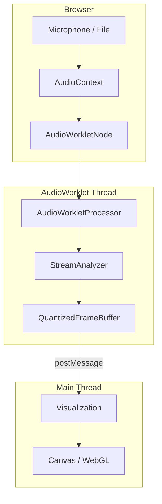

# WebAssembly Guide

libsonare can be compiled to WebAssembly for audio analysis directly in web browsers.

## Installation

::: warning Package Not Published
The npm package `@libraz/sonare` is currently in beta and not yet publicly available. For now, use the WASM files directly from the repository or build from source.
:::

### npm/yarn

```bash
# Not yet available - coming soon
npm install @libraz/sonare
# or
yarn add @libraz/sonare
```

### CDN

```html
<script type="module">
  import { init, detectBpm } from 'https://unpkg.com/@libraz/sonare';
</script>
```

## Basic Usage

```typescript
import { init, detectBpm, detectKey, analyze } from '@libraz/sonare';

async function analyzeAudio() {
  // Initialize WASM module
  await init();

  // Get audio data from AudioContext
  const audioCtx = new AudioContext();
  const response = await fetch('music.mp3');
  const arrayBuffer = await response.arrayBuffer();
  const audioBuffer = await audioCtx.decodeAudioData(arrayBuffer);

  // Get mono samples
  const samples = audioBuffer.getChannelData(0);
  const sampleRate = audioBuffer.sampleRate;

  // Detect BPM
  const bpm = detectBpm(samples, sampleRate);
  console.log(`BPM: ${bpm}`);

  // Detect key
  const key = detectKey(samples, sampleRate);
  console.log(`Key: ${key.name}`);  // "C major"

  // Full analysis
  const result = analyze(samples, sampleRate);
  console.log(result);
}
```

## File Input

```typescript
async function analyzeFile(file: File) {
  await init();
  const audioCtx = new AudioContext();

  const arrayBuffer = await file.arrayBuffer();
  const audioBuffer = await audioCtx.decodeAudioData(arrayBuffer);
  const samples = audioBuffer.getChannelData(0);

  return analyze(samples, audioBuffer.sampleRate);
}

// Usage with file input
const input = document.querySelector('input[type="file"]');
input.addEventListener('change', async (e) => {
  const file = e.target.files[0];
  const result = await analyzeFile(file);
  console.log(`BPM: ${result.bpm}`);
});
```

## Progress Reporting

```typescript
import { init, analyzeWithProgress } from '@libraz/sonare';

await init();

const result = analyzeWithProgress(samples, sampleRate, (progress, stage) => {
  const percent = Math.round(progress * 100);
  console.log(`${stage}: ${percent}%`);

  // Update UI
  progressBar.style.width = `${percent}%`;
  statusText.textContent = stage;
});
```

## Web Worker Usage

Offload analysis to a Web Worker to avoid blocking the main thread.

**worker.ts:**

```typescript
import { init, analyze, AnalysisResult } from '@libraz/sonare';

let initialized = false;

self.onmessage = async (e: MessageEvent) => {
  const { samples, sampleRate } = e.data;

  if (!initialized) {
    await init();
    initialized = true;
  }

  try {
    const result = analyze(samples, sampleRate);
    self.postMessage({ success: true, result });
  } catch (error) {
    self.postMessage({ success: false, error: error.message });
  }
};
```

**main.ts:**

```typescript
const worker = new Worker(new URL('./worker.ts', import.meta.url), {
  type: 'module'
});

function analyzeInWorker(
  samples: Float32Array,
  sampleRate: number
): Promise<AnalysisResult> {
  return new Promise((resolve, reject) => {
    worker.onmessage = (e) => {
      if (e.data.success) {
        resolve(e.data.result);
      } else {
        reject(new Error(e.data.error));
      }
    };
    worker.postMessage({ samples, sampleRate });
  });
}
```

## Stereo to Mono Conversion

```typescript
async function getMonoSamples(audioBuffer: AudioBuffer): Promise<Float32Array> {
  if (audioBuffer.numberOfChannels === 1) {
    return audioBuffer.getChannelData(0);
  }

  // Mix stereo to mono
  const left = audioBuffer.getChannelData(0);
  const right = audioBuffer.getChannelData(1);
  const mono = new Float32Array(left.length);

  for (let i = 0; i < left.length; i++) {
    mono[i] = (left[i] + right[i]) / 2;
  }

  return mono;
}
```

## Performance Tips

### Downsampling

For BPM detection, 22050 Hz is sufficient:

```typescript
import { resample, detectBpm } from '@libraz/sonare';

// Downsample for faster analysis
const downsampled = resample(samples, 48000, 22050);
const bpm = detectBpm(downsampled, 22050);
```

### Analyze Segments

For long files, analyze only relevant sections:

```typescript
function analyzeSegment(
  samples: Float32Array,
  sampleRate: number,
  startSec: number,
  endSec: number
) {
  const start = Math.floor(startSec * sampleRate);
  const end = Math.floor(endSec * sampleRate);
  const segment = samples.slice(start, end);

  return analyze(segment, sampleRate);
}

// Analyze only chorus (60-90 seconds)
const result = analyzeSegment(samples, sampleRate, 60, 90);
```

## React Example

```tsx
import { useState } from 'react';
import { init, analyzeWithProgress, AnalysisResult } from '@libraz/sonare';

function AudioAnalyzer() {
  const [progress, setProgress] = useState(0);
  const [stage, setStage] = useState('');
  const [result, setResult] = useState<AnalysisResult | null>(null);

  const handleFileChange = async (e: React.ChangeEvent<HTMLInputElement>) => {
    const file = e.target.files?.[0];
    if (!file) return;

    await init();

    const audioCtx = new AudioContext();
    const arrayBuffer = await file.arrayBuffer();
    const audioBuffer = await audioCtx.decodeAudioData(arrayBuffer);
    const samples = audioBuffer.getChannelData(0);

    const analysisResult = analyzeWithProgress(
      samples,
      audioBuffer.sampleRate,
      (p, s) => {
        setProgress(p);
        setStage(s);
      }
    );

    setResult(analysisResult);
  };

  return (
    <div>
      <input type="file" accept="audio/*" onChange={handleFileChange} />

      {stage && (
        <div>
          <div>{stage}: {Math.round(progress * 100)}%</div>
          <progress value={progress} max={1} />
        </div>
      )}

      {result && (
        <div>
          <p>BPM: {result.bpm.toFixed(1)}</p>
          <p>Key: {result.key.name}</p>
        </div>
      )}
    </div>
  );
}
```

## Streaming Analysis

The Streaming API enables real-time audio analysis with low latency. Unlike batch analysis, streaming processes audio chunk by chunk as it arrives.

::: info Batch vs Streaming
| Approach | Use Case | Latency | Features |
|----------|----------|---------|----------|
| **Batch** | Pre-recorded files | High | Full analysis (BPM, chords, sections) |
| **Streaming** | Live audio, visualization | Low (~10ms) | Mel, chroma, onset, progressive BPM/key |
:::

### Architecture Overview



### Basic Example

```typescript
import { init, StreamAnalyzer } from '@libraz/sonare';

async function setupStreaming() {
  await init();

  const audioCtx = new AudioContext();
  const stream = await navigator.mediaDevices.getUserMedia({ audio: true });
  const source = audioCtx.createMediaStreamSource(stream);

  // Create analyzer with throttling for 60fps
  const analyzer = new StreamAnalyzer(
    audioCtx.sampleRate,
    2048,   // nFft
    512,    // hopLength
    128,    // nMels
    true,   // computeMel
    true,   // computeChroma
    true,   // computeOnset
    4       // emit every 4 frames (~60fps at 44100Hz)
  );

  // Use ScriptProcessor for simplicity (AudioWorklet recommended for production)
  const processor = audioCtx.createScriptProcessor(512, 1, 1);

  processor.onaudioprocess = (e) => {
    const input = e.inputBuffer.getChannelData(0);
    analyzer.process(input);

    const available = analyzer.availableFrames();
    if (available > 0) {
      const frames = analyzer.readFramesSoa(available);
      updateVisualization(frames);

      // Check progressive BPM/key estimates
      const stats = analyzer.stats();
      if (stats.estimate.updated) {
        console.log(`BPM: ${stats.estimate.bpm.toFixed(1)}`);
        console.log(`Key: ${stats.estimate.key}`);
      }
    }
  };

  source.connect(processor);
  processor.connect(audioCtx.destination);
}
```

### AudioWorklet Integration

For production use, run `StreamAnalyzer` in an AudioWorklet to avoid main thread blocking.

::: warning WASM in AudioWorklet
Loading WASM in AudioWorklet requires special handling. The WASM module must be loaded and instantiated within the worklet context.
:::

**analyzer-worklet.ts:**

```typescript
import { StreamAnalyzer } from '@libraz/sonare';

class AnalyzerWorklet extends AudioWorkletProcessor {
  private analyzer: StreamAnalyzer;
  private frameCounter = 0;

  constructor() {
    super();
    // sampleRate is a global in AudioWorkletGlobalScope
    this.analyzer = new StreamAnalyzer(
      sampleRate,
      2048,   // nFft
      512,    // hopLength
      64,     // nMels (reduced for bandwidth)
      true,   // computeMel
      true,   // computeChroma
      true,   // computeOnset
      4       // emit every 4 frames
    );
  }

  process(inputs: Float32Array[][]): boolean {
    const input = inputs[0]?.[0];
    if (!input || input.length === 0) return true;

    this.analyzer.process(input);

    const available = this.analyzer.availableFrames();
    if (available >= 4) {
      // Use U8 format for minimal bandwidth
      const frames = this.analyzer.readFramesU8(available);

      // Transfer buffers for zero-copy
      this.port.postMessage({
        type: 'frames',
        data: frames
      }, [
        frames.timestamps.buffer,
        frames.mel.buffer,
        frames.chroma.buffer
      ]);
    }

    // Periodically send stats
    if (++this.frameCounter % 100 === 0) {
      this.port.postMessage({
        type: 'stats',
        data: this.analyzer.stats()
      });
    }

    return true;
  }
}

registerProcessor('analyzer-worklet', AnalyzerWorklet);
```

**main.ts:**

```typescript
const audioCtx = new AudioContext();
await audioCtx.audioWorklet.addModule('analyzer-worklet.js');

const workletNode = new AudioWorkletNode(audioCtx, 'analyzer-worklet');

workletNode.port.onmessage = (e) => {
  if (e.data.type === 'frames') {
    renderVisualization(e.data.data);
  } else if (e.data.type === 'stats') {
    updateBpmDisplay(e.data.data.estimate);
  }
};

// Connect audio source
const stream = await navigator.mediaDevices.getUserMedia({ audio: true });
const source = audioCtx.createMediaStreamSource(stream);
source.connect(workletNode);
```

### Bandwidth Optimization

Choose the appropriate output format based on your needs:

| Format | Size per Frame | Best For |
|--------|---------------|----------|
| `readFramesSoa()` | ~600 bytes | Development, debugging |
| `readFramesI16()` | ~300 bytes | High-quality visualizations |
| `readFramesU8()` | ~150 bytes | Mobile, bandwidth-limited |

### Progressive Estimation

The Streaming API provides **progressive BPM and key estimates** that improve over time:

```typescript
const stats = analyzer.stats();

// BPM (available after ~5 seconds)
if (stats.estimate.bpm > 0) {
  const confidence = stats.estimate.bpmConfidence;
  console.log(`BPM: ${stats.estimate.bpm.toFixed(1)} (${(confidence * 100).toFixed(0)}%)`);
}

// Key (available after ~10 seconds)
if (stats.estimate.key >= 0) {
  const keyNames = ['C', 'C#', 'D', 'D#', 'E', 'F', 'F#', 'G', 'G#', 'A', 'A#', 'B'];
  const keyName = keyNames[stats.estimate.key];
  const mode = stats.estimate.keyMinor ? 'minor' : 'major';
  console.log(`Key: ${keyName} ${mode}`);
}
```

### Visualization Example

```typescript
function renderVisualization(frames: QuantizedFrameBufferU8) {
  const { nFrames, nMels, mel, chroma, onsetStrength } = frames;

  // Render mel spectrogram (scrolling display)
  for (let f = 0; f < nFrames; f++) {
    for (let m = 0; m < nMels; m++) {
      const value = mel[f * nMels + m]; // 0-255
      const color = `rgb(${value}, ${value * 0.5}, ${255 - value})`;
      // Draw pixel at (scrollX + f, nMels - m)
    }
  }

  // Render chroma (12 pitch classes)
  for (let f = 0; f < nFrames; f++) {
    for (let c = 0; c < 12; c++) {
      const value = chroma[f * 12 + c];
      // Draw chroma bar
    }
  }

  // Trigger effects on strong onsets
  for (let f = 0; f < nFrames; f++) {
    if (onsetStrength[f] > 200) { // threshold
      triggerBeatEffect();
    }
  }
}
```

## Browser Compatibility

| Browser | Minimum Version |
|---------|-----------------|
| Chrome | 57+ |
| Firefox | 52+ |
| Safari | 11+ |
| Edge | 16+ |

Requirements:
- WebAssembly support
- Web Audio API
- ES2017+ (async/await)

## Bundle Size

| File | Size | Gzipped |
|------|------|---------|
| `sonare.js` | ~34 KB | ~12 KB |
| `sonare.wasm` | ~228 KB | ~80 KB |
| **Total** | ~262 KB | ~92 KB |

## Troubleshooting

### AudioContext Not Allowed

Modern browsers require user interaction before creating AudioContext:

```typescript
document.addEventListener('click', async () => {
  const audioCtx = new AudioContext();
  await audioCtx.resume();
});
```

### Cross-Origin Issues

When loading audio from other domains:

```typescript
const response = await fetch(url, {
  mode: 'cors',
  credentials: 'omit'
});
```

### Memory Issues

For very long audio files, consider analyzing in chunks:

```typescript
const CHUNK_DURATION = 60; // seconds

for (let start = 0; start < totalDuration; start += CHUNK_DURATION) {
  const chunk = samples.slice(
    start * sampleRate,
    (start + CHUNK_DURATION) * sampleRate
  );
  // Analyze chunk
}
```
