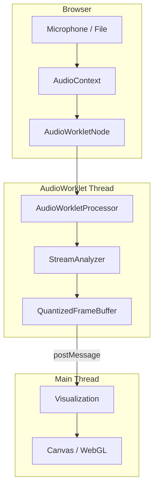

# WebAssembly Guide

libsonare can be compiled to WebAssembly for audio analysis directly in web
browsers. The npm package expects decoded mono `Float32Array` samples; file
decoding is handled by the Web Audio API or another JavaScript decoder.

Use this page when you are building a browser app. If you are writing a Python script, terminal batch job, or native desktop tool, start with [Getting Started](./getting-started.md) and choose another runtime.

## Browser Mental Model

| Step | What happens |
|------|--------------|
| 1. Load a file | Use `fetch`, an `<input type="file">`, drag-and-drop, or another browser source |
| 2. Decode audio | Use `AudioContext.decodeAudioData(...)` or your own decoder |
| 3. Choose samples | Pass one mono channel, downmix stereo yourself, or call stereo APIs where available |
| 4. Call libsonare | Pass samples plus `sampleRate` to analysis, editing, mastering, or mixing APIs |

The most common beginner mistake is passing an MP3 `ArrayBuffer` directly to an analysis function. Decode it first; libsonare's browser package works on PCM samples, not compressed file bytes.

::: details What are Float32Array, PCM, mono, and downmixing?
- **PCM samples** are the raw, uncompressed waveform — a long list of amplitude numbers. An MP3/WAV *file* is compressed or wrapped bytes; decoding turns it into PCM.
- **`Float32Array`** is the JavaScript typed array the Web Audio API uses to hold those samples as 32-bit floats (normally in the −1…1 range), one number per sample. libsonare's browser API takes this directly.
- **Mono / downmixing** — mono is a single channel. Stereo audio has separate left and right channels; *downmixing* combines them into one (typically by averaging) so you can pass a single channel to a mono API.
:::

## What You Will Learn

By the end of this page you should be able to:

- install and initialize the WASM package correctly;
- decode browser files into PCM and pass the right channel/sample-rate pair to libsonare;
- choose between one-shot functions, `Audio`, `StreamAnalyzer`, `StreamingMasteringChain`, `Mixer`, and `RealtimeEngine`;
- understand the bundle-size and Worker/AudioWorklet tradeoffs before shipping a browser app.

## Installation

### npm/yarn

::: code-group

```bash [npm]
npm install @libraz/libsonare
```

```bash [yarn]
yarn add @libraz/libsonare
```

```bash [pnpm]
pnpm add @libraz/libsonare
```

:::

### CDN

```html
<script type="module">
  import { init, detectBpm } from 'https://unpkg.com/@libraz/libsonare';
</script>
```

## Basic Usage

```typescript
import { init, detectBpm, detectKey, analyze } from '@libraz/libsonare';

async function analyzeAudio() {
  // Initialize WASM module
  await init();

  // Get audio data from AudioContext
  const audioCtx = new AudioContext();
  const response = await fetch('music.mp3');
  const arrayBuffer = await response.arrayBuffer();
  const audioBuffer = await audioCtx.decodeAudioData(arrayBuffer);

  // Get one mono channel. Downmix explicitly if you need both stereo channels.
  const samples = audioBuffer.getChannelData(0);
  const sampleRate = audioBuffer.sampleRate;

  // Detect BPM
  const bpm = detectBpm(samples, sampleRate);
  console.log(`BPM: ${bpm}`);

  // Detect key
  const key = detectKey(samples, sampleRate);
  console.log(`Key: ${key.name}`);  // "C major"

  // Full analysis
  const result = analyze(samples, sampleRate);
  console.log(result);
}
```

CLI equivalent for the same one-file checks:

```bash
sonare bpm music.mp3
sonare key music.mp3
sonare analyze music.mp3 --json
```

The browser build also exposes the full librosa-parity helper set, grouped by intent:

- **Waveform pre-processing** — `preemphasis` / `deemphasis`, `trimSilence` / `splitSilence`
- **Framing / size alignment** — `frameSignal`, `padCenter`, `fixLength`, `fixFrames`
- **1-D post-processing** — `peakPick`, `vectorNormalize`
- **Features** — `pcen` (mel dynamic-range compression), `tonnetz` (harmonic-space projection), `tempogram` / `plp` (tempo representations)
- **Unit conversion** — `powerToDb` / `amplitudeToDb` / `dbToPower` / `dbToAmplitude`, `framesToSamples` / `samplesToFrames`

See the [JS API reference](./js-api.md) for signatures and the [librosa Compatibility](./librosa-compatibility.md) mapping.

## Browser Mixing

The WASM package exposes the mixing engine. Use `mixStereo(...)` for one-shot stem rendering, or keep a persistent `Mixer` built from scene JSON when you need buses, sends, insert automation, goniometer data, and strip meters.

```typescript
import { init, Mixer, mixStereo, mixingScenePresetJson } from '@libraz/libsonare';

await init();

const rendered = mixStereo([vocalL, musicL], [vocalR, musicR], sampleRate, {
  faderDb: [-3, -12],
  pan: [0, -0.2],
  width: [1, 0.9],
});

const mixer = Mixer.fromSceneJson(mixingScenePresetJson('vocalReverbSend'), sampleRate, 512);
mixer.scheduleFaderAutomation(0, sampleRate * 4, -6, 's-curve');
const block = mixer.processStereo([vocalBlockL, musicBlockL], [vocalBlockR, musicBlockR]);
const meter = mixer.stripMeter(0, 'postFader');
mixer.delete();
```

For a full walkthrough, see [Mixing Engine](./mixing.md).

CLI equivalent for rendering a built-in mixer scene:

```bash
sonare mix \
  --preset vocalReverbSend \
  --input vocal.wav \
  --input music.wav \
  -o mixed.wav
```

## Audio Class

You can use the `Audio` class as an object-oriented alternative to standalone functions. It wraps the samples and sample rate, so you don't need to pass them every time.

```typescript
import { init, Audio } from '@libraz/libsonare';

await init();

const audioCtx = new AudioContext();
const response = await fetch('music.mp3');
const arrayBuffer = await response.arrayBuffer();
const audioBuffer = await audioCtx.decodeAudioData(arrayBuffer);

// Create Audio instance
const audio = Audio.fromBuffer(
  audioBuffer.getChannelData(0),
  audioBuffer.sampleRate
);

// Analysis
const bpm = audio.detectBpm();
const key = audio.detectKey();
const result = audio.analyze();

// Effects
const { harmonic, percussive } = audio.hpss();
const stretched = audio.timeStretch(1.5);
const shifted = audio.pitchShift(2);

// Feature extraction
const mel = audio.melSpectrogram();
const mfcc = audio.mfcc();
const chroma = audio.chroma();
const pitch = audio.pitchPyin();

console.log(`BPM: ${bpm}, Key: ${key.name}`);
console.log(`Median pitch: ${pitch.medianF0.toFixed(1)} Hz`);
```

CLI equivalents for the calls above. `analyze`, `hpss`, and `pitch` are available in the Python CLI; `pitch-shift` is from the source-built C++ CLI:

```bash [Mixed CLI]
sonare analyze music.mp3 --json
sonare hpss music.mp3 --json
sonare pitch-shift music.wav --semitones 2 -o shifted.wav
sonare pitch music.mp3 --algorithm pyin --json
```

See the [JS API Reference](/docs/js-api#audio-class) for the full list of instance methods.

## Browser Mastering

The `/mastering` demo uses the same WASM package described here. Audio decoding happens in the browser, mastering work runs in a Web Worker, and the rendered WAV plus JSON report are created locally.

For implementation details, see [Mastering Implementation](./mastering-implementation.md), [Browser Local Processing](./glossary/concepts/browser-local-processing.md), [Mastering](./glossary/mastering.md), and [Stereo, Limiter, and Loudness Controls](./glossary/mastering/stereo-limiter-loudness.md).

The mastering API also includes `masteringAssistantSuggest(...)`, `masteringAudioProfile(...)`, and `masteringStreamingPreview(...)` for JSON-driven assistant output, source profiling, and platform preview reporting.

CLI equivalent for a simple loudness-normalized master:

```bash
sonare mastering track.wav --target-lufs -14 --ceiling-db -1 -o master.wav
```

## File Input

WASM builds do not bundle WAV/MP3/M4A decoders. Browser support for compressed
formats depends on `AudioContext.decodeAudioData()` and the user's browser.

```typescript
async function analyzeFile(file: File) {
  await init();
  const audioCtx = new AudioContext();

  const arrayBuffer = await file.arrayBuffer();
  const audioBuffer = await audioCtx.decodeAudioData(arrayBuffer);
  const samples = audioBuffer.getChannelData(0);

  return analyze(samples, audioBuffer.sampleRate);
}

// Usage with file input
const input = document.querySelector('input[type="file"]');
input.addEventListener('change', async (e) => {
  const file = e.target.files[0];
  const result = await analyzeFile(file);
  console.log(`BPM: ${result.bpm}`);
});
```

## Progress Reporting

```typescript
import { init, analyzeWithProgress } from '@libraz/libsonare';

await init();

const result = analyzeWithProgress(samples, sampleRate, (progress, stage) => {
  const percent = Math.round(progress * 100);
  console.log(`${stage}: ${percent}%`);

  // Update UI
  progressBar.style.width = `${percent}%`;
  statusText.textContent = stage;
});
```

## Web Worker Usage

Offload analysis to a Web Worker to avoid blocking the main thread.

**worker.ts:**

```typescript
import { init, analyze, AnalysisResult } from '@libraz/libsonare';

let initialized = false;

self.onmessage = async (e: MessageEvent) => {
  const { samples, sampleRate } = e.data;

  if (!initialized) {
    await init();
    initialized = true;
  }

  try {
    const result = analyze(samples, sampleRate);
    self.postMessage({ success: true, result });
  } catch (error) {
    self.postMessage({ success: false, error: error.message });
  }
};
```

**main.ts:**

```typescript
const worker = new Worker(new URL('./worker.ts', import.meta.url), {
  type: 'module'
});

function analyzeInWorker(
  samples: Float32Array,
  sampleRate: number
): Promise<AnalysisResult> {
  return new Promise((resolve, reject) => {
    worker.onmessage = (e) => {
      if (e.data.success) {
        resolve(e.data.result);
      } else {
        reject(new Error(e.data.error));
      }
    };
    worker.postMessage({ samples, sampleRate });
  });
}
```

## Stereo to Mono Conversion

```typescript
async function getMonoSamples(audioBuffer: AudioBuffer): Promise<Float32Array> {
  if (audioBuffer.numberOfChannels === 1) {
    return audioBuffer.getChannelData(0);
  }

  // Mix stereo to mono
  const left = audioBuffer.getChannelData(0);
  const right = audioBuffer.getChannelData(1);
  const mono = new Float32Array(left.length);

  for (let i = 0; i < left.length; i++) {
    mono[i] = (left[i] + right[i]) / 2;
  }

  return mono;
}
```

## Performance Tips

### Downsampling

For BPM detection, 22050 Hz is sufficient:

```typescript
import { resample, detectBpm } from '@libraz/libsonare';

// Downsample for faster analysis
const downsampled = resample(samples, 48000, 22050);
const bpm = detectBpm(downsampled, 22050);
```

### Analyze Segments

For long files, analyze only relevant sections:

```typescript
function analyzeSegment(
  samples: Float32Array,
  sampleRate: number,
  startSec: number,
  endSec: number
) {
  const start = Math.floor(startSec * sampleRate);
  const end = Math.floor(endSec * sampleRate);
  const segment = samples.slice(start, end);

  return analyze(segment, sampleRate);
}

// Analyze only chorus (60-90 seconds)
const result = analyzeSegment(samples, sampleRate, 60, 90);
```

## React Example

```tsx
import { useState } from 'react';
import { init, analyzeWithProgress, AnalysisResult } from '@libraz/libsonare';

function AudioAnalyzer() {
  const [progress, setProgress] = useState(0);
  const [stage, setStage] = useState('');
  const [result, setResult] = useState<AnalysisResult | null>(null);

  const handleFileChange = async (e: React.ChangeEvent<HTMLInputElement>) => {
    const file = e.target.files?.[0];
    if (!file) return;

    await init();

    const audioCtx = new AudioContext();
    const arrayBuffer = await file.arrayBuffer();
    const audioBuffer = await audioCtx.decodeAudioData(arrayBuffer);
    const samples = audioBuffer.getChannelData(0);

    const analysisResult = analyzeWithProgress(
      samples,
      audioBuffer.sampleRate,
      (p, s) => {
        setProgress(p);
        setStage(s);
      }
    );

    setResult(analysisResult);
  };

  return (
    <div>
      <input type="file" accept="audio/*" onChange={handleFileChange} />

      {stage && (
        <div>
          <div>{stage}: {Math.round(progress * 100)}%</div>
          <progress value={progress} max={1} />
        </div>
      )}

      {result && (
        <div>
          <p>BPM: {result.bpm.toFixed(1)}</p>
          <p>Key: {result.key.name}</p>
        </div>
      )}
    </div>
  );
}
```

## Streaming Analysis

The Streaming API enables real-time audio analysis with low latency. Unlike batch analysis, streaming processes audio chunk by chunk as it arrives.

::: info Batch vs Streaming
| Approach | Use Case | Latency | Features |
|----------|----------|---------|----------|
| **Batch** | Pre-recorded files | High | Full analysis (BPM, chords, sections) |
| **Streaming** | Live audio, visualization | Low (~10ms) | Mel, chroma, onset, progressive BPM/key |
:::

### Architecture Overview


```mermaid
flowchart TB
    subgraph Browser
        A[Microphone / File] --> B[AudioContext]
        B --> C[AudioWorkletNode]
    end

    subgraph AudioWorklet Thread
        C --> D[AudioWorkletProcessor]
        D --> E[StreamAnalyzer]
        E --> F[QuantizedFrameBuffer]
    end

    subgraph Main Thread
        F -->|postMessage| G[Visualization]
        G --> H[Canvas / WebGL]
    end
```

### Basic Example

```typescript
import { init, StreamAnalyzer } from '@libraz/libsonare';

async function setupStreaming() {
  await init();

  const audioCtx = new AudioContext();
  const stream = await navigator.mediaDevices.getUserMedia({ audio: true });
  const source = audioCtx.createMediaStreamSource(stream);

  // Create analyzer with throttling for 60fps
  const analyzer = new StreamAnalyzer({
    sampleRate: audioCtx.sampleRate,
    nFft: 2048,
    hopLength: 512,
    nMels: 128,
    computeMel: true,
    computeChroma: true,
    computeOnset: true,
    emitEveryNFrames: 4, // emit every 4 frames (~60fps at 44100Hz)
  });

  // Use ScriptProcessor for simplicity (AudioWorklet recommended for production)
  const processor = audioCtx.createScriptProcessor(512, 1, 1);

  processor.onaudioprocess = (e) => {
    const input = e.inputBuffer.getChannelData(0);
    analyzer.process(input);

    const available = analyzer.availableFrames();
    if (available > 0) {
      const frames = analyzer.readFrames(available);
      updateVisualization(frames);

      // Check progressive BPM/key estimates
      const stats = analyzer.stats();
      if (stats.estimate.updated) {
        const keyNames = ['C', 'C#', 'D', 'D#', 'E', 'F', 'F#', 'G', 'G#', 'A', 'A#', 'B'];
        const mode = stats.estimate.keyMinor ? 'minor' : 'major';
        console.log(`BPM: ${stats.estimate.bpm.toFixed(1)}`);
        // estimate.key is a PitchClass index (0-11), not a string
        console.log(`Key: ${keyNames[stats.estimate.key]} ${mode}`);
      }
    }
  };

  source.connect(processor);
  processor.connect(audioCtx.destination);
}
```

### AudioWorklet Integration

For production use, run `StreamAnalyzer` in an AudioWorklet to avoid main thread blocking.

For realtime-engine playback, the package also ships an AudioWorklet bridge at
`@libraz/libsonare/worklet` and a reduced realtime module at
`@libraz/libsonare/rt`; see [Realtime and Streaming](./realtime-streaming.md)
for that engine-focused path. The example below shows a custom analyzer worklet.

::: warning WASM in AudioWorklet
Loading WASM in AudioWorklet requires special handling. The WASM module must be loaded and instantiated within the worklet context.
:::

**analyzer-worklet.ts:**

```typescript
import { init, StreamAnalyzer } from '@libraz/libsonare';

class AnalyzerWorklet extends AudioWorkletProcessor {
  private analyzer?: StreamAnalyzer;
  private frameCounter = 0;

  constructor() {
    super();
    void init().then(() => {
      // sampleRate is a global in AudioWorkletGlobalScope
      this.analyzer = new StreamAnalyzer({
        sampleRate,
        nFft: 2048,
        hopLength: 512,
        nMels: 64, // reduced for bandwidth
        computeMel: true,
        computeChroma: true,
        computeOnset: true,
        emitEveryNFrames: 4,
      });
    });
  }

  process(inputs: Float32Array[][]): boolean {
    const input = inputs[0]?.[0];
    if (!input || input.length === 0 || !this.analyzer) return true;

    this.analyzer.process(input);

    const available = this.analyzer.availableFrames();
    if (available >= 4) {
      const frames = this.analyzer.readFrames(available);

      // Transfer buffers for zero-copy
      this.port.postMessage({
        type: 'frames',
        data: frames
      }, [
        frames.timestamps.buffer,
        frames.mel.buffer,
        frames.chroma.buffer
      ]);
    }

    // Periodically send stats
    if (++this.frameCounter % 100 === 0) {
      this.port.postMessage({
        type: 'stats',
        data: this.analyzer.stats()
      });
    }

    return true;
  }
}

registerProcessor('analyzer-worklet', AnalyzerWorklet);
```

**main.ts:**

```typescript
const audioCtx = new AudioContext();
await audioCtx.audioWorklet.addModule('analyzer-worklet.js');

const workletNode = new AudioWorkletNode(audioCtx, 'analyzer-worklet');

workletNode.port.onmessage = (e) => {
  if (e.data.type === 'frames') {
    renderVisualization(e.data.data);
  } else if (e.data.type === 'stats') {
    updateBpmDisplay(e.data.data.estimate);
  }
};

// Connect audio source
const stream = await navigator.mediaDevices.getUserMedia({ audio: true });
const source = audioCtx.createMediaStreamSource(stream);
source.connect(workletNode);
```

### Bandwidth Optimization

The TypeScript `StreamAnalyzer` wrapper has three read methods. Choose them by how much precision your UI needs and how much data you can afford to move between threads.

| Method | Returned type | Use when |
|--------|---------------|----------|
| `readFrames(maxFrames)` | `FrameBuffer` with `Float32Array` / `Int32Array` fields | You need full precision for analysis or high-quality visuals |
| `readFramesI16(maxFrames)` | `StreamFramesI16` | You want smaller payloads but still enough precision for most visual meters |
| `readFramesU8(maxFrames)` | `StreamFramesU8` | You need very small payloads for mobile or dense visual updates |

Set `StreamConfig.outputFormat` so the analyzer produces the matching frame type internally:

| `outputFormat` | Internal frame type |
|----------------|---------------------|
| `0` | Float32 |
| `1` | Int16 |
| `2` | Uint8 |

This avoids doing quantization yourself before `postMessage`.

::: details What are "Structure-of-Arrays" and transferable objects?
- **Structure-of-Arrays (SoA)** means each field lives in its own flat typed array — all timestamps in one array, all mel values in another — instead of an array of per-frame objects. It is cheaper to slice and cheaper to hand to another thread.
- **Transferable objects** are `ArrayBuffer`s that `postMessage` can *move* to a worker instead of copying. Ownership transfers (the sender's view becomes empty afterward), which makes passing audio frames between threads near-instant. List the buffers in the second argument: `postMessage(msg, [buffer, ...])`.
- **Quantizing** here means packing each float into a smaller 16-bit or 8-bit integer — fewer bytes to send, at the cost of precision (fine for a meter or heatmap, not for further DSP).
:::

| Approach | Approx. size per frame | Best For |
|----------|------------------------|----------|
| `readFrames()` (Float32 SoA) | ~600 bytes | General use, full precision |
| Downsample mel rows + quantize to Int16 in JS | ~300 bytes | High-quality visualizations |
| Downsample mel rows + quantize to Uint8 in JS | ~150 bytes | Mobile, bandwidth-limited |

### Progressive Estimation

The Streaming API provides **progressive BPM and key estimates** that improve over time:

```typescript
const stats = analyzer.stats();

// BPM (available after ~10 seconds — see StreamConfig.bpmUpdateIntervalSec)
if (stats.estimate.bpm > 0) {
  const confidence = stats.estimate.bpmConfidence;
  console.log(`BPM: ${stats.estimate.bpm.toFixed(1)} (${(confidence * 100).toFixed(0)}%)`);
}

// Key (available after ~5 seconds — see StreamConfig.keyUpdateIntervalSec)
if (stats.estimate.key >= 0) {
  const keyNames = ['C', 'C#', 'D', 'D#', 'E', 'F', 'F#', 'G', 'G#', 'A', 'A#', 'B'];
  const keyName = keyNames[stats.estimate.key];
  const mode = stats.estimate.keyMinor ? 'minor' : 'major';
  console.log(`Key: ${keyName} ${mode}`);
}
```

### Visualization Example

```typescript
import type { StreamAnalyzer } from '@libraz/libsonare';

function renderVisualization(frames: ReturnType<StreamAnalyzer['readFrames']>, nMels: number) {
  const { nFrames, mel, chroma, onsetStrength } = frames;

  // Render mel spectrogram (scrolling display). Values are linear power; clamp/scale to 0-1.
  for (let f = 0; f < nFrames; f++) {
    for (let m = 0; m < nMels; m++) {
      const value = Math.min(1, mel[f * nMels + m]);
      const c = Math.round(value * 255);
      const color = `rgb(${c}, ${Math.round(c * 0.5)}, ${255 - c})`;
      // Draw pixel at (scrollX + f, nMels - m)
    }
  }

  // Render chroma (12 pitch classes)
  for (let f = 0; f < nFrames; f++) {
    for (let c = 0; c < 12; c++) {
      const value = chroma[f * 12 + c];
      // Draw chroma bar
    }
  }

  // Trigger effects on strong onsets (linear units)
  for (let f = 0; f < nFrames; f++) {
    if (onsetStrength[f] > 1.5) { // tune threshold for your audio
      triggerBeatEffect();
    }
  }
}
```

## Inverse Reconstruction

The WASM build ships the inverse reconstruction helpers, so you can go from a mel spectrogram or MFCC matrix back to a spectrum or audio entirely in the browser:

```typescript
import { melSpectrogram, melToAudio, mfcc, mfccToAudio, init } from '@libraz/libsonare';

await init();

// Mel → audio (Griffin-Lim phase reconstruction)
const mel = melSpectrogram(samples, sampleRate, 2048, 512, 128);
const reconstructed = melToAudio(mel.power, mel.nMels, mel.nFrames, sampleRate);

// MFCC → audio
const m = mfcc(samples, sampleRate, 2048, 512, 128, 20);
const fromMfcc = mfccToAudio(m.coefficients, m.nMfcc, m.nFrames, mel.nMels, sampleRate);
```

Source-built C++ CLI equivalents:

```bash [C++ CLI]
sonare mel-to-audio music.wav -o mel-reconstructed.wav
sonare mfcc-to-audio music.wav -o mfcc-reconstructed.wav
```

| Function | Returns | Notes |
|----------|---------|-------|
| `melToStft(melPower, nMels, nFrames, sampleRate, nFft?, hopLength?, fmin?, fmax?)` | `StftPowerResult` `{ nBins, nFrames, power }` | Pseudo-inverse of the mel filterbank |
| `melToAudio(melPower, nMels, nFrames, sampleRate, nFft?, hopLength?, nIter?, fmin?, fmax?)` | `Float32Array` | Griffin-Lim audio synthesis |
| `mfccToMel(mfccCoefficients, nMfcc, nFrames, nMels?)` | `MelPowerResult` `{ nMels, nFrames, power }` | Inverse DCT back to a mel spectrogram |
| `mfccToAudio(mfccCoefficients, nMfcc, nFrames, nMels, sampleRate, nFft?, hopLength?, nIter?, fmin?, fmax?)` | `Float32Array` | MFCC → mel → audio in one call |

::: warning Lossy round-trip
These reconstruct *magnitude* and estimate phase with Griffin-Lim, so the output is an approximation — fine for sonification, audition, and visualization, not for bit-exact recovery. See [Inverse Features](./inverse-features.md) for the full pipeline and caveats.
:::

## Streaming Retune

`StreamingRetune` is the WASM block-by-block mono retune wrapper. Use it for live or chunked pitch shifting when you need state to continue across blocks.

```typescript
import { init, StreamingRetune } from '@libraz/libsonare';

await init();

const retune = new StreamingRetune({ semitones: 3, mix: 1 });
retune.prepare(48000, 512);

try {
  const shifted = retune.processMono(inputBlock);
  retune.setConfig({ semitones: -2, mix: 0.75 });
  const next = retune.processMono(nextInputBlock);
  console.log(shifted, next, retune.grainSize());
} finally {
  retune.delete();
}
```

For file-based offline processing from the terminal, use the closest CLI
commands. `pitch-shift` is from the source-built C++ CLI; `voice-change` is available in the Python CLI:

```bash [Mixed CLI]
sonare pitch-shift vocal.wav --semitones 3 -o shifted.wav
sonare voice-change vocal.wav --pitch-semitones 3 --formant-factor 1.0 -o voice.wav
```

## Realtime Voice Changer

`RealtimeVoiceChanger` is the WASM wrapper for the preset-driven live voice chain. It is separate from the offline `voiceChange(...)` helper because it keeps DSP state across blocks and exposes heap-backed zero-copy buffers for AudioWorklet-style loops.

```typescript
import {
  init,
  RealtimeVoiceChanger,
  realtimeVoiceChangerPresetConfig,
  realtimeVoiceChangerPresetNames,
  voiceCharacterPresetId,
} from '@libraz/libsonare';

await init();

const changer = new RealtimeVoiceChanger('bright-idol');
changer.prepare(48000, 128, 1);

try {
  const out = changer.processMono(inputBlock);

  const realtime = changer.createRealtimeMonoBuffer(128);
  realtime.input.set(inputBlock.subarray(0, 128));
  realtime.process();

  console.log(
    voiceCharacterPresetId(1),
    realtimeVoiceChangerPresetNames(),
    realtimeVoiceChangerPresetConfig('bright-idol'),
    out,
    realtime.output,
  );
} finally {
  changer.delete();
}
```

Use `realtimeVoiceChangerPresetJson(name)` to inspect a built-in preset and `validateRealtimeVoiceChangerPresetJson(json)` before accepting user-authored preset JSON. Current factory presets use schema version `1`. If you need the canonical ID or resolved flat POD config, use `voiceCharacterPresetId(...)` and `realtimeVoiceChangerPresetConfig(...)`.

## Browser Compatibility

| Browser | Minimum Version |
|---------|-----------------|
| Chrome | 57+ |
| Firefox | 52+ |
| Safari | 11+ |
| Edge | 16+ |

Requirements:
- WebAssembly support
- Web Audio API
- ES2017+ (async/await)

## Bundle Size

| File | Size | Gzipped |
|------|------|---------|
| `sonare.js` | ~50 KB | ~13 KB |
| `index.js` | ~64 KB | ~12 KB |
| `sonare.wasm` | ~1,607 KB | ~573 KB |
| **Total** | ~1,721 KB | ~598 KB |

## Troubleshooting

### AudioContext Not Allowed

Modern browsers require user interaction before creating AudioContext:

```typescript
document.addEventListener('click', async () => {
  const audioCtx = new AudioContext();
  await audioCtx.resume();
});
```

### Cross-Origin Issues

When loading audio from other domains:

```typescript
const response = await fetch(url, {
  mode: 'cors',
  credentials: 'omit'
});
```

### Memory Issues

For very long audio files, consider analyzing in chunks:

```typescript
const CHUNK_DURATION = 60; // seconds

for (let start = 0; start < totalDuration; start += CHUNK_DURATION) {
  const chunk = samples.slice(
    start * sampleRate,
    (start + CHUNK_DURATION) * sampleRate
  );
  // Analyze chunk
}
```
