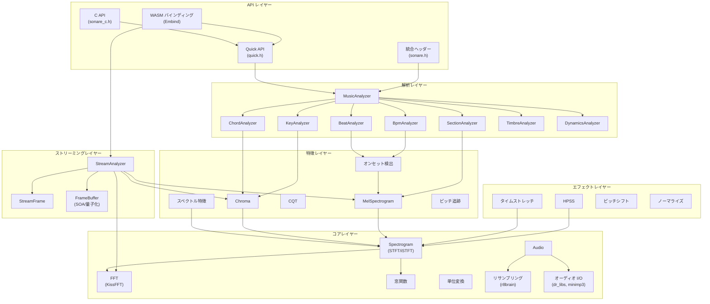
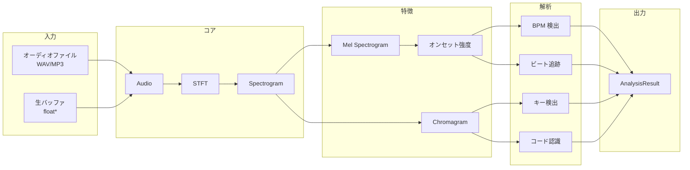
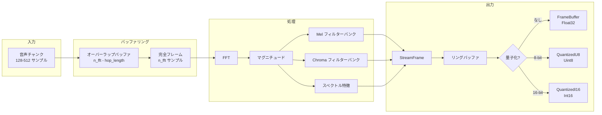

# アーキテクチャ

libsonare の内部アーキテクチャについて説明します。

## モジュール概要



## ディレクトリ構造

```
src/
├── util/               # レベル 0: 基本ユーティリティ
│   ├── types.h         # MatrixView, ErrorCode, 列挙型
│   ├── exception.h     # SonareException
│   └── math_utils.h    # mean, variance, argmax 等
│
├── core/               # レベル 1-3: コア DSP
│   ├── convert.h       # Hz/Mel/MIDI 変換
│   ├── window.h        # Hann, Hamming, Blackman
│   ├── fft.h           # KissFFT ラッパー
│   ├── spectrum.h      # STFT/iSTFT
│   ├── audio.h         # オーディオバッファ
│   ├── audio_io.h      # WAV/MP3 読み込み
│   └── resample.h      # r8brain リサンプリング
│
├── filters/            # レベル 4: フィルターバンク
│   ├── mel.h           # Mel フィルターバンク
│   ├── chroma.h        # Chroma フィルターバンク
│   ├── dct.h           # MFCC 用 DCT
│   └── iir.h           # IIR フィルター
│
├── feature/            # レベル 4: 特徴抽出
│   ├── mel_spectrogram.h
│   ├── chroma.h
│   ├── spectral.h
│   ├── onset.h
│   └── pitch.h
│
├── effects/            # レベル 5: オーディオエフェクト
│   ├── hpss.h
│   ├── time_stretch.h
│   ├── pitch_shift.h
│   └── normalize.h
│
├── analysis/           # レベル 6: 音楽解析
│   ├── music_analyzer.h
│   ├── bpm_analyzer.h
│   ├── key_analyzer.h
│   ├── beat_analyzer.h
│   ├── chord_analyzer.h
│   ├── section_analyzer.h
│   └── ...
│
├── streaming/          # レベル 6: リアルタイムストリーミング
│   ├── stream_analyzer.h   # メインストリーミングアナライザー
│   ├── stream_config.h     # 設定オプション
│   └── stream_frame.h      # フレームとバッファ型
│
├── quick.h             # シンプル関数 API
├── sonare.h            # 統合インクルードヘッダー
├── sonare_c.h          # C API ヘッダー
└── wasm/
    └── bindings.cpp    # Embind バインディング
```

## データフロー

### オーディオ解析パイプライン



### ストリーミングパイプライン

ストリーミングパイプラインは、チャンク間のオーバーラップ状態を維持しながらリアルタイムで音声を処理します。



::: info プログレッシブ推定
ストリーミングパイプラインは、プログレッシブ BPM/キー推定のためにクロマとオンセットデータを蓄積します。推定は定期的に更新され（デフォルト: BPM は 10 秒ごと、キーは 5 秒ごと）、時間とともに信頼度が向上します。
:::

## 主要な設計判断

### 遅延初期化

MusicAnalyzer は個別のアナライザーを遅延初期化します:

```cpp
// BPM のみ計算
float bpm = analyzer.bpm();

// キー検出はクロマ計算をトリガー
Key key = analyzer.key();

// 完全解析はすべてを計算
AnalysisResult result = analyzer.analyze();
```

### ゼロコピースライシング

Audio は `shared_ptr` とオフセット/サイズでゼロコピースライシングを実現:

```cpp
auto full = Audio::from_file("song.mp3");

// 両方とも同じバッファを共有
auto intro = full.slice(0, 30);     // 0-30 秒
auto chorus = full.slice(60, 90);   // 60-90 秒
```

### WASM 互換性

コアモジュールは以下を避けます:
- ファイル I/O（Audio I/O レイヤーで処理）
- スレッド（シングルスレッド実行）
- 動的ローディング
- システム固有 API

### librosa 互換性

デフォルトパラメータは librosa と一致:

| パラメータ | デフォルト |
|-----------|---------|
| sample_rate | 22050 |
| n_fft | 2048 |
| hop_length | 512 |
| n_mels | 128 |
| fmin | 0 |
| fmax | sr/2 |

## サードパーティライブラリ

| ライブラリ | 用途 | ライセンス |
|---------|---------|---------|
| KissFFT | FFT | BSD-3-Clause |
| Eigen3 | 行列演算 | MPL-2.0 |
| dr_libs | WAV デコード | Public Domain |
| minimp3 | MP3 デコード | CC0-1.0 |
| r8brain | リサンプリング | MIT |

## WASM コンパイル

```
出力: ~228KB WASM + ~34KB JS
ビルド: Emscripten + Embind
フラグ: -sWASM=1 -sMODULARIZE=1 -sEXPORT_ES6=1
```
