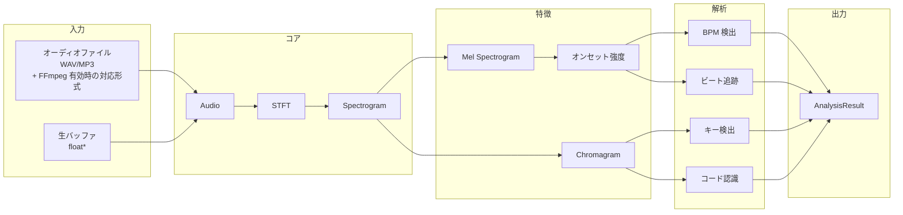
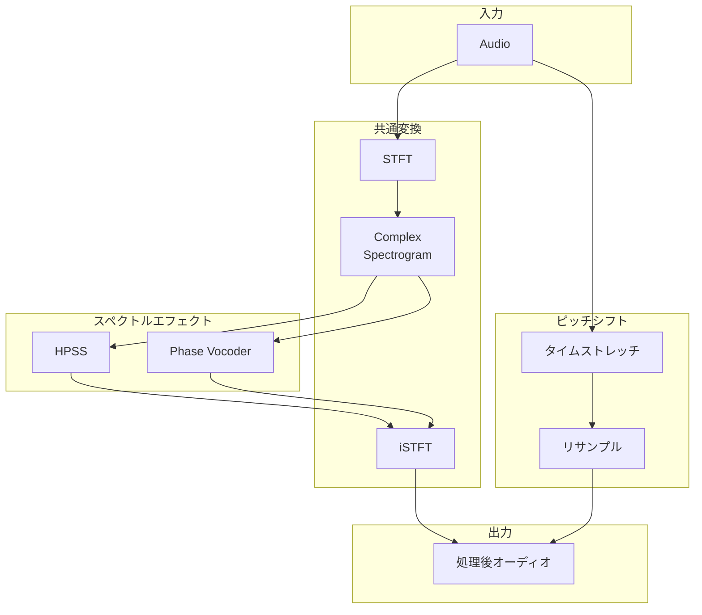
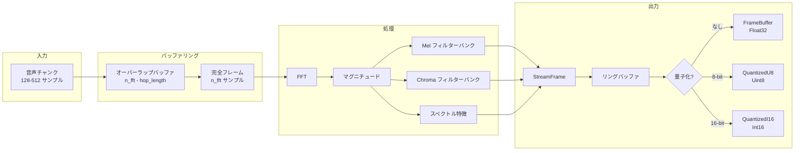

# アーキテクチャ

libsonare の内部アーキテクチャについて説明します。

このページは、目的別ガイドと実行環境別 API を読んだ後に開く内部地図です。公開 API が C++ コアのどこにつながるかを理解したいコントリビューターや組み込み利用者向けです。

::: info レイヤー図の読み方
外側の API レイヤーはアプリが呼ぶ入口です。コアレイヤーと特徴レイヤーは、再利用される信号処理の実体です。バインディングはできるだけ薄く保ち、各言語の形を同じ C++ の挙動へ橋渡しする役割に留めます。
:::

## このページで身につくこと

このページを読むと、次のことを判断・追跡できるようになります。

- WASM、C、quick API、`sonare.h` からの公開呼び出しが、解析、ストリーミング、エフェクト、マスタリング、ミキシング、エンジンの各モジュールへどう流れるかを追える。
- 各サブシステムを所有するソースディレクトリを特定できる。
- 共有 DSP、特徴抽出、リアルタイム処理、言語バインディングがどこで接続するかを理解できる。
- 変更をコアモジュール、バインディングラッパー、デモコンポーネント、ドキュメントのどこに入れるべきか判断できる。

## モジュール概要


```mermaid
graph TB
    subgraph "API レイヤー"
        WASM["WASM バインディング<br/>(Embind)"]
        CAPI["C API<br/>(sonare_c*.h)"]
        QUICK["Quick API<br/>(quick.h)"]
        UNIFIED["統合ヘッダー<br/>(sonare.h)"]
    end

    subgraph "ストリーミングレイヤー"
        STREAM["StreamAnalyzer"]
        FRAME["StreamFrame"]
        BUFFER["FrameBuffer<br/>(SOA/量子化)"]
    end

    subgraph "解析レイヤー"
        MUSIC["MusicAnalyzer"]
        BPM["BpmAnalyzer"]
        KEY["KeyAnalyzer"]
        BEAT["BeatAnalyzer"]
        CHORD["ChordAnalyzer"]
        SECTION["SectionAnalyzer"]
        BOUNDARY["BoundaryDetector"]
        TIMBRE["TimbreAnalyzer"]
        DYNAMICS["DynamicsAnalyzer"]
        RHYTHM["RhythmAnalyzer"]
        MELODY["MelodyAnalyzer"]
        ACOUSTIC["AcousticAnalyzer"]
        ROOMEST["RoomEstimator"]
    end

    subgraph "エフェクトレイヤー"
        HPSS["HPSS"]
        TIMESTRETCH["タイムストレッチ"]
        PITCHSHIFT["ピッチシフト"]
        NORMALIZE["ノーマライズ"]
        SILENCE["無音トリム／分割"]
        PREEMPH["プリ／ディエンファシス"]
        DECOMPOSE["分解<br/>(NMF)"]
        REVERB["リバーブ<br/>(convolution/plate/FDN/<br/>velvet/room)"]
        CREATIVE["クリエイティブ FX<br/>(delay/chorus/flanger/phaser)"]
        ROOMMORPH["Room Morph"]
        VOICE["ボイス変換<br/>・ピッチ編集"]
    end

    subgraph "マスタリング＆ミキシングレイヤー"
        MASTERCHAIN["MasteringChain<br/>(eq/dynamics/spectral/<br/>stereo/maximizer/loudness)"]
        STREAMMASTER["StreamingMasteringChain"]
        STREAMEQ["StreamingEqualizer"]
        MIXER["Mixer<br/>(チャンネルストリップ/バス/センド)"]
        ENGINE["RealtimeEngine<br/>(トランスポート/クリップ/オートメーション)"]
        METER["メータリング<br/>(LUFS/トゥルーピーク/ゴニオメーター)"]
    end

    subgraph "特徴レイヤー"
        MEL["MelSpectrogram"]
        CHROMA["Chroma"]
        CQT["CQT"]
        VQT["VQT"]
        SPECTRAL["スペクトル特徴"]
        ONSET["オンセット検出"]
        PITCH["ピッチ追跡"]
        INVERSE["逆変換特徴量<br/>(Mel/MFCC reconstruction)"]
    end

    subgraph "コアレイヤー"
        AUDIO["Audio"]
        SPECTRUM["Spectrogram<br/>(STFT/iSTFT)"]
        FFT["FFT<br/>(KissFFT)"]
        WINDOW["窓関数"]
        CONVERT["単位変換"]
        RESAMPLE["リサンプリング<br/>(r8brain)"]
        AUDIO_IO["オーディオ I/O<br/>(dr_libs, minimp3)"]
    end

    subgraph "音響シミュレーションレイヤー"
        ROOMMODEL["Room Model<br/>(shoebox/materials)"]
        RIR["RIR Synthesizer<br/>(image source + late tail)"]
        MATERIAL["Material Presets"]
    end

    WASM --> QUICK
    WASM --> STREAM
    WASM --> CAPI
    CAPI --> QUICK
    CAPI --> STREAM
    CAPI --> MASTERCHAIN
    CAPI --> MIXER
    CAPI --> ENGINE
    UNIFIED --> MUSIC
    QUICK --> MUSIC

    STREAM --> FRAME
    STREAM --> BUFFER
    STREAM --> FFT
    STREAM --> MEL
    STREAM --> CHROMA

    MUSIC --> BPM
    MUSIC --> KEY
    MUSIC --> BEAT
    MUSIC --> CHORD
    MUSIC --> SECTION
    MUSIC --> BOUNDARY
    MUSIC --> TIMBRE
    MUSIC --> DYNAMICS
    MUSIC --> RHYTHM
    MUSIC --> MELODY
    QUICK --> ACOUSTIC
    QUICK --> ROOMEST

    BPM --> ONSET
    KEY --> CHROMA
    BEAT --> ONSET
    CHORD --> CHROMA
    SECTION --> MEL
    BOUNDARY --> MEL
    MELODY --> PITCH
    ACOUSTIC --> SPECTRUM
    ROOMEST --> ACOUSTIC
    ROOMEST --> RIR

    HPSS --> SPECTRUM
    TIMESTRETCH --> SPECTRUM
    PITCHSHIFT --> TIMESTRETCH
    PITCHSHIFT --> RESAMPLE
    REVERB --> RIR
    ROOMMORPH --> RIR
    VOICE --> TIMESTRETCH

    WASM --> MASTERCHAIN
    WASM --> STREAMMASTER
    WASM --> STREAMEQ
    WASM --> MIXER
    WASM --> ENGINE
    MASTERCHAIN --> SPECTRUM
    MIXER --> METER
    ENGINE --> MIXER

    MEL --> SPECTRUM
    CHROMA --> SPECTRUM
    CQT --> FFT
    VQT --> CQT
    SPECTRAL --> SPECTRUM
    ONSET --> MEL
    INVERSE --> MEL
    INVERSE --> SPECTRUM

    SPECTRUM --> FFT
    SPECTRUM --> WINDOW
    AUDIO --> AUDIO_IO
    AUDIO --> RESAMPLE
    RIR --> ROOMMODEL
    ROOMMODEL --> MATERIAL
```

## ページ対応表

| 見ている領域 | 読むページ |
|--------------|------------|
| `analysis/` と `feature/` | [JavaScript API](./js-api.md)、[Python API](./python-api.md)、[librosa 互換性](./librosa-compatibility.md) |
| `analysis/acoustic_analyzer.*`、`analysis/room_estimator.*`、`src/acoustic/`、`effects/acoustic/` | [ルーム音響解析](./acoustic-analysis.md)、[アルゴリズム根拠](./algorithm-references.md#スコープの境界) |
| `streaming/` | [リアルタイムとストリーミング](./realtime-streaming.md) |
| `mastering/` | [マスタリングプロセッサ](./mastering-processors.md)、[DSP 実装解説](./dsp-implementation.md)、[マスタリングアシスタント](./mastering-assistant.md) |
| `mixing/` | [ミキシングエンジン](./mixing.md)、[ミキシングシーン JSON](./mixing-scene-json.md) |
| `engine/`, `transport/`, `automation/`, `graph/`, `rt/` | [リアルタイムとストリーミング](./realtime-streaming.md)、特に `RealtimeEngine` |
| `editing/` と `effects/` | [編集 DSP](./editing-dsp.md)、[DSP 実装解説](./dsp-implementation.md#エフェクトと編集-dsp) |
| `sonare_c*.h` と binding フォルダ | [バインディング対応表](./binding-parity.md)、[ネイティブバインディング](./native-bindings.md)、[C++ API](./cpp-api.md) |

## ディレクトリ構造

```
src/
├── util/               # レベル 0: 基本ユーティリティ
│   ├── types.h         # MatrixView, ErrorCode, 列挙型
│   ├── exception.h     # SonareException
│   └── math_utils.h    # mean, variance, argmax 等
│
├── core/               # レベル 1-3: コア DSP
│   ├── convert.h       # Hz/Mel/MIDI 変換
│   ├── window.h        # Hann, Hamming, Blackman
│   ├── fft.h           # KissFFT ラッパー
│   ├── spectrum.h      # STFT/iSTFT
│   ├── audio.h         # オーディオバッファ
│   ├── audio_io.h      # WAV/MP3 読み込み、任意で FFmpeg 対応形式
│   └── resample.h      # r8brain リサンプリング
│
├── filters/            # レベル 4: フィルターバンク
│   ├── mel.h           # Mel フィルターバンク
│   ├── chroma.h        # Chroma フィルターバンク
│   ├── dct.h           # MFCC 用 DCT
│   └── iir.h           # IIR フィルター
│
├── feature/            # レベル 4: 特徴抽出
│   ├── mel_spectrogram.h
│   ├── chroma.h
│   ├── cqt.h
│   ├── vqt.h
│   ├── inverse.h
│   ├── spectral.h
│   ├── onset.h
│   └── pitch.h
│
├── effects/            # レベル 5: オーディオエフェクト
│   ├── hpss.h
│   ├── phase_vocoder.h
│   ├── time_stretch.h
│   ├── pitch_shift.h
│   ├── normalize.h
│   ├── preemphasis.h
│   ├── silence.h
│   ├── decompose.h
│   ├── remix.h
│   ├── delay/ modulation/ reverb/
│   ├── acoustic/       # room_morph
│   └── common/
│
├── acoustic/           # 幾何ベースのルーム音響
│   ├── room_model.* room_types.* material.*
│   ├── image_source.*  # 初期反射
│   ├── late_reverb.*   # 決定的な後期テール
│   └── rir_synthesizer.*
│
├── analysis/           # レベル 6: 音楽解析
│   ├── music_analyzer.h
│   ├── bpm_analyzer.h
│   ├── key_analyzer.h
│   ├── beat_analyzer.h
│   ├── downbeat_analyzer.h
│   ├── meter_analyzer.h
│   ├── chord_analyzer.h
│   ├── section_analyzer.h
│   ├── boundary_detector.h
│   ├── melody_analyzer.h
│   ├── rhythm_analyzer.h
│   ├── timbre_analyzer.h
│   ├── dynamics_analyzer.h
│   ├── acoustic_analyzer.h
│   ├── room_estimator.h
│   └── ...
│
├── streaming/          # レベル 6: リアルタイムストリーミング
│   ├── stream_analyzer.h   # メインストリーミングアナライザー
│   ├── stream_config.h     # 設定オプション
│   └── stream_frame.h      # フレームとバッファ型
│
├── mastering/          # マスタリングエンジン
│   ├── api/            # チェーン・レジストリ・25 プリセット・57 solo processors ＋ pair/stereo registries
│   ├── eq/ dynamics/ spectral/ stereo/ final/
│   ├── maximizer/ multiband/ saturation/ repair/
│   ├── match/ assistant/                 # リファレンスマッチ＋アシスタント/プロファイル
│   └── common/        # 共有 biquad/ラウドネスヘルパー
│
├── mixing/             # ミキシングエンジン
│   ├── channel_strip.* # ストリップ: トリム/インサート/パン/幅/センド
│   ├── bus.* sends.* vca_group.* panner.*
│   └── api/            # シーン JSON ＋シーンプリセット
│
├── engine/             # リアルタイムエンジン（トランスポート/クリップ/グラフ）
├── automation/         # オートメーションレーン＋カーブ形状
├── metering/           # LUFS・トゥルーピーク・位相スコープ/ゴニオメーター
├── graph/  rt/  transport/   # DSP グラフ・RT セーフ基盤・トランスポート
├── editing/            # ピッチエディター・ボイスチェンジャー・ノートストレッチ
│
├── quick.h             # シンプル関数 API
├── sonare.h            # 統合インクルードヘッダー
├── sonare_c*.h         # C API 集約・モジュール別ヘッダー
└── wasm/
    └── bindings.cpp    # Embind バインディング
```

## データフロー

### オーディオ解析パイプライン


```mermaid
flowchart LR
    subgraph 入力
        FILE[オーディオファイル<br/>WAV/MP3<br/>+ FFmpeg 有効時の対応形式]
        BUFFER[生バッファ<br/>float*]
    end

    subgraph コア
        AUDIO[Audio]
        STFT[STFT]
        SPEC[Spectrogram]
    end

    subgraph 特徴
        MEL[Mel Spectrogram]
        CHROMA[Chromagram]
        ONSET[オンセット強度]
    end

    subgraph 解析
        BPM[BPM 検出]
        KEY[キー検出]
        BEAT[ビート追跡]
        CHORD[コード認識]
    end

    subgraph 出力
        RESULT[AnalysisResult]
    end

    FILE --> AUDIO
    BUFFER --> AUDIO
    AUDIO --> STFT
    STFT --> SPEC
    SPEC --> MEL
    SPEC --> CHROMA
    MEL --> ONSET
    ONSET --> BPM
    ONSET --> BEAT
    CHROMA --> KEY
    CHROMA --> CHORD
    BPM --> RESULT
    KEY --> RESULT
    BEAT --> RESULT
    CHORD --> RESULT
```

### オーディオエフェクトパイプライン


```mermaid
flowchart TB
    subgraph 入力
        AUDIO[Audio]
    end

    subgraph 共通変換
        STFT[STFT]
        SPEC[Complex<br/>Spectrogram]
        ISTFT[iSTFT]
    end

    subgraph スペクトルエフェクト
        HPSS[HPSS]
        PV[Phase Vocoder]
    end

    subgraph ピッチシフト
        TS[タイムストレッチ]
        RESAMPLE[リサンプル]
    end

    subgraph 出力
        OUT[処理後オーディオ]
    end

    AUDIO --> STFT
    STFT --> SPEC
    SPEC --> HPSS
    SPEC --> PV
    HPSS --> ISTFT
    PV --> ISTFT
    AUDIO --> TS
    TS --> RESAMPLE
    ISTFT --> OUT
    RESAMPLE --> OUT
```

::: details フェーズボコーダーとは？
フェーズボコーダーは、目立ったアーティファクトを抑えながら音声をタイムストレッチする標準的な手法です。リサンプリングと組み合わせれば、ピッチシフトにも使えます。

まず STFT を取り、再構成の前に各周波数ビンの*位相を新しい時間軸に合わせて進めます*。これにより、ピッチやスペクトルの質感を保ったまま音を長く・短くできます。

libsonare は `timeStretch` / `pitchShift` や、編集 DSP のボイス系ツールでこの方法を使っています。
:::

### ストリーミングパイプライン

ストリーミングパイプラインは、チャンク間のオーバーラップ状態を維持しながらリアルタイムで音声を処理します。


```mermaid
flowchart LR
    subgraph 入力
        CHUNK[音声チャンク<br/>128-512 サンプル]
    end

    subgraph バッファリング
        OVERLAP[オーバーラップバッファ<br/>n_fft - hop_length]
        FRAME[完全フレーム<br/>n_fft サンプル]
    end

    subgraph 処理
        FFT[FFT]
        MAG[マグニチュード]
        MEL[Mel フィルターバンク]
        CHROMA[Chroma フィルターバンク]
        SPECTRAL[スペクトル特徴]
    end

    subgraph 出力
        STREAMFRAME[StreamFrame]
        RING[リングバッファ]
        QUANT{量子化?}
        SOA[FrameBuffer<br/>Float32]
        U8[QuantizedU8<br/>Uint8]
        I16[QuantizedI16<br/>Int16]
    end

    CHUNK --> OVERLAP
    OVERLAP --> FRAME
    FRAME --> FFT
    FFT --> MAG
    MAG --> MEL
    MAG --> CHROMA
    MAG --> SPECTRAL
    MEL --> STREAMFRAME
    CHROMA --> STREAMFRAME
    SPECTRAL --> STREAMFRAME
    STREAMFRAME --> RING
    RING --> QUANT
    QUANT -->|なし| SOA
    QUANT -->|8-bit| U8
    QUANT -->|16-bit| I16
```

::: info プログレッシブ推定
ストリーミングパイプラインは、プログレッシブ BPM/キー推定のためにクロマとオンセットデータを蓄積します。推定は定期的に更新され（デフォルト: BPM は 10 秒ごと、キーは 5 秒ごと）、時間とともに信頼度が向上します。
:::

## 主要な設計判断

### 遅延初期化

MusicAnalyzer は個別のアナライザーを遅延初期化します。必要になったタイミングで初めて中間特徴量（STFT、クロマ、オンセットなど）を計算し、その後の問い合わせでは結果を再利用します。

```cpp
// BPM のみ計算（オンセット包絡線まで）
float bpm = analyzer.bpm();

// キー検出はクロマ計算をトリガー
Key key = analyzer.key();

// 完全解析は残りすべてを計算
AnalysisResult result = analyzer.analyze();
```

::: tip 何が嬉しいか
キーだけ欲しい呼び出しでコード認識やセクション検出まで計算しないので、無駄な処理が発生しません。逆に `analyze()` を 1 回呼ぶと、すでに計算済みの中間結果がそのまま使われます。
:::

### ゼロコピースライシング

Audio は `shared_ptr` とオフセット/サイズでゼロコピースライシングを実現:

```cpp
auto full = Audio::from_file("song.mp3");

// 両方とも同じバッファを共有
auto intro = full.slice(0, 30);     // 0-30 秒
auto chorus = full.slice(60, 90);   // 60-90 秒
```

### WASM 互換性

npm / WebAssembly パッケージはサンプルベースの API を公開しています。デコード済みのモノラル `Float32Array` サンプルを受け取り、ファイルデコード機能は同梱しません。ブラウザアプリでは、通常 Web Audio API や別の JavaScript デコーダでファイルをデコードしてから libsonare に渡します。

WASM ビルドでは、ネイティブのファイル I/O や FFmpeg ベースのデコードは使いません。将来ブラウザスレッドを明示的に有効化したビルドを用意しない限り、実行はシングルスレッドです。

### librosa 互換性

多くの DSP パラメータは librosa で一般的な値に寄せていますが、libsonare は librosa の完全なドロップイン置き換えではありません。特に libsonare は通常、呼び出し側がサンプルレートを渡します。`librosa.load()` のように標準で 22050 Hz へ暗黙にリサンプルするわけではありません。

| パラメータ | デフォルト |
|-----------|---------|
| sample_rate | ユーザー指定 |
| n_fft | 2048 |
| hop_length | 512 |
| n_mels | 128 |
| fmin | 0 |
| fmax | sr/2 |

## サードパーティライブラリ

| ライブラリ | 用途 | ライセンス |
|---------|---------|---------|
| KissFFT | FFT | BSD-3-Clause |
| Eigen3 | 行列演算 | MPL-2.0 |
| dr_libs | WAV デコード | Public Domain |
| minimp3 | MP3 デコード | CC0-1.0 |
| FFmpeg | 任意の拡張ファイルデコード | リンクするビルドにより LGPL/GPL |
| r8brain | リサンプリング | MIT |

## WASM コンパイル

```
出力: WASM 単体 ~{{ wasmMeta.wasm.sizeKB }} KB（gzip ~{{ wasmMeta.wasm.gzipKB }} KB）＋ JS グルー。
      合計 ~{{ wasmMeta.total.sizeKB }} KB（gzip ~{{ wasmMeta.total.gzipKB }} KB）— src/wasm/meta.json を参照
ビルド: Emscripten + Embind
フラグ: -sWASM=1 -sMODULARIZE=1 -sEXPORT_ES6=1
```

バンドルサイズはマスタリング＋ミキシング＋解析の全機能を含むためで、解析のみのビルドはより小さくなります。
