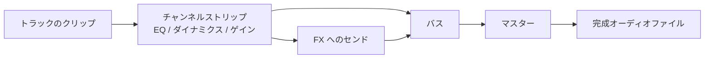

# バウンスとレンダリング

クリップを並べ、テイクをコンプし、ループをグリッドへワープしました。最後の工程は、その生きたアレンジを、共有できる 1 つの完成オーディオファイルに変えることです。この工程を **バウンス**（または **レンダリング**）と呼びます。

::: info ひとことで言うと
**バウンス / レンダリング** = アレンジ全体を、オフラインかつ決定的に、完成オーディオバッファへと計算すること。
:::

## オフラインで決定的

バウンスは **オフライン** です。リアルタイムで動く必要はありません。軽いプロジェクトではリアルタイムより速く、重いプロジェクトでは遅く動くこともあります。目標は時計に追いつくことではなく、正しさです。

オフラインであるがゆえに **決定的** でもあります。同じプロジェクト・同じオプション・同じ楽器なら、常にサンプル単位で同じオーディオを生みます。ライブのタイミングのゆらぎも、バッファのドロップもありません。ファイナルマスターをスピーカー録りではなくオフライン経路でバウンスするのは、まさにこのためです。

::: tip バウンスは「出力を録音する」ことではない
バウンスは編集モデルからアレンジを再構築し、クリーンにレンダリングします。プロジェクトのライブ演奏をキャプチャしているのではなく、*計算* しているので、再現可能でアーティファクトがありません。
:::

## ミックスはミキサーシーンを通してレンダリングされる

初心者がよくする思い込みは、バウンスは全トラックを足し合わせるだけ、というものです。違います。アレンジは **ミキサーシーンを通して** レンダリングされるため、完成ファイルにはミックス全体が反映されます。

つまり各トラックは自分の **チャンネルストリップ**（EQ、ダイナミクス、ゲイン、パン）を通り、**センド** が共有エフェクトへ送られ、すべてが **バス** を経てマスターへ集まります — ミックスするときとまったく同じです。バウンスはクリップの素の合算ではなく、ミックスそのものです。チャンネルストリップに何が載るかは [ミキシング](../../mixing.md) を参照してください。

## MIDI トラックはバウンス時に楽器を必要とする

[クリップとトラック](./clips-and-tracks.md) で見たとおり、MIDI トラックは音ではなくノートを持ちます。そのためバウンス時には、そのノートを *どの楽器* が演奏するかを指定しなければなりません。libsonare はいくつかの入口を用意しています。

| やりたいこと | 使うもの |
|-------------|---------|
| パッチ駆動のフルシンセ | **NativeSynth** 楽器でバウンス |
| General MIDI の SoundFont | **SoundFont** 楽器でバウンス |
| 手軽な内蔵オシレーター | 内蔵楽器でバウンス |
| 自前の外部楽器（Python） | ホスト提供の楽器でバウンス |

楽器をバインド *せずに* バウンスすると、MIDI トラックは無音でレンダリングされます — ノートはあるのに、演奏する者がいません。オーディオトラックは常に音をレンダリングします。シンセ側は [NativeSynth](../../native-synth.md) を参照してください。

## 長さは自動導出される（指定しない限り）

バウンスの長さは通常、指定する必要がありません。長さを省略すると、**タイムラインから自動導出** され — レンダラーが最後のクリップの末尾を探します — それに **リリーステール**、つまりノートが終わった後に鳴り切ってフェードするのに必要な余韻ぶんが足されます。これにより、最後のリバーブや長いシンセのリリースが減衰の途中で切れるのを防ぎます。特定の長さを強制したいときだけ、明示的に長さを指定します。

## レイテンシー補正（PDC）

一部の楽器やエフェクトは **レイテンシー** を生みます。出力する前に数サンプルの先読みが必要で、音がわずかに遅れて出てきます。何も補正しなければ、遅延のある楽器がミックスの後ろへずれていきます。

その対策が **レイテンシー補正**、別名 **PDC**（plugin delay compensation）です。その楽器が何サンプルのレイテンシーを足すかをバウンスに伝えると、アレンジをサンプルへ変換する工程（*コンパイル* 工程）がタイムラインをずらし、その楽器を他のすべてと再び合わせます。結果として、完璧にタイミングが保たれます。

::: warning 数値を実際のレイテンシーに合わせる
PDC は、与えたレイテンシー値が楽器の実際の値と一致して初めて機能します。小さすぎれば依然として遅れ、大きすぎれば先走ります。迷ったら推測ではなく、楽器が報告するレイテンシーを問い合わせてください。
:::

::: details libsonare での実装
バウンスは `Project` クラスから駆動します。素の `bounce(options?)` はオーディオトラックをレンダリングし、MIDI トラックは無音のままです。MIDI を可聴にするには楽器をバインドします。`bounceWithSynthInstrument`（パッチ駆動の NativeSynth。`SynthPatch`、プリセット名、またはその配列を受け取る）、`bounceWithSf2Instrument`（`loadSoundFont` で読み込んだ SoundFont を使う GS 互換の SoundFont プレーヤー）、`bounceWithBuiltinInstrument`（シンプルなオシレーターシンセ）があり、Python では `bounce_with_instruments` で自前の外部楽器をホストできます。`ProjectBounceOptions` で `totalFrames` を省略（または `<= 0`）すると、レンダリング長はアレンジと楽器のリリーステールから自動導出されます。すべてのバウンスはクリップの合算ではなく、ミキサーシーン — トラックごとのチャンネルストリップ・センド・バス — を通してレンダリングされます。レイテンシー補正はバウンスオプションの `instrumentLatencySamples` で与え、これがコンパイラに渡されて遅延のある楽器がタイミングを保ちます。レンダリング全体は、固定のプロジェクト + オプション + 楽器に対して決定的です。
:::

関連: [Project Bounce](../../project-bounce.md)、[NativeSynth](../../native-synth.md)、[ワープとテンポ同期](./warp-and-tempo.md)
