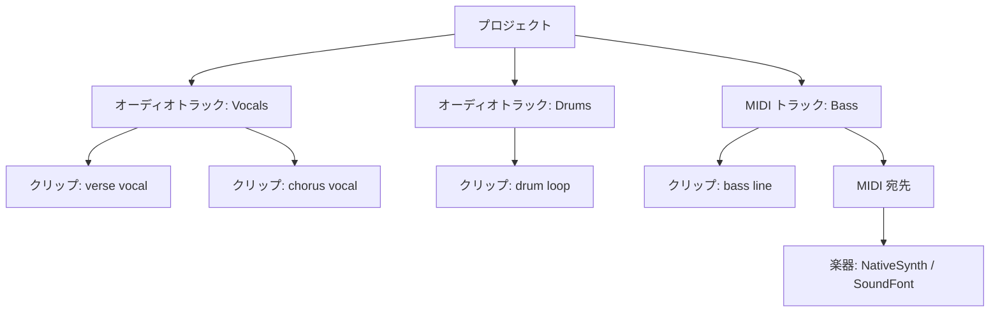

# クリップとトラック

DAW で曲をアレンジするとき、実際にやっているのは小さくて見通しのよい構造を埋めていく作業です。その構造を一度理解してしまえば、あらゆるアレンジ機能が腑に落ちます。このページでは [Project Editing](../../project-editing.md) ガイドを読む前に、libsonare が使う **プロジェクトモデル** を平易な言葉で説明します。

::: info ひとことで言うと
**プロジェクト** が **トラック** を持ち、各トラックが **クリップ** を持ち、すべてのクリップは小節と拍で測る共通の **タイムライン** 上に並びます。
:::

## プロジェクトモデルを上から下へ

**プロジェクト** は曲全体です。ほかのすべてが入る容れ物であり、保存・読み込みし、最後に [バウンス](./takes-and-comping.md) して完成ファイルにする対象でもあります。

プロジェクトの中には **トラック** があります。トラックはコンテンツの 1 本のレーン — アレンジビューの横 1 行だと考えてください。各トラックは次の 2 種類のいずれかです。

- **オーディオトラック** は録音または読み込んだ音そのものを保持します（ボーカルのテイク、ギター、ドラムループなど）。
- **MIDI トラック** は音ではなく *ノート* を保持します。ノートは「いま C4 を鳴らし、1 拍伸ばす」といった指示であり、楽器が音に変換して初めて聞こえるようになります。

各トラックの中には **クリップ** があります。クリップはタイムライン上の特定の位置に置かれた、コンテンツの 1 ブロックです。オーディオクリップはある音声素材を指し、MIDI クリップはノートイベントのリストを持ちます。1 本のトラックに、隙間を空けたり並べたりしながら、いくつものクリップを置けます。

<SonareDemo id="engine-lane-mixer" />

## 秒ではなく音楽的な時間で

多くの初心者がつまずくのがここです。クリップの位置は秒ではなく **音楽的な時間** で記録されます。

クリップは「4.27 秒の位置」から始まるのではありません。「3 小節目の 1 拍目」から始まります。その下にある単位は **4 分音符** で、位置と長さは浮動小数点数で表します。`1.0` がちょうど 4 分音符 1 個ぶんです。たとえば 4/4 の 1 小節は 4 分音符 4 個ぶんなので `4.0`、8 分音符 1 個は `0.5`、付点 4 分音符は `1.5` です。整数のティックや 960 ベースの分解能ではありません。パラメータ名に `Ppq`（`startPpq`、`lengthPpq` など）が付いていても同様です。設定するクリップの開始位置や長さは、すべてこの 4 分音符単位（浮動小数点数）で、`lengthPpq: 4` は 4 分音符 4 個ぶんの長さです。

::: tip 音楽的な時間が大切な理由
位置が音楽的に記録されているため、テンポを変えてもアレンジは正しいまま保たれます。120 BPM から 100 BPM に変えれば「3 小節目の 1 拍目」は秒で見れば後ろにずれますが、それでも 3 小節目の 1 拍目です。ノートがグリッドから外れて流れていくことはありません。音楽的な時間から実際のサンプル位置への変換は、後でプロジェクトをコンパイル・レンダリングするときに行われます。テンポとグリッドの関係は [ワープとテンポ同期](./warp-and-tempo.md) を参照してください。
:::

## MIDI トラックが音になるまで

オーディオトラックは自己完結しています。すでに音を持っているので、そのまま再生されます。MIDI トラックは違います。クリップはノートイベントしか持たないため、そのノートを *演奏* する何かが必要です。

その何かに届けるのが、トラックの **MIDI 宛先** です。宛先は番号の付いたルーティング枠です。**NativeSynth** や **SoundFont** プレーヤーといった楽器を宛先にバインドし、トラックをそこへルーティングすると、トラックのノートがその楽器へ送られ、実際の音声が合成されます。

| 手順 | やること | 結果 |
|------|---------|------|
| 1 | MIDI トラックとクリップを追加 | ノートはあるが無音のレーン |
| 2 | クリップにノートイベントを入れる | 演奏内容が書き込まれる |
| 3 | トラックを宛先へルーティング | ノートに行き先ができる |
| 4 | その宛先に楽器をバインド | レンダリング時にノートが音になる |

この分離は強力です。同じ MIDI クリップを、宛先の楽器を入れ替えるだけで、今日はシンセ、明日はサンプル楽器で鳴らせます。

手順 2「演奏内容が書き込まれる」は、そのまま楽譜です。クリップのノートイベントは標準的な記譜法そのもの。下はあるクリップを 1 つ記譜して演奏したもので、楽器を切り替えれば同じ音符が別の音色で鳴ります。

<SonareDemo id="midi-score" />

## クリップとトラックに対してできること

構造ができてしまえば、アレンジ作業の大半は少数の操作です。

**クリップ操作** — 日常的な動かし方:

- クリップを新しい位置へ **移動** する（必要なら別のトラックへ）。
- **ゲインを設定** して、隣のクリップより大きく / 小さくする。
- **フェードイン / フェードアウト** で、クリックノイズなく滑らかに出入りさせる。
- **ループ** させて、短いブロックを長い区間に繰り返す。
- **複製** して、パートを別の場所へコピーする。
- **ソースの差し替え** で、別の素材を指すようにする。
- 不要になったクリップを **削除** する。

**トラック操作** — レーンそのものの管理: トラックの追加・削除・改名、ルーティング（ミキサーストリップや出力へのバインド、MIDI 宛先の設定）、そしてオーディオと MIDI の種別の変更です。

::: warning クリップはコピーではなく参照
複数のクリップが *同じ* 素材を指すことがあります。クリップを複製しても、多くの場合は音声を丸ごと複製するのではなくソースを共有するため、プロジェクトは小さく保たれますが、一方のクリップのソース差し替えがもう一方と独立になることを意味します。パートをコピーして回すときは覚えておいてください。
:::

::: details libsonare での実装
このモデルは編集エンジンの `Project` クラスにあります。`addTrack` がトラック（audio または midi）を作り、`addMidiClip(startPpq, lengthPpq)` は新しい MIDI トラック + クリップに対して `{ trackId, clipId }` を返します。`addClip` は既存トラックへオーディオ / MIDI クリップを追加します。すべての位置は 4 分音符単位（浮動小数点数、`1.0` = 4 分音符 1 個）なので、`moveClip(clipId, newStartPpq, newTrackId?)`、`setClipGain(clipId, gain)`、`setClipFade(clipId, fadeIn, fadeOut)`、`setClipLoop`、`duplicateClip`、`setClipSource`、`removeClip` はすべて音楽的な時間で動きます。トラックのライフサイクルは `removeTrack`、`renameTrack`、`setTrackKind`、`setTrackRoute` です。MIDI トラックは `setTrackMidiDestination(trackId, destinationId)` で楽器へつながります。コンパイラが各 MIDI クリップにその id を刻印するため、エンジンはその宛先にバインドされた楽器へイベントを送ります。プロジェクト全体は `toJson()` / `Project.fromJson(json)` で JSON を往復し、音楽的な時間は `compile()` / `bounce()` のときに初めてサンプルへ変換されます。
:::

関連: [Project Editing](../../project-editing.md)、[テイクとコンピング](./takes-and-comping.md)、[ミキシングの基礎](../concepts/mixing-basics.md)
