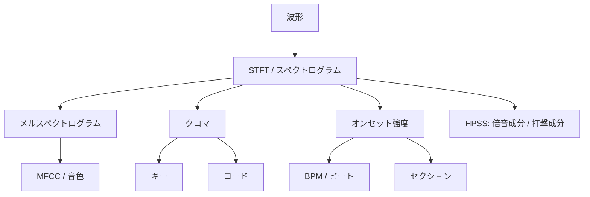

# MIR の全体像

MIR は **Music Information Retrieval**（音楽情報検索）の略で、音を*音楽的な*答えに変える音声解析の領域です。たとえば、テンポ、ビート位置、キー、コード、ピッチ、音色、構造を扱います。

このページは地図です。ドキュメント全体で出会う用語をまとめ、それらがどう積み上がっているかを示すので、どの機能をどこで呼べばよいかが分かります。

ここで挙げる用語をまとめるのには理由があります。これらは単独の機能名ではなく、ほぼすべての MIR タスクが同じ**時間-周波数の土台**の上に立っています。その共通の土台を一度理解すれば、個々の機能は無関係な長いリストには見えなくなります。

::: tip 初めてなら、リファレンスではなく見取り図として読む
このページは*各要素がどう関係するか*を説明します。呼び出しシグネチャは [JavaScript API](../../js-api.md#特徴抽出) や [Python API](../../python-api.md#特徴抽出) を、*どう計算されるか*は [DSP 実装解説](../../dsp-implementation.md) を参照してください。
:::

## 共通のパイプライン

MIR 機能の多くは、少数の中間表現から導かれます。これらを手で組むことはほぼなく — libsonare が内部で計算します — が、流れを見ると、なぜ多くの機能が `nFft` や `hopLength` のようなパラメータを共有するのかが分かります。

これらの中間表現が共有されているため、同じ素材に対して BPM・キー・コード・セクションを連続で取り出しても、重い計算は**繰り返されません** — STFT などは一度だけ計算され再利用されます。

## どの問いに、どの機能か

| 答えたいこと | 使うもの | 土台 |
|--------------|----------|------|
| どのくらい速い? ビートはどこ? | BPM / ビートトラッキング | オンセット強度 |
| 何のキー? | キー検出 | クロマ |
| 何のコードが鳴っている? | コード認識 | クロマ |
| サビはどこから始まる? | セクション解析 | リズム＋ハーモニー＋音色 |
| メロディの音は? | ピッチ / メロディ追跡 | (V)QT、自己相関 |
| どんな*音色*に聞こえる? | MFCC | メルスペクトログラム |
| ドラムを他から分離できる? | HPSS | スペクトログラムの構造 |
| 時間ごとの生の周波数成分は? | STFT / スペクトログラム | 波形 |
| 録音空間はどんな響きか? | ルーム音響解析 | インパルスレスポンス減衰、またはブラインド自由減衰推定 |

## タイミング: BPM、ビート、オンセット、セクション

タイミング系の機能は、段階的に積み上がっています。

| 機能 | 答える問い |
|------|------------|
| **オンセット検出** | ノート、ドラム、子音などがどこで*始まる*か。オンセット強度包絡のスパイクです。 |
| **BPM** | オンセットがどれくらい周期的か。 |
| **ビートトラッキング** | タイムライン上の拍がどこにあるか。 |
| **セクション解析** | イントロ、A メロ、サビ、ブレイクのような長めのスパンがどこで始まり終わるか。 |

::: info オンセットがリズム系の起点
BPM、ビート、テンポグラムはすべて同じオンセット強度包絡から始まります。BPM 推定の背後にある時間 × テンポの図が欲しい場合は、[リアルタイムとストリーミング](../../realtime-streaming.md#オンセット包絡からテンポグラムへ) のテンポグラム系を参照してください。
:::

## ハーモニー: キー、コード、クロマ

**クロマ**は周波数成分を 12 のピッチクラス（C・C♯・…・B）に畳み込み、同じ音のすべてのオクターブをまとめます。これがハーモニーの自然な土台になります — **キー検出**は全体のクロマ分布から調性中心を推定し、**コード認識**はフレームごとにその瞬間のハーモニーを推定します。

::: warning クロマはオクターブと音色の細部を捨ててハーモニーの明瞭さを得る
オクターブをまとめることこそが、クロマをキー／コード解析に向いたものにし — そして同時に、オクターブやスペクトル形状が重要なメロディや音色には不向きにします。表現は問いに合わせて選んでください。
:::

## スペクトル: FFT、STFT、スペクトログラム

**FFT** は DFT（離散フーリエ変換）の高速実装で、サンプルブロックを周波数成分に変換します。**STFT** はそれを短く重なり合うウィンドウで繰り返し、周波数成分を*時間方向*にも追えるようにします。**スペクトログラム**はその可視化です — 横軸が時間、縦軸が周波数、明るさが強度。

どこでも繰り返し出てくるパラメータが 2 つあります。

- `nFft` はウィンドウサイズです。大きいほど周波数分解能は細かくなりますが、時間はぼやけます。
- `hopLength` はウィンドウ間のステップです。小さいほどフレームが増え、動きが滑らかになります。

周波数分解能と時間分解能のトレードオフは、libsonare 固有の癖ではなく本質的なものです。

## 知覚特徴量: メル、MFCC、CQT、VQT

**メルスペクトログラム**は、周波数分解能を人間の聴覚に合わせてひずませます。低域は細かく、高域は粗く扱います。

**MFCC** は log-mel パワースペクトルの DCT です。スペクトル包絡を近似する無相関な係数、つまりコンパクトな「音色の指紋」を生みます。

**CQT** と **VQT** は、*音楽的に*等間隔なビン（半音ごと）を使います。Hz 等間隔より、ピッチ関係そのものが重要な場面で活きます。

これらの変換は、プレビューやデバッグのために逆向きにも実行できます — [逆変換特徴量](../../inverse-features.md) を参照してください。

## 分離とピッチ: HPSS とピッチ推定

**HPSS** は Harmonic/Percussive Source Separation、つまり倍音成分と打撃成分の分離です。スペクトログラム上の形の違いを使って、持続的なピッチ素材と過渡的な打撃を分けます。

| 成分 | スペクトログラム上の形 |
|------|------------------------|
| 倍音成分 | 主に**水平**の線 |
| 打撃成分 | 主に**垂直**の線 |

先に分離しておくと、ドラムとピッチ楽器が互いの解析を乱しにくくなり、下流タスクの精度が上がることが多いです。

**ピッチ推定**は基本周波数を追跡します — メロディ、ボーカル、単音楽器、チューニング確認、採譜系のワークフローで使えます。

## 隣接領域: ルーム音響

ルーム音響解析は MIR に隣接する領域です。音符、リズム、楽曲構成ではなく、録音に含まれる空間の性質を記述します。

拍手、風船破裂音、スターターピストル音、スイープ由来 IR などの短い励振音から、クリーンなインパルスレスポンスが得られる場合があります。その場合は、RT60、EDT、C50、C80、D50、バンド別減衰を IR 解析で測定します。

通常録音しかない場合は、ブラインド音響推定を使います。結果は、残響時間の手がかりと信頼度として扱ってください。詳しくは [ルーム音響解析](../../acoustic-analysis.md) を参照してください。

:::: details 実装メモ

libsonare はブラウザ（WASM）、JavaScript、Python、ネイティブバインディング、CLI、C++ API のいずれからも MIR 関連機能を呼び出せます。

多くの機能は STFT、クロマ、スペクトルエネルギー曲線といった中間表現を共有します。そのため、同じ素材に対して BPM、キー、コード、セクションを連続で取り出しても、内部の重い計算は一度で済むよう設計されています。

ブラウザデモは対話的な利用を前提にしています。ただし、それぞれが見せている役割は少し違います。

| デモ | 主な役割 |
|------|----------|
| [楽曲分析スタジオ](/ja/music-analysis) | ファイル全体の MIR。BPM、キー、コード、セクションなどをまとめて解析します。 |
| リアルタイム系の表示 | `StreamAnalyzer` 経由で、BPM／キー／コードを逐次的に推定します。 |
| [マスタリングスタジオ](/ja/mastering) | ラウドネス計測、リファレンス比較、レポート出力など、計測寄りの API を扱います。 |

同じライブラリの上に役割の違うデモを載せることで、解析と仕上げの両方で何を再利用できるかを示しています。

::::

関連: [イントロダクション](../../introduction.md), [オーディオ基礎](./audio-basics.md), [JavaScript API](../../js-api.md#特徴抽出), [ルーム音響解析](../../acoustic-analysis.md), [DSP 実装解説](../../dsp-implementation.md), [librosa 互換性](../../librosa-compatibility.md)
