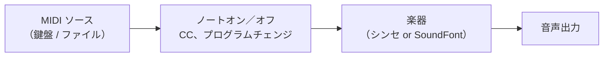

# MIDI の基礎

**MIDI**（Musical Instrument Digital Interface）は、音そのものではなく*演奏*を記述するための言語です。MIDI メッセージは「いまノート 60 をやや強めに鳴らせ」「ノート 60 を離せ」と伝えるだけで、音声は一切運びません。下流にある何か（シンセサイザー、[SoundFont プレーヤー](./soundfont.md)、あるいはハードウェア）がその指示を読み、音を*生成*します。

<SonareDemo id="synth-note" />

この分離は強力です。同じ MIDI 演奏を、行き先の楽器を差し替えるだけでピアノ音・ギター音・オーケストラとして再生できます。本ページでは、MIDI を読み書きするのに必要な語彙を説明します。概念のみで、コードはありません。

::: info 音声ではなく演奏
MIDI ファイルは波形ではなく指示を保存するため、サイズはキロバイト単位と非常に小さくなります。代償として、どの楽器でレンダリングするかで音が変わります。音声ファイルは常に同じに鳴りますが、無料で音色を差し替えたり移調したりはできません。
:::

## ノート: ノートオン・ノートオフ・番号・ベロシティ

中心となる 2 つのメッセージは、**ノートオン**（鍵が押された）と**ノートオフ**（鍵が離された）です。それぞれが次を運びます。

- **ノート番号** 0〜127。1 ステップが半音です。**中央ハ（ミドル C） = 60**、A4（440 Hz の基準音） = 69。1 オクターブ上げるには 12 を足します。
- **ベロシティ** 0〜127 — 鍵をどれだけ*強く*叩いたか。楽器は通常ベロシティを音量と明るさに割り当てるので、高いベロシティほど大きく押し出しの強い音になります（慣習として、ベロシティ 0 のノートオンはノートオフとして扱われます）。

## チャンネル

1 本の MIDI ストリームは **16 のチャンネル**に分かれます。1 本のケーブルを共有する 16 人の奏者のようなものです。各チャンネルは独自の楽器を持てるので、チャンネル 1 がピアノ、チャンネル 2 がベース、といった具合です。慣習上 1 つのチャンネルが特別で、General MIDI（後述）では**チャンネル 10 がドラムチャンネル**となり、各ノート番号がピッチではなく異なる打楽器音を鳴らします。

## コントロールチェンジ（CC）

::: info CC
**コントロールチェンジ**メッセージは、番号付きのつまみ（0〜127）を、ある値（0〜127）に回します。表現・ペダル・連続コントローラーを送る仕組みです。
:::

代表的なコントローラー:

| CC | 名称 | 役割 |
|----|------|------|
| **CC1** | モッドホイール | 汎用のモジュレーション（多くはビブラートの深さ） |
| **CC11** | エクスプレッション | メイン音量に加えてフレーズ*内*で抑揚を付ける |
| **CC64** | サステインペダル | 0〜63 = 離す、64〜127 = 踏む。鍵を離した後もノートを保持 |

## 音色を選ぶ: プログラムチェンジとバンクセレクト

**プログラムチェンジ**メッセージは、チャンネルが*どの*楽器を鳴らすかを、プログラム番号 0〜127 で選びます。128 音色では足りないことが多いため、**バンクセレクト**でアドレスを広げます。**CC0** がバンク MSB、**CC32** がバンク LSB で、プログラムチェンジの直前に送って、128 プログラムからなる別のバンクを選びます。

::: info GM（General MIDI）
**General MIDI** は、各プログラム番号の意味を固定する標準です。プログラム 0 は必ずアコースティックグランドピアノ、24 はナイロン弦ギター、という具合に 128 楽器のマップ全体を定め、さらにチャンネル 10 に標準のドラムマップを置きます。GM があるおかげで、ある機器で作った MIDI ファイルが、別の機器でも*正しい種類*の楽器で鳴ります。
:::

## ピッチベンド・RPN・NRPN

**ピッチベンド**は独自の高分解能メッセージ（CC ではありません）で、ノートのピッチを連続的に上下へスライドさせます — ギターのチョーキング、ビブラート、アームの効果などに使います。最大ベンドがどこまで届くかは別に設定します。

::: info RPN / NRPN
**RPN（Registered Parameter Number）**は、CC メッセージ経由でアドレス指定する標準化された設定です。**RPN 0** は**ピッチベンドレンジ** — フルベンドが何半音をカバーするかです。**NRPN（Non-Registered Parameter Number）**は同じ仕組みを、標準外の*機器固有*パラメーターに使います。
:::

## MIDI ファイルと MIDI 2.0

::: info UMP
**MIDI 2.0** はプロトコルの現代的な改訂版です。**UMP（Universal MIDI Packet）**形式を用い、はるかに高い分解能（16 ビットのベロシティ、より細かいコントローラー）と双方向通信を加えつつ、上記の MIDI 1.0 の考え方との互換性を保ちます。
:::

**SMF（Standard MIDI File、拡張子 `.mid`）**は演奏全体 — すべてのノートオン／オフ、CC、プログラムチェンジを、そのタイミングごと — を保存するため、保存・共有し、任意の楽器で再生できます。

## 全体像

::: details libsonare での実装
libsonare のリアルタイムエンジンは、ノートを `pushMidiNoteOn(destinationId, group, channel, note, velocity)` と `pushMidiNoteOff(...)` で、コントロールチェンジを `pushMidiCc(destinationId, group, channel, controller, value)` で受け取ります — `destinationId` はどの読み込み済み楽器がイベントを受けるかを選び、`channel` は 0〜15 の MIDI チャンネルです。ブラウザでは Web MIDI ブリッジ（`bindWebMidi`）が、物理 MIDI 鍵盤のイベントをそれらのエンジン入力へ直接つなぎ、ハードウェアコントローラーで NativeSynth や読み込んだ SoundFont をライブ演奏できます。同じノート／CC の語彙が、ライブエンジンとオフラインのアレンジメントバウンスの両方を駆動します。
:::

関連: [MIDI 入力](../../midi-input.md)、[SoundFont とサンプル音源](./soundfont.md)、[編集の基礎](../concepts/editing-basics.md)
