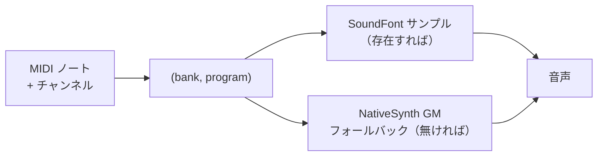

# SoundFont とサンプル音源

**サンプル音源**は、[シンセサイザー](./synthesis-basics.md) とは正反対の方法で音を作ります。波形を生成するのではなく、実在の楽器の短い*録音*を再生します。ピアノを複数の音・複数の強さで録音し、それらのクリップを保存しておき、キーが押されたら最も近いものを適切なピッチで再生する — それがサンプリングの要点です。結果は非常にリアルになり得ます。それは*実際の録音*だからです。

本ページでは、SoundFont とは何か、どうアドレス指定されるか、そして libsonare が MIDI のアレンジメントから必ず音を出すことをどう保証するかを説明します。概念のみで、コードはありません。

::: info サンプルと合成
**合成**（シンセ）音源は音を計算で作り、任意のピッチ・音色になりますが、設計が必要です。**サンプル**音源は録音を再生し、本物そっくりに鳴りますが、録音された範囲に固定され、保存容量も格段に大きくなります。多くの環境では両方を併用します — リアルな楽器にはサンプル、アコースティックには存在しない音にはシンセ、という具合です。
:::

## SoundFont とは

**SoundFont**（`.sf2` ファイル形式）は、録音された楽器サンプルのライブラリ全体を、再生のルール（どのサンプルがどの鍵域を担当するか、ループの扱い、基本的なエンベロープ）とともに 1 つにまとめたファイルです。1 つの `.sf2` で、General MIDI の楽器セット全体を数メガバイトに収められます。

ファイル内では、音は**バンク**と**プログラム**に整理され、個々の楽器は `(bank, program)` の組でアドレス指定されます。

- **プログラム**は 1 つの演奏可能な楽器です — 「アコースティックグランドピアノ」「フィンガーベース」など。
- **バンク**は最大 128 プログラムを並べた番号付きの棚です。バンク 0 がメインのセット、より上のバンクがバリエーションを保持します。

これはまさに [MIDI](./midi-basics.md) がプログラムチェンジとバンクセレクトで使うアドレス方式であり、だからこそ MIDI と SoundFont は自然に噛み合います。

## General MIDI のプログラム番号とドラムバンク

SoundFont は `(bank, program)` でアドレス指定されるため、**General MIDI** 準拠の `.sf2` はそのプログラムを GM マップに揃えます。プログラム 0 がアコースティックグランドピアノ、24 がナイロン弦ギター、40 がバイオリン、という具合に 128 の GM 楽器すべてにわたります。打楽器は別の**ドラムバンク**に置かれ、各*ノート番号*がピッチではなく異なるドラムやシンバルを選びます — MIDI のチャンネル 10 ドラム慣習と一致します。

## libsonare がノートを解決する仕組み

libsonare は SoundFont を読み込んで MIDI を鳴らせますが、ここに 1 つ重要な保証を加えています。`.sf2` ファイルを与えると、すべての MIDI プログラムがバックエンドへ解決されます。

| 状況 | バックエンド | 聞こえる音 |
|------|------------|------------|
| 読み込んだ SoundFont が `(bank, program)` をカバーする | `'sf2'` | 録音された SF2 サンプル |
| プログラムが欠けている、または SoundFont 未読み込み | `'synth'` | NativeSynth の General MIDI **フォールバック**バンク |

重要な帰結は、**MIDI が決して無音にならない**ことです。SoundFont にある音が欠けていても — あるいは一切読み込んでいなくても — libsonare はそのプログラムに対して内蔵の NativeSynth GM バンクへフォールバックし、ノートを落としません。アレンジメント中のすべてのプログラムに、必ず使える楽器が割り当てられます。

::: tip フォールバックが重要な理由
SoundFont ごとにカバーする楽器は異なり、小さな `.sf2` ではわずかなプログラムしか含まないこともあります。フォールバックがあるおかげで、どんなアレンジメントとどんな SoundFont（あるいは無し）を渡しても曲全体を聞けます。あとからより充実した SoundFont に差し替えれば、MIDI を変えずに音をアップグレードできます。
:::

何がどこに解決されたかは正確に確認できます。プログラムごとのレポートが、アレンジメントが鳴らす各 `(channel, bank, program)` について、`'sf2'` と `'synth'` のどちらのバックエンドになったか、どのプリセット名に一致したかを教えてくれます。

::: details libsonare での実装
`Project` 上で `loadSoundFont(bytes)` がバイトバッファから `.sf2` ファイルを登録します。続いて `soundFontManifest()` が、アレンジメントの使う `(channel, bank, program)` の組ごとに 1 件の `Sf2ProgramStatus` を返し、各エントリは `'sf2'` か `'synth'` の `backend` と、解決された `presetName` を持ちます — どのプログラムが SoundFont でカバーされ、どれが NativeSynth GM バンクへフォールバックしたかが一目で分かります（ドラムチャンネルはバンク `128` を報告します）。`bounceWithSf2Instrument(...)` は SoundFont プレーヤーを通じてアレンジメントをレンダリングし、ノートごとに同じ GM フォールバックを適用するため、カバーされていないプログラムでも出力が無音になりません。フォールバックバンクはデータ不要の最終手段で、SoundFont を一切読み込んでいなくても、すべてのプログラムが NativeSynth のボイスへ解決されます。
:::

関連: [SoundFont プレーヤー](../../soundfont-player.md)、[内蔵シンセサイザー（NativeSynth）](../../native-synth.md)、[MIDI の基礎](./midi-basics.md)
