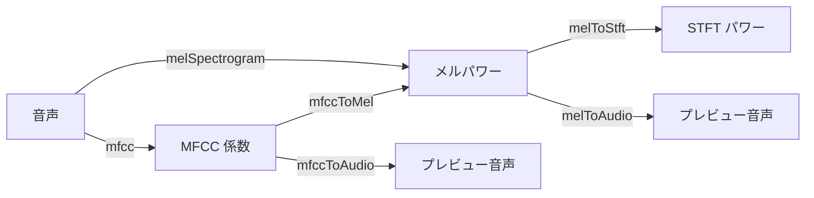

# 逆変換特徴量

libsonare の大半は、音声を特徴量へ変換します。たとえばメルスペクトログラム、MFCC、クロマグラムなどです。

**逆変換**ヘルパーは、その逆向きです。特徴量から*近似的な*スペクトルやプレビュー音声を再構成します。

これらのヘルパーは、特徴量パイプラインのデバッグ、モデルが「聴いている」ものの可聴プレビュー作成、往復テスト、librosa 風ノートブックのネイティブ／ブラウザ移行に使えます。

::: tip 解析が初めてなら、ここから始めない
これらのヘルパーは、すでにメルスペクトログラムや MFCC を生成していることを前提にします。始めたばかりなら、先に [はじめに](./getting-started.md) と [JavaScript API](./js-api.md#特徴抽出) または [Python API](./python-api.md#特徴抽出) の特徴抽出を読み、計算したものを逆変換したくなったら戻ってきてください。
:::

## このページで身につくこと

このページを読むと、次のことを判断・実装できるようになります。

- メル／MFCC の逆変換が近似であり、特徴量だけから位相を復元できない理由を説明できる。
- 正しく往復確認するために必要な `sampleRate`、`nFft`、`hopLength`、`nMels`、`nMfcc` を保持できる。
- 行列が必要かプレビュー音声が必要かに応じて、`melToStft`、`melToAudio`、`mfccToMel`、`mfccToAudio` を選べる。
- JavaScript と Python の戻り値の形を、行数・フレーム数・フラット配列を混同せずに比較できる。

## ここでいう「逆変換」とは

最初に押さえるべき点は、逆変換が「元に戻す」処理ではなく「特徴量から、それらしく聞こえるものを作る」処理だということです。写真でたとえるなら、カラー写真から輪郭だけを抜き出したあと、輪郭を手がかりに元の写真を描き直すようなものです。形は分かっても、細部や色は完全には戻りません。

順変換は**意図的に不可逆**です。捨てられる情報が 2 種類あり、どんな逆変換も取り戻せません。

- **メルフィルタバンクは正方行列ではない。** メルスペクトログラムは（`nFft = 2048` なら）約 1025 本の STFT ビンを、たとえば 128 のメルバンドに畳み込みます。逆変換は各メルバンドのエネルギーを元のビン群へ広げ直しますが、これは最小二乗の最良推定であって元の細部ではありません。
- **位相は完全に失われる。** 振幅／パワースペクトログラムは各周波数に*どれだけ*エネルギーがあるかを保ちますが、波形周期の*どこ*にあるかは保ちません。音声再構成は**もっともらしい位相を作り出す**必要があり、それを担うのが Griffin-Lim です。

MFCC はさらにもう 1 段の損失を加えます — 先頭 `nMfcc` 個（多くは 13〜20）のケプストラム係数だけを残し、細かいスペクトル包絡を捨てます。そのため MFCC の逆変換は、音声を取り戻す前に*平滑化された*メルスペクトログラムを再構成します。

::: warning 再構成は近似であって復元ではない
出力は確認とプレビュー用で、元録音を取り戻すためのものではありません。認識はできるが「位相っぽく」滲んだ結果になります（特に MFCC からの再構成や Griffin-Lim の反復が少ない場合）。本物の音声が必要なら、本物の音声を保持してください。
:::

## 4 つのヘルパー

4 つの関数は、戻したい場所によって選びます。まだ行列のまま確認したいなら `*ToStft` / `*ToMel`、耳で聴けるプレビューが欲しいなら `*ToAudio` を使います。



| 目的 | JavaScript | Python |
|------|------------|--------|
| メルパワー → STFT パワー | `melToStft(...)` は `{ nBins, nFrames, power }` を返す | `mel_to_stft(...)` は `InverseResult(rows, n_frames, data)` を返す |
| メルパワー → 音声 | `melToAudio(...)` は `Float32Array` を返す | `mel_to_audio(...)` は `list[float]` を返す |
| MFCC → メルパワー | `mfccToMel(...)` は `{ nMels, nFrames, power }` を返す | `mfcc_to_mel(...)` は `InverseResult(rows, n_frames, data)` を返す |
| MFCC → 音声 | `mfccToAudio(...)` は `Float32Array` を返す | `mfcc_to_audio(...)` は `list[float]` を返す |

`*ToStft` / `*ToMel` の 2 つは**スペクトル領域**にとどまり、確認や次段への受け渡しに使える結果オブジェクトを返します。`*ToAudio` の 2 つは波形まで戻し、欠けた位相を補うために内部で **Griffin-Lim** を実行します。

## スペクトルを再構成する

`melToStft` はメルフィルタバンクを戻します — メル**パワー**スペクトログラムを線形周波数の STFT **パワー**スペクトログラムへ写します。`mfccToMel` はケプストラム圧縮を戻します — MFCC を（平滑化された）メル**パワー**スペクトログラムへ写します。

ここではまだ音声波形には戻りません。結果は「周波数ごとのエネルギー表」です。機械学習モデルや可視化の途中結果を確認したい場合は、音声化するよりこの段階で見る方が原因を追いやすいことがあります。

::: code-group

```typescript [ブラウザ]
import { init, melSpectrogram, melToStft, mfcc, mfccToMel } from '@libraz/libsonare';

await init();

// メルパワー -> STFT パワー
const mel = melSpectrogram(samples, sampleRate, 2048, 512, 128);
const stft = melToStft(mel.power, mel.nMels, mel.nFrames, sampleRate, 2048, 512);
// stft: { nBins, nFrames, power }   nBins = nFft/2 + 1 = 1025

// MFCC -> メルパワー
const coeffs = mfcc(samples, sampleRate, 2048, 512, 128, 20);
const reMel = mfccToMel(coeffs.coefficients, coeffs.nMfcc, coeffs.nFrames, 128);
// reMel: { nMels, nFrames, power }
```

```python [Python]
import libsonare as sonare

# メルパワー -> STFT パワー
mel = sonare.mel_spectrogram(samples, sample_rate, n_fft=2048, hop_length=512, n_mels=128)
stft = sonare.mel_to_stft(mel.power, mel.n_mels, mel.n_frames, sample_rate=sample_rate, n_fft=2048)
# stft.rows = n_fft/2 + 1 = 1025。stft.data は row-major の [rows x n_frames]

# MFCC -> メルパワー
coeffs = sonare.mfcc(samples, sample_rate, n_fft=2048, hop_length=512, n_mels=128, n_mfcc=20)
re_mel = sonare.mfcc_to_mel(coeffs.coefficients, coeffs.n_mfcc, coeffs.n_frames, n_mels=128)
# re_mel.rows = n_mels。re_mel.data は row-major の [rows x n_frames]
```

```bash [C++ CLI]
# 同じ順変換／逆変換設定で音声プレビューを作るソースビルド C++ CLI 経路:
sonare mel-to-audio song.wav --n-fft 2048 --hop-length 512 --n-mels 128 -o mel-preview.wav
```

:::

入力はいずれも**行優先**の行列です — `melPower` は `[nMels x nFrames]`、MFCC 係数は `[nMfcc x nFrames]`。`nMels`／`nMfcc`／`nFrames` の引数は、その平坦配列の読み方をヘルパーに伝えるので、渡す行列と一致させてください。

## 音声を再構成する

`melToAudio` と `mfccToAudio` は、再生やファイル書き出しができるモノラルの `Float32Array` を返します。特徴量に位相がないため、どちらも **Griffin-Lim** を実行します — 振幅にランダム（またはゼロ）位相を与えて開始し、STFT → 新しい位相を保持 → 既知の振幅を課す → 逆 STFT を繰り返し、位相が自己整合するまで反復します。

聴いたときに、元の曲の輪郭やリズムは分かるが、にじみ・金属的な質感・ざらつきが出ることがあります。これは多くの場合、実装の失敗ではなく、捨てた位相を推定しているために起きる自然な限界です。

::: code-group

```typescript [ブラウザ]
import { init, melSpectrogram, melToAudio, mfcc, mfccToAudio } from '@libraz/libsonare';

await init();

const mel = melSpectrogram(samples, sampleRate, 2048, 512, 128);
const preview = melToAudio(mel.power, mel.nMels, mel.nFrames, sampleRate, 2048, 512, 32);
// nFft=2048, hopLength=512, nIter=32（Griffin-Lim の反復回数）

const coeffs = mfcc(samples, sampleRate, 2048, 512, 128, 20);
const fromMfcc = mfccToAudio(coeffs.coefficients, coeffs.nMfcc, coeffs.nFrames, 128, sampleRate, 2048, 512, 32);
// sampleRate の前に nMels（128）引数が追加される点に注意
```

```python [Python]
import libsonare as sonare

mel = sonare.mel_spectrogram(samples, sample_rate, n_fft=2048, hop_length=512, n_mels=128)
preview = sonare.mel_to_audio(mel.power, mel.n_mels, mel.n_frames, sample_rate=sample_rate, n_iter=32)
# n_iter=32（Griffin-Lim の反復回数）

coeffs = sonare.mfcc(samples, sample_rate, n_fft=2048, hop_length=512, n_mels=128, n_mfcc=20)
from_mfcc = sonare.mfcc_to_audio(coeffs.coefficients, coeffs.n_mfcc, coeffs.n_frames, n_mels=128, sample_rate=sample_rate, n_iter=32)
# sample_rate の前に n_mels（128）引数が入る点に注意
```

```bash [C++ CLI]
# 簡易プレビュー用のソースビルド C++ CLI 対応コマンド:
sonare mel-to-audio song.wav -o mel-preview.wav
sonare mfcc-to-audio song.wav -o mfcc-preview.wav
```

:::

::: details Griffin-Lim はどう欠けた位相を補うか
Griffin-Lim は振幅のみからの反復再構成です。目標の振幅スペクトログラム `|S|` と初期位相 `φ` を与えると:

1. `|S|·e^{iφ}` を逆 STFT して時間領域信号にする。
2. その信号を順 STFT する — 振幅は `|S|` から少しずれるが、**位相**は実波形により整合した値になる。
3. 新しい位相を保持し、振幅を `|S|` に戻して繰り返す。

各パスが、実際の信号が生み出しうる位相へ近づけます。`nIter` はパス数を制御します。反復が多いほど近づき（滑らかでアーティファクトが少ない）線形にコストが増え、少ないほど速いが「位相っぽく」なります。32 が無難な既定値で、高速 UI プレビューでは 8〜16 に、プレビュー品質重視なら 60 以上に上げます。
:::

`nIter` が主な品質／レイテンシのつまみです。それ以外（`nFft`、`hopLength`、`fmin`、`fmax`）は**順変換**と一致させる必要があります（下記参照）。

## 往復の動作確認

よくある用途は、特徴量パイプラインが正しく組めているかの確認です — 特徴量を抽出し、逆変換し、その差を聴く（または測る）。結果は決して同一にはなりませんが、*認識できる*はずです。無音やノイズになるなら、どこかのパラメータか行列の形が誤っています。

::: code-group

```typescript [ブラウザ]
const mel = melSpectrogram(samples, sampleRate, 2048, 512, 128);
const preview = melToAudio(mel.power, mel.nMels, mel.nFrames, sampleRate, 2048, 512, 32);

// 長さは同じ? 包絡は認識できる? 再生するかラウドネスを比較する。
console.log(samples.length, preview.length);
```

```python [Python]
mel = sonare.mel_spectrogram(samples, sample_rate, n_fft=2048, hop_length=512, n_mels=128)
preview = sonare.mel_to_audio(mel.power, mel.n_mels, mel.n_frames, sample_rate=sample_rate, n_iter=32)

# 長さは同じ? 包絡は認識できる? 再生するかラウドネスを比較する。
print(len(samples), len(preview))
```

```bash [C++ CLI]
# 再構成プレビューを聴いてソースと比較する。
sonare mel-to-audio song.wav -o mel-preview.wav
```

:::

::: warning 両側で同じパラメータを使う
逆変換ヘルパーは、順変換で使ったのと**同じ** `sampleRate`、`nFft`、`hopLength`、`nMels`、`fmin`、`fmax` のときだけ意味を持ちます。不一致は「誤っているがもっともらしい」スペクトルを静かに生み、最も気づきにくいバグになります。これらの値を特徴量と一緒に保存し、逆変換呼び出しがずれないようにしてください。`mel_to_stft(...)` は周波数領域にとどまるため `hop_length` は不要ですが、音声を生成するヘルパーでは必要です。
:::

## 関連

- [librosa 互換性](./librosa-compatibility.md) — `librosa.feature.inverse.*` との対応
- [JavaScript API](./js-api.md#特徴抽出) · [Python API](./python-api.md#特徴抽出) — 順変換側
- [DSP 実装解説](./dsp-implementation.md) — メルフィルタバンクと STFT の構築方法
