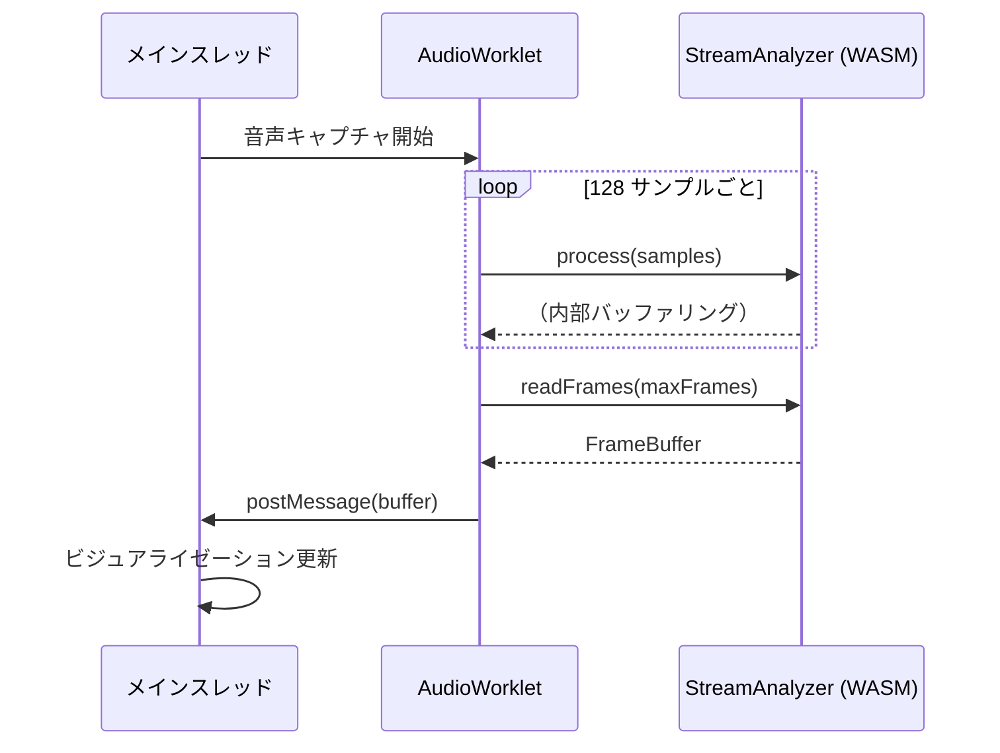

# JavaScript/TypeScript API リファレンス

libsonare JavaScript/TypeScript インターフェースの完全な API リファレンス。

::: warning パッケージ未公開
npm パッケージ `@libraz/sonare` はまだ公開されていません。現時点では、リポジトリから直接 WASM ファイルを使用するか、ソースからビルドしてください。
:::

## 概要

libsonare は Web アプリケーション向けのオーディオ解析機能を提供します：

| カテゴリ | 関数 | ユースケース |
|----------|-----------|-----------|
| **クイック解析** | `detectBpm`, `detectKey`, `detectBeats` | DJアプリ、音楽プレイヤー、ビート同期 |
| **完全解析** | `analyze`, `analyzeWithProgress` | 音楽制作、楽曲メタデータ |
| **オーディオエフェクト** | `hpss`, `timeStretch`, `pitchShift` | リミックス、練習ツール |
| **特徴量** | `melSpectrogram`, `chroma`, `mfcc` | ML入力、可視化 |

::: tip 用語について
オーディオ解析が初めてですか？[用語集](/ja/docs/glossary)で BPM、STFT、Chroma などの用語の説明をご覧ください。
:::

## インストール

```bash
# 未公開 - 近日公開予定
npm install @libraz/sonare
```

## インポート

```typescript
import {
  init,
  detectBpm,
  detectKey,
  detectBeats,
  detectOnsets,
  analyze,
  analyzeWithProgress,
  version
} from '@libraz/sonare';
```

## 初期化

### `init(options?)`

WASM モジュールを初期化します。解析関数を使用する前に呼び出す必要があります。

```typescript
async function init(options?: {
  locateFile?: (path: string, prefix: string) => string;
}): Promise<void>
```

**例:**

```typescript
import { init, detectBpm } from '@libraz/sonare';

// 基本的な初期化
await init();

// カスタムファイルロケーション
await init({
  locateFile: (path, prefix) => `/custom/wasm/path/${path}`
});
```

### `isInitialized()`

モジュールが初期化済みかどうかを確認します。

```typescript
function isInitialized(): boolean
```

### `version()`

ライブラリのバージョンを取得します。

```typescript
function version(): string  // 例: "1.0.0"
```

## 解析関数

### `detectBpm(samples, sampleRate)`

オーディオサンプルから BPM (テンポ) を検出します。

::: info ユースケース
- **DJ ソフトウェア**: トラック間のテンポをマッチングしてシームレスなミキシング
- **音楽プレイヤー**: テンポ情報の表示、テンポ別プレイリストの自動生成
- **フィットネスアプリ**: ワークアウト強度に合わせた音楽選択
- **ビート同期**: ビジュアライゼーションやアニメーションを音楽に同期
:::

```typescript
function detectBpm(samples: Float32Array, sampleRate: number): number
```

| パラメータ | 型 | 説明 |
|-----------|------|-------------|
| `samples` | `Float32Array` | モノラルオーディオサンプル (範囲 -1.0 〜 1.0) |
| `sampleRate` | `number` | サンプルレート (Hz) (例: 44100) |

**戻り値:** 検出された BPM (通常 60-200)、精度 ±2 BPM

```typescript
const bpm = detectBpm(samples, sampleRate);
console.log(`BPM: ${bpm}`);
```

### `detectKey(samples, sampleRate)`

オーディオサンプルから音楽キーを検出します。ルート音（C, D, E...）とモード（メジャー/マイナー）を返します。

::: info ユースケース
- **ハーモニックミキシング**: DJがスムーズなトランジションのためにキーをマッチング（カメロットホイール）
- **移調**: ボーカルレンジに合わせたキー変更の提案
- **音楽レコメンデーション**: 互換性のあるキーの曲を検索
- **練習ツール**: ミュージシャンが一緒に演奏するためのキー表示
:::

```typescript
function detectKey(samples: Float32Array, sampleRate: number): Key
```

**戻り値:** `Key` オブジェクト

```typescript
interface Key {
  root: PitchClass;      // 0-11 (C=0, B=11)
  mode: Mode;            // 0=Major, 1=Minor
  confidence: number;    // 0.0 〜 1.0
  name: string;          // "C major", "A minor"
  shortName: string;     // "C", "Am"
}
```

```typescript
const key = detectKey(samples, sampleRate);
console.log(`キー: ${key.name}`);
console.log(`信頼度: ${(key.confidence * 100).toFixed(1)}%`);
```

### `detectBeats(samples, sampleRate)`

オーディオサンプルからビート時刻を検出します。各ビートの正確なタイムスタンプを返します。

::: info ユースケース
- **音楽ビジュアライゼーション**: 各ビートでエフェクトをトリガー
- **リズムゲーム**: オーディオからノートチャートを生成
- **動画編集**: ビートに合わせた自動カット
- **ループ作成**: 完璧なループポイントを見つける
:::

```typescript
function detectBeats(samples: Float32Array, sampleRate: number): Float32Array
```

**戻り値:** 秒単位のビート時刻の Float32Array

### `detectOnsets(samples, sampleRate)`

オーディオサンプルからオンセット時刻（音の立ち上がり）を検出します。ビートより細かい粒度 - すべての音をキャプチャ。

::: info ユースケース
- **ドラム採譜**: 個々のドラムヒットを検出
- **オーディオからMIDI**: オーディオをノートイベントに変換
- **サンプルスライシング**: トランジェントで自動的にオーディオをセグメント化
:::

```typescript
function detectOnsets(samples: Float32Array, sampleRate: number): Float32Array
```

### `analyze(samples, sampleRate)` <Badge type="warning" text="高負荷" />

完全な音楽解析を実行します。BPM、キー、ビート、コード、セクション、音色などを返します。

::: info ユースケース
- **音楽ライブラリ管理**: 楽曲にメタデータを自動タグ付け
- **音楽制作**: リファレンストラックの解析
- **DJ準備**: すべてのトラック情報を一度に取得
- **音楽教育**: 楽曲構造の学習
:::

::: tip パフォーマンス
これは最も重い API です。長いオーディオファイル（3分以上）の場合は、`analyzeWithProgress` を使用して進捗を表示するか、関連するセグメントのみを解析することを検討してください。
:::

```typescript
function analyze(samples: Float32Array, sampleRate: number): AnalysisResult
```

**戻り値:** BPM、キー、ビート、コード、セクション、音色、ダイナミクス、リズムを含む完全な `AnalysisResult`

```typescript
const result = analyze(samples, sampleRate);
console.log(`BPM: ${result.bpm}`);
console.log(`キー: ${result.key.name}`);
console.log(`コード数: ${result.chords.length}`);
console.log(`楽曲形式: ${result.form}`);
```

### `analyzeWithProgress(samples, sampleRate, onProgress)` <Badge type="warning" text="高負荷" />

進捗レポート付きで完全な音楽解析を実行します。

```typescript
function analyzeWithProgress(
  samples: Float32Array,
  sampleRate: number,
  onProgress: (progress: number, stage: string) => void
): AnalysisResult
```

**進捗ステージ:**

| ステージ | 説明 | 進捗範囲 |
|---------|------|----------|
| `"bpm"` | BPM 検出 | 0.0 - 0.15 |
| `"key"` | キー検出 | 0.15 - 0.25 |
| `"beats"` | ビートトラッキング | 0.25 - 0.45 |
| `"chords"` | コード認識 | 0.45 - 0.65 |
| `"sections"` | セクション検出 | 0.65 - 0.85 |
| `"timbre"` | 音色解析 | 0.85 - 0.95 |
| `"dynamics"` | ダイナミクス解析 | 0.95 - 1.0 |

## オーディオエフェクト

### `hpss(samples, sampleRate, kernelHarmonic?, kernelPercussive?)` <Badge type="warning" text="高負荷" />

Harmonic-Percussive Source Separation（調和-打楽器分離）。オーディオを調性成分（ボーカル、シンセ）と過渡成分（ドラム）に分離。

::: info ユースケース
- **リミックス**: ドラムを分離または削除
- **カラオケ**: ボーカルを除去してインストゥルメンタルを抽出（harmonic使用）
- **より良い解析**: よりクリーンなコード検出のためにharmonicのみを使用
- **ドラム抽出**: サンプリング用にパーカッションのみを取得
:::

::: tip パフォーマンス
HPSS は STFT 計算とメディアンフィルタリングを必要とします。処理時間はオーディオの長さに比例します。
:::

```typescript
function hpss(
  samples: Float32Array,
  sampleRate: number,
  kernelHarmonic?: number,    // デフォルト: 31
  kernelPercussive?: number   // デフォルト: 31
): HpssResult

interface HpssResult {
  harmonic: Float32Array;
  percussive: Float32Array;
  sampleRate: number;
}
```

### `harmonic(samples, sampleRate)` <Badge type="warning" text="高負荷" />

オーディオから調和成分を抽出します。

```typescript
function harmonic(samples: Float32Array, sampleRate: number): Float32Array
```

### `percussive(samples, sampleRate)` <Badge type="warning" text="高負荷" />

オーディオから打楽器成分を抽出します。

```typescript
function percussive(samples: Float32Array, sampleRate: number): Float32Array
```

### `timeStretch(samples, sampleRate, rate)` <Badge type="warning" text="高負荷" />

ピッチを変えずにテンポを変更します。Rate < 1.0 = 遅く、> 1.0 = 速く。

::: info ユースケース
- **練習ツール**: 難しいパッセージを学ぶために音楽をスローダウン
- **DJミキシング**: トラック間のテンポをマッチング
- **ポッドキャスト編集**: スピーチの速度調整
- **音楽制作**: サンプルをプロジェクトのテンポに合わせる
:::

::: tip パフォーマンス
フェーズボコーダーアルゴリズムを使用。処理時間はオーディオの長さに比例します。
:::

```typescript
function timeStretch(
  samples: Float32Array,
  sampleRate: number,
  rate: number   // 0.5 = 半速、2.0 = 倍速
): Float32Array
```

### `pitchShift(samples, sampleRate, semitones)` <Badge type="warning" text="高負荷" />

長さを変えずにピッチを変更します。半音単位で測定（+12 = 1オクターブ上）。

::: info ユースケース
- **キーマッチング**: ミキシング用に曲を移調
- **ボーカルチューニング**: ボーカルピッチの補正や調整
- **クリエイティブエフェクト**: ハーモニー作成、チップマンク/ディープボイスエフェクト
- **楽器練習**: 演奏しやすいキーに移調
:::

::: tip パフォーマンス
タイムストレッチとリサンプリングを組み合わせます。処理時間はオーディオの長さに比例します。
:::

```typescript
function pitchShift(
  samples: Float32Array,
  sampleRate: number,
  semitones: number   // +12 = 1オクターブ上
): Float32Array
```

### `normalize(samples, sampleRate, targetDb?)`

オーディオを目標ピークレベルに正規化します。

```typescript
function normalize(
  samples: Float32Array,
  sampleRate: number,
  targetDb?: number   // デフォルト: 0.0 (フルスケール)
): Float32Array
```

### `trim(samples, sampleRate, thresholdDb?)`

オーディオの始めと終わりから無音を除去します。

```typescript
function trim(
  samples: Float32Array,
  sampleRate: number,
  thresholdDb?: number   // デフォルト: -60.0
): Float32Array
```

## 特徴抽出

### `stft(samples, sampleRate, nFft?, hopLength?)` <Badge type="info" text="中負荷" />

短時間フーリエ変換（STFT）を計算します。

```typescript
function stft(
  samples: Float32Array,
  sampleRate: number,
  nFft?: number,      // デフォルト: 2048
  hopLength?: number  // デフォルト: 512
): StftResult

interface StftResult {
  nBins: number;
  nFrames: number;
  nFft: number;
  hopLength: number;
  sampleRate: number;
  magnitude: Float32Array;
  power: Float32Array;
}
```

### `stftDb(samples, sampleRate, nFft?, hopLength?)` <Badge type="info" text="中負荷" />

STFT を計算し、dB スケールで返します。

```typescript
function stftDb(
  samples: Float32Array,
  sampleRate: number,
  nFft?: number,      // デフォルト: 2048
  hopLength?: number  // デフォルト: 512
): { nBins: number; nFrames: number; db: Float32Array }
```

### `melSpectrogram(samples, sampleRate, nFft?, hopLength?, nMels?)` <Badge type="info" text="中負荷" />

メルスペクトログラムを計算します。人間のピッチ知覚に合わせた周波数表現。

::: info ユースケース
- **機械学習**: ジャンル分類、ムード検出の入力
- **可視化**: オーディオプレイヤー用の周波数スペクトログラム作成
- **類似度検索**: スペクトル内容で曲を比較
- **音声解析**: スピーチパターンと特性の解析
:::

```typescript
function melSpectrogram(
  samples: Float32Array,
  sampleRate: number,
  nFft?: number,      // デフォルト: 2048
  hopLength?: number, // デフォルト: 512
  nMels?: number      // デフォルト: 128
): MelSpectrogramResult

interface MelSpectrogramResult {
  nMels: number;
  nFrames: number;
  sampleRate: number;
  hopLength: number;
  power: Float32Array;
  db: Float32Array;
}
```

### `mfcc(samples, sampleRate, nFft?, hopLength?, nMels?, nMfcc?)` <Badge type="info" text="中負荷" />

MFCC（メル周波数ケプストラム係数）を計算します。スペクトル包絡のコンパクトな表現。

::: info ユースケース
- **音声認識**: 音声テキスト変換システムの標準入力
- **話者識別**: 誰が話しているかを識別
- **音色解析**: 楽器/音声の質を特徴付け
- **オーディオフィンガープリンティング**: コンパクトな楽曲署名の作成
:::

```typescript
function mfcc(
  samples: Float32Array,
  sampleRate: number,
  nFft?: number,      // デフォルト: 2048
  hopLength?: number, // デフォルト: 512
  nMels?: number,     // デフォルト: 128
  nMfcc?: number      // デフォルト: 13
): MfccResult

interface MfccResult {
  nMfcc: number;
  nFrames: number;
  coefficients: Float32Array;
}
```

### `chroma(samples, sampleRate, nFft?, hopLength?)` <Badge type="info" text="中負荷" />

クロマグラム（ピッチクラス分布）を計算します。すべての周波数を12のピッチクラス（C, C#, D, ..., B）にマッピング。

::: info ユースケース
- **コード検出**: 演奏されているコードを識別
- **キー検出**: ピッチ分布から曲のキーを決定
- **カバー曲検出**: テンポ/キーに関係なく曲をマッチング
- **音楽類似度**: トラック間のハーモニック内容を比較
:::

```typescript
function chroma(
  samples: Float32Array,
  sampleRate: number,
  nFft?: number,      // デフォルト: 2048
  hopLength?: number  // デフォルト: 512
): ChromaResult

interface ChromaResult {
  nChroma: number;        // 12
  nFrames: number;
  sampleRate: number;
  hopLength: number;
  features: Float32Array;
  meanEnergy: number[];   // [12] ピッチクラスごと
}
```

### スペクトル特徴

```typescript
// スペクトル重心 (Hz)
function spectralCentroid(samples, sampleRate, nFft?, hopLength?): Float32Array

// スペクトル帯域幅 (Hz)
function spectralBandwidth(samples, sampleRate, nFft?, hopLength?): Float32Array

// スペクトルロールオフ (Hz)
function spectralRolloff(samples, sampleRate, nFft?, hopLength?, rollPercent?): Float32Array

// スペクトル平坦度 (0=調性的, 1=ノイズ的)
function spectralFlatness(samples, sampleRate, nFft?, hopLength?): Float32Array

// ゼロ交差率
function zeroCrossingRate(samples, sampleRate, frameLength?, hopLength?): Float32Array

// RMSエネルギー
function rmsEnergy(samples, sampleRate, frameLength?, hopLength?): Float32Array
```

### ピッチ検出 <Badge type="info" text="中負荷" />

```typescript
// YIN アルゴリズム
function pitchYin(
  samples: Float32Array,
  sampleRate: number,
  frameLength?: number,  // デフォルト: 2048
  hopLength?: number,    // デフォルト: 512
  fmin?: number,         // デフォルト: 65 Hz
  fmax?: number,         // デフォルト: 2093 Hz
  threshold?: number     // デフォルト: 0.3
): PitchResult

// pYIN アルゴリズム（確率的 YIN + HMM 平滑化）
function pitchPyin(
  samples: Float32Array,
  sampleRate: number,
  frameLength?: number,
  hopLength?: number,
  fmin?: number,
  fmax?: number,
  threshold?: number
): PitchResult

interface PitchResult {
  f0: Float32Array;
  voicedProb: Float32Array;
  voicedFlag: boolean[];
  nFrames: number;
  medianF0: number;
  meanF0: number;
}
```

## 単位変換

これらの関数は軽量で高速です。

```typescript
// Hz <-> Mel (Slaney 式)
function hzToMel(hz: number): number
function melToHz(mel: number): number

// Hz <-> MIDI ノート番号 (A4 = 440 Hz = 69)
function hzToMidi(hz: number): number
function midiToHz(midi: number): number

// Hz <-> ノート名
function hzToNote(hz: number): string      // "A4", "C#5"
function noteToHz(note: string): number

// 時間 <-> フレーム
function framesToTime(frames: number, sr: number, hopLength: number): number
function timeToFrames(time: number, sr: number, hopLength: number): number
```

## リサンプリング

### `resample(samples, srcSr, targetSr)` <Badge type="info" text="中負荷" />

r8brain アルゴリズムを使用した高品質リサンプリング。

```typescript
function resample(
  samples: Float32Array,
  srcSr: number,
  targetSr: number
): Float32Array
```

## ストリーミング API

ストリーミング API は、リアルタイムの音声解析とビジュアライゼーションを可能にします。バッチ解析とは異なり、ストリーミングは音声をチャンクごとに処理し、低レイテンシを実現します。

::: tip 使い分け
- **バッチ API**: 録音済みファイル、完全解析（BPM、キー、コード、セクション）
- **ストリーミング API**: ライブ音声、ビジュアライゼーション、リアルタイムフィードバック
:::

### StreamConfig

StreamAnalyzer の設定オプション。

```typescript
interface StreamConfig {
  sampleRate: number;          // 例: 44100
  nFft?: number;               // デフォルト: 2048
  hopLength?: number;          // デフォルト: 512
  nMels?: number;              // デフォルト: 128
  computeMel?: boolean;        // デフォルト: true
  computeChroma?: boolean;     // デフォルト: true
  computeOnset?: boolean;      // デフォルト: true
  emitEveryNFrames?: number;   // デフォルト: 1（スロットリングなし）
}
```

### StreamAnalyzer クラス

```typescript
class StreamAnalyzer {
  constructor(config: StreamConfig);

  // 音声チャンクを処理（内部オフセット追跡）
  process(samples: Float32Array): void;

  // 外部同期で処理
  processWithOffset(samples: Float32Array, sampleOffset: number): void;

  // 読み取り可能なフレーム数
  availableFrames(): number;

  // 処理済みフレームを読み取り
  readFrames(maxFrames: number): FrameBuffer;

  // 新しいストリーム用に状態をリセット
  reset(baseSampleOffset?: number): void;

  // 統計情報とプログレッシブ推定を取得
  stats(): AnalyzerStats;

  // 処理済みの総フレーム数
  frameCount(): number;

  // 現在の時間位置（秒）
  currentTime(): number;

  // リソースを解放（使用終了時に呼び出し）
  dispose(): void;
}
```

### FrameBuffer

`postMessage` での効率的な転送用の Structure-of-Arrays 形式。

```typescript
interface FrameBuffer {
  nFrames: number;
  timestamps: Float32Array;      // [nFrames]
  mel: Float32Array;             // [nFrames * nMels]
  chroma: Float32Array;          // [nFrames * 12]
  onsetStrength: Float32Array;   // [nFrames]
  rmsEnergy: Float32Array;       // [nFrames]
  spectralCentroid: Float32Array;// [nFrames]
  spectralFlatness: Float32Array;// [nFrames]
  chordRoot: Int32Array;         // [nFrames] フレームごとのコードルート
  chordQuality: Int32Array;      // [nFrames] フレームごとのコードクオリティ
  chordConfidence: Float32Array; // [nFrames] フレームごとのコード信頼度
}
```

### ChordChange

検出されたコード変化。

```typescript
interface ChordChange {
  root: PitchClass;
  quality: ChordQuality;
  startTime: number;
  confidence: number;
}
```

### BarChord

小節境界で検出されたコード（ビート同期）。

```typescript
interface BarChord {
  barIndex: number;
  root: PitchClass;
  quality: ChordQuality;
  startTime: number;
  confidence: number;
}
```

### AnalyzerStats

```typescript
interface AnalyzerStats {
  totalFrames: number;
  totalSamples: number;
  durationSeconds: number;
  estimate: ProgressiveEstimate;
}
```

### ProgressiveEstimate

処理された音声が増えるにつれて精度が向上する BPM、キー、コードの推定値。

```typescript
interface ProgressiveEstimate {
  // BPM 推定
  bpm: number;              // 未推定の場合は 0
  bpmConfidence: number;    // 0-1、時間とともに増加
  bpmCandidateCount: number;

  // キー推定
  key: PitchClass;          // 0-11（C-B）
  keyMinor: boolean;
  keyConfidence: number;    // 0-1、時間とともに増加

  // コード推定（現在）
  chordRoot: PitchClass;
  chordQuality: ChordQuality;
  chordConfidence: number;
  chordProgression: ChordChange[];     // 検出されたコード変化
  barChordProgression: BarChord[];     // 小節同期コード
  currentBar: number;                  // 現在の小節インデックス
  barDuration: number;                 // 小節の長さ（秒）

  // 統計情報
  accumulatedSeconds: number;
  usedFrames: number;
  updated: boolean;         // このフレームで推定が更新された場合 true
}
```

### 基本的なストリーミング例

```typescript
import { init, StreamAnalyzer } from '@libraz/sonare';

await init();

// 設定オブジェクトでアナライザーを作成
const analyzer = new StreamAnalyzer({
  sampleRate: 44100,
  nFft: 2048,
  hopLength: 512,
  nMels: 128,
  computeMel: true,
  computeChroma: true,
  computeOnset: true,
  emitEveryNFrames: 1
});

// 音声チャンクを処理（例: AudioWorklet から）
function processChunk(samples: Float32Array) {
  analyzer.process(samples);

  // 利用可能なフレームを読み取り
  const available = analyzer.availableFrames();
  if (available > 0) {
    const frames = analyzer.readFrames(available);

    // ビジュアライゼーションに使用
    updateVisualization(frames);

    // プログレッシブ推定をチェック
    const stats = analyzer.stats();
    if (stats.estimate.bpm > 0) {
      console.log(`BPM: ${stats.estimate.bpm.toFixed(1)}`);
      console.log(`キー: ${stats.estimate.key} ${stats.estimate.keyMinor ? 'マイナー' : 'メジャー'}`);
      console.log(`現在の小節: ${stats.estimate.currentBar}`);
      console.log(`コード進行:`, stats.estimate.chordProgression);
      console.log(`小節コード:`, stats.estimate.barChordProgression);
    }
  }
}

// 使用終了時にクリーンアップ
analyzer.dispose();
```

### AudioWorklet 統合



**worklet-processor.ts:**

```typescript
import { StreamAnalyzer } from '@libraz/sonare';

class AnalyzerProcessor extends AudioWorkletProcessor {
  private analyzer: StreamAnalyzer;

  constructor() {
    super();
    this.analyzer = new StreamAnalyzer({
      sampleRate,
      nFft: 2048,
      hopLength: 512,
      nMels: 128,
      computeMel: true,
      computeChroma: true,
      computeOnset: true,
      emitEveryNFrames: 4
    });
  }

  process(inputs: Float32Array[][]): boolean {
    const input = inputs[0]?.[0];
    if (!input) return true;

    this.analyzer.process(input);

    const available = this.analyzer.availableFrames();
    if (available >= 4) {
      const frames = this.analyzer.readFrames(available);
      this.port.postMessage(frames, [
        frames.mel.buffer,
        frames.chroma.buffer
      ]);
    }

    return true;
  }
}

registerProcessor('analyzer-processor', AnalyzerProcessor);
```

### タイムスタンプ同期

::: warning ストリーム時間 vs AudioContext 時間
`FrameBuffer.timestamps` は **ストリーム時間**（累積入力サンプル）を表し、`AudioContext.currentTime` ではありません。同期には:

```typescript
// 開始時にオフセットを追跡
const startTime = audioContext.currentTime;
const startOffset = 0;

// ビジュアライゼーションでオフセットを加算
const audioTime = startTime + frame.timestamps[i];
```
:::

### パフォーマンスのヒント

1. **`emitEveryNFrames` でスロットリング**: 60fps ビジュアライゼーションには 4 を設定
2. **AudioWorklet で処理**: メインスレッドのブロックを回避
3. **バッチ読み取り**: 利用可能な複数フレームを一度に読み取り
4. **`dispose()` を呼び出す**: メモリリークを防ぐため、使用終了時にリソースを解放

## 型定義

### AnalysisResult

```typescript
interface AnalysisResult {
  bpm: number;
  bpmConfidence: number;
  key: Key;
  timeSignature: TimeSignature;
  beats: Beat[];
  chords: Chord[];
  sections: Section[];
  timbre: Timbre;
  dynamics: Dynamics;
  rhythm: RhythmFeatures;
  form: string;  // 例: "IABABCO"
}
```

### Beat

```typescript
interface Beat {
  time: number;      // 秒
  strength: number;  // 0.0 〜 1.0
}
```

### Chord

```typescript
interface Chord {
  root: PitchClass;
  quality: ChordQuality;
  start: number;       // 秒
  end: number;         // 秒
  confidence: number;
  name: string;        // "C", "Am", "G7"
}
```

### Section

```typescript
interface Section {
  type: SectionType;
  start: number;
  end: number;
  energyLevel: number;
  confidence: number;
  name: string;  // "Intro", "Verse 1", "Chorus"
}
```

### TimeSignature

```typescript
interface TimeSignature {
  numerator: number;    // 例: 4
  denominator: number;  // 例: 4
  confidence: number;
}
```

### Timbre

```typescript
interface Timbre {
  brightness: number;   // 0.0 〜 1.0
  warmth: number;
  density: number;
  roughness: number;
  complexity: number;
}
```

### Dynamics

```typescript
interface Dynamics {
  dynamicRangeDb: number;
  loudnessRangeDb: number;
  crestFactor: number;
  isCompressed: boolean;
}
```

### RhythmFeatures

```typescript
interface RhythmFeatures {
  syncopation: number;
  grooveType: string;  // "straight", "shuffle", "swing"
  patternRegularity: number;
}
```

## 列挙型

### PitchClass

```typescript
const PitchClass = {
  C: 0, Cs: 1, D: 2, Ds: 3, E: 4, F: 5,
  Fs: 6, G: 7, Gs: 8, A: 9, As: 10, B: 11
} as const;
```

### Mode

```typescript
const Mode = {
  Major: 0,
  Minor: 1
} as const;
```

### ChordQuality

```typescript
const ChordQuality = {
  Major: 0, Minor: 1, Diminished: 2, Augmented: 3,
  Dominant7: 4, Major7: 5, Minor7: 6, Sus2: 7, Sus4: 8
} as const;
```

### SectionType

```typescript
const SectionType = {
  Intro: 0, Verse: 1, PreChorus: 2, Chorus: 3,
  Bridge: 4, Instrumental: 5, Outro: 6
} as const;
```

## エラーハンドリング

モジュールが初期化されていない場合、すべての関数はエラーをスローします。

```typescript
try {
  const bpm = detectBpm(samples, sampleRate);
} catch (error) {
  if (error.message.includes('not initialized')) {
    await init();
    // リトライ
  }
}
```

## パフォーマンスサマリー

| API | 負荷 | 備考 |
|-----|------|-------|
| `StreamAnalyzer` | <Badge type="tip" text="リアルタイム" /> | チャンクごとの処理、〜2ms/フレーム、プログレッシブBPM/キー/コード推定 |
| `analyze` / `analyzeWithProgress` | <Badge type="warning" text="高負荷" /> | 完全解析パイプライン |
| `hpss` / `harmonic` / `percussive` | <Badge type="warning" text="高負荷" /> | STFT + メディアンフィルタ |
| `timeStretch` | <Badge type="warning" text="高負荷" /> | フェーズボコーダー |
| `pitchShift` | <Badge type="warning" text="高負荷" /> | タイムストレッチ + リサンプル |
| `stft` / `stftDb` | <Badge type="info" text="中負荷" /> | 複数の FFT 演算 |
| `melSpectrogram` / `mfcc` | <Badge type="info" text="中負荷" /> | STFT + フィルターバンク |
| `chroma` | <Badge type="info" text="中負荷" /> | STFT + クロマフィルターバンク |
| `pitchYin` / `pitchPyin` | <Badge type="info" text="中負荷" /> | フレームごとのピッチ検出 |
| `resample` | <Badge type="info" text="中負荷" /> | 高品質リサンプリング |
| `detectBpm` / `detectKey` | 低負荷 | 単一結果 |
| `detectBeats` / `detectOnsets` | 低負荷 | フレームベース検出 |
| 単位変換関数 | 低負荷 | 純粋な計算 |
| `normalize` / `trim` | 低負荷 | シンプルな処理 |

## バンドルサイズ

| ファイル | サイズ | Gzip |
|---------|--------|------|
| `sonare.js` | ~34 KB | ~12 KB |
| `sonare.wasm` | ~228 KB | ~80 KB |
| **合計** | ~262 KB | ~92 KB |

## ブラウザサポート

| ブラウザ | 最小バージョン |
|---------|---------------|
| Chrome | 57+ |
| Firefox | 52+ |
| Safari | 11+ |
| Edge | 16+ |

要件: WebAssembly、ES2017+ (async/await)、Web Audio API
