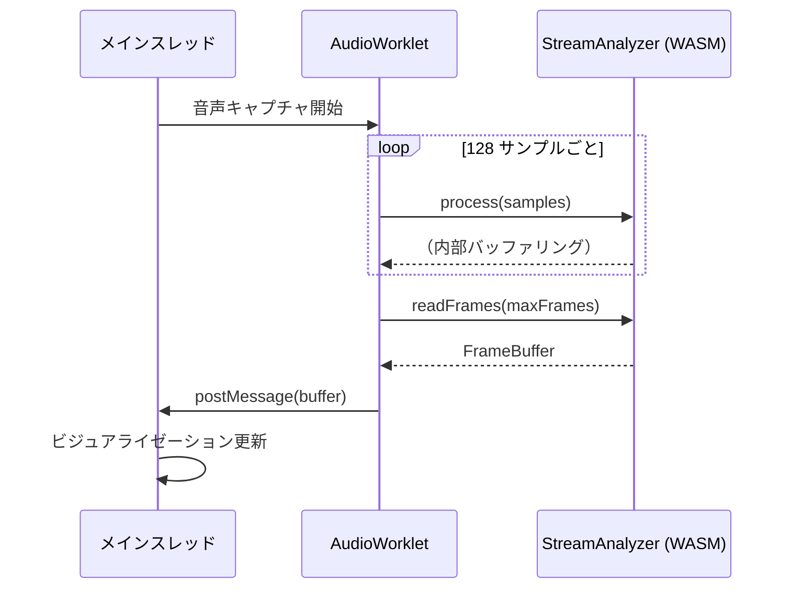

# JavaScript/TypeScript API リファレンス

libsonare JavaScript/TypeScript インターフェースの完全な API リファレンス。

## 概要

libsonare は Web アプリケーション向けのオーディオ解析機能を提供します。npm パッケージは WebAssembly ビルドで、デコード済みのモノラル `Float32Array` サンプルを受け取ります。ファイルデコーダは含みません。

| カテゴリ | 関数 | ユースケース |
|----------|-----------|-----------|
| **クイック解析** | `detectBpm`, `detectKey`, `detectBeats` | DJアプリ、音楽プレイヤー、ビート同期 |
| **完全解析** | `analyze`, `analyzeWithProgress` | 音楽制作、楽曲メタデータ |
| **オーディオエフェクト** | `hpss`, `timeStretch`, `pitchShift` | リミックス、練習ツール |
| **特徴量** | `melSpectrogram`, `chroma`, `mfcc` | ML 入力、可視化 |

::: tip 用語について
オーディオ解析が初めてですか？[用語集](/ja/docs/glossary)で BPM、STFT、Chroma などの用語の説明をご覧ください。
:::

## インストール

::: code-group

```bash [npm]
npm install @libraz/libsonare
```

```bash [yarn]
yarn add @libraz/libsonare
```

```bash [pnpm]
pnpm add @libraz/libsonare
```

:::

## インポート

```typescript
import {
  init,
  detectBpm,
  detectKey,
  detectBeats,
  detectOnsets,
  analyze,
  analyzeWithProgress,
  version
} from '@libraz/libsonare';
```

## 初期化

### `init(options?)`

WASM モジュールを初期化します。解析関数を使用する前に呼び出す必要があります。

```typescript
async function init(options?: {
  locateFile?: (path: string, prefix: string) => string;
}): Promise<void>
```

**例:**

```typescript
import { init, detectBpm } from '@libraz/libsonare';

// 基本的な初期化
await init();

// カスタムファイルロケーション
await init({
  locateFile: (path, prefix) => `/custom/wasm/path/${path}`
});
```

### `isInitialized()`

モジュールが初期化済みかどうかを確認します。

```typescript
function isInitialized(): boolean
```

### `version()`

ライブラリのバージョンを取得します。

```typescript
function version(): string  // 例: "1.1.0"
```

## 解析関数

### `detectBpm(samples, sampleRate)`

オーディオサンプルから BPM (テンポ) を検出します。

::: info ユースケース
- **DJ ソフトウェア**: トラック間のテンポをマッチングしてシームレスなミキシング
- **音楽プレイヤー**: テンポ情報の表示、テンポ別プレイリストの自動生成
- **フィットネスアプリ**: ワークアウト強度に合わせた音楽選択
- **ビート同期**: ビジュアライゼーションやアニメーションを音楽に同期
:::

```typescript
function detectBpm(samples: Float32Array, sampleRate: number): number
```

| パラメータ | 型 | 説明 |
|-----------|------|-------------|
| `samples` | `Float32Array` | モノラルオーディオサンプル (範囲 -1.0 〜 1.0) |
| `sampleRate` | `number` | サンプルレート (Hz) (例: 44100) |

**戻り値:** 検出された BPM の数値。

```typescript
const bpm = detectBpm(samples, sampleRate);
console.log(`BPM: ${bpm}`);
```

### `detectKey(samples, sampleRate)`

オーディオサンプルから音楽キーを検出します。ルート音（C, D, E...）とモード（メジャー/マイナー）を返します。

::: info ユースケース
- **ハーモニックミキシング**: DJがスムーズなトランジションのためにキーをマッチング（カメロットホイール）
- **移調**: ボーカルレンジに合わせたキー変更の提案
- **音楽レコメンデーション**: 互換性のあるキーの曲を検索
- **練習ツール**: ミュージシャンが一緒に演奏するためのキー表示
:::

```typescript
function detectKey(samples: Float32Array, sampleRate: number): Key
```

**戻り値:** `Key` オブジェクト

```typescript
interface Key {
  root: PitchClass;      // 0-11 (C=0, B=11)
  mode: Mode;            // 0=Major, 1=Minor
  confidence: number;    // 0.0 〜 1.0
  name: string;          // "C major", "A minor"
  shortName: string;     // "C", "Am"
}
```

```typescript
const key = detectKey(samples, sampleRate);
console.log(`キー: ${key.name}`);
console.log(`信頼度: ${(key.confidence * 100).toFixed(1)}%`);
```

### `detectBeats(samples, sampleRate)`

オーディオサンプルからビート時刻を検出します。各ビートの推定タイムスタンプを返します。

::: info ユースケース
- **音楽ビジュアライゼーション**: 各ビートでエフェクトをトリガー
- **リズムゲーム**: オーディオからノートチャートを生成
- **動画編集**: ビートに合わせた自動カット
- **ループ作成**: 完璧なループポイントを見つける
:::

```typescript
function detectBeats(samples: Float32Array, sampleRate: number): Float32Array
```

**戻り値:** 秒単位のビート時刻の Float32Array

### `detectOnsets(samples, sampleRate)`

オーディオサンプルからオンセット時刻（音の立ち上がり）を検出します。ビートより細かい粒度 - すべての音をキャプチャ。

::: info ユースケース
- **ドラム採譜**: 個々のドラムヒットを検出
- **オーディオからMIDI**: オーディオをノートイベントに変換
- **サンプルスライシング**: トランジェントで自動的にオーディオをセグメント化
:::

```typescript
function detectOnsets(samples: Float32Array, sampleRate: number): Float32Array
```

### `analyze(samples, sampleRate)` <Badge type="warning" text="高負荷" />

完全な音楽解析を実行します。BPM、キー、ビート、コード、セクション、音色などを返します。

::: info ユースケース
- **音楽ライブラリ管理**: 楽曲にメタデータを自動タグ付け
- **音楽制作**: リファレンストラックの解析
- **DJ準備**: すべてのトラック情報を一度に取得
- **音楽教育**: 楽曲構造の学習
:::

::: tip パフォーマンス
これは最も重い API です。長いオーディオファイル（3分以上）の場合は、`analyzeWithProgress` を使用して進捗を表示するか、関連するセグメントのみを解析することを検討してください。
:::

```typescript
function analyze(samples: Float32Array, sampleRate: number): AnalysisResult
```

**戻り値:** BPM、キー、ビート、コード、セクション、音色、ダイナミクス、リズムを含む完全な `AnalysisResult`

```typescript
const result = analyze(samples, sampleRate);
console.log(`BPM: ${result.bpm}`);
console.log(`キー: ${result.key.name}`);
console.log(`コード数: ${result.chords.length}`);
console.log(`楽曲形式: ${result.form}`);
```

### `analyzeWithProgress(samples, sampleRate, onProgress)` <Badge type="warning" text="高負荷" />

進捗レポート付きで完全な音楽解析を実行します。

```typescript
function analyzeWithProgress(
  samples: Float32Array,
  sampleRate: number,
  onProgress: (progress: number, stage: string) => void
): AnalysisResult
```

**進捗ステージ:**

| ステージ | 説明 | 進捗 |
|---------|------|------|
| `"features"` | 特徴量の事前計算 | 0.0 |
| `"bpm"` | BPM 検出 | 0.15 |
| `"key"` | キー検出 | 0.15 |
| `"beats"` | ビートトラッキング | 0.25 |
| `"chords"` | コード認識 | 0.40 |
| `"sections"` | セクション検出 | 0.55 |
| `"timbre"` | 音色解析 | 0.70 |
| `"dynamics"` | ダイナミクス解析 | 0.80 |
| `"rhythm"` | リズム解析 | 0.90 |
| `"complete"` | 完了 | 1.0 |

## オーディオエフェクト

### `hpss(samples, sampleRate, kernelHarmonic?, kernelPercussive?)` <Badge type="warning" text="高負荷" />

HPSS（Harmonic / Percussive Source Separation。倍音成分／打撃成分の分離）。音源を倍音成分（ボーカル、シンセなどの持続音）と打撃成分（ドラム、過渡音）に分離します。

::: info ユースケース
- **リミックス**: ドラムを分離または除去する
- **カラオケ**: ボーカルを除去してインストゥルメンタルを取り出す（倍音成分を使用）
- **解析精度の向上**: クリーンなコード検出のために倍音成分のみを使う
- **ドラム抽出**: サンプリング用に打撃成分だけを取り出す
:::

::: tip パフォーマンス
HPSS は STFT とメディアンフィルタリングを必要とします。処理時間は音源の長さに比例します。
:::

```typescript
function hpss(
  samples: Float32Array,
  sampleRate: number,
  kernelHarmonic?: number,    // デフォルト: 31
  kernelPercussive?: number   // デフォルト: 31
): HpssResult

interface HpssResult {
  harmonic: Float32Array;
  percussive: Float32Array;
  sampleRate: number;
}
```

### `harmonic(samples, sampleRate)` <Badge type="warning" text="高負荷" />

音源から倍音成分を抽出します。

```typescript
function harmonic(samples: Float32Array, sampleRate: number): Float32Array
```

### `percussive(samples, sampleRate)` <Badge type="warning" text="高負荷" />

音源から打撃成分を抽出します。

```typescript
function percussive(samples: Float32Array, sampleRate: number): Float32Array
```

### `timeStretch(samples, sampleRate, rate)` <Badge type="warning" text="高負荷" />

ピッチを変えずにテンポを変更します。Rate < 1.0 = 遅く、> 1.0 = 速く。

::: info ユースケース
- **練習ツール**: 難しいパッセージを学ぶために音楽をスローダウン
- **DJミキシング**: トラック間のテンポをマッチング
- **ポッドキャスト編集**: スピーチの速度調整
- **音楽制作**: サンプルをプロジェクトのテンポに合わせる
:::

::: tip パフォーマンス
フェーズボコーダーアルゴリズムを使用。処理時間はオーディオの長さに比例します。
:::

```typescript
function timeStretch(
  samples: Float32Array,
  sampleRate: number,
  rate: number   // 0.5 = 半速、2.0 = 倍速
): Float32Array
```

### `pitchShift(samples, sampleRate, semitones)` <Badge type="warning" text="高負荷" />

長さを変えずにピッチを変更します。半音単位で測定（+12 = 1オクターブ上）。

::: info ユースケース
- **キーマッチング**: ミキシング用に曲を移調
- **ボーカルチューニング**: ボーカルピッチの補正や調整
- **クリエイティブエフェクト**: ハーモニー作成、チップマンク/ディープボイスエフェクト
- **楽器練習**: 演奏しやすいキーに移調
:::

::: tip パフォーマンス
タイムストレッチとリサンプリングを組み合わせます。処理時間はオーディオの長さに比例します。
:::

```typescript
function pitchShift(
  samples: Float32Array,
  sampleRate: number,
  semitones: number   // +12 = 1オクターブ上
): Float32Array
```

### `normalize(samples, sampleRate, targetDb?)`

オーディオを目標ピークレベルに正規化します。

```typescript
function normalize(
  samples: Float32Array,
  sampleRate: number,
  targetDb?: number   // デフォルト: 0.0 (フルスケール)
): Float32Array
```

### `trim(samples, sampleRate, thresholdDb?)`

オーディオの始めと終わりから無音を除去します。

```typescript
function trim(
  samples: Float32Array,
  sampleRate: number,
  thresholdDb?: number   // デフォルト: -60.0
): Float32Array
```

## 特徴抽出

### `stft(samples, sampleRate, nFft?, hopLength?)` <Badge type="info" text="中負荷" />

短時間フーリエ変換（STFT）を計算します。

```typescript
function stft(
  samples: Float32Array,
  sampleRate: number,
  nFft?: number,      // デフォルト: 2048
  hopLength?: number  // デフォルト: 512
): StftResult

interface StftResult {
  nBins: number;
  nFrames: number;
  nFft: number;
  hopLength: number;
  sampleRate: number;
  magnitude: Float32Array;
  power: Float32Array;
}
```

### `stftDb(samples, sampleRate, nFft?, hopLength?)` <Badge type="info" text="中負荷" />

STFT を計算し、dB スケールで返します。

```typescript
function stftDb(
  samples: Float32Array,
  sampleRate: number,
  nFft?: number,      // デフォルト: 2048
  hopLength?: number  // デフォルト: 512
): { nBins: number; nFrames: number; db: Float32Array }
```

### `melSpectrogram(samples, sampleRate, nFft?, hopLength?, nMels?)` <Badge type="info" text="中負荷" />

メルスペクトログラムを計算します。人間のピッチ知覚に合わせた周波数表現。

::: info ユースケース
- **機械学習**: ジャンル分類、ムード検出の入力
- **可視化**: オーディオプレイヤー用の周波数スペクトログラム作成
- **類似度検索**: スペクトル内容で曲を比較
- **音声解析**: スピーチパターンと特性の解析
:::

```typescript
function melSpectrogram(
  samples: Float32Array,
  sampleRate: number,
  nFft?: number,      // デフォルト: 2048
  hopLength?: number, // デフォルト: 512
  nMels?: number      // デフォルト: 128
): MelSpectrogramResult

interface MelSpectrogramResult {
  nMels: number;
  nFrames: number;
  sampleRate: number;
  hopLength: number;
  power: Float32Array;
  db: Float32Array;
}
```

### `mfcc(samples, sampleRate, nFft?, hopLength?, nMels?, nMfcc?)` <Badge type="info" text="中負荷" />

MFCC（メル周波数ケプストラム係数）を計算します。スペクトル包絡のコンパクトな表現。

::: info ユースケース
- **音声認識**: 音声テキスト変換システムの標準入力
- **話者識別**: 誰が話しているかを識別
- **音色解析**: 楽器/音声の質を特徴付け
- **オーディオフィンガープリンティング**: コンパクトな楽曲署名の作成
:::

```typescript
function mfcc(
  samples: Float32Array,
  sampleRate: number,
  nFft?: number,      // デフォルト: 2048
  hopLength?: number, // デフォルト: 512
  nMels?: number,     // デフォルト: 128
  nMfcc?: number      // デフォルト: 13
): MfccResult

interface MfccResult {
  nMfcc: number;
  nFrames: number;
  coefficients: Float32Array;
}
```

### `chroma(samples, sampleRate, nFft?, hopLength?)` <Badge type="info" text="中負荷" />

クロマグラム（ピッチクラス分布）を計算します。すべての周波数を12のピッチクラス（C, C#, D, ..., B）にマッピング。

::: info ユースケース
- **コード検出**: 演奏されているコードを識別
- **キー検出**: ピッチ分布から曲のキーを決定
- **カバー曲検出**: テンポ/キーに関係なく曲をマッチング
- **音楽類似度**: トラック間のハーモニック内容を比較
:::

```typescript
function chroma(
  samples: Float32Array,
  sampleRate: number,
  nFft?: number,      // デフォルト: 2048
  hopLength?: number  // デフォルト: 512
): ChromaResult

interface ChromaResult {
  nChroma: number;        // 12
  nFrames: number;
  sampleRate: number;
  hopLength: number;
  features: Float32Array;
  meanEnergy: number[];   // [12] ピッチクラスごと
}
```

### スペクトル特徴

```typescript
// スペクトル重心 (Hz)
function spectralCentroid(samples, sampleRate, nFft?, hopLength?): Float32Array

// スペクトル帯域幅 (Hz)
function spectralBandwidth(samples, sampleRate, nFft?, hopLength?): Float32Array

// スペクトルロールオフ (Hz)
function spectralRolloff(samples, sampleRate, nFft?, hopLength?, rollPercent?): Float32Array

// スペクトル平坦度 (0=調性的, 1=ノイズ的)
function spectralFlatness(samples, sampleRate, nFft?, hopLength?): Float32Array

// ゼロ交差率
function zeroCrossingRate(samples, sampleRate, frameLength?, hopLength?): Float32Array

// RMSエネルギー
function rmsEnergy(samples, sampleRate, frameLength?, hopLength?): Float32Array
```

### ピッチ検出 <Badge type="info" text="中負荷" />

```typescript
// YIN アルゴリズム
function pitchYin(
  samples: Float32Array,
  sampleRate: number,
  frameLength?: number,  // デフォルト: 2048
  hopLength?: number,    // デフォルト: 512
  fmin?: number,         // デフォルト: 65 Hz
  fmax?: number,         // デフォルト: 2093 Hz
  threshold?: number     // デフォルト: 0.3
): PitchResult

// pYIN アルゴリズム（確率的 YIN + HMM 平滑化）
function pitchPyin(
  samples: Float32Array,
  sampleRate: number,
  frameLength?: number,
  hopLength?: number,
  fmin?: number,
  fmax?: number,
  threshold?: number
): PitchResult

interface PitchResult {
  f0: Float32Array;
  voicedProb: Float32Array;
  voicedFlag: boolean[];
  nFrames: number;
  medianF0: number;
  meanF0: number;
}
```

## 単位変換

これらの関数は軽量で高速です。

```typescript
// Hz <-> Mel (Slaney 式)
function hzToMel(hz: number): number
function melToHz(mel: number): number

// Hz <-> MIDI ノート番号 (A4 = 440 Hz = 69)
function hzToMidi(hz: number): number
function midiToHz(midi: number): number

// Hz <-> ノート名
function hzToNote(hz: number): string      // "A4", "C#5"
function noteToHz(note: string): number

// 時間 <-> フレーム
function framesToTime(frames: number, sr: number, hopLength: number): number
function timeToFrames(time: number, sr: number, hopLength: number): number

// フレーム <-> サンプル (librosa.frames_to_samples / samples_to_frames 相当)
function framesToSamples(frames: number, hopLength?: number, nFft?: number): number
function samplesToFrames(samples: number, hopLength?: number, nFft?: number): number

// dB 変換（ベクトル）
function powerToDb(values: Float32Array, ref?: number, amin?: number, topDb?: number): Float32Array
function amplitudeToDb(values: Float32Array, ref?: number, amin?: number, topDb?: number): Float32Array
function dbToPower(values: Float32Array, ref?: number): Float32Array
function dbToAmplitude(values: Float32Array, ref?: number): Float32Array
```

## librosa 互換ヘルパー

libsonare 1.1.0 で追加された librosa 互換ヘルパー群です。対応する `librosa`
関数の挙動に合わせており、WASM・Node・Python すべてのバインディングから
利用できます。各ヘルパーが対応する librosa 関数は
[librosa 互換性](/ja/docs/librosa-compatibility) を参照してください。

::: tip 各ヘルパーの位置づけ
- **プリ／ディエンファシス** — 解析前の前処理。高域を持ち上げて／戻して S/N を改善する古典的な 1 タップ IIR フィルタです。
- **無音トリム／分割** — 音源の前後の無音をカットしたり、無音区間で区切ったりする実用処理です。
- **フレーミング／パディング** — STFT のような固定フレーム処理に通すために、波形を `frame_length` サンプルごとに切り出したり、サイズを揃えたりするためのユーティリティです。
- **ピーク検出／ベクトル正規化** — オンセット強度などの 1 次元信号からピークを拾ったり、ベクトルを目的のノルムで揃えたりする後処理です。
- **PCEN** — メルスペクトログラム向けの動的レンジ圧縮。ノイズや音量変動に強い特徴量を作るために使います。
- **Tonnetz** — クロマグラムを 6 次元のハーモニック空間に射影した特徴量。コード関係や転調の解析に向きます。
- **Tempogram / PLP** — オンセット包絡線からテンポ候補を時間方向に追える表現と、その上で支配的なパルスを取り出す手法です。
:::

### プリエンファシス／ディエンファシス

```typescript
function preemphasis(samples: Float32Array, coef?: number, zi?: number): Float32Array
function deemphasis(samples: Float32Array, coef?: number, zi?: number): Float32Array
```

`coef` の既定値は `0.97` です。ストリーミング処理で前ブロック末尾の値を
受け渡したい場合は `zi` に初期条件を指定します。

### 無音トリム／無音分割

```typescript
function trimSilence(
  samples: Float32Array,
  topDb?: number,        // 既定 60
  frameLength?: number,  // 既定 2048
  hopLength?: number,    // 既定 512
): { audio: Float32Array; startSample: number; endSample: number }

function splitSilence(
  samples: Float32Array,
  topDb?: number,
  frameLength?: number,
  hopLength?: number,
): Int32Array  // [start0, end0, start1, end1, ...] のフラット配列
```

`trimSilence` は `librosa.effects.trim`、`splitSilence` は
`librosa.effects.split` と同等で、非無音区間をサンプル単位の開始／終了
ペアで返します。

### フレーミング／パディングのヘルパー

```typescript
function frameSignal(
  samples: Float32Array,
  frameLength: number,
  hopLength: number,
): { nFrames: number; frames: Float32Array }  // row-major

function padCenter(values: Float32Array, size: number, padValue?: number): Float32Array
function fixLength(values: Float32Array, size: number, padValue?: number): Float32Array
function fixFrames(frames: Int32Array | number[], xMin?: number, xMax?: number, pad?: boolean): Int32Array
```

`frameSignal` は `librosa.util.frame`、`padCenter` / `fixLength` /
`fixFrames` は対応する librosa.util の同名関数と互換です。

### ピーク検出／ベクトル正規化

```typescript
function peakPick(
  values: Float32Array,
  preMax: number,
  postMax: number,
  preAvg: number,
  postAvg: number,
  delta: number,
  wait: number,
): Int32Array  // ピーク位置のインデックス

function vectorNormalize(
  values: Float32Array,
  normType?: number,  // 0=inf, 1=L1, 2=L2, 3=power（既定 0）
  threshold?: number,
): Float32Array
```

`peakPick` は `librosa.util.peak_pick`、`vectorNormalize` は
`librosa.util.normalize` に対応します。

::: details `peakPick` のパラメータ
- `preMax` / `postMax` — 各候補点の前後 N サンプルの中で**最大値か**を判定する窓幅（局所最大判定）。
- `preAvg` / `postAvg` — 同じく前後 N サンプルの**平均値 + `delta`** を超えているかを判定する窓幅。
- `delta` — 平均からどれだけ突出していればピークと見なすかの閾値。値を上げるとピークが少なくなります。
- `wait` — 連続するピーク間の最小距離（サンプル数）。短すぎる二重ピークを抑止します。

オンセット強度（`detectOnsets` / `tempogram` などの入力に使う 1 次元信号）からピーク時刻を抽出する後処理用です。
:::

::: details `vectorNormalize` の `normType`
- `0` (**inf**, 既定) — 最大絶対値で割って `[-1, 1]` に収める。波形のピーク正規化に近い動作。
- `1` (**L1**) — 絶対値の総和で割る。確率分布のように正規化したいとき。
- `2` (**L2**) — 各成分を二乗和の平方根で割る。特徴ベクトル比較の前処理として一般的。
- `3` (**power**) — 二乗和そのもので割る（パワー正規化）。

`threshold` を指定するとそれ以下のノルムでは正規化をスキップし、ほぼ無音のフレームで値が暴れるのを防げます。
:::

### PCEN（チャンネル別エネルギー正規化）

```typescript
function pcen(
  values: Float32Array,
  nBins: number,
  nFrames: number,
  options?: {
    sampleRate?: number;
    hopLength?: number;
    timeConstant?: number;  // 既定 0.4
    gain?: number;          // 既定 0.98
    bias?: number;          // 既定 2.0
    power?: number;         // 既定 0.5
    eps?: number;           // 既定 1e-6
  },
): Float32Array
```

`pcen` は `librosa.pcen` 互換です。入力は row-major の
`[nBins x nFrames]` メルスペクトログラム、出力も同じレイアウトです。

### Tonnetz／Tempogram／PLP

```typescript
function tonnetz(
  chromagram: Float32Array,   // row-major [nChroma x nFrames]
  nChroma: number,
  nFrames: number,
): Float32Array               // [6 x nFrames]

function tempogram(
  onsetEnvelope: Float32Array,
  sampleRate?: number,
  hopLength?: number,         // 既定 512
  winLength?: number,         // 既定 384
): { nFrames: number; winLength: number; data: Float32Array }

function plp(
  onsetEnvelope: Float32Array,
  sampleRate?: number,
  hopLength?: number,
  tempoMin?: number,          // 既定 30
  tempoMax?: number,          // 既定 300
  winLength?: number,
): Float32Array
```

`tonnetz` は `librosa.feature.tonnetz`、`tempogram` は
`librosa.feature.tempogram`（自己相関ベース）、`plp` は
`librosa.beat.plp`（Predominant Local Pulse）と対応します。

## リサンプリング

### `resample(samples, srcSr, targetSr)` <Badge type="info" text="中負荷" />

r8brain アルゴリズムを使用した高品質リサンプリング。

```typescript
function resample(
  samples: Float32Array,
  srcSr: number,
  targetSr: number
): Float32Array
```

## Audio クラス

`Audio` クラスは、スタンドアロン関数群をオブジェクト指向ラッパーとして提供します。サンプルとサンプルレートを内部で保持するため、各呼び出しで渡し直す必要がありません。

### `Audio.fromBuffer(samples, sampleRate)`

サンプルデータから Audio インスタンスを作成します。

```typescript
const audio = Audio.fromBuffer(samples, 44100);
```

### プロパティ

| プロパティ | 型 | 説明 |
|----------|------|-------------|
| `audio.data` | `Float32Array` | サンプルデータ |
| `audio.length` | `number` | サンプル数 |
| `audio.sampleRate` | `number` | サンプルレート（Hz） |
| `audio.duration` | `number` | 長さ（秒） |

### インスタンスメソッド

スタンドアロン関数はすべてインスタンスメソッドとしても呼び出せます — `samples` と `sampleRate` は自動的に渡されます。

```typescript
import { init, Audio } from '@libraz/libsonare';

await init();

const audio = Audio.fromBuffer(samples, 44100);

// 解析
const bpm = audio.detectBpm();
const key = audio.detectKey();
const beats = audio.detectBeats();
const onsets = audio.detectOnsets();
const result = audio.analyze();

// エフェクト
const { harmonic, percussive } = audio.hpss();
const stretched = audio.timeStretch(1.5);
const shifted = audio.pitchShift(2);
const normalized = audio.normalize(-3.0);
const trimmed = audio.trim(-60.0);

// 特徴抽出
const stftResult = audio.stft();
const mel = audio.melSpectrogram();
const mfcc = audio.mfcc();
const chroma = audio.chroma();
const centroid = audio.spectralCentroid();
const bandwidth = audio.spectralBandwidth();
const rolloff = audio.spectralRolloff();
const flatness = audio.spectralFlatness();
const zcr = audio.zeroCrossingRate();
const rms = audio.rmsEnergy();
const pitch = audio.pitchPyin();

// リサンプリング
const resampled = audio.resample(22050);
```

引数のデフォルト値（`nFft`、`hopLength`、`nMels` など）はスタンドアロン関数と同じです。

## ストリーミング API

ストリーミング API は、リアルタイムの音声解析とビジュアライゼーションを可能にします。バッチ解析とは異なり、ストリーミングは音声をチャンクごとに処理し、低レイテンシを実現します。

::: tip 使い分け
- **バッチ API**: 録音済みファイル、完全解析（BPM、キー、コード、セクション）
- **ストリーミング API**: ライブ音声、ビジュアライゼーション、リアルタイムフィードバック
:::

### StreamConfig

StreamAnalyzer の設定オプション。

```typescript
interface StreamConfig {
  sampleRate: number;          // 例: 44100
  nFft?: number;               // デフォルト: 2048
  hopLength?: number;          // デフォルト: 512
  nMels?: number;              // デフォルト: 128
  computeMel?: boolean;        // デフォルト: true
  computeChroma?: boolean;     // デフォルト: true
  computeOnset?: boolean;      // デフォルト: true
  emitEveryNFrames?: number;   // デフォルト: 1（スロットリングなし）
}
```

### StreamAnalyzer クラス

```typescript
class StreamAnalyzer {
  constructor(config: StreamConfig);

  // 音声チャンクを処理（内部オフセット追跡）
  process(samples: Float32Array): void;

  // 外部同期で処理
  processWithOffset(samples: Float32Array, sampleOffset: number): void;

  // 読み取り可能なフレーム数
  availableFrames(): number;

  // 処理済みフレームを読み取り
  readFrames(maxFrames: number): FrameBuffer;

  // 新しいストリーム用に状態をリセット
  reset(baseSampleOffset?: number): void;

  // 統計情報とプログレッシブ推定を取得
  stats(): AnalyzerStats;

  // 処理済みの総フレーム数
  frameCount(): number;

  // 現在の時間位置（秒）
  currentTime(): number;

  // サンプルレートを取得
  sampleRate(): number;

  // パターンロックタイミング用の予想総再生時間を設定
  setExpectedDuration(durationSeconds: number): void;

  // 大音量/圧縮音声用のノーマライゼーションゲインを設定
  setNormalizationGain(gain: number): void;

  // チューニング基準周波数を設定（デフォルト: 440 Hz）
  setTuningRefHz(refHz: number): void;

  // リソースを解放（使用終了時に呼び出し）
  dispose(): void;
}
```

### FrameBuffer

`postMessage` での効率的な転送用の Structure-of-Arrays 形式。

```typescript
interface FrameBuffer {
  nFrames: number;
  timestamps: Float32Array;      // [nFrames]
  mel: Float32Array;             // [nFrames * nMels]
  chroma: Float32Array;          // [nFrames * 12]
  onsetStrength: Float32Array;   // [nFrames]
  rmsEnergy: Float32Array;       // [nFrames]
  spectralCentroid: Float32Array;// [nFrames]
  spectralFlatness: Float32Array;// [nFrames]
  chordRoot: Int32Array;         // [nFrames] フレームごとのコードルート
  chordQuality: Int32Array;      // [nFrames] フレームごとのコードクオリティ
  chordConfidence: Float32Array; // [nFrames] フレームごとのコード信頼度
}
```

### ChordChange

検出されたコード変化。

```typescript
interface ChordChange {
  root: PitchClass;
  quality: ChordQuality;
  startTime: number;
  confidence: number;
}
```

### BarChord

小節境界で検出されたコード（ビート同期）。

```typescript
interface BarChord {
  barIndex: number;
  root: PitchClass;
  quality: ChordQuality;
  startTime: number;
  confidence: number;
}
```

### PatternScore

既知のコード進行パターンの一致スコア。

```typescript
interface PatternScore {
  name: string;   // パターン名（例: "royalRoad", "pop"）
  score: number;  // 一致スコア（0-1）
}
```

### AnalyzerStats

```typescript
interface AnalyzerStats {
  totalFrames: number;
  totalSamples: number;
  durationSeconds: number;
  estimate: ProgressiveEstimate;
}
```

### ProgressiveEstimate

処理された音声が増えるにつれて精度が向上する BPM、キー、コードの推定値。

```typescript
interface ProgressiveEstimate {
  // BPM 推定
  bpm: number;              // 未推定の場合は 0
  bpmConfidence: number;    // 0-1、時間とともに増加
  bpmCandidateCount: number;

  // キー推定
  key: PitchClass;          // 0-11（C-B）
  keyMinor: boolean;
  keyConfidence: number;    // 0-1、時間とともに増加

  // コード推定（現在）
  chordRoot: PitchClass;
  chordQuality: ChordQuality;
  chordConfidence: number;
  chordProgression: ChordChange[];     // 検出されたコード変化
  barChordProgression: BarChord[];     // 小節同期コード
  currentBar: number;                  // 現在の小節インデックス
  barDuration: number;                 // 小節の長さ（秒）

  // パターン検出
  votedPattern: BarChord[];            // 各パターン位置の投票済みコード
  patternLength: number;              // 繰り返しパターンの長さ（デフォルト: 4小節）
  detectedPatternName: string;        // 最も一致するパターン名（例: "royalRoad"）
  detectedPatternScore: number;       // 一致スコア（0-1）
  allPatternScores: PatternScore[];   // 全既知パターンのスコア

  // 統計情報
  accumulatedSeconds: number;
  usedFrames: number;
  updated: boolean;         // このフレームで推定が更新された場合 true
}
```

### 基本的なストリーミング例

```typescript
import { init, StreamAnalyzer } from '@libraz/libsonare';

await init();

// 設定オブジェクトでアナライザーを作成
const analyzer = new StreamAnalyzer({
  sampleRate: 44100,
  nFft: 2048,
  hopLength: 512,
  nMels: 128,
  computeMel: true,
  computeChroma: true,
  computeOnset: true,
  emitEveryNFrames: 1
});

// 音声チャンクを処理（例: AudioWorklet から）
function processChunk(samples: Float32Array) {
  analyzer.process(samples);

  // 利用可能なフレームを読み取り
  const available = analyzer.availableFrames();
  if (available > 0) {
    const frames = analyzer.readFrames(available);

    // ビジュアライゼーションに使用
    updateVisualization(frames);

    // プログレッシブ推定をチェック
    const stats = analyzer.stats();
    if (stats.estimate.bpm > 0) {
      console.log(`BPM: ${stats.estimate.bpm.toFixed(1)}`);
      console.log(`キー: ${stats.estimate.key} ${stats.estimate.keyMinor ? 'マイナー' : 'メジャー'}`);
      console.log(`現在の小節: ${stats.estimate.currentBar}`);
      console.log(`コード進行:`, stats.estimate.chordProgression);
      console.log(`小節コード:`, stats.estimate.barChordProgression);
    }
  }
}

// 使用終了時にクリーンアップ
analyzer.dispose();
```

### AudioWorklet 統合


```mermaid
sequenceDiagram
    participant Main as メインスレッド
    participant Worklet as AudioWorklet
    participant WASM as StreamAnalyzer (WASM)

    Main->>Worklet: 音声キャプチャ開始
    loop 128 サンプルごと
        Worklet->>WASM: process(samples)
        WASM-->>Worklet: （内部バッファリング）
    end
    Worklet->>WASM: readFrames(maxFrames)
    WASM-->>Worklet: FrameBuffer
    Worklet->>Main: postMessage(buffer)
    Main->>Main: ビジュアライゼーション更新
```

**worklet-processor.ts:**

```typescript
import { StreamAnalyzer } from '@libraz/libsonare';

class AnalyzerProcessor extends AudioWorkletProcessor {
  private analyzer: StreamAnalyzer;

  constructor() {
    super();
    this.analyzer = new StreamAnalyzer({
      sampleRate,
      nFft: 2048,
      hopLength: 512,
      nMels: 128,
      computeMel: true,
      computeChroma: true,
      computeOnset: true,
      emitEveryNFrames: 4
    });
  }

  process(inputs: Float32Array[][]): boolean {
    const input = inputs[0]?.[0];
    if (!input) return true;

    this.analyzer.process(input);

    const available = this.analyzer.availableFrames();
    if (available >= 4) {
      const frames = this.analyzer.readFrames(available);
      this.port.postMessage(frames, [
        frames.mel.buffer,
        frames.chroma.buffer
      ]);
    }

    return true;
  }
}

registerProcessor('analyzer-processor', AnalyzerProcessor);
```

### タイムスタンプ同期

::: warning ストリーム時間 vs AudioContext 時間
`FrameBuffer.timestamps` は **ストリーム時間**（累積入力サンプル）を表し、`AudioContext.currentTime` ではありません。同期には:

```typescript
// 開始時にオフセットを追跡
const startTime = audioContext.currentTime;
const startOffset = 0;

// ビジュアライゼーションでオフセットを加算
const audioTime = startTime + frame.timestamps[i];
```
:::

### パフォーマンスのヒント

1. **`emitEveryNFrames` でスロットリング**: 60fps ビジュアライゼーションには 4 を設定
2. **AudioWorklet で処理**: メインスレッドのブロックを回避
3. **バッチ読み取り**: 利用可能な複数フレームを一度に読み取り
4. **`dispose()` を呼び出す**: メモリリークを防ぐため、使用終了時にリソースを解放

## 型定義

### AnalysisResult

```typescript
interface AnalysisResult {
  bpm: number;
  bpmConfidence: number;
  key: Key;
  timeSignature: TimeSignature;
  beatTimes: Float32Array;  // beats[].time のコピー。librosa 互換コードで便利
  beats: Beat[];            // 各拍の強度を含むオブジェクト配列
  chords: Chord[];
  sections: Section[];
  timbre: Timbre;
  dynamics: Dynamics;
  rhythm: RhythmFeatures;
  form: string;  // 例: "IABABCO"
}
```

### Beat

```typescript
interface Beat {
  time: number;      // 秒
  strength: number;  // 0.0 〜 1.0
}
```

### Chord

```typescript
interface Chord {
  root: PitchClass;
  quality: ChordQuality;
  start: number;       // 秒
  end: number;         // 秒
  confidence: number;
  name: string;        // "C", "Am", "G7"
}
```

### Section

```typescript
interface Section {
  type: SectionType;
  start: number;
  end: number;
  energyLevel: number;
  confidence: number;
  name: string;  // "Intro", "Verse 1", "Chorus"
}
```

### TimeSignature

```typescript
interface TimeSignature {
  numerator: number;    // 例: 4
  denominator: number;  // 例: 4
  confidence: number;
}
```

### Timbre

```typescript
interface Timbre {
  brightness: number;   // 0.0 〜 1.0
  warmth: number;
  density: number;
  roughness: number;
  complexity: number;
}
```

### Dynamics

```typescript
interface Dynamics {
  dynamicRangeDb: number;
  loudnessRangeDb: number;
  crestFactor: number;
  isCompressed: boolean;
}
```

### RhythmFeatures

```typescript
interface RhythmFeatures {
  syncopation: number;
  grooveType: string;  // "straight", "shuffle", "swing"
  patternRegularity: number;
}
```

## 列挙型

### PitchClass

```typescript
const PitchClass = {
  C: 0, Cs: 1, D: 2, Ds: 3, E: 4, F: 5,
  Fs: 6, G: 7, Gs: 8, A: 9, As: 10, B: 11
} as const;
```

### Mode

```typescript
const Mode = {
  Major: 0,
  Minor: 1
} as const;
```

### ChordQuality

```typescript
const ChordQuality = {
  Major: 0, Minor: 1, Diminished: 2, Augmented: 3,
  Dominant7: 4, Major7: 5, Minor7: 6, Sus2: 7, Sus4: 8
} as const;
```

### SectionType

```typescript
const SectionType = {
  Intro: 0, Verse: 1, PreChorus: 2, Chorus: 3,
  Bridge: 4, Instrumental: 5, Outro: 6
} as const;
```

## エラーハンドリング

モジュールが初期化されていない場合、すべての関数はエラーをスローします。

```typescript
try {
  const bpm = detectBpm(samples, sampleRate);
} catch (error) {
  if (error.message.includes('not initialized')) {
    await init();
    // リトライ
  }
}
```

## マスタリング API

ブラウザ向けパッケージには `/ja/mastering` デモと同じ名前付きマスタリングプロセッサが含まれます。Web Audio API などでデコードした `Float32Array` のチャンネルバッファを渡し、戻り値のサンプルをアプリ側で WAV などに書き出します。

```typescript
import {
  init,
  masterAudioStereo,
  masteringChainStereo,
  masteringChainStereoWithProgress,
  masteringPresetNames,
  masteringProcessorNames,
  masteringProcess,
  masteringStereoAnalyze,
} from '@libraz/libsonare'

await init()

console.log(masteringProcessorNames())
console.log(masteringPresetNames())

const result = masteringChainStereo(left, right, sampleRate, {
  spectral: {
    airBand: { amount: 0.35, shelfFrequencyHz: 14000 },
  },
  maximizer: {
    truePeakLimiter: {
      ceilingDb: -1,
      lookaheadMs: 5,
      oversampleFactor: 4,
    },
  },
  loudness: {
    targetLufs: -14,
    ceilingDb: -1,
    truePeakOversample: 4,
  },
})

console.log(result.outputLufs, result.appliedGainDb, result.stages)

const presetResult = masterAudioStereo(left, right, sampleRate, 'pop', {
  'loudness.targetLufs': -14,
})
console.log(presetResult.outputLufs, presetResult.stages)

const progressResult = masteringChainStereoWithProgress(left, right, sampleRate, {
  loudness: { targetLufs: -14, ceilingDb: -1, truePeakOversample: 4 },
}, (progress, stage) => {
  console.log(`mastering ${(progress * 100).toFixed(0)}%: ${stage}`)
})
console.log(progressResult.outputLufs)

const mono = masteringProcess('spectral.airBand', samples, sampleRate, {
  amount: 0.4,
  shelfFrequencyHz: 14000,
})

const stereoReport = masteringStereoAnalyze('stereo.monoCompatCheck', left, right, sampleRate)
console.log(JSON.parse(stereoReport))
```

リファレンストラックや A/B レポート用途では `masteringPairProcessorNames()` と `masteringPairAnalyze()` を使います。ペアに渡す入力はサンプルレートを揃え、長さもなるべく近づけてください。

### StreamingMasteringChain

リアルタイム処理やメモリ制約のあるユースケース（`AudioWorklet` やストリーム
入力からのブロック単位処理など）向けに、WASM モジュールは
`StreamingMasteringChain` を公開しています。`masteringChain()` と同じ
ネスト構造の設定オブジェクトを受け取り、固定ブロックサイズで内部状態を準備した上で、
チェーンを逐次的に適用します。

```typescript
import { init, StreamingMasteringChain } from '@libraz/libsonare';
await init();

const chain = new StreamingMasteringChain({
  eq: { tiltDb: 0.5 },
  dynamics: { compressor: { thresholdDb: -20 } },
  loudness: { targetLufs: -14, ceilingDb: -1, truePeakOversample: 4 },
});

chain.prepare(48000, /*maxBlockSize=*/512, /*numChannels=*/2);

const monoOut = chain.processMono(monoBlock);                // 1ch
const { left, right } = chain.processStereo(leftBlock, rightBlock); // 2ch

console.log(chain.stageNames());      // ['eq.tilt', 'dynamics.compressor', ...]
console.log(chain.latencySamples());  // 有効ステージの合計レイテンシ

chain.reset();   // prepare し直さずに状態だけクリア
chain.delete();  // WASM ハンドルを解放（使い終わったら呼ぶ）
```

`numChannels === 1` のときはステレオ専用ステージはスキップされます。
同じチェーンで複数曲を順に処理する場合は `reset()`、使い終わったら
`delete()` を呼んでハンドルを解放してください。


名前付きマスタリング API は次の系統に分かれます。

| 目的 | 関数 |
|------|----------|
| シンプルなラウドネスマスタリングを実行 | `mastering()` |
| 組み込みプリセットの一覧 | `masteringPresetNames()` |
| プリセットをモノラルに適用 | `masterAudio()` |
| プリセットをステレオに適用 | `masterAudioStereo()` |
| フルチェーン実行（モノラル） | `masteringChain()` |
| フルチェーン実行（ステレオ） | `masteringChainStereo()` |
| 進捗付きフルチェーン実行（モノラル） | `masteringChainWithProgress()` |
| 進捗付きフルチェーン実行（ステレオ） | `masteringChainStereoWithProgress()` |
| ストリーミング（ブロック単位）チェーン | `StreamingMasteringChain` |
| 名前付きプロセッサ一覧（モノラル／ステレオ） | `masteringProcessorNames()` |
| モノラル音声を処理 | `masteringProcess()` |
| ステレオ音声を処理 | `masteringProcessStereo()` |
| ペアプロセッサ一覧 | `masteringPairProcessorNames()` |
| ソース／リファレンスのペアを処理 | `masteringPairProcess()` |
| ペア解析の一覧 | `masteringPairAnalysisNames()` |
| ソース／リファレンスのペアを解析 | `masteringPairAnalyze()` |
| ステレオ解析の一覧 | `masteringStereoAnalysisNames()` |
| ステレオチャンネルを解析 | `masteringStereoAnalyze()` |

関連するマスタリングガイド: [処理チェーン](./glossary/mastering.md)、[トーンと Air](./glossary/mastering/tone-air.md)、[ダイナミクス](./glossary/mastering/dynamics.md)、[ステレオ、リミッター、ラウドネス](./glossary/mastering/stereo-limiter-loudness.md)、[リファレンスマッチ](./glossary/mastering/reference-match.md)。

### MasteringChainConfig

`masteringChain*` / `masterAudio*` / `StreamingMasteringChain` はすべて
同じネスト構造の設定スキーマを共有します。各キーは任意で、指定された
ステージだけがチェーン順に有効になります: **repair → eq → dynamics →
saturation → spectral → stereo → maximizer → loudness**。
`masterAudio*`（プリセット）の `overrides` は同じキー名をフラットなドット記法
（`"dynamics.compressor.thresholdDb"`）で受け取ります。

::: details インターフェース全文（クリックで展開）

```typescript
interface MasteringChainConfig {
  repair?: {
    denoise?: boolean;
    nFft?: number; hopLength?: number; ddAlpha?: number; gainFloor?: number;
    declick?: { threshold?: number; neighborRatio?: number; maxClickSamples?: number;
                lpcOrder?: number; residualRatio?: number; };
    dereverb?: { threshold?: number; attenuation?: number; nFft?: number;
                 hopLength?: number; t60Sec?: number; lateDelayMs?: number;
                 overSubtraction?: number; spectralFloor?: number;
                 wpeEnabled?: boolean; wpeIterations?: number; wpeTaps?: number;
                 wpeStrength?: number; };
  };
  eq?: { tiltDb?: number; pivotHz?: number };
  dynamics?: {
    compressor?: { thresholdDb?: number; ratio?: number; attackMs?: number;
                   releaseMs?: number; kneeDb?: number; makeupGainDb?: number;
                   autoMakeup?: boolean; };
    deesser?: { frequencyHz?: number; thresholdDb?: number; ratio?: number;
                attackMs?: number; releaseMs?: number; rangeDb?: number; };
    transientShaper?: { attackGainDb?: number; sustainGainDb?: number;
                        fastAttackMs?: number; fastReleaseMs?: number;
                        slowAttackMs?: number; slowReleaseMs?: number;
                        sensitivity?: number; maxGainDb?: number;
                        gainSmoothingMs?: number; lookaheadMs?: number; };
    multibandComp?: { lowCutoffHz?: number; highCutoffHz?: number;
                      lowThresholdDb?: number;  lowRatio?: number;
                      lowAttackMs?: number;     lowReleaseMs?: number;
                      midThresholdDb?: number;  midRatio?: number;
                      midAttackMs?: number;     midReleaseMs?: number;
                      highThresholdDb?: number; highRatio?: number;
                      highAttackMs?: number;    highReleaseMs?: number; };
  };
  saturation?: {
    tape?: { driveDb?: number; saturation?: number; hysteresis?: number;
             outputGainDb?: number; speedIps?: number; headBumpDb?: number;
             bias?: number; gapLoss?: number; };
    exciter?: { frequencyHz?: number; driveDb?: number; amount?: number;
                q?: number; evenOddMix?: number; };
  };
  spectral?: {
    airBand?: { amount?: number; shelfFrequencyHz?: number;
                dynamicThresholdDb?: number; dynamicRangeDb?: number; };
  };
  stereo?: {
    imager?: { width?: number; outputGainDb?: number;
               decorrelationAmount?: number; preserveEnergy?: boolean; };
    monoMaker?: { amount?: number };
  };
  maximizer?: {
    truePeakLimiter?: { ceilingDb?: number; lookaheadMs?: number;
                        releaseMs?: number; oversampleFactor?: number;
                        applyGainAtInputRate?: boolean; };
  };
  loudness?: { targetLufs?: number; ceilingDb?: number;
               truePeakOversample?: number; };
}

interface MasteringResult {
  samples: Float32Array; sampleRate: number;
  inputLufs: number; outputLufs: number; appliedGainDb: number;
  latencySamples?: number;
}
interface MasteringChainResult extends MasteringResult { stages: string[] }
interface MasteringStereoResult {
  left: Float32Array; right: Float32Array; sampleRate: number;
  inputLufs: number; outputLufs: number; appliedGainDb: number;
  latencySamples: number;
}
```

:::

各ステージの使いどころは用語集の各ページに対応しています:
[リペア](./glossary/mastering/repair.md)、
[トーンと Air](./glossary/mastering/tone-air.md)、
[ダイナミクス](./glossary/mastering/dynamics.md)、
[ステレオ・リミッター・ラウドネス](./glossary/mastering/stereo-limiter-loudness.md)。

## パフォーマンスサマリー

| API | 負荷 | 備考 |
|-----|------|-------|
| `StreamAnalyzer` | <Badge type="tip" text="リアルタイム" /> | チャンクごとの処理、〜2ms/フレーム、プログレッシブBPM/キー/コード推定 |
| `analyze` / `analyzeWithProgress` | <Badge type="warning" text="高負荷" /> | 完全解析パイプライン |
| `hpss` / `harmonic` / `percussive` | <Badge type="warning" text="高負荷" /> | STFT + メディアンフィルタ |
| `timeStretch` | <Badge type="warning" text="高負荷" /> | フェーズボコーダー |
| `pitchShift` | <Badge type="warning" text="高負荷" /> | タイムストレッチ + リサンプル |
| `stft` / `stftDb` | <Badge type="info" text="中負荷" /> | 複数の FFT 演算 |
| `melSpectrogram` / `mfcc` | <Badge type="info" text="中負荷" /> | STFT + フィルターバンク |
| `chroma` | <Badge type="info" text="中負荷" /> | STFT + クロマフィルターバンク |
| `pitchYin` / `pitchPyin` | <Badge type="info" text="中負荷" /> | フレームごとのピッチ検出 |
| `resample` | <Badge type="info" text="中負荷" /> | 高品質リサンプリング |
| `detectBpm` / `detectKey` | 低負荷 | 単一結果 |
| `detectBeats` / `detectOnsets` | 低負荷 | フレームベース検出 |
| 単位変換関数 | 低負荷 | 純粋な計算 |
| `normalize` / `trim` | 低負荷 | シンプルな処理 |

## バンドルサイズ

| ファイル | サイズ | Gzip |
|---------|--------|------|
| `sonare.js` | ~50 KB | ~13 KB |
| `sonare.wasm` | ~457 KB | ~182 KB |
| **合計** | ~508 KB | ~195 KB |

## ブラウザサポート

| ブラウザ | 最小バージョン |
|---------|---------------|
| Chrome | 57+ |
| Firefox | 52+ |
| Safari | 11+ |
| Edge | 16+ |

要件: WebAssembly、ES2017+ (async/await)、Web Audio API
