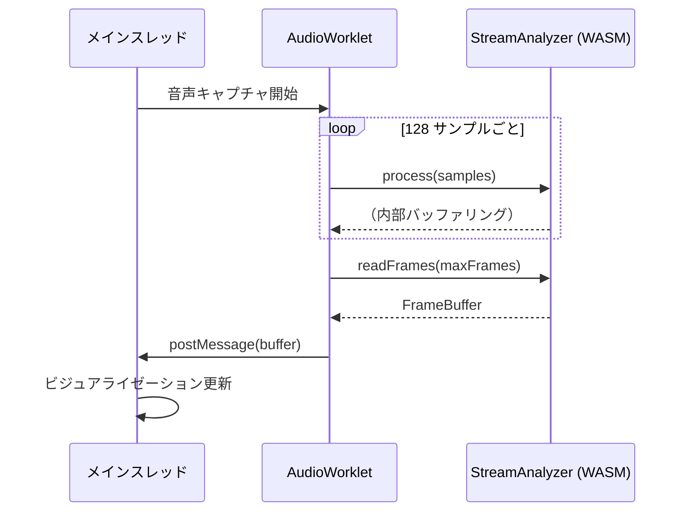

# JavaScript/TypeScript API リファレンス

libsonare JavaScript/TypeScript インターフェースの完全な API リファレンス。

## 概要

libsonare は Web アプリケーション向けのオーディオ解析、マスタリング、ミキシング、編集 DSP を提供します。npm パッケージは WebAssembly ビルドで、デコード済みの `Float32Array` サンプルを受け取ります。ファイルデコーダは含みません。

| カテゴリ | 関数 | ユースケース |
|----------|-----------|-----------|
| **クイック解析** | `detectBpm`, `detectKey`, `detectBeats` | DJアプリ、音楽プレイヤー、ビート同期 |
| **完全解析** | `analyze`, `analyzeWithProgress` | 音楽制作、楽曲メタデータ |
| **オーディオエフェクト** | `hpss`, `timeStretch`, `pitchShift` | リミックス、練習ツール |
| **特徴量** | `melSpectrogram`, `chroma`, `mfcc` | ML 入力、可視化 |
| **マスタリング** | `masterAudio`, `masteringChain`, `StreamingMasteringChain` | LUFS ターゲット、トゥルーピークリミッター、プリセット、ストリーミングチェーン |
| **ミキシング** | `mixStereo`, `Mixer`, `mixingScenePresetNames` | ステムミックス、ルーティング、オートメーション、メーター |
| **編集 DSP** | `pitchCorrectToMidi`, `noteStretch`, `voiceChange`, `StreamingRetune`, `RealtimeVoiceChanger` | ボーカル補正、ノート編集、ピッチ／フォルマント変更 |

::: tip 用語について
オーディオ解析が初めてですか？[用語集](/ja/docs/glossary) で BPM、STFT、Chroma などの用語の説明をご覧ください。
:::

::: info JavaScript API は「ファイル読み込み API」ではありません
ブラウザ版の多くの関数は、MP3 や WAV のパスではなく、デコード済みの PCM サンプルと `sampleRate` を受け取ります。`fetch` や `<input type="file">` で得たバイト列は、先に Web Audio API などで `AudioBuffer` に変換してから渡します。
:::

バインディングごとの機能対応は [機能マップ](./api-surface.md) を参照してください。マスタリングプロセッサの完全な登録一覧とミキシングシーン形式は、[マスタリングプロセッサ](./mastering-processors.md) と [ミキシングシーン JSON](./mixing-scene-json.md) にまとめています。

## このリファレンスの読み方

このページは 3 段階で読むと迷いにくくなります。

1. まず [目的から API を選ぶ](#目的から-api-を選ぶ) で、使う関数ファミリーを 1 つ選ぶ。
2. そのファミリーの節だけを読み、[使用例](./examples.md) から近いレシピを 1 つ動かす。
3. 戻り値の正確な形、オプション引数、実行環境間の違いが必要になったら、型定義や詳細表に戻る。

ブラウザアプリでは、`await init()` で WASM を初期化し、ファイルを先に PCM へデコードし、`Float32Array` サンプルと元の `sampleRate` を渡す、という基本を常に守ってください。

## 目的から API を選ぶ

関数数が多いため、まず「何を作りたいか」から最小の API を選ぶのが近道です。

| やりたいこと | 最初に使う API | 理由 |
|--------------|----------------|------|
| トラックのテンポ、キー、ビートだけ欲しい | `detectBpm`, `detectKey`, `detectBeats` | 完全解析を走らせず、必要な値だけを直接得られます |
| 曲全体のメタデータが欲しい | `analyze` または個別の `analyze*` ヘルパー | `analyze` は概要、個別ヘルパーは詳細向きです |
| ライブビジュアライザや逐次 BPM/キー/コード UI | `StreamAnalyzer` | ブロック処理して UI 用のフレームを読み出せます |
| ブラウザでマスタリングや配信プレビュー | `masterAudio*`, `masteringChain*`, `StreamingMasteringChain` | まずプリセット、必要に応じて名前付きプロセッサへ進めます |
| ステムのバランス、センド、バス、メーター | `mixStereo` または `Mixer` | まず一括レンダー、ルーティングが必要ならシーンミキサーを使います |
| ボーカルやノートを編集したい | `pitchCorrectToMidi`, `noteStretch`, `voiceChange`, `StreamingRetune`, `RealtimeVoiceChanger` | 解析ではなく音そのものを変える API です |
| 部屋の残響、明瞭度、等価ルーム推定、ルーム生成を扱いたい | `analyzeImpulseResponse`, `detectAcoustic`, `estimateRoom`, `synthesizeRir`, `roomMorph` | 楽曲ではなく録音空間を説明・適用します |

## インストール

::: code-group

```bash [npm]
npm install @libraz/libsonare
```

```bash [yarn]
yarn add @libraz/libsonare
```

```bash [pnpm]
pnpm add @libraz/libsonare
```

:::

## インポート

```typescript
import {
  init,
  detectBpm,
  detectKey,
  detectBeats,
  detectOnsets,
  analyze,
  analyzeWithProgress,
  version
} from '@libraz/libsonare';
```

## 初期化

### `init(options?)`

WASM モジュールを初期化します。解析関数を使用する前に呼び出す必要があります。

```typescript
async function init(options?: {
  locateFile?: (path: string, prefix: string) => string;
}): Promise<void>
```

**例:**

```typescript
import { init, detectBpm } from '@libraz/libsonare';

// 基本的な初期化
await init();

// カスタムファイルロケーション
await init({
  locateFile: (path, prefix) => `/custom/wasm/path/${path}`
});
```

### `isInitialized()`

モジュールが初期化済みかどうかを確認します。

```typescript
function isInitialized(): boolean
```

### `version()`

ライブラリのバージョンを取得します。

```typescript
function version(): string  // 例: "{{ wasmMeta.version }}"
```

### `voiceChangerAbiVersion()`

ネイティブ／FFI の公開 API が使う、リアルタイムボイスチェンジャーの POD 設定 ABI バージョンを返します。これはプリセット JSON の `schemaVersion` とは別物です。プリセット JSON は現在 `1` で、ユーザー作成プリセットを受け入れる前に `validateRealtimeVoiceChangerPresetJson(...)` で検証してください。

```typescript
function voiceChangerAbiVersion(): number
```

### ボイスプリセットアクセサ

プリセット JSON を解析せずに、正規の voice-character プリセット ID や解決済みのフラットな POD 設定が必要なときに使います。

```typescript
function voiceCharacterPresetId(preset: VoicePresetId | number): string | null
function realtimeVoiceChangerPresetConfig(preset: VoicePresetId | number): RealtimeVoiceChangerPodConfig | null
```

### リアルタイム環境ヘルパー

これらは [`RealtimeEngine`](./realtime-streaming.md#realtimeengine) が使う実行環境の公開範囲を確認するためのヘルパーです。AudioWorklet / SharedArrayBuffer 経路を接続する前に、ページの分離ポリシーやブラウザ差分を確認できます。

```typescript
function engineAbiVersion(): number
function engineCapabilities(): {
  engineAbiVersion: number;
  expectedEngineAbiVersion: number;
  abiCompatible: boolean;
  sharedArrayBuffer: boolean;
  atomics: boolean;
  audioWorklet: boolean;
  mode: 'sab' | 'postMessage';
}
function hasFfmpegSupport(): boolean
```

`hasFfmpegSupport()` は、読み込まれたビルドが FFmpeg 経由のデコードに対応しているかを返します。ブラウザ向け WASM npm パッケージはデコード済み PCM を扱うため通常 `false` で、ファイルの直接デコードは Python/native ビルド側で行います。

## 解析関数

### `detectBpm(samples, sampleRate)`

オーディオサンプルから BPM (テンポ) を検出します。

::: info ユースケース
- **DJ ソフトウェア**: トラック間のテンポをマッチングしてシームレスなミキシング
- **音楽プレイヤー**: テンポ情報の表示、テンポ別プレイリストの自動生成
- **フィットネスアプリ**: ワークアウト強度に合わせた音楽選択
- **ビート同期**: ビジュアライゼーションやアニメーションを音楽に同期
:::

```typescript
function detectBpm(samples: Float32Array, sampleRate: number): number
```

| パラメータ | 型 | 説明 |
|-----------|------|-------------|
| `samples` | `Float32Array` | モノラルオーディオサンプル (範囲 -1.0 〜 1.0) |
| `sampleRate` | `number` | サンプルレート (Hz) (例: 44100) |

**戻り値:** 検出された BPM の数値。

```typescript
const bpm = detectBpm(samples, sampleRate);
console.log(`BPM: ${bpm}`);
```

### `detectKey(samples, sampleRate)`

オーディオサンプルから音楽キーを検出します。ルート音（C, D, E...）とモード（メジャー/マイナー）を返します。

::: info ユースケース
- **ハーモニックミキシング**: DJがスムーズなトランジションのためにキーをマッチング（カメロットホイール）
- **移調**: ボーカルレンジに合わせたキー変更の提案
- **音楽レコメンデーション**: 互換性のあるキーの曲を検索
- **練習ツール**: ミュージシャンが一緒に演奏するためのキー表示
:::

```typescript
function detectKey(samples: Float32Array, sampleRate: number): Key
```

**戻り値:** `Key` オブジェクト

```typescript
interface Key {
  root: PitchClass;      // 0-11 (C=0, B=11)
  mode: Mode;            // Major、Minor、またはモード値。Mode enum 参照
  confidence: number;    // 0.0 〜 1.0
  name: string;          // "C major", "A minor"
  shortName: string;     // "C", "Am"
}

const KeyProfile = {
  KrumhanslSchmuckler: 0,
  Temperley: 1,
  Shaath: 2,
  FaraldoEDMT: 3,
  FaraldoEDMA: 4,
  FaraldoEDMM: 5,
  BellmanBudge: 6,
} as const;
```

```typescript
const key = detectKey(samples, sampleRate);
console.log(`キー: ${key.name}`);
console.log(`信頼度: ${(key.confidence * 100).toFixed(1)}%`);
```

### `detectBeats(samples, sampleRate)`

オーディオサンプルからビート時刻を検出します。各ビートの推定タイムスタンプを返します。

::: info ユースケース
- **音楽ビジュアライゼーション**: 各ビートでエフェクトをトリガー
- **リズムゲーム**: オーディオからノートチャートを生成
- **動画編集**: ビートに合わせた自動カット
- **ループ作成**: 完璧なループポイントを見つける
:::

```typescript
function detectBeats(samples: Float32Array, sampleRate: number): Float32Array
```

**戻り値:** 秒単位のビート時刻の Float32Array

### `detectOnsets(samples, sampleRate)`

オーディオサンプルからオンセット時刻（音の立ち上がり）を検出します。ビートより細かい粒度 - すべての音をキャプチャ。

::: info ユースケース
- **ドラム採譜**: 個々のドラムヒットを検出
- **オーディオからMIDI**: オーディオをノートイベントに変換
- **サンプルスライシング**: トランジェントで自動的にオーディオをセグメント化
:::

```typescript
function detectOnsets(samples: Float32Array, sampleRate: number): Float32Array
```

### `analyze(samples, sampleRate)` <Badge type="warning" text="高負荷" />

完全な音楽解析を実行します。BPM、キー、ビート、コード、セクション、音色などを返します。

::: info ユースケース
- **音楽ライブラリ管理**: 楽曲にメタデータを自動タグ付け
- **音楽制作**: リファレンストラックの解析
- **DJ準備**: すべてのトラック情報を一度に取得
- **音楽教育**: 楽曲構造の学習
:::

::: tip パフォーマンス
これは最も重い API です。長いオーディオファイル（3分以上）の場合は、`analyzeWithProgress` を使用して進捗を表示するか、関連するセグメントのみを解析することを検討してください。
:::

```typescript
function analyze(samples: Float32Array, sampleRate: number): AnalysisResult
```

**戻り値:** 完全な `AnalysisResult`。`analyze()` を 1 回呼ぶだけで、コード、セクション、音色、ダイナミクス、リズム、メロディ、楽曲形式、拍ごとの強度まで含む完全な結果が、どのバインディングでも返ります。そのため、1 つのフィールドだけが欲しい場合を除き、個別のヘルパーを使う必要はほとんどありません。

```typescript
const result = analyze(samples, sampleRate);
console.log(`BPM: ${result.bpm}`);
console.log(`キー: ${result.key.name}`);
console.log(`コード数: ${result.chords.length}`);
console.log(`楽曲形式: ${result.form}`);
```

### `analyzeWithProgress(samples, sampleRate, onProgress)` <Badge type="warning" text="高負荷" />

進捗レポート付きで完全な音楽解析を実行します。

```typescript
function analyzeWithProgress(
  samples: Float32Array,
  sampleRate: number,
  onProgress: (progress: number, stage: string) => void
): AnalysisResult
```

**進捗ステージ:**

| ステージ | 説明 | 進捗 |
|---------|------|------|
| `"features"` | 特徴量の事前計算 | 0.0 |
| `"bpm"` | BPM 検出 | 0.15 |
| `"key"` | キー検出 | 0.15 |
| `"beats"` | ビートトラッキング | 0.25 |
| `"chords"` | コード認識 | 0.40 |
| `"sections"` | セクション検出 | 0.55 |
| `"timbre"` | 音色解析 | 0.70 |
| `"dynamics"` | ダイナミクス解析 | 0.80 |
| `"rhythm"` | リズム解析 | 0.90 |
| `"complete"` | 完了 | 1.0 |

### 目的別の詳細解析ヘルパー

`analyze(...)` が広すぎる、または逆に詳細が足りない場合は、個別の解析ヘルパーを使います。入力は同じくモノラルの `Float32Array` ですが、高レベル API では隠れている設定を渡せます。

| 目的 | 関数 | 補足 |
|------|------|------|
| ダウンビート／小節頭 | `detectDownbeats(samples, sampleRate)` | 秒単位の小節頭候補。`detectBeats` と組み合わせるとグリッド表示に向きます。 |
| キー候補の順位付き一覧 | `detectKeyCandidates(samples, sampleRate, options?)` | トップ候補が曖昧な曲や、モード・プロファイルを絞りたい場合に使います。 |
| 詳細なテンポ候補 | `analyzeBpm(samples, sampleRate, ...)` | 最良 BPM だけでなく、候補とテンポ根拠を返します。 |
| リズム傾向 | `analyzeRhythm(samples, sampleRate, ...)` | グルーヴ、シンコペーション、規則性を見ます。 |
| ダイナミクス | `analyzeDynamics(samples, sampleRate, ...)` | ダイナミックレンジ、ラウドネスレンジ、クレストファクター、圧縮傾向を見ます。 |
| 音色 | `analyzeTimbre(samples, sampleRate, ...)` | ブライトネス、ウォームス、密度、粗さ、複雑さを返します。 |
| コード | `detectChords(samples, sampleRate, options?)` | コード区間を `{ chords }` として返します。HMM 平滑化、キー文脈、転回形、`chromaMethod: 'stft' \| 'nnls'` を指定できます。 |
| セクション | `analyzeSections(samples, sampleRate, ...)` | イントロ、ヴァース、コーラス、ブリッジ、アウトロなどの構造を推定します。 |
| メロディ | `analyzeMelody(samples, sampleRate, ...)` | ピッチ追跡ベースの単音メロディ輪郭です。 |

```typescript
const keys = detectKeyCandidates(samples, sampleRate, {
  modes: [Mode.Major, Mode.Minor],
  profile: 'krumhansl',
  genreHint: 'pop',
});

const { chords } = detectChords(samples, sampleRate, {
  useHmm: true,
  useKeyContext: true,
  keyRoot: keys[0].key.root,
  keyMode: keys[0].key.mode,
  chromaMethod: 'nnls',
});

const sections = analyzeSections(samples, sampleRate);
```

### `chordFunctionalAnalysis(samples, keyRoot, keyMode, sampleRate?, options?)`

指定したキーを基準に、検出されたコード進行を機能（ローマ数字）和声解析します。内部でコード検出を実行し、検出された各コードにラベルを付けるため、`detectKey(...)` から得た `keyRoot`／`keyMode` と、`detectChords(...)` に渡すのと同じ `options` をそのまま渡します。

```typescript
function chordFunctionalAnalysis(
  samples: Float32Array,
  keyRoot: PitchClass,
  keyMode: Mode,
  sampleRate?: number,
  options?: ChordDetectionOptions,
): string[]   // 検出されたコードごとに 1 つのローマ数字ラベル。例: ["I", "IV", "V", "vi"]
```

```typescript
const key = detectKey(samples, sampleRate);
const roman = chordFunctionalAnalysis(samples, key.root, key.mode, sampleRate);
console.log(roman);  // 例: ["I", "IV", "V", "vi"]
```

`detectKey(...)` と `detectKeyCandidates(...)` は同じ `KeyDetectionOptions` を受け取ります。

| グループ | 値 |
|----------|----|
| 制御項目 | `modes`, `profile`, `genreHint`, `useHpss`, `loudnessWeighted`, `highPassHz` |
| プロファイル名 | `ks`, `krumhansl`, `temperley`, `shaath`, `keyfinder`, `faraldo-edmt` / `edmt`, `faraldo-edma` / `edma`, `faraldo-edmm` / `edmm`, `bellman-budge` / `bellman` |
| ジャンルヒント | `auto`, `edm`, `electronic`, `dance`, `pop`, `classical`, `jazz` |

## ルーム音響解析

これらの関数は、曲そのものではなく録音空間を説明・適用する API です。

| 目的 | 使う API |
|------|----------|
| きれいなインパルスレスポンスを測る | `analyzeImpulseResponse(...)` |
| 通常音声から部屋の減衰を推定する | `detectAcoustic(...)` |
| 音声から実用的な部屋モデルを推定する | `estimateRoom(...)` |
| 寸法からモノラルのルームインパルスレスポンスを作る | `synthesizeRir(...)` |
| 目標ルームの響きを音作り効果として足す | `roomMorph(...)` |

::: info RIR とルームモーフィング
**RIR** は room impulse response の略で、部屋が短い音にどう反応するかを表すサンプル列です。`roomMorph(...)` は音作り効果であり、残響除去ではありません。
:::

```typescript
const ir = analyzeImpulseResponse(impulseResponseSamples, sampleRate, 6);
console.log(ir.rt60, ir.edt, ir.c50, ir.c80, ir.confidence);

const blind = detectAcoustic(roomRecording, sampleRate, {
  nOctaveBands: 6,
  nThirdOctaveSubbands: 24,
  minDecayDb: 30,
  noiseFloorMarginDb: 10,
});
console.log(blind.isBlind, blind.rt60Bands);

const estimate = estimateRoom(roomRecording, sampleRate, {
  referenceAbsorption: 0.15,
  nOctaveBands: 6,
});
console.log(estimate.volume, estimate.length, estimate.width, estimate.height);
console.log(estimate.drrDb, estimate.confidence, estimate.absorptionBands);

const rir = synthesizeRir({ lengthM: 7, widthM: 5, heightM: 3, absorption: 0.2 });
console.log(rir.sampleRate, rir.rir.length, rir.hasError);

const morphed = roomMorph(samples, sampleRate, { lengthM: 12, widthM: 9, heightM: 4, wet: 0.6 });
```

RT60、EDT、C50、C80、D50、バンド別配列、ルーム推定、生成 RIR、信頼度の読み方は [ルーム音響解析](./acoustic-analysis.md) を参照してください。

## オーディオエフェクト

### `hpss(samples, sampleRate, kernelHarmonic?, kernelPercussive?)` <Badge type="warning" text="高負荷" />

HPSS（Harmonic / Percussive Source Separation。倍音成分／打撃成分の分離）。音源を倍音成分（ボーカル、シンセなどの持続音）と打撃成分（ドラム、過渡音）に分離します。

::: info ユースケース
- **リミックス**: ドラムを分離または除去する
- **カラオケ**: ボーカルを除去してインストゥルメンタルを取り出す（倍音成分を使用）
- **解析精度の向上**: クリーンなコード検出のために倍音成分のみを使う
- **ドラム抽出**: サンプリング用に打撃成分だけを取り出す
:::

::: tip パフォーマンス
HPSS は STFT とメディアンフィルタリングを必要とします。処理時間は音源の長さに比例します。
:::

```typescript
function hpss(
  samples: Float32Array,
  sampleRate: number,
  kernelHarmonic?: number,    // デフォルト: 31
  kernelPercussive?: number   // デフォルト: 31
): HpssResult

interface HpssResult {
  harmonic: Float32Array;
  percussive: Float32Array;
  sampleRate: number;
}
```

### `harmonic(samples, sampleRate)` <Badge type="warning" text="高負荷" />

音源から倍音成分を抽出します。

```typescript
function harmonic(samples: Float32Array, sampleRate: number): Float32Array
```

### `percussive(samples, sampleRate)` <Badge type="warning" text="高負荷" />

音源から打撃成分を抽出します。

```typescript
function percussive(samples: Float32Array, sampleRate: number): Float32Array
```

### `timeStretch(samples, sampleRate, rate)` <Badge type="warning" text="高負荷" />

ピッチを変えずにテンポを変更します。Rate < 1.0 = 遅く、> 1.0 = 速く。

::: info ユースケース
- **練習ツール**: 難しいパッセージを学ぶために音楽をスローダウン
- **DJミキシング**: トラック間のテンポをマッチング
- **ポッドキャスト編集**: スピーチの速度調整
- **音楽制作**: サンプルをプロジェクトのテンポに合わせる
:::

::: tip パフォーマンス
フェーズボコーダーアルゴリズムを使用。処理時間はオーディオの長さに比例します。
:::

```typescript
function timeStretch(
  samples: Float32Array,
  sampleRate: number,
  rate: number   // 0.5 = 半速、2.0 = 倍速
): Float32Array
```

### `pitchShift(samples, sampleRate, semitones)` <Badge type="warning" text="高負荷" />

長さを変えずにピッチを変更します。半音単位で測定（+12 = 1オクターブ上）。

::: info ユースケース
- **キーマッチング**: ミキシング用に曲を移調
- **ボーカルチューニング**: ボーカルピッチの補正や調整
- **クリエイティブエフェクト**: ハーモニー作成、チップマンク/ディープボイスエフェクト
- **楽器練習**: 演奏しやすいキーに移調
:::

::: tip パフォーマンス
タイムストレッチとリサンプリングを組み合わせます。処理時間はオーディオの長さに比例します。
:::

```typescript
function pitchShift(
  samples: Float32Array,
  sampleRate: number,
  semitones: number   // +12 = 1オクターブ上
): Float32Array
```

### 編集 DSP

これらの関数は解析だけでなく、信号そのものを変更します。`Audio` インスタンスメソッドとしても利用でき、その場合は保持している `sampleRate` が自動的に使われます。

```typescript
function pitchCorrectToMidi(
  samples: Float32Array,
  sampleRate: number,
  currentMidi: number,
  targetMidi: number,
): Float32Array

// 追跡したピッチ輪郭を、フレーム単位で固定のターゲット音にリチューンします。
// f0Hz は hopLength に揃えたフレームごとの f0 トラック（例: pitchYin/pitchPyin の出力）です。
// 対応する voicedFlag/voicedProb 配列を渡すと無声音フレームをスキップでき、
// 無声音または NaN のフレームはそのまま残ります。
function pitchCorrectToMidiTimevarying(
  samples: Float32Array,
  f0Hz: Float32Array,
  targetMidi: number,
  sampleRate: number,
  hopLength: number,
  voicedFlag?: Int32Array,
  voicedProb?: Float32Array,
): Float32Array

function noteStretch(
  samples: Float32Array,
  sampleRate: number,
  options?: {
    onsetSample?: number,    // ノートのオンセット位置（サンプル）
    offsetSample?: number,   // ノートのオフセット位置（サンプル）
    stretchRatio?: number,   // >1 で区間を長くし、<1 で短くする
  },
): Float32Array

function voiceChange(
  samples: Float32Array,
  sampleRate: number,
  options?: {
    pitchSemitones?: number,  // 負の値で下げる。既定 0
    formantFactor?: number,   // >1 で明るく、<1 で暗く。既定 1.0
  },
): Float32Array
```

対応する CLI 例:

```bash
sonare pitch-correct vocal.wav --current-midi 68.7 --target-midi 69 -o corrected.wav
sonare note-stretch take.wav --onset 12000 --offset 24000 --ratio 1.25 -o held.wav
sonare voice-change vocal.wav --pitch-semitones 3 --formant-factor 1.05 -o voice.wav
```

### `normalize(samples, sampleRate, targetDb?)`

オーディオを目標ピークレベルに正規化します。

```typescript
function normalize(
  samples: Float32Array,
  sampleRate: number,
  targetDb?: number   // デフォルト: 0.0 (フルスケール)
): Float32Array
```

### `trim(samples, sampleRate, thresholdDb?)`

オーディオの始めと終わりから無音を除去します。

```typescript
function trim(
  samples: Float32Array,
  sampleRate: number,
  thresholdDb?: number   // デフォルト: -60.0
): Float32Array
```

これは `Audio` レベルの単純なしきい値トリムです。librosa 互換の
フレーム RMS / `topDb` ベースの無音判定と、元音源上の開始・終了サンプル位置が
必要な場合は、下の `trimSilence(...)` を使います。

## 特徴抽出

### `stft(samples, sampleRate, nFft?, hopLength?)` <Badge type="info" text="中負荷" />

短時間フーリエ変換（STFT）を計算します。

```typescript
function stft(
  samples: Float32Array,
  sampleRate: number,
  nFft?: number,      // デフォルト: 2048
  hopLength?: number  // デフォルト: 512
): StftResult

interface StftResult {
  nBins: number;
  nFrames: number;
  nFft: number;
  hopLength: number;
  sampleRate: number;
  magnitude: Float32Array;
  power: Float32Array;
}
```

### `stftDb(samples, sampleRate, nFft?, hopLength?)` <Badge type="info" text="中負荷" />

STFT を計算し、dB スケールで返します。

```typescript
function stftDb(
  samples: Float32Array,
  sampleRate: number,
  nFft?: number,      // デフォルト: 2048
  hopLength?: number  // デフォルト: 512
): { nBins: number; nFrames: number; db: Float32Array }
```

### `melSpectrogram(samples, sampleRate, nFft?, hopLength?, nMels?)` <Badge type="info" text="中負荷" />

メルスペクトログラムを計算します。人間のピッチ知覚に合わせた周波数表現。

::: info ユースケース
- **機械学習**: ジャンル分類、ムード検出の入力
- **可視化**: オーディオプレイヤー用の周波数スペクトログラム作成
- **類似度検索**: スペクトル内容で曲を比較
- **音声解析**: スピーチパターンと特性の解析
:::

```typescript
function melSpectrogram(
  samples: Float32Array,
  sampleRate: number,
  nFft?: number,      // デフォルト: 2048
  hopLength?: number, // デフォルト: 512
  nMels?: number,     // デフォルト: 128
  fmin?: number,      // デフォルト: 0（librosa の既定）
  fmax?: number,      // デフォルト: 0 = sampleRate / 2
  htk?: boolean       // デフォルト: false = Slaney 式。true で HTK
): MelSpectrogramResult

interface MelSpectrogramResult {
  nMels: number;
  nFrames: number;
  sampleRate: number;
  hopLength: number;
  power: Float32Array;
  db: Float32Array;
}
```

### `mfcc(samples, sampleRate, nFft?, hopLength?, nMels?, nMfcc?)` <Badge type="info" text="中負荷" />

MFCC（メル周波数ケプストラム係数）を計算します。スペクトル包絡のコンパクトな表現。

::: info ユースケース
- **音声認識**: 音声テキスト変換システムの標準入力
- **話者識別**: 誰が話しているかを識別
- **音色解析**: 楽器/音声の質を特徴付け
- **オーディオフィンガープリンティング**: コンパクトな楽曲署名の作成
:::

```typescript
function mfcc(
  samples: Float32Array,
  sampleRate: number,
  nFft?: number,      // デフォルト: 2048
  hopLength?: number, // デフォルト: 512
  nMels?: number,     // デフォルト: 128
  nMfcc?: number,     // デフォルト: 20
  fmin?: number,      // デフォルト: 0（librosa の既定）
  fmax?: number,      // デフォルト: 0 = sampleRate / 2
  htk?: boolean       // デフォルト: false = Slaney 式。true で HTK
): MfccResult

`fmin`／`fmax` で Mel 帯域の端を制限でき、`htk: true` で Slaney ではなく HTK の Mel 式を使います。逆変換ヘルパー（`melToStft`、`melToAudio`、`mfccToAudio`）も対応する `fmin`／`fmax`／`htk` 引数を取るため、両側で同じ値を保てば往復しても結果が一致します。

interface MfccResult {
  nMfcc: number;
  nFrames: number;
  coefficients: Float32Array;
}
```

### `chroma(samples, sampleRate, nFft?, hopLength?)` <Badge type="info" text="中負荷" />

クロマグラム（ピッチクラス分布）を計算します。すべての周波数を12のピッチクラス（C, C#, D, ..., B）にマッピング。

::: info ユースケース
- **コード検出**: 演奏されているコードを識別
- **キー検出**: ピッチ分布から曲のキーを決定
- **カバー曲検出**: テンポ/キーに関係なく曲をマッチング
- **音楽類似度**: トラック間のハーモニック内容を比較
:::

```typescript
function chroma(
  samples: Float32Array,
  sampleRate: number,
  nFft?: number,      // デフォルト: 2048
  hopLength?: number  // デフォルト: 512
): ChromaResult

interface ChromaResult {
  nChroma: number;        // 12
  nFrames: number;
  sampleRate: number;
  hopLength: number;
  features: Float32Array;
  meanEnergy: number[];   // [12] ピッチクラスごと
}
```

### スペクトル特徴

```typescript
// スペクトル重心 (Hz)
function spectralCentroid(samples, sampleRate, nFft?, hopLength?): Float32Array

// スペクトル帯域幅 (Hz)
function spectralBandwidth(samples, sampleRate, nFft?, hopLength?): Float32Array

// スペクトルロールオフ (Hz)
function spectralRolloff(samples, sampleRate, nFft?, hopLength?, rollPercent?): Float32Array

// スペクトル平坦度 (0=調性的, 1=ノイズ的)
function spectralFlatness(samples, sampleRate, nFft?, hopLength?): Float32Array

// スペクトルコントラスト行列、形状は (nBands + 1) x nFrames
function spectralContrast(samples, sampleRate?, nFft?, hopLength?, nBands?, fmin?, quantile?): Matrix2dResult

// フレームごとの多項式スペクトル係数、形状は (order + 1) x nFrames
function polyFeatures(samples, sampleRate?, nFft?, hopLength?, order?): Matrix2dResult

// ゼロ交差率
function zeroCrossingRate(samples, sampleRate, frameLength?, hopLength?): Float32Array

// 波形がゼロを横切るサンプル位置
function zeroCrossings(samples, threshold?, refMagnitude?, pad?, zeroPos?): Int32Array

// RMSエネルギー
function rmsEnergy(samples, sampleRate, frameLength?, hopLength?): Float32Array
```

### CQT / VQT / NNLS クロマ / 逆変換 / ラウドネス

これらは単なる追加特徴量ではなく、目的が違います。

| 目的 | 使う API | 理由 |
|------|----------|------|
| 音楽的なピッチ軸の表現 | `cqt(...)` | オクターブ方向に音高と対応しやすい Constant-Q 表現です。 |
| 帯域幅を調整したピッチ表現 | `vqt(...)` | CQT に近く、低域の安定性を調整できます。 |
| コード検出向けのクロマ | `nnlsChroma(...)` | STFT クロマよりコード推定に向いたノート活性が得られる場合があります。 |
| スペクトル形状の詳細 | `spectralContrast(...)`, `polyFeatures(...)`, `zeroCrossings(...)` | librosa 互換のコントラスト帯域、多項式係数、ゼロ交差インデックスを返します。 |
| ピッチ／チューニングずれ | `pitchTuning(...)`, `estimateTuning(...)` | 検出済み周波数または音声から、ビン単位のチューニングずれを推定します。 |
| 分解とリミックス | `decompose(...)`, `nnFilter(...)`, `remix(...)`, `phaseVocoder(...)`, `hpssWithResidual(...)` | NMF 分解、近傍フィルタ、区間リミックス、時間スケーリング、残差付き HPSS。 |
| 特徴量や音声の近似復元 | `melToStft`, `melToAudio`, `mfccToMel`, `mfccToAudio` | 可視化、デバッグ、特徴量の往復確認に使います。 |
| 配信向けラウドネス測定 | `lufs`, `lufsInterleaved`, `momentaryLufs`, `shortTermLufs`, `ebur128LoudnessRange` | ITU-R BS.1770 / EBU R128 系のラウドネス値。マルチチャンネル Integrated LUFS と LRA も含みます。 |

```typescript
const cqtResult = cqt(samples, sampleRate, 512, 32.7, 84, 12);
const nnls = nnlsChroma(samples, sampleRate);
const loudness = lufs(samples, sampleRate);

const contrast = spectralContrast(samples, sampleRate);
const poly = polyFeatures(samples, sampleRate);
const crossings = zeroCrossings(samples);
const tuning = estimateTuning(samples, sampleRate);
const offset = pitchTuning(pitch.f0);
const { w, h } = decompose(spectrogram, nFeatures, nFrames, 8);
const filtered = nnFilter(spectrogram, nFeatures, nFrames);
const remixed = remix(samples, Int32Array.from([0, sampleRate, sampleRate, 2 * sampleRate]));
const stretched = phaseVocoder(samples, 1.5, sampleRate);
const hpssResidual = hpssWithResidual(samples, sampleRate);
const multichannel = lufsInterleaved(interleavedStereo, 2, sampleRate);
const lra = ebur128LoudnessRange(samples, sampleRate);
const reconstructed = melToAudio(mel.power, mel.nMels, mel.nFrames, sampleRate);
```

ソースビルド C++ CLI で近いコマンド:

```bash [C++ CLI]
sonare cqt song.wav
sonare vqt song.wav
sonare nnls-chroma song.wav
sonare lufs song.wav --json
sonare mel-to-audio song.wav -o mel-preview.wav
```

復元の制約とパラメータは [逆変換特徴量](./inverse-features.md)、librosa 互換の詳細は [librosa 互換性](./librosa-compatibility.md) を参照してください。

### ピッチ検出 <Badge type="info" text="中負荷" />

```typescript
// YIN アルゴリズム
function pitchYin(
  samples: Float32Array,
  sampleRate: number,
  frameLength?: number,  // デフォルト: 2048
  hopLength?: number,    // デフォルト: 512
  fmin?: number,         // デフォルト: 65 Hz
  fmax?: number,         // デフォルト: 2093 Hz
  threshold?: number,    // デフォルト: 0.3
  fillNa?: boolean       // デフォルト: false。true なら無声音 f0 フレームを 0 にする
): PitchResult

// pYIN アルゴリズム（確率的 YIN + HMM 平滑化）
function pitchPyin(
  samples: Float32Array,
  sampleRate: number,
  frameLength?: number,
  hopLength?: number,
  fmin?: number,
  fmax?: number,
  threshold?: number,
  fillNa?: boolean       // デフォルト: false。true なら無声音 f0 フレームを 0 にする
): PitchResult

interface PitchResult {
  f0: Float32Array;
  voicedProb: Float32Array;
  voicedFlag: boolean[];
  nFrames: number;
  medianF0: number;
  meanF0: number;
}
```

既定では無声音の `f0` フレームは `NaN` のままです。後段の数値処理が `NaN` を扱えず、無声音を `0` として扱いたい場合だけ `fillNa: true` を指定します。

## 単位変換

これらの関数は軽量で高速です。

```typescript
// Hz <-> Mel (Slaney 式)
function hzToMel(hz: number): number
function melToHz(mel: number): number

// Hz <-> MIDI ノート番号 (A4 = 440 Hz = 69)
function hzToMidi(hz: number): number
function midiToHz(midi: number): number

// Hz <-> ノート名
function hzToNote(hz: number): string      // "A4", "C#5"
function noteToHz(note: string): number

// 時間 <-> フレーム
function framesToTime(frames: number, sr: number, hopLength: number): number
function timeToFrames(time: number, sr: number, hopLength: number): number

// フレーム <-> サンプル (librosa.frames_to_samples / samples_to_frames 相当)
function framesToSamples(frames: number, hopLength?: number, nFft?: number): number
function samplesToFrames(samples: number, hopLength?: number, nFft?: number): number

// dB 変換（ベクトル）
function powerToDb(values: Float32Array, ref?: number, amin?: number, topDb?: number): Float32Array
function amplitudeToDb(values: Float32Array, ref?: number, amin?: number, topDb?: number): Float32Array
function dbToPower(values: Float32Array, ref?: number): Float32Array
function dbToAmplitude(values: Float32Array, ref?: number): Float32Array
```

## メータリング

デコード済みバッファから、レベル、ダイナミクス、ステレオイメージの統計値を返す単体メーターです。マスタリングチェーンやストリーミングエンジンとは独立しています。

`Float32Array`、またはステレオの左右ペアを渡すと、値またはレポートが返ります。

各関数は、`validate` フラグ（既定 `true`）を持つ `options` を任意で受け取ります。ホットパスでは `validate: false` を指定して、NaN/Inf 入力チェックを省略できます。

### 単一チャンネルのレベルメーター

```typescript
// サンプルピーク(dBFS)
function meteringPeakDb(samples: Float32Array, sampleRate?: number, options?: ValidateOptions): number
// RMS レベル(dBFS)
function meteringRmsDb(samples: Float32Array, sampleRate?: number, options?: ValidateOptions): number
// クレストファクター(ピーク − RMS、dB)
function meteringCrestFactorDb(samples: Float32Array, sampleRate?: number, options?: ValidateOptions): number
// 平均(DC)オフセット(リニア振幅)
function meteringDcOffset(samples: Float32Array, sampleRate?: number, options?: ValidateOptions): number
// インターサンプル(トゥルー)ピーク(dBFS)。oversampleFactor は 1..16 の 2 の冪(0 / 省略で 4)
function meteringTruePeakDb(samples: Float32Array, sampleRate?: number, oversampleFactor?: number, options?: ValidateOptions): number
```

### クリッピングとダイナミックレンジ

```typescript
function meteringDetectClipping(
  samples: Float32Array,
  sampleRate?: number,
  threshold?: number,         // 既定: 0.999
  minRegionSamples?: number,  // 既定: 1
  options?: ValidateOptions
): ClippingReport

function meteringDynamicRange(
  samples: Float32Array,
  sampleRate?: number,
  windowSec?: number,      // 0 / 省略で 3 秒
  hopSec?: number,         // 0 / 省略で 1 秒
  lowPercentile?: number,  // 0 / 省略で 0.10
  highPercentile?: number, // 0 / 省略で 0.95
  options?: ValidateOptions
): DynamicRangeReport

interface ClippingReport {
  clippedSamples: number;
  clippingRatio: number;
  maxClippedPeak: number;
  regions: ClippingRegion[];
}
interface ClippingRegion {
  startSample: number;
  endSample: number;
  length: number;
  peak: number;
}
interface DynamicRangeReport {
  dynamicRangeDb: number;
  lowPercentileDb: number;
  highPercentileDb: number;
  windowRmsDb: Float32Array;
}
```

### ステレオイメージ

```typescript
// チャンネル間のピアソン相関(−1..1)
function meteringStereoCorrelation(left: Float32Array, right: Float32Array, sampleRate?: number, options?: ValidateOptions): number
// ミッド/サイドのステレオ幅
function meteringStereoWidth(left: Float32Array, right: Float32Array, sampleRate?: number, options?: ValidateOptions): number
// サンプルごとのミッド/サイド点列
function meteringVectorscope(left: Float32Array, right: Float32Array, sampleRate?: number, options?: ValidateOptions): VectorscopeReport
// フェーズスコープの点列と要約統計
function meteringPhaseScope(left: Float32Array, right: Float32Array, sampleRate?: number, options?: ValidateOptions): PhaseScopeReport

interface VectorscopeReport {
  mid: Float32Array;
  side: Float32Array;
}
interface PhaseScopeReport {
  mid: Float32Array;
  side: Float32Array;
  radius: Float32Array;
  angleRad: Float32Array;
  correlation: number;
  averageAbsAngleRad: number;
  maxRadius: number;
}
```

`meteringStereoCorrelation`・`meteringStereoWidth`・`meteringVectorscope`・`meteringPhaseScope` は `left` と `right` が同じ長さである必要があります。

### スペクトラムスナップショット

```typescript
function meteringSpectrum(
  samples: Float32Array,
  sampleRate?: number,
  options?: SpectrumOptions & ValidateOptions
): SpectrumReport

interface SpectrumOptions {
  nFft?: number;                 // 0 / 省略で 2048
  applyOctaveSmoothing?: boolean;
  octaveFraction?: number;       // 例: 3 = 1/3 オクターブ。0 / 省略で 3
  dbRef?: number;                // 0 / 省略で 1.0
  dbAmin?: number;               // 0 / 省略でライブラリの下限値
}
interface SpectrumReport {
  frequencies: Float32Array;
  magnitude: Float32Array;
  power: Float32Array;
  db: Float32Array;
  nFft: number;
  sampleRate: number;
}
```

## スケール量子化

ピッチ補正のターゲットを構築するための 12-TET スケールヘルパーです。`modeMask` は 12 ビットのマスクで、ビット *i* が `root`(`PitchClass`、C = 0)を基準とした *i* 番目のピッチクラスを有効化します。自然な長調は `0b101010110101` です。`referenceMidi` はチューニングの基準音です(A4 = 69 にするには `0` を渡します)。

```typescript
// (小数を含む)MIDI 番号を最も近い有効なピッチクラスにスナップ
function scaleQuantizeMidi(root: number, modeMask: number, midi: number, referenceMidi?: number): number
// 補正量(量子化後 − 入力)をセミトーンで返す
function scaleCorrectionSemitones(root: number, modeMask: number, midi: number, referenceMidi?: number): number
// pitchClass(0..11)が root を基準に modeMask で有効か
function scalePitchClassEnabled(root: number, modeMask: number, pitchClass: number): boolean
```

`scaleQuantizeMidi(...)` を `pitchCorrectToMidi(...)` と組み合わせると、検出した音を最も近いスケール構成音へリチューンできます。

## librosa 互換ヘルパー

librosa 互換ヘルパー群です。対応する `librosa`
関数の挙動に合わせており、WASM・Node・Python すべてのバインディングから
利用できます。各ヘルパーが対応する librosa 関数は
[librosa 互換性](/ja/docs/librosa-compatibility) を参照してください。

::: tip 各ヘルパーの位置づけ
- **プリ／ディエンファシス** — 解析前の前処理。高域を持ち上げて／戻して S/N を改善する古典的な 1 タップ IIR フィルタです。
- **無音トリム／分割** — 音源の前後の無音をカットしたり、無音区間で区切ったりする実用処理です。
- **フレーミング／パディング** — STFT のような固定フレーム処理に通すために、波形を `frame_length` サンプルごとに切り出したり、サイズを揃えたりするためのユーティリティです。
- **ピーク検出／ベクトル正規化** — オンセット強度などの 1 次元信号からピークを拾ったり、ベクトルを目的のノルムで揃えたりする後処理です。
- **PCEN** — メルスペクトログラム向けの動的レンジ圧縮。ノイズや音量変動に強い特徴量を作るために使います。
- **Tonnetz** — クロマグラムを 6 次元のハーモニック空間に射影した特徴量。コード関係や転調の解析に向きます。
- **Tempogram / PLP** — オンセット包絡線からテンポ候補を時間方向に追える表現と、その上で支配的なパルスを取り出す手法です。
:::

### プリエンファシス／ディエンファシス

```typescript
function preemphasis(samples: Float32Array, coef?: number, zi?: number): Float32Array
function deemphasis(samples: Float32Array, coef?: number, zi?: number): Float32Array
```

`coef` の既定値は `0.97` です。ストリーミング処理で前ブロック末尾の値を
受け渡したい場合は `zi` に初期条件を指定します。

### 無音トリム／無音分割

```typescript
function trimSilence(
  samples: Float32Array,
  topDb?: number,        // 既定 60
  frameLength?: number,  // 既定 2048
  hopLength?: number,    // 既定 512
): { audio: Float32Array; startSample: number; endSample: number }

function splitSilence(
  samples: Float32Array,
  topDb?: number,
  frameLength?: number,
  hopLength?: number,
): Int32Array  // [start0, end0, start1, end1, ...] のフラット配列
```

`trimSilence` は `librosa.effects.trim` に対応します。フレーム RMS とピーク RMS
からの `topDb` 差で無音を判定し、トリム後の音声と元音源上の
`[startSample, endSample)` 範囲を返します。これは単純なしきい値トリムである
`trim(samples, sampleRate, thresholdDb)` とは別物です。`splitSilence` は
`librosa.effects.split` と同等で、非無音区間をサンプル単位の開始／終了ペアで返します。

### フレーミング／パディングのヘルパー

```typescript
function frameSignal(
  samples: Float32Array,
  frameLength: number,
  hopLength: number,
): { nFrames: number; frames: Float32Array }  // row-major

function padCenter(values: Float32Array, targetSize: number, padValue?: number): Float32Array
function fixLength(values: Float32Array, targetSize: number, padValue?: number): Float32Array
function fixFrames(frames: Int32Array, xMin?: number, xMax?: number, pad?: boolean): Int32Array
```

`frameSignal` は `librosa.util.frame`、`padCenter` / `fixLength` /
`fixFrames` は対応する librosa.util の同名関数と互換です。

### ピーク検出／ベクトル正規化

```typescript
function peakPick(
  values: Float32Array,
  preMax: number,
  postMax: number,
  preAvg: number,
  postAvg: number,
  delta: number,
  wait: number,
): Int32Array  // ピーク位置のインデックス

function vectorNormalize(
  values: Float32Array,
  normType?: number,  // 0=inf, 1=L1, 2=L2, 3=power（既定 0）
  threshold?: number, // 既定 1e-12
): Float32Array
```

`peakPick` は `librosa.util.peak_pick`、`vectorNormalize` は
`librosa.util.normalize` に対応します。

::: details `peakPick` のパラメータ
- `preMax` / `postMax` — 各候補点の前後 N サンプルの中で**最大値か**を判定する窓幅（局所最大判定）。
- `preAvg` / `postAvg` — 同じく前後 N サンプルの**平均値 + `delta`** を超えているかを判定する窓幅。
- `delta` — 平均からどれだけ突出していればピークと見なすかの閾値。値を上げるとピークが少なくなります。
- `wait` — 連続するピーク間の最小距離（サンプル数）。短すぎる二重ピークを抑止します。

オンセット強度（`detectOnsets` / `tempogram` などの入力に使う 1 次元信号）からピーク時刻を抽出する後処理用です。
:::

::: details `vectorNormalize` の `normType`
- `0` (**inf**, 既定) — 最大絶対値で割って `[-1, 1]` に収める。波形のピーク正規化に近い動作。
- `1` (**L1**) — 絶対値の総和で割る。確率分布のように正規化したいとき。
- `2` (**L2**) — 各成分を二乗和の平方根で割る。特徴ベクトル比較の前処理として一般的。
- `3` (**power**) — 二乗和そのもので割る（パワー正規化）。

`threshold` を指定するとそれ以下のノルムでは正規化をスキップし、ほぼ無音のフレームで値が暴れるのを防げます。
:::

### PCEN（チャンネル別エネルギー正規化）

```typescript
function pcen(
  values: Float32Array,
  nBins: number,
  nFrames: number,
  options?: {
    sampleRate?: number;
    hopLength?: number;
    timeConstant?: number;  // 既定 0.4
    gain?: number;          // 既定 0.98
    bias?: number;          // 既定 2.0
    power?: number;         // 既定 0.5
    eps?: number;           // 既定 1e-6
  },
): Float32Array
```

`pcen` は `librosa.pcen` 互換です。入力は row-major の
`[nBins x nFrames]` メルスペクトログラム、出力も同じレイアウトです。

### Tonnetz／Tempogram／PLP

```typescript
function tonnetz(
  chromagram: Float32Array,   // row-major [nChroma x nFrames]
  nChroma: number,
  nFrames: number,
): Float32Array               // [6 x nFrames]

function tempogram(
  onsetEnvelope: Float32Array,
  sampleRate: number,
  hopLength?: number,         // 既定 512
  winLength?: number,         // 既定 384
  mode?: 'autocorrelation' | 'auto' | 'ac' | 'cosine' | 0 | 1,  // 既定 'autocorrelation'
): { nFrames: number; winLength: number; data: Float32Array }

function fourierTempogram(
  onsetEnvelope: Float32Array,
  sampleRate?: number,
  hopLength?: number,
  winLength?: number,
): { nBins: number; nFrames: number; data: Float32Array }

function cyclicTempogram(
  onsetEnvelope: Float32Array,
  sampleRate: number,
  hopLength?: number,
  winLength?: number,
  bpmMin?: number,            // 既定 60
  nBins?: number,             // 既定 60
): { nFrames: number; nBins: number; data: Float32Array }

function tempogramRatio(
  tempogramData: Float32Array,
  winLength?: number,
  sampleRate?: number,
  hopLength?: number,
): Float32Array

function plp(
  onsetEnvelope: Float32Array,
  sampleRate: number,
  hopLength?: number,
  tempoMin?: number,          // 既定 30
  tempoMax?: number,          // 既定 300
  winLength?: number,
): Float32Array
```

これらのヘルパーは、librosa でよく使われるリズム／和声特徴量に対応します。

| ヘルパー | 意味 |
|----------|------|
| `tonnetz` | `librosa.feature.tonnetz` に対応 |
| `tempogram` | `librosa.feature.tempogram` に対応。既定は自己相関ベース |
| `fourierTempogram` | FFT ベースのテンポグラム |
| `cyclicTempogram` | テンポクラスをオクターブ畳み込みしたもの |
| `plp` | `librosa.beat.plp`（Predominant Local Pulse） |

`tempogram` では、`mode: 'cosine'` を渡すと窓内コサイン類似度の変種になります。下位バインディングとの互換のため、`'auto'`、`'ac'`、`0`、`1` の alias も受け付けます。

使い分けは [リアルタイムとストリーミング](./realtime-streaming.md#オンセット包絡からテンポグラムへ) を参照してください。

## リサンプリング

### `resample(samples, srcSr, targetSr)` <Badge type="info" text="中負荷" />

r8brain アルゴリズムを使用した高品質リサンプリング。

```typescript
function resample(
  samples: Float32Array,
  srcSr: number,
  targetSr: number
): Float32Array
```

## Audio クラス

`Audio` クラスは、スタンドアロン関数群をオブジェクト指向ラッパーとして提供します。サンプルとサンプルレートを内部で保持するため、各呼び出しで渡し直す必要がありません。

### `Audio.fromBuffer(samples, sampleRate)`

サンプルデータから Audio インスタンスを作成します。

```typescript
const audio = Audio.fromBuffer(samples, 44100);
```

`sampleRate` は省略可能で、既定は `48000` です。保持された値はすべてのインスタンスメソッドに渡されるため、必ずバッファ本来のサンプルレートを指定してください。

### プロパティ

| プロパティ | 型 | 説明 |
|----------|------|-------------|
| `audio.data` | `Float32Array` | サンプルデータ |
| `audio.length` | `number` | サンプル数 |
| `audio.sampleRate` | `number` | サンプルレート（Hz） |
| `audio.duration` | `number` | 長さ（秒） |

### インスタンスメソッド

`Audio` クラスは、よく使う単発ヘルパーをオブジェクト指向で呼ぶためのラッパーです。サンプルとサンプルレートを内部に保持するので、毎回渡す必要がありません。

`analyzeSections(...)`、`analyzeMelody(...)`、`analyzeDynamics(...)`、`analyzeTimbre(...)`、ルーム音響系の関数は、WASM ラッパーではスタンドアロン関数として呼び出します。

```typescript
import {
  init,
  Audio,
  analyzeSections,
  analyzeMelody,
  analyzeDynamics,
  analyzeTimbre,
  detectAcoustic,
} from '@libraz/libsonare';

await init();

const audio = Audio.fromBuffer(samples, 44100);

// 解析
const bpm = audio.detectBpm();
const key = audio.detectKey();
const keyCandidates = audio.detectKeyCandidates();
const beats = audio.detectBeats();
const downbeats = audio.detectDownbeats();
const onsets = audio.detectOnsets();
const result = audio.analyze();
const chords = audio.detectChords({ useHmm: true });
const sections = analyzeSections(audio.data, audio.sampleRate);
const melody = analyzeMelody(audio.data, audio.sampleRate);
const dynamics = analyzeDynamics(audio.data, audio.sampleRate);
const timbre = analyzeTimbre(audio.data, audio.sampleRate);
const acoustic = detectAcoustic(audio.data, audio.sampleRate);

// エフェクト
const { harmonic, percussive } = audio.hpss();
const corrected = audio.pitchCorrectToMidi(68.7, 69);
const held = audio.noteStretch({ onsetSample: 12000, offsetSample: 24000, stretchRatio: 1.25 });
const voice = audio.voiceChange({ pitchSemitones: 3, formantFactor: 1.05 });
const stretched = audio.timeStretch(1.5);
const shifted = audio.pitchShift(2);
const normalized = audio.normalize(-3.0);
const trimmed = audio.trim(-60.0);

// 特徴抽出
const stftResult = audio.stft();
const mel = audio.melSpectrogram();
const mfcc = audio.mfcc();
const chroma = audio.chroma();
const nnls = audio.nnlsChroma();
const env = audio.onsetEnvelope();
const loudness = audio.lufs();
const centroid = audio.spectralCentroid();
const bandwidth = audio.spectralBandwidth();
const rolloff = audio.spectralRolloff();
const flatness = audio.spectralFlatness();
const zcr = audio.zeroCrossingRate();
const rms = audio.rmsEnergy();
const pitch = audio.pitchPyin();

// リサンプリング
const resampled = audio.resample(22050);
```

引数のデフォルト値（`nFft`、`hopLength`、`nMels` など）はスタンドアロン関数と同じです。

## ストリーミング API

ストリーミング API は、リアルタイムの音声解析とビジュアライゼーションを可能にします。バッチ解析とは異なり、ストリーミングは音声をチャンクごとに処理し、低レイテンシを実現します。

::: tip 使い分け
- **バッチ API**: 録音済みファイル、完全解析（BPM、キー、コード、セクション）
- **ストリーミング API**: ライブ音声、ビジュアライゼーション、リアルタイムフィードバック
:::

### StreamConfig

StreamAnalyzer の設定オプション。

```typescript
interface StreamConfig {
  sampleRate: number;          // 例: 44100（ストリームの既定。22050 ではない）
  nFft?: number;               // デフォルト: 2048
  hopLength?: number;          // デフォルト: 512
  nMels?: number;              // デフォルト: 128
  fmin?: number;               // デフォルト: 0
  fmax?: number;               // デフォルト: 0（= sr/2）
  tuningRefHz?: number;        // デフォルト: 440
  computeMel?: boolean;        // デフォルト: true
  computeChroma?: boolean;     // デフォルト: true
  computeOnset?: boolean;      // デフォルト: true
  computeSpectral?: boolean;   // デフォルト: true
  emitEveryNFrames?: number;   // デフォルト: 1（スロットリングなし）
  magnitudeDownsample?: number;// デフォルト: 1
  keyUpdateIntervalSec?: number;  // デフォルト: 5
  bpmUpdateIntervalSec?: number;  // デフォルト: 10
  window?: number;             // 0=Hann（既定）, 1=Hamming, 2=Blackman, 3=Rectangular
  outputFormat?: number;       // 0=Float32（既定）, 1=Int16, 2=Uint8
}
```

`outputFormat` は `readFramesU8`／`readFramesI16` が出力時にどう量子化するかを
制御します（内部解析は常に float）。[リアルタイムとストリーミング](./realtime-streaming.md#フレームの読み出しと出力フォーマット) を参照してください。

旧来の `computeMagnitude` フラグはサポートされなくなり、指定するとコンストラクタが例外を投げます。マグニチュードのフレームは StreamAnalyzer の読み出し経路では公開されないため、このフラグは削除されました。マグニチュードのデータが必要な場合は、オフラインで `stft`／`stftDb` を使うか、スペクトラムメータリングのヘルパーを使ってください。

### StreamAnalyzer クラス

```typescript
class StreamAnalyzer {
  constructor(config: StreamConfig);

  // 音声チャンクを処理（内部オフセット追跡）
  process(samples: Float32Array): void;

  // 外部同期で処理
  processWithOffset(samples: Float32Array, sampleOffset: number): void;

  // 読み取り可能なフレーム数
  availableFrames(): number;

  // 処理済みフレームを読み取り（完全な float 精度）
  readFrames(maxFrames: number): FrameBuffer;

  // 帯域削減転送／可視化向けの量子化読み出し
  readFramesU8(maxFrames: number): StreamFramesU8;   // Uint8 特徴量配列
  readFramesI16(maxFrames: number): StreamFramesI16; // Int16 特徴量配列

  // 新しいストリーム用に状態をリセット
  reset(baseSampleOffset?: number): void;

  // 統計情報とプログレッシブ推定を取得
  stats(): AnalyzerStats;

  // 処理済みの総フレーム数
  frameCount(): number;

  // 現在の時間位置（秒）
  currentTime(): number;

  // サンプルレートを取得
  sampleRate(): number;

  // パターンロックタイミング用の予想総再生時間を設定
  setExpectedDuration(durationSeconds: number): void;

  // 大音量/圧縮音声用のノーマライゼーションゲインを設定
  setNormalizationGain(gain: number): void;

  // チューニング基準周波数を設定（デフォルト: 440 Hz）
  setTuningRefHz(refHz: number): void;

  // リソースを解放（使用終了時に呼び出し）。`delete()` が正規で、`dispose()` はその alias。
  delete(): void;
  dispose(): void;
}
```

### FrameBuffer

`postMessage` での効率的な転送用の Structure-of-Arrays 形式。

```typescript
interface FrameBuffer {
  nFrames: number;
  nMels: number;
  timestamps: Float32Array;      // [nFrames]
  mel: Float32Array;             // [nFrames * nMels]
  chroma: Float32Array;          // [nFrames * 12]
  onsetStrength: Float32Array;   // [nFrames]
  rmsEnergy: Float32Array;       // [nFrames]
  spectralCentroid: Float32Array;// [nFrames]
  spectralFlatness: Float32Array;// [nFrames]
  chordRoot: Int32Array;         // [nFrames] フレームごとのコードルート
  chordQuality: Int32Array;      // [nFrames] フレームごとのコードクオリティ
  chordConfidence: Float32Array; // [nFrames] フレームごとのコード信頼度
}
```

### ChordChange

検出されたコード変化。

```typescript
interface ChordChange {
  root: PitchClass;
  quality: ChordQuality;
  startTime: number;
  confidence: number;
}
```

### BarChord

小節境界で検出されたコード（ビート同期）。

```typescript
interface BarChord {
  barIndex: number;
  root: PitchClass;
  quality: ChordQuality;
  startTime: number;
  confidence: number;
}
```

### PatternScore

既知のコード進行パターンの一致スコア。

```typescript
interface PatternScore {
  name: string;   // パターン名（例: "royalRoad", "pop"）
  score: number;  // 一致スコア（0-1）
}
```

### AnalyzerStats

```typescript
interface AnalyzerStats {
  totalFrames: number;
  totalSamples: number;
  durationSeconds: number;
  estimate: ProgressiveEstimate;
}
```

### ProgressiveEstimate

処理された音声が増えるにつれて精度が向上する BPM、キー、コードの推定値。

```typescript
interface ProgressiveEstimate {
  // BPM 推定
  bpm: number;              // 未推定の場合は 0
  bpmConfidence: number;    // 0-1、時間とともに増加
  bpmCandidateCount: number;

  // キー推定
  key: PitchClass;          // 0-11（C-B）
  keyMinor: boolean;
  keyConfidence: number;    // 0-1、時間とともに増加

  // コード推定（現在）
  chordRoot: PitchClass;
  chordQuality: ChordQuality;
  chordConfidence: number;
  chordStartTime: number;
  chordProgression: ChordChange[];     // 検出されたコード変化
  barChordProgression: BarChord[];     // 小節同期コード
  currentBar: number;                  // 現在の小節インデックス
  barDuration: number;                 // 小節の長さ（秒）

  // パターン検出
  votedPattern: BarChord[];            // 各パターン位置の投票済みコード
  patternLength: number;              // 繰り返しパターンの長さ（デフォルト: 4小節）
  detectedPatternName: string;        // 最も一致するパターン名（例: "royalRoad"）
  detectedPatternScore: number;       // 一致スコア（0-1）
  allPatternScores: PatternScore[];   // 全既知パターンのスコア

  // 統計情報
  accumulatedSeconds: number;
  usedFrames: number;
  updated: boolean;         // このフレームで推定が更新された場合 true
}
```

### 基本的なストリーミング例

```typescript
import { init, StreamAnalyzer } from '@libraz/libsonare';

await init();

// 設定オブジェクトでアナライザーを作成
const analyzer = new StreamAnalyzer({
  sampleRate: 44100,
  nFft: 2048,
  hopLength: 512,
  nMels: 128,
  computeMel: true,
  computeChroma: true,
  computeOnset: true,
  emitEveryNFrames: 1
});

// 音声チャンクを処理（例: AudioWorklet から）
function processChunk(samples: Float32Array) {
  analyzer.process(samples);

  // 利用可能なフレームを読み取り
  const available = analyzer.availableFrames();
  if (available > 0) {
    const frames = analyzer.readFrames(available);

    // ビジュアライゼーションに使用
    updateVisualization(frames);

    // プログレッシブ推定をチェック
    const stats = analyzer.stats();
    if (stats.estimate.bpm > 0) {
      console.log(`BPM: ${stats.estimate.bpm.toFixed(1)}`);
      console.log(`キー: ${stats.estimate.key} ${stats.estimate.keyMinor ? 'マイナー' : 'メジャー'}`);
      console.log(`現在の小節: ${stats.estimate.currentBar}`);
      console.log(`コード進行:`, stats.estimate.chordProgression);
      console.log(`小節コード:`, stats.estimate.barChordProgression);
    }
  }
}

// 使用終了時にクリーンアップ（delete() が正規で、dispose() はその alias）
analyzer.delete();
```

::: details なぜ `dispose()` / `delete()` を呼ぶのか？（embind ハンドル）
`StreamAnalyzer`、`Mixer`、`StreamingMasteringChain` などのクラスは、**embind**（Emscripten の C++↔JS ブリッジ）を通じて JavaScript に公開された C++ オブジェクトです。それぞれが WASM ヒープ上のメモリブロックを保持しますが、JavaScript のガベージコレクタはそれを認識・回収*できません*。

そのため、ハンドルを持つクラスは自分で解放する必要があります。

| クラス | 解放メソッド |
|--------|--------------|
| `StreamAnalyzer` | `dispose()` |
| `Mixer` | `delete()` |
| `StreamingMasteringChain` | `delete()` |

一部の WASM クラスは `destroy()` も alias として公開します。解放を怠ると、長時間動くページで WASM メモリが少しずつリークします。

`analyze()` のような通常の関数は普通の JS 値を返すので後始末は不要です。Node ネイティブの解放方法は異なるため、[ネイティブバインディング](./native-bindings.md) を参照してください。
:::

### AudioWorklet 統合


```mermaid
sequenceDiagram
    participant Main as メインスレッド
    participant Worklet as AudioWorklet
    participant WASM as StreamAnalyzer (WASM)

    Main->>Worklet: 音声キャプチャ開始
    loop 128 サンプルごと
        Worklet->>WASM: process(samples)
        WASM-->>Worklet: （内部バッファリング）
    end
    Worklet->>WASM: readFrames(maxFrames)
    WASM-->>Worklet: FrameBuffer
    Worklet->>Main: postMessage(buffer)
    Main->>Main: ビジュアライゼーション更新
```

**worklet-processor.ts:**

```typescript
import { init, StreamAnalyzer } from '@libraz/libsonare';

class AnalyzerProcessor extends AudioWorkletProcessor {
  private analyzer?: StreamAnalyzer;

  constructor() {
    super();
    void init().then(() => {
      this.analyzer = new StreamAnalyzer({
        sampleRate,
        nFft: 2048,
        hopLength: 512,
        nMels: 128,
        computeMel: true,
        computeChroma: true,
        computeOnset: true,
        emitEveryNFrames: 4
      });
    });
  }

  process(inputs: Float32Array[][]): boolean {
    const input = inputs[0]?.[0];
    if (!input || !this.analyzer) return true;

    this.analyzer.process(input);

    const available = this.analyzer.availableFrames();
    if (available >= 4) {
      const frames = this.analyzer.readFrames(available);
      this.port.postMessage(frames, [
        frames.mel.buffer,
        frames.chroma.buffer
      ]);
    }

    return true;
  }
}

registerProcessor('analyzer-processor', AnalyzerProcessor);
```

### タイムスタンプ同期

::: warning ストリーム時間 vs AudioContext 時間
`FrameBuffer.timestamps` は **ストリーム時間**（累積入力サンプル）を表し、`AudioContext.currentTime` ではありません。同期には:

```typescript
// 開始時にオフセットを追跡
const startTime = audioContext.currentTime;
const startOffset = 0;

// ビジュアライゼーションでオフセットを加算
const audioTime = startTime + frame.timestamps[i];
```
:::

### パフォーマンスのヒント

1. **`emitEveryNFrames` でスロットリング**: 60fps ビジュアライゼーションには 4 を設定
2. **AudioWorklet で処理**: メインスレッドのブロックを回避
3. **バッチ読み取り**: 利用可能な複数フレームを一度に読み取り
4. **`dispose()` を呼び出す**: メモリリークを防ぐため、使用終了時にリソースを解放

## 型定義

### AnalysisResult

```typescript
interface AnalysisResult {
  bpm: number;
  bpmConfidence: number;
  key: Key;
  timeSignature: TimeSignature;
  beatTimes: Float32Array;  // beats[].time のコピー。librosa 互換コードで便利
  beats: Beat[];            // 各拍の強度を含むオブジェクト配列
  chords: Chord[];
  sections: Section[];
  timbre: Timbre;
  dynamics: Dynamics;
  rhythm: RhythmFeatures;
  melody: MelodyContour;
  form: string;  // 例: "IABABCO"
}
```

### Beat

```typescript
interface Beat {
  time: number;      // 秒
  strength: number;  // 0.0 〜 1.0
}
```

### Chord

```typescript
interface Chord {
  root: PitchClass;
  bass: PitchClass;     // 転回形のベース音
  quality: ChordQuality;
  start: number;       // 秒
  end: number;         // 秒
  confidence: number;
  name: string;        // "C", "Am", "G7"
}
```

### Section

```typescript
interface Section {
  type: SectionType;
  start: number;
  end: number;
  energyLevel: number;
  confidence: number;
  name: string;  // "Intro", "Verse 1", "Chorus"
}
```

### TimeSignature

```typescript
interface TimeSignature {
  numerator: number;    // 例: 4
  denominator: number;  // 例: 4
  confidence: number;
}
```

### Timbre

```typescript
interface Timbre {
  brightness: number;   // 0.0 〜 1.0
  warmth: number;
  density: number;
  roughness: number;
  complexity: number;
}

interface TimbreFrame {
  brightness: number;
  warmth: number;
  density: number;
  roughness: number;
  complexity: number;
}

interface TimbreAnalysisResult extends TimbreFrame {
  spectralCentroid: Float32Array;
  spectralFlatness: Float32Array;
  spectralRolloff: Float32Array;
  timbreOverTime: TimbreFrame[];
}
```

### Dynamics

```typescript
interface Dynamics {
  dynamicRangeDb: number;
  peakDb: number;
  rmsDb: number;
  loudnessRangeDb: number;
  crestFactor: number;
  isCompressed: boolean;
}
```

### RhythmFeatures

```typescript
interface RhythmFeatures {
  syncopation: number;
  grooveType: string;  // "straight", "shuffle", "swing"
  patternRegularity: number;
  tempoStability: number;
  timeSignature: TimeSignature;
}
```

## 列挙型

### PitchClass

```typescript
const PitchClass = {
  C: 0, Cs: 1, D: 2, Ds: 3, E: 4, F: 5,
  Fs: 6, G: 7, Gs: 8, A: 9, As: 10, B: 11
} as const;
```

### Mode

```typescript
const Mode = {
  Major: 0,
  Minor: 1,
  Dorian: 2,
  Phrygian: 3,
  Lydian: 4,
  Mixolydian: 5,
  Locrian: 6
} as const;
```

### ChordQuality

```typescript
const ChordQuality = {
  Major: 0, Minor: 1, Diminished: 2, Augmented: 3,
  Dominant7: 4, Major7: 5, Minor7: 6, Sus2: 7, Sus4: 8,
  Unknown: 9, Add9: 10, MinorAdd9: 11, Dim7: 12,
  HalfDim7: 13, Major9: 14, Dominant9: 15, Sus2Add4: 16
} as const;
```

### SectionType

```typescript
const SectionType = {
  Intro: 0, Verse: 1, PreChorus: 2, Chorus: 3,
  Bridge: 4, Instrumental: 5, Outro: 6, Unknown: 7
} as const;
```

## エラーハンドリング

モジュールが初期化されていない場合、すべての関数はエラーをスローします。

```typescript
try {
  const bpm = detectBpm(samples, sampleRate);
} catch (error) {
  if (error.message.includes('not initialized')) {
    await init();
    // リトライ
  }
}
```

## マスタリング API

ブラウザ向けパッケージには `/ja/mastering` デモと同じ名前付きマスタリングプロセッサが含まれます。Web Audio API などでデコードした `Float32Array` のチャンネルバッファを渡し、戻り値のサンプルをアプリ側で WAV などに書き出します。

```typescript
import {
  init,
  masterAudioStereo,
  masteringChainStereo,
  masteringChainStereoWithProgress,
  masteringAssistantSuggest,
  masteringAudioProfile,
  masteringPresetNames,
  masteringProcessorNames,
  masteringProcess,
  masteringStreamingPreview,
  masteringStereoAnalyze,
} from '@libraz/libsonare'

await init()

console.log(masteringProcessorNames())
console.log(masteringPresetNames())

const result = masteringChainStereo(left, right, sampleRate, {
  spectral: {
    airBand: { amount: 0.35, shelfFrequencyHz: 14000 },
  },
  maximizer: {
    truePeakLimiter: {
      ceilingDb: -1,
      lookaheadMs: 5,
      oversampleFactor: 4,
    },
  },
  loudness: {
    targetLufs: -14,
    ceilingDb: -1,
    truePeakOversample: 4,
  },
})

console.log(result.outputLufs, result.appliedGainDb, result.stages)

const presetResult = masterAudioStereo(left, right, sampleRate, 'pop', {
  'loudness.targetLufs': -14,
})
console.log(presetResult.outputLufs, presetResult.stages)

const progressResult = masteringChainStereoWithProgress(left, right, sampleRate, {
  loudness: { targetLufs: -14, ceilingDb: -1, truePeakOversample: 4 },
}, (progress, stage) => {
  console.log(`mastering ${(progress * 100).toFixed(0)}%: ${stage}`)
})
console.log(progressResult.outputLufs)

const mono = masteringProcess('spectral.airBand', samples, sampleRate, {
  amount: 0.4,
  shelfFrequencyHz: 14000,
})

const stereoReport = masteringStereoAnalyze('stereo.monoCompatCheck', left, right, sampleRate)
console.log(JSON.parse(stereoReport))

const profile = JSON.parse(masteringAudioProfile(samples, sampleRate, {
  nFft: 2048,
  hopLength: 512,
  truePeakOversample: 4,
}))
const suggestions = JSON.parse(masteringAssistantSuggest(samples, sampleRate, {
  targetLufs: -14,
  ceilingDb: -1,
  preferStreamingSafe: true,
}))
const deliveryPreview = JSON.parse(masteringStreamingPreview(samples, sampleRate, [
  { name: 'YouTube', targetLufs: -14, ceilingDb: -1 },
  { name: 'Podcast', targetLufs: -16, ceilingDb: -1 },
]))
console.log(profile, suggestions, deliveryPreview)
```

`masteringAudioProfile()` は任意の数値設定として `nFft`、`hopLength`、`truePeakOversample` を受け取れます。`masteringAssistantSuggest()` は `targetLufs`、`ceilingDb`、`enableRepair`、`preferStreamingSafe`、`speechMonoAmount` を受け取ります。ネイティブ binding では snake_case の別名も受け付けます。

リファレンストラックや A/B レポート用途では `masteringPairProcessorNames()` と `masteringPairAnalyze()` を使います。ペアに渡す入力はサンプルレートを揃え、長さもなるべく近づけてください。

### StreamingEqualizer

`StreamingEqualizer` は、ブロック単位で動かすリアルタイム安全な EQ ラッパーです。

最大 24 バンド、`zero-latency` / `natural` / `linear` の位相モード、ダイナミック EQ、ミッド／サイド処理、外部サイドチェイン、スペクトルスナップショット、オフラインのリファレンスマッチを扱えます。

WASM ラッパーでは先に `init()` を呼び、使い終わったら `delete()` で解放します。

```typescript
import { init, StreamingEqualizer } from '@libraz/libsonare';
await init();

const eq = new StreamingEqualizer({ sampleRate: 48000, maxBlockSize: 512 });
try {
  eq.setBand(0, {
    type: 'HighShelf',
    frequencyHz: 8000,
    gainDb: 4,
    q: 0.7,
    enabled: true,
  });
  eq.setPhaseMode(1); // 1 = zero-latency, 2 = natural, 3 = linear
  eq.setAutoGain(true);

  const { left, right } = eq.processStereo(leftBlock, rightBlock);
  console.log(eq.spectrum(), eq.latencySamples(), left, right);
} finally {
  eq.delete();
}
```

ファイル単位の EQ / フィルタ処理に対応するソースビルド C++ CLI 例:

```bash [C++ CLI]
sonare eq track.wav --type 2 --frequency-hz 8000 --gain-db 4 --q 0.7 -o eq.wav
sonare filter track.wav --type hp --cutoff 80 -o filtered.wav
```

### StreamingRetune

`StreamingRetune` は、ブロック単位で動かすモノラルのピッチリチューン用ラッパーです。グレインとディレイの状態を呼び出し間で保持するため、最初のブロック前に `prepare()`、使い終わったら `delete()` を呼びます。

```typescript
import { init, StreamingRetune } from '@libraz/libsonare';
await init();

const retune = new StreamingRetune({ semitones: 3, mix: 1, grainSize: 0 });
retune.prepare(48000, 512);

try {
  const out = retune.processMono(inputBlock);
  retune.setConfig({ semitones: -2, mix: 0.75 });
  console.log(out, retune.config(), retune.grainSize());
} finally {
  retune.delete();
}
```

ソースビルド C++ CLI でのオフラインファイル処理に近いコマンド:

```bash [C++ CLI]
sonare pitch-shift vocal.wav --semitones 3 -o shifted.wav
sonare voice-change vocal.wav --pitch-semitones 3 --formant-factor 1.0 -o voice.wav
```

### RealtimeVoiceChanger

`RealtimeVoiceChanger` はプリセット駆動のライブ音声チェーンです。

リチューン、フォルマント、EQ、ゲート、コンプレッサー、ディエッサー、リバーブ、リミッターの各段をまとめ、音声ブロックをまたいで状態を保持します。

モニタリング、AudioWorklet 形式の処理、または `voiceChange(...)` では単純すぎるチャンク単位の音声処理で使います。

標準プリセット ID は `realtimeVoiceChangerPresetNames()` で実行時に取得できます。プリセット JSON は `realtimeVoiceChangerPresetJson(...)` で取得し、`validateRealtimeVoiceChangerPresetJson(...)` で検証できます。現在のスキーマバージョンは `1` です。

```typescript
import {
  init,
  RealtimeVoiceChanger,
  realtimeVoiceChangerPresetJson,
  realtimeVoiceChangerPresetConfig,
  realtimeVoiceChangerPresetNames,
  validateRealtimeVoiceChangerPresetJson,
  voiceCharacterPresetId,
} from '@libraz/libsonare';

await init();

const preset = realtimeVoiceChangerPresetNames()[1]; // 例: "bright-idol"
const presetJson = realtimeVoiceChangerPresetJson(preset);
const presetConfig = realtimeVoiceChangerPresetConfig(preset);
console.log(voiceCharacterPresetId(1), validateRealtimeVoiceChangerPresetJson(presetJson).ok, presetConfig);

const changer = new RealtimeVoiceChanger(preset);
changer.prepare(48000, 128, 1);

try {
  const out = changer.processMono(inputBlock);
  const realtime = changer.createRealtimeMonoBuffer(128);
  realtime.input.set(inputBlock.subarray(0, 128));
  realtime.process();
  console.log(out, realtime.output, changer.latencySamples());
} finally {
  changer.delete();
}
```

ゼロコピーバッファヘルパー（`createRealtimeMonoBuffer`、`createRealtimeInterleavedBuffer`、`createRealtimePlanarBuffer`）は、changer が所有する WASM ヒープのビューを返します。リアルタイムループ内で再利用し、`delete()` 後は破棄してください。

### StreamingMasteringChain

リアルタイム処理やメモリ制約のあるユースケース（`AudioWorklet` やストリーム
入力からのブロック単位処理など）向けに、WASM モジュールは
`StreamingMasteringChain` を公開しています。`masteringChain()` と同じ
ネスト構造の設定オブジェクトを受け取り、固定ブロックサイズで内部状態を準備した上で、
チェーンを逐次的に適用します。

```typescript
import { init, StreamingMasteringChain } from '@libraz/libsonare';
await init();

const chain = new StreamingMasteringChain({
  eq: { tiltDb: 0.5 },
  dynamics: { compressor: { thresholdDb: -20 } },
  maximizer: { truePeakLimiter: { ceilingDb: -1, oversampleFactor: 4 } },
});

chain.prepare(48000, /*maxBlockSize=*/512, /*numChannels=*/2);

const monoOut = chain.processMono(monoBlock);                // 1ch
const { left, right } = chain.processStereo(leftBlock, rightBlock); // 2ch

console.log(chain.stageNames());      // ['eq.tilt', 'dynamics.compressor', ...]
console.log(chain.latencySamples());  // 有効ステージの合計レイテンシ

chain.reset();   // prepare し直さずに状態だけクリア
chain.delete();  // WASM ハンドルを解放（使い終わったら呼ぶ）
```

`numChannels === 1` のときはステレオ専用ステージはスキップされます。
ファイル全体の文脈が必要なオフライン専用ステージは、streaming constructor では受け付けません。

対象は次のステージです。

- `repair.declick`
- `repair.declip`
- `repair.decrackle`
- `repair.dehum`
- `repair.dereverb`
- `repair.denoise`
- `loudness`

これらが必要な場合は `masteringChain*` または `masterAudio*` を使ってください。

同じチェーンで複数曲を順に処理する場合は `reset()`、使い終わったら `delete()` を呼んでハンドルを解放してください。


名前付きマスタリング API は次の系統に分かれます。

| 目的 | 関数 |
|------|----------|
| シンプルなラウドネスマスタリングを実行 | `mastering()` |
| 組み込みプリセットの一覧 | `masteringPresetNames()` |
| プリセットをモノラルに適用 | `masterAudio()` |
| プリセットをステレオに適用 | `masterAudioStereo()` |
| プリセットをモノラルに適用（進捗付き） | `masterAudioWithProgress()` |
| プリセットをステレオに適用（進捗付き） | `masterAudioStereoWithProgress()` |
| フルチェーン実行（モノラル） | `masteringChain()` |
| フルチェーン実行（ステレオ） | `masteringChainStereo()` |
| ブロック単位の EQ | `StreamingEqualizer` |
| 進捗付きフルチェーン実行（モノラル） | `masteringChainWithProgress()` |
| 進捗付きフルチェーン実行（ステレオ） | `masteringChainStereoWithProgress()` |
| ストリーミング（ブロック単位）チェーン | `StreamingMasteringChain` |
| マスタリング判断用の音源プロファイルを取得 | `masteringAudioProfile()` |
| 音源解析からマスタリングの提案を取得 | `masteringAssistantSuggest()` |
| 配信先ごとのラウドネス見込みをプレビュー | `masteringStreamingPreview()` |
| 名前付きプロセッサ一覧（モノラル／ステレオ） | `masteringProcessorNames()` |
| チェーンのインサートプロセッサ一覧 | `masteringInsertNames()` |
| モノラル音声を処理 | `masteringProcess()` |
| ステレオ音声を処理 | `masteringProcessStereo()` |
| ペアプロセッサ一覧 | `masteringPairProcessorNames()` |
| ソース／リファレンスのペアを処理 | `masteringPairProcess()` |
| ペア解析の一覧 | `masteringPairAnalysisNames()` |
| ソース／リファレンスのペアを解析 | `masteringPairAnalyze()` |
| ステレオ解析の一覧 | `masteringStereoAnalysisNames()` |
| ステレオチャンネルを解析 | `masteringStereoAnalyze()` |

関連するマスタリングガイド: [処理チェーン](./glossary/mastering.md)、[トーンと Air](./glossary/mastering/tone-air.md)、[ダイナミクス](./glossary/mastering/dynamics.md)、[ステレオ、リミッター、ラウドネス](./glossary/mastering/stereo-limiter-loudness.md)、[リファレンスマッチ](./glossary/mastering/reference-match.md)。

### 単体のダイナミクス／リペアプロセッサ

名前付きの各ステージは単発の関数としても使え、チェーンを組まずに 1 つのプロセッサだけを実行できます。ダイナミクス系は `DynamicsResult`（処理後サンプルとゲインリダクションのテレメトリ）を、リペア系は `Float32Array` を返します。

```typescript
// オフラインのダイナミクス
function masteringDynamicsCompressor(samples: Float32Array, sampleRate: number, options?: CompressorOptions): DynamicsResult
function masteringDynamicsGate(samples: Float32Array, sampleRate: number, options?: GateOptions): DynamicsResult
function masteringDynamicsTransientShaper(samples: Float32Array, sampleRate: number, options?: TransientShaperOptions): DynamicsResult

// オフラインのリペア
function masteringRepairDeclick(samples: Float32Array, sampleRate: number, options?: DeclickOptions): Float32Array
function masteringRepairDeclip(samples: Float32Array, sampleRate: number, options?: DeclipOptions): Float32Array
function masteringRepairDecrackle(samples: Float32Array, sampleRate: number, options?: DecrackleOptions): Float32Array
function masteringRepairDehum(samples: Float32Array, sampleRate: number, options?: DehumOptions): Float32Array
function masteringRepairDenoiseClassical(samples: Float32Array, sampleRate: number, options?: DenoiseClassicalOptions): Float32Array
function masteringRepairDereverbClassical(samples: Float32Array, sampleRate: number, options?: DereverbClassicalOptions): Float32Array
function masteringRepairTrimSilence(samples: Float32Array, sampleRate: number, options?: TrimSilenceOptions): Float32Array
```

リペア系のステージはオフライン専用で、`StreamingMasteringChain` では拒否されます。これらの単発ヘルパー、または `masteringChain*`／`masterAudio*` の中で実行してください。[ダイナミクス](./glossary/mastering/dynamics.md)と[リペア](./glossary/mastering/repair.md)を参照してください。

### MasteringChainConfig

`masteringChain*` と `StreamingMasteringChain` は下のネスト構造の設定スキーマを使います。
各キーは任意で、指定されたステージだけがチェーン順に有効になります:
**repair → eq → dynamics → saturation → spectral → stereo → maximizer → loudness**。
`masterAudio*` はプリセットから開始し、同じキー名を
`"dynamics.compressor.thresholdDb"` のようなフラットなドット記法の
`overrides`（上書き値）として受け取ります。

::: details インターフェース全文（クリックで展開）

```typescript
interface MasteringChainConfig {
  repair?: {
    denoise?: boolean;
    nFft?: number; hopLength?: number; ddAlpha?: number; gainFloor?: number;
    declick?: { threshold?: number; neighborRatio?: number; maxClickSamples?: number;
                lpcOrder?: number; residualRatio?: number; };
    dereverb?: { threshold?: number; attenuation?: number; nFft?: number;
                 hopLength?: number; t60Sec?: number; lateDelayMs?: number;
                 overSubtraction?: number; spectralFloor?: number;
                 wpeEnabled?: boolean; wpeIterations?: number; wpeTaps?: number;
                 wpeStrength?: number; };
  };
  eq?: { tiltDb?: number; pivotHz?: number };
  dynamics?: {
    compressor?: { thresholdDb?: number; ratio?: number; attackMs?: number;
                   releaseMs?: number; kneeDb?: number; makeupGainDb?: number;
                   autoMakeup?: boolean; };
    deesser?: { frequencyHz?: number; thresholdDb?: number; ratio?: number;
                attackMs?: number; releaseMs?: number; rangeDb?: number; };
    transientShaper?: { attackGainDb?: number; sustainGainDb?: number;
                        fastAttackMs?: number; fastReleaseMs?: number;
                        slowAttackMs?: number; slowReleaseMs?: number;
                        sensitivity?: number; maxGainDb?: number;
                        gainSmoothingMs?: number; lookaheadMs?: number; };
    multibandComp?: { lowCutoffHz?: number; highCutoffHz?: number;
                      lowThresholdDb?: number;  lowRatio?: number;
                      lowAttackMs?: number;     lowReleaseMs?: number;
                      midThresholdDb?: number;  midRatio?: number;
                      midAttackMs?: number;     midReleaseMs?: number;
                      highThresholdDb?: number; highRatio?: number;
                      highAttackMs?: number;    highReleaseMs?: number; };
  };
  saturation?: {
    tape?: { driveDb?: number; saturation?: number; hysteresis?: number;
             outputGainDb?: number; speedIps?: number; headBumpDb?: number;
             bias?: number; gapLoss?: number; };
    exciter?: { frequencyHz?: number; driveDb?: number; amount?: number;
                q?: number; evenOddMix?: number; };
  };
  spectral?: {
    airBand?: { amount?: number; shelfFrequencyHz?: number;
                dynamicThresholdDb?: number; dynamicRangeDb?: number; };
  };
  stereo?: {
    imager?: { width?: number; outputGainDb?: number;
               decorrelationAmount?: number; preserveEnergy?: boolean; };
    monoMaker?: { amount?: number };
  };
  maximizer?: {
    truePeakLimiter?: { ceilingDb?: number; lookaheadMs?: number;
                        releaseMs?: number; oversampleFactor?: number;
                        applyGainAtInputRate?: boolean; };
  };
  loudness?: { targetLufs?: number; ceilingDb?: number;
               truePeakOversample?: number; };
}

interface MasteringResult {
  samples: Float32Array;
  sampleRate: number;
  inputLufs: number;
  outputLufs: number;
  appliedGainDb: number;
  latencySamples?: number;
}
interface MasteringChainResult extends MasteringResult { stages: string[] }
interface MasteringStereoResult {
  left: Float32Array;
  right: Float32Array;
  sampleRate: number;
  inputLufs: number;
  outputLufs: number;
  appliedGainDb: number;
  latencySamples: number;
}
```

:::

各ステージの使いどころは用語集の各ページに対応しています:
[リペア](./glossary/mastering/repair.md)、
[トーンと Air](./glossary/mastering/tone-air.md)、
[ダイナミクス](./glossary/mastering/dynamics.md)、
[ステレオ・リミッター・ラウドネス](./glossary/mastering/stereo-limiter-loudness.md)。

## ミキシング API

WASM パッケージから libsonare のミキシングエンジンを使えます。`mixStereo(...)` はステム配列を手早くレンダーする一括処理用の入口です。`Mixer` は、チャンネルストリップ、バス、センド、VCA グループ、オートメーション、ストリップメーター、ゴニオメーターバッファを持つ、シーンベースのミキサーです。

```typescript
import {
  Mixer,
  mixStereo,
  mixingScenePresetJson,
  mixingScenePresetNames,
} from '@libraz/libsonare';

mixingScenePresetNames(); // ['vocalReverbSend', ...]

const offline = mixStereo([vocalL, musicL], [vocalR, musicR], sampleRate, {
  inputTrimDb: [3, 0],
  faderDb: [-3, -12],
  pan: [0, -0.2],
  width: [1, 0.9],
  muted: [false, false],
});

const mixer = Mixer.fromSceneJson(mixingScenePresetJson('vocalReverbSend'), sampleRate, 512);
const block = mixer.processStereo([vocalBlockL, musicBlockL], [vocalBlockR, musicBlockR]);
const meter = mixer.stripMeter(0, 'postFader');

mixer.scheduleFaderAutomation(0, sampleRate * 8, -6, 's-curve');
mixer.schedulePanAutomation(0, sampleRate * 8, -0.25, 'linear');
mixer.scheduleSendAutomation(0, 0, sampleRate * 12, -12, 'hold');

const goniometer = mixer.readGoniometerLatest(0, 256);
const sceneJson = mixer.toSceneJson();
mixer.delete();
```

AudioWorklet のようにレンダーブロックごとのアロケーションを避けたいループでは、`Mixer.createRealtimeBuffer()` と `processStereoInto(...)` を使います。シーンやルーティングの詳細は [ミキシングエンジン](./mixing.md) を参照してください。

## プロジェクト、楽器、ライブ MIDI

このパッケージは、MIDI／クリップのアレンジを音声に変換するための、プロジェクト・シンセシス・ライブ入力のインターフェースも公開しています。ここでは概要のみを示し、各トピックには個別のガイドがあります。

| 目的 | 使う API | ガイド |
|------|----------|--------|
| クリップ＋MIDI アレンジの作成・読み込み・編集 | `Project`（`Project.fromJson`、`toSceneJson`、MIDI イベントヘルパー） | [プロジェクト編集](./project-editing.md) |
| プロジェクトを音声にレンダー | `project.bounceWithSynthInstrument(s)` | [プロジェクトバウンス](./project-bounce.md) |
| 組み込みシンセボイスを選ぶ | `synthPresetNames()`、`synthPresetPatch(name)`、`engine.setSynthInstrument(...)` | [NativeSynth](./native-synth.md) |
| SoundFont で再生 | `project.loadSoundFont(bytes)` / `engine.loadSoundFont(bytes)` | [SoundFont プレイヤー](./soundfont-player.md) |
| ハードウェア／Web MIDI デバイスからエンジンを駆動 | `bindWebMidi(engine, ...)` <Badge type="info" text="ブラウザ専用" /> | [MIDI 入力](./midi-input.md) |
| ライブのマイク入力をエンジンに流す | `bindMicrophoneInput(context, engine, ...)` <Badge type="info" text="ブラウザ専用" /> | [録音とテイク](./recording-and-takes.md) |

```typescript
import { Project, synthPresetNames } from '@libraz/libsonare';

const project = Project.fromJson(projectJson);
const audio = project.bounceWithSynthInstrument(synthPresetNames()[0]);
```

`bounceWithSynthInstrument(...)` は単一の楽器、または出力先ごとに 1 つの楽器を並べた配列を受け取ります。各要素には、プリセット名（`"va:"` ルーティングプレフィックス可）、明示的な `SynthPatch`、または初期パッチを表す `null` を指定できます。

`bindWebMidi(...)` と `bindMicrophoneInput(...)` はブラウザ専用のヘルパーで、Web MIDI や `MediaStream` をライブの `RealtimeEngine` に接続します。エンジン本体は [リアルタイムとストリーミング](./realtime-streaming.md#realtimeengine) を参照してください。

## 型エクスポート索引

WASM パッケージは、関数やクラスに加えて TypeScript の補助型もエクスポートしています。オプション、リアルタイムバッファ、コールバックのペイロードを型付けするときは、アプリ側で再定義せずこれらを使えます。

| 分野 | エクスポートされる型／定数 |
|------|----------------------|
| 環境とエンジン | `EXPECTED_ENGINE_ABI_VERSION`, `EngineCapabilities`, `ProgressCallback` |
| キー／コード／リズム／音色解析 | `ChordDetectionOptions`, `KeyProfileName`, `RhythmAnalysisResult`, `TimbreAnalysisResult`, `TimbreFrame`, `DynamicsAnalysisResult` |
| スペクトル／特徴量変換 | `MelPowerResult`, `StftPowerResult`, `TempogramMode` |
| マスタリング | `MasteringProcessorParams`, `MasteringStereoChainResult` |
| ストリーミングリチューン | `StreamingRetuneConfig` |
| ストリーミング EQ | `StreamingEqualizerConfig`, `EqBandType`, `EqBandPhase`, `EqCoeffMode`, `EqMatchOptions`, `EqStereoPlacement` |
| リアルタイム音声 | `VoicePresetId`, `RealtimeVoiceChangerConfigInput`, `RealtimeVoiceChangerPodConfig`, `RealtimeVoiceChangerMonoBuffer`, `RealtimeVoiceChangerInterleavedBuffer`, `RealtimeVoiceChangerPlanarBuffer` |
| ミキシング用リアルタイムバッファ | `MixerRealtimeBuffer` |

## パフォーマンスサマリー

| API | 負荷 | 備考 |
|-----|------|-------|
| `StreamAnalyzer` | <Badge type="tip" text="リアルタイム" /> | チャンクごとの処理、〜2ms/フレーム、プログレッシブBPM/キー/コード推定 |
| `Mixer` | <Badge type="tip" text="リアルタイム" /> | オートメーションとメーターを持つシーンベースのブロック処理 |
| `analyze` / `analyzeWithProgress` | <Badge type="warning" text="高負荷" /> | 完全解析パイプライン |
| `hpss` / `harmonic` / `percussive` | <Badge type="warning" text="高負荷" /> | STFT + メディアンフィルタ |
| `timeStretch` | <Badge type="warning" text="高負荷" /> | フェーズボコーダー |
| `pitchShift` | <Badge type="warning" text="高負荷" /> | タイムストレッチ + リサンプル |
| `stft` / `stftDb` | <Badge type="info" text="中負荷" /> | 複数の FFT 演算 |
| `melSpectrogram` / `mfcc` | <Badge type="info" text="中負荷" /> | STFT + フィルターバンク |
| `chroma` | <Badge type="info" text="中負荷" /> | STFT + クロマフィルターバンク |
| `pitchYin` / `pitchPyin` | <Badge type="info" text="中負荷" /> | フレームごとのピッチ検出 |
| `resample` | <Badge type="info" text="中負荷" /> | 高品質リサンプリング |
| `detectBpm` / `detectKey` | 低負荷 | 単一結果 |
| `detectBeats` / `detectOnsets` | 低負荷 | フレームベース検出 |
| 単位変換関数 | 低負荷 | 純粋な計算 |
| `normalize` / `trim` | 低負荷 | シンプルな処理 |

## バンドルサイズ

| ファイル | サイズ | Gzip |
|---------|--------|------|
| `sonare.js` | ~{{ wasmMeta.sonareJs.sizeKB }} KB | ~{{ wasmMeta.sonareJs.gzipKB }} KB |
| `index.js` | ~{{ wasmMeta.indexJs.sizeKB }} KB | ~{{ wasmMeta.indexJs.gzipKB }} KB |
| `sonare.wasm` | ~{{ wasmMeta.wasm.sizeKB }} KB | ~{{ wasmMeta.wasm.gzipKB }} KB |
| **合計** | ~{{ wasmMeta.total.sizeKB }} KB | ~{{ wasmMeta.total.gzipKB }} KB |

## ブラウザサポート

| ブラウザ | 最小バージョン |
|---------|---------------|
| Chrome | 57+ |
| Firefox | 52+ |
| Safari | 11+ |
| Edge | 16+ |

要件: WebAssembly、ES2017+ (async/await)、Web Audio API
