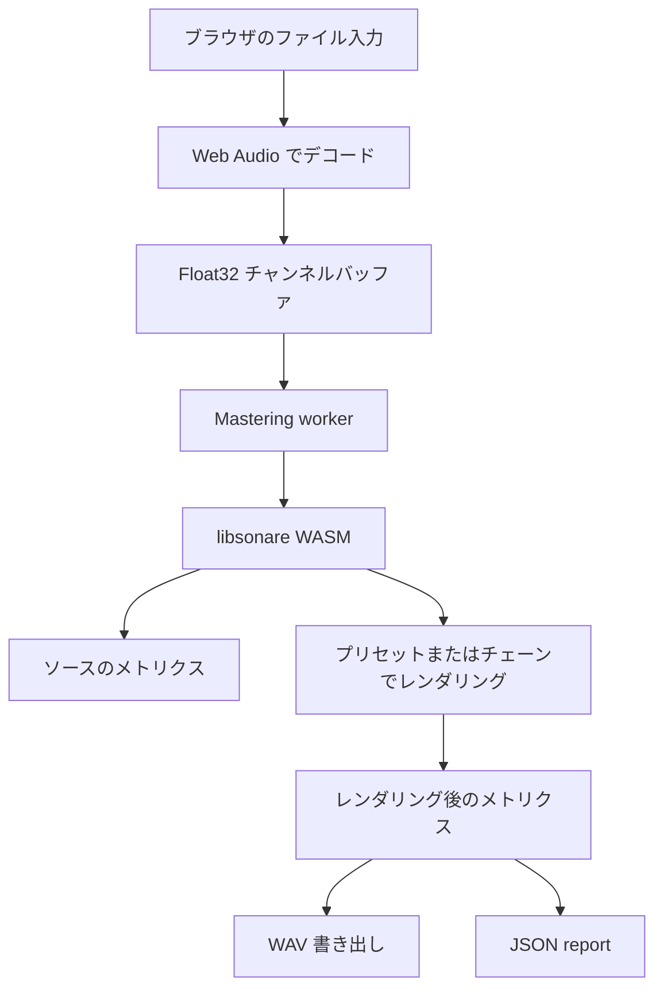

# マスタリング実装

このページは、`/ja/mastering` デモが少数の UI 上の判断を、決定的な libsonare マスタリングレンダリングへどう変換するかを説明します。自動生成したパラメータ一覧ではなく、UI・ワーカー・WASM の各エクスポート・機能群ごとの用語集ガイドをつなぐ実装マップとして使います。

ブラウザデモでは、長い解説は VitePress のドキュメントを正本にしています。アプリケーション UI には短いラベルと、このドキュメントへの導線だけを置いています。

::: info ワーカー・transferable バッファ・object URL
**ワーカー**は、UI を動かすメインスレッドとは別に JavaScript を実行する仕組みです。**transferable バッファ**は、音声メモリをコピーせずワーカーへ渡すための受け渡し方式です。**object URL** は、生成した音声やレポートを再生・ダウンロードするための一時的なブラウザ内 URL です。
:::

## このページで身につくこと

このページを読むと、次のことを追跡・説明できるようになります。

- ブラウザ内マスタリングデモが、ファイル入力からワーカーレンダリング、メトリクス、書き出し、レポート生成へ進む流れを追える。
- 長い説明をドキュメント側に置き、アプリ UI を短いラベル中心に保つ理由を理解できる。
- UI コントロールをチェーン上の領域と用語集ページへ対応づけられる。
- WASM 宣言とマスタリング API ドキュメントの整合を保つ検証コマンドを把握できる。

## レンダリングフロー

デコードはブラウザ API で行います。重い DSP が VitePress のページを止めないよう、マスタリング処理は Mastering worker 上で実行します。ワーカーはモノラル／ステレオの `Float32Array` バッファを WASM パッケージへ渡し、レンダリング後のサンプルとメトリクスを受け取って、再生・ダウンロード・JSON report 用のローカル object URL を生成します。

## データの所有

音源はユーザーの端末上に残ります。ソースファイル、任意のリファレンスファイル、レンダリング後の WAV、JSON レポート、書き出した設定はすべてブラウザ内のローカルオブジェクトとして扱われ、レンダリングのためにアップロードされることはありません。

これは実装上も重要です。UI はサーバー側のリトライ、リモートキュー、アカウント状態に依存できません。エラー処理はローカルでの復旧を前提にします。具体的には、別のブラウザがデコード可能な形式を試す、ソースの長さを短くする、強すぎる設定を下げる、ワーカー失敗後に再レンダリングする、といった流れです。

## UI とチェーンの対応

クイックマスターは音楽的な判断だけを見せ、Studio は機能群ごとにまとめたコントロールを見せます。どちらも同じ内部チェーンモデルに渡されます。

| UI 上のエリア | チェーン上のエリア | 主なガイド |
|---------|------------|-----------|
| インプットゲイン、ノイズ除去 | リペアと入力 | [リペアと入力コントロール](./glossary/mastering/repair.md) |
| トーン、エキサイター、Air | トーンと Air | [トーンと Air コントロール](./glossary/mastering/tone-air.md) |
| スレッショルド、レシオ、アタック、リリース | ダイナミクス | [ダイナミクスコントロール](./glossary/mastering/dynamics.md) |
| 幅、シーリング、目標 LUFS | 最終ステージ | [ステレオ・リミッター・ラウドネスコントロール](./glossary/mastering/stereo-limiter-loudness.md) |
| ソース／リファレンスの比較 | ペア解析 | [リファレンスマッチ](./glossary/mastering/reference-match.md) |
| LUFS、True Peak、クレスト、相関値 | メーター | [マスタリングメーターの読み方](./glossary/mastering/meter-reading.md) |

::: info 相関値の読み方
相関値（位相相関、おおよそ −1〜+1）は、左右チャンネルがどれだけ似ているかを表します。+1 に近いとモノラルでも安全、0 に近いと広がりがあり、負の値はモノラルに合算したときミックスの一部が打ち消し合う恐れを示します。
:::

機能群ごとのページは意図的に広めにしてあります。たとえばコンプレッサーのページではスレッショルド・レシオ・アタック・リリース・ニー・ディテクター挙動・ゲインリダクションの読み方をまとめて説明できます。1 パラメータ 1 ページに分けると、実際にどの判断をしているかが見えにくくなります。

::: info コンプレッサーの用語
*スレッショルド*は圧縮が始まるレベル、*レシオ*はそれを超えた分をどれだけ強く抑え込むか、*アタック*／*リリース*は反応と復帰の速さ、*ニー*はスレッショルド付近でどれだけ緩やかにかかり始めるか、*ゲインリダクション*は現在何 dB 信号を下げているかを表します。
:::

## アルゴリズムの境界

デモはマスタリングアルゴリズムを Vue 側で再実装しません。Vue が担当するのはインタラクション、入力検証、ローカルな再生状態、表示です。DSP は libsonare 側が持っています。

:::: details 実装メモ
ワーカー境界が重要な設計線です。UI 上の状態はシリアライズ可能なチェーン設定オブジェクトに変換され、可能な場合はチャンネルバッファを transferable として一緒にワーカーへ渡します。ワーカーは WASM モジュールを初期化し、選択されたプリセット・チェーン・プロセッサ・解析 API を呼び出し、進捗と完了メッセージを UI に返します。

最終結果はイミュータブルとして扱います。後段の A/B 比較ではラウドネス揃え再生のために一時的な再生ゲインをかけることはありますが、書き出した WAV は書き換えません。レポートには UI の既定値ではなく、実際のレンダリングで得たメトリクス・ステージ名・プリセット名・ターゲット値・チューニング値を記録します。
::::

## WASM 公開 API

ドキュメントは `src/wasm/index.d.ts` が公開しているマスタリング API を追跡します。検証スクリプトは宣言ファイルから現在の `mastering*` / `masterAudio*` 関数を抽出し、JavaScript／ネイティブバインディングのドキュメントに記載があることを確認します。

マスタリングワーカー、WASM 宣言、プロセッサドキュメント、またはこの実装マップを変更した後は `yarn check:mastering-docs` を実行してください。このチェックにより、このページ、JavaScript API ページ、ネイティブバインディングページが現在の公開 API と揃っていることを確認できます。

目的別には次のように使い分けます。

| 目的 | API ファミリ |
|--------|------------|
| プリセットを使う | `masterAudio()`、`masterAudioStereo()`、`masteringPresetNames()` |
| フルチェーンを実行する | `masteringChain()`、`masteringChainStereo()` |
| 進捗を表示する | `masteringChainWithProgress()`、`masteringChainStereoWithProgress()` |
| ブロック単位でレンダリングする | `StreamingMasteringChain`（`prepare` / `processMono` / `processStereo` / `reset` / `latencySamples` / `stageNames`） |
| 名前付きプロセッサを単体で実行する | `masteringProcessorNames()`、`masteringProcess()`、`masteringProcessStereo()` |
| ソースとリファレンスを比較する | `masteringPairProcessorNames()`、`masteringPairProcess()`、`masteringPairAnalysisNames()`、`masteringPairAnalyze()` |
| ステレオ出力を解析する | `masteringStereoAnalysisNames()`、`masteringStereoAnalyze()` |
| プロファイル・提案・プレビュー | `masteringAudioProfile()`、`masteringAssistantSuggest()`、`masteringStreamingPreview()` |

関連: [ブラウザ内ローカル処理](./glossary/concepts/browser-local-processing.md), [マスタリング](./glossary/mastering.md), [JavaScript API](./js-api.md), [WASM](./wasm.md)

名前付きプロセッサ、プリセット、ペア解析、ステレオ解析の完全な一覧は [マスタリングプロセッサ](./mastering-processors.md) を参照してください。提案生成とプロファイル構築は [マスタリングアシスタント](./mastering-assistant.md) にまとめています。
