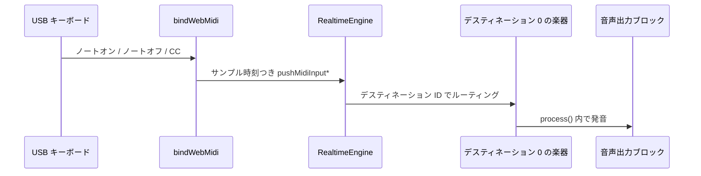

# ライブ MIDI 入力と Web MIDI

**ライブ MIDI 入力**は、リアルタイムエンジンを演奏できる楽器に変えます。USB キーボードで押した鍵がノートオンイベントになり、エンジンはそれをバインド済みのシンセサイザーへ送り、次の音声ブロックで音が鳴ります。ファイルもオフラインレンダーも要りません。

libsonare の `RealtimeEngine` は、トランスポート・クリップ・オートメーションを駆動するのと同じリアルタイム安全な面でライブ MIDI を受け取ります。ブラウザでは、小さな **Web MIDI ブリッジ**（`bindWebMidi`）が、プラットフォームの MIDI ポートをそのエンジンへ直接つないでくれます。

::: info MIDI のきほん
**ノートオン**は「この音高がこの強さで始まった」、**ノートオフ**は「離した」を伝えます。**コントロールチェンジ**（CC）は連続的なツマミ／スライダーのメッセージで、モジュレーションホイール（CC1）、サスティン（CC64）、エクスプレッション（CC11）などがあります。libsonare はこの 3 つをすべてライブで扱えます。
:::

::: info MIDI デスティネーション
**MIDI デスティネーション**はスピーカー出力ではありません。エンジン内部の楽器スロットです。MIDI イベントは `0` のようなデスティネーション ID に送られ、その ID にバインドされた楽器が実際の音を決めます。
:::

::: tip このページの位置づけ
本ページはコントローラーからエンジンを*演奏する*話です。ノートが届く楽器のバインドは [NativeSynth](./native-synth.md)（パッチ駆動のシンセサイザー）と [SoundFont プレイヤー](./soundfont-player.md)（GS/GM の `.sf2` 再生）を参照してください。演奏をタイムラインへ録音するには [録音とテイク](./recording-and-takes.md) を参照します。マイク音声の入力は別経路です。最後の節を参照してください。
:::

## ライブ MIDI の流れ

ブラウザが MIDI バイトを受け取り、`bindWebMidi` がエンジンイベントへ変換し、デスティネーションの楽器が `process(...)` の中で音声を作ります。



音が出ないときは、ブラウザ権限、`bindWebMidi` の入力一覧、デスティネーション ID、バインド済み楽器、AudioWorklet/出力配線の順に確認してください。

## このページで身につくこと

このページを読むと、次のことができるようになります。

- 組み込み・NativeSynth・SoundFont の楽器を **MIDI デスティネーション**へバインドし、ライブイベントを送れる。
- ノートオン／ノートオフ／CC のライブイベントをサンプル精度でキューイングできる。
- `bindMidiCc` で MIDI CC をエンジンパラメータへマッピングできる。
- デスティネーションごとの MIDI FX インサートを、ノートを残さず差し替えられる。
- **MIDI パニック**でスタックノートから復帰できる。
- ブラウザで `bindWebMidi` を使い、ホットプラグ・権限・CC バインド・タイムスタンプからサンプルへの変換まで含めてハードウェアキーボードを接続できる。
- 出荷前に現在のブラウザ対応状況を把握できる。

## MIDI デスティネーションモデル

エンジンはノートを直接鳴らすのではなく、**MIDI デスティネーション**へ送り、各デスティネーションには楽器がバインドされています。デスティネーションは小さな整数 ID（既定は `0`）で識別します。楽器を一度バインドすれば、その ID 宛のライブイベントやスケジュール済みクリップはすべてその楽器でレンダリングされます。

デスティネーションには 3 種類の楽器を置けます。

| バインド方法 | 楽器 | 参照 |
|--------------|------|------|
| `setBuiltinInstrument(config, destinationId)` | 内蔵の波形シンセ（データ不要の最下層） | — |
| `setSynthInstrument(patch, destinationId)` | パッチ駆動の NativeSynth | [NativeSynth](./native-synth.md) |
| `setSf2Instrument(config, destinationId)` | GS 互換の SoundFont プレイヤー | [SoundFont プレイヤー](./soundfont-player.md) |

```typescript
import { init, RealtimeEngine } from '@libraz/libsonare';

await init();

const engine = new RealtimeEngine(48000, /* maxBlockSize */ 128);

// デスティネーション 0 → NativeSynth プリセット（synthPresetNames() 参照）
engine.setSynthInstrument('saw-lead', 0);

// 複数のデスティネーションを同時に動かし、それぞれに楽器を持たせられる
engine.setSf2Instrument({ destinationId: 1, gain: 1 }, 1);
```

`clearMidiInstrument(destinationId)` で 1 つのバインドを解除し、`midiInstrumentCount()` で現在の数を確認できます。複数デスティネーションを使えば、1 つのエンジンに重ねたリグ（`0` にリードシンセ、`1` にドラム、など）を持たせられます。

## ライブイベントのキューイング

ライブイベントは同期実行ではなく*キューイング*されます。各呼び出しは、イベントを発火させるサンプル位置をエンジンへ渡します。次の `process(...)` ブロックが、そのブロックで処理すべきイベントをすべて消費します。これがタイミングを正確にする仕組みです。イベントは「メッセージが届いた時」ではなく、正確なフレームに着地します。

キューイングの面は 2 つあり、デスティネーションごとにどちらかを選ぶべきです。

- **即時エンジンコマンド** — `pushMidiNoteOn` / `pushMidiNoteOff` / `pushMidiCc` / `pushMidiPanic`。それぞれ `destinationId` と `renderFrame`（または「できるだけ早く」を表す `-1`）を取ります。
- **エンジン所有のライブ入力ソース** — `setMidiInputSource(destinationId)` で専用の入力レーンを開き、`pushMidiInputNoteOn` / `pushMidiInputNoteOff` / `pushMidiInputCc` で `portTimeSamples` タイムスタンプ付きに供給します。Web MIDI ブリッジが駆動するのはこのレーンです。

```typescript
// 即時経路: 次のブロック先頭でノートを発火
engine.pushMidiNoteOn(/* destinationId */ 0, /* group */ 0, /* channel */ 0, /* note */ 60, /* velocity */ 100, -1);
engine.pushMidiCc(0, 0, 0, /* controller */ 1, /* value */ 64, -1);
engine.pushMidiNoteOff(0, 0, 0, 60, 0, -1);

// 入力ソース経路（bindWebMidi が内部で使う経路）
engine.setMidiInputSource(0);
engine.pushMidiInputNoteOn(/* group */ 0, /* channel */ 0, 60, 100, /* portTimeSamples */ 0);
engine.pushMidiInputCc(0, 0, 1, 64, 0);
engine.pushMidiInputNoteOff(0, 0, 60, 0, 0);
// engine.midiInputPendingCount()  -> 次の process() ブロックを待つイベント数
```

`group` と `channel` は MIDI ニブル（0..15）、`note`・`velocity`・`controller`・`value` は 7 ビット（0..127）です。ベロシティ `0` のノートオンは、MIDI 仕様どおりノートオフとして扱われます。

## MIDI CC をエンジンパラメータへバインドする

CC は二役を果たせます。楽器へ届くと同時に、エンジンのオートメーションパラメータを駆動できます。`bindMidiCc(channel, controller, paramId, options)` は、コントローラーの 7 ビット値を登録済みパラメータの `[minValue, maxValue]` へマッピングし、その間も CC はデスティネーション楽器へ流れ続けます。

```typescript
// エンジンが駆動すべきパラメータを登録し、モジュレーションホイール（CC1）を割り当てる
engine.addParameter({ id: 42, name: 'cutoff', minValue: 0, maxValue: 1, defaultValue: 0.5 });
engine.bindMidiCc(/* channel */ 0, /* controller */ 1, /* paramId */ 42, { minValue: 0, maxValue: 1 });

// engine.midiCcBindingCount()  -> 1
// engine.clearMidiCcBindings() -> すべてのマッピングを削除
```

::: tip CC ラーンのワークフロー
オフラインで「ツマミを動かし、どの CC が動いたか取り込む」流れには、プロジェクト API の `Project.midiCcLearn(events, paramId, options)` と、録音した CC ストリームをオートメーションへ変換する `midiCcToBreakpoint` / `midiParamToCc` があります。これらはライブエンジンではなく、取り込んだ `ProjectMidiEvent` データを対象とします。[プロジェクト編集](./project-editing.md) を参照してください。
:::

## ノートを残さず MIDI FX を差し替える

各デスティネーションは 1 つの **MIDI FX インサート** を持てます。イベントストリームへの非破壊な変換（トランスポーズ、チャンネルフィルタ、ベロシティカーブなど）を JSON で設定します。

```typescript
engine.setMidiFx(/* destinationId */ 0, JSON.stringify({ /* MIDI FX 設定 */ }));
engine.clearMidiFx(0);   // ID を省略すると全デスティネーションを解除
```

`setMidiFx` は楽器のボイスをリセットせずにインサートをその場で*置き換え*ます。そのため、よくあるケース（フレーズ間で 1 つの変換を別の変換へ差し替える）では、鳴っているノートはそのまま保たれます。鍵を押したまま FX を変える場合の注意点が 2 つあります。

- 現在の状態が不確かなら、先に FX をクリアしてください。
- 変換がノートオフのルーティングを変えてノートが鳴り続けたら、差し替えの後にパニック（次節）を送ってください。

## MIDI パニックとスタックノート復帰

**スタックノート**は、対応するノートオフが届かなかったノートオンです。ケーブルを抜いた、Bluetooth パケットを落とした、FX の差し替えがオフを飲み込んだ、などが原因です。対処は **MIDI パニック**、すなわち鳴っている全ボイスを解放する all-notes-off です。

```typescript
engine.pushMidiPanic(-1);   // -1 = 即時。renderFrame を渡せばスケジュールも可能
```

パニックはリアルタイム安全で軽量です。楽器 UI の見える「パニック」ボタンに割り当てておきましょう。Web MIDI ブリッジは切断時に自動パニックしません。ホットアンプラグを自分で扱う場合は、演奏中だったポートが消えたらパニックを送ってください。

## ブラウザの Web MIDI ブリッジ

::: info ワイヤーフォーマットの用語
**UMP**（Universal MIDI Packet）は MIDI 2.0 のメッセージ形式です。ブリッジは従来の MIDI 1.0 バイトに加えてこれも受け付けます。**SysEx**（システムエクスクルーシブ）は自由形式でメーカー固有のメッセージで、GS Reset などに使われ、ブラウザでは別の権限でゲートされます。**RPN／NRPN**（（非）登録パラメータナンバー）は CC を介して追加パラメータを指定するもので、たとえば RPN 0 はピッチベンドレンジを設定します。
:::

ブラウザでは、`bindWebMidi(engine, options)` が配線を担います。MIDI アクセスを要求し、エンジンのライブ入力ソースを有効化し、一致する全入力ポートにリスナーを取り付け、受信バイト（ランニングステータスや UMP を含む）を解析し、サンプルタイムスタンプ付きでエンジンへキューイングします。

```typescript
import { init, RealtimeEngine, isWebMidiAvailable, bindWebMidi } from '@libraz/libsonare';

await init();
if (!isWebMidiAvailable()) {
  // navigator.requestMIDIAccess が無い — オンスクリーンキーボードへフォールバック
}

const engine = new RealtimeEngine(48000, 128);
engine.setSynthInstrument('saw-lead', 0);

const binding = await bindWebMidi(engine, {
  destinationId: 0,        // 演奏するエンジン MIDI デスティネーション（既定 0）
  group: 0,                // MIDI 1.0 イベント用の UMP グループ（既定 0）
  // inputIds: ['<port-id>'],  // 特定ポートに限定。省略時は接続中の全ポート
  sysex: false,            // SysEx 対応アクセスを要求（既定 false）
  software: true,          // 対応環境ではソフトウェアポートを要求（既定 true）
  ccBindings: [
    { channel: 0, controller: 1, paramId: 42, options: { minValue: 0, maxValue: 1 } },
  ],
  timestampToSamples: (eventTimeMs) => Math.round((eventTimeMs / 1000) * 48000),
  onInputsChanged: (inputs) => {
    // ホットプラグ時、ヘルパーが一致ポートを再バインドした後に呼ばれる
    console.log('MIDI inputs:', inputs.map((i) => `${i.name} (${i.state})`));
  },
});

// binding.inputs()  -> WebMidiInputInfo[] { id, name, manufacturer, state }
// binding.access    -> 生の制御が必要なときの MIDIAccess オブジェクト
```

各オプションの役割は次のとおりです。

- **`destinationId` / `group`** — ライブソースが供給するエンジンデスティネーションと、MIDI 1.0 チャンネルボイスイベントに刻む UMP グループです。
- **`inputIds`** — `binding.inputs()` から得た特定のポート ID にバインドを限定します。省略または空配列で接続中の全入力にバインドします。
- **`sysex` / `software`** — `navigator.requestMIDIAccess` へそのまま渡されます。SysEx アクセスは通常、別の権限プロンプトを出します。`software` はプラットフォームが提供する場合にソフトウェアシンセのポートを要求します。
- **`ccBindings`** — ポート接続より*前*に適用される `bindMidiCc` のマッピングです。最初のツマミ操作からすでにルーティング済みになります。対象パラメータは先に `addParameter(...)` で登録してください。
- **`onInputsChanged`** — ホットプラグ（`MIDIAccess` の `statechange`）時、ヘルパーが一致ポートを再バインドした後に、最新のポート一覧とともに発火します。

### タイムスタンプからサンプルへの変換が重要な理由

2 つのクロックが噛み合っていません。Web MIDI は各メッセージをミリ秒の時刻（ページクロックの `DOMHighResTimeStamp`）付きで届けますが、エンジンはイベントを**サンプルフレーム**でスケジュールします。`timestampToSamples(eventTimeMs)` はその両者を橋渡しします。メッセージ時刻を、エンジンがキューイングする `portTimeSamples` の値へ変換します。

なぜ手間をかけるのか。変換が正しければ、タイミングが詰まった箇所（和音や速いパッセージ）が、演奏したとおりの正確なフレームへ着地します。省略すると、すべてのイベントが次のブロックのサンプル `0` にキューイングされます。気軽な演奏には十分ですが、リズミカルな素材では聴き取れるほど緩くなります。

実用的な実装は、`performance.now()`（または `AudioContext.currentTime`）とエンジンのフレームクロックとの差分を追い、その差分をここで適用します。

### ライフサイクル

`bindWebMidi` は `WebMidiBinding` を返します。終わったら `binding.close()` を呼びます。`statechange` リスナーを外し、全ポートリスナーを切り離し、`engine.clearMidiInputSource()` を呼びます。エンジンは破棄しません。エンジンは `engine.destroy()` で別途解放してください。

```typescript
binding.close();   // MIDI ポートを切り離し、エンジンの入力ソースをクリア
engine.destroy();  // エンジンのネイティブハンドルを解放
```

### ブラウザ対応

Web MIDI の対応はまちまちなので、`isWebMidiAvailable()` で実行時に確認し、なければ穏やかに縮退してください。

- **Chrome・Edge**（デスクトップ） — ホットプラグや SysEx（権限プロンプト付き）を含む完全な Web MIDI。主たる対象です。
- **Firefox** — Web MIDI を提供しています。SysEx やアドオン要件は時期により変わってきたため、前提にせず機能検出してください。
- **Safari** — 従来は `navigator.requestMIDIAccess` を公開していませんでした。対応は変化しているため、存在を前提にしないでください。常に `isWebMidiAvailable()` でゲートし、オンスクリーンキーボードのフォールバックを用意します。

状況は移り変わるため、コードでは機能検出を真とし、文章での断定は控えめに保ってください。

## レシピ: USB キーボードでブラウザのシンセを鳴らす

「キーボードを挿した」から「スピーカーから音が出る」までの完全な最小経路です。エンジンのセットアップと MIDI ブリッジは素の JS ですが、音声出力の配線にはブラウザの `AudioContext` / `AudioWorklet` が必要です。

```typescript
import { init, RealtimeEngine, isWebMidiAvailable, bindWebMidi } from '@libraz/libsonare';

async function startKeyboardSynth() {
  await init();

  if (!isWebMidiAvailable()) {
    throw new Error('Web MIDI が使えません — オンスクリーンキーボードでフォールバックします');
  }

  // --- エンジン + 楽器（どこでも動く） ---
  const sampleRate = 48000;
  const engine = new RealtimeEngine(sampleRate, 128);
  engine.setSynthInstrument('saw-lead', 0);

  // --- 音声出力（ブラウザ専用） ---
  // engine.process(...) を AudioWorkletNode から駆動し、出力をスピーカーへ届ける。
  // 完全なワークレットブリッジは「リアルタイムとストリーミング」を参照。
  // 以下のエンジン・楽器バインド・MIDI 配線がライブ MIDI 入力に固有の部分です。
  const context = new AudioContext({ sampleRate });   // ブラウザ
  await context.resume();                             // ブラウザ（ジェスチャー必須）

  // --- MIDI ブリッジ（ブラウザ専用） ---
  const binding = await bindWebMidi(engine, {
    destinationId: 0,
    timestampToSamples: (ms) => Math.round((ms / 1000) * sampleRate),
    onInputsChanged: (inputs) =>
      console.log('keyboards:', inputs.map((i) => i.name).join(', ')),
  });

  // これで USB キーボードの鍵を押すと 'saw-lead' パッチが鳴ります。

  return {
    stop() {
      binding.close();   // MIDI ポートを切り離し、エンジンの入力ソースをクリア
      engine.destroy();  // ネイティブハンドルを解放
      void context.close();
    },
  };
}
```

::: warning ブラウザのジェスチャーと後始末
`AudioContext` はユーザージェスチャー（クリック）から生成／再開する必要があり、多くのブラウザはセキュアコンテキストからのみ MIDI アクセスを促します。ポートとネイティブメモリがページ破棄時に解放されるよう、`bindWebMidi` には必ず `binding.close()` と `engine.destroy()` を組み合わせてください。
:::

## ほかの実行環境では

ライブ MIDI のエンジン面はブラウザ専用ではありません。**Node ネイティブ**と **Python** のバインディングは同じ `RealtimeEngine` 入力メソッドを公開します。ブラウザ固有なのは Web MIDI ブリッジ自体だけです（`navigator.requestMIDIAccess` に依存するため）。Python では名前は snake_case 慣習に従います。

```python
import libsonare as sonare

engine = sonare.RealtimeEngine(sample_rate=48000.0, max_block_size=128)
try:
    engine.set_synth_instrument("saw-lead", destination_id=0)
    engine.set_midi_input_source(0)
    engine.push_midi_input_note_on(0, 0, 60, 100, 0)   # group, channel, note, velocity, port_time_samples
    engine.push_midi_input_cc(0, 0, 1, 64, 0)
    engine.push_midi_input_note_off(0, 0, 60, 0, 0)
    out = engine.process([[0.0] * 128, [0.0] * 128])   # ノートが鳴れば非ゼロ
finally:
    engine.close()
```

これらのエンジンを実機から鳴らすには、プラットフォームのライブラリ（たとえば CoreMIDI/ALSA のラッパー）で MIDI を読み、同じ `push_midi_input_*` メソッドを呼びます。タイムスタンプからサンプルへの変換は、ブラウザの `timestampToSamples` と同様に自分で用意します。

## マイク入力について

ライブ MIDI は*コントロール*入力です。エンジンに何を演奏するかを伝えます。**音声**入力（マイクや、インターフェース経由の楽器）は別経路です。`bindMicrophoneInput(context, engine, options)` が、取り込んだ音声をモニタリングと録音のためにエンジンへ送ります。両者は独立しており、同時に動かせます。[録音とテイク](./recording-and-takes.md) を参照してください。

## 関連

- [NativeSynth](./native-synth.md) — デスティネーションへバインドするパッチ駆動の楽器
- [SoundFont プレイヤー](./soundfont-player.md) — デスティネーションでの GS/GM `.sf2` 再生
- [録音とテイク](./recording-and-takes.md) — 演奏（およびマイク音声入力）の取り込み
- [プロジェクト編集](./project-editing.md) — MIDI クリップ、CC ラーン、CC からオートメーションへの変換
- [プロジェクトバウンス](./project-bounce.md) — MIDI 演奏のオフラインレンダー
- [リアルタイムとストリーミング](./realtime-streaming.md) — 音声出力を駆動する AudioWorklet エンジンブリッジ
- [リアルタイムエンジン](./glossary/realtime/realtime-engine.md) · [リアルタイム安全性](./glossary/realtime/realtime-safety.md)
