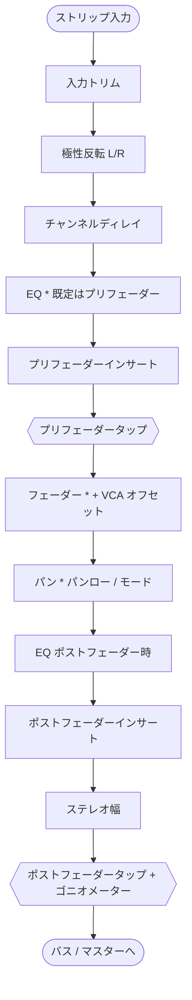

# ミキシングエンジン

**ミキシング**は、別々の複数トラック（ボーカル、ベース、ドラム、音楽ベッドなど）の音量バランスを取り、1 つのステレオ出力へまとめる工程です。

libsonare には、[マスタリングプロセッサ](./mastering-processors.md)と同じ C++ DSP コアの上に、リアルタイム処理を意識したミキシング／ルーティングエンジンが備わっています。DAW ホストを組み込まずに、**自分のアプリの中**に小さなミキサーを作れます。

*ストリップ*・*バス*・*センド*・*フェーダー*・*パン*・*オートメーション* という言葉に馴染みがなければ、先に [ミキシングの基礎](./glossary/concepts/mixing-basics.md) を読んでください。本ページはこれらの意味を理解している前提で、**libsonare がそれをどう実装しているか**と**何を呼べば目的を達成できるか**に集中します。

::: info 最初に押さえる 3 語
**ストリップ**は 1 トラック分の処理列、**バス**は複数トラックをまとめる行き先、**センド**は元の音を残したまま別のバスへ分岐する送り量です。この 3 つが分かると、フェーダー、パン、リバーブ送り、メーターの位置関係を追いやすくなります。
:::

::: tip パイプライン内でのミキシングの位置
| 工程 | 役割 |
|------|------|
| 解析 | トラックが「何か」を調べる |
| 編集 | 1 トラックのタイミングやピッチを直す |
| ミキシング | 複数トラックをステレオバスへまとめる |
| マスタリング | 仕上がったステレオミックスを配信向けに磨く |

ミキシングは「ステムのフォルダ」を「1 曲」に変える工程です。通常はミックスしてから、その結果をマスタリングします。
:::

## このページで身につくこと

このページを読むと、次のことを判断・実装できるようになります。

- 一括ステムレンダーには `mixStereo`、状態を持つルーティングには `Mixer.fromSceneJson` を選べる。
- トリム、極性、ディレイ、EQ、インサート、フェーダー、パン、幅、センド、メーターを通る信号の順番を追える。
- プリフェーダー／ポストフェーダーセンドの違いを理解し、典型的なルーティングミスを避けられる。
- リアルタイム制約を壊さずにオートメーションをスケジュールし、メーターを読める。
- どの時点でフィールド別リファレンスの [ミキシングシーン JSON](./mixing-scene-json.md) へ進むべきか判断できる。

## 正しい入口を選ぶ

エンジンは意図的に 2 段階に分かれています。まず上の行から検討し、追加の制御が本当に必要になったときだけ下の行へ進んでください。

| あなたの状況 | 使う API | 理由 |
|--------------|----------|------|
| 少数のステレオステムを 1 ファイルにまとめたい | [`mixStereo(...)`](#一括ミックス-mixstereo) | 1 回の呼び出し、配列だけ、後始末も不要 |
| センド・バス・インサート・オートメーション・メーター・保存可能なプロジェクトが必要 | [`Mixer.fromSceneJson(...)`](#シーンベースのミックス-mixer) | ミキサー状態を保持し、シリアライズできる |
| ブラウザの `AudioWorklet` や音声コールバック内で使う | WASM [`Mixer.createRealtimeBuffer()`](#リアルタイムと-audioworklet-ブリッジ) | バッファを再利用し、ブロックごとに確保しない |

::: info 1 つのエンジン、すべての実行環境
同じミキサーエンジンが WASM/JS、Node ネイティブ、Python、C ABI、CLI から使えます。名前は各言語の慣習に従います（`mixStereo` ↔ `mix_stereo`、`fromSceneJson` ↔ `from_scene_json`）が、ルーティンググラフ・シーン JSON・DSP は同一です。CLI は永続的な `Mixer` オブジェクトではなく、シーンのレンダー入口を提供します。実行環境ごとの一覧は [バインディング対応表](./binding-parity.md) を参照してください。
:::

## チャンネルストリップを信号順にたどる

**チャンネルストリップ**は 1 本のトラックレーンです。ストリップが音声を処理する順序を理解することが、各コントロールの効果を予測する鍵になります。たとえば、*なぜ*ポストフェーダーセンドはフェーダーの後に続き、プリフェーダーセンドはそうならないのか、が分かります。

libsonare は各ブロックを次の順序で処理します。



上から順に読むと次のとおりです。

1. **入力トリム** — 何よりも先の純粋なゲイン段で、作業しやすいレベルを整えるために使います（[ゲインステージング](./glossary/concepts/gain-staging.md)参照）。フェーダーとは別物で、トリムは「入口でレベルを整える」、フェーダーは「他トラックとのバランスを取る」ためのものです。
2. **極性反転** — 左／右チャンネルの符号を反転します。別トラックと位相が逆に録れたトラックの補正に使います。
3. **チャンネルディレイ** — ストリップごとのサンプル遅延です。トラックの時間整合に使うと同時に、エンジンの[ディレイ補償](#レイテンシとプラグインディレイ補償-pdc)にも寄与します。
4. **EQ** — 内蔵のパラメトリック EQ。**既定ではプリフェーダー**（フェーダーは EQ 後の信号を扱う）ですが、ポストフェーダーへ移動できます。
5. **プリフェーダーインサート** — フェーダーより*前*で動く、あなたが指定したプロセッサ（コンプレッサー、ディエッサーなど）。
6. **プリフェーダータップ** — *プリフェーダー*センドとプリフェーダーメーターが読み取る地点です。フェーダーより前なので、フェーダーを動かしてもプリフェーダーセンドのレベルは**変わりません**。
7. **フェーダー（+ VCA オフセット）** — メインのレベル制御。[VCA グループ](#vca-グループ)のオフセットがここで加算されるため、1 つのグループフェーダーで多数のストリップを一括調整できます。
8. **パン** — ストリップの[パンモードとパンロー](#パンモードとパンロー)に従ってステレオフィールド内に配置します。
9. **ポストフェーダーインサート**（EQ をポストフェーダーへ移した場合は EQ も）— ポストフェーダーのレベルに反応すべきプロセッサ。
10. **ステレオ幅** — サイド信号を狭めたり広げたりします（[モノラル互換性](./glossary/concepts/mono-compatibility.md)参照）。
11. **ポストフェーダータップ + ゴニオメーター** — *ポストフェーダー*センド、出力メーター、ゴニオメーター履歴バッファへ供給します。

::: warning プリフェーダーとポストフェーダーは見た目だけの違いではない
**ポストフェーダー**センドはフェーダーに追従します。フェーダーを下げると、そのトラックから送ったリバーブも一緒に下がり、ドライ信号との比率が保たれます。**プリフェーダー**センドはフェーダーから独立しており、ヘッドホン／キューミックスや完全ウェットなエフェクトリターンに向きます。ここを誤るのが最も多いルーティングミスです。
:::

:::: details コードとの対応
上記の順序は `ChannelStrip::process_segment` そのものです。

```text
input_trim -> 極性 -> alignment_delay -> eq(pre) -> プリインサート
  -> [pre タップ] -> fader(+VCA) -> panner -> eq(post)
  -> ポストインサート -> width -> [ゴニオメーター + post タップ]
```

pre/post タップは事前確保したスクラッチバッファなので、センドが音声スレッドで確保することはありません。スケジュールされた各オートメーションイベント（フェーダー、パン、幅、センド、インサート）はこの同じセグメントループ内のサンプル位置で適用されます。これがオートメーションをサンプル精度にしている仕組みです。
::::

## 一括ミックス: `mixStereo`

「ステムが数本あるので 1 ステレオファイルにしたい」なら、`mixStereo` だけで完結します。トラックごとの左／右チャンネルと、設定値の並列配列を受け取り、レンダリング済みマスターとトラックごとのメーターを返します。

::: code-group

```typescript [ブラウザ]
import { init, mixStereo } from '@libraz/libsonare';

await init();

const mix = mixStereo([vocalL, musicL], [vocalR, musicR], sampleRate, {
  inputTrimDb: [3, 0],     // 小さいボーカルをフェーダー前に持ち上げる
  faderDb: [-3, -12],      // バランス: ボーカルを前に、音楽を後ろに
  pan: [0, -0.2],          // 音楽をやや左へ
  width: [1, 0.9],         // モノラル安全のため音楽を少し狭める
  // panMode / muted は任意。これらもトラックごとの配列を受け付ける
});

// mix.left, mix.right  -> Float32Array マスター
// mix.meters[i]         -> トラックごとの MixMeterSnapshot（「メーター」参照）
```

```python [Python]
import libsonare as sonare

mix = sonare.mix_stereo(
    [(vocal_l, vocal_r), (music_l, music_r)],
    sample_rate=48000,
    input_trim_db=[3, 0],   # 小さいボーカルをフェーダー前に持ち上げる
    fader_db=[-3, -12],     # バランス: ボーカルを前に、音楽を後ろに
    pan=[0, -0.2],          # 音楽をやや左へ
    width=[1, 0.9],         # モノラル安全のため音楽を少し狭める
)

# mix.left, mix.right -> マスターサンプル
# mix.meters[i]        -> トラックごとの MixMeterSnapshot（「メーター」参照）
```

```bash [CLI]
sonare mix \
  --preset vocalReverbSend \
  --input vocal.wav \
  --input music.wav \
  --sample-rate 48000 \
  -o master.wav
```

:::

::: tip スカラーかトラックごとか
JavaScript の `mixStereo` オプションは、単一値（全トラックに適用）か配列（トラックごと）のどちらも受け付けます。`faderDb: -3` は全体を 3 dB 下げ、`faderDb: [-3, -12]` は各トラックを個別に設定します。

Python の `mix_stereo(...)` では、`fader_db`、`pan`、`width`、`muted`、`input_trim_db` はトラックごとの sequence を渡します。`pan_mode` は全トラック共通の 1 値またはトラックごとの sequence のどちらも使えます。
:::

`mixStereo` はオフラインのユーティリティ、バッチスクリプト、ファイル出力までの最短経路に使います。リバーブセンド・サブグループ・オートメーション・保存可能なプロジェクトが必要になった時点で、シーンベースの `Mixer` へ移行してください。

## シーンベースのミックス: `Mixer`

**シーン**は、ミキサー全体（ストリップ、そのインサートとセンド、バス、VCA グループ、それらの接続）を記述したプレーンな JSON です。`Mixer.fromSceneJson(...)` はその記述をルーティンググラフへコンパイルし、ブロック単位で処理できるようにします。

::: code-group

```typescript [ブラウザ]
import { init, Mixer, mixingScenePresetJson, mixingScenePresetNames } from '@libraz/libsonare';

await init();

mixingScenePresetNames();                                  // ['vocalReverbSend', 'drumBusSubgroup', 'commentaryDucking']
const sceneJson = mixingScenePresetJson('vocalReverbSend'); // 編集可能な出発点

const mixer = Mixer.fromSceneJson(sceneJson, sampleRate, /* blockSize */ 512);
try {
  // ストリップごとのステレオ音声を 1 ブロック渡し、ルーティング済みステレオマスターを得る
  const out = mixer.processStereo(
    [vocalBlockL, returnBlockL],
    [vocalBlockR, returnBlockR],
  );

  const vocalMeter = mixer.stripMeter(0, 'postFader');     // 「メーター」参照
} finally {
  mixer.delete();   // WASM ハンドルは GC されない — 必ず解放する
}
```

```python [Python]
import libsonare as sonare

sonare.mixing_scene_preset_names()                          # ['vocalReverbSend', 'drumBusSubgroup', 'commentaryDucking']
scene_json = sonare.mixing_scene_preset_json("vocalReverbSend")

mixer = sonare.Mixer.from_scene_json(scene_json, sample_rate=48000, block_size=512)
block = mixer.process_stereo(
    [vocal_block_l, return_block_l],
    [vocal_block_r, return_block_r],
)
vocal_meter = mixer.strip_meter(0, tap="postFader")         # 「メーター」参照
mixer.close()                                               # ネイティブハンドルを解放
```

```bash [CLI]
# ストリップごとの WAV 入力を組み込みシーンプリセットでレンダリング（ストリップごとに --input を 1 つ）
sonare mix --preset vocalReverbSend \
  --input vocal.wav --input reverb-return.wav \
  --sample-rate 48000 -o master.wav

# toSceneJson()／to_scene_json() で保存したシーン JSON ファイルを読み込むこともできます
sonare mix --scene my-scene.json --input vocal.wav --input reverb-return.wav -o master.wav
```

:::

::: danger ミキサーは必ず解放する
`Mixer` はすべての embind オブジェクトと同様、JavaScript の GC では回収できない WASM ヒープハンドルを保持します。`finally` ブロックで `mixer.delete()`（Node は `destroy()` も可）を呼んでください。ハンドルをリークすると、長時間のセッションで WASM メモリが徐々に枯渇します。
:::

シーンスキーマの全体、各フィールド、注釈つきのプリセット JSON は [ミキシングシーン JSON](./mixing-scene-json.md) にあります。3 つの組み込みプリセット（`vocalReverbSend`、`drumBusSubgroup`、`commentaryDucking`）はブラックボックスではありません。読み込んで編集し、`toSceneJson()`（Python では `to_scene_json()`）で再シリアライズすれば、実例で形式を学べます。

### インサートとセンド

これらはストリップがプロセッサを使う 2 つの方法で、それぞれ別の問いに答えます。

| | インサート | センド |
|---|-----------|--------|
| 信号経路 | 直列 — *全*信号が通過する | 並列 — *コピー*をバスへ送る |
| 典型用途 | トラック自身へのコンプ・EQ・ディエッサー | 複数トラックが共有するリバーブ／ディレイ |
| ウェット／ドライ | プロセッサ自身の mix で制御 | ドライはストリップに残り、送ったコピーだけ処理される |
| タップ位置 | 該当フェーダー段の後 | プリ／ポストフェーダーを選べる |

1 本のボーカルだけにかけたいリバーブはインサートで構いません。ボーカル・スネア・ギターで*共有*したいリバーブは、AUX バスへの**センド**とし、そのリターンにリバーブを 1 つ置きます — リバーブは 1 インスタンス、ソースは複数、空間は一貫します。

### バス、ロール、ルーティンググラフ

**バス**は共有の行き先です。ストリップはバスへ、バスは別のバスへ接続し、1 つのバスが `master` になります。各バスは `role` を持ちます。

| ロール | 意味 |
|--------|------|
| `master` | 最終ステレオ出力。すべての信号が最終的にここへ届く。 |
| `aux` | センドの並列行き先。通常はエフェクトリターン（リバーブ、ディレイ）。 |
| `submix` | マスターの前にまとめて処理するストリップ群（「ドラムバス」）。 |

接続はグラフを形成します。`Mixer.fromSceneJson` は、最初の `processStereo` 呼び出しでそのグラフを遅延コンパイルします。

**トポロジー**変更をした後は、次のタイミングが重要なブロックの前に `compile()` を呼んでください。トポロジー変更とは、たとえば次のような変更です。

- バスの追加／削除
- センドの追加／削除
- VCA グループの追加／削除

パラメータ変更やオートメーション変更には、再コンパイルは不要です。

strip の指定方法はランタイムで異なります。

| ランタイム | strip の指定方法 |
|------------|------------------|
| WASM | mixer 制御メソッドは数値のストリップインデックスを使います。シーン ID から指定したい場合は、先に `stripById(id)` でインデックスを取得します。 |
| Node ネイティブ / Python | 多くの制御メソッドで、数値インデックスとストリップ ID 文字列の両方を受け取ります。 |

### VCA グループ

**VCA グループ**は、複数ストリップの音声を再ルーティングせずにレベルだけをまとめて調整する 1 本のフェーダーです。「drums」VCA を 2 dB 下げると、キック・スネア・オーバーヘッドがそれぞれのバスへ流れたまま 3 つとも 2 dB 下がります。グループの `gainDb` は各メンバーのフェーダー段（上記ステップ 7）に加算されます。ライブのオフセットは `setVcaOffsetDb(...)` で、永続的なメンバー構成はシーンに保持します。

### ソロとミュートのロジック

- `setMuted(strip, true)` はストリップを無音にします。
- `setSoloed(strip, true)` は他のすべてのストリップを暗黙ミュートします — ただし `setSoloSafe(...)` で**ソロセーフ**に指定したものは除きます。エフェクトリターンのストリップをソロセーフにしておくと、ボーカルをソロにしてもそのリバーブリターンが聞こえます。

ソロ・ミュート・ソロセーフは、グラフ再コンパイルなしで次のブロックから有効になります。

### パンモードとパンロー

**パンモード**は位置を左右へ*どうマッピングするか*、**パンロー**は中央をサイドに対して*どれだけの音量*にするかです。

- `balance` — すでにステレオの素材向け。像を動かすのではなく片側を下げます。
- `stereoPan` — ほぼモノラルのソースをフィールド内で動かす本来のパン。
- `dualPan` — 左右独立の位置（`setDualPan(...)` で設定）。広いステレオトラックを内側へ畳むなど。

JavaScript API のパンローは `const3dB`、`const4.5dB`、`const6dB`、`linear0dB` です。Python では同じ値を enum/int、または `const-3db`、`linear-0db` のような正規化文字列で指定します。定パワー則（3 dB / 4.5 dB）はパン時の*知覚*音量を一定に保ち、通常はこちらを選びます。`linear0dB` は合算レベルを一定に保ちます。

## オートメーション

時間変化するコントロールはすべて、最初の `processStereo` 呼び出しからの**絶対サンプル位置**でスケジュールします（再コンパイルでクロックは 0 に戻ります）。利用できるレーンは次のとおりです。

```typescript
mixer.scheduleFaderAutomation(stripIndex, sampleRate * 8,  -6, 's-curve');   // 8 秒でボーカルを下げる
mixer.schedulePanAutomation(stripIndex, sampleRate * 12,  0.3, 'linear');
mixer.scheduleWidthAutomation(stripIndex, sampleRate * 12, 1.2, 'linear');
mixer.scheduleSendAutomation(stripIndex, sendIndex, sampleRate * 16, -12, 'hold');
mixer.scheduleInsertAutomation(stripIndex, insertIndex, paramId, sampleRate * 4, value, 'exponential');
```

補間**カーブ**はイベント間の動き方を決めます。

| カーブ | 形 | 用途 |
|--------|----|------|
| `linear` | 直線ランプ | 一般的なレベル／パンの移動 |
| `exponential` | 速→遅 | 自然に聞こえるフェード |
| `s-curve` | 入りと出の両方をなめらかに | クリックのない滑らかな遷移 |
| `hold` | ランプなしで跳ぶ | 段階的／即時の変化 |

::: tip インサートパラメータのオートメーション
`scheduleInsertAutomation` はインサートを*結合*シーケンス `[プリインサート…, ポストインサート…]` 内のインデックスで指定し、`paramId` はプロセッサ固有です。声の下でコンプのスレッショルドを動かしてダッキングするのが定番ですが、サイドチェインダッキングは [`commentaryDucking`](./mixing-scene-json.md#組み込みプリセット) プリセットが配線済みです。
:::

## メーター

各ストリップ（およびマスター）は豊富な `MixMeterSnapshot` を公開します。`mixStereo` の `meters[]` からレンダー後に、または `mixer.meterTap(strip, 'preFader' | 'postFader')` でライブに読み取れます。`stripMeter(...)` は WASM/Python では便利な別名、Node ネイティブではポストフェーダーの簡易入口です。

| フィールド | 意味 |
|-----------|------|
| `peakDbL` / `peakDbR` | チャンネルごとのサンプルピーク |
| `truePeakDbL` / `truePeakDbR` / `maxTruePeakDb` | サンプル間 [トゥルーピーク](./glossary/true-peak.md) — DAC が実際に再構成する値 |
| `rmsDbL` / `rmsDbR` | 短時間の平均レベル |
| `momentaryLufs` / `shortTermLufs` / `integratedLufs` | 400 ms / 3 s / 全体の [ラウドネス](./glossary/lufs.md) |
| `correlation` | −1…+1 の位相相関。+1 付近はモノラル安全、負は打ち消しの警告 |
| `monoCompatWidth` / `monoCompatPeak` / `monoCompatSideRms` / `likelyMonoCompatible` | [モノラル互換性](./glossary/concepts/mono-compatibility.md)の要約 |
| `gainReductionDb` | ストリップ上のダイナミクスがどれだけ働いているか |
| `seq` | 変化検出用の単調増加スナップショットカウンター |

**ゴニオメーター**は別の時間領域ビューです。`readGoniometerLatest(strip, maxPoints)` が直近の左／右サンプル対（古い→新しい）を返し、ステレオベクトルスコープを描画できます。latest read 経路は割り当てなしなので、UI からのポーリングで音声スレッドに余計な負荷を増やしません。

## リアルタイムと AudioWorklet ブリッジ

ミキサーコアは予測可能な音声コールバックのために作られています。デノーマル対策、ロックフリーなパラメータ変更、事前確保された状態、グラフ単位の[プラグインディレイ補償](#レイテンシとプラグインディレイ補償-pdc)を備えます。

WASM ラッパーでは、確保が禁じられるレンダーループで `processStereo`（結果を確保します）を避け、次のどちらかを使えます。

- **`processStereoInto(inL, inR, outL, outR)`** — 呼び出し側が所有する配列へ書き込みます。
- **`createRealtimeBuffer()`** — 再利用可能な WASM ヒープ上の入出力ビューを返します。入力を埋め、`process()` を呼び、`outLeft`/`outRight` を読む、を繰り返します。ビューはミキサーが所有し、`delete()` 後は無効になります。

::: details デノーマル対策とは？
デノーマル（非正規化数）は、ゼロに極めて近い非常に小さな浮動小数点数で、多くの CPU では通常の値よりはるかに遅く処理されます。

音声コールバックでは、リバーブやディレイのテイルが減衰してサンプルがゼロに近づくときにこの範囲へ入り込み、処理時間が急に跳ね上がってドロップアウトを招くことがあります。デノーマル対策はこうした極小値をゼロに切り捨て、各ブロックの処理時間を予測可能に保ちます。
:::

::: warning トポロジー変更はリアルタイム安全ではない
バス・センド・VCA グループの追加はグラフを dirty にし、次の `processStereo` で再コンパイル（確保が起こりうる）します。構造変更はセットアップ中か重要でないブロックで行い、`compile()` を呼んでから、タイトなレンダーループに入ってください。フェーダー／パン／センド／インサートの操作とオートメーションはループ内で問題ありません。
:::

### レイテンシとプラグインディレイ補償 (PDC)

先読み処理（たとえばドラムバス上のリミッター）はレイテンシを足します。グラフのある経路だけ遅延し別経路が遅延しないと、両者はマスターでずれて到達します。

エンジンは各経路のレイテンシを測定し、**短い経路を長い経路に合わせて遅延させる**ことで、マスターですべてを揃えます。これがプラグインディレイ補償です。ストリップごとの `channelDelaySamples` も同じ計算に入るため、変更後は再コンパイルして PDC を再実行してください。

## レシピ

:::: details 数本のステムをバランスしてバウンス
最速のミックス。バスもオートメーションもなし — トリム、バランス、レンダリングだけ。

```typescript
const mix = mixStereo(lefts, rights, sampleRate, {
  inputTrimDb: trims,   // 各ステムを妥当な作業レベルへ
  faderDb: balances,    // 互いのバランスを取る
  pan: positions,
});
exportWav(mix.left, mix.right, mix.sampleRate);
```
::::

:::: details AUX センドで共有するボーカルリバーブ
リバーブ 1 つを、ポストフェーダーセンドで送り、専用ストリップで返す — `vocalReverbSend` プリセットの縮小版です。

```typescript
const mixer = Mixer.fromSceneJson(mixingScenePresetJson('vocalReverbSend'), sampleRate, 512);
// strip 0 = "vocal"（EQ + コンプのインサート、"vocal-verb" AUX へのポストフェーダーセンド）
// strip 1 = "vocal-verb-return"（プレートリバーブのインサート、マスターへ返す）
mixer.setSendDb(0, 0, -10);          // リバーブを増やす
mixer.compile();                      // トポロジー編集後のみ必要
```
センドはポストフェーダーなので、ボーカルフェーダーを下げるオートメーションはリバーブも一緒に下げます。
::::

:::: details パラレルコンプつきドラムサブグループ
キック／スネア／オーバーヘッドを 1 つの `submix` バスへ送り、パラレルコンプとテープでまとめ、VCA で一括調整する — `drumBusSubgroup` プリセットです。

```typescript
const mixer = Mixer.fromSceneJson(mixingScenePresetJson('drumBusSubgroup'), sampleRate, 512);
mixer.setVcaOffsetDb(/* ドラムメンバーのストリップ */ 0, -1.5);  // キット全体をライブで調整
```
::::

:::: details ポッドキャスト／実況のダッキング
サイドチェインで音楽ベッドを話声の下に自動で下げます。`commentaryDucking` プリセットは host ストリップをキーにした `dynamics.sidechainRouter` をベッドに配置します。

```typescript
const mixer = Mixer.fromSceneJson(mixingScenePresetJson('commentaryDucking'), sampleRate, 512);
// host + guest は "voices" として VCA グループ化。music-bed ストリップは host が話すたびにダッキングする
```
::::

## 関連

- [ミキシングの基礎](./glossary/concepts/mixing-basics.md) — 初学者向けの用語
- [ミキシングシーン JSON](./mixing-scene-json.md) — シーンスキーマ全体と注釈つきプリセット
- [マスタリングプロセッサ](./mastering-processors.md) — ストリップ／バスのインサートとして読み込むプロセッサ
- [バインディング対応表](./binding-parity.md) — 実行環境ごとの API 差分
- [モノラル互換性](./glossary/concepts/mono-compatibility.md) · [ゲインステージング](./glossary/concepts/gain-staging.md) · [トゥルーピーク](./glossary/true-peak.md)
