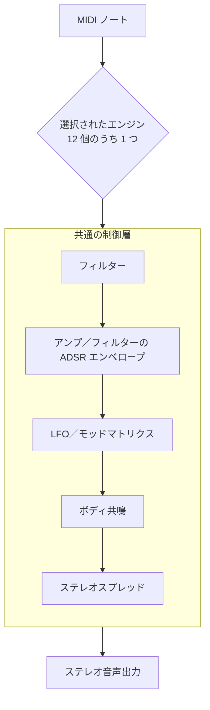

# 内蔵シンセサイザー (NativeSynth)

**NativeSynth は MIDI を単体で音にします** — ダウンロードするサンプルも、同梱する SoundFont も要りません。libsonare に組み込まれているので、MIDI トラックは何もしなくても最初から音が鳴ります。

最初に押さえることは 3 つだけです。

1. `acoustic-piano`、`warm-pad`、`drum-kit` のような名前付きプリセットを選ぶ。
2. そのプリセットを使う宛先へ MIDI ノートを送る。
3. 必要なら `cutoffHz`、`ampAttackMs`、`stereoSpread` など、聞いて分かりやすい項目だけを上書きする。

内部的には、NativeSynth は **12 個の差し替え可能な音作りエンジン**を備えた 1 台のシンセです。それぞれ、元になる音の作り方が異なります。アコースティック楽器系のいくつかは、まだ仮実装の物理モデルです。データ不要のプレビューやフォールバックには使えますが、最終的な音色調整／キャリブレーションは完了していません。

- バーチャルアナログ減算合成（定番のシンセリードやパッド）
- FM（エレクトリックピアノ、ベル、クラビネット）
- Karplus-Strong 撥弦（ギター、ベース、ハープ、ハープシコード）
- モーダル打楽器（マリンバ、ビブラフォン）
- 加算ドローバーオルガン
- 膜打楽器（ドラムキット）
- 拡張導波路アコースティックピアノ
- 持続型フルーパイプオルガン
- ボウイング弦の導波路
- リード木管の導波路
- 金管リップリード導波路
- エアジェットフルート導波路

12 個すべてが、モジュレーション、エンベロープ、フィルター、ステレオ幅、ポリフォニーを扱う共通の制御層を通るため、違う音色でも同じパッチ項目で調整できます。音を出すには、プリセットを名前で選ぶか、プリセットを出発点に `SynthPatch` で必要な項目だけを上書きします。鳴らし始めるのにエンジン内部へ触れる必要はありません。

::: info 音作りの用語をまとめて把握
以下のエンジン名は、音色を*生成する*方式の違いです。最初から全部を知る必要はありません（プリセットを選んで鳴らせば十分です）。それぞれを 1 行で説明します。

- **subtractive**（減算合成） — 明るい波形から始め、フィルターで削っていく古典的なアナログシンセの手法です。
- **FM／位相変調** — 1 つのオシレーターのピッチがもう 1 つを変調し、金属的で鐘のような音色を作ります。
- **Karplus-Strong** — 撥弦をモデル化する短い遅延ループです。
- **modal**（モーダル） — 叩いたバーや鐘をモデル化する、チューニングされた共鳴器のバンクです。
- **additive／drawbar**（加算／ドローバー） — ハモンドオルガンのドローバーのように、倍音のサイン波成分を足し合わせます。
- **（拡張）waveguide（導波路）** — 振動する弦や管をモデル化する遅延ラインです。
- **reed／brass／flute waveguide** — 木管・金管のための、息で励起される持続音モデルです。

パッチ操作でよく出てくる用語が 2 つあります。**ADSR エンベロープ**（attack／decay／sustain／release。音量などが、ノートの間にどう立ち上がり減衰するか）と、**モッドマトリクス**（LFO やエンベロープなどの変化の元を、ピッチやフィルターカットオフなどの送り先へつなぐ表）です。
:::

::: info MIDI は決して無音にならない
NativeSynth は [SoundFont プレイヤー](./soundfont-player.md)の**データ不要な土台**でもあります。SF2 経由でプロジェクトをバウンスしたとき、あるプログラム（または SoundFont 全体）が欠けていると、その音は NativeSynth の **GM フォールバックバンク**へ落ちます。128 種すべての General MIDI プログラムとドラムマップを備えているため、いずれにせよ音は出ます。
:::

::: tip NativeSynth の位置づけ
NativeSynth パッチは**インストゥルメント**です。MIDI 出力先へバインドすると、その出力先へルーティングされたトラックの MIDI が NativeSynth で鳴ります。オフラインでは [`bounceWithSynthInstrument`](./project-bounce.md) でバインドし、ライブでは `engine.setSynthInstrument` でバインドして [MIDI 入力](./midi-input.md)を送ります。サンプルベースのマルチサンプル音色が必要なら、代わりに [SoundFont プレイヤー](./soundfont-player.md) を使ってください。
:::

どのノートにも、NativeSynth の中を 1 本のシグナルパスが流れます。MIDI ノートが 12 個のうち 1 つのエンジンを選び、そのエンジンの素の音色が共通の制御層を通ってからステレオ出力へ届きます。



## このページで身につくこと

このページを読むと、次のことができるようになります。

- 音色に合った音作りエンジンと、適切な名前付きプリセットを選べる。
- プリセットを出発点に、`SynthPatch` で個々のフィールドを上書きできる。
- プリセット名と enum 名を推測せず、ランタイムから**実際の名前**を取得できる。
- `va:` ルーティング接頭辞と、`drum-kit` の GM ドラムマップを理解できる。
- `bounceWithSynthInstrument` でオフライン、`setSynthInstrument` でライブに MIDI を音声化できる。
- ある音が NativeSynth で鳴るのか、読み込んだ SoundFont で鳴るのかを判断できる。

## 12 個の音作りエンジン

各プリセットは 1 つの `engineMode` を選びます。共通部分（フィルター、エンベロープ、LFO、モッドマトリクス、ボディ共鳴、ポリフォニー）は、選択中のどのエンジンの上にも適用されます。エンジン固有の深いパラメータ（FM オペレータスタック、モーダルのモードテーブル、ドローバー設定、キットの各パーツ、ピアノの弦、パイプランク、ボウイング摩擦、リード／金管の管体、フルートのジェット形状）は、パッチではなく**名前付きプリセットの中**に収まっています。

### `subtractive` — バーチャルアナログ

オシレーター → フィルター → アンプという古典的なボイスです。デチューンユニゾン、ドリフト、フィルター前段のドライブ、4 種のフィルターモデルにより、太いソウリードから広がりのあるパッドまで作れます。**リード・ベース・パッド・プラック**、つまりアナログシンセで作りたいものに向きます。プリセット: `sine`、`saw-lead`、`square-lead`、`sub-bass`、`warm-pad`。

<SonareDemo id="synth-note" />

「キャラクター」の核はフィルターモデルです。`filterModel` で 4 種の古典モデルを選べます。

| モデル | 模した音色 | 備考 |
|--------|------------|------|
| `svf` | TPT ステートバリアブル（SEM 系） | クリーン。`filterOutput`（lowpass / bandpass / highpass）を選べる唯一のモデル |
| `moog-ladder` | 4 ポールトランジスタラダー | ゼロディレイフィードバック、飽和ループ、自己発振する |
| `diode-ladder` | ダイオードラダー（VCS3 / TB-303 系） | 結合段 ZDF、自己発振する |
| `sallen-key` | Korg35 ザレンキー（MS-10 / 初期 MS-20） | 自己発振する |

4 種とも、サンプル単位のカットオフ／レゾナンス変調下でも安定しジッパーノイズがなく、自己発振も決定論的です。

<SonareDemo id="synth-filter" />

### `fm` — 周波数変調

小さなアルゴリズムテーブルを持つ位相変調オペレータスタック（1 つのオシレーターのピッチがもう 1 つを変調 → 金属的・鐘的な音色）で、指数エンベロープ、フィードバックオペレータ、ベロシティ → インデックス（明るさ）スケーリングを備えます。**エレクトリックピアノ・ベル・マレット・クラビネット・ブラス**、つまり減算合成が苦手な金属的・鐘的・非整数次倍音の音に向きます。プリセット: `e-piano`、`bell`、`brass`。

### `karplus-strong` — 撥弦

位相が正確にチューニングされた分数遅延導波路ループ（撥弦をモデル化する短い遅延ループ）に、ピック位置コム、ベロシティ駆動の明るさ、ディケイストレッチ、ノートオフ時のループダンピング（フィンガー／パームミュート）を加えたものです。ギター、ハープ、ベース系プリセットでは、仮実装の物理的な細部として、ピックアップ位置、ボディ結合、スチール弦の分散、開放弦の共鳴、弦の張りによるベンド、2 方向の振動による減衰差も使います。アコースティックなリアリティは**調整中**であり、完成済みの楽器モデルではありません。**撥弦・ストローク弦**、すなわちギター・ベース・ハープ・ハープシコード・撥弦系民族楽器に向きます。プリセット: `pluck`、`classical-guitar`、`steel-guitar`、`electric-guitar`、`harp`、`bass-acoustic`、`bass-fingered`、`bass-picked`、`bass-fretless`、`bass-slap`。

### `modal` — マレット打楽器

物理的なモード比（一様バーのグロッケン、深いアーチのマリンバ／ビブラフォン）に合わせたモーダル共鳴バンク（叩いたバーや鐘をモデル化する、チューニングされた共鳴器のバンク）で、マレット硬さのベロシティ重みづけとモードごとのディケイを持ちます。**音程のあるマレット楽器**、グロッケン・ビブラフォン・マリンバ・シロフォンに向きます。プリセット: `marimba`、`glass`。

### `additive` — ドローバーオルガン

9 本のハモンドドローバーのピッチ（倍音のサイン波成分を、ドローバー 1 本につき 1 成分として足し合わせる）をステップ状のストップレベルで鳴らし、フリーランの倍音位相とキークリックの接点トランジェントを備えます。**オルガン**、すなわち持続して倍音成分が豊かなレジストレーションに向きます。プリセット: `organ`。

### `percussion` — 膜打楽器

レイリーの円形膜モードに、下降するストライクピッチのエンベロープとフィルタードノイズを重ねたものです。このエンジンが **GM ドラムキット**（キック、スネアの胴とスナッピー、タム、ハット、非整数次倍音のリングモードを持つシンバル）を支えます。ワンショットで決定論的です。プリセット: `drum-kit`。

### `piano` — 拡張導波路アコースティックピアノ

データ不要のグランドピアノのスケッチで、ピアノを定義する 4 要素を備えます。剛性弦の分散（鍵盤を上がるほど倍音成分がシャープに伸びる）、非線形フェルトハンマー（強打ほど短く明るい）、2-3 本の微デチューンユニゾン弦、響板共鳴バンクです。さらに音域ごとに音作りを変えるため、低音、中央の和音、高音が同じ単純な明るさカーブにはなりません。ただし、これは内蔵プレビュー向けの仮モデルであり、サンプルピアノの代替ではありません。**アコースティックピアノ**に向きます。プリセット: `acoustic-piano`。

### `pipe-organ` — 持続型フルーパイプ

共有風圧、複数ランクのレジストレーション、リードパイプ色、マウス／放射補正を備えた、仮実装の導波路フルーパイプモデルです。プリンシパルやブルドンからフルート、トランペットランクまでの**教会オルガン系プレビュー音色**に向きます。プリセット: `church-organ`、`church-flute`、`church-bourdon`、`church-trumpet`。

### `bowed-string` — 摩擦励起の弦

ボウ速度／圧力／位置の制御、共鳴弦、第二偏波のうなり、ヴァイオリン属のボディ共鳴を備えた、持続型のボウイング弦導波路です。モデルは仮実装で、参照音源に対する調整は継続中です。**ヴァイオリン属のプレビュー**に向きます。プリセット: `violin`、`viola`、`cello`、`contrabass`。

### `reed` — リード木管

円筒管／円錐管の違い、トーンホール／成長円錐のふるまい、音域に応じた音作り、ライブの息・明るさ制御を備えたリード管体導波路です。キャリブレーション中の、GM フォールバック／プレビュー用の仮ボイスです。**シングルリード／ダブルリード木管とサックスのプレビュー**に向きます。プリセット: `clarinet`、`soprano-sax`、`alto-sax`、`tenor-sax`、`baritone-sax`、`oboe`、`english-horn`、`bassoon`。

### `brass` — リップリード金管

リップテンション、金管ベルのボディ共鳴、円筒／円錐の音色差、音域に応じた音作り、大音量時の明るい cuivré エッジを備えた金管導波路です。これは仮実装の物理モデルなので、完成済みの金管シミュレーションではなく、内蔵の金管フォールバックとして扱ってください。プリセット: `trumpet`、`trombone`、`tuba`、`french-horn`、`muted-trumpet`、`cornet`、`flugelhorn`、`euphonium`。

### `flute` — エアジェットフルート

ジェット／反射の明るさ、息ノイズとチフ、オーバーブローの挙動、ビブラート制御を備えた、息駆動のエアジェット／開管モデルです。現在は**フルート、笛、オカリナ系のエッジトーン楽器**向けの仮フォールバックボイスです。プリセット: `concert-flute`、`piccolo`、`recorder`、`pan-flute`、`shakuhachi`、`tin-whistle`、`ocarina`、`blown-bottle`。

## GM フォールバックバンク

GM フォールバックは、最後の手段として単純なサイン波を鳴らすだけのバンクではありません。SoundFont が未読み込み、または一部のプログラムを持たないとき、NativeSynth は要求された GM プログラムに近い内蔵の合成音源を選びます。その一部は、まだキャリブレーション中の仮実装物理モデルです。目的は、データ不要のプレビューと欠けたプログラムのカバーであり、完成済みのサンプル楽器並みのリアリティではありません。

| GM 領域 | データ不要のフォールバック音源 |
|---------|-------------------------------|
| プログラム 0-7、鍵盤 | 拡張導波路グランドピアノ、FM エレピ／クラビ、Karplus-Strong ハープシコードのバンク違い |
| プログラム 16-23、オルガン | 加算オルガン、仮実装の物理モデルによる教会オルガン、フルーパイプ、ブルドン、トランペットランク、リードオルガン系 |
| プログラム 24-37、ギター／ベース | Karplus-Strong のナイロン、スチール、エレキ、ミュート／オーバードライブ／ディストーションギター、ハープ、ベース各種 |
| プログラム 40-47、弦／オーケストラ | ボウイング弦、トレモロ／ピチカート弦、ハープ、ティンパニ |
| プログラム 52-54、合唱／声 | ボーカルボディ共鳴を使う choir、voice ooh、synth voice |
| プログラム 56-79、金管／リード／フルート | 仮実装の物理モデルによるリップリード金管、リード木管／サックス、エアジェットフルート |
| ドラムと GS バリエーション | GM/GS ドラムキットのバリエーション、GM2/GS バンクフォールバック。利用可能な場合は GS EFX を内蔵インサートチェーンへルーティング |

初学者向けに言い換えると、**正確な音色や本番向けのサンプル楽器が必要なら SoundFont を使い、軽量で常に鳴るプレビューや欠けたプログラムの保険には NativeSynth フォールバックを使う**、という使い分けです。

## 名前付きプリセットカタログ

NativeSynth は名前付きプリセットカタログを同梱します。**プリセット名をハードコードしないでください**。ランタイムから `synthPresetNames()` で一覧し、`synthPresetPatch(name)` で各プリセットを `SynthPatch` として確認します。

<SonareDemo id="synth-presets" />

::: code-group

```typescript [ブラウザ]
import { init, synthPresetNames, synthPresetPatch } from '@libraz/libsonare';

await init();

synthPresetNames();
// ['sine', 'saw-lead', 'square-lead', 'sub-bass', 'warm-pad', 'e-piano',
//  'bell', 'brass', 'pluck', 'classical-guitar', 'steel-guitar',
//  'electric-guitar', 'harp', 'bass-acoustic', ...,
//  'church-organ', 'violin', 'clarinet', 'trumpet', 'concert-flute', ...]

const pad = synthPresetPatch('warm-pad');
// { preset: 'warm-pad', engineMode: 'subtractive', waveform: 'saw',
//   unison: 7, detuneCents: 18, cutoffHz: 2800, ampAttackMs: 400, ... }
```

```python [Python]
import libsonare as sonare

sonare.synth_preset_names()
# ['sine', 'saw-lead', 'square-lead', 'sub-bass', 'warm-pad', 'e-piano',
#  'bell', 'brass', 'pluck', 'classical-guitar', 'steel-guitar',
#  'electric-guitar', 'harp', 'bass-acoustic', ...,
#  'church-organ', 'violin', 'clarinet', 'trumpet', 'concert-flute', ...]

pad = sonare.synth_preset_patch("warm-pad")
# SynthPatch(preset='warm-pad', engine_mode='subtractive', waveform='saw',
#            unison=7, detune_cents=18.0, cutoff_hz=2800.0, ...)
```

:::

カタログとエンジンの対応は次のとおりです（各エンジンの感触は 1 行で十分つかめます）。

| プリセット | エンジン | 向いている用途 |
|------------|----------|----------------|
| `sine` `saw-lead` `square-lead` `sub-bass` `warm-pad` | `subtractive` | リード・ベース・パッド |
| `e-piano` `bell` `brass` | `fm` | エレピ・ベル・ブラス |
| `pluck` `classical-guitar` `steel-guitar` `electric-guitar` `harp` `bass-acoustic` `bass-fingered` `bass-picked` `bass-fretless` `bass-slap` | `karplus-strong` | 撥弦とベース |
| `marimba` `glass` | `modal` | 音程のあるマレット |
| `organ` | `additive` | ドローバーオルガン |
| `drum-kit` | `percussion` | GM ドラムマップ |
| `acoustic-piano` | `piano` | アコースティックピアノ |
| `church-organ` `church-flute` `church-bourdon` `church-trumpet` | `pipe-organ` | パイプオルガンのランク |
| `violin` `viola` `cello` `contrabass` | `bowed-string` | ボウイング弦 |
| `clarinet` `soprano-sax` `alto-sax` `tenor-sax` `baritone-sax` `oboe` `english-horn` `bassoon` | `reed` | リード木管 |
| `trumpet` `trombone` `tuba` `french-horn` `muted-trumpet` `cornet` `flugelhorn` `euphonium` | `brass` | 金管 |
| `concert-flute` `piccolo` `recorder` `pan-flute` `shakuhachi` `tin-whistle` `ocarina` `blown-bottle` | `flute` | エアジェットフルートと笛 |

下のロールは1つの3声フレーズをシーケンスし、`bounceWithSynthInstrument(presetName, …)` でバウンスします。楽器セレクタは、ピアノ、FM、撥弦、モーダル、オルガン、ボウイング弦、リード、金管、フルートの代表プリセットをまたぐので、同じ音符がそれぞれのエンジンの性格を帯びるのが聞き取れます。

<SonareDemo id="midi-piano-roll" />

### `va:` ルーティング接頭辞

プリセット名には `va:` 接頭辞を付けられます（例: `va:saw-lead`、`va:e-piano`）。この接頭辞はプリセット名を受け取るすべての場所 — `synthPresetPatch`、`bounceWithSynthInstrument`、`setSynthInstrument` — で**受け付けられ**、接頭辞なしと同じパッチに解決されます。これは「この出力先はバーチャルアナログの NativeSynth を鳴らす」と印を付けるためにホストが使うルーティング規約で、シンセは検索前に取り除きます。

### `drum-kit` プリセットと GM ドラムマップ

`drum-kit` は `percussion` エンジンを選び、入ってくる MIDI ノートを **General MIDI ドラムマップ**へ割り当てます。ノート番号をピッチとして扱うのではなく、ノート 36 はキック、ノート 38 はアコースティックスネア、というように対応づけます。ドラムパターンのノートを `drum-kit` をバインドした出力先へ送ると、各ノートが対応するパーツを鳴らします。

## `SynthPatch` オブジェクト

`SynthPatch` は「プリセット + あなたの調整」と考えてください。**ベース**（名前付き `preset`。省略すると既定の減算合成 init パッチ）から始まり、設定した各フィールドがそのベースを上書きします。フィールドを省けば、ベース値がそのまま残ります。

初学者には、小さく戻しやすい調整から始めるのがおすすめです。たとえば `warm-pad` を選び、`ampAttackMs` を長くしてゆっくり立ち上がる音にする、`cutoffHz` を下げて暗い音にする、`stereoSpread` を上げて広がりを出す、という具合です。オブジェクト全体を埋める必要はありません。

::: warning 0 は「0 に設定」ではなく「ベースを保つ」
注意してください。`ampSustain: 0` と書いてもサスティンは無音になりません。プリセットのサスティンがそのまま保たれます。このオブジェクト全体で、**0（または省略）は「ベース値を保つ」を意味し、非ゼロ値が上書きします**（可聴域にクランプ）。enum フィールドは「保つ」に `'default'` を使います。

したがって、数値フィールドを文字どおりの 0 に強制することはできません。（固定された C ABI にはフィールドごとの「設定済みか」フラグがないため、0 が「未変更」を意味するしかないからです。）フィールドの範囲の下限、あるいはその近くの値がどうしても必要なら、代わりに最小の非ゼロ値を使ってください。たとえば `ampSustain: 0.001` ならベースを上書きでき、実質的に無音になります。

もう 1 つのルールとして、空でない `modRoutings` 配列は、ベースのモッドマトリクスへ追加するのではなく、**まるごと置き換え**ます。
:::

パッチは、すべてのエンジンが共有する共通部分を公開します。

<SonareDemo id="synth-adsr" />

::: info セント・ベロシティ・キートラッキング
- **セント**（cent） — 半音の 1/100 です。100 セントでピアノの 1 鍵分、1200 で 1 オクターブです。ピッチやデチューンの量はセントで表します。
- **ベロシティ** — ノートをどれだけ強く弾いたか（0〜127）です。プリセットはこれで明るさや音量を制御します。
- **キートラッキング** — フィルターカットオフなどのパラメータを、鍵盤を上がるほどノートの音高に追従させることです。
:::

| グループ | フィールド |
|----------|------------|
| オシレーター | `engineMode`、`waveform`、`unison`（1-7）、`detuneCents`、`driftCents`、`drive`（0-1） |
| フィルター | `filterModel`、`filterOutput`（SVF のみ）、`cutoffHz`、`resonanceQ`、`keyTrack`（0-1）、`envToCutoffCents`、`velToCutoffCents` |
| アンプエンベロープ | `ampAttackMs`、`ampDecayMs`、`ampSustain`、`ampReleaseMs` |
| フィルターエンベロープ | `filterAttackMs`、`filterDecayMs`、`filterSustain`、`filterReleaseMs` |
| LFO とグライド | `lfoRateHz`、`lfoToPitchCents`、`lfo2RateHz`、`glideMs` |
| ボディ共鳴 | `body`（`none` / `guitar` / `violin` / `wood-tube` / `brass-bell` / `vocal`）、`bodyMix`（0-1） |
| ステレオと出力 | `stereoSpread`（0-1）、`gain`（リニア）、`polyphony`（1-64）、`busDrive`（0-1） |
| モッドマトリクス | `modRoutings`（最大 8 本） |
| バインディング（JS のみ） | `destinationId`（既定 `0`） |

（**ポリフォニー**は同時に鳴らせるノート数、**ボイス**は鳴っている 1 つのノートで、**ボイススティール**は足りなくなったとき最も古いノートを止めることです。）

::: info LFO 2 にはルーティングが必要
2 つの LFO は挙動が異なります。LFO 1（`lfoRateHz` + `lfoToPitchCents`）はピッチへ固定配線されており、単独でビブラートを生みます。LFO 2 はマトリクス経由専用で、`modRoutings` のエントリが `source: 'lfo2'` で送り先を指定するまで、`lfo2RateHz` を設定しても何も起きません。
:::

各**モッドルーティング**は `{ source, destination, depth }` です。モッドマトリクスにより、エンベロープ・LFO・ベロシティ・キートラッキング・モッドホイール・シード付きのボイスごとランダムソースが、ピッチ・フィルターカットオフ・音量・パンを変調できます。`depth` はソースが最大振れたときの destination 単位です。

<SonareDemo id="synth-tremolo" />

`body` フィールドは NativeSynth のボディ／フォルマント共鳴層 — 楽器の物理的な筐体や声道がもつ共鳴的なキャラクターです。アコースティックギター、ハープ、ヴァイオリン属、木管、金管、合唱／声のフォールバックはこの層を使います。ソリッドボディのエレキは `body` を `none` のままにできます。

::: info ピッチベンド・MPE・コントローラーリセット
NativeSynth は**ピッチベンド**メッセージに反応し、ベンドレンジは **RPN 0**（ピッチベンドレンジの標準パラメータ。Data Entry で設定）に従います。MIDI の **Reset All Controllers** メッセージを送ると、ベンドレンジを含めて既定値へ戻ります。必要なのは通常の MIDI イベントです。ピッチベンドイベント（オフラインなら `Project.midiPitchBend(...)` など）と、ストリーム中の RPN 0／Data Entry／リセットの各 CC です。

さらに**ノートごとの表現**にも対応します。MPE スタイルのノートごとピッチベンドとノートごと（ポリフォニック）プレッシャーは、チャンネル全体ではなく該当するボイスを個別に動かすため、重なるノートが独立してグライドやスウェルできます。ライブのコントロールチェンジはフル解像度でデコードされます。**14 ビット** CC ペアと **RPN／NRPN** 値は微細バイトを保ったまま反映され、MIDI 2.0 のノートベロシティは 7 ビットに丸めず 16 ビットのフル領域で整形されます。

ピアノ系のペダル操作も通常の MIDI CC としてデコードされます。サスティンペダル **CC64** はハーフペダルのダンピング、**CC66** はソステヌート、**CC67** は対応プリセットで una corda／ソフトペダルの音色として働きます。
:::

### enum 名テーブル

各 enum フィールドは、名前文字列または C の序数のどちらも受け付けます。名前と序数がずれないよう、`synthEnumTables()` でランタイムから正規のテーブルを取得してください。

```typescript
import { init, synthEnumTables } from '@libraz/libsonare';

await init();
synthEnumTables();
// {
//   engineModes:      ['default', 'subtractive', 'fm', 'karplus-strong',
//                      'modal', 'additive', 'percussion', 'piano',
//                      'pipe-organ', 'bowed-string', 'reed', 'brass', 'flute'],
//   waveforms:        ['default', 'sine', 'saw', 'square', 'triangle', 'noise'],
//   filterModels:     ['default', 'svf', 'moog-ladder', 'diode-ladder', 'sallen-key'],
//   filterOutputs:    ['default', 'lowpass', 'bandpass', 'highpass'],
//   bodyTypes:        ['default', 'none', 'guitar', 'violin', 'wood-tube',
//                      'brass-bell', 'vocal'],
//   modSources:       ['none', 'amp-env', 'filter-env', 'lfo1', 'lfo2',
//                      'velocity', 'key-track', 'mod-wheel', 'random'],
//   modDestinations:  ['none', 'pitch-cents', 'cutoff-cents', 'amp-gain', 'pan-units'],
// }
```

同じ配列は名前付き定数（`SYNTH_ENGINE_MODES`、`SYNTH_OSC_WAVEFORMS`、`SYNTH_FILTER_MODELS`、`SYNTH_FILTER_OUTPUTS`、`SYNTH_BODY_TYPES`、`SYNTH_MOD_SOURCES`、`SYNTH_MOD_DESTINATIONS`）としてもエクスポートされます。多くのテーブルでインデックス 0 は `'default'`（ベース値を保つ）で、`modSources` / `modDestinations` は代わりに `'none'` を使います。

## オフラインでレンダー: `bounceWithSynthInstrument`

MIDI アレンジを音声化するには、NativeSynth インストゥルメントを MIDI 出力先へバインドしてバウンスします。プリセット名の文字列、`SynthPatch`、またはそのどちらかの配列を渡して、複数の出力先を一度にバインドできます。配列を渡すと、各 `SynthPatch` は `destinationId`（既定 `0`）でバインドする MIDI 出力先を選べます。たとえば `[{ preset: 'saw-lead', destinationId: 0 }, { preset: 'drum-kit', destinationId: 1 }]` なら、1 回のレンダー呼び出しで 2 つの出力先をレンダリングします。`destinationId` は JS のバインディング用の便宜機能で、NativeSynth パッチそのものの一部ではありません（Python では出力先を別の引数として渡します）。明示的に空の配列（または `undefined` ／ `null`）を渡すとバインディングは 0 件になります。レンダーはプロジェクト・オプション・パッチが固定なら決定論的です。

::: code-group

```typescript [ブラウザ]
import { init, Project } from '@libraz/libsonare';

await init();

const project = new Project();
project.setSampleRate(48000);

// MIDI クリップ 1 つ: 出力先 0 へルーティングした 2 拍の C4 ノート
const { trackId, clipId } = project.addMidiClip(0, 4);
project.setTrackMidiDestination(trackId, 0);
project.setMidiEvents(clipId, [
  Project.midiNoteOn(0, 0, 0, 60, 100),
  Project.midiNoteOff(2, 0, 0, 60, 0),
]);

try {
  // 名前付きプリセットを出力先 0 へバインドしてステレオでレンダー
  const audio = project.bounceWithSynthInstrument('va:saw-lead', {
    totalFrames: 48000,
    numChannels: 2,
  });
  // audio はインターリーブの Float32（frames * channels）。無音ではない
} finally {
  project.delete();   // WASM ハンドルは GC されない — 必ず解放する
}
```

```python [Python]
import libsonare as sonare

project = sonare.Project()
project.set_sample_rate(48000)

track_id, clip_id = project.add_midi_clip(0, 4)
project.set_track_midi_destination(track_id, 0)
project.set_midi_events(clip_id, [
    sonare.Project.midi_note_on(0, 0, 0, 60, 100),
    sonare.Project.midi_note_off(2, 0, 0, 60, 0),
])

# 名前付きプリセットを出力先 0 へバインドしてレンダー -> (frames, channels) float32
audio = project.bounce_with_synth_instrument(
    "va:saw-lead", total_frames=48000, num_channels=2,
)
project.close()
```

```bash [CLI]
sonare project bounce --in song.json -o synth.wav --synth va:saw-lead
sonare project synth-presets            # NativeSynth プリセットカタログを一覧
```

:::

カスタマイズするには、名前の代わりに `SynthPatch` を渡します。プリセットを出発点に上書きしてください。

```typescript
const audio = project.bounceWithSynthInstrument(
  {
    preset: 'warm-pad',
    cutoffHz: 1200,                // プリセットの 2800 Hz より暗く
    resonanceQ: 3,
    modRoutings: [{ source: 'lfo1', destination: 'cutoff-cents', depth: 600 }],
  },
  { totalFrames: 48000, numChannels: 2 },
);
```

`totalFrames` を 0 のままにすると、アレンジとパッチのリリーステイルから長さを自動導出します。未知のプリセット名は例外を投げます。`bounceWith*` が共有するチャンネル・サンプルレート・レイテンシなどは [プロジェクトバウンス](./project-bounce.md) を参照してください。

## ライブでレンダー: `setSynthInstrument` + MIDI 入力

対話的な再生では、`RealtimeEngine` の出力先にシンセをバインドして MIDI を送ります。次のスニペットは制御スレッドだけで動き（AudioWorklet 不要）、非ゼロのサンプルを生成します。

```typescript
import { init, RealtimeEngine } from '@libraz/libsonare';

await init();

const engine = new RealtimeEngine(48000, 128);
try {
  engine.setSynthInstrument('va:saw-lead', 7);   // 出力先 7 へバインド
  engine.pushMidiNoteOn(7, 0, 0, 60, 100);       // 出力先, グループ, チャンネル, ノート, ベロシティ

  const out = engine.process([new Float32Array(128), new Float32Array(128)]);
  // out[0] / out[1] がレンダー済みのステレオブロック。無音ではない

  engine.midiInstrumentCount();                   // 1
} finally {
  engine.destroy();   // ネイティブハンドルを解放
}
```

実際のアプリではライブキーボードから `pushMidiNoteOn` / `pushMidiNoteOff` / `pushMidiCc` を呼ぶか、エンジン所有の MIDI 入力ソースを有効にしてイベントを到着順に送ります。詳しくは [MIDI 入力](./midi-input.md) を参照してください。`setSynthInstrument` はプリセット名や `SynthPatch` を `bounceWithSynthInstrument` とまったく同じように解決するため、オフラインで作り込んだ音色がライブでも同一に鳴ります。

## NativeSynth と SoundFont フォールバック

NativeSynth は [SoundFont プレイヤー](./soundfont-player.md)の下にあるセーフティネットです。`bounceWithSf2Instrument` でレンダーする（またはライブで SF2 をバインドする）と、libsonare はアレンジが実際に鳴らす各 `(channel, bank, program)` を解決します。

- 読み込んだ SoundFont がそのプログラムをカバーしていれば、そのノートは **SF2** から鳴ります（GS バリエーションとドラムフォールバックを含む）。
- そうでなければ — SoundFont を一切読み込んでいない場合も含めて — そのノートは **NativeSynth の GM フォールバックバンク**（128 種すべてのプログラムとドラムマップ）で鳴ります。

レンダー前にプログラムごとのバックエンドを確認するには `soundFontManifest()` を使います。最初に使われる順に、各プログラムについて `'sf2'` か `'synth'` を報告します。

```typescript
project.loadSoundFont(sf2Bytes);
const manifest = project.soundFontManifest();
// [{ channel, bank, program, backend: 'sf2' | 'synth', presetName }, ...]
```

GM フォールバックバンクが常に存在するため、データがないという理由で MIDI が無音になることはありません。SF2 データの読み込みやチャンネル／プログラムごとの解決は [SoundFont プレイヤー](./soundfont-player.md) を参照してください。

### GM フォールバックのプログラムルーティング

フォールバックバンクは、GM プログラムのファミリーごとに最も近い NativeSynth エンジンを使います。楽器の挙動の違いが重要な箇所では、プログラム単位の上書きがあります。アコースティック楽器系の行はまだキャリブレーション対象の仮実装なので、完成済みのサンプル楽器並みのリアリティではなく、ルーティング上の対応範囲として読んでください。

| GM プログラム | 楽器 | フォールバックエンジン | 理由 |
|---------------|------|------------------------|------|
| 4-5 | Electric Piano 1 / 2 | `fm` | タイン／ベル的な明るさを位相変調で表現 |
| 6 | Harpsichord | `karplus-strong` | クイルで撥弦する、ベロシティ依存の小さい弦音 |
| 7 | Clavi | `fm` | 打弦とピックアップの色づけを、現状は FM で近似 |
| 9, 11-13 | Glockenspiel, Vibraphone, Marimba, Xylophone | `modal` | 調律されたバーの共鳴 |
| 16-23 | Organ family | `additive` / `pipe-organ` | ドローバーと、仮実装のフルーパイプ、リードパイプ、ブルドン、トランペットランク系の色 |
| 24-31 | Guitar family | `karplus-strong` | 撥弦の導波路モデル |
| 32-37 | Acoustic, electric, fretless, slap bass | `karplus-strong` | ベース弦導波路。スラップ／偏波はプログラム別 |
| 40-43 | Violin, Viola, Cello, Contrabass | `bowed-string` | 仮実装の摩擦励起型・持続弦導波路 |
| 44-47 | Tremolo Strings, Pizzicato Strings, Harp, Timpani | `bowed-string` / `karplus-strong` / `percussion` | 弦アーティキュレーション、ハープ撥弦、ティンパニのフォールバックボイス |
| 48 | String Ensemble 1 | `subtractive` | ソロ弓弦ではなく、パッド的なアンサンブル音色 |
| 52-54 | Choir Aahs, Voice Oohs, Synth Voice | `additive` / ボーカルボディ音色 | 声道フォルマント系のフォールバック音色 |
| 56, 57, 58, 59, 60, 61 | Trumpet, Trombone, Tuba, Muted Trumpet, French Horn, Brass Section | `brass` | 仮実装のリップリード金管導波路 |
| 62-63 | Synth Brass 1 / 2 | `fm` / シンセ音色 | 物理金管ではなくシンセブラス色 |
| 64-71 | Saxophones, Oboe, English Horn, Bassoon, Clarinet | `reed` | 仮実装のリードと管体の導波路 |
| 72-79 | Piccolo, Flute, Recorder, Pan Flute, Bottle, Shakuhachi, Whistle, Ocarina | `flute` | 仮実装のエアジェット／開管導波路 |

このルーティングは名前付きプリセットカタログとは別です。`synthPresetNames()` が返すのは手で設計されたプリセット（`e-piano`、`harp`、`drum-kit` など）であり、GM フォールバックバンクは SF2 フォールバック時に MIDI プログラム番号ごとの内部パッチを選びます。

## レシピ

:::: details 1 つのプロジェクトで全エンジンを試聴
同じ MIDI クリップを、エンジンごとに 1 プリセットでバウンスして各ボイスを聴き比べます。

```typescript
const project = new Project();
project.setSampleRate(48000);
const { trackId, clipId } = project.addMidiClip(0, 4);
project.setTrackMidiDestination(trackId, 0);
project.setMidiEvents(clipId, [
  Project.midiNoteOn(0, 0, 0, 60, 100),
  Project.midiNoteOff(2, 0, 0, 60, 0),
]);
try {
  for (const preset of ['saw-lead', 'e-piano', 'electric-guitar',
                         'marimba', 'organ', 'drum-kit', 'acoustic-piano',
                         'church-organ', 'violin', 'clarinet', 'trumpet',
                         'concert-flute']) {
    const audio = project.bounceWithSynthInstrument(preset, { totalFrames: 48000 });
    // 各プリセットの音声をレンダー／確認
  }
} finally {
  project.delete();
}
```
::::

:::: details GM ドラムマップでドラムパターンを鳴らす
ドラムノート（キック 36、スネア 38、ハット 42、...）を `drum-kit` をバインドした出力先へ送ります。

```typescript
project.setMidiEvents(clipId, [
  Project.midiNoteOn(0, 0, 9, 36, 110),   // キック
  Project.midiNoteOff(1, 0, 9, 36, 0),
  Project.midiNoteOn(0, 0, 9, 38, 100),   // スネア
  Project.midiNoteOff(1, 0, 9, 38, 0),
]);
const audio = project.bounceWithSynthInstrument('drum-kit', { totalFrames: 24000 });
```
各ノートはピッチとしてではなく、対応する GM のパーツを鳴らします。
::::

:::: details LFO ワブルを足したカスタムパッチ
`warm-pad` を出発点に、フィルターを暗くし、LFO 1 でカットオフをゆらします。

```typescript
const audio = project.bounceWithSynthInstrument(
  {
    preset: 'warm-pad',
    cutoffHz: 1200,
    resonanceQ: 3,
    lfoRateHz: 6,
    modRoutings: [{ source: 'lfo1', destination: 'cutoff-cents', depth: 600 }],
  },
  { totalFrames: 48000, numChannels: 2 },
);
```
空でない `modRoutings` は、プリセットのモッドマトリクスをまるごと置き換えます。
::::

## 関連

- [プロジェクトバウンス](./project-bounce.md) — すべての `bounceWith*` インストゥルメントが共有するオフラインレンダーのオプション
- [SoundFont プレイヤー](./soundfont-player.md) — サンプルベースの音色。NativeSynth が GM フォールバックの土台
- [MIDI 入力](./midi-input.md) — バインドしたインストゥルメントへライブ／スケジュール MIDI を送る
- [プロジェクト編集](./project-editing.md) — レンダーする MIDI アレンジを組み立てる
- [録音とテイク](./recording-and-takes.md) — 演奏をプロジェクトへ取り込む
