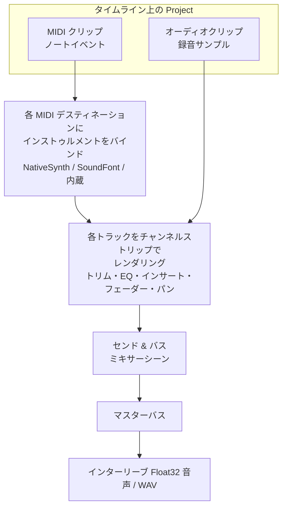

# プロジェクトをオーディオへバウンス

**バウンスは、アレンジ全体を 1 つの音声ファイルへ変換し、保存・再生・解析できるようにする操作です。** DAW を使ったことがあれば「エクスポート」や「レンダリング」のボタンにあたり、libsonare では `Project.bounce*` 一族が担います。レンダリングは**オフライン**（曲をライブ再生するのではなく、実時間より速く一括で処理します）かつ**決定論的**で、同じプロジェクトと同じオプションからは、ビット単位までまったく同一のサンプルが常に得られます。

[Project](./project-editing.md) はタイムライン上にトラックとクリップを保持します。オーディオクリップはすでにサンプルを持つため、そのままレンダリングされます。一方 MIDI クリップが持つのは*イベント*（ノートオン・ノートオフ）であって音そのものではないので、楽譜に演奏者が要るのと同じで、音にするには**インストゥルメント**が必要です。つまりどのバウンスメソッドを選ぶかは、*どのインストゥルメントで MIDI を鳴らすか*という 1 つの問いに尽きます。



図は上から下へ読みます。オーディオクリップはそのまま流れ込み、MIDI クリップはまず楽器をバインドする必要があり、すべてがミキサーを通ってマスターへ合算されます。この一連の処理はオフラインで計算されるため、結果は毎回再現可能です。

::: info 位置は 4 分音符単位
プロジェクトの位置とクリップ長は **PPQ** で表します。これは 4 分音符を表す float です。`ppq: 1` は 4 分音符 1 つ分です。120 BPM では 4 分音符が 0.5 秒なので、4 拍のクリップ（`lengthPpq: 4`）は 2 秒になります。`setTempoSegments([{ startPpq: 0, bpm: 120 }])` でテンポを明示しておくと、バウンスの長さが予測しやすくなります。
:::

::: tip バウンスは生クリップの加算ではなくミキサー全体を反映する
トラックは単純に加算されるわけではありません。各トラックはチャンネルストリップ（トリム、EQ、インサート、フェーダー、パン、センド、バス）を通って[シーンミキサー](./mixing.md)でレンダリングされます。バウンス結果はルーティング済みのマスターで、リアルタイム再生とまったく同じ出力です。
:::

## このページで身につくこと

このページを読むと、次のことを実装できるようになります。

- オーディオクリップのプロジェクトをプレーンな `bounce` でレンダリングできる。
- 内蔵シンセ、[NativeSynth](./native-synth.md)、[SF2 プレイヤー](./soundfont-player.md)を通して MIDI を音にできる。
- NativeSynth のパッチをプリセット名・`va:` プレフィックス・パッチオブジェクトで指定できる。
- Python から `ExternalInstrument` プロトコルで自前のインストゥルメントをホストできる。
- `validateMidiNotes` で MIDI クリップを事前検査し、インストゥルメント未バインド時のコンパイル警告を読める。
- レンダリング長をエンジンに自動導出させ、結果を WAV ファイルへ書き出せる。

## 適切なバウンスメソッドを選ぶ

まず上の行から検討し、MIDI により豊かなインストゥルメントが必要になったときだけ下の行へ進んでください。

| あなたのプロジェクト | 使う API | 結果 |
|----------------------|----------|------|
| オーディオクリップのみ（MIDI なし、または MIDI を無音にしたい） | `bounce` | ルーティング済み音声。MIDI トラックは無音 |
| MIDI をとにかく*鳴らしたい* | `bounceWithBuiltinInstrument` | シンプルなオシレーターシンセ |
| 本格的な楽器のキャラクターが必要な MIDI | `bounceWithSynthInstrument` | フル [NativeSynth](./native-synth.md)（減算 / FM / モーダル / ピアノ …） |
| SoundFont で鳴らしたい MIDI | `bounceWithSf2Instrument` | GS 互換 [SF2 プレイヤー](./soundfont-player.md) |
| 自前の（Python）シンセで駆動する MIDI | `bounce_with_instruments`（Python 専用） | ホスト供給の [`ExternalInstrument`](#python-自前のインストゥルメントをホストする) |

::: info 1 つの Project、すべての実行環境
同じ `Project` モデルと中核のバウンス挙動は、WASM/JS、Node ネイティブ、Python から使えます。名前は各言語の慣習に従います（`bounceWithSynthInstrument` ↔ `bounce_with_synth_instrument`）。CLI では `project bounce`、`project midi-render`、SMF/MIDI 2.0 入出力としてプロジェクトワークフローを使えますが、出力先ごとの楽器バインドオプションがすべて配線されているわけではありません。アレンジメントモデル・コンパイラ・DSP は実行環境を問わず同一です。
:::

## プレーンバウンス: オーディオクリップ

`bounce` はプロジェクトをレンダリング可能なタイムラインへコンパイルし、**インターリーブされた float 音声**へオフラインレンダリングします。オーディオクリップはチャンネルストリップを通って鳴り、MIDI クリップはインストゥルメントがバインドされていないため無音でレンダリングされます。

```typescript [ブラウザ]
import { init, Project } from '@libraz/libsonare';

await init();

const project = new Project();
try {
  project.setSampleRate(48000);
  project.setTempoSegments([{ startPpq: 0, bpm: 120 }]); // 長さを予測可能に

  const track = project.addTrack({ kind: 'audio', name: 'tone' });
  project.addClip({
    trackId: track,
    startPpq: 0,
    lengthPpq: 4,          // 4 分音符 4 つ = 120 BPM で 2 秒
    audio: monoSamples,    // Float32Array
    audioChannels: 1,
    audioSampleRate: 48000,
  });

  // インターリーブステレオ: [L0, R0, L1, R1, ...]
  const audio = project.bounce({ numChannels: 2, sampleRate: 48000 });
} finally {
  project.delete();        // WASM ハンドルは GC されない
}
```

::: danger Project は必ず解放する
`Project` はすべての embind オブジェクトと同様、JavaScript の GC では回収できない WASM ヒープハンドルを保持します。`finally` ブロックで `project.delete()` を呼んでください（Node は `destroy()` も可、Python は `project.close()`）。ハンドルをリークすると、長時間のセッションで WASM メモリが徐々に枯渇します。
:::

### バウンスオプション

オプションオブジェクトの各フィールドは任意です。

| オプション | 意味 | 既定 |
|-----------|------|------|
| `totalFrames` | 出力フレーム数でのレンダリング長 | 自動導出（後述） |
| `blockSize` | レンダリングブロックサイズ | エンジン既定（128） |
| `numChannels` | 出力チャンネル数 | 2 |
| `sampleRate` | 出力サンプルレート（Hz） | プロジェクトのサンプルレート |
| `instrumentLatencySamples` | コンパイラへ渡すホストインストゥルメントの PDC（プラグインディレイ補償） | 0 |

::: info PDC（レイテンシ補償）とは
楽器やエフェクトの中には、数サンプルの「先読み」を必要とし、その分だけ音声を遅れて出すものがあります。**PDC**（プラグインディレイ補償）は、その楽器が何サンプル遅れるかをコンパイラへ伝え、エンジンが遅延分を戻して全トラックのタイミングをそろえられるようにします。楽器にレイテンシがなければ `0` のままで構いません。
:::

### 長さを省略する

`totalFrames` を省略（または `<= 0`）すると、レンダリング長は**コンパイル済みタイムラインから自動導出**されます。すなわちアレンジメントの音楽的な終端に、インストゥルメントのリリーステイルを加えた長さです。内容のあるプロジェクトはフレーム数を自分で計算しなくてもレンダリングでき、空のプロジェクトは空のバッファを返します。固定長のバッファが必要なときだけ `totalFrames` を渡してください。

## 内蔵シンセで MIDI をバウンスする

MIDI のみのプロジェクトをプレーンな `bounce` でバウンスすると無音になります。**内蔵オシレーターシンセ**を通せば、1 回の呼び出しで音にできます。波形とエンベロープを選ぶバインディングを渡すか、既定のサイン波パッチなら `{}` を渡します。

```typescript [ブラウザ]
const project = new Project();
try {
  project.setSampleRate(48000);
  project.setTempoSegments([{ startPpq: 0, bpm: 120 }]);

  const { clipId } = project.addMidiClip(0, 4);   // MIDI トラック + クリップ、4 拍長
  project.setMidiEvents(clipId, [
    Project.midiNoteOn(0, 0, 0, 60, 100),         // 0 拍目で C4
    Project.midiNoteOff(3, 0, 0, 60, 0),          // 3 拍目でリリース
  ]);

  // MIDI のみのプロジェクト -> 無音でないステレオ音声
  const audio = project.bounceWithBuiltinInstrument(
    { waveform: 'saw', gain: 0.5 },
    { numChannels: 2, sampleRate: 48000 },
  );
} finally {
  project.delete();
}
```

`BuiltinSynthBinding` は `waveform`（`'sine'`、`'saw'`、`'square'`、`'triangle'`）、`gain`、ADSR（`attackMs`、`decayMs`、`sustain`、`releaseMs`）、`polyphony`、そして 1 つの MIDI デスティネーションを指す `destinationId` を受け付けます。数値フィールドはすべて「0 / 省略で既定値を維持」なので、`{}` がそのまま使える既定パッチになります。複数の MIDI デスティネーションへ供給するにはバインディングの**配列**を渡します。明示的な空配列 `[]`（または `undefined` / `null`）は何もバインドせず、無音でレンダリングします。

## NativeSynth で MIDI をバウンスする

本格的な楽器のキャラクターが必要なら、`bounceWithSynthInstrument` が MIDI をフル [NativeSynth](./native-synth.md) へ通します。減算・FM・Karplus-Strong・モーダル・加算・パーカッション・ピアノの各エンジンに加え、リアリズムレイヤーまで使えます。インストゥルメントの指定方法は 3 通りです。

```typescript [ブラウザ]
import { init, Project, synthPresetNames } from '@libraz/libsonare';

await init();
synthPresetNames();   // ['sine', 'saw-lead', 'square-lead', 'sub-bass', 'warm-pad', 'e-piano', 'bell', 'brass', ...]

// 1. プリセット名の文字列
const a = project.bounceWithSynthInstrument('saw-lead', { numChannels: 2, sampleRate: 48000 });

// 2. 同じプリセットを "va:" ルーティングプレフィックスつきで
const b = project.bounceWithSynthInstrument('va:saw-lead', { numChannels: 2, sampleRate: 48000 });

// 3. パッチオブジェクト: ベースプリセット + ラッパーセクションの上書き
const c = project.bounceWithSynthInstrument(
  { preset: 'warm-pad', filterCutoffHz: 1200, ampRelease: 0.6 },
  { numChannels: 2, sampleRate: 48000 },
);
```

有効な名前はマジック文字列をハードコードせず [`synthPresetNames()`](./native-synth.md) で取得してください。未知の名前は例外を投げます。パッチオブジェクトは `preset` ベース（`preset` 省略時は既定の減算パッチ）から始まり、ラッパーセクションを上書きします。全フィールドの一覧は [NativeSynth](./native-synth.md) を参照してください。複数のデスティネーションをバインドするには配列を渡します。空配列は何もバインドしません。

::: info 構造上、決定論的
プロジェクト・オプション・パッチを固定すれば、`bounceWithSynthInstrument` はビット単位で再現可能です。これはすべてのバウンスメソッドに共通で、だからこそバウンスをテストのスナップショットに採ったり、ハッシュでキャッシュしたりしても安全です。
:::

## SoundFont で MIDI をバウンスする

`bounceWithSf2Instrument` は、プロジェクトに読み込まれた SoundFont を供給源とする GS 互換 [SoundFont プレイヤー](./soundfont-player.md)で MIDI を鳴らします。先に `.sf2` のバイト列を読み込み、それからバウンスします。

```typescript [ブラウザ]
const sf2Bytes = new Uint8Array(await (await fetch('/piano.sf2')).arrayBuffer());
project.loadSoundFont(sf2Bytes);

// プレイヤーあたり 16 MIDI チャンネル、チャンネル 10 はバンク 128 のドラム、GS NRPN + SysEx に対応
const audio = project.bounceWithSf2Instrument(
  { gain: 0.5 },
  { numChannels: 2, sampleRate: 48000 },
);
```

SoundFont がカバーしないプログラム（SoundFont を 1 つも読み込まずにバウンスする場合を含む）は、内蔵シンセの GM バンクへフォールバックします。`(channel, bank, program)` ごとに `'sf2'` で解決されるか `'synth'` へフォールバックするかは、[`soundFontManifest()`](./soundfont-player.md) で確認できます。

## Python: 自前のインストゥルメントをホストする

Python バインディングは、`ExternalInstrument` プロトコルで書いた**任意**のインストゥルメントをホストでき、`bounce_with_instruments` がそれをディスパッチします。必須なのは `render` だけで、`prepare`、`on_event`、`latency_samples` / `tail_samples` 属性は任意（ダックタイピング）です。

```python
import numpy as np
import libsonare as sonare


class SineInstrument:
    """最小構成の外部インストゥルメント: 保持中のノートごとにサイン波 1 ボイス。"""

    latency_samples = 0      # コンパイラへ報告する PDC（プラグインディレイ補償）
    tail_samples = 4096      # 自動長バウンス向けのリリース／エフェクトテイル

    def prepare(self, sample_rate: float, max_block_size: int) -> None:
        self.sample_rate = sample_rate

    def on_event(self, destination_id: int, ump_words: tuple[int, ...], render_frame: int) -> None:
        # ディスパッチされた UMP ワード（ノートオン／オフ）を解釈してボイスを更新する。
        ...

    def render(self, channels: np.ndarray, num_frames: int) -> None:
        # channels はゼロ埋め済みの (num_channels, num_frames) float32 配列。
        # 自分の音声をここへ加算する。無関係なフレームを上書きしない。
        channels += 0.0


with sonare.Project.from_json(project_json) as project:
    audio = project.bounce_with_instruments(
        SineInstrument(),
        total_frames=0,            # 0 => 長さを自動導出（+ tail_samples）
        num_channels=2,
        sample_rate=48000,
    )                              # -> np.ndarray、形状 (frames, channels)
```

各コールバックはバウンスを呼び出したスレッド上で同期的に実行されるため、スレッド間で守るべき状態はありません。コールバック内で送出された例外は呼び出し側へ伝播します。`ValueError` は無音のドロップアウトではなく `ValueError` として表面化します。`tail_samples` は自動長バウンスを延長し、リバーブやリリースのテイルが切れないようにします。

複数の楽器を同時に鳴らすには、単一の楽器ではなく `instruments=[(destination_id, instrument), ...]` を渡します。各タプルが 1 つの楽器を 1 つの MIDI デスティネーションにバインドします。

## バウンス前に MIDI を検証する

コンパイラは寛容で、インストゥルメント未バインドの MIDI クリップはエラーではなく**非致命的な警告**です。`compile()` の結果は `hasTimeline: true` のままで、診断には次のメッセージが含まれます。

```
project contains MIDI clips; bounce is silent unless an instrument is bound
```

このメッセージは、`bounce` からいずれかのインストゥルメントバウンスへ切り替える合図です。*本当の*問題（鳴りっぱなしのノート）を捕まえるには、各 MIDI クリップを `validateMidiNotes` で事前検査します。これはすべてのノートオンに対応するノートオフがあるかを確認します。

```typescript
const report = project.validateMidiNotes(clipId);
// { ok: true, unmatchedNoteOns: 0, unmatchedNoteOffs: 0 }
if (!report.ok) {
  // 宙吊りのノートはレンダリング終了まで鳴り続ける — 先にイベントを直す
}
```

クリップイベントの確認と修復については [プロジェクト編集](./project-editing.md) を参照してください。

## バウンスを WAV ファイルへ書き出す

バウンスはプレーンな `Float32Array`（チャンネルでインターリーブ）です。ブラウザでは 16 ビット PCM の WAV にラップしてダウンロードさせます。

```typescript
function exportWav(interleaved: Float32Array, sampleRate: number, numChannels: number): Blob {
  const bytesPerSample = 2;
  const dataBytes = interleaved.length * bytesPerSample;
  const buffer = new ArrayBuffer(44 + dataBytes);
  const view = new DataView(buffer);
  const writeStr = (offset: number, s: string) => {
    for (let i = 0; i < s.length; i++) view.setUint8(offset + i, s.charCodeAt(i));
  };

  writeStr(0, 'RIFF');
  view.setUint32(4, 36 + dataBytes, true);
  writeStr(8, 'WAVE');
  writeStr(12, 'fmt ');
  view.setUint32(16, 16, true);                                   // PCM チャンクサイズ
  view.setUint16(20, 1, true);                                    // PCM フォーマット
  view.setUint16(22, numChannels, true);
  view.setUint32(24, sampleRate, true);
  view.setUint32(28, sampleRate * numChannels * bytesPerSample, true);
  view.setUint16(32, numChannels * bytesPerSample, true);
  view.setUint16(34, 8 * bytesPerSample, true);
  writeStr(36, 'data');
  view.setUint32(40, dataBytes, true);

  let offset = 44;
  for (let i = 0; i < interleaved.length; i++) {
    const s = Math.max(-1, Math.min(1, interleaved[i]));          // 量子化前にクランプ
    view.setInt16(offset, s < 0 ? s * 0x8000 : s * 0x7fff, true);
    offset += bytesPerSample;
  }
  return new Blob([buffer], { type: 'audio/wav' });
}

const audio = project.bounceWithSynthInstrument('saw-lead', { numChannels: 2, sampleRate: 48000 });
const url = URL.createObjectURL(exportWav(audio, 48000, 2));
// url を <a download> に割り当ててクリックさせる
```

Python では CLI が WAV を書き出します（次節）。ライブラリから直接書く場合は、`np.ndarray` を `soundfile` や任意の WAV ライターへ渡してください。

## Python CLI からバウンスする

Python パッケージには `project` サブコマンドが付属し、プロジェクト JSON を読み込んでコードを書かずに WAV へレンダリングできます。

```bash
# プレーンバウンス（オーディオクリップ。MIDI トラックは無音）
sonare project bounce --in song.json -o master.wav --sample-rate 48000

# MIDI を NativeSynth の既定パッチで鳴らす
sonare project bounce --in song.json -o master.wav --synth

# MIDI を名前付き NativeSynth プリセットで鳴らす
sonare project bounce --in song.json -o master.wav --synth saw-lead

# 同等の専用 MIDI レンダラー
sonare midi-render --in song.json -o master.wav --synth saw-lead

# まず確認: コンパイル診断（インストゥルメント未バインド警告を含む）
sonare project compile --in song.json --json
sonare project synth-presets          # 有効な NativeSynth プリセット名を列挙
```

`--synth` フラグは値が任意です。省略すれば既定パッチ、値を渡せばプリセット名になります。SF2 とデスティネーション別のシンセ JSON は CLI には接続されていません。SoundFont を使うバウンスは Project API を使ってください。ほかに `project new`、`project validate`、`project abi` も使えます。

## レシピ

:::: details MIDI のみのプロジェクトをダウンロード可能な WAV へ
インストゥルメントと書き出しを含む、MIDI からファイルまでの全経路です。

```typescript
const project = new Project();
try {
  project.setSampleRate(48000);
  project.setTempoSegments([{ startPpq: 0, bpm: 120 }]);
  const { clipId } = project.addMidiClip(0, 4);
  project.setMidiEvents(clipId, [
    Project.midiNoteOn(0, 0, 0, 60, 100),
    Project.midiNoteOff(3, 0, 0, 60, 0),
  ]);
  const audio = project.bounceWithSynthInstrument('saw-lead', { numChannels: 2, sampleRate: 48000 });
  const url = URL.createObjectURL(exportWav(audio, 48000, 2));
} finally {
  project.delete();
}
```
::::

:::: details 出荷前に無音バウンスを捕まえる
コンパイルし、警告を読み、それからインストゥルメントを選びます。

```typescript
const result = project.compile();
const hasMidiWarning = result.diagnostics.some((d) =>
  d.severity === 1 && d.message.includes('bounce is silent'),
);
const audio = hasMidiWarning
  ? project.bounceWithSynthInstrument('saw-lead', { numChannels: 2 })
  : project.bounce({ numChannels: 2 });
```
::::

きれいなバウンスが得られれば、ミックスは完成です。各トラックがマスターへ届く前の音作りを調整したいなら [ミキシングエンジン](./mixing.md) でチャンネルストリップを詰め、アレンジしてバウンスする素材をさらに録りたいなら [録音とテイク](./recording-and-takes.md) を参照してください。

## 関連

- [プロジェクト編集](./project-editing.md) — バウンスするトラック・クリップ・MIDI イベントを組み立てる
- [NativeSynth](./native-synth.md) — `bounceWithSynthInstrument` の背後にあるシンセサイザー
- [SoundFont プレイヤー](./soundfont-player.md) — `bounceWithSf2Instrument` の背後にある SF2 バックエンド
- [MIDI 入力](./midi-input.md) — アレンジしてバウンスする MIDI を取り込む
- [ミキシングエンジン](./mixing.md) — 各トラックが通るチャンネルストリップ・センド・バス
