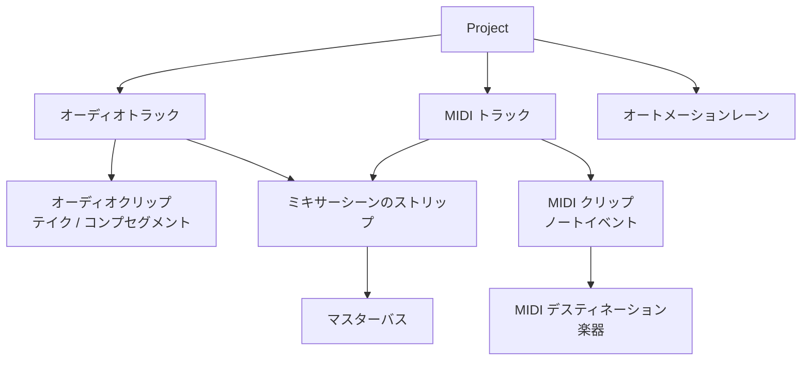
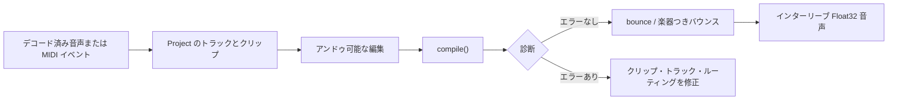

# プロジェクト & アレンジ編集

**DAW を開かずに、曲のアレンジをコードで組み立てたい——** それを叶えるのが `Project` です。**プロジェクト**は、1 曲を構成するすべてを保持するタイムラインです。オーディオトラック、MIDI トラック、そこに置かれたクリップ、テンポマップ、拍子、マーカーが含まれます。libsonare には小さなヘッドレス DAW 編集面である `Project` モデルが備わっており、DAW ホストを組み込まずに、**自分のアプリの中**でそのタイムラインを構築・編集・シリアライズできます。

作業は短いループです。アレンジを組み立て、アンドゥ可能な操作で編集し、[コンパイル](#アレンジをコンパイルする)して再生可能なタイムラインにし、JSON に保存し、最後に[音声をレンダリング](#音声をレンダリングする)します。`Project` は**オフラインの制御スレッド向け API**（音声スレッドでは決して動きません）で、ブラウザ（WASM）でも Node でも Python でも同じように動作します。

::: info 最初に押さえる 3 語
**トラック**はタイムライン上の 1 本のレーン（オーディオレーンまたは MIDI レーン）です。**クリップ**はトラックに置かれた 1 ブロックの内容で、録音オーディオの一片や MIDI ノートの領域です。**PPQ**（pulses per quarter note）は libsonare が音楽的な時間を測る単位です。クリップの開始・長さ・イベント位置はすべて 4 分音符を単位として表され、`lengthPpq: 4` はテンポに関係なく 4 分音符 4 つ分の長さになります。
:::

::: info ヘッドレス DAW
**ヘッドレス DAW** は、独自の画面・タイムライン UI・プラグインホストを持たない DAW の中核部分です。libsonare はデータモデルと音声エンジンを提供し、ボタン、波形ビュー、ファイル選択、プロジェクト一覧などはあなたのアプリ側で作ります。
:::

::: tip パイプライン内での編集の位置
**解析**はトラックが「何か」を調べます。**編集**はタイムライン上にクリップを配置・トリミングし、タイミングを直します。**ミキシング**は複数トラックをステレオバスへまとめます。**マスタリング**は仕上がったミックスを配信向けに磨きます。本ページは編集の工程で、「ステムと MIDI のフォルダ」を「構造化されたアレンジ」へ変える段階です。*クリップ*・*トラック*・*フェード*・*テンポマップ* という言葉に馴染みがなければ、先に [編集の基礎](./glossary/concepts/editing-basics.md) を読んでください。
:::

## プロジェクトのモデル

プロジェクトはいくつかの単純な部品を入れ子にした構造で、各部品が次の部品の入れ物になっています。

- 各**トラック**は**クリップ**（タイムライン上に置く内容のブロック）を持ちます。
- オーディオクリップは代替の**テイク**と、それらの良い部分を 1 つの演奏につなぐ**コンプ**を持てます。
- トラックは**オートメーションレーン**——音量やフィルターのカットオフなどのパラメータを時間方向に動かす記録カーブ——を持てます。フェーダーが自動で動くようなものです。
- MIDI トラックは楽器の**デスティネーション**（そのノートを実際に音にするシンセやサンプラー）を指します。
- すべてのトラックは**ミキサーシーン**のストリップ——EQ・フェーダー・パン・センドから成る自分のチャンネル——を通ってマスターへ流れます。

::: info MIDI の「デスティネーション」とは
MIDI ノートは「いま音 60 を鳴らせ」といった指示にすぎず、音そのものではありません。**デスティネーション**は、その指示を送り届ける楽器——指示を音声に変えるシンセやサンプラー——です。MIDI トラックはデスティネーションを名前で指し、レンダリング時に実際の楽器をそこへバインドします。[プロジェクトバウンス](./project-bounce.md)を参照してください。
:::



## 編集の流れを先に見る

API の一覧へ進む前に、この流れを頭に入れておくと迷いにくくなります。`Project` を編集し、コンパイルでタイムラインを検査し、バウンスで音声サンプルへ変換します。



初学者がつまずきやすい点は 2 つです。

- `compile()` は音を作りません。アレンジを検査し、レンダリング可能な形へ準備します。
- 通常の `bounce()` はオーディオトラックだけをレンダリングします。MIDI トラックを鳴らすには `bounceWithSynthInstrument(...)` や `bounceWithSf2Instrument(...)` のような楽器つきバウンスが必要です。

## このページで身につくこと

このページを読むと、次のことができるようになります。

- `Project` を作成し、オーディオ／MIDI トラックを追加してクリップを配置する。
- クリップ（分割・トリム・移動・ゲイン・フェード・ループ・ソース差し替え・複製・削除）とトラック（追加・名前変更・ルーティング・種別変更・削除）を**アンドゥ可能な**操作で編集する。
- PPQ、テンポセグメントを持つテンポマップ、拍子、マーカーを使って音楽的な時間を正しく置く。
- クリップの重なりポリシーとワープモード（`off` / `repitch` / `tempo-sync`）をワープアンカーとともに選ぶ。
- キー／コード注釈とオートメーションレーンをプロジェクトへ書き込む。
- 再生可能なタイムラインへコンパイルし、構造化された診断と致命的でない警告を読む。
- 決定的な JSON で保存・読み込みし、SMF と MIDI 2.0 クリップファイル形式で MIDI を交換する。

## プロジェクトを作成して内容を追加する

すべてのプロジェクトは空から始まります。サンプルレートを設定し、トラックを追加し、クリップを配置します。`addTrack` と `addClip` は安定した整数 ID を返し、以降の編集ではこの ID を使います。位置と長さは **PPQ** です。

::: code-group

```typescript [ブラウザ / Node]
import { init, Project } from '@libraz/libsonare';

await init();

const project = new Project();
try {
  project.setSampleRate(48000);

  // 録音クリップ 1 つを持つオーディオトラック（デコード済みインターリーブ float 音声）
  const audioTrack = project.addTrack({ kind: 'audio', name: 'lead-gtr' });
  const clipId = project.addClip({
    trackId: audioTrack,
    startPpq: 0,          // 先頭に配置
    lengthPpq: 4,         // 4 分音符 4 つ分の長さ
    audio: guitarMono,    // デコード済みサンプルの Float32Array
    audioChannels: 1,
    audioSampleRate: 48000,
  });

  // MIDI トラック + クリップを 1 回で作成
  const { trackId: midiTrack, clipId: midiClip } = project.addMidiClip(0, 8);
} finally {
  project.delete();       // WASM ハンドルは GC されない — 必ず解放する
}
```

```python [Python]
import libsonare as sonare

with sonare.Project() as project:
    project.set_sample_rate(48000)

    audio_track = project.add_track("audio", name="lead-gtr")
    clip_id = project.add_clip(
        audio_track,
        start_ppq=0.0,        # 先頭に配置
        length_ppq=4.0,       # 4 分音符 4 つ分の長さ
        audio=guitar_mono,    # インターリーブ float サンプル
        audio_channels=1,
        audio_sample_rate=48000,
    )

    midi_track, midi_clip = project.add_midi_clip(0.0, 8.0)
# with ブロックを抜けるとネイティブハンドルが解放される
```

:::

::: danger プロジェクトは必ず解放する
`Project` はすべての WASM オブジェクトと同様、JavaScript の GC では回収できないヒープハンドルを保持します。`finally` ブロックで `project.delete()`（Node は `destroy()` も可）を呼んでください。Python ではコンテキストマネージャ（`with sonare.Project() as project:`）として使うか、`project.close()` を呼びます。ハンドルをリークすると、長時間のセッションで WASM メモリが徐々に枯渇します。
:::

## クリップを編集する

クリップ操作はいずれも 1 つのアンドゥ可能なコマンドで、クリップ ID で対象を指定します。

| 操作 | メソッド | 内容 |
|------|----------|------|
| 分割 | `splitClip(clipId, splitPpq)` | 絶対 PPQ でクリップを切り、新しいクリップの ID を返す |
| トリム | `trimClip(clipId, newStartPpq, newLengthPpq)` | 開始と長さを再設定する |
| 移動 | `moveClip(clipId, newStartPpq, newTrackId?)` | クリップをずらす。別トラックへも移せる |
| ゲイン | `setClipGain(clipId, gain)` | クリップごとの線形再生ゲイン（`>= 0`） |
| フェード | `setClipFade(clipId, fadeIn, fadeOut)` | カーブつきのフェードイン／フェードアウト領域 |
| ループ | `setClipLoop(clipId, mode, loopLengthPpq?)` | `'off'` または `'loop'` とループ長 |
| ソース差し替え | `setClipSource(clipId, sourceId)` | クリップを別の登録済みソースへ再バインドする |
| 複製 | `duplicateClip(clipId, newStartPpq)` | 同じトラックにコピーし、新しい ID を返す |
| 削除 | `removeClip(clipId)` | クリップを削除する |

```typescript
project.setClipGain(clipId, 0.8);
project.setClipFade(
  clipId,
  { lengthPpq: 0.5, curve: 'equal-power' },  // 半拍でフェードイン
  { lengthPpq: 1.0, curve: 'linear' },       // 1 拍でフェードアウト
);
const tailId = project.splitClip(clipId, 2); // 拍 2 で切り、後半が新クリップになる
project.setClipLoop(tailId, 'loop', 2);      // 後半を 2 拍ごとにループ
const copyId = project.duplicateClip(tailId, 8);
```

フェードカーブは `'linear'`・`'equal-power'`・`'exponential'`・`'logarithmic'` です。ループモードは `'off'` または `'loop'` で、ループ時は正の `loopLengthPpq` が必要です。

Python では同じ操作が snake_case になり、フェードは長さとカーブを個別の引数で受け取ります。

```python
project.set_clip_gain(clip_id, 0.8)
project.set_clip_fade(
    clip_id,
    fade_in_length_ppq=0.5,
    fade_out_length_ppq=1.0,
    fade_in_curve="equal-power",
    fade_out_curve="linear",
)
tail_id = project.split_clip(clip_id, 2.0)
project.set_clip_loop(tail_id, "loop", 2.0)
copy_id = project.duplicate_clip(tail_id, 8.0)
```

## トラックを編集する

トラック操作も同様にアンドゥ可能です。

| 操作 | メソッド | 内容 |
|------|----------|------|
| 追加 | `addTrack({ kind, name })` | `'audio'`・`'midi'`・`'aux'` トラックを追加し、ID を返す |
| 削除 | `removeTrack(trackId)` | トラックとそのクリップを削除する |
| 名前変更 | `renameTrack(trackId, name)` | トラック名を変える |
| 種別変更 | `setTrackKind(trackId, kind)` | トラックを `'audio'` / `'midi'` / `'aux'` 間で切り替える |
| ルーティング | `setTrackRoute(trackId, channelStripRef, outputTarget)` | トラックをミキサーストリップと出力バスに結びつける |

```typescript
const drums = project.addTrack({ kind: 'audio', name: 'drums' });
project.renameTrack(drums, 'drum-bus');
project.setTrackRoute(drums, 'strip-drums', 'master'); // ミキサーシーンのストリップへ配線
```

**aux** トラックは自前のクリップを持ちません。内容を録音する場所ではなく、ルーティング／リターン用のレーン（たとえばエフェクトリターンやサブミックス）です。

`setTrackRoute` はプロジェクトトラックを、プロジェクトの[ミキサーシーン](./mixing-scene-json.md)（`setMixerSceneJson` で設定）内のストリップへリンクします。これにより、バウンスしたトラックがそのチャンネルストリップの処理を通ります。

## アンドゥとリドゥ

プロジェクトは**編集履歴**を保持します。クリップ・トラック・オートメーション・注釈の各操作は、取り消せるコマンドを積みます。

```typescript
project.setClipGain(clipId, 0.3);
project.undo();   // ゲインが元の値に戻る
project.redo();   // ゲイン編集を再適用する
```

履歴は厳密なので、編集前に `toJson()` を呼び、アンドゥしてから再び `toJson()` を呼ぶと、バイト単位で同一の JSON になります。テストやエディタ UI の変更検出に役立つ不変条件です。

## 音楽的な時間: PPQ・テンポ・拍子・マーカー

すべての位置は **PPQ**（浮動小数点値としての 4 分音符。分数拍も正確に表せます）です。テンポと拍子は、順序づけられたセグメントのリストとしてプロジェクトに保持されます。

### テンポマップとテンポセグメント

**テンポマップ**はテンポセグメントのリストです。各セグメントは PPQ 位置から始まり BPM を設定します。任意の `endBpm` を指定すると、そのセグメントで新しいテンポへ直線的に変化します。

```typescript
project.setTempoSegments([
  { startPpq: 0,  bpm: 120 },                 // 先頭から一定の 120 BPM
  { startPpq: 16, bpm: 120, endBpm: 140 },    // このセグメントで 120 -> 140 へランプ
  { startPpq: 32, bpm: 140 },
]);
project.tempoSegmentCount(); // 3
```

### 拍子

拍子は並列のセグメントリストで、各セグメントは分子（1 小節あたりの拍数）と分母（拍の単位）を持ちます。

```typescript
project.setTimeSignatures([
  { startPpq: 0,  numerator: 4, denominator: 4 },
  { startPpq: 64, numerator: 3, denominator: 4 },  // 後半で 3/4 へ切り替え
]);
```

### マーカー

マーカーはタイムライン上の位置にラベルを付けます。マーカー ID に `0` を渡すと新しい ID が割り当てられ、安定した ID が返ります。

```typescript
const introId = project.setMarker(0, 0,  'intro');
project.setMarker(0, 16, 'verse');
project.setMarker(introId, 0, 'intro (edited)'); // ID を再利用して更新
```

Python では `set_tempo_segments`・`set_time_signatures`・`set_marker` が同じフィールドを受け取ります（セグメントリストはマッピングまたはタプル）。

## 重なりポリシー

**重なりポリシー**は、同じトラック上の 2 つのクリップが同じ時間範囲を占めてよいかを決めます。プロジェクト全体に適用されます。

```typescript
project.setOverlapPolicy(0); // クリップの重なりを禁止（既定）
project.setOverlapPolicy(1); // 重なりを許可（クロスフェードや重ねたテイクなど）
project.getOverlapPolicy();  // 読み戻す
```

`0` は重なりを禁止し、`1` は許可します。重ねたクリップやクロスフェードを意図する場合は許可し、トラックを厳密に逐次にしたい場合は禁止します。

## ワープ: クリップをグリッドに合わせて伸縮する

**ワープ**は、録音したオーディオクリップを固定の元の速度で再生する代わりに、プロジェクトのテンポへ追従させる機能です。録音を少し前後させたり伸縮させたりして、拍をグリッドに合わせるイメージです。内部的には、クリップの録音タイムラインをプロジェクト時間から切り離して実現します。各クリップはワープ**モード**と、任意のアンカーから成るワープ**マップ**を持ちます。

| ワープモード | 意味 |
|--------------|------|
| `'off'` | 音声をネイティブのレートで再生し、テンポを無視する |
| `'repitch'` | テンポに合わせて速度を変える（テープのようにピッチも動く） |
| `'tempo-sync'` | ピッチを保ったままテンポに追従するようタイムストレッチする |

::: info tempo-sync がピッチを保つしくみ
`'tempo-sync'` は音声を**フェーズボコーダー**でタイムストレッチします。これは STFT ベースのタイムストレッチで、ピッチを変えずにタイミングだけを変えます（`'repitch'` がテープのように両方を動かすのとは対照的です）。同じアルゴリズムがリアルタイム再生でもオフラインの[バウンス](./project-bounce.md)でも動くため、ワープしたクリップはどちらでレンダリングしても同じ音になります。ステレオやマルチチャンネルのクリップでは、全チャンネルをピークロック付きの 1 回のボコーダーパスで伸縮するため、チャンネル間で位相が揃ったままになり、ステレオイメージがずれません。
:::

<SonareDemo id="time-stretch" />

**ワープマップ**はアンカーのリストで、各アンカーは「録音中のこの瞬間をタイムライン上のここに置く」というピンです。具体的には、各 `ProjectWarpAnchor` が `warpSample`（プロジェクト／ワープ後タイムライン上の位置）を `sourceSample`（録音音声内の対応位置）に結びつけ、エンジンは隣り合うアンカーの間で音声を滑らかに伸縮させます。

```typescript
// 再利用できるワープマップを定義し、クリップに割り当てる
project.setWarpMap({
  id: 1,
  name: 'groove',
  anchors: [
    { warpSample: 0,     sourceSample: 0 },
    { warpSample: 24000, sourceSample: 12000 }, // 小節前半をソースの 2 倍速で再生
  ],
});
project.setClipWarpRef(clipId, 1);          // マップを参照（0 で解除）
project.setClipWarpMode(clipId, 'tempo-sync');
// project.removeWarpMap(1);                 // 不要になったら ID でマップを削除
```

## テイクとコンプレーン

クリップは代替の**テイク**と、複数テイクの良い箇所をつなぐ**コンプ**（合成）を持てます。これらは `Project` の第一級機能（`setClipTakes`・`setClipCompSegments`・`addLoopRecordingTakes`）で、ループ録音のキャプチャを含めて専用ページで詳しく扱います。[録音とテイク](./recording-and-takes.md)を参照してください。

## オートメーションレーン

**オートメーションレーン**は、ホスト定義のパラメータ 1 つをブレークポイントで時間方向に駆動します。各ブレークポイントは PPQ 位置・値・次の点へのカーブ（`'linear'`・`'exponential'`・`'hold'`・`'scurve'`）を持ちます。

```typescript
const lane = project.addAutomationLane(trackId, {
  targetParamId: 1,                                   // 駆動するパラメータのホスト ID
  points: [
    { ppq: 0, value: 0.0, curve: 'linear' },
    { ppq: 4, value: 1.0, curve: 'exponential' },
  ],
});
project.editAutomationLane(trackId, lane, { targetParamId: 1, points: [/* … */] });
project.removeAutomationLane(trackId, lane);
```

レーンの `targetParamId` は自分のパラメータ ID です。プロジェクトはブレークポイントをそのまま保存し、コンパイル済みタイムラインで再生します。

## キーとコードの注釈書き戻し

プロジェクトは音楽的な注釈、すなわち解析器が生成した**キー**領域と**コード**シンボルを保持できます。これによりアレンジとともに移動し、保存／読み込みでも残ります。どちらのストリームも全置換で、アンドゥ可能です。

```typescript
project.annotateKeys([
  { startPpq: 0, endPpq: 16, tonicPc: 0, mode: 1 }, // C メジャー（tonicPc 0、mode 1 = major）
]);
project.annotateChords([
  { startPpq: 0, endPpq: 4, rootPc: 0, quality: 1, romanNumeral: 'I' },
  { startPpq: 4, endPpq: 8, rootPc: 7, quality: 1, romanNumeral: 'V' },
]);
```

ピッチクラスは `0..11`（C = 0）または不明を表す `255` です。`mode` と `quality` は小さな序数です（キーモード `1` = major、`2` = minor、コードクオリティ `1` = major、`2` = minor、…）。

## MIDI の内容

MIDI クリップはフラットなイベントリストを保持します。`Project.midi*` 静的パッカー（正規の MIDI 1.0 ワードを生成します）でイベントを作り、`setMidiEvents` でクリップのリストを置き換えます。

```typescript
project.setMidiEvents(midiClip, [
  Project.midiNoteOn(0, 0, 0, 60, 100),  // (ppq, group, channel, note, velocity)
  Project.midiNoteOff(2, 0, 0, 60),
  Project.midiNoteOn(2, 0, 0, 64, 100),
  Project.midiNoteOff(4, 0, 0, 64),
]);
project.setProgram(midiClip, 4);          // GM プログラム（例: 4 = エレクトリックピアノ）
```

### `validateMidiNotes`

バウンス前に MIDI クリップのハングノート、つまり対応するノートオフのないノートオン（またはその逆）を調べます。放置するとスタックノートが鳴ります。`validateMidiNotes` はチャンネル + ノートごとに FIFO でノートオンとノートオフを対応づけ、結果を報告します。

```typescript
const check = project.validateMidiNotes(midiClip);
// { ok: true, unmatchedNoteOns: 0, unmatchedNoteOffs: 0 }
if (!check.ok) {
  console.warn(`ハングノート: オン ${check.unmatchedNoteOns} / オフ ${check.unmatchedNoteOffs}`);
}
```

MIDI アレンジを鳴らすには、レンダリング時に楽器をバインドします。[音声をレンダリングする](#音声をレンダリングする)、[NativeSynth](./native-synth.md)、[SoundFont プレイヤー](./soundfont-player.md)を参照してください。コントローラからプロジェクトをライブで駆動するには、[MIDI 入力](./midi-input.md)を参照してください。

### MIDI-FX チェーンをクリップに焼き込む

MIDI-FX チェーン（トランスポーズ、ベロシティカーブ、ヒューマナイズなど）は通常、クリップのイベントに重なる**非破壊**のレイヤーとして働きます。`bakeMidiFx` はその逆で、チェーンを 1 回実行し、その結果で**クリップに保存された MIDI イベントを書き換えます**。これにより変換後のノートがクリップの実体になります。エフェクトをアレンジに固定したいときは焼き込み、まだ調整したいときは非破壊のままにしておきます。

```typescript
const configJson = JSON.stringify({ transpose: 12 }); // 1 オクターブ上げる
project.bakeMidiFx(midiClip, configJson);              // イベントがその場でトランスポーズされる
```

Python では `project.bake_midi_fx(clip_id, config_json)` です。書き換えは破壊的ですが、ほかの編集と同様にアンドゥ可能です。`undo()` で元のイベントに戻ります。

## 自動テンポとグリッドスナップ

編集を拍に合わせる 2 つのヘルパーがあります。

- **`autoTempo(audio, sampleRate)`** はモノラルバッファからテンポを検出し、テンポマップとして設定し、主要な BPM を返します。
- **`snapToGrid(ppq, strength)`** は PPQ 座標をプロジェクトグリッドの最近接拍へスナップします。`strength` は `0..1`（1 で完全にスナップ）です。

```typescript
const bpm = project.autoTempo(monoMix, 48000); // テンポを検出して設定し、約 120 を返す
const snapped = project.snapToGrid(1.2, 1.0);  // 1.2 -> 1（最近接拍）
```

## アレンジをコンパイルする

`compile()` は編集済みプロジェクトを**再生可能なタイムライン**へ変換し、構造化された**診断**を報告します。エラー（重大度 `0`）はタイムラインを構築できなかったことを意味し、警告（重大度 `1`）は致命的でなく、タイムラインは依然として再生可能です。

```typescript
const result = project.compile();
// result.hasTimeline     -> エラーなしで再生可能なタイムラインが生成されたとき true
// result.diagnosticCount -> 診断の数
// result.diagnostics     -> [{ code, severity, targetId, message }, …]
// result.messages        -> 改行で連結した人間可読の詳細

if (!result.hasTimeline) {
  for (const d of result.diagnostics) {
    if (d.severity === 0) console.error(`コンパイルエラー (clip/track ${d.targetId}): ${d.message}`);
  }
}
```

よくある**致命的でない**警告として、MIDI クリップを含むが楽器がバインドされていないプロジェクトは正常にコンパイルされますが、無音でバウンスされます。バウンス後に、そのレンダリングが生成した警告を `lastBounceCompileResult()` で読めます。

```typescript
project.bounce({ numChannels: 2 });
const last = project.lastBounceCompileResult();
// last.diagnostics[0].message ->
//   "project contains MIDI clips; bounce is silent unless an instrument is bound"  (重大度 1)
```

Python では `project.compile()` が同じ形（`has_timeline`・`diagnostic_count`・`diagnostics`・`messages`）を返します。

## 保存と読み込み: 決定的な JSON

`toJson()` はプロジェクト全体（トラック、クリップ、MIDI の内容、テンポマップ、拍子、マーカー、注釈、ワープマップ、オートメーション）を**決定的な JSON** にシリアライズします。同じプロジェクトは常にバイト単位で同一のテキストになります。`Project.fromJson(...)` で復元します。

```typescript
const json = project.toJson();
// … `json` をディスク・データベース・postMessage に保存 …

const restored = Project.fromJson(json);
try {
  // restored.toJson() === json
} finally {
  restored.delete();
}
```

致命的でない読み込み警告（たとえば修復のために保持された宙ぶらりんのソース参照）を取得したい場合は `Project.fromJsonWithDiagnostics(json)` を使います。

```typescript
const { project: loaded, diagnostics } = Project.fromJsonWithDiagnostics(json);
try {
  if (diagnostics) console.warn(diagnostics);
} finally {
  loaded.delete();
}
```

Python では `project.to_json()`・`Project.from_json(json)`・`Project.from_json_with_diagnostics(json)` が対応します。

## MIDI 交換: SMF と MIDI 2.0 クリップファイル

プロジェクトのテンポマップと MIDI クリップは 2 つの形式で往復できます。

### 標準 MIDI ファイル (SMF)

```typescript
const smf = project.exportSmf();        // Uint8Array、"MThd" ヘッダ
// … `smf` を .mid ファイルへ書き出す …

const fresh = new Project();
try {
  const firstClip = fresh.importSmf(smf); // 最初に追加されたクリップ ID を返す
} finally {
  fresh.delete();
}
```

### MIDI 2.0 クリップファイル (`SMF2CLIP`)

SMF は MIDI 2.0 より前の形式なので、16 ビットベロシティ・32 ビット CC・パーノートコントローラ・バンク有効なプログラムチェンジを欠落なく運べません。**MIDI 2.0 クリップファイル**（`SMF2CLIP`）はこれらすべてを保持します。MIDI 2.0 の忠実度が重要なときはこちらを選んでください。

```typescript
const clipFile = project.exportClipFile();   // Uint8Array、"SMF2CLIP" ヘッダ
const firstClip = otherProject.importClipFile(clipFile);
```

Python ではこれらが `export_smf` / `import_smf` と `export_clip_file` / `import_clip_file` で、`bytes` を返し受け取ります。

## 音声をレンダリングする

編集はタイムラインを生み、**レンダリング**はそれをサンプルへ変換します。`Project` は `bounce(...)`（オーディオトラックのみ）か、MIDI トラックを鳴らす楽器バインド付きバウンス（`bounceWithBuiltinInstrument`・`bounceWithSynthInstrument`・`bounceWithSf2Instrument`）でオフラインバウンスします。レンダーオプション一式、楽器バインド、SoundFont 読み込み、バウンスが報告する診断は [プロジェクトバウンス & レンダリング](./project-bounce.md) で扱います。

```typescript
// オーディオのみの簡易レンダー。ここでは MIDI トラックは無音です。
const audio = project.bounce({ numChannels: 2 });
```

アレンジがエラーなくコンパイルできたら、次は MIDI トラックを鳴らすことも含めて音声へ変換する番です。[プロジェクトバウンス & レンダリング](./project-bounce.md)へ進んでください。

## 関連

- [編集の基礎](./glossary/concepts/editing-basics.md) — 初学者向けの用語
- [プロジェクトバウンス & レンダリング](./project-bounce.md) — タイムラインを音声へ。楽器ありでもなしでも
- [録音とテイク](./recording-and-takes.md) — テイク、コンプレーン、ループ録音キャプチャ
- [NativeSynth](./native-synth.md) · [SoundFont プレイヤー](./soundfont-player.md) — MIDI トラックを鳴らす
- [MIDI 入力](./midi-input.md) — コントローラからプロジェクトをライブで駆動する
- [ミキシングシーン JSON](./mixing-scene-json.md) — トラックのルーティング先となるシーン
- [バインディング対応表](./binding-parity.md) — 実行環境ごとの API 差分
