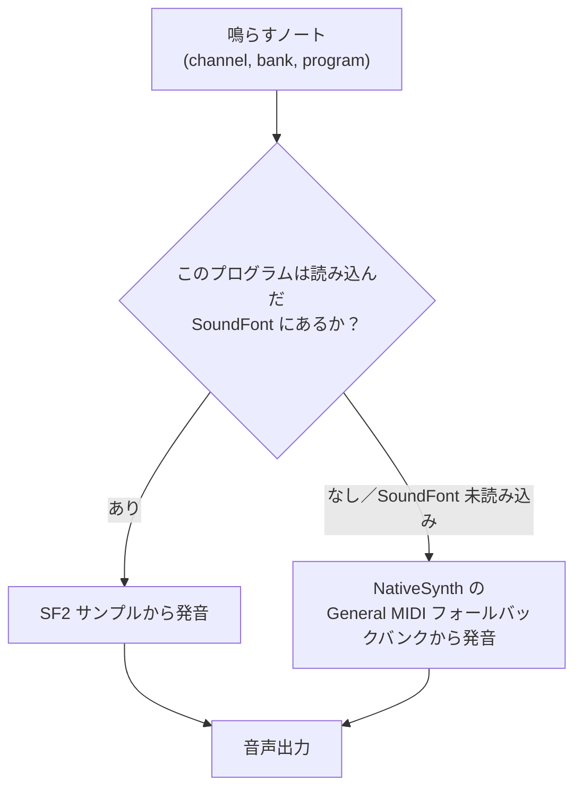

# SoundFont 2 プレイヤー

**SoundFont プレイヤーは、合成音ではなく実際に録音された楽器（本物のピアノ、本物のドラム）で MIDI を再生します**。SoundFont ファイルを渡せば、あとはプレイヤーがやってくれます。

**SoundFont**（よく SF2 と略されます）は、その録音された楽器サンプルと、それを再生する規則を 1 ファイルにまとめたものです。規則とは、どのピッチ・ベロシティでどのサンプルを鳴らすか、どうループするか、エンベロープ・フィルター・LFO でどう整えるか、といった内容です。いわば 1 ファイルに収めたサンプルライブラリです。libsonare には **GS 互換 SF2 プレイヤー**が備わっており、*あなたが用意した* SoundFont を読み込んで、その音色で MIDI トラックを鳴らします。[プロジェクトバウンス](./project-bounce.md)によるオフライン、または[リアルタイムエンジン](./midi-input.md)経由のライブに対応し、16 パートのマルチティンバー再生と、General MIDI のベースラインに重ねた Roland-GS 拡張を備えます。

::: warning SF2 ファイルは自分で用意する必要があります
**SoundFont はライブラリに同梱されていません**。SF2 はコードではなくライセンスされた楽器データであり、バイナリには何も埋め込まれていません。`.sf2` を取得し、そのバイト列をプレイヤーへ渡してください。SF2 が無い場合（または SF2 が対応しないプログラム）でも、再生は無音になりません。組み込みの [NativeSynth](./native-synth.md) GM バンク（データ不要の最終フォールバック）へ落ちます。
:::

::: info 最初に押さえる用語
**プリセット**は SoundFont 内の 1 つの選択可能な音色（「プログラム」）です。**プログラムチェンジ**は MIDI チャンネル上でプリセットを選びます。**バンク**は 128 プログラムをまとめたもので、GS は音色バリエーション用に追加バンクを使い、**バンク 128** をドラムキット用に予約します。GS の慣習でチャンネル 10 がドラムチャンネルです。

**マルチティンバー**とは、プレイヤーが MIDI チャンネルごとに 1 つずつ、複数の異なる楽器を同時に鳴らせること（最大 16）を指します。**GS** は Roland の General MIDI 拡張セットで、素の General MIDI に追加バンクやパートごとの制御を重ねたものです。`GS 互換`のプレイヤーはこれらの拡張を反映するため、GS でオーサリングされた曲が意図どおりに鳴ります。
:::

## 各ノートが音色を選ぶ仕組み

プレイヤーはノートごとに 1 つの問いを立てます。*このノートが選ぶプログラム（その channel・bank・program）に対応するプリセットが、読み込んだ SoundFont に含まれているか？* 本ページではこれを SoundFont がその音色を**カバーする**と呼びます。含まれていれば、そのノートは SF2 サンプルで鳴ります。含まれていなければ（あるいは SoundFont を 1 つも読み込んでいなければ）、そのノートは組み込みの [NativeSynth](./native-synth.md) General MIDI バンクへ落ちます。いずれにせよ音は出ます。**ここでは MIDI が無音になることはありません**。



この判定は、下記の[プログラムマニフェスト](#何が解決するかを知る-プログラムマニフェスト)でプログラムごとに事前確認できます。

下のデモはユーザーが用意した SF2 ファイルではなく内蔵音源を使いますが、SoundFont プレイヤーの基本と同じ考え方を示しています。MIDI の音符は変わらず、鳴らす楽器だけが変わります。実際のアプリでは、読み込んだ SoundFont がそのプログラムを持っていれば SF2 プリセットで鳴り、持っていなければ NativeSynth フォールバックで鳴ります。

<SonareDemo id="midi-piano-roll" />

## このページで身につくこと

このページを読むと、次のことができるようになります。

- 呼び出し側が用意した SF2 を `Project` やリアルタイムエンジンへ読み込み、解放できる。
- どのノートが `sf2` で解決し、どれが `synth` フォールバックになるかをプログラムマニフェストで読める。
- MIDI アレンジを SF2 インストゥルメント経由で決定的にバウンスできる。
- プレイヤーが実装する SF2 のモジュレーター／エンベロープ意味論と GS アーキテクチャ層を理解できる。
- ライブ MIDI 入力向けに SF2 インストゥルメントをバインドできる。

## 正しい入口を選ぶ

プレイヤーは 2 段階で公開されます。オフラインレンダーにはプロジェクトレベル、ライブ再生にはエンジンレベルを使います。

| あなたの状況 | 使う API | 理由 |
|--------------|----------|------|
| 完成した MIDI アレンジを音声へレンダリング | [`Project.bounceWithSf2Instrument(...)`](#sf2-インストゥルメントで-midi-をバウンスする) | プロジェクト全体を決定的にオフラインレンダー |
| レンダー前にカバレッジを確認 | [`Project.soundFontManifest()`](#何が解決するかを知る-プログラムマニフェスト) | プログラムごとの `sf2`／`synth` バックエンド報告 |
| 鍵盤やライブ MIDI ストリームを鳴らす | [`RealtimeEngine.setSf2Instrument(...)`](#エンジンでのライブ再生) | プレイヤーをリアルタイム MIDI 宛先へバインド |

::: info 1 つのエンジン、すべての実行環境
同じ SF2 プレイヤーが WASM/JS、Node ネイティブ、Python から使えます。名前は各言語の慣習に従います（`loadSoundFont` ↔ `load_soundfont`、`bounceWithSf2Instrument` ↔ `bounce_with_sf2_instrument`、`soundFontManifest` ↔ `soundfont_manifest`）が、パーサー・ボイスモデル・GS の挙動は同一です。CLI は SF2 を配線していません。SoundFont を使うバウンスは Project API を使ってください。
:::

## 呼び出し側が用意した SF2 を読み込む

`.sf2` は自分で取得し、生のバイト列をプレイヤーへ渡します。プレイヤーは呼び出しの間に独自のコピーを作るので、渡したバッファは直後に破棄して構いません。押さえておくべき点が 2 つあります。読み込みは、それ以前に読み込んだ SoundFont を**置き換えます**。そして不正なバイト列は例外を投げ、その場合は以前に読み込んだ SoundFont がそのまま保持されます。

::: code-group

```typescript [ブラウザ]
import { init, Project } from '@libraz/libsonare';

await init();

// ファイルは自分で用意する — 自前のアセットホストから取得、またはユーザーに選ばせるなど。
const sf2Bytes = new Uint8Array(await (await fetch('/instruments/my-bank.sf2')).arrayBuffer());

const project = new Project();
try {
  project.loadSoundFont(sf2Bytes);          // 不正な入力で例外
  project.soundFontPresetCount();           // 例: 3 — 読み込んだバンクのプリセット数
  // ... アレンジを作成／編集し、バウンスする（後述） ...
  project.clearSoundFont();                 // 任意: 読み込んだバンクを解放
} finally {
  project.delete();                          // WASM ハンドルは GC されない
}
```

```python [Python]
import libsonare as sonare

with open("instruments/my-bank.sf2", "rb") as f:
    sf2_bytes = f.read()

project = sonare.Project()
try:
    project.load_soundfont(sf2_bytes)        # 不正な入力で SonareError
    project.soundfont_preset_count()         # 例: 3
    # ... アレンジを作成／編集し、バウンスする（後述） ...
    project.clear_soundfont()                # 任意: 読み込んだバンクを解放
finally:
    project.close()                          # ネイティブハンドルを解放
```

:::

::: danger プロジェクトは必ず解放する
`Project` はすべての embind オブジェクトと同様、JavaScript の GC では回収できない WASM ヒープハンドルを保持します。`finally` ブロックで `project.delete()` を呼んでください（Python は `project.close()`）。読み込んだ SoundFont のサンプルプールはプロジェクトとともに解放されるほか、`clearSoundFont()`／`clear_soundfont()` で先に解放できます。
:::

## 何が解決するかを知る: プログラムマニフェスト

レンダー前に、**アレンジが実際に鳴らすプログラムと、それぞれがどこで解決するか**をプロジェクトへ問い合わせます。`soundFontManifest()` は、ノートが鳴らす `(channel, bank, program)` を初回使用順にすべて列挙し、バックエンドを報告します。

- `'sf2'` — 読み込んだ SoundFont がそのプログラムをカバー（GS のバリエーション／ドラムフォールバックを含む）。解決した `presetName` つき。
- `'synth'` — どのプリセットもカバーしないため、NativeSynth GM フォールバックで鳴る。`presetName` は空。

SoundFont を読み込んでいない場合、すべてのエントリが `synth` フォールバックです。これは正直なカバレッジ報告です。`synth` の行は「このパートは鳴るが、サンプルではなくデータ不要の最終フォールバックから出る」を意味します。フォールバックもプログラム番号を見て音色を選びます。たとえば GM プログラム 6（Harpsichord）は Karplus-Strong の撥弦パッチ、プログラム 7（Clavi）は FM 系パッチで鳴ります。

::: code-group

```typescript [ブラウザ]
project.loadSoundFont(sf2Bytes);
for (const p of project.soundFontManifest()) {
  // { channel, bank, program, backend: 'sf2' | 'synth', presetName }
  console.log(`ch${p.channel} bank${p.bank} prog${p.program} -> ${p.backend} ${p.presetName}`);
}
// 例: ch0 bank0 prog0 -> sf2 Piano 1
```

```python [Python]
project.load_soundfont(sf2_bytes)
for p in project.soundfont_manifest():
    # Sf2ProgramStatus(channel, bank, program, backend, preset_name)
    print(f"ch{p.channel} bank{p.bank} prog{p.program} -> {p.backend} {p.preset_name}")
```

:::

::: tip ドラムチャンネルはバンク 128 を報告する
チャンネル 9（1 始まりで MIDI チャンネル 10）のマニフェスト行は `bank: 128`（GS のドラムキットバンク）を報告します。カバーされたキットは `sf2` で解決し、そうでなければフォールバックの GM ドラムマップが鳴ります。
:::

## SF2 インストゥルメントで MIDI をバウンスする

`bounceWithSf2Instrument(...)` はプロジェクト全体をコンパイルしてレンダリングし、バインドされた各 MIDI 宛先を、読み込んだ SoundFont で動く GS 互換 SF2 プレイヤー経由で鳴らします。[`bounceWithBuiltinInstrument`](./project-bounce.md) と同じ構造で、音をサンプル音源にしたものです。レンダーは**決定的**で、同じプロジェクト・オプション・SoundFont・パッチからはビット同一の音声が得られます。

プレイヤーは MIDI の**宛先 ID** にバインドします。これは `setTrackMidiDestination` で設定した値です。パッチは [`Sf2InstrumentConfig`](#インストゥルメント設定とボイスモデル) で、各フィールドは任意のため `{}` がそのまま既定として使えます。

::: code-group

```typescript [ブラウザ]
import { init, Project } from '@libraz/libsonare';

await init();

const project = new Project();
try {
  project.setSampleRate(48000);

  // 宛先 0 へルーティングした 1 ノートの MIDI クリップ。
  const { trackId, clipId } = project.addMidiClip(0, 4);
  project.setTrackMidiDestination(trackId, 0);
  project.setMidiEvents(clipId, [
    Project.midiNoteOn(0, 0, 0, 60, 100),   // ppq, group, channel, note, velocity
    Project.midiNoteOff(2, 0, 0, 60, 0),
  ]);

  project.loadSoundFont(sf2Bytes);

  // 既定の SF2 プレイヤーを宛先 0 へバインドし、ステレオ 4096 フレームをレンダー。
  const audio = project.bounceWithSf2Instrument(
    { destinationId: 0, gain: 1 },
    { totalFrames: 4096, numChannels: 2, sampleRate: 48000 },
  );
  // audio はインターリーブされた Float32Array（frames * channels）
} finally {
  project.delete();
}
```

```python [Python]
import libsonare as sonare

project = sonare.Project()
try:
    project.set_sample_rate(48000.0)

    track, clip = project.add_midi_clip(0.0, 4.0)
    project.set_track_midi_destination(track, 0)
    project.set_midi_events(clip, [
        sonare.Project.midi_note_on(0.0, 0, 0, 60, 100),
        sonare.Project.midi_note_off(2.0, 0, 0, 60, 0),
    ])

    project.load_soundfont(sf2_bytes)

    audio = project.bounce_with_sf2_instrument(
        sonare.Sf2InstrumentConfig(gain=1.0),
        destination_id=0,
        total_frames=4096, num_channels=2, sample_rate=48000,
    )
    # audio は (frames, channels) の float32 ndarray
finally:
    project.close()
```

:::

::: warning 空のバインディングは無音をレンダーする
（パッチや `undefined` ではなく）明示的に空配列 `[]` を渡すと、バインドされるインストゥルメントは**ゼロ**になり、MIDI トラックは無音でレンダーされます。複数の宛先にバインドするには、それぞれが自分の `destinationId` を持つパッチの配列を渡します。
:::

::: tip MIDI はデータ不足で無音にならない
**SoundFont をまったく読み込まずに**バウンスできます。バインドされた宛先は鳴り続けます。カバーされないプログラムは NativeSynth GM フォールバックで再生されるためです。どのパートがサンプルを使い、どれがフォールバックを使うかはマニフェストが正確に教えてくれます。フォールバックエンジンは [NativeSynth](./native-synth.md) を参照してください。

このフォールバックは、実用的なプレビューに使える広さを持っています。ピアノは拡張導波路ピアノのスケッチ、ギター／ベース／ハープは Karplus-Strong モデル、弦はボウイング弦またはピチカート／ハープ／ティンパニ、合唱／声はボーカルボディ共鳴、GM 56-79 の金管／リード／フルートは仮実装の物理モデルで鳴ります。厳選した SF2 の代わりではなく、キャリブレーションも継続中ですが、欠けたプログラムが 1 種類の汎用音に落ちるだけではなくなります。
:::

### インストゥルメント設定とボイスモデル

`Sf2InstrumentConfig` はプレイヤーごとのパッチです。各フィールドは任意で、非正値または省略された数値フィールドは C-ABI の既定値を取ります。

| フィールド（JS／Python） | 意味 | 既定 |
|--------------------------|------|------|
| `destinationId` / `destination_id` | このプレイヤーが応答する MIDI 宛先 | `0` |
| `gain` | マスター出力ゲイン（リニア） | `0.5` |
| `polyphony` | 最大同時ボイス数。`[1, 64]` にクランプ | `48` |

ボイスが足りなくなると、プレイヤーは**決定的なボイススティール**を行うため、密なパッセージはどのレンダーでも同じように劣化します。

## プレイヤーが実装する内容

プレイヤーは忠実な SF2 合成コアに、Roland-GS アーキテクチャ層を重ねたものです。これらの機能を直接呼ぶことはなく、アレンジ内の MIDI イベント・CC・NRPN・SysEx に反応します。何が反映されるかを知ると、パートが*なぜ*そう聞こえるかが分かります。

::: info SoundFont エンジンの用語（直接は呼びません）
**TVF**（Time-Variant Filter）はノートごとのフィルター、**TVA**（Time-Variant Amplifier）はその音量エンベロープです。**NRPN** と **SysEx** は、追加パラメータやベンダー固有パラメータ用の MIDI メッセージです。**排他クラス**は、あるドラムが別のドラムを切る規則で、クローズドハイハットが鳴った瞬間にオープンハイハットが消えます。
:::

### SF2 合成の意味論

- **プリセット／インストゥルメントゾーンのレイヤリング** — ノートは SF2 の 2 段ゾーン構造（インストゥルメントゾーンの上にプリセットゾーン）を通って解決するため、レイヤーやスプリットのプリセットが正しく鳴ります。ジェネレーターがサンプル選択・チューニング・ループモード・排他クラス（オープンハイハットを切るクローズドハイハットなど）を設定します。
- **DAHDSR エンベロープ** — ボリュームとモジュレーションそれぞれに、Delay／Attack／Hold／Decay／Sustain／Release の各ステージを持つエンベロープ。
- **LFO** — ビブラート LFO とモジュレーション LFO が、SF2 ジェネレーターに従ってピッチ／フィルター／振幅を変化させます。
- **ベロシティトラッキング付きローパスフィルター** — 初期カットオフとレゾナンス。ベロシティが明るさに影響します。
- **SF2 既定モジュレーターセット** — ベロシティと、チャンネルボリュームの **CC7**、エクスプレッションの **CC11** が二乗則ゲインを適用し、モジュレーションホイールの **CC1** がビブラート量を変え、リバーブセンドの **CC91** とコーラスセンドの **CC93** がエフェクトセンドへ送られます。（**CC** は MIDI の連続的な「つまみ」コントロールチェンジメッセージです。詳しくは [MIDI 入力](./midi-input.md) を参照してください。）
- **ピッチベンド** — ベンドレンジを **RPN 0** で指定でき、Data Entry／RPN 経由で設定します。パートごとに独自のセミトーン範囲を要求できます。

### GS アーキテクチャ層

GM の上に、GS でオーサリングされたアレンジが期待する Roland-GS 拡張を実装します。

- **バリエーションバンクフォールバック** — SoundFont がカバーしない GS バリエーションバンクは、キャピタル（バンク 0）の音色へフォールバックします。欠けたバリエーションでも無音にならず、正しいファミリーを鳴らします。
- **チャンネル 10 のバンク 128 ドラムキット** — ドラムプログラムはバンク 128 にあり、慣習でチャンネル 10（インデックス 9）がドラムパートです。
- **NRPN パート編集** — TVF カットオフ／レゾナンス、TVA エンベロープ、ビブラートを NRPN でパートごとに編集でき、さらに個別のドラム音用の**ドラムごとの NRPN** も使えます。
- **GS／GM SysEx** — **GS Reset**、**GM System On**、「リズムパートに使用」の SysEx を認識します。ホストからのものと、アレンジ内に埋め込まれた SysEx イベントの両方に対応します。
- **センドリターンエフェクトと GS EFX ルーティング** — リバーブ・コーラス・ディレイのセンドリターンエフェクトと、パートごとの**ドライブ**インサート。GS EFX の選択は、利用できる場合は内蔵インサートへ変換されます。複合 GS EFX は、単一の近似ブロックではなく複数段のインサートチェーンとして扱います。
- **MIDI 2.0／GM2** — MIDI 2.0 のバンク付きプログラムチェンジをデコードし、**GM2 バンクセレクト LSB** をバリエーションバンクへ解決するため、GM2 でオーサリングされた素材が正しい音色へマッピングされます。

::: tip MIDI ヘルパーで GS バンクをオーサリングする
`Project.midiBankProgram(ppq, group, channel, bankMsb, bankLsb, program)` は、バンクセレクトとプログラムチェンジを `setMidiEvents` が受け付ける MIDI イベントへ展開します。GS バリエーションやドラムキットを選ぶ正しい方法です。`Project.gmInstrumentName(program)`、`Project.gmDrumName(note)`、`Project.gm2InstrumentName(bankLsb, program)`、`Project.midiCcName(controller)` のような静的ヘルパーがスロットに名前を付けるので、オーサリングコードが読みやすくなります。逆方向も対称です。`Project.gmProgramForName(name)`、`Project.gmDrumNoteForName(name)`、`Project.midiCcIndexForName(name)` は正規名から番号を返し（未知の名前は `-1`）、`Project.gmFamilyName(family)` と `Project.gmFamilyFirstProgram(family)` は 16 の GM 楽器ファミリーを列挙します。`Project.gm2DrumSetName(bankLsb)` と `Project.gm2DrumName(bankLsb, note)` は GM2 のドラムセットバリエーションに名前を付けます。
:::

## エンジンでのライブ再生

鍵盤やライブ MIDI ストリームには、`setSf2Instrument(...)` で SF2 プレイヤーをリアルタイム MIDI 宛先へバインドします。エンジンは、その宛先のライブなノート／CC コマンドとスケジュールされた MIDI クリップをプレイヤー経由で鳴らします。16 チャンネル、チャンネル 10 ドラム、GS NRPN、GS／GM SysEx の挙動は同じです。SoundFont はまず**エンジン**へ読み込みます（プロジェクトの読み込みとは別です）。

```typescript
import { init, RealtimeEngine } from '@libraz/libsonare';

await init();

const engine = new RealtimeEngine(48000, 128);   // sampleRate, maxBlockSize
try {
  engine.loadSoundFont(sf2Bytes);                // エンジンレベルの読み込み
  engine.setSf2Instrument({ gain: 1 }, 7);       // プレイヤーを宛先 7 へバインド
  engine.midiInstrumentCount();                  // 1

  // ライブノートを 1 つ送り、ブロックをレンダー。
  engine.pushMidiNoteOn(7, 0, 0, 60, 100);       // destinationId, group, channel, note, velocity
  const [left, right] = engine.process([new Float32Array(128), new Float32Array(128)]);

  engine.clearMidiInstrument(7);                 // バインド解除
} finally {
  engine.destroy();
}
```

::: tip 読み込み前のバインドも可能
SoundFont を読み込む前に `setSf2Instrument(...)` を呼べます。その場合、ライブ MIDI は NativeSynth GM フォールバックで鳴ります。後から SoundFont を読み込むと、バインド済みの宛先がそのサンプルを使い始めます。ライブ鍵盤や Web MIDI の配線は [MIDI 入力](./midi-input.md) を参照してください。
:::

## レシピ

:::: details カバレッジを確認してからバウンス
SF2 を読み込み、マニフェストで `synth` 行（フォールバックを使うパート）を確認してからレンダーします。

```typescript
project.loadSoundFont(sf2Bytes);
const uncovered = project.soundFontManifest().filter((p) => p.backend === 'synth');
if (uncovered.length) {
  console.warn('NativeSynth へフォールバックするパート:', uncovered);
}
const audio = project.bounceWithSf2Instrument(
  { destinationId: 0, gain: 1 },
  { totalFrames: 4096, numChannels: 2, sampleRate: 48000 },
);
```
::::

:::: details マルチティンバー: メロディとドラムを 1 回でバウンス
メロディトラックを 1 つの宛先へ、ドラムトラック（チャンネル 10、バンク 128）を別の宛先へルーティングし、それぞれにプレイヤーをバインドします。

```typescript
// ドラムパート: チャンネル 10（インデックス 9）のバンク 128 プログラム 0。
project.setMidiEvents(drumClipId, [
  ...Project.midiBankProgram(0, 0, 9, 0, 0, 0),
  Project.midiNoteOn(0, 0, 9, 36, 110),   // 36 = Bass Drum 1
  Project.midiNoteOff(1, 0, 9, 36, 0),
]);

const audio = project.bounceWithSf2Instrument(
  [{ destinationId: 0, gain: 1 }, { destinationId: 1, gain: 1 }],
  { totalFrames: 8192, numChannels: 2, sampleRate: 48000 },
);
```
::::

:::: details SF2 なしでもレンダーする
SoundFont を読み込んでいなくても、バウンスは NativeSynth GM フォールバックで鳴ります。インストゥルメントデータを用意する前のクイックプレビューに便利です。

```typescript
const preview = project.bounceWithSf2Instrument(
  {},   // 既定パッチ。未読み込みなので全プログラムが GM フォールバック
  { totalFrames: 4096, numChannels: 2, sampleRate: 48000 },
);
```
::::

## 関連

- [NativeSynth](./native-synth.md) — MIDI を無音にしない、データ不要の GM フォールバックエンジン
- [プロジェクトバウンス](./project-bounce.md) — プロジェクトのオフラインレンダー（builtin／synth バウンスの兄弟を含む）
- [MIDI 入力](./midi-input.md) — ライブ鍵盤、Web MIDI、リアルタイムエンジンのルーティング
- [プロジェクト編集](./project-editing.md) — レンダーする MIDI トラックとクリップの構築
- [録音とテイク](./recording-and-takes.md) — 演奏をプロジェクトへ取り込む
