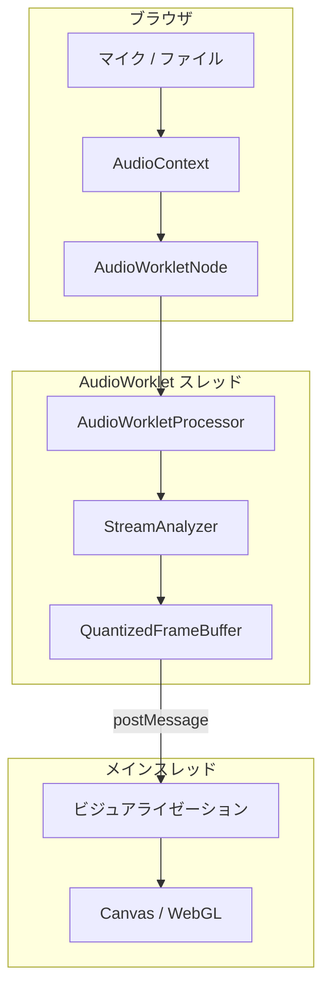

# WebAssembly ガイド

libsonare は WebAssembly にコンパイルでき、ブラウザで直接オーディオ解析が可能です。

## インストール

::: warning パッケージ未公開
npm パッケージ `@libraz/sonare` は現在ベータ版で、まだ公開されていません。現時点では、リポジトリから直接 WASM ファイルを使用するか、ソースからビルドしてください。
:::

### npm/yarn

```bash
# 未公開 - 近日公開予定
npm install @libraz/sonare
# または
yarn add @libraz/sonare
```

### CDN

```html
<script type="module">
  import { init, detectBpm } from 'https://unpkg.com/@libraz/sonare';
</script>
```

## 基本的な使い方

```typescript
import { init, detectBpm, detectKey, analyze } from '@libraz/sonare';

async function analyzeAudio() {
  // WASM モジュールを初期化
  await init();

  // AudioContext からオーディオデータを取得
  const audioCtx = new AudioContext();
  const response = await fetch('music.mp3');
  const arrayBuffer = await response.arrayBuffer();
  const audioBuffer = await audioCtx.decodeAudioData(arrayBuffer);

  // モノラルサンプルを取得
  const samples = audioBuffer.getChannelData(0);
  const sampleRate = audioBuffer.sampleRate;

  // BPM を検出
  const bpm = detectBpm(samples, sampleRate);
  console.log(`BPM: ${bpm}`);

  // キーを検出
  const key = detectKey(samples, sampleRate);
  console.log(`キー: ${key.name}`);

  // 完全解析
  const result = analyze(samples, sampleRate);
  console.log(result);
}
```

## ファイル入力

```typescript
async function analyzeFile(file: File) {
  await init();
  const audioCtx = new AudioContext();

  const arrayBuffer = await file.arrayBuffer();
  const audioBuffer = await audioCtx.decodeAudioData(arrayBuffer);
  const samples = audioBuffer.getChannelData(0);

  return analyze(samples, audioBuffer.sampleRate);
}

// ファイル入力での使用
const input = document.querySelector('input[type="file"]');
input.addEventListener('change', async (e) => {
  const file = e.target.files[0];
  const result = await analyzeFile(file);
  console.log(`BPM: ${result.bpm}`);
});
```

## 進捗レポート

```typescript
import { init, analyzeWithProgress } from '@libraz/sonare';

await init();

const result = analyzeWithProgress(samples, sampleRate, (progress, stage) => {
  const percent = Math.round(progress * 100);
  console.log(`${stage}: ${percent}%`);

  // UI を更新
  progressBar.style.width = `${percent}%`;
  statusText.textContent = stage;
});
```

## Web Worker の使用

メインスレッドをブロックしないように解析を Web Worker にオフロードします。

**worker.ts:**

```typescript
import { init, analyze, AnalysisResult } from '@libraz/sonare';

let initialized = false;

self.onmessage = async (e: MessageEvent) => {
  const { samples, sampleRate } = e.data;

  if (!initialized) {
    await init();
    initialized = true;
  }

  try {
    const result = analyze(samples, sampleRate);
    self.postMessage({ success: true, result });
  } catch (error) {
    self.postMessage({ success: false, error: error.message });
  }
};
```

**main.ts:**

```typescript
const worker = new Worker(new URL('./worker.ts', import.meta.url), {
  type: 'module'
});

function analyzeInWorker(
  samples: Float32Array,
  sampleRate: number
): Promise<AnalysisResult> {
  return new Promise((resolve, reject) => {
    worker.onmessage = (e) => {
      if (e.data.success) {
        resolve(e.data.result);
      } else {
        reject(new Error(e.data.error));
      }
    };
    worker.postMessage({ samples, sampleRate });
  });
}
```

## ステレオからモノラルへの変換

```typescript
async function getMonoSamples(audioBuffer: AudioBuffer): Promise<Float32Array> {
  if (audioBuffer.numberOfChannels === 1) {
    return audioBuffer.getChannelData(0);
  }

  // ステレオをモノラルにミックス
  const left = audioBuffer.getChannelData(0);
  const right = audioBuffer.getChannelData(1);
  const mono = new Float32Array(left.length);

  for (let i = 0; i < left.length; i++) {
    mono[i] = (left[i] + right[i]) / 2;
  }

  return mono;
}
```

## パフォーマンスのヒント

### ダウンサンプリング

BPM 検出には 22050 Hz で十分です:

```typescript
import { resample, detectBpm } from '@libraz/sonare';

// 高速解析のためにダウンサンプル
const downsampled = resample(samples, 48000, 22050);
const bpm = detectBpm(downsampled, 22050);
```

### セグメント解析

長いファイルの場合、関連するセクションのみを解析:

```typescript
function analyzeSegment(
  samples: Float32Array,
  sampleRate: number,
  startSec: number,
  endSec: number
) {
  const start = Math.floor(startSec * sampleRate);
  const end = Math.floor(endSec * sampleRate);
  const segment = samples.slice(start, end);

  return analyze(segment, sampleRate);
}

// サビのみを解析（60-90秒）
const result = analyzeSegment(samples, sampleRate, 60, 90);
```

## React の例

```tsx
import { useState } from 'react';
import { init, analyzeWithProgress, AnalysisResult } from '@libraz/sonare';

function AudioAnalyzer() {
  const [progress, setProgress] = useState(0);
  const [stage, setStage] = useState('');
  const [result, setResult] = useState<AnalysisResult | null>(null);

  const handleFileChange = async (e: React.ChangeEvent<HTMLInputElement>) => {
    const file = e.target.files?.[0];
    if (!file) return;

    await init();

    const audioCtx = new AudioContext();
    const arrayBuffer = await file.arrayBuffer();
    const audioBuffer = await audioCtx.decodeAudioData(arrayBuffer);
    const samples = audioBuffer.getChannelData(0);

    const analysisResult = analyzeWithProgress(
      samples,
      audioBuffer.sampleRate,
      (p, s) => {
        setProgress(p);
        setStage(s);
      }
    );

    setResult(analysisResult);
  };

  return (
    <div>
      <input type="file" accept="audio/*" onChange={handleFileChange} />

      {stage && (
        <div>
          <div>{stage}: {Math.round(progress * 100)}%</div>
          <progress value={progress} max={1} />
        </div>
      )}

      {result && (
        <div>
          <p>BPM: {result.bpm.toFixed(1)}</p>
          <p>キー: {result.key.name}</p>
        </div>
      )}
    </div>
  );
}
```

## ストリーミング解析

ストリーミング API は低レイテンシでリアルタイム音声解析を実現します。バッチ解析とは異なり、音声が到着するたびにチャンクごとに処理します。

::: info バッチ vs ストリーミング
| アプローチ | 用途 | レイテンシ | 機能 |
|-----------|------|----------|------|
| **バッチ** | 録音済みファイル | 高 | 完全解析（BPM、コード、セクション） |
| **ストリーミング** | ライブ音声、ビジュアライゼーション | 低（〜10ms） | Mel、クロマ、オンセット、プログレッシブ BPM/キー |
:::

### アーキテクチャ概要



### 基本的な例

```typescript
import { init, StreamAnalyzer } from '@libraz/sonare';

async function setupStreaming() {
  await init();

  const audioCtx = new AudioContext();
  const stream = await navigator.mediaDevices.getUserMedia({ audio: true });
  const source = audioCtx.createMediaStreamSource(stream);

  // 60fps 用にスロットリングしたアナライザーを作成
  const analyzer = new StreamAnalyzer(
    audioCtx.sampleRate,
    2048,   // nFft
    512,    // hopLength
    128,    // nMels
    true,   // computeMel
    true,   // computeChroma
    true,   // computeOnset
    4       // 4 フレームごとに出力（44100Hz で約 60fps）
  );

  // シンプルさのため ScriptProcessor を使用（本番では AudioWorklet 推奨）
  const processor = audioCtx.createScriptProcessor(512, 1, 1);

  processor.onaudioprocess = (e) => {
    const input = e.inputBuffer.getChannelData(0);
    analyzer.process(input);

    const available = analyzer.availableFrames();
    if (available > 0) {
      const frames = analyzer.readFramesSoa(available);
      updateVisualization(frames);

      // プログレッシブ BPM/キー推定をチェック
      const stats = analyzer.stats();
      if (stats.estimate.updated) {
        console.log(`BPM: ${stats.estimate.bpm.toFixed(1)}`);
        console.log(`キー: ${stats.estimate.key}`);
      }
    }
  };

  source.connect(processor);
  processor.connect(audioCtx.destination);
}
```

### 帯域幅最適化

ニーズに応じて適切な出力形式を選択:

| 形式 | フレームあたりサイズ | 用途 |
|------|---------------------|------|
| `readFramesSoa()` | 〜600 バイト | 開発、デバッグ |
| `readFramesI16()` | 〜300 バイト | 高品質ビジュアライゼーション |
| `readFramesU8()` | 〜150 バイト | モバイル、帯域幅制限環境 |

### プログレッシブ推定

ストリーミング API は時間とともに精度が向上する**プログレッシブ BPM/キー推定**を提供:

```typescript
const stats = analyzer.stats();

// BPM（約 5 秒後に利用可能）
if (stats.estimate.bpm > 0) {
  const confidence = stats.estimate.bpmConfidence;
  console.log(`BPM: ${stats.estimate.bpm.toFixed(1)} (${(confidence * 100).toFixed(0)}%)`);
}

// キー（約 10 秒後に利用可能）
if (stats.estimate.key >= 0) {
  const keyNames = ['C', 'C#', 'D', 'D#', 'E', 'F', 'F#', 'G', 'G#', 'A', 'A#', 'B'];
  const keyName = keyNames[stats.estimate.key];
  const mode = stats.estimate.keyMinor ? 'マイナー' : 'メジャー';
  console.log(`キー: ${keyName} ${mode}`);
}
```

## ブラウザ互換性

| ブラウザ | 最小バージョン |
|---------|---------------|
| Chrome | 57+ |
| Firefox | 52+ |
| Safari | 11+ |
| Edge | 16+ |

要件:
- WebAssembly サポート
- Web Audio API
- ES2017+ (async/await)

## バンドルサイズ

| ファイル | サイズ | Gzip |
|---------|--------|------|
| `sonare.js` | ~34 KB | ~12 KB |
| `sonare.wasm` | ~228 KB | ~80 KB |
| **合計** | ~262 KB | ~92 KB |

## トラブルシューティング

### AudioContext が許可されない

モダンブラウザは AudioContext を作成する前にユーザー操作が必要:

```typescript
document.addEventListener('click', async () => {
  const audioCtx = new AudioContext();
  await audioCtx.resume();
});
```

### クロスオリジンの問題

他のドメインからオーディオを読み込む場合:

```typescript
const response = await fetch(url, {
  mode: 'cors',
  credentials: 'omit'
});
```

### メモリの問題

非常に長いオーディオファイルの場合、チャンクで解析を検討:

```typescript
const CHUNK_DURATION = 60; // 秒

for (let start = 0; start < totalDuration; start += CHUNK_DURATION) {
  const chunk = samples.slice(
    start * sampleRate,
    (start + CHUNK_DURATION) * sampleRate
  );
  // チャンクを解析
}
```
