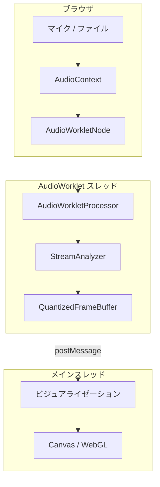

# WebAssembly ガイド

libsonare は WebAssembly にコンパイルでき、ブラウザで直接オーディオ解析が可能です。npm パッケージはデコード済みのモノラル `Float32Array` サンプルを受け取り、ファイルデコードは Web Audio API や別の JavaScript デコーダに任せます。

このページは、ブラウザアプリを作る人向けです。Python スクリプト、ターミナルのバッチ処理、ネイティブデスクトップツールを作る場合は、先に [はじめに](./getting-started.md) で別の利用環境を選んでください。

## ブラウザでの考え方

| 手順 | 内容 |
|------|------|
| 1. ファイルを取得する | `fetch`、`<input type="file">`、ドラッグ & ドロップ、その他のブラウザ入力を使う |
| 2. 音声をデコードする | `AudioContext.decodeAudioData(...)` または独自のデコーダを使う |
| 3. サンプルを選ぶ | 1 つのモノラルチャンネルを渡す、ステレオを自分でダウンミックスする、または対応するステレオ API を使う |
| 4. libsonare を呼ぶ | サンプルと `sampleRate` を解析、編集、マスタリング、ミキシング API に渡す |

初学者がつまずきやすい点は、MP3 の `ArrayBuffer` をそのまま解析関数へ渡してしまうことです。先にデコードしてください。ブラウザ版 libsonare が扱うのは、圧縮ファイルのバイト列ではなく PCM サンプルです。

::: details Float32Array・PCM・モノラル・ダウンミックスとは？
- **PCM サンプル** は、圧縮されていない生の波形 — 振幅値の長い列です。MP3/WAV の*ファイル*は圧縮・梱包されたバイト列で、デコードすると PCM になります。
- **`Float32Array`** は、そのサンプルを 32bit 浮動小数点（通常 −1〜1 の範囲）で 1 サンプル 1 要素として保持する、Web Audio API が使う JavaScript の typed array です。libsonare のブラウザ API はこれをそのまま受け取ります。
- **モノラル／ダウンミックス** — モノラルは 1 チャンネルです。ステレオは左右の独立したチャンネルを持ち、*ダウンミックス*はそれらを 1 つにまとめます（通常は平均）。これでモノラル API に 1 チャンネルを渡せます。
:::

## このページで身につくこと

このページを読むと、次のことを判断・実装できるようになります。

- WASM パッケージを正しくインストールし、初期化できる。
- ブラウザ上のファイルを PCM へデコードし、正しいチャンネルとサンプルレートの組を libsonare に渡せる。
- 1 回呼び出しの関数、`Audio`、`StreamAnalyzer`、`StreamingMasteringChain`、`Mixer`、`RealtimeEngine` を使い分けられる。
- ブラウザアプリとして出す前に、バンドルサイズ、Worker、AudioWorklet のトレードオフを理解できる。

## インストール

### npm/yarn

::: code-group

```bash [npm]
npm install @libraz/libsonare
```

```bash [yarn]
yarn add @libraz/libsonare
```

```bash [pnpm]
pnpm add @libraz/libsonare
```

:::

### CDN

```html
<script type="module">
  import { init, detectBpm } from 'https://unpkg.com/@libraz/libsonare';
</script>
```

## 基本的な使い方

```typescript
import { init, detectBpm, detectKey, analyze } from '@libraz/libsonare';

async function analyzeAudio() {
  // WASM モジュールを初期化
  await init();

  // AudioContext からオーディオデータを取得
  const audioCtx = new AudioContext();
  const response = await fetch('music.mp3');
  const arrayBuffer = await response.arrayBuffer();
  const audioBuffer = await audioCtx.decodeAudioData(arrayBuffer);

  // 1 つのモノラルチャンネルを取得。ステレオ両方を反映したい場合は明示的にダウンミックスします。
  const samples = audioBuffer.getChannelData(0);
  const sampleRate = audioBuffer.sampleRate;

  // BPM を検出
  const bpm = detectBpm(samples, sampleRate);
  console.log(`BPM: ${bpm}`);

  // キーを検出
  const key = detectKey(samples, sampleRate);
  console.log(`キー: ${key.name}`);

  // 完全解析
  const result = analyze(samples, sampleRate);
  console.log(result);
}
```

同じ 1 ファイル確認を CLI で行う場合:

```bash
sonare bpm music.mp3
sonare key music.mp3
sonare analyze music.mp3 --json
```

ブラウザビルドには librosa 互換ヘルパーも含まれます。ざっくり次の用途別に分かれます。

- **前処理（波形）** — `preemphasis` / `deemphasis`、`trimSilence` / `splitSilence`
- **フレーミング／サイズ揃え** — `frameSignal`、`padCenter`、`fixLength`、`fixFrames`
- **後処理（1 次元信号）** — `peakPick`、`vectorNormalize`
- **特徴量** — `pcen`（メルの動的レンジ圧縮）、`tonnetz`（ハーモニック空間射影）、`tempogram` / `plp`（テンポ表現）
- **単位変換** — `powerToDb` / `amplitudeToDb` / `dbToPower` / `dbToAmplitude`、`framesToSamples` / `samplesToFrames`

シグネチャは [JS API リファレンス](./js-api.md) を、librosa との対応関係は [librosa 互換性](./librosa-compatibility.md) を参照してください。

## ブラウザ内ミキシング

WASM パッケージからミキシングエンジンも使えます。ステムを一括でレンダーするだけなら `mixStereo(...)`、バス、センド、インサートオートメーション、ゴニオメーター、ストリップメーターが必要ならシーン JSON から作る `Mixer` を使います。

```typescript
import { init, Mixer, mixStereo, mixingScenePresetJson } from '@libraz/libsonare';

await init();

const rendered = mixStereo([vocalL, musicL], [vocalR, musicR], sampleRate, {
  faderDb: [-3, -12],
  pan: [0, -0.2],
  width: [1, 0.9],
});

const mixer = Mixer.fromSceneJson(mixingScenePresetJson('vocalReverbSend'), sampleRate, 512);
mixer.scheduleFaderAutomation(0, sampleRate * 4, -6, 's-curve');
const block = mixer.processStereo([vocalBlockL, musicBlockL], [vocalBlockR, musicBlockR]);
const meter = mixer.stripMeter(0, 'postFader');
mixer.delete();
```

詳しくは [ミキシングエンジン](./mixing.md) を参照してください。

組み込みミキサーシーンを CLI でレンダーする場合:

```bash
sonare mix \
  --preset vocalReverbSend \
  --input vocal.wav \
  --input music.wav \
  -o mixed.wav
```

## Audio クラス

スタンドアロン関数の代わりに、`Audio` クラスをオブジェクト指向的に使うこともできます。サンプルとサンプルレートを内部で保持するため、毎回の呼び出しで渡し直す必要がありません。

```typescript
import { init, Audio } from '@libraz/libsonare';

await init();

const audioCtx = new AudioContext();
const response = await fetch('music.mp3');
const arrayBuffer = await response.arrayBuffer();
const audioBuffer = await audioCtx.decodeAudioData(arrayBuffer);

// Audio インスタンスを作成
const audio = Audio.fromBuffer(
  audioBuffer.getChannelData(0),
  audioBuffer.sampleRate
);

// 解析
const bpm = audio.detectBpm();
const key = audio.detectKey();
const result = audio.analyze();

// エフェクト
const { harmonic, percussive } = audio.hpss();
const stretched = audio.timeStretch(1.5);
const shifted = audio.pitchShift(2);

// 特徴量
const mel = audio.melSpectrogram();
const mfcc = audio.mfcc();
const chroma = audio.chroma();
const pitch = audio.pitchPyin();

console.log(`BPM: ${bpm}, キー: ${key.name}`);
console.log(`中央値ピッチ: ${pitch.medianF0.toFixed(1)} Hz`);
```

上の解析・編集呼び出しに対応する CLI 例:

```bash
sonare analyze music.mp3 --json
sonare hpss music.mp3 --json
sonare pitch-shift music.wav --semitones 2 -o shifted.wav
sonare pitch music.mp3 --algorithm pyin --json
```

インスタンスメソッドの一覧は [JS API リファレンス](/ja/docs/js-api#audio-クラス) を参照してください。

## ブラウザ内マスタリング

`/ja/mastering` デモは、このページで説明しているものと同じ WASM パッケージを使用しています。音源のデコードはブラウザで行い、マスタリング処理は Web Worker で実行し、レンダリング後の WAV と JSON レポートはローカルで生成されます。

実装の詳細は [マスタリング実装](./mastering-implementation.md), [ブラウザ内ローカル処理](./glossary/concepts/browser-local-processing.md), [マスタリング](./glossary/mastering.md), [ステレオ、リミッター、ラウドネスコントロール](./glossary/mastering/stereo-limiter-loudness.md) を参照してください。

マスタリング API には、JSON ベースのアシスタント出力、音源プロファイル、配信プラットフォーム別のプレビューを返す `masteringAssistantSuggest(...)`、`masteringAudioProfile(...)`、`masteringStreamingPreview(...)` も含まれます。

シンプルなラウドネス正規化マスターを CLI で行う場合:

```bash
sonare mastering track.wav --target-lufs -14 --ceiling-db -1 -o master.wav
```

## ファイル入力

WASM ビルドには WAV/MP3/M4A デコーダは同梱されていません。圧縮形式を読めるかどうかは `AudioContext.decodeAudioData()` とユーザーのブラウザに依存します。

```typescript
async function analyzeFile(file: File) {
  await init();
  const audioCtx = new AudioContext();

  const arrayBuffer = await file.arrayBuffer();
  const audioBuffer = await audioCtx.decodeAudioData(arrayBuffer);
  const samples = audioBuffer.getChannelData(0);

  return analyze(samples, audioBuffer.sampleRate);
}

// ファイル入力での使用
const input = document.querySelector('input[type="file"]');
input.addEventListener('change', async (e) => {
  const file = e.target.files[0];
  const result = await analyzeFile(file);
  console.log(`BPM: ${result.bpm}`);
});
```

## 進捗レポート

```typescript
import { init, analyzeWithProgress } from '@libraz/libsonare';

await init();

const result = analyzeWithProgress(samples, sampleRate, (progress, stage) => {
  const percent = Math.round(progress * 100);
  console.log(`${stage}: ${percent}%`);

  // UI を更新
  progressBar.style.width = `${percent}%`;
  statusText.textContent = stage;
});
```

## Web Worker の使用

メインスレッドをブロックしないように解析を Web Worker にオフロードします。

**worker.ts:**

```typescript
import { init, analyze, AnalysisResult } from '@libraz/libsonare';

let initialized = false;

self.onmessage = async (e: MessageEvent) => {
  const { samples, sampleRate } = e.data;

  if (!initialized) {
    await init();
    initialized = true;
  }

  try {
    const result = analyze(samples, sampleRate);
    self.postMessage({ success: true, result });
  } catch (error) {
    self.postMessage({ success: false, error: error.message });
  }
};
```

**main.ts:**

```typescript
const worker = new Worker(new URL('./worker.ts', import.meta.url), {
  type: 'module'
});

function analyzeInWorker(
  samples: Float32Array,
  sampleRate: number
): Promise<AnalysisResult> {
  return new Promise((resolve, reject) => {
    worker.onmessage = (e) => {
      if (e.data.success) {
        resolve(e.data.result);
      } else {
        reject(new Error(e.data.error));
      }
    };
    worker.postMessage({ samples, sampleRate });
  });
}
```

## ステレオからモノラルへの変換

```typescript
async function getMonoSamples(audioBuffer: AudioBuffer): Promise<Float32Array> {
  if (audioBuffer.numberOfChannels === 1) {
    return audioBuffer.getChannelData(0);
  }

  // ステレオをモノラルにミックス
  const left = audioBuffer.getChannelData(0);
  const right = audioBuffer.getChannelData(1);
  const mono = new Float32Array(left.length);

  for (let i = 0; i < left.length; i++) {
    mono[i] = (left[i] + right[i]) / 2;
  }

  return mono;
}
```

## パフォーマンスのヒント

### ダウンサンプリング

BPM 検出には 22050 Hz で十分です:

```typescript
import { resample, detectBpm } from '@libraz/libsonare';

// 高速解析のためにダウンサンプル
const downsampled = resample(samples, 48000, 22050);
const bpm = detectBpm(downsampled, 22050);
```

### セグメント解析

長いファイルの場合、関連するセクションのみを解析:

```typescript
function analyzeSegment(
  samples: Float32Array,
  sampleRate: number,
  startSec: number,
  endSec: number
) {
  const start = Math.floor(startSec * sampleRate);
  const end = Math.floor(endSec * sampleRate);
  const segment = samples.slice(start, end);

  return analyze(segment, sampleRate);
}

// サビのみを解析（60-90秒）
const result = analyzeSegment(samples, sampleRate, 60, 90);
```

## React の例

```tsx
import { useState } from 'react';
import { init, analyzeWithProgress, AnalysisResult } from '@libraz/libsonare';

function AudioAnalyzer() {
  const [progress, setProgress] = useState(0);
  const [stage, setStage] = useState('');
  const [result, setResult] = useState<AnalysisResult | null>(null);

  const handleFileChange = async (e: React.ChangeEvent<HTMLInputElement>) => {
    const file = e.target.files?.[0];
    if (!file) return;

    await init();

    const audioCtx = new AudioContext();
    const arrayBuffer = await file.arrayBuffer();
    const audioBuffer = await audioCtx.decodeAudioData(arrayBuffer);
    const samples = audioBuffer.getChannelData(0);

    const analysisResult = analyzeWithProgress(
      samples,
      audioBuffer.sampleRate,
      (p, s) => {
        setProgress(p);
        setStage(s);
      }
    );

    setResult(analysisResult);
  };

  return (
    <div>
      <input type="file" accept="audio/*" onChange={handleFileChange} />

      {stage && (
        <div>
          <div>{stage}: {Math.round(progress * 100)}%</div>
          <progress value={progress} max={1} />
        </div>
      )}

      {result && (
        <div>
          <p>BPM: {result.bpm.toFixed(1)}</p>
          <p>キー: {result.key.name}</p>
        </div>
      )}
    </div>
  );
}
```

## ストリーミング解析

ストリーミング API は低レイテンシでリアルタイム音声解析を実現します。バッチ解析とは異なり、音声が到着するたびにチャンクごとに処理します。

::: info バッチ vs ストリーミング
| アプローチ | 用途 | レイテンシ | 機能 |
|-----------|------|----------|------|
| **バッチ** | 録音済みファイル | 高 | 完全解析（BPM、コード、セクション） |
| **ストリーミング** | ライブ音声、ビジュアライゼーション | 低（〜10ms） | Mel、クロマ、オンセット、プログレッシブ BPM/キー |
:::

### アーキテクチャ概要


```mermaid
flowchart TB
    subgraph ブラウザ
        A[マイク / ファイル] --> B[AudioContext]
        B --> C[AudioWorkletNode]
    end

    subgraph AudioWorklet スレッド
        C --> D[AudioWorkletProcessor]
        D --> E[StreamAnalyzer]
        E --> F[QuantizedFrameBuffer]
    end

    subgraph メインスレッド
        F -->|postMessage| G[ビジュアライゼーション]
        G --> H[Canvas / WebGL]
    end
```

### 基本的な例

```typescript
import { init, StreamAnalyzer } from '@libraz/libsonare';

async function setupStreaming() {
  await init();

  const audioCtx = new AudioContext();
  const stream = await navigator.mediaDevices.getUserMedia({ audio: true });
  const source = audioCtx.createMediaStreamSource(stream);

  // 60fps 用にスロットリングしたアナライザーを作成
  const analyzer = new StreamAnalyzer({
    sampleRate: audioCtx.sampleRate,
    nFft: 2048,
    hopLength: 512,
    nMels: 128,
    computeMel: true,
    computeChroma: true,
    computeOnset: true,
    emitEveryNFrames: 4, // 4 フレームごとに出力（44100Hz で約 60fps）
  });

  // シンプルさのため ScriptProcessor を使用（本番では AudioWorklet 推奨）
  const processor = audioCtx.createScriptProcessor(512, 1, 1);

  processor.onaudioprocess = (e) => {
    const input = e.inputBuffer.getChannelData(0);
    analyzer.process(input);

    const available = analyzer.availableFrames();
    if (available > 0) {
      const frames = analyzer.readFrames(available);
      updateVisualization(frames);

      // プログレッシブ BPM/キー推定をチェック
      const stats = analyzer.stats();
      if (stats.estimate.updated) {
        const keyNames = ['C', 'C#', 'D', 'D#', 'E', 'F', 'F#', 'G', 'G#', 'A', 'A#', 'B'];
        const mode = stats.estimate.keyMinor ? 'マイナー' : 'メジャー';
        console.log(`BPM: ${stats.estimate.bpm.toFixed(1)}`);
        // estimate.key は文字列ではなく PitchClass のインデックス（0〜11）
        console.log(`キー: ${keyNames[stats.estimate.key]} ${mode}`);
      }
    }
  };

  source.connect(processor);
  processor.connect(audioCtx.destination);
}
```

### AudioWorklet 連携

本番用途では、メインスレッドをブロックしないよう `StreamAnalyzer` を AudioWorklet 内で動かします。

リアルタイムエンジン再生では、このパッケージに `@libraz/libsonare/worklet` の
AudioWorklet bridge と `@libraz/libsonare/rt` の軽量 realtime module も含まれます。
そのエンジン向け経路は [リアルタイムとストリーミング](./realtime-streaming.md) を参照してください。下の例は独自の analyzer worklet を作る場合のものです。

::: warning AudioWorklet での WASM 利用
AudioWorklet での WASM ロードには、特別な扱いが必要です。WASM モジュールはワークレットのコンテキスト内でロード・インスタンス化する必要があります。
:::

**analyzer-worklet.ts:**

```typescript
import { init, StreamAnalyzer } from '@libraz/libsonare';

class AnalyzerWorklet extends AudioWorkletProcessor {
  private analyzer?: StreamAnalyzer;
  private frameCounter = 0;

  constructor() {
    super();
    void init().then(() => {
      // sampleRate は AudioWorkletGlobalScope のグローバル
      this.analyzer = new StreamAnalyzer({
        sampleRate,
        nFft: 2048,
        hopLength: 512,
        nMels: 64, // 帯域幅のため削減
        computeMel: true,
        computeChroma: true,
        computeOnset: true,
        emitEveryNFrames: 4,
      });
    });
  }

  process(inputs: Float32Array[][]): boolean {
    const input = inputs[0]?.[0];
    if (!input || input.length === 0 || !this.analyzer) return true;

    this.analyzer.process(input);

    const available = this.analyzer.availableFrames();
    if (available >= 4) {
      const frames = this.analyzer.readFrames(available);

      // ゼロコピー転送
      this.port.postMessage({
        type: 'frames',
        data: frames
      }, [
        frames.timestamps.buffer,
        frames.mel.buffer,
        frames.chroma.buffer
      ]);
    }

    // 定期的に統計情報を送信
    if (++this.frameCounter % 100 === 0) {
      this.port.postMessage({
        type: 'stats',
        data: this.analyzer.stats()
      });
    }

    return true;
  }
}

registerProcessor('analyzer-worklet', AnalyzerWorklet);
```

**main.ts:**

```typescript
const audioCtx = new AudioContext();
await audioCtx.audioWorklet.addModule('analyzer-worklet.js');

const workletNode = new AudioWorkletNode(audioCtx, 'analyzer-worklet');

workletNode.port.onmessage = (e) => {
  if (e.data.type === 'frames') {
    renderVisualization(e.data.data);
  } else if (e.data.type === 'stats') {
    updateBpmDisplay(e.data.data.estimate);
  }
};

// 音声ソースを接続
const stream = await navigator.mediaDevices.getUserMedia({ audio: true });
const source = audioCtx.createMediaStreamSource(stream);
source.connect(workletNode);
```

### 帯域幅最適化

TypeScript の `StreamAnalyzer` ラッパーには、3 つの読み出し方法があります。UI に必要な精度と、スレッド間で送れるデータ量に応じて選びます。

| メソッド | 戻り値 | 使う場面 |
|----------|--------|----------|
| `readFrames(maxFrames)` | `Float32Array` / `Int32Array` を持つ `FrameBuffer` | 解析や高品質な可視化でフル精度が必要なとき |
| `readFramesI16(maxFrames)` | `StreamFramesI16` | メーターや一般的な可視化で、転送量を減らしたいとき |
| `readFramesU8(maxFrames)` | `StreamFramesU8` | モバイルや高頻度更新で、転送量をかなり小さくしたいとき |

`StreamConfig.outputFormat` を設定すると、アナライザーが内部で対応するフレーム型を直接生成します。

| `outputFormat` | 内部フレーム型 |
|----------------|----------------|
| `0` | Float32 |
| `1` | Int16 |
| `2` | Uint8 |

これにより、`postMessage` の前に JS 側で量子化する必要がなくなります。

::: details 「Structure-of-Arrays」と transferable オブジェクトとは？
- **Structure-of-Arrays（SoA）** は、フレームごとのオブジェクトの配列ではなく、各フィールドを独立したフラットな typed array に持つ形式です（タイムスタンプは 1 本、メル値は別の 1 本…）。スライスも別スレッドへの受け渡しも安価になります。
- **transferable オブジェクト** は、`postMessage` がコピーせず*移動*できる `ArrayBuffer` です。所有権が移る（送信側のビューは空になる）ため、音声フレームのスレッド間受け渡しがほぼ瞬時になります。バッファは第 2 引数に列挙します: `postMessage(msg, [buffer, ...])`。
- **量子化** はここでは、各 float をより小さい 16bit / 8bit 整数に詰めることを指します。送るバイト数は減りますが精度は落ちます（メーターやヒートマップには十分、後段の DSP には不向き）。
:::

| アプローチ | フレームあたりサイズ目安 | 用途 |
|------------|--------------------------|------|
| `readFrames()` (Float32 SoA) | 〜600 バイト | 通常用途・フル精度 |
| JS 側で mel をダウンサンプル + Int16 量子化 | 〜300 バイト | 高品質ビジュアライゼーション |
| JS 側で mel をダウンサンプル + Uint8 量子化 | 〜150 バイト | モバイル、帯域幅制限環境 |

### プログレッシブ推定

ストリーミング API は時間とともに精度が向上する**プログレッシブ BPM/キー推定**を提供:

```typescript
const stats = analyzer.stats();

// BPM（約 10 秒後に利用可能 — StreamConfig.bpmUpdateIntervalSec 既定値）
if (stats.estimate.bpm > 0) {
  const confidence = stats.estimate.bpmConfidence;
  console.log(`BPM: ${stats.estimate.bpm.toFixed(1)} (${(confidence * 100).toFixed(0)}%)`);
}

// キー（約 5 秒後に利用可能 — StreamConfig.keyUpdateIntervalSec 既定値）
if (stats.estimate.key >= 0) {
  const keyNames = ['C', 'C#', 'D', 'D#', 'E', 'F', 'F#', 'G', 'G#', 'A', 'A#', 'B'];
  const keyName = keyNames[stats.estimate.key];
  const mode = stats.estimate.keyMinor ? 'マイナー' : 'メジャー';
  console.log(`キー: ${keyName} ${mode}`);
}
```

### ビジュアライゼーション例

```typescript
import type { FrameBuffer } from '@libraz/libsonare';

function renderVisualization(frames: FrameBuffer, nMels: number) {
  const { nFrames, mel, chroma, onsetStrength } = frames;

  // メルスペクトログラムを描画（スクロール表示）。値は線形パワーなので 0-1 にクランプ／スケールする。
  for (let f = 0; f < nFrames; f++) {
    for (let m = 0; m < nMels; m++) {
      const value = Math.min(1, mel[f * nMels + m]);
      const c = Math.round(value * 255);
      const color = `rgb(${c}, ${Math.round(c * 0.5)}, ${255 - c})`;
      // (scrollX + f, nMels - m) にピクセルを描画
    }
  }

  // クロマ（12 ピッチクラス）を描画
  for (let f = 0; f < nFrames; f++) {
    for (let c = 0; c < 12; c++) {
      const value = chroma[f * 12 + c];
      // クロマバーを描画
    }
  }

  // 強いオンセットでエフェクトをトリガー（線形単位）
  for (let f = 0; f < nFrames; f++) {
    if (onsetStrength[f] > 1.5) { // 素材に合わせて閾値を調整
      triggerBeatEffect();
    }
  }
}
```

## 逆再構成

WASM ビルドには逆再構成ヘルパーが同梱されており、メルスペクトログラムや MFCC 行列からスペクトルや音声へ、ブラウザ内で完結して戻せます。

```typescript
import { melSpectrogram, melToAudio, mfcc, mfccToAudio, init } from '@libraz/libsonare';

await init();

// メル → 音声（Griffin-Lim による位相復元）
const mel = melSpectrogram(samples, sampleRate, 2048, 512, 128);
const reconstructed = melToAudio(mel.power, mel.nMels, mel.nFrames, sampleRate);

// MFCC → 音声
const m = mfcc(samples, sampleRate, 2048, 512, 128, 20);
const fromMfcc = mfccToAudio(m.coefficients, m.nMfcc, m.nFrames, mel.nMels, sampleRate);
```

ソースビルド C++ CLI での対応コマンド:

```bash
sonare mel-to-audio music.wav -o mel-reconstructed.wav
sonare mfcc-to-audio music.wav -o mfcc-reconstructed.wav
```

| 関数 | 戻り値 | 備考 |
|------|--------|------|
| `melToStft(melPower, nMels, nFrames, sampleRate, nFft?, hopLength?, fmin?, fmax?)` | `StftPowerResult` `{ nBins, nFrames, power }` | メルフィルタバンクの擬似逆変換 |
| `melToAudio(melPower, nMels, nFrames, sampleRate, nFft?, hopLength?, nIter?, fmin?, fmax?)` | `Float32Array` | Griffin-Lim による音声合成 |
| `mfccToMel(mfccCoefficients, nMfcc, nFrames, nMels?)` | `MelPowerResult` `{ nMels, nFrames, power }` | 逆 DCT でメルスペクトログラムへ |
| `mfccToAudio(mfccCoefficients, nMfcc, nFrames, nMels, sampleRate, nFft?, hopLength?, nIter?, fmin?, fmax?)` | `Float32Array` | MFCC → メル → 音声を一度に |

::: warning ロスのある往復
これらは*振幅*を再構成し、位相を Griffin-Lim で推定するため、出力は近似です。ソニフィケーション・試聴・可視化には十分ですが、ビット精度の復元には使えません。完全なパイプラインと注意点は [逆変換特徴量](./inverse-features.md) を参照してください。
:::

## Streaming Retune

`StreamingRetune` は libsonare 1.2.1 で追加された、ブロック単位のモノラル retune 用 WASM wrapper です。ライブ入力やチャンク処理で、ブロック間の状態を保ったままピッチを動かしたい場合に使います。

```typescript
import { init, StreamingRetune } from '@libraz/libsonare';

await init();

const retune = new StreamingRetune({ semitones: 3, mix: 1 });
retune.prepare(48000, 512);

try {
  const shifted = retune.processMono(inputBlock);
  retune.setConfig({ semitones: -2, mix: 0.75 });
  const next = retune.processMono(nextInputBlock);
  console.log(shifted, next, retune.grainSize());
} finally {
  retune.delete();
}
```

ファイル単位のオフライン処理をターミナルで行う場合は、近い CLI コマンドとして次を使います。

```bash
sonare pitch-shift vocal.wav --semitones 3 -o shifted.wav
sonare voice-change vocal.wav --pitch-semitones 3 --formant-factor 1.0 -o voice.wav
```

## ブラウザ互換性

| ブラウザ | 最小バージョン |
|---------|---------------|
| Chrome | 57+ |
| Firefox | 52+ |
| Safari | 11+ |
| Edge | 16+ |

要件:
- WebAssembly サポート
- Web Audio API
- ES2017+ (async/await)

## バンドルサイズ

| ファイル | サイズ | Gzip |
|---------|--------|------|
| `sonare.js` | ~50 KB | ~13 KB |
| `index.js` | ~64 KB | ~12 KB |
| `sonare.wasm` | ~1,607 KB | ~573 KB |
| **合計** | ~1,721 KB | ~598 KB |

## トラブルシューティング

### AudioContext が許可されない

モダンブラウザは AudioContext を作成する前にユーザー操作が必要:

```typescript
document.addEventListener('click', async () => {
  const audioCtx = new AudioContext();
  await audioCtx.resume();
});
```

### クロスオリジンの問題

他のドメインからオーディオを読み込む場合:

```typescript
const response = await fetch(url, {
  mode: 'cors',
  credentials: 'omit'
});
```

### メモリの問題

非常に長いオーディオファイルの場合、チャンクで解析を検討:

```typescript
const CHUNK_DURATION = 60; // 秒

for (let start = 0; start < totalDuration; start += CHUNK_DURATION) {
  const chunk = samples.slice(
    start * sampleRate,
    (start + CHUNK_DURATION) * sampleRate
  );
  // チャンクを解析
}
```
